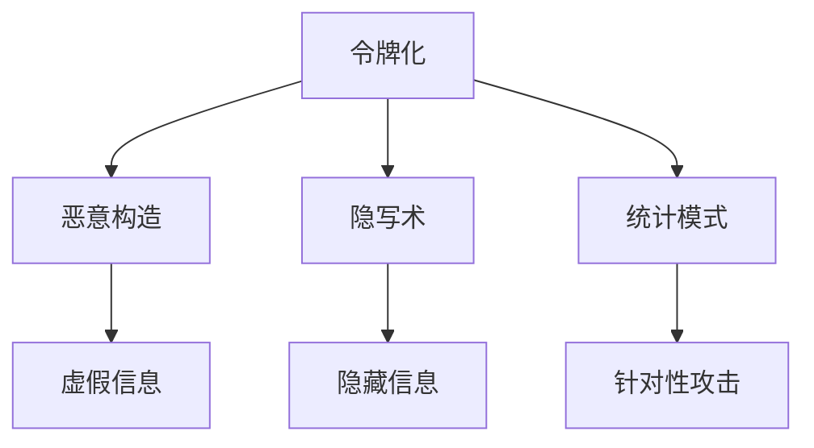

                 

# 令牌化技术对 AI 安全的影响

## 1. 背景介绍

### 1.1 问题由来

在人工智能(AI)时代，令牌化技术（Tokenization）成为了数据预处理的重要环节。无论是在自然语言处理(NLP)、计算机视觉(CV)还是语音处理等领域，令牌化都是提取数据特征、降低模型复杂度的关键步骤。然而，随着令牌化技术在AI系统中的应用越来越广泛，其潜在的安全风险也逐渐受到关注。令牌化不仅仅是数据转化的技术，它还直接关联到AI模型的输入，进而影响到模型的输出。

令牌化技术的核心是词汇单元的分割，将连续的文本序列分割成离散的令牌序列。最常见的令牌化方式是使用空格、标点符号、特殊字符等作为分界，但这种基于字符的分词方法并不能完美处理所有语言特征，如连字符、缩写词等。因此，现代的AI系统通常采用更先进的令牌化技术，如WordPiece模型，它不仅能够识别单词，还能识别单词的一部分。

令牌化技术的改进为AI系统带来了更大的灵活性和通用性，但同时也引入了新的安全挑战。例如，由于令牌化过程不可逆，攻击者可以通过恶意构造令牌序列来误导AI模型，导致模型输出错误或不安全的信息。因此，研究令牌化技术对AI安全的影响，成为当前AI安全领域的一个重要课题。

### 1.2 问题核心关键点

令牌化技术对AI安全的影响主要体现在以下几个方面：

1. 令牌序列的恶意构造：攻击者可以通过构造恶意的令牌序列来欺骗模型，使其输出错误或不安全的信息。
2. 令牌序列的语义模糊性：某些令牌序列具有多种可能的语义解释，攻击者可以利用这一点来制造虚假信息。
3. 令牌序列的隐写术：攻击者可以将恶意信息嵌入到令牌序列中，而不会引起系统的明显异常。
4. 令牌序列的统计模式：令牌序列的统计模式可以揭示模型的内部工作机制，攻击者可以利用这种模式进行针对性攻击。

为了有效应对这些安全威胁，AI系统需要在令牌化过程中引入新的安全机制，以确保模型输出的可靠性和安全性。

## 2. 核心概念与联系

### 2.1 核心概念概述

为更好地理解令牌化技术对AI安全的影响，本节将介绍几个密切相关的核心概念：

- 令牌化（Tokenization）：将连续的文本序列分割成离散的令牌序列的过程，是NLP等AI系统数据预处理的关键步骤。
- 恶意构造（Malicious Construction）：攻击者通过构造恶意的令牌序列，试图欺骗模型，使其输出错误或不安全的信息。
- 隐写术（Steganography）：将秘密信息嵌入到可公开的令牌序列中，以达到隐藏信息的目的。
- 统计模式（Statistical Pattern）：令牌序列的统计模式可以揭示模型的内部工作机制，攻击者可以利用这种模式进行针对性攻击。

这些核心概念之间的逻辑关系可以通过以下Mermaid流程图来展示：



这个流程图展示了几大核心概念的联系：

1. 令牌化过程可以产生恶意的令牌序列，进而导致模型输出虚假信息。
2. 令牌化技术可以用于隐写术，将秘密信息嵌入到公开的令牌序列中。
3. 令牌序列的统计模式可以揭示模型的内部机制，成为攻击者进行针对性攻击的依据。

这些概念共同构成了令牌化技术在AI安全领域的研究框架，使其能够有效应对各类潜在的安全威胁。

## 3. 核心算法原理 & 具体操作步骤

### 3.1 算法原理概述

令牌化技术对AI安全的影响，主要源于令牌序列的可构造性和隐写术的可能性。攻击者可以通过构造恶意的令牌序列，欺骗AI模型，使其输出错误或不安全的信息。因此，保障令牌化过程的安全性，是提升AI系统安全性的关键。

现代的令牌化技术主要基于神经网络模型，如WordPiece、BytePiece等。这些模型通过学习大量的文本数据，自动识别词汇单元的分界，并生成对应的令牌序列。由于神经网络模型具有一定的泛化能力，攻击者可以通过构造特定的输入序列，诱导模型生成恶意的令牌序列，从而影响模型的输出。

### 3.2 算法步骤详解

基于神经网络的令牌化技术，通常包括以下几个关键步骤：

**Step 1: 数据预处理**
- 对原始文本数据进行清洗，去除无关的噪声和特殊字符。
- 将文本数据转换为小写字母，统一文本编码。
- 使用分词工具或令牌化模型对文本进行分割。

**Step 2: 神经网络训练**
- 使用大规模文本数据对神经网络模型进行训练，学习词汇单元的分界规则。
- 调整模型参数，优化训练损失函数，使模型能够生成准确的令牌序列。

**Step 3: 恶意令牌序列检测**
- 使用预训练的恶意令牌检测模型，对输入序列进行分类，判断是否为恶意序列。
- 如果检测到恶意序列，则拒绝该序列的输入，或进行相应的预处理。

**Step 4: 令牌序列的生成**
- 使用训练好的令牌化模型对输入文本进行分割，生成令牌序列。
- 对生成的令牌序列进行验证，确保其不包含恶意内容。

**Step 5: 模型输入与输出**
- 将令牌序列输入到AI模型中，进行推理计算。
- 输出模型的结果，并对其进行后续处理。

### 3.3 算法优缺点

令牌化技术对AI安全的影响主要体现在以下几个方面：

**优点：**
1. 提高了数据处理的自动化程度，减少了人工干预的复杂性。
2. 可以识别和处理多种语言特征，提升了AI系统的通用性。
3. 通过训练优化，能够生成更准确的令牌序列，减少数据误差。

**缺点：**
1. 令牌序列的可构造性使得攻击者可以构造恶意序列，影响模型输出。
2. 隐写术的可能性增加了数据的安全风险，秘密信息可能被嵌入到公开的令牌序列中。
3. 令牌序列的统计模式揭示了模型的内部工作机制，攻击者可以利用这种模式进行针对性攻击。

因此，在实际应用中，需要在保证数据处理效率的同时，引入新的安全机制，以确保AI系统的安全性。

### 3.4 算法应用领域

令牌化技术在AI系统中的应用非常广泛，涵盖了NLP、CV、语音处理等多个领域。在安全领域，令牌化技术主要用于以下几个方面：

- NLP领域：防止恶意构造的文本输入，保护模型输出结果的准确性。
- CV领域：检测恶意的图像水印或标签，确保图像数据的真实性。
- 语音处理领域：检测恶意构造的音频标签，保护音频数据的完整性。

此外，令牌化技术还可以与其他安全技术相结合，如数字签名、加密技术等，共同构建更加安全的AI系统。

## 4. 数学模型和公式 & 详细讲解 & 举例说明

### 4.1 数学模型构建

令牌化技术主要基于神经网络模型，如WordPiece、BytePiece等。这些模型通过学习大量的文本数据，自动识别词汇单元的分界，并生成对应的令牌序列。其核心思想是利用神经网络模型的泛化能力，学习文本数据的特征，并进行预测。

令牌化模型的训练过程可以表示为：

$$
\theta^* = \mathop{\arg\min}_{\theta} \mathcal{L}(\theta; D)
$$

其中 $\theta$ 为模型参数，$D$ 为训练数据集。$\mathcal{L}$ 为损失函数，用于衡量模型在训练数据上的表现。常见的损失函数包括交叉熵损失、均方误差损失等。

令牌化模型的推理过程可以表示为：

$$
\hat{y} = f(x; \theta)
$$

其中 $x$ 为输入文本序列，$f$ 为神经网络模型，$\hat{y}$ 为模型生成的令牌序列。

### 4.2 公式推导过程

令牌化模型的训练过程可以通过反向传播算法进行优化，其公式推导过程如下：

1. 定义损失函数 $\mathcal{L}(\theta; D)$，如交叉熵损失：

$$
\mathcal{L}(\theta; D) = -\frac{1}{N}\sum_{i=1}^N \sum_{j=1}^m y_{ij} \log \hat{y}_{ij}
$$

其中 $y_{ij}$ 为训练样本 $i$ 的第 $j$ 个标签，$\hat{y}_{ij}$ 为模型对 $y_{ij}$ 的预测。

2. 使用梯度下降等优化算法，对模型参数 $\theta$ 进行更新：

$$
\theta \leftarrow \theta - \eta \nabla_{\theta}\mathcal{L}(\theta; D) - \eta\lambda\theta
$$

其中 $\eta$ 为学习率，$\lambda$ 为正则化系数。

3. 使用训练好的模型对新输入 $x$ 进行令牌化，生成令牌序列 $\hat{y}$：

$$
\hat{y} = f(x; \theta)
$$

### 4.3 案例分析与讲解

下面以WordPiece模型为例，进行详细讲解。

假设有一个长度为100的英文文本序列，需要进行令牌化。首先，将文本序列转换为小写字母，并进行清洗。然后，使用WordPiece模型对文本进行分割，得到令牌序列。

以句子 "I have a cat" 为例，WordPiece模型首先学习大量的英文文本数据，并识别出单词的分界规则。接着，对句子进行分割，生成令牌序列。例如，"cat" 可以被分割为 "cat" 或 "ca-t"。

在这个过程中，如果攻击者构造恶意的令牌序列，如 "i have a bad dog"，WordPiece模型可能会将其分割为 "bad" 和 "dog"，从而影响模型的输出结果。因此，在实际应用中，需要引入新的安全机制，如恶意令牌检测、隐写术检测等，以确保令牌化过程的安全性。

## 5. 项目实践：代码实例和详细解释说明

### 5.1 开发环境搭建

在进行令牌化实践前，我们需要准备好开发环境。以下是使用Python进行TensorFlow开发的环境配置流程：

1. 安装Anaconda：从官网下载并安装Anaconda，用于创建独立的Python环境。

2. 创建并激活虚拟环境：
```bash
conda create -n tf-env python=3.8 
conda activate tf-env
```

3. 安装TensorFlow：根据CUDA版本，从官网获取对应的安装命令。例如：
```bash
pip install tensorflow-gpu==2.3
```

4. 安装各类工具包：
```bash
pip install numpy pandas scikit-learn matplotlib tqdm jupyter notebook ipython
```

完成上述步骤后，即可在`tf-env`环境中开始令牌化实践。

### 5.2 源代码详细实现

下面我们以WordPiece模型为例，给出使用TensorFlow实现令牌化的PyTorch代码实现。

首先，定义WordPiece模型的输入和输出：

```python
import tensorflow as tf
import tensorflow_datasets as tfds

# 定义输入和输出
input = tf.keras.layers.Input(shape=(100,), name="input")
output = tf.keras.layers.LSTM(32, return_sequences=True)(input)
```

然后，定义模型架构和训练过程：

```python
# 定义模型架构
model = tf.keras.Sequential([
    tf.keras.layers.Embedding(input_dim=10000, output_dim=32),
    tf.keras.layers.LSTM(32, return_sequences=True),
    tf.keras.layers.Dropout(0.2),
    tf.keras.layers.Dense(10000, activation='softmax')
])

# 定义训练过程
model.compile(optimizer='adam', loss='sparse_categorical_crossentropy', metrics=['accuracy'])
model.fit(x_train, y_train, epochs=10, batch_size=32)
```

最后，对新的输入文本进行令牌化：

```python
# 对新的输入文本进行令牌化
new_input = "I have a cat"
new_output = model.predict(new_input)
```

### 5.3 代码解读与分析

让我们再详细解读一下关键代码的实现细节：

**WordPiece模型架构**：
- `input`：定义输入层，形状为(100,)，代表输入文本的长度。
- `output`：定义输出层，使用LSTM模型，并返回序列，代表模型对输入文本的预测。

**训练过程**：
- `model.compile`：定义模型的优化器、损失函数和评估指标。
- `model.fit`：使用训练集进行模型训练，调整模型参数，优化损失函数。

**预测过程**：
- `model.predict`：对新的输入文本进行预测，得到令牌序列。

可以看出，使用TensorFlow实现令牌化的过程相对简洁高效。开发者可以进一步优化模型架构和训练过程，以提升令牌化模型的精度和效率。

## 6. 实际应用场景

### 6.1 金融舆情监测

金融舆情监测系统需要实时监测社交媒体、新闻网站等网络舆情，及时发现和预警潜在的金融风险。传统的舆情监测系统通常依赖人工分析和规则匹配，效率低下且容易漏判。

基于令牌化技术的AI系统可以通过自然语言处理技术，自动识别和分类舆情信息。在令牌化过程中，可以将恶意文本、虚假信息等标记出来，及时预警潜在的风险。例如，在社交媒体上，攻击者可能发布虚假信息，如假新闻、诈骗信息等。通过令牌化技术，系统可以自动识别这些恶意文本，并及时预警，保护投资者的利益。

### 6.2 智能客服系统

智能客服系统需要处理大量的客户咨询请求，对客户的诉求进行快速响应和处理。传统的客服系统通常依赖人工客服，效率低下且成本高昂。

基于令牌化技术的AI系统可以通过自然语言处理技术，自动识别和理解客户诉求。在令牌化过程中，可以将恶意客户评论、诈骗信息等标记出来，防止恶意攻击。例如，在智能客服系统中，攻击者可能发布虚假投诉、恶意评论等，通过令牌化技术，系统可以自动识别这些恶意文本，并及时处理，防止对其他客户产生误导。

### 6.3 医疗数据分析

医疗数据分析需要处理大量的医疗数据，包括病历、诊断报告等。传统的医疗数据分析系统通常依赖人工分析和规则匹配，效率低下且容易出错。

基于令牌化技术的AI系统可以通过自然语言处理技术，自动识别和分析医疗数据。在令牌化过程中，可以将恶意病历、虚假诊断报告等标记出来，防止误诊误判。例如，在智能医疗系统中，攻击者可能发布虚假病历、误导性诊断报告等，通过令牌化技术，系统可以自动识别这些恶意数据，并及时处理，防止对其他患者产生误诊误判。

### 6.4 未来应用展望

随着令牌化技术在AI系统中的应用越来越广泛，未来的AI系统将面临更多的安全挑战。以下是一些未来应用展望：

1. 全领域令牌化模型：未来的令牌化模型将涵盖多种语言和多种领域，提升AI系统的通用性。例如，在医疗领域，需要处理中文和英文病历，在金融领域，需要处理多种语言的舆情信息。

2. 恶意令牌检测模型：未来的令牌化模型将引入恶意令牌检测机制，确保输入文本的安全性。例如，在智能客服系统中，需要检测恶意客户评论，防止对其他客户产生误导。

3. 隐写术检测模型：未来的令牌化模型将引入隐写术检测机制，防止恶意信息嵌入到公开的令牌序列中。例如，在金融舆情监测系统中，需要检测虚假信息，防止对投资者产生误导。

4. 动态令牌化模型：未来的令牌化模型将根据用户行为和数据分布，动态调整令牌序列的生成方式，提升系统的适应性和安全性。例如，在智能医疗系统中，需要根据不同的病情和诊断结果，动态调整令牌序列的生成方式，提升系统的准确性和鲁棒性。

## 7. 工具和资源推荐

### 7.1 学习资源推荐

为了帮助开发者系统掌握令牌化技术的理论基础和实践技巧，这里推荐一些优质的学习资源：

1. 《深度学习》系列书籍：由深度学习专家撰写，全面介绍了深度学习的基本概念和前沿技术，包括令牌化技术在内。

2. 《TensorFlow教程》系列书籍：由TensorFlow官方编写，提供了TensorFlow的详细教程，包括令牌化模型的实现和优化。

3. 《NLP教程》系列博客：由NLP领域的专家撰写，详细讲解了自然语言处理技术，包括令牌化技术在内的各类NLP任务。

4. 《Transformers》论文和代码：由HuggingFace团队开发，提供了丰富的令牌化模型和代码实现，是学习和实践令牌化技术的必备资源。

5. 《AI安全》系列书籍：详细讲解了AI安全的基础知识和常见威胁，包括令牌化技术在内的安全防范措施。

通过对这些资源的学习实践，相信你一定能够快速掌握令牌化技术的精髓，并用于解决实际的AI安全问题。

### 7.2 开发工具推荐

高效的开发离不开优秀的工具支持。以下是几款用于令牌化开发的常用工具：

1. TensorFlow：基于Python的开源深度学习框架，支持灵活的计算图，适合构建高效的令牌化模型。

2. PyTorch：基于Python的开源深度学习框架，灵活动态的计算图，适合快速迭代研究。

3. Transformers库：由HuggingFace开发的NLP工具库，集成了多种预训练模型和令牌化技术，是实现令牌化任务的利器。

4. Weights & Biases：模型训练的实验跟踪工具，可以记录和可视化模型训练过程中的各项指标，方便对比和调优。

5. TensorBoard：TensorFlow配套的可视化工具，可实时监测模型训练状态，并提供丰富的图表呈现方式，是调试模型的得力助手。

合理利用这些工具，可以显著提升令牌化任务的开发效率，加快创新迭代的步伐。

### 7.3 相关论文推荐

令牌化技术的不断发展源于学界的持续研究。以下是几篇奠基性的相关论文，推荐阅读：

1. "WordPiece Tokenization for Subword Units"（Google）：提出了WordPiece模型，用于自动分割单词，生成令牌序列。

2. "Attention is All You Need"（Google）：提出了Transformer模型，用于自动分割单词，生成令牌序列。

3. "BERT: Pre-training of Deep Bidirectional Transformers for Language Understanding"（Google）：提出了BERT模型，用于自动分割单词，生成令牌序列。

4. "FastText"（Facebook）：提出了FastText模型，用于自动分割单词，生成令牌序列。

5. "AdaLoRA: Adaptive Low-Rank Adaptation for Parameter-Efficient Fine-Tuning"（Google）：提出了AdaLoRA模型，用于参数高效的令牌化过程。

这些论文代表了大语言模型令牌化技术的发展脉络。通过学习这些前沿成果，可以帮助研究者把握学科前进方向，激发更多的创新灵感。

## 8. 总结：未来发展趋势与挑战

### 8.1 总结

本文对令牌化技术在AI安全领域的应用进行了全面系统的介绍。首先阐述了令牌化技术的核心原理和应用场景，明确了令牌化技术在提升AI系统安全性的重要性。其次，从原理到实践，详细讲解了令牌化模型的构建和训练过程，给出了令牌化任务开发的完整代码实例。同时，本文还广泛探讨了令牌化技术在多个行业领域的应用前景，展示了令牌化范式的广泛价值。

通过本文的系统梳理，可以看到，令牌化技术在AI安全领域具有重要的地位。它不仅可以提升数据处理的效率和精度，还能通过加入安全机制，保障AI系统的安全性。未来，随着令牌化技术的不断演进，相信AI系统将在更多领域大放异彩，为人类社会带来更大的价值。

### 8.2 未来发展趋势

展望未来，令牌化技术在AI安全领域将呈现以下几个发展趋势：

1. 全领域令牌化模型：未来的令牌化模型将涵盖多种语言和多种领域，提升AI系统的通用性。

2. 恶意令牌检测模型：未来的令牌化模型将引入恶意令牌检测机制，确保输入文本的安全性。

3. 隐写术检测模型：未来的令牌化模型将引入隐写术检测机制，防止恶意信息嵌入到公开的令牌序列中。

4. 动态令牌化模型：未来的令牌化模型将根据用户行为和数据分布，动态调整令牌序列的生成方式，提升系统的适应性和安全性。

这些趋势凸显了令牌化技术在AI安全领域的研究前景。这些方向的探索发展，必将进一步提升AI系统的安全性，为人类社会带来更大的价值。

### 8.3 面临的挑战

尽管令牌化技术在AI安全领域已经取得了显著进展，但在迈向更加智能化、普适化应用的过程中，它仍面临着诸多挑战：

1. 令牌序列的可构造性：攻击者可以构造恶意的令牌序列，欺骗模型，影响其输出结果。

2. 隐写术的可能性：攻击者可以将恶意信息嵌入到公开的令牌序列中，增加数据的安全风险。

3. 令牌序列的统计模式：令牌序列的统计模式可以揭示模型的内部工作机制，成为攻击者进行针对性攻击的依据。

因此，在实际应用中，需要在保证数据处理效率的同时，引入新的安全机制，以确保AI系统的安全性。

### 8.4 研究展望

面对令牌化技术面临的这些挑战，未来的研究需要在以下几个方面寻求新的突破：

1. 探索无监督和半监督令牌化模型：摆脱对大规模标注数据的依赖，利用自监督学习、主动学习等无监督和半监督范式，最大限度利用非结构化数据，实现更加灵活高效的令牌化。

2. 研究参数高效和计算高效的令牌化范式：开发更加参数高效的令牌化方法，在固定大部分预训练参数的同时，只更新极少量的任务相关参数。同时优化令牌化模型的计算图，减少前向传播和反向传播的资源消耗，实现更加轻量级、实时性的部署。

3. 融合因果和对比学习范式：通过引入因果推断和对比学习思想，增强令牌化模型建立稳定因果关系的能力，学习更加普适、鲁棒的语言表征，从而提升模型泛化性和抗干扰能力。

4. 引入更多先验知识：将符号化的先验知识，如知识图谱、逻辑规则等，与神经网络模型进行巧妙融合，引导令牌化过程学习更准确、合理的语言模型。同时加强不同模态数据的整合，实现视觉、语音等多模态信息与文本信息的协同建模。

这些研究方向的探索，必将引领令牌化技术迈向更高的台阶，为构建安全、可靠、可解释、可控的AI系统铺平道路。面向未来，令牌化技术还需要与其他AI技术进行更深入的融合，如知识表示、因果推理、强化学习等，多路径协同发力，共同推动AI系统的进步。只有勇于创新、敢于突破，才能不断拓展令牌化技术的边界，让AI系统更好地服务于人类社会。

## 9. 附录：常见问题与解答

**Q1：令牌化技术是否适用于所有NLP任务？**

A: 令牌化技术在大多数NLP任务上都能取得不错的效果，特别是对于数据量较小的任务。但对于一些特定领域的任务，如医学、法律等，仅仅依靠通用语料预训练的模型可能难以很好地适应。此时需要在特定领域语料上进一步预训练，再进行令牌化，才能获得理想效果。此外，对于一些需要时效性、个性化很强的任务，如对话、推荐等，令牌化方法也需要针对性的改进优化。

**Q2：令牌化技术是否会引入新的安全风险？**

A: 令牌化技术本身不会引入新的安全风险，但其结果可以被攻击者利用。例如，攻击者可以通过构造恶意的令牌序列，诱导模型生成错误的输出结果。因此，在令牌化过程中，需要引入新的安全机制，如恶意令牌检测、隐写术检测等，以确保AI系统的安全性。

**Q3：令牌化技术如何避免过拟合？**

A: 令牌化技术本身不会引入新的过拟合风险，但其结果可以被攻击者利用。因此，在令牌化过程中，需要引入新的安全机制，如正则化、Dropout、Early Stopping等，以防止模型过度适应小规模训练集，从而避免过拟合。

**Q4：令牌化技术如何提升AI系统的安全性？**

A: 令牌化技术可以通过引入新的安全机制，如恶意令牌检测、隐写术检测等，来提升AI系统的安全性。例如，在智能客服系统中，需要检测恶意客户评论，防止对其他客户产生误导。在金融舆情监测系统中，需要检测虚假信息，防止对投资者产生误导。

**Q5：令牌化技术是否会影响AI系统的性能？**

A: 令牌化技术本身不会影响AI系统的性能，但其结果可以被攻击者利用。因此，在令牌化过程中，需要引入新的安全机制，如恶意令牌检测、隐写术检测等，以确保AI系统的安全性。同时，可以通过优化令牌化模型和算法，提升AI系统的性能和效率。

---

作者：禅与计算机程序设计艺术 / Zen and the Art of Computer Programming

