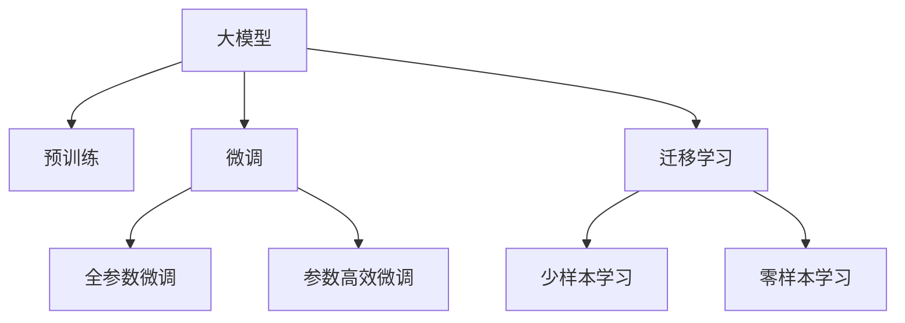

                 

# 价格战的无益：贾扬清的观点，大模型价格下降趋势，聚焦实际问题

## 1. 背景介绍

随着人工智能技术的发展，大模型如BERT、GPT等在自然语言处理(NLP)领域取得了显著成效，而它们的价格也逐渐成为公众关注的焦点。近期，AI大模型的价格呈现下降趋势，引发了市场广泛的关注和讨论。中国深度学习领域的知名学者贾扬清提出了自己的观点，强调价格战的无益，主张通过聚焦实际问题，提高大模型应用的综合效益。

在学术界和工业界，对于大模型的价格和性能的讨论由来已久。一方面，大模型的强大表现带来了巨大商业价值，使得各大公司纷纷投入巨资研发和部署大模型。另一方面，随着技术的进步，越来越多的开源模型出现，大幅降低了使用大模型的门槛和成本。

## 2. 核心概念与联系

### 2.1 核心概念概述

在讨论大模型价格战的问题前，我们首先需要明确几个核心概念：

- **大模型**：指那些经过大规模预训练、拥有丰富语言表示能力的模型，如BERT、GPT等。
- **预训练**：指在大规模无标签数据上进行自监督学习，学习通用的语言表示。
- **微调**：指在预训练模型基础上，利用下游任务的少量标注数据，通过有监督学习调整模型，以适应特定任务。
- **迁移学习**：指通过预训练模型学习到的知识，迁移到下游任务上，提高模型在特定任务上的表现。
- **少样本学习**：指模型在少数标注样本的情况下也能取得良好效果。
- **零样本学习**：指模型在未见过的任务下，仍能通过任务描述进行推理和生成。

### 2.2 核心概念原理和架构的 Mermaid 流程图



## 3. 核心算法原理 & 具体操作步骤

### 3.1 算法原理概述

大模型的价格战主要体现在两个方面：一方面是大模型本身的高成本，包括数据获取、硬件设备和计算资源的投入；另一方面是大模型部署和运营的成本。然而，价格战并非唯一竞争手段，更重要的应该是提高大模型的实际应用效果，聚焦实际问题，推动技术进步。

### 3.2 算法步骤详解

大模型在实际应用中的价值不应仅仅体现在价格上，而在于其所能解决的问题和带来的效益。以下是聚焦实际问题的详细步骤：

**Step 1: 需求分析**

首先，明确大模型的应用场景和需求。这包括了解目标用户的具体需求、数据特征、技术瓶颈等。需求分析是制定微调策略和优化方案的基础。

**Step 2: 选择合适的预训练模型**

根据需求分析结果，选择合适的预训练模型。如BERT适用于文本分类、问答等任务，而GPT则更适用于文本生成、对话等任务。

**Step 3: 数据准备**

收集和清洗下游任务的数据集。数据集应包含足够的标注样本，且数据分布应与实际应用场景一致。

**Step 4: 微调模型**

使用适当的微调技术，对预训练模型进行调整。这包括设置学习率、正则化参数、损失函数等。微调的目标是提高模型在特定任务上的表现。

**Step 5: 评估和优化**

在微调后，对模型进行评估，识别模型存在的问题，并优化调整。评估指标包括准确率、召回率、F1值等。

**Step 6: 部署和应用**

将微调后的模型部署到实际应用中，并进行监控和优化。在应用过程中，及时收集反馈，进行模型更新和改进。

### 3.3 算法优缺点

**优点**：

- 聚焦实际问题，提高模型解决具体问题的能力。
- 通过精简模型和优化算法，降低模型成本和计算资源消耗。
- 通过微调和迁移学习，提高模型在特定任务上的性能。

**缺点**：

- 需要投入更多的时间和精力进行需求分析和模型优化。
- 模型的可解释性较差，可能难以进行直观的解释和调整。

### 3.4 算法应用领域

聚焦实际问题的微调方法广泛应用于自然语言处理、计算机视觉、语音识别等多个领域。例如，在NLP中，大模型可以通过微调应用于文本分类、情感分析、机器翻译等任务；在计算机视觉中，大模型可以通过微调应用于图像分类、目标检测等任务；在语音识别中，大模型可以通过微调应用于语音情感识别、语音指令识别等任务。

## 4. 数学模型和公式 & 详细讲解 & 举例说明

### 4.1 数学模型构建

假设预训练模型为 $M_{\theta}$，其中 $\theta$ 为预训练得到的模型参数。给定下游任务 $T$ 的标注数据集 $D=\{(x_i, y_i)\}_{i=1}^N$，微调的目标是找到新的模型参数 $\hat{\theta}$，使得：

$$
\hat{\theta}=\mathop{\arg\min}_{\theta} \mathcal{L}(M_{\theta},D)
$$

其中 $\mathcal{L}$ 为针对任务 $T$ 设计的损失函数，用于衡量模型预测输出与真实标签之间的差异。常见的损失函数包括交叉熵损失、均方误差损失等。

### 4.2 公式推导过程

以二分类任务为例，假设模型 $M_{\theta}$ 在输入 $x$ 上的输出为 $\hat{y}=M_{\theta}(x) \in [0,1]$，表示样本属于正类的概率。真实标签 $y \in \{0,1\}$。则二分类交叉熵损失函数定义为：

$$
\ell(M_{\theta}(x),y) = -[y\log \hat{y} + (1-y)\log (1-\hat{y})]
$$

将其代入经验风险公式，得：

$$
\mathcal{L}(\theta) = -\frac{1}{N}\sum_{i=1}^N [y_i\log M_{\theta}(x_i)+(1-y_i)\log(1-M_{\theta}(x_i))]
$$

根据链式法则，损失函数对参数 $\theta_k$ 的梯度为：

$$
\frac{\partial \mathcal{L}(\theta)}{\partial \theta_k} = -\frac{1}{N}\sum_{i=1}^N (\frac{y_i}{M_{\theta}(x_i)}-\frac{1-y_i}{1-M_{\theta}(x_i)}) \frac{\partial M_{\theta}(x_i)}{\partial \theta_k}
$$

其中 $\frac{\partial M_{\theta}(x_i)}{\partial \theta_k}$ 可进一步递归展开，利用自动微分技术完成计算。

### 4.3 案例分析与讲解

以BERT微调进行情感分析为例，具体步骤如下：

1. **数据准备**：收集电影评论数据集，将评论文本和对应的情感标签作为训练数据。
2. **模型选择**：选择BERT-base模型作为预训练模型。
3. **微调模型**：将模型在数据集上进行微调，学习情感分类任务。
4. **评估模型**：在测试集上进行评估，使用准确率、召回率、F1值等指标进行衡量。
5. **优化模型**：根据评估结果，对模型进行调整，提高分类性能。

## 5. 项目实践：代码实例和详细解释说明

### 5.1 开发环境搭建

在实际开发中，我们需要准备Python环境，并安装必要的库和工具。以下是一个Python环境搭建的示例：

```bash
# 安装Python
sudo apt-get install python3 python3-pip

# 安装虚拟环境管理器
pip install virtualenv

# 创建虚拟环境
python -m venv myenv

# 激活虚拟环境
source myenv/bin/activate
```

### 5.2 源代码详细实现

以下是一个使用BERT进行情感分析的Python代码示例：

```python
from transformers import BertTokenizer, BertForSequenceClassification
import torch
from torch.utils.data import Dataset, DataLoader
from torch.nn import CrossEntropyLoss
from sklearn.metrics import accuracy_score, precision_score, recall_score, f1_score

# 定义情感分析数据集
class SentimentDataset(Dataset):
    def __init__(self, texts, labels):
        self.tokenizer = BertTokenizer.from_pretrained('bert-base-uncased')
        self.texts = texts
        self.labels = labels
    
    def __len__(self):
        return len(self.texts)
    
    def __getitem__(self, idx):
        text = self.texts[idx]
        label = self.labels[idx]
        tokenized_text = self.tokenizer(text, return_tensors='pt')
        return {'text': text, 'token_ids': tokenized_text['input_ids'], 'attention_mask': tokenized_text['attention_mask'], 'labels': torch.tensor(label, dtype=torch.long)}

# 加载模型和数据集
model = BertForSequenceClassification.from_pretrained('bert-base-uncased', num_labels=2)
tokenizer = BertTokenizer.from_pretrained('bert-base-uncased')
train_dataset = SentimentDataset(train_texts, train_labels)
test_dataset = SentimentDataset(test_texts, test_labels)
train_loader = DataLoader(train_dataset, batch_size=16, shuffle=True)
test_loader = DataLoader(test_dataset, batch_size=16, shuffle=False)

# 定义损失函数和优化器
loss_fn = CrossEntropyLoss()
optimizer = AdamW(model.parameters(), lr=2e-5)

# 训练模型
device = torch.device('cuda') if torch.cuda.is_available() else torch.device('cpu')
model.to(device)
for epoch in range(5):
    model.train()
    train_loss = 0
    train_acc = 0
    for batch in train_loader:
        token_ids = batch['token_ids'].to(device)
        attention_mask = batch['attention_mask'].to(device)
        labels = batch['labels'].to(device)
        outputs = model(token_ids, attention_mask=attention_mask)
        loss = loss_fn(outputs.logits, labels)
        loss.backward()
        optimizer.step()
        train_loss += loss.item()
        predictions = torch.argmax(outputs.logits, dim=1)
        train_acc += accuracy_score(labels, predictions)
    train_loss /= len(train_loader)
    train_acc /= len(train_loader)
    print(f'Epoch {epoch+1}, train loss: {train_loss:.3f}, train acc: {train_acc:.3f}')
    
    model.eval()
    test_loss = 0
    test_acc = 0
    with torch.no_grad():
        for batch in test_loader:
            token_ids = batch['token_ids'].to(device)
            attention_mask = batch['attention_mask'].to(device)
            labels = batch['labels'].to(device)
            outputs = model(token_ids, attention_mask=attention_mask)
            loss = loss_fn(outputs.logits, labels)
            test_loss += loss.item()
            predictions = torch.argmax(outputs.logits, dim=1)
            test_acc += accuracy_score(labels, predictions)
    test_loss /= len(test_loader)
    test_acc /= len(test_loader)
    print(f'Epoch {epoch+1}, test loss: {test_loss:.3f}, test acc: {test_acc:.3f}')
```

### 5.3 代码解读与分析

在上述代码中，我们首先定义了数据集类 `SentimentDataset`，用于处理情感分析任务的数据。然后，加载了预训练模型 `BertForSequenceClassification` 和相应的分词器 `BertTokenizer`。接着，定义了训练和评估的函数，对模型进行了5轮的训练。最后，在测试集上评估了模型的性能。

## 6. 实际应用场景

### 6.1 智能客服系统

在智能客服系统中，大模型可以通过微调应用于对话系统、意图识别、情感分析等任务，提升客服系统的智能化水平。通过微调，模型能够自动理解用户意图，匹配最合适的答案，提高客服响应速度和准确性。

### 6.2 金融舆情监测

在金融领域，舆情监测是风险控制的重要环节。通过微调大模型，可以自动监测新闻、评论等文本数据，识别情感变化趋势，预测市场波动，为金融机构提供决策支持。

### 6.3 个性化推荐系统

在电商和娱乐领域，个性化推荐系统是提高用户满意度和粘性的关键。通过微调大模型，可以学习用户的兴趣和行为特征，推荐更加个性化的商品和内容，提升用户体验。

### 6.4 未来应用展望

未来，大模型微调将在更多领域得到应用，如智慧医疗、智能教育、智慧城市等。通过聚焦实际问题，优化模型结构和算法，提高大模型的应用价值，推动人工智能技术的普及和应用。

## 7. 工具和资源推荐

### 7.1 学习资源推荐

- **《Transformer from the ground up》**：一篇详细介绍Transformer架构及其在自然语言处理中应用的博文。
- **CS224N《Deep Learning for Natural Language Processing》**：斯坦福大学开设的NLP课程，涵盖语言模型、注意力机制、微调等内容。
- **《Natural Language Processing with Transformers》**：深度学习专家Zaremba所著的书籍，系统介绍了Transformer在NLP中的应用。
- **Hugging Face官方文档**：提供了多种预训练模型和微调样例，是学习微调的重要参考资料。
- **CLUE开源项目**：包含多种中文NLP数据集，并提供了基于微调的baseline模型，助力中文NLP技术发展。

### 7.2 开发工具推荐

- **PyTorch**：开源深度学习框架，适合快速迭代研究。
- **TensorFlow**：Google主导的深度学习框架，适合大规模工程应用。
- **Transformers库**：Hugging Face开发的NLP工具库，集成了多种预训练语言模型。
- **Weights & Biases**：模型训练的实验跟踪工具，记录和可视化模型训练过程。
- **TensorBoard**：TensorFlow配套的可视化工具，实时监测模型训练状态。
- **Google Colab**：谷歌推出的在线Jupyter Notebook环境，免费提供GPU/TPU算力。

### 7.3 相关论文推荐

- **Attention is All You Need**：提出Transformer结构，开启了NLP领域的预训练大模型时代。
- **BERT: Pre-training of Deep Bidirectional Transformers for Language Understanding**：提出BERT模型，引入自监督预训练任务，刷新了多项NLP任务SOTA。
- **Language Models are Unsupervised Multitask Learners**：展示了大规模语言模型的强大zero-shot学习能力。
- **Parameter-Efficient Transfer Learning for NLP**：提出Adapter等参数高效微调方法，减小微调对预训练参数的依赖。
- **AdaLoRA: Adaptive Low-Rank Adaptation for Parameter-Efficient Fine-Tuning**：使用自适应低秩适应的微调方法，在保证性能的同时，减小模型参数量。

## 8. 总结：未来发展趋势与挑战

### 8.1 研究成果总结

大模型微调技术在NLP领域取得了显著进展，通过微调，模型能够适应特定任务，提高应用效果。然而，微调过程中仍面临标注数据依赖、过拟合风险、模型鲁棒性不足等问题。

### 8.2 未来发展趋势

1. **模型规模持续增大**：预训练语言模型的参数量将继续增长，带来更丰富的语言知识。
2. **微调方法多样化**：未来将涌现更多参数高效和计算高效的微调方法。
3. **持续学习成为常态**：模型需持续学习新知识，以保持性能。
4. **少样本和零样本学习**：通过巧妙的任务描述，在少量标注样本下也能实现理想效果。
5. **多模态微调**：将视觉、语音等多模态信息与文本信息协同建模。
6. **通用性增强**：模型具备更强的跨领域迁移能力，向通用人工智能迈进。

### 8.3 面临的挑战

1. **标注成本瓶颈**：高质量标注数据获取成本高，微调效果受限。
2. **模型鲁棒性不足**：面对域外数据泛化性能差，存在过拟合风险。
3. **推理效率有待提高**：大模型推理速度慢，资源消耗大。
4. **可解释性不足**：模型决策过程难以解释，影响可信度和应用。
5. **安全性有待保障**：预训练模型可能学习有害信息，存在安全隐患。
6. **知识整合能力不足**：模型难以灵活运用外部知识。

### 8.4 研究展望

未来，研究需聚焦实际问题，探索无监督和半监督微调方法，开发参数高效和计算高效的微调范式，引入因果推断和对比学习，纳入伦理道德约束，加强知识整合能力。

## 9. 附录：常见问题与解答

**Q1: 大模型微调是否适用于所有NLP任务？**

A: 大模型微调在大多数NLP任务上都能取得不错效果，但针对特定领域，如医疗、法律等，需要进一步预训练和微调，才能满足需求。

**Q2: 微调过程中如何选择合适的学习率？**

A: 微调学习率一般比预训练小1-2个数量级，初始可以从1e-5开始，逐步减小。warmup策略可在开始阶段使用较小学习率，再逐渐过渡。

**Q3: 微调模型在落地部署时需要注意哪些问题？**

A: 模型裁剪、量化加速、服务化封装、弹性伸缩、监控告警和安全防护等，是部署时需考虑的重要因素。

**Q4: 如何缓解微调过程中的过拟合问题？**

A: 数据增强、正则化、对抗训练、参数高效微调、多模型集成等，都是缓解过拟合的有效方法。

---

作者：禅与计算机程序设计艺术 / Zen and the Art of Computer Programming

