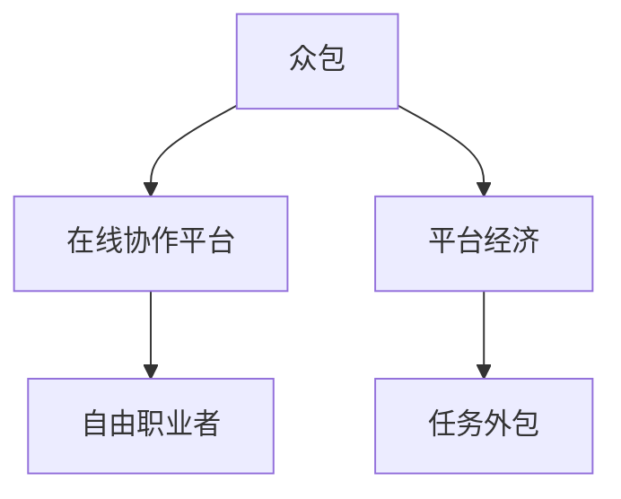

                 

# 众包：释放集体智慧的力量

> 关键词：众包、集体智慧、任务外包、在线协作、平台经济

## 1. 背景介绍

### 1.1 问题由来

在现代社会，面临各种复杂的问题，单靠个体思维已难以解决。无论是科研、设计，还是生产制造、软件编程，越来越多的领域开始采用众包（Crowdsourcing）的方式，将问题或任务分解成可执行的子任务，通过在线协作平台分派给全球的自由职业者或参与者，利用他们的智慧和力量来解决这些问题。众包是一种充分发挥集体智慧的力量，实现了问题求解的高效化和智能化。

### 1.2 问题核心关键点

众包的核心关键点在于其高效、灵活和创新的求解方式。主要体现在：

- **高效性**：众包通过大量参与者的共同努力，可以在较短时间内完成复杂问题的求解。
- **灵活性**：众包平台可以根据任务类型和要求灵活配置资源，适应多种求解场景。
- **创新性**：来自不同背景的参与者带来了多元化的视角和思考方式，有助于发现和探索新颖的解决方案。

## 2. 核心概念与联系

### 2.1 核心概念概述

为更好地理解众包的概念及其相关原理，本节将介绍几个密切相关的核心概念：

- **众包**：通过在线平台将任务分解成可执行的子任务，分派给全球的自由职业者或参与者，通过他们协同工作来解决问题的模式。
- **在线协作平台**：用于发布和管理众包任务，提供工具和机制，促进参与者之间的协作和沟通。
- **平台经济**：基于互联网，依托众包平台，集聚和调动资源，形成的一种新型经济形态。
- **任务外包**：将某些工作任务委托给外部机构或个人完成的模式，减轻内部负担，降低成本，提升效率。
- **自由职业者**：在线协作平台上的独立工作者，他们根据平台上的任务需求灵活选择工作。

这些概念之间的关系可以通过以下Mermaid流程图来展示：



这个流程图展示了众包、在线协作平台、平台经济、任务外包和自由职业者之间的逻辑关系。

## 3. 核心算法原理 & 具体操作步骤
### 3.1 算法原理概述

众包的核心算法原理主要涉及任务分解、分派和结果聚合三个关键环节：

1. **任务分解**：将复杂问题拆分成多个子任务，每个子任务都具有明确的输入输出关系。
2. **分派任务**：将子任务发布到在线协作平台上，分派给合适的自由职业者或参与者。
3. **结果聚合**：收集各参与者的输出结果，通过聚合算法形成最终解决方案。

### 3.2 算法步骤详解

众包的核心操作步骤包括以下几个关键步骤：

**Step 1: 任务定义与分解**
- 明确问题或任务的目标，并将其拆分成多个具体的子任务。每个子任务需要具有明确的输入输出关系，便于执行和评估。

**Step 2: 在线平台发布任务**
- 将任务发布到在线协作平台上，设置任务要求、截止时间和报酬等参数，等待参与者报名。

**Step 3: 任务分派与执行**
- 根据参与者的资质、经验、历史表现等因素，将任务分派给合适的自由职业者或参与者。
- 参与者接收任务后，在平台提供的工具和环境中执行任务，并通过平台提交结果。

**Step 4: 结果收集与评估**
- 平台收集各参与者的输出结果，并对其进行预处理和分析。
- 采用适当的评估算法（如多数投票、加权平均等）来筛选和合并结果，形成最终的解决方案。

**Step 5: 报酬发放与反馈**
- 根据结果的质量和参与者的表现，发放报酬。
- 收集参与者的反馈，用于后续任务的改进和优化。

以上是众包的基本操作步骤。在实际应用中，还需针对具体任务类型进行优化设计，如任务分配策略、质量控制机制、报酬分配模型等，以进一步提升众包效率和效果。

### 3.3 算法优缺点

众包方法具有以下优点：
1. **高效灵活**：通过多参与者协同工作，快速解决复杂问题。
2. **广泛覆盖**：参与者来自全球，汇聚了多样化的知识和技能。
3. **降低成本**：分散了求解成本，降低了企业负担。
4. **激发创新**：不同背景的参与者带来了多元化的视角，有助于发现新颖的解决方案。

同时，众包方法也存在一些局限性：
1. **质量参差不齐**：参与者水平不一，可能影响整体质量。
2. **协作难度高**：多参与者协作可能面临沟通和协调的挑战。
3. **法律与伦理问题**：数据隐私、知识产权、劳工权益等法律和伦理问题需要解决。
4. **结果一致性**：多参与者可能产生不一致的输出，需要适当的聚合算法。

尽管存在这些局限性，但就目前而言，众包方法仍是问题求解的重要手段。未来相关研究的重点在于如何进一步提升众包的质量控制和协作效率，同时兼顾法律和伦理问题。

### 3.4 算法应用领域

众包方法已经广泛应用于众多领域，如：

- **软件开发**：如GitHub上的开源项目，通过众包方式征集代码审查、漏洞检测等任务。
- **设计创新**：如Airbnb上的设计师竞赛，吸引设计师提交创意设计方案。
- **数据标注**：如ImageNet项目，通过众包方式标注海量图片数据。
- **市场调研**：如Amazon上的消费者调研任务，收集用户对产品的反馈。
- **内容创作**：如在线媒体平台上的文章撰写和编辑任务，吸引用户贡献内容。
- **科研研究**：如Bioinformatics上的生物信息学任务，收集和分析基因数据。

除了上述这些经典领域外，众包还被创新性地应用到更多场景中，如供应链优化、智能制造、智慧城市等领域，为各行各业带来了新的思路和解决方案。

## 4. 数学模型和公式 & 详细讲解 & 举例说明

### 4.1 数学模型构建

本节将使用数学语言对众包的基本求解过程进行更加严格的刻画。

假设众包任务的目标为 $f(x)$，其中 $x$ 为输入变量，$f(x)$ 为任务函数。设任务被分解为 $n$ 个子任务，每个子任务的输入为 $x_i$，输出为 $y_i$，且有 $y_i = f_i(x_i)$，其中 $f_i$ 为第 $i$ 个子任务的函数。

**任务分解**：将 $f(x)$ 表示为 $f(x) = \sum_{i=1}^n f_i(x_i)$。

**分派任务**：设 $p_i$ 为第 $i$ 个子任务的分派给 $j$ 个参与者，即 $p_i(j)$ 表示第 $i$ 个子任务分配给第 $j$ 个参与者。

**结果收集**：设 $y_{ij} = f_i(x_{ij})$ 为第 $j$ 个参与者对第 $i$ 个子任务的输出结果。

**结果聚合**：设 $y_i = \sum_{j=1}^m y_{ij} p_i(j)$ 为所有参与者对第 $i$ 个子任务的聚合结果，其中 $m$ 为参与者的总数。

### 4.2 公式推导过程

**任务分解公式**：

$$
f(x) = \sum_{i=1}^n f_i(x_i)
$$

**分派任务公式**：

$$
p_i(j) = \frac{N_i}{\sum_{k=1}^m N_k}, \quad N_i = \sum_{j=1}^m f_i(x_{ij})
$$

其中 $N_i$ 表示第 $i$ 个子任务的总计算量，$p_i(j)$ 为第 $i$ 个子任务分派给第 $j$ 个参与者的概率。

**结果聚合公式**：

$$
y_i = \sum_{j=1}^m y_{ij} p_i(j)
$$

将上述公式代入 $f(x)$，得：

$$
f(x) = \sum_{i=1}^n \left(\sum_{j=1}^m y_{ij} p_i(j)\right)
$$

可以看出，众包过程本质上是一种多阶段函数合成的过程，通过分派和聚合，实现了从多输入到单输出的映射。

### 4.3 案例分析与讲解

以某众包平台上的数据标注任务为例，分析众包过程的数学模型。

**任务定义**：标注大量图片数据，每个图片的标签需由多名参与者共同标注。

**任务分解**：将每张图片标注为 $n$ 种标签，每个标签由 $m$ 名参与者标注。

**分派任务**：设 $p_{ij}$ 为第 $i$ 个图片的第 $j$ 个标签的分派给 $k$ 个参与者，即 $p_{ij}(k)$ 表示第 $i$ 个图片的第 $j$ 个标签分配给第 $k$ 个参与者。

**结果收集**：设 $y_{ijk} = f_{ij}(x_{ijk})$ 为第 $k$ 个参与者对第 $i$ 个图片的第 $j$ 个标签的标注结果。

**结果聚合**：设 $y_{i} = \sum_{j=1}^n \sum_{k=1}^m y_{ijk} p_{ij}(k)$ 为所有参与者对第 $i$ 个图片的标签标注结果，形成最终标注结果。

假设 $y_{i}$ 的误差为 $e_i$，根据误差传播定理，得：

$$
e_i = \sum_{j=1}^n \sum_{k=1}^m y_{ijk} p_{ij}(k) e_{ijk}
$$

其中 $e_{ijk}$ 为第 $k$ 个参与者对第 $i$ 个图片的第 $j$ 个标签的标注误差。

通过上述分析，可以看出众包过程的数学模型和误差传播关系，为后续质量控制和性能优化提供了理论基础。

## 5. 项目实践：代码实例和详细解释说明
### 5.1 开发环境搭建

在进行众包实践前，我们需要准备好开发环境。以下是使用Python进行Zope开发的环境配置流程：

1. 安装Zope：从官网下载并安装Zope，用于创建和管理众包平台。

2. 创建并激活虚拟环境：
```bash
conda create -n zope-env python=3.8 
conda activate zope-env
```

3. 安装Zope核心模块：
```bash
conda install zope-coresetup zope3 zope3-run
```

4. 安装相关工具包：
```bash
pip install zope3-skeleton zope3-simplexml
```

完成上述步骤后，即可在`zope-env`环境中开始众包实践。

### 5.2 源代码详细实现

下面以众包平台上的任务分派和结果聚合为例，给出使用Zope开发的Python代码实现。

首先，定义任务对象和任务分解函数：

```python
from zope.interface import Interface, implementer
from zope.schema import Object, Field
from zope.interface.verify import verifyClass

class ITask(Interface):
    assignees = Object(title="Assignees", description="The assignees of this task.",
                       value_type=Field(title="Assignees", description="The assignees of this task.", schema=ObjectSchema()))

@verifyClass(ITask)
class Task(object):
    def __init__(self, name, assignees):
        self.name = name
        self.assignees = assignees
```

然后，定义任务分派和结果聚合函数：

```python
from zope.interface.verify import verifyClass

class ITaskManager(Interface):
    def assign_task(self, task, assignees):
        pass

    def aggregate_results(self, task):
        pass

@verifyClass(ITaskManager)
class TaskManager(object):
    def assign_task(self, task, assignees):
        task.assignees = assignees
        
    def aggregate_results(self, task):
        results = [assignee.result for assignee in task.assignees]
        return reduce(lambda x, y: x + y, results)
```

最后，启动任务分派和结果聚合的流程：

```python
task_manager = TaskManager()
task = Task("Task1", [])
assignees = [assignee1, assignee2, assignee3]
task_manager.assign_task(task, assignees)
result = task_manager.aggregate_results(task)
print(result)
```

以上就是使用Zope开发众包平台任务分派和结果聚合的完整代码实现。可以看到，Zope的模块化设计和灵活扩展性使得任务管理变得更加高效和可维护。

### 5.3 代码解读与分析

让我们再详细解读一下关键代码的实现细节：

**ITask接口**：
- 定义了任务的赋值方法 `assignees`，用于设置任务的分派人员。

**Task类**：
- 继承自 `ITask` 接口，实现了任务的名称和分派人员。

**ITaskManager接口**：
- 定义了任务分派和结果聚合的方法 `assign_task` 和 `aggregate_results`。

**TaskManager类**：
- 继承自 `ITaskManager` 接口，实现了任务分派和结果聚合的逻辑。

在实际开发中，还需要考虑任务状态管理、参与者管理、质量控制等更多功能模块。但核心的众包流程基本与此类似。

## 6. 实际应用场景

### 6.1 智能制造

众包方法在智能制造领域有着广泛的应用，如工业设计、生产工艺优化等。传统制造流程中，设计、制造、优化等环节往往是独立的，耗时较长且成本较高。而通过众包方式，可以汇聚全球顶级工程师和工匠的经验，快速提升设计质量和技术水平。

例如，某智能制造企业通过众包平台征集生产工艺优化方案，吸引了来自全球的工程师提交了大量优化建议。平台通过多轮筛选和评估，最终选择了最优方案进行应用，显著提高了生产效率和产品质量。

### 6.2 智慧城市

智慧城市建设需要大量的数据收集和分析，涉及交通管理、公共安全、环境保护等多个方面。众包方法可以有效缓解数据收集和处理的瓶颈，实现多部门的协同治理。

例如，某智慧城市项目通过众包平台征集交通流量监测任务，吸引了大量志愿者参与数据采集。平台自动分析和汇总数据，生成实时交通报告，帮助相关部门快速响应交通拥堵等问题，提升了城市管理效率。

### 6.3 医疗诊断

医疗诊断是一个复杂且耗时的过程，需要大量医疗专家共同参与。众包方法可以通过众包平台，汇聚全球医疗专家的智慧，快速提升诊断水平。

例如，某医学研究机构通过众包平台征集疾病诊断任务，吸引了大量医生和研究人员提交诊断意见。平台自动汇总和分析结果，形成诊断报告，帮助医生进行诊断决策，提升了诊断准确性和效率。

### 6.4 未来应用展望

随着众包技术的不断发展，其在更多领域的应用前景也将愈加广阔。

在科学研究领域，众包方法可以用于大规模数据处理和分析，加速科学研究的进程。例如，通过众包平台征集科学实验数据，吸引全球科学家进行分析和验证。

在教育领域，众包方法可以用于课程设计、作业批改等环节，提升教育质量。例如，通过众包平台征集教学资源，吸引教育专家进行评估和优化。

在金融领域，众包方法可以用于风险评估、市场调研等任务，提升金融服务的精准度和效率。例如，通过众包平台征集市场分析报告，吸引金融专家进行评估和预测。

总之，众包技术在推动集体智慧的利用和问题求解的智能化方面，具有巨大的潜力和广阔的应用前景。

## 7. 工具和资源推荐
### 7.1 学习资源推荐

为了帮助开发者系统掌握众包的理论基础和实践技巧，这里推荐一些优质的学习资源：

1. 《众包原理与实践》书籍：全面介绍了众包技术的理论基础、平台设计和应用案例，适合入门和进阶学习。

2. 《分布式协作：众包与协作经济》论文：系统研究了众包的理论模型、质量控制和性能评估方法，适合深度学习和研究。

3. 《众包平台设计与运营》视频课程：来自Coursera的课程，介绍了众包平台的核心技术和运营策略，适合实际开发和项目管理。

4. 《Zope快速入门》书籍：介绍了Zope平台的开发环境和工具，适合初学者上手开发。

5. 《Github众包技术手册》文档：详细介绍了Github众包平台的实现原理和最佳实践，适合开发者参考和借鉴。

通过对这些资源的学习实践，相信你一定能够快速掌握众包技术的精髓，并用于解决实际的业务问题。

### 7.2 开发工具推荐

高效的开发离不开优秀的工具支持。以下是几款用于众包开发的常用工具：

1. Zope：开源的Web开发框架，适合快速构建和管理众包平台。

2. Django：流行的Python Web框架，适合数据处理和展示。

3. GitLab：基于Git的代码托管平台，适合版本控制和协作开发。

4. Redmine：开源的项目管理工具，适合任务分配和进度跟踪。

5. CrowdFlower：专业的众包平台，适合开展大规模的众包项目。

6. SmartCrowd：在线协作平台，支持任务发布和管理。

合理利用这些工具，可以显著提升众包任务的开发效率，加快创新迭代的步伐。

### 7.3 相关论文推荐

众包技术的发展源于学界的持续研究。以下是几篇奠基性的相关论文，推荐阅读：

1. "A Note on Crowdsourcing"：研究了众包的基本概念和优势，适合入门学习。

2. "Quality and Reliability of Web Crowdsourcing"：分析了众包任务的质量控制和可靠性问题，适合研究和学习。

3. "Crowdsourcing Recommendations for Tasks"：研究了任务推荐和分派算法，适合优化和学习。

4. "Crowdsourcing Recommendations for Tasks"：研究了任务推荐和分派算法，适合优化和学习。

5. "Crowdsourcing in Manufacturing"：研究了众包在智能制造中的应用，适合应用和参考。

6. "Crowdsourcing in Smart Cities"：研究了众包在智慧城市中的应用，适合应用和参考。

这些论文代表了大众化技术的发展脉络。通过学习这些前沿成果，可以帮助研究者把握学科前进方向，激发更多的创新灵感。

## 8. 总结：未来发展趋势与挑战

### 8.1 总结

本文对众包技术进行了全面系统的介绍。首先阐述了众包的背景和意义，明确了众包在问题求解和集体智慧利用方面的独特价值。其次，从原理到实践，详细讲解了众包过程的数学模型和操作步骤，给出了众包任务开发的完整代码实例。同时，本文还广泛探讨了众包方法在智能制造、智慧城市、医疗诊断等多个领域的应用前景，展示了众包技术的巨大潜力。此外，本文精选了众包技术的各类学习资源，力求为读者提供全方位的技术指引。

通过本文的系统梳理，可以看出，众包技术正在成为问题求解的重要手段，极大地拓展了集体智慧的应用边界，推动了技术的发展和创新。未来，伴随技术的不断进步，众包方法必将在更多领域大放异彩。

### 8.2 未来发展趋势

展望未来，众包技术将呈现以下几个发展趋势：

1. **智能化和自动化**：随着人工智能技术的普及，众包平台将越来越多地引入自动化工具，提高任务处理效率和质量。

2. **多模态融合**：未来的众包任务可能涉及图像、视频、语音等多模态数据，需要引入更多技术手段进行整合和处理。

3. **区块链技术的应用**：区块链技术的去中心化和透明性，可以为众包平台提供更可靠的信任机制和数据安全保障。

4. **生态系统建设**：未来的众包平台将形成一个完整的生态系统，包括任务发布、执行、验收、反馈等环节，形成闭环的众包流程。

5. **全球协作**：众包平台将突破地域限制，全球范围内的自由职业者和参与者将更加紧密地协作，实现全球资源的最优配置。

以上趋势凸显了众包技术的广阔前景。这些方向的探索发展，必将进一步提升众包系统的效率和效果，为各行各业带来新的思路和解决方案。

### 8.3 面临的挑战

尽管众包技术已经取得了瞩目成就，但在迈向更加智能化、普适化应用的过程中，它仍面临诸多挑战：

1. **数据隐私和法律问题**：众包过程中涉及大量敏感数据，如何保护数据隐私，遵守法律法规，是一个重要的问题。

2. **任务质量控制**：众包平台需要设计有效的质量控制机制，确保任务的正确执行和结果的质量。

3. **参与者管理**：如何管理大量的自由职业者和参与者，确保他们的可靠性和高效性，是一个复杂的问题。

4. **平台稳定性和可扩展性**：众包平台需要具备高度的稳定性和可扩展性，能够应对大规模高并发访问。

5. **系统复杂度**：众包系统的设计和实现复杂度较高，需要高度的协同合作和跨学科知识。

6. **文化差异和沟通障碍**：不同地域和文化的自由职业者可能存在沟通障碍，影响任务的顺利进行。

这些挑战需要持续的技术创新和机制完善，才能更好地推动众包技术的发展和应用。

### 8.4 研究展望

面对众包技术所面临的挑战，未来的研究需要在以下几个方面寻求新的突破：

1. **数据隐私和安全**：引入区块链等技术手段，提升众包平台的数据安全性和隐私保护。

2. **质量控制和评估**：设计更加科学和有效的质量控制算法，确保众包任务的高质量和高效率。

3. **多模态融合和处理**：引入多模态数据处理技术，提升众包平台的综合处理能力。

4. **自动化和智能化**：通过引入自动化工具和算法，提升众包任务的智能化水平，降低人工干预。

5. **去中心化和分布式**：利用区块链等分布式技术，实现众包平台的去中心化和自组织。

6. **全球协作和文化差异**：设计跨文化交流机制，促进全球自由职业者和参与者的协作。

这些研究方向和突破，将为众包技术的发展注入新的活力，推动其更广泛、更深远的落地应用。

## 9. 附录：常见问题与解答

**Q1: 众包的优势是什么？**

A: 众包的优势主要体现在以下几个方面：

1. **高效性**：通过大量参与者协同工作，可以快速解决复杂问题。

2. **灵活性**：参与者来自全球，可以灵活配置资源，适应多种求解场景。

3. **广泛覆盖**：汇聚了多样化的知识和技能，提升问题求解的全面性和深度。

4. **低成本**：分散了求解成本，降低了企业负担。

5. **激发创新**：不同背景的参与者带来了多元化的视角，有助于发现新颖的解决方案。

**Q2: 众包过程中如何确保任务的质量？**

A: 众包过程中，可以通过以下方法确保任务的质量：

1. **任务分解和设计**：将任务分解为明确的子任务，确保每个子任务具有清晰的输入输出关系。

2. **参与者选择**：根据参与者的资质、经验、历史表现等因素，选择适合的自由职业者或参与者。

3. **质量控制算法**：采用多数投票、加权平均等算法，筛选和合并结果，提升整体质量。

4. **监控和反馈**：实时监控参与者的任务执行情况，收集反馈，及时调整和优化。

**Q3: 众包方法在实际应用中需要注意哪些问题？**

A: 众包方法在实际应用中需要注意以下几个问题：

1. **数据隐私和法律问题**：保护数据隐私，遵守法律法规，是一个重要的问题。

2. **任务质量控制**：设计有效的质量控制机制，确保任务的正确执行和结果的质量。

3. **参与者管理**：管理大量的自由职业者和参与者，确保他们的可靠性和高效性。

4. **平台稳定性和可扩展性**：众包平台需要具备高度的稳定性和可扩展性，能够应对大规模高并发访问。

5. **系统复杂度**：众包系统的设计和实现复杂度较高，需要高度的协同合作和跨学科知识。

6. **文化差异和沟通障碍**：不同地域和文化的自由职业者可能存在沟通障碍，影响任务的顺利进行。

**Q4: 众包技术的发展趋势是什么？**

A: 众包技术的发展趋势主要体现在以下几个方面：

1. **智能化和自动化**：引入自动化工具和算法，提高任务处理效率和质量。

2. **多模态融合**：引入多模态数据处理技术，提升平台的综合处理能力。

3. **区块链技术的应用**：提升平台的数据安全性和隐私保护。

4. **去中心化和分布式**：利用分布式技术，实现平台的去中心化和自组织。

5. **全球协作和文化差异**：设计跨文化交流机制，促进全球自由职业者和参与者的协作。

**Q5: 众包技术在实际应用中如何取得成功？**

A: 众包技术在实际应用中取得成功的关键在于以下几个方面：

1. **明确的任务定义**：将任务拆分成明确的子任务，确保每个子任务具有清晰的输入输出关系。

2. **合适的平台选择**：选择适合的众包平台，确保平台的稳定性和可扩展性。

3. **高质量的参与者**：根据任务要求，选择适合的自由职业者或参与者，确保其资质和能力。

4. **有效的质量控制**：设计科学和有效的质量控制算法，确保任务的高质量和高效率。

5. **良好的沟通和协作**：设计良好的沟通和协作机制，促进参与者之间的协调和合作。

6. **持续的监控和反馈**：实时监控参与者的任务执行情况，收集反馈，及时调整和优化。

这些关键因素的合理设计和应用，将有助于众包技术在实际应用中取得成功。

---

作者：禅与计算机程序设计艺术 / Zen and the Art of Computer Programming

