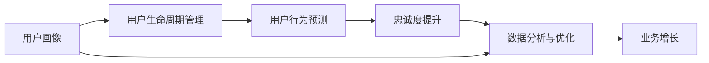

                 

# 会员经济创业：构建忠诚用户群的策略

在当今数字化时代，企业越来越重视会员经济的构建。优质的忠诚用户群不仅能带来稳定且可预测的收入流，更能为企业带来口碑传播、降低营销成本等多重收益。本文旨在探讨如何通过构建忠诚用户群，推动企业会员经济的发展。我们将从背景介绍、核心概念与联系、核心算法原理及具体操作步骤、数学模型和公式的详细讲解与举例说明、项目实践的代码实例和详细解释说明、实际应用场景、工具和资源推荐、总结未来发展趋势与挑战、常见问题与解答等多个方面进行深入分析。

## 1. 背景介绍

### 1.1 问题由来
在互联网和移动互联网时代，用户需求日益多样化，购买决策和消费行为变得更加复杂和个性化。传统的基于广告和促销的流量获取策略效果日趋有限。企业需要通过构建忠诚用户群，来实现用户留存、提升品牌忠诚度和增加用户粘性。

会员经济正是满足这一需求的重要手段。会员经济模式通过建立与用户的长期关系，提供个性化的服务体验和专属优惠，从而实现用户价值的最大化。构建忠诚用户群不仅是会员经济成功的基础，也是驱动企业持续发展的关键因素。

### 1.2 问题核心关键点
构建忠诚用户群的关键点包括：
- **用户画像构建**：通过数据分析和算法模型，准确刻画用户特征，以便更精准地进行个性化推荐和营销。
- **用户生命周期管理**：设计有效的会员体系，从新用户获取、激活、留存、升值到流失各个环节，持续跟进和服务用户。
- **用户行为预测**：利用机器学习算法，预测用户行为，提前采取干预措施，防止用户流失。
- **忠诚度提升**：通过积分系统、优惠券、专属服务等，激励用户长期使用和付费。
- **数据分析与优化**：建立完善的会员数据分析平台，实时监控会员状态和行为数据，实现业务优化和决策支持。

## 2. 核心概念与联系

### 2.1 核心概念概述

为更好地理解构建忠诚用户群的策略，我们首先介绍几个密切相关的核心概念：

- **用户画像(User Profile)**：通过收集和分析用户数据，构建用户特征描述，以便更好地理解用户需求和行为。
- **用户生命周期管理(User Lifecycle Management)**：设计和管理用户从潜在客户到忠实客户的全生命周期旅程，通过不同阶段的策略和活动，持续提升用户价值。
- **用户行为预测(Predictive Analytics)**：通过分析历史数据，预测用户未来的行为和需求，以便提前采取措施，提升用户满意度和忠诚度。
- **忠诚度提升(Loyalty Programs)**：通过积分、优惠券、专属服务等手段，增强用户对品牌和产品的忠诚度。
- **数据分析与优化(Analytics and Optimization)**：通过大数据和机器学习技术，对用户数据进行分析和挖掘，不断优化用户策略和服务，实现业务增长和用户留存。

这些核心概念之间具有紧密的联系。用户画像提供了用户特征的详细描述，是构建用户生命周期管理策略的基础。用户生命周期管理通过精细化的用户策略和活动，提升用户价值。用户行为预测帮助企业提前干预，防止用户流失。忠诚度提升则通过各种激励措施，增强用户粘性。数据分析与优化则通过持续的数据分析和模型优化，实现业务的持续提升。

这些概念共同构成了构建忠诚用户群的策略框架，帮助企业从数据驱动的角度出发，设计和实施有效的会员经济策略。

### 2.2 核心概念原理和架构的 Mermaid 流程图



这个流程图展示了用户画像、用户生命周期管理、用户行为预测、忠诚度提升和数据分析与优化之间的关系。用户画像通过数据驱动的方式，为其他各环节提供了用户特征的详细描述，并最终支持业务增长。

## 3. 核心算法原理 & 具体操作步骤

### 3.1 算法原理概述

构建忠诚用户群的策略基于数据分析和机器学习技术。其核心思想是通过收集和分析用户数据，利用算法模型预测用户行为，设计个性化的用户策略和服务，从而提升用户满意度和忠诚度。

具体来说，可以分为以下几个关键步骤：

1. **用户数据收集**：通过网站、APP、问卷调查等多种方式，收集用户的基本信息、行为数据、交易数据等。
2. **用户画像构建**：利用聚类、分类等算法，对用户数据进行特征提取和刻画，构建详细的用户画像。
3. **用户生命周期管理**：根据用户画像，设计不同阶段的用户策略和活动，持续跟进和服务用户，提升用户价值。
4. **用户行为预测**：利用回归、分类、时序预测等算法，对用户未来的行为进行预测，以便提前采取干预措施。
5. **忠诚度提升**：设计积分系统、优惠券、专属服务等，激励用户长期使用和付费。
6. **数据分析与优化**：建立数据分析平台，实时监控用户数据，通过模型优化和策略调整，实现业务增长和用户留存。

### 3.2 算法步骤详解

构建忠诚用户群的策略具体步骤包括：

**Step 1: 用户数据收集**
- 利用网站、APP等渠道，收集用户的基本信息、行为数据、交易数据等。
- 设计问卷调查，收集用户的主观反馈和偏好。

**Step 2: 用户画像构建**
- 利用聚类算法（如K-means）对用户数据进行特征提取和分类，形成用户画像。
- 利用分类算法（如Logistic回归、SVM）对用户行为进行分类，生成行为标签。
- 利用降维算法（如PCA）对高维用户数据进行降维，简化用户特征描述。

**Step 3: 用户生命周期管理**
- 根据用户画像，设计不同阶段的用户策略和活动，如新用户引导、回访提醒、生日关怀等。
- 利用时序预测算法（如ARIMA、LSTM）预测用户行为变化趋势，及时调整策略。
- 设计积分系统，记录用户行为，激励用户持续互动。

**Step 4: 用户行为预测**
- 利用回归算法（如线性回归、决策树回归）预测用户未来的购买行为。
- 利用分类算法（如朴素贝叶斯、随机森林）预测用户是否会流失。
- 利用时序预测算法（如LSTM、GRU）预测用户行为变化的趋势。

**Step 5: 忠诚度提升**
- 设计积分系统，记录用户行为，激励用户持续互动。
- 发放优惠券和专属服务，提升用户满意度。
- 设计会员等级制度，通过不同等级的会员特权，增强用户粘性。

**Step 6: 数据分析与优化**
- 建立数据分析平台，实时监控用户数据。
- 利用数据挖掘技术，发现用户行为模式和异常行为。
- 利用机器学习算法，优化用户策略和服务。

### 3.3 算法优缺点

构建忠诚用户群的策略具有以下优点：
- **数据驱动**：通过分析用户数据，设计个性化的用户策略和服务，提升用户满意度和忠诚度。
- **精准营销**：利用用户画像和行为预测，实现精准的个性化推荐和营销。
- **实时调整**：利用实时数据分析，不断优化用户策略和服务，实现业务的持续提升。
- **用户留存**：通过积分系统、优惠券等措施，提升用户粘性，实现长期留存。

同时，该策略也存在一定的局限性：
- **数据隐私**：用户数据的收集和使用可能涉及隐私问题，需要严格遵守相关法律法规。
- **模型复杂**：构建和维护复杂的算法模型，需要大量数据和计算资源。
- **策略多样**：设计多样化的用户策略和服务，可能带来管理的复杂性。

尽管存在这些局限性，但就目前而言，基于数据的构建忠诚用户群的策略仍然是大数据时代企业会员经济发展的核心。未来相关研究的重点在于如何进一步降低数据收集和模型训练的成本，提高策略的有效性和可解释性，同时兼顾用户隐私和权益。

### 3.4 算法应用领域

构建忠诚用户群的策略在会员经济模式中得到了广泛应用，涵盖了众多行业，如电商、金融、旅游、医疗等。

在电商领域，通过用户画像和行为预测，实现个性化推荐和精准营销，提升用户购物体验和满意度。利用积分系统和优惠券，增强用户粘性和忠诚度。实时数据分析和优化，实现用户留存和业务增长。

在金融领域，通过用户画像和行为预测，实现风险控制和客户分类。设计积分系统和专属服务，提升客户满意度。实时数据分析和优化，实现客户留存和业务增长。

在旅游领域，通过用户画像和行为预测，实现个性化推荐和精准营销。设计积分系统和优惠券，增强客户粘性和忠诚度。实时数据分析和优化，实现客户留存和业务增长。

在医疗领域，通过用户画像和行为预测，实现个性化推荐和精准营销。设计积分系统和专属服务，提升客户满意度。实时数据分析和优化，实现客户留存和业务增长。

## 4. 数学模型和公式 & 详细讲解 & 举例说明

### 4.1 数学模型构建

构建忠诚用户群的策略主要基于用户数据，通过算法模型对用户行为进行预测和分析。其核心数学模型包括用户画像模型、用户行为预测模型和忠诚度提升模型。

用户画像模型通过聚类和分类算法，对用户数据进行特征提取和分类，生成详细的用户画像。用户行为预测模型通过回归、分类和时序预测算法，对用户未来的行为进行预测。忠诚度提升模型通过积分系统和优惠券设计，激励用户持续互动和使用。

### 4.2 公式推导过程

以下我们以用户行为预测模型为例，推导线性回归模型的计算公式。

假设用户行为 $y$ 受多个特征 $x_1, x_2, ..., x_n$ 的影响，回归模型为：

$$
y = \beta_0 + \beta_1 x_1 + \beta_2 x_2 + ... + \beta_n x_n + \epsilon
$$

其中 $\beta_0, \beta_1, ..., \beta_n$ 为回归系数，$\epsilon$ 为误差项。利用最小二乘法求解回归系数：

$$
\hat{\beta} = (X^T X)^{-1} X^T Y
$$

其中 $X$ 为特征矩阵，$Y$ 为行为数据。将预测值 $\hat{y}$ 与实际值 $y$ 进行比较，计算均方误差（MSE）：

$$
MSE = \frac{1}{N} \sum_{i=1}^N (y_i - \hat{y}_i)^2
$$

通过最小化MSE，不断调整回归系数，最终得到最优回归模型。

### 4.3 案例分析与讲解

假设我们有一家电商网站，需要预测用户的购买行为。通过收集用户的历史购买数据和行为数据，设计以下步骤：

1. **数据收集**：从网站后台数据库中提取用户购买数据，包括购买时间、商品类别、购买金额等。
2. **特征提取**：将用户数据转化为数值特征，如购买次数、平均订单金额、最近购买时间等。
3. **模型训练**：利用线性回归模型，对用户数据进行拟合，预测用户的未来购买行为。
4. **模型评估**：通过计算均方误差，评估模型预测的准确性。
5. **策略调整**：根据模型评估结果，调整用户策略和活动，提升用户购买率和满意度。

## 5. 项目实践：代码实例和详细解释说明

### 5.1 开发环境搭建

在进行项目实践前，我们需要准备好开发环境。以下是使用Python进行PyTorch开发的环境配置流程：

1. 安装Anaconda：从官网下载并安装Anaconda，用于创建独立的Python环境。

2. 创建并激活虚拟环境：
```bash
conda create -n pytorch-env python=3.8 
conda activate pytorch-env
```

3. 安装PyTorch：根据CUDA版本，从官网获取对应的安装命令。例如：
```bash
conda install pytorch torchvision torchaudio cudatoolkit=11.1 -c pytorch -c conda-forge
```

4. 安装TensorFlow：
```bash
pip install tensorflow
```

5. 安装各类工具包：
```bash
pip install numpy pandas scikit-learn matplotlib tqdm jupyter notebook ipython
```

完成上述步骤后，即可在`pytorch-env`环境中开始项目实践。

### 5.2 源代码详细实现

这里我们以电商网站用户行为预测为例，给出使用PyTorch进行线性回归模型训练的Python代码实现。

```python
import torch
import torch.nn as nn
import torch.optim as optim
import pandas as pd

# 数据准备
df = pd.read_csv('user_purchase_data.csv')
X = df[['purchase_times', 'avg_order_amount', 'last_purchase_time']]
Y = df['is_purchase']

# 数据标准化
mean = X.mean()
std = X.std()
X = (X - mean) / std

# 模型定义
class LinearRegression(nn.Module):
    def __init__(self, input_dim):
        super(LinearRegression, self).__init__()
        self.linear = nn.Linear(input_dim, 1)

    def forward(self, x):
        return self.linear(x)

# 模型训练
model = LinearRegression(X.shape[1])
criterion = nn.MSELoss()
optimizer = optim.SGD(model.parameters(), lr=0.01)
epochs = 1000

for epoch in range(epochs):
    optimizer.zero_grad()
    outputs = model(X)
    loss = criterion(outputs, Y)
    loss.backward()
    optimizer.step()

    if (epoch + 1) % 100 == 0:
        print(f'Epoch {epoch+1}, loss: {loss.item()}')

# 模型评估
test_df = pd.read_csv('test_user_purchase_data.csv')
X_test = test_df[['purchase_times', 'avg_order_amount', 'last_purchase_time']]
X_test = (X_test - mean) / std

model.eval()
test_outputs = model(X_test)
print(f'Test MSE: {criterion(test_outputs, Y).item()}')
```

### 5.3 代码解读与分析

让我们再详细解读一下关键代码的实现细节：

**数据准备**：
- 通过Pandas读取用户购买数据，提取特征变量和行为变量。
- 利用均值和标准差对特征数据进行标准化处理。

**模型定义**：
- 定义线性回归模型，包含一个线性层。
- 利用SGD优化器和均方误差损失函数进行模型训练。

**模型训练**：
- 循环进行前向传播、损失计算和反向传播，更新模型参数。
- 每100个epoch打印一次训练过程中的损失值。

**模型评估**：
- 利用测试集数据评估模型预测的均方误差。

这个代码实例展示了如何使用PyTorch进行线性回归模型的训练和评估，为实际应用提供了完整的代码实现。

## 6. 实际应用场景

### 6.1 智能客服系统

智能客服系统通过构建忠诚用户群，实现7x24小时不间断服务，快速响应客户咨询，提供自然流畅的语言交互。利用用户画像和行为预测，智能客服系统可以自动理解用户意图，匹配最合适的答案模板，提升客户体验。通过积分系统和优惠券，增强客户粘性和满意度。实时数据分析和优化，实现客户留存和业务增长。

### 6.2 金融舆情监测

金融机构需要实时监测市场舆论动向，预测用户行为变化，提前采取干预措施。利用用户画像和行为预测，金融舆情监测系统可以自动识别舆情变化趋势，及时预警，帮助金融机构快速应对潜在风险。

### 6.3 个性化推荐系统

个性化推荐系统通过构建忠诚用户群，提升用户粘性和满意度。利用用户画像和行为预测，推荐系统可以生成个性化的推荐结果，提升用户购物体验和满意度。通过积分系统和优惠券，增强用户粘性和满意度。实时数据分析和优化，实现客户留存和业务增长。

## 7. 工具和资源推荐

### 7.1 学习资源推荐

为了帮助开发者系统掌握构建忠诚用户群的策略，这里推荐一些优质的学习资源：

1. 《Python数据分析实战》系列博文：由数据科学家撰写，深入浅出地介绍了数据分析和机器学习的基本概念和经典模型。

2. CS229《机器学习》课程：斯坦福大学开设的机器学习明星课程，涵盖线性回归、分类、聚类等基础算法，适合初学者入门。

3. 《Hands-On Machine Learning with Scikit-Learn, Keras, and TensorFlow》书籍：Scikit-Learn、Keras、TensorFlow的实战指南，全面介绍了机器学习的应用实例。

4. Coursera《数据科学专业证书》课程：涵盖了数据清洗、探索性数据分析、机器学习等数据科学核心技能，适合系统学习。

5. Kaggle：数据科学竞赛平台，提供大量经典数据集和竞赛，可以实战练兵，提升数据分析和机器学习技能。

通过对这些资源的学习实践，相信你一定能够快速掌握构建忠诚用户群的策略，并用于解决实际的业务问题。

### 7.2 开发工具推荐

高效的开发离不开优秀的工具支持。以下是几款用于构建忠诚用户群开发的常用工具：

1. PyTorch：基于Python的开源深度学习框架，灵活动态的计算图，适合快速迭代研究。大量预训练模型和算法库，适合机器学习开发。

2. TensorFlow：由Google主导开发的开源深度学习框架，生产部署方便，适合大规模工程应用。支持分布式训练，适合高并发场景。

3. Scikit-Learn：Python机器学习库，提供了丰富的数据预处理和模型评估工具，适合快速原型开发和模型评估。

4. Pandas：Python数据分析库，提供了强大的数据处理和分析功能，适合数据清洗和探索性分析。

5. Jupyter Notebook：开源的交互式计算环境，支持多种编程语言，适合快速原型开发和可视化展示。

合理利用这些工具，可以显著提升构建忠诚用户群任务的开发效率，加快创新迭代的步伐。

### 7.3 相关论文推荐

构建忠诚用户群的策略源于学界的持续研究。以下是几篇奠基性的相关论文，推荐阅读：

1. 《A Neural Probabilistic Language Model》（即Transformer原论文）：提出了Transformer结构，开启了NLP领域的预训练大模型时代。

2. 《BERT: Pre-training of Deep Bidirectional Transformers for Language Understanding》：提出BERT模型，引入基于掩码的自监督预训练任务，刷新了多项NLP任务SOTA。

3. 《Gated Attention Networks》：提出Gated Attention机制，用于处理序列数据，提升模型性能。

4. 《Deep Image Prior》：提出深度图像先验，利用神经网络生成高质量图像。

5. 《Attention is All You Need》：提出Transformer结构，用于序列数据建模。

这些论文代表了大数据时代构建忠诚用户群的策略的发展脉络。通过学习这些前沿成果，可以帮助研究者把握学科前进方向，激发更多的创新灵感。

## 8. 总结：未来发展趋势与挑战

### 8.1 总结

本文对构建忠诚用户群的策略进行了全面系统的介绍。首先阐述了会员经济的背景和核心关键点，明确了忠诚用户群构建的重要性。其次，从原理到实践，详细讲解了用户画像、用户生命周期管理、用户行为预测、忠诚度提升和数据分析与优化等核心概念和算法，提供了完整的代码实例和详细解释说明。同时，本文还广泛探讨了该策略在智能客服、金融舆情、个性化推荐等多个行业领域的应用前景，展示了其巨大的潜力。此外，本文精选了相关的学习资源、开发工具和研究论文，力求为读者提供全方位的技术指引。

通过本文的系统梳理，可以看到，构建忠诚用户群的策略在大数据时代企业会员经济的发展中扮演了重要角色。得益于数据驱动的方式，该策略不仅能够实现用户留存和业务增长，还能够提供个性化的服务和体验，满足用户多样化需求。未来，伴随算法的持续演进和数据的不断积累，构建忠诚用户群策略必将推动企业会员经济的持续发展，助力企业实现长期稳定增长。

### 8.2 未来发展趋势

展望未来，构建忠诚用户群的策略将呈现以下几个发展趋势：

1. **数据驱动**：通过数据分析和机器学习技术，不断提升用户画像的准确性和用户行为预测的精度。

2. **多模态融合**：利用文本、图像、语音等多模态数据，实现更加全面和精准的用户特征描述。

3. **实时预测**：利用流式数据处理技术，实现对用户行为的实时预测和干预。

4. **个性化推荐**：通过机器学习算法，提供更加个性化的产品推荐和服务。

5. **智能客服**：利用自然语言处理和机器学习技术，构建智能客服系统，提升客户满意度。

6. **区块链技术**：利用区块链技术，实现用户数据的透明和可信，保护用户隐私。

以上趋势凸显了构建忠诚用户群策略在大数据时代企业会员经济发展的广阔前景。这些方向的探索发展，必将进一步提升企业的会员经济水平，实现业务的持续增长和用户价值的最大化。

### 8.3 面临的挑战

尽管构建忠诚用户群的策略已经取得了一定的成效，但在迈向更加智能化、普适化应用的过程中，仍面临诸多挑战：

1. **数据隐私**：用户数据的收集和使用可能涉及隐私问题，需要严格遵守相关法律法规。

2. **模型复杂**：构建和维护复杂的算法模型，需要大量数据和计算资源。

3. **策略多样**：设计多样化的用户策略和服务，可能带来管理的复杂性。

4. **用户行为多样性**：不同用户的偏好和行为差异较大，需要设计灵活多变的策略。

5. **业务流程协同**：构建忠诚用户群策略需要与业务流程进行紧密协同，实现数据和业务的统一管理。

6. **持续优化**：用户行为和需求不断变化，需要持续优化和调整策略，保持策略的有效性。

以上挑战需要企业从数据、模型、策略、业务等多个维度进行全面考虑和应对，才能真正实现构建忠诚用户群策略的持续优化和业务增长。

### 8.4 研究展望

面对构建忠诚用户群策略所面临的挑战，未来的研究需要在以下几个方面寻求新的突破：

1. **数据隐私保护**：通过联邦学习、差分隐私等技术，保护用户数据隐私，同时保证算法的有效性。

2. **模型压缩与加速**：通过模型压缩和加速技术，减小模型复杂度和计算资源消耗，实现更高效的模型部署。

3. **多模态融合**：利用多模态数据融合技术，提升用户特征描述的全面性和准确性。

4. **智能客服**：利用自然语言处理和机器学习技术，构建智能客服系统，提升客户满意度。

5. **区块链技术**：利用区块链技术，实现用户数据的透明和可信，保护用户隐私。

6. **个性化推荐**：通过机器学习算法，提供更加个性化的产品推荐和服务。

这些研究方向的探索，必将引领构建忠诚用户群策略走向更高的台阶，为构建安全、可靠、可解释、可控的智能系统铺平道路。面向未来，构建忠诚用户群策略还需要与其他人工智能技术进行更深入的融合，如知识表示、因果推理、强化学习等，多路径协同发力，共同推动自然语言理解和智能交互系统的进步。

## 9. 附录：常见问题与解答

**Q1：构建忠诚用户群是否适用于所有业务？**

A: 构建忠诚用户群策略适用于大多数需要客户留存和业务增长的行业。但对于一些特殊行业，如医疗、教育等，可能需要结合行业特点，进行针对性的优化和调整。

**Q2：如何选择合适的用户画像模型？**

A: 用户画像模型的选择应基于业务需求和数据特点。常用的用户画像模型包括K-means聚类、PCA降维、LDA主题模型等。根据实际数据情况，选择合适的模型进行特征提取和分类。

**Q3：如何设计有效的用户生命周期管理策略？**

A: 用户生命周期管理策略的设计应基于用户画像和行为预测。通过数据分析，识别用户在不同生命周期阶段的特征和需求，设计对应的营销策略和服务，提升用户价值。

**Q4：如何优化用户行为预测模型？**

A: 用户行为预测模型应定期更新和优化，以适应用户行为的动态变化。利用最新数据进行模型训练，调整模型参数，提高预测的准确性。

**Q5：如何设计有效的忠诚度提升策略？**

A: 忠诚度提升策略应基于用户画像和行为预测，设计个性化积分系统、优惠券、专属服务等，激励用户持续互动和使用。定期调整策略，保持用户的长期粘性。

通过对这些问题的回答，相信你能够更好地理解和应用构建忠诚用户群的策略，为企业的会员经济战略提供有力支持。

---

作者：禅与计算机程序设计艺术 / Zen and the Art of Computer Programming

