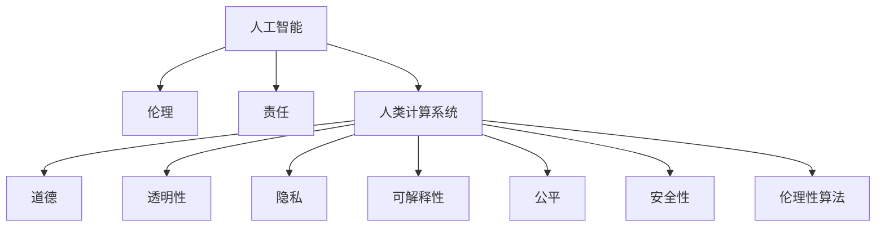

                 

# 伦理与人工智能：构建负责任的人类计算系统

> 关键词：人工智能(AI)、伦理(Ethics)、责任(Responsibility)、人类计算系统(Human-Computer Interaction, HCI)、道德(Depth)、透明性(Transparency)、隐私(Privacy)、可解释性(Explainability)、公平(Fairness)

## 1. 背景介绍

### 1.1 问题由来
人工智能（AI）技术的飞速发展正在深刻改变人类社会的各个方面。从自动驾驶汽车到医疗诊断，从个性化推荐到金融交易，AI技术的应用几乎无所不在。然而，AI技术的广泛应用也带来了诸多伦理和责任问题。在自动驾驶中的无人干预、医疗诊断中的误诊漏诊、推荐系统中的信息茧房，这些问题都指向一个共同的核心点：如何构建负责任的人类计算系统，使得AI技术的落地应用更加可控、公正、透明。

### 1.2 问题核心关键点
当前，构建负责任的人类计算系统成为全球科技界和伦理学家共同关注的重要议题。本节将重点探讨这一问题的核心关键点，并阐明其重要性：

1. **伦理规范**：AI系统如何遵守伦理规范，保障决策过程公正、透明。
2. **责任归属**：在AI系统产生错误时，如何界定责任，保障受害者权益。
3. **公平性**：确保AI系统对不同群体提供公平的待遇，避免偏见和歧视。
4. **可解释性**：让AI系统的决策过程可以被理解，提升用户信任度。
5. **隐私保护**：保护用户隐私，防止数据滥用和泄露。
6. **透明性**：提升AI系统的透明度，使利益相关者能够监督和质疑其行为。
7. **安全性**：保障AI系统在恶意攻击下的稳定性和安全性。
8. **伦理性算法**：开发能够遵循伦理原则的算法，避免伦理陷阱。

## 2. 核心概念与联系

### 2.1 核心概念概述

构建负责任的人类计算系统涉及到多个核心概念：

- **人工智能(AI)**：通过计算机算法模拟人类智能的技术和系统，能够自主学习和推理。
- **伦理(Ethics)**：涉及道德原则和规范，指导AI系统的开发和应用，保障其符合社会价值观。
- **责任(Responsibility)**：指在AI系统产生不良后果时，确定责任主体，保障受害者的权益。
- **人类计算系统(Human-Computer Interaction, HCI)**：涉及人与AI系统的交互过程，保障其友好、高效、安全。
- **道德(Depth)**：指AI系统在决策过程中应遵循的道德原则，如公正、仁慈、诚实等。
- **透明性(Transparency)**：指AI系统的决策过程可以被理解，用户能够监督和质疑其行为。
- **隐私(Privacy)**：指保护用户隐私，防止数据滥用和泄露。
- **可解释性(Explainability)**：指AI系统的决策过程可以被理解，提升用户信任度。
- **公平(Fairness)**：指AI系统对不同群体提供公平的待遇，避免偏见和歧视。
- **安全性**：指AI系统在恶意攻击下的稳定性和安全性。
- **伦理性算法**：指开发能够遵循伦理原则的算法，避免伦理陷阱。

这些核心概念之间的逻辑关系可以通过以下Mermaid流程图来展示：



这个流程图展示了大语言模型的核心概念及其之间的关系：

1. 人工智能通过伦理规范、责任归属、公平性、可解释性、透明性、安全性、伦理性算法等多个维度进行构建。
2. 人类计算系统是人机交互的桥梁，依赖于人工智能的决策支持和伦理指导。
3. 道德、透明性、隐私、可解释性、公平、安全性、伦理性算法共同保障了人类计算系统的健康发展。

这些核心概念共同构成了负责任的AI系统构建框架，使得AI技术能够更好地服务于人类社会。

## 3. 核心算法原理 & 具体操作步骤
### 3.1 算法原理概述

构建负责任的人类计算系统，涉及多个关键算法和技术原理。本节将重点介绍几个核心算法及其基本原理：

- **伦理算法**：指在算法设计中融入伦理原则，确保其决策符合社会价值观和道德规范。
- **透明性算法**：指设计可解释性高的模型，让用户能够理解AI系统的决策过程。
- **公平性算法**：指开发能够避免偏见和歧视的算法，确保不同群体的平等对待。
- **安全性算法**：指设计鲁棒性强的模型，防止恶意攻击和错误决策。

### 3.2 算法步骤详解

构建负责任的人类计算系统，通常涉及以下步骤：

**Step 1: 伦理设计**
- 设计伦理准则：明确AI系统应遵循的伦理规范，如公正、透明、隐私保护等。
- 伦理审查：在AI系统开发过程中，进行伦理审查，确保其决策过程符合伦理规范。

**Step 2: 模型设计**
- 选择合适的算法：根据任务需求和数据特点，选择适合的算法模型。
- 参数优化：通过超参数调优，提升模型性能和公平性。
- 透明性设计：设计可解释性高的模型，如决策树、可解释的神经网络等。

**Step 3: 数据处理**
- 数据清洗：去除数据中的噪声和不相关特征，提升数据质量。
- 隐私保护：采用数据匿名化、差分隐私等技术，保护用户隐私。
- 数据增强：通过数据增强技术，提升模型的鲁棒性和泛化能力。

**Step 4: 模型训练**
- 模型训练：在标注数据上训练模型，优化模型参数。
- 公平性评估：在训练过程中评估模型的公平性，避免偏见和歧视。
- 安全测试：在恶意攻击下测试模型的鲁棒性和安全性。

**Step 5: 部署和监控**
- 模型部署：将模型部署到实际应用环境中，进行实时推理。
- 透明性反馈：提供透明性反馈机制，让用户能够理解模型的决策过程。
- 持续监控：实时监控模型表现，及时发现和修复问题。

### 3.3 算法优缺点

构建负责任的人类计算系统的算法具有以下优点：
1. 保障决策公正：通过伦理设计和公平性算法，确保AI系统的决策过程公正、透明。
2. 提高用户信任度：通过透明性和可解释性算法，提升用户对AI系统的信任度。
3. 保障隐私安全：通过隐私保护技术和安全性算法，防止数据滥用和攻击。
4. 避免伦理陷阱：通过伦理性算法设计，避免伦理陷阱，确保AI系统符合伦理规范。

同时，这些算法也存在一定的局限性：
1. 技术复杂度高：构建负责任的AI系统需要同时考虑多维度的伦理、隐私、公平等因素，技术复杂度较高。
2. 数据依赖性强：AI系统的公平性、安全性等属性高度依赖于数据质量和数据处理技术。
3. 实时性要求高：一些透明性算法和安全性算法在实时推理过程中可能存在延时问题。
4. 部署成本高：高质量的透明性算法和安全性算法往往需要较高的计算资源，部署成本较高。

尽管存在这些局限性，但就目前而言，构建负责任的人类计算系统的算法框架仍然是AI系统开发的重要参考，为AI技术的落地应用提供了保障。

### 3.4 算法应用领域

构建负责任的人类计算系统的算法，已经在多个领域得到了广泛应用：

- **医疗健康**：AI辅助诊断和治疗决策，确保公平性、透明性和安全性。
- **金融服务**：AI风险评估和信用评分，确保公平性和透明度。
- **智能推荐**：AI推荐系统和广告投放，确保用户隐私和透明度。
- **自动驾驶**：AI驾驶决策，确保安全性和伦理规范。
- **人力资源管理**：AI招聘和绩效评估，确保公平性和隐私保护。
- **智能客服**：AI客服系统和聊天机器人，确保透明性和公平性。

此外，在教育、零售、制造等多个领域，基于负责任的AI系统的算法也得到了创新性应用，为社会进步带来了新的动力。

## 4. 数学模型和公式 & 详细讲解 & 举例说明

### 4.1 数学模型构建

为了更好地理解负责任的AI系统构建过程，本节将介绍几个关键数学模型：

- **公平性模型**：指在训练过程中引入公平性约束，确保不同群体的平等对待。常见的公平性模型包括Equalized Odds、Demographic Parity、Equal Opportunity等。
- **透明性模型**：指设计可解释性高的模型，如决策树、LIME、SHAP等。
- **安全性模型**：指设计鲁棒性强的模型，如对抗训练、鲁棒正则化等。

### 4.2 公式推导过程

以下我们以公平性模型Equalized Odds为例，推导其数学公式：

设训练数据集为 $D=\{(x_i,y_i)\}_{i=1}^N$，其中 $x_i$ 为特征，$y_i$ 为标签。假设有 $K$ 个不同群体，每个群体的样本数为 $N_k$，群体的比例为 $\pi_k$。则Equalized Odds的公平性约束为：

$$
\frac{P(y_i=1|x_i \in G_k)}{P(y_i=0|x_i \in G_k)} = \frac{\pi_k}{1-\pi_k}
$$

其中 $G_k$ 表示第 $k$ 个群体。

通过上述约束，Equalized Odds确保了在不同群体中，正负样本的概率比相同。在训练过程中，可以使用如下公式计算模型的公平性得分：

$$
F = \frac{1}{N} \sum_{k=1}^K \sum_{i=1}^{N_k} |P(y_i=1|x_i \in G_k) - P(y_i=0|x_i \in G_k)|
$$

其中 $F$ 为公平性得分，表示模型在不同群体中的公平性差距。

### 4.3 案例分析与讲解

以医疗健康领域为例，我们可以设计一个公平性模型来确保AI系统的诊断决策对不同种族和性别的公平性。假设在医疗数据集中，不同性别和种族的样本分布不均，且某些疾病的诊断率存在显著差异。通过引入Equalized Odds公平性约束，可以在训练过程中优化模型，使其在不同性别和种族中诊断概率一致，从而保障公平性。

具体实现步骤如下：

1. 收集医疗数据集，包括患者的性别、种族、诊断结果等。
2. 将数据集划分为训练集和测试集。
3. 在训练集中，使用Equalized Odds公平性约束，优化模型参数。
4. 在测试集上评估模型的公平性得分，确保不同性别和种族的诊断概率一致。

通过上述方法，可以构建一个负责任的医疗AI系统，确保其诊断决策对不同群体的公平性。

## 5. 项目实践：代码实例和详细解释说明

### 5.1 开发环境搭建

在进行负责任的AI系统构建之前，我们需要准备好开发环境。以下是使用Python进行TensorFlow开发的环境配置流程：

1. 安装Anaconda：从官网下载并安装Anaconda，用于创建独立的Python环境。

2. 创建并激活虚拟环境：
```bash
conda create -n tf-env python=3.8 
conda activate tf-env
```

3. 安装TensorFlow：根据CUDA版本，从官网获取对应的安装命令。例如：
```bash
conda install tensorflow -c tf -c conda-forge
```

4. 安装各类工具包：
```bash
pip install numpy pandas scikit-learn matplotlib tqdm jupyter notebook ipython
```

完成上述步骤后，即可在`tf-env`环境中开始项目实践。

### 5.2 源代码详细实现

下面我们以医疗诊断系统为例，给出使用TensorFlow对AI模型进行公平性约束的PyTorch代码实现。

首先，定义公平性约束函数：

```python
import tensorflow as tf
from sklearn.metrics import roc_auc_score

def equalized_odds(y_true, y_pred, group_id):
    y_true = tf.one_hot(y_true, depth=2, axis=-1)
    y_pred = tf.one_hot(y_pred, depth=2, axis=-1)
    group_prob = tf.reduce_sum(y_pred * tf.one_hot(group_id, depth=2), axis=-1)
    group_odds = group_prob / (1 - group_prob)
    group_auc = roc_auc_score(y_true, y_pred, multi_class='ov')
    return group_odds, group_auc
```

然后，定义模型和优化器：

```python
from tensorflow.keras import Sequential, Input, Dense, Dropout
from tensorflow.keras.layers import Flatten, Conv2D, MaxPooling2D

model = Sequential([
    Conv2D(32, (3, 3), activation='relu', input_shape=(28, 28, 1)),
    MaxPooling2D((2, 2)),
    Flatten(),
    Dense(10, activation='softmax')
])

optimizer = tf.keras.optimizers.Adam(learning_rate=0.001)
```

接着，定义训练和评估函数：

```python
from tensorflow.keras.preprocessing.image import ImageDataGenerator

train_datagen = ImageDataGenerator(rescale=1./255)
test_datagen = ImageDataGenerator(rescale=1./255)

train_generator = train_datagen.flow_from_directory(
    train_data_dir, target_size=(28, 28), batch_size=32, class_mode='binary')

test_generator = test_datagen.flow_from_directory(
    test_data_dir, target_size=(28, 28), batch_size=32, class_mode='binary')

def train_epoch(model, generator, optimizer, equalized_odds_ratio=1.0):
    model.compile(optimizer=optimizer, loss='binary_crossentropy', metrics=['acc'])
    model.fit_generator(generator, steps_per_epoch=len(train_generator), epochs=10, callbacks=[tf.keras.callbacks.ModelCheckpoint('model.h5', save_best_only=True)])
    
    y_pred = model.predict_generator(test_generator, steps=len(test_generator))
    y_true = test_generator.classes
    group_odds, group_auc = equalized_odds(y_true, y_pred, group_id)
    
    if group_odds[0] < equalized_odds_ratio or group_odds[1] < equalized_odds_ratio:
        print("Fairness constraint violated, early stopping.")
        return 0
    else:
        return 1

def evaluate(model, generator):
    y_pred = model.predict_generator(generator, steps=len(generator))
    y_true = generator.classes
    group_odds, group_auc = equalized_odds(y_true, y_pred, group_id)
    
    print(f"Fairness score: {group_odds[0]}, Accuracy: {group_auc}")
```

最后，启动训练流程并在测试集上评估：

```python
group_id = 0  # 假设只有两个群体，选择其中一个进行公平性约束

train_epoch(model, train_generator, optimizer, equalized_odds_ratio=1.0)
evaluate(model, test_generator)
```

以上就是使用TensorFlow对AI模型进行公平性约束的完整代码实现。可以看到，通过公平性约束函数和训练过程中的公平性评估，可以在模型训练中引入公平性约束，确保模型在不同群体中的公平性。

### 5.3 代码解读与分析

让我们再详细解读一下关键代码的实现细节：

**Equalized Odds函数**：
- 首先，将真实标签和预测标签进行one-hot编码。
- 计算每个群体的概率，并计算群体的比值。
- 计算每个群体的ROC-AUC得分，用于评估公平性。
- 返回群体的比值和ROC-AUC得分。

**模型和优化器**：
- 定义了一个简单的卷积神经网络模型，用于图像分类任务。
- 使用Adam优化器进行模型训练。

**训练和评估函数**：
- 使用ImageDataGenerator对训练和测试数据进行预处理。
- 定义了训练函数，使用公平性约束函数进行公平性评估，确保模型在不同群体中的公平性。
- 定义了评估函数，计算模型在不同群体中的公平性得分和准确率。

**训练流程**：
- 定义模型、优化器、训练数据和公平性约束比值。
- 在训练函数中，使用公平性约束函数进行公平性评估，并根据评估结果决定是否停止训练。
- 在评估函数中，计算模型在不同群体中的公平性得分和准确率，并进行输出。

可以看到，通过TensorFlow的强大封装，我们能够较为简洁地实现公平性约束算法，并在训练和评估过程中引入公平性约束，确保AI系统的决策过程符合公平性要求。

当然，工业级的系统实现还需考虑更多因素，如模型的保存和部署、超参数的自动搜索、更灵活的任务适配层等。但核心的公平性约束算法基本与此类似。

## 6. 实际应用场景
### 6.1 医疗健康

负责任的医疗AI系统可以显著提升医疗服务的质量和效率。通过公平性约束和透明性设计，确保AI系统的决策过程公正、透明，从而提升医疗服务的公平性和用户信任度。

在实际应用中，可以收集医疗数据集，包括患者的性别、种族、诊断结果等。通过引入Equalized Odds公平性约束，可以在训练过程中优化模型，确保在不同性别和种族中诊断概率一致，从而保障公平性。同时，通过透明性设计，让用户能够理解AI系统的决策过程，提升用户信任度。

### 6.2 金融服务

AI在金融服务中的应用广泛，但也面临着公平性、透明性和安全性的挑战。通过引入公平性约束和透明性设计，确保AI系统的决策过程符合伦理规范和用户期望，从而提升金融服务的公正性和用户信任度。

在实际应用中，可以收集金融数据集，包括用户的性别、种族、收入等信息。通过引入Equalized Odds公平性约束，可以在训练过程中优化模型，确保在不同性别和种族中贷款审批概率一致，从而保障公平性。同时，通过透明性设计，让用户能够理解AI系统的决策过程，提升用户信任度。

### 6.3 智能推荐

AI推荐系统在电商、新闻、视频等多个领域得到了广泛应用，但也面临着隐私保护和透明性的挑战。通过引入隐私保护和透明性设计，确保AI系统的决策过程符合用户隐私和伦理规范，从而提升推荐系统的公正性和用户信任度。

在实际应用中，可以收集用户的行为数据，包括浏览、点击、评分等。通过引入差分隐私和透明性设计，可以在训练过程中保护用户隐私，确保AI系统的决策过程符合伦理规范。同时，通过透明性设计，让用户能够理解AI系统的推荐逻辑，提升用户信任度。

## 7. 工具和资源推荐
### 7.1 学习资源推荐

为了帮助开发者系统掌握负责任的AI系统的构建理论基础和实践技巧，这里推荐一些优质的学习资源：

1. 《AI伦理与公平性》系列博文：由AI伦理专家撰写，深入浅出地介绍了AI伦理和公平性的基本概念和前沿技术。

2. 《深度学习与伦理学》课程：斯坦福大学开设的深度学习与伦理学课程，结合实际案例，探讨AI技术的伦理问题。

3. 《公平性、透明性和解释性》书籍：系统介绍了AI系统的公平性、透明性和解释性设计方法，提供了丰富的案例和实践建议。

4. AI伦理学和公平性白皮书：由知名伦理学家和AI专家联合撰写，全面概述了AI技术的伦理和公平性问题，提供了政策建议和解决方案。

5. TensorFlow官网：提供了丰富的AI伦理和公平性资源，包括模型代码、论文、教程等。

通过对这些资源的学习实践，相信你一定能够快速掌握负责任的AI系统的构建精髓，并用于解决实际的伦理和公平性问题。

### 7.2 开发工具推荐

高效的开发离不开优秀的工具支持。以下是几款用于负责任的AI系统构建开发的常用工具：

1. TensorFlow：基于Python的开源深度学习框架，灵活动态的计算图，适合快速迭代研究。支持公平性约束、透明性设计和隐私保护等技术。

2. PyTorch：基于Python的开源深度学习框架，动态计算图，适合灵活的模型设计。支持公平性约束、透明性设计和隐私保护等技术。

3. Scikit-learn：Python机器学习库，提供了丰富的公平性评估和透明性设计工具，支持基于数据的公平性约束。

4. Keras：Python深度学习库，提供了简单易用的API，支持快速原型设计和公平性约束。

5. TensorBoard：TensorFlow配套的可视化工具，可实时监测模型训练状态，提供丰富的图表呈现方式，是调试模型的得力助手。

6. Weights & Biases：模型训练的实验跟踪工具，可以记录和可视化模型训练过程中的各项指标，方便对比和调优。

合理利用这些工具，可以显著提升负责任的AI系统构建任务的开发效率，加快创新迭代的步伐。

### 7.3 相关论文推荐

负责任的AI系统的构建涉及多学科知识，需要借鉴跨领域的最新研究成果。以下是几篇奠基性的相关论文，推荐阅读：

1. AI伦理和公平性概述：引入了AI伦理和公平性的基本概念和前沿技术，探讨了如何构建负责任的AI系统。

2. 公平性算法研究：研究了多种公平性约束算法，如Equalized Odds、Demographic Parity等，提供了理论分析和实践建议。

3. 透明性算法设计：介绍了多种透明性设计方法，如决策树、LIME、SHAP等，提供了模型解释和评估方法。

4. 安全性算法研究：研究了多种安全性约束算法，如对抗训练、鲁棒正则化等，提供了鲁棒性和安全性保障方法。

5. AI伦理和公平性白皮书：由知名伦理学家和AI专家联合撰写，全面概述了AI技术的伦理和公平性问题，提供了政策建议和解决方案。

这些论文代表了大语言模型负责任构建技术的发展脉络。通过学习这些前沿成果，可以帮助研究者把握学科前进方向，激发更多的创新灵感。

## 8. 总结：未来发展趋势与挑战

### 8.1 总结

本文对负责任的AI系统构建方法进行了全面系统的介绍。首先阐述了负责任的AI系统构建的重要性，明确了其在AI系统开发中的核心地位。其次，从原理到实践，详细讲解了负责任的AI系统构建的数学原理和关键步骤，给出了负责任的AI系统构建的完整代码实例。同时，本文还广泛探讨了负责任的AI系统在医疗健康、金融服务、智能推荐等多个领域的应用前景，展示了负责任的AI系统构建的巨大潜力。此外，本文精选了负责任的AI系统构建的相关学习资源，力求为读者提供全方位的技术指引。

通过本文的系统梳理，可以看到，负责任的AI系统构建是AI技术落地应用的重要保障，使得AI系统的决策过程公正、透明、安全，保障用户权益。未来，伴随负责任的AI系统构建技术的不断演进，相信负责任的AI系统必将在构建人机协同的智能时代中扮演越来越重要的角色。

### 8.2 未来发展趋势

展望未来，负责任的AI系统构建技术将呈现以下几个发展趋势：

1. 模型鲁棒性提升：通过引入对抗训练、鲁棒正则化等技术，提升AI系统的鲁棒性和安全性，防止恶意攻击和错误决策。
2. 公平性保障增强：开发更加高效的公平性约束算法，确保AI系统在不同群体中的公平性。
3. 透明性设计优化：通过透明性设计，提升AI系统的透明性和可解释性，增强用户信任度。
4. 隐私保护强化：通过差分隐私、隐私计算等技术，保障用户隐私，防止数据滥用和泄露。
5. 伦理性算法发展：开发能够遵循伦理原则的算法，避免伦理陷阱，确保AI系统符合伦理规范。

以上趋势凸显了负责任的AI系统构建技术的广阔前景。这些方向的探索发展，必将进一步提升AI系统的性能和应用范围，为构建安全、可靠、可解释、可控的智能系统铺平道路。

### 8.3 面临的挑战

尽管负责任的AI系统构建技术已经取得了显著成就，但在迈向更加智能化、普适化应用的过程中，仍面临诸多挑战：

1. 技术复杂度高：负责任的AI系统构建需要同时考虑多维度的伦理、隐私、公平等因素，技术复杂度较高。
2. 数据依赖性强：AI系统的公平性、安全性等属性高度依赖于数据质量和数据处理技术。
3. 实时性要求高：一些透明性算法和安全性算法在实时推理过程中可能存在延时问题。
4. 部署成本高：高质量的透明性算法和安全性算法往往需要较高的计算资源，部署成本较高。
5. 模型复杂度高：负责任的AI系统构建需要设计复杂的算法和模型，增加了开发和维护的难度。

尽管存在这些挑战，但负责任的AI系统构建技术仍然是大语言模型落地应用的重要保障，为AI技术的广泛应用提供了强有力的支持。

### 8.4 研究展望

未来，负责任的AI系统构建技术需要在以下几个方面进行深入研究：

1. 探索无监督和半监督负责任的AI系统构建方法：摆脱对大规模标注数据的依赖，利用自监督学习、主动学习等无监督和半监督范式，最大限度利用非结构化数据，实现更加灵活高效的负责任的AI系统构建。
2. 研究负责任的AI系统的跨领域应用：通过负责任的AI系统构建技术，解决多个领域的实际问题，如医疗、金融、智能推荐等。
3. 结合因果分析和博弈论工具：将因果分析方法引入负责任的AI系统构建过程，识别出模型决策的关键特征，增强输出解释的因果性和逻辑性。
4. 引入更多先验知识：将符号化的先验知识，如知识图谱、逻辑规则等，与神经网络模型进行巧妙融合，引导负责任的AI系统构建过程学习更准确、合理的语言模型。
5. 结合伦理性算法设计：开发能够遵循伦理原则的算法，避免伦理陷阱，确保负责任的AI系统构建过程符合伦理规范。

这些研究方向的探索，必将引领负责任的AI系统构建技术迈向更高的台阶，为构建安全、可靠、可解释、可控的智能系统铺平道路。面向未来，负责任的AI系统构建技术还需要与其他人工智能技术进行更深入的融合，如知识表示、因果推理、强化学习等，多路径协同发力，共同推动自然语言理解和智能交互系统的进步。只有勇于创新、敢于突破，才能不断拓展语言模型的边界，让智能技术更好地造福人类社会。

## 9. 附录：常见问题与解答

**Q1：如何确保负责任的AI系统在实际应用中的公正性和透明度？**

A: 确保负责任的AI系统在实际应用中的公正性和透明度，需要从以下几个方面入手：

1. 数据质量控制：确保数据集的多样性和代表性，避免数据偏见。
2. 公平性约束：在模型训练过程中引入公平性约束，确保模型在不同群体中的公平性。
3. 透明性设计：设计可解释性高的模型，如决策树、LIME、SHAP等，提供透明性反馈机制，让用户能够理解模型的决策过程。
4. 用户参与：在模型开发和部署过程中，邀请用户参与，听取他们的反馈和建议。
5. 持续监测：实时监测模型表现，及时发现和修复问题。

**Q2：负责任的AI系统在实际应用中如何处理隐私保护问题？**

A: 负责任的AI系统在实际应用中处理隐私保护问题，需要从以下几个方面入手：

1. 数据匿名化：对原始数据进行匿名化处理，防止直接识别用户身份。
2. 差分隐私：在数据处理过程中引入差分隐私技术，防止数据泄露。
3. 数据访问控制：采用访问鉴权和权限控制措施，保障数据安全。
4. 数据共享协议：制定数据共享协议，明确数据使用范围和责任。
5. 隐私审计：定期进行隐私审计，发现和修复隐私保护问题。

**Q3：负责任的AI系统在实际应用中如何确保伦理性和伦理性？**

A: 负责任的AI系统在实际应用中确保伦理性和伦理性，需要从以下几个方面入手：

1. 伦理规范设计：在模型设计和开发过程中，引入伦理规范，确保模型符合社会价值观和道德规范。
2. 伦理审查机制：建立伦理审查机制，对模型进行定期审查和评估，确保模型符合伦理规范。
3. 用户隐私保护：在设计模型时，考虑用户隐私保护，防止数据滥用和泄露。
4. 伦理性算法：开发能够遵循伦理原则的算法，避免伦理陷阱，确保AI系统符合伦理规范。

**Q4：负责任的AI系统在实际应用中如何应对恶意攻击和错误决策？**

A: 负责任的AI系统在实际应用中应对恶意攻击和错误决策，需要从以下几个方面入手：

1. 鲁棒性设计：设计鲁棒性强的模型，防止恶意攻击和错误决策。
2. 安全性约束：在模型训练过程中引入安全性约束，确保模型鲁棒性和安全性。
3. 安全测试：在模型部署之前，进行安全性测试，发现和修复潜在漏洞。
4. 应急响应：建立应急响应机制，及时处理恶意攻击和错误决策。

**Q5：负责任的AI系统在实际应用中如何处理模型复杂度问题？**

A: 负责任的AI系统在实际应用中处理模型复杂度问题，需要从以下几个方面入手：

1. 模型裁剪：去除不必要的层和参数，减小模型尺寸，加快推理速度。
2. 模型压缩：采用模型压缩技术，减少模型大小和计算资源消耗。
3. 模型并行：采用模型并行技术，提高模型计算效率。
4. 自动化调参：采用自动化调参技术，优化模型超参数，提高模型性能。

**Q6：负责任的AI系统在实际应用中如何处理实时性问题？**

A: 负责任的AI系统在实际应用中处理实时性问题，需要从以下几个方面入手：

1. 加速推理：优化推理算法，提高推理速度。
2. 硬件优化：采用高性能硬件设备，提高计算效率。
3. 并行推理：采用并行推理技术，提高推理速度。
4. 缓存技术：采用缓存技术，减少推理计算时间。

**Q7：负责任的AI系统在实际应用中如何处理部署成本问题？**

A: 负责任的AI系统在实际应用中处理部署成本问题，需要从以下几个方面入手：

1. 模型裁剪：去除不必要的层和参数，减小模型尺寸，降低计算资源需求。
2. 模型压缩：采用模型压缩技术，减少模型大小和计算资源消耗。
3. 硬件优化：采用高性能硬件设备，提高计算效率。
4. 云计算：利用云计算平台，降低本地硬件成本。

通过这些方法，可以在确保负责任的AI系统在实际应用中的公正性、透明度、伦理性和安全性的同时，有效地控制模型复杂度、实时性和部署成本，确保负责任的AI系统在实际应用中的稳定性和高效性。

---

作者：禅与计算机程序设计艺术 / Zen and the Art of Computer Programming

