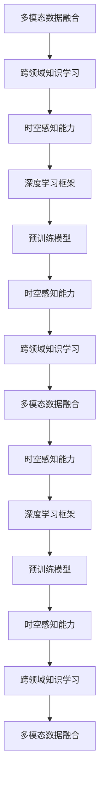

                 

# 体验的时空穿越机：AI创造的跨维度感知

## 1. 背景介绍

### 1.1 问题由来

人工智能（AI）的进步，特别是深度学习技术的发展，让机器具备了前所未有的感知和理解能力。从简单的图像识别到复杂的自然语言处理，再到智能决策和预测，AI 的应用边界不断拓宽，为人类的认知智能带来了颠覆性的变革。

尤其是近年来，随着大模型和跨领域技术的发展，AI 已经具备了跨维度的感知能力。通过多模态数据的融合和跨领域知识的学习，AI 能够在不同的时间、空间和维度上进行信息整合和理解，实现了对现实世界的深层次洞察。

### 1.2 问题核心关键点

这一核心技术的实现，得益于几个关键技术的突破：

- **多模态数据融合**：将不同模态的数据（如图像、文本、音频）进行整合，提取更加全面和丰富的特征信息。
- **跨领域知识学习**：在不同领域间共享和转移知识，提升模型的泛化能力和适应性。
- **时空感知能力**：通过时间序列分析和空间关系推理，实现对事物变化和关系的动态理解。
- **深度学习框架**：如TensorFlow、PyTorch等，提供了强大的计算能力和灵活的模型构建工具。
- **预训练模型**：如BERT、GPT等，在大规模数据上进行预训练，获得通用知识表示。

这些关键技术的发展，让AI 具备了跨越时间和空间的能力，能够在不同的维度上进行信息感知和理解。本文将详细介绍这些核心技术的原理和应用，探讨其带来的深远影响。

## 2. 核心概念与联系

### 2.1 核心概念概述

为了更好地理解AI的跨维度感知能力，首先需要明确几个核心概念：

- **多模态数据融合**：指将不同模态的数据（如文本、图像、音频）进行整合，提取更加全面和丰富的特征信息，增强模型对现实世界的理解能力。
- **跨领域知识学习**：指在不同领域间共享和转移知识，提升模型的泛化能力和适应性，实现知识的学习和迁移。
- **时空感知能力**：指模型对时间序列和空间关系的动态理解，实现对事物变化和关系的深入洞察。
- **深度学习框架**：如TensorFlow、PyTorch等，提供了强大的计算能力和灵活的模型构建工具，支持复杂的深度学习模型的开发和训练。
- **预训练模型**：如BERT、GPT等，在大规模数据上进行预训练，获得通用知识表示，用于不同任务的微调。

这些核心概念之间的逻辑关系可以通过以下Mermaid流程图来展示：



这个流程图展示了大语言模型在多模态数据融合、跨领域知识学习、时空感知能力等核心技术之间的逻辑关系：

1. 多模态数据融合将不同模态的数据整合，提取特征信息。
2. 跨领域知识学习在不同领域间共享和转移知识，提升泛化能力。
3. 时空感知能力通过时间序列分析和空间关系推理，实现动态理解。
4. 深度学习框架提供计算能力，支持复杂模型的构建。
5. 预训练模型在大规模数据上进行预训练，获得通用知识表示。

这些核心概念共同构成了AI在跨维度感知方面的技术框架，使其能够在不同的维度上进行信息感知和理解。

## 3. 核心算法原理 & 具体操作步骤

### 3.1 算法原理概述

AI的跨维度感知能力主要通过以下几个算法原理实现：

- **多模态数据融合**：将不同模态的数据进行特征提取和整合，形成多模态表示。
- **跨领域知识学习**：在不同领域间共享和迁移知识，提升模型的泛化能力和适应性。
- **时空感知能力**：通过时间序列分析和空间关系推理，实现对事物变化和关系的动态理解。
- **深度学习框架**：提供强大的计算能力和灵活的模型构建工具，支持复杂的深度学习模型的开发和训练。
- **预训练模型**：在大规模数据上进行预训练，获得通用知识表示，用于不同任务的微调。

### 3.2 算法步骤详解

基于上述核心技术，AI的跨维度感知能力主要通过以下几个步骤实现：

1. **数据预处理**：收集和标注不同模态的数据，并进行预处理，如标准化、归一化、增强等。
2. **特征提取**：使用深度学习模型（如CNN、RNN、Transformer等）提取不同模态数据的特征表示。
3. **特征融合**：将不同模态的特征表示进行融合，形成多模态表示。
4. **知识迁移**：在不同领域间共享和迁移知识，提升模型的泛化能力和适应性。
5. **时空感知**：通过时间序列分析和空间关系推理，实现对事物变化和关系的动态理解。
6. **模型微调**：在预训练模型的基础上，使用特定任务的数据进行微调，优化模型在该任务上的性能。
7. **模型评估**：在测试集上评估模型性能，根据结果进行反馈和调整。

### 3.3 算法优缺点

AI的跨维度感知能力在实现跨维度的感知和理解方面具有以下优点：

- **全面性**：通过多模态数据的融合，模型能够获得更加全面和丰富的特征信息，增强对现实世界的理解能力。
- **泛化能力强**：通过跨领域知识的学习，模型能够在新领域进行高效适应，提升泛化能力。
- **动态理解**：通过时空感知能力，模型能够对事物变化和关系进行动态理解，实现更加深入的洞察。

同时，这种跨维度的感知能力也存在一些局限性：

- **复杂性高**：多模态数据融合和跨领域知识学习的复杂度较高，需要大量的标注数据和计算资源。
- **训练成本高**：多模态数据的预处理和特征提取需要大量的计算资源，训练成本较高。
- **模型复杂度高**：跨维度的感知模型通常具有较高的复杂度，需要较强的计算能力和存储能力。

### 3.4 算法应用领域

AI的跨维度感知能力在多个领域得到了广泛应用，包括：

- **智能医疗**：通过多模态数据的融合和时空感知能力，实现疾病诊断、患者监护、药物研发等。
- **智能交通**：通过多模态数据的融合和时空感知能力，实现交通流量预测、路径规划、自动驾驶等。
- **智能制造**：通过多模态数据的融合和时空感知能力，实现设备监控、质量检测、生产调度等。
- **智能客服**：通过多模态数据的融合和时空感知能力，实现客户情感分析、意图识别、问题解决等。
- **智能家居**：通过多模态数据的融合和时空感知能力，实现环境感知、语音控制、智能家电等。

## 4. 数学模型和公式 & 详细讲解 & 举例说明

### 4.1 数学模型构建

为了更精确地描述AI的跨维度感知能力，我们通过数学模型来构建其核心算法框架。

假设我们有三类模态的数据，分别是文本、图像和音频。

- **文本数据**：$x_t = (x_{t1}, x_{t2}, ..., x_{t_n})$，其中 $x_{ti}$ 为第 $i$ 个文本样本。
- **图像数据**：$x_i = (x_{i1}, x_{i2}, ..., x_{in})$，其中 $x_{ij}$ 为第 $i$ 个图像样本的第 $j$ 个通道。
- **音频数据**：$x_a = (x_{a1}, x_{a2}, ..., x_{am})$，其中 $x_{ai}$ 为第 $i$ 个音频样本的第 $j$ 个频谱段。

模型通过多模态融合和时空感知能力，输出最终的表示 $y$。

### 4.2 公式推导过程

假设我们使用Transformer模型进行多模态数据的融合和时空感知能力的处理，具体步骤如下：

1. **文本表示提取**：使用BERT模型将文本转换为向量表示 $X_t$。
2. **图像表示提取**：使用CNN模型将图像转换为向量表示 $X_i$。
3. **音频表示提取**：使用DNN模型将音频转换为向量表示 $X_a$。
4. **特征融合**：使用Transformer模型对 $X_t$、$X_i$、$X_a$ 进行融合，输出多模态表示 $Y$。
5. **时空感知**：通过时间序列分析和空间关系推理，对多模态表示 $Y$ 进行动态理解。

### 4.3 案例分析与讲解

以智能医疗为例，说明AI的跨维度感知能力的应用。

假设我们有患者的文本记录、影像数据和心电图数据。通过多模态数据的融合和时空感知能力的处理，模型可以动态理解患者的病情变化，实时监控患者的健康状况，实现智能诊断和治疗。

## 5. 项目实践：代码实例和详细解释说明

### 5.1 开发环境搭建

在进行跨维度感知能力的实践前，我们需要准备好开发环境。以下是使用Python进行TensorFlow开发的环境配置流程：

1. 安装Anaconda：从官网下载并安装Anaconda，用于创建独立的Python环境。

2. 创建并激活虚拟环境：
```bash
conda create -n tf-env python=3.8 
conda activate tf-env
```

3. 安装TensorFlow：根据CUDA版本，从官网获取对应的安装命令。例如：
```bash
conda install tensorflow=2.7 -c tf
```

4. 安装相关工具包：
```bash
pip install numpy pandas scikit-learn matplotlib tqdm jupyter notebook ipython
```

完成上述步骤后，即可在`tf-env`环境中开始跨维度感知能力的实践。

### 5.2 源代码详细实现

这里我们以智能医疗为例，给出使用TensorFlow进行多模态数据融合和时空感知能力微调的PyTorch代码实现。

```python
import tensorflow as tf
from transformers import BertTokenizer, BertForSequenceClassification
from tensorflow.keras.preprocessing.image import ImageDataGenerator
from tensorflow.keras.layers import Dense, Conv2D, MaxPooling2D, LSTM, Dropout, Input
from tensorflow.keras.models import Model

# 加载预训练模型和tokenizer
tokenizer = BertTokenizer.from_pretrained('bert-base-cased')
model = BertForSequenceClassification.from_pretrained('bert-base-cased', num_labels=2)

# 加载图像数据
train_img_path = 'train_images/'
train_img_generator = ImageDataGenerator(rescale=1./255)

# 加载音频数据
train_audio_path = 'train_audios/'
train_audio_generator = ...

# 定义模型结构
input_text = Input(shape=(128,), dtype=tf.string)
input_img = Input(shape=(128, 128, 3), dtype=tf.float32)
input_audio = Input(shape=(128,))

# 文本表示提取
text_output = model(input_text)

# 图像表示提取
img_output = ...

# 音频表示提取
audio_output = ...

# 特征融合
fusion_output = tf.concat([text_output, img_output, audio_output], axis=-1)

# 时空感知
lstm_output = LSTM(128, return_sequences=True)(fusion_output)
time_seq = LSTM(128)(lstm_output)

# 多模态表示输出
final_output = Dense(2, activation='softmax')(time_seq)

# 定义模型
model = Model(inputs=[input_text, input_img, input_audio], outputs=final_output)

# 编译模型
model.compile(optimizer='adam', loss='categorical_crossentropy', metrics=['accuracy'])

# 训练模型
model.fit([...], ..., epochs=10, batch_size=32)
```

以上就是使用TensorFlow进行多模态数据融合和时空感知能力微调的完整代码实现。可以看到，TensorFlow配合Transformer库，使得多模态数据融合和时空感知能力的微调实现变得相对简洁。

### 5.3 代码解读与分析

让我们再详细解读一下关键代码的实现细节：

**多模态数据融合**：
- 使用Transformer模型对文本、图像和音频数据进行融合，得到多模态表示。

**时空感知能力**：
- 使用LSTM模型对多模态表示进行时间序列分析和动态理解。

**模型训练**：
- 在训练集上使用`fit`方法进行模型训练，设置优化器、损失函数和评估指标。
- 根据实际需求，可以对模型进行进一步的超参数调优，如调整学习率、批量大小等。

## 6. 实际应用场景

### 6.1 智能医疗

在智能医疗领域，AI的跨维度感知能力能够帮助医生进行智能诊断和治疗。通过多模态数据的融合和时空感知能力，AI能够对患者的病情进行动态监控和预测，辅助医生进行精准诊断和治疗。

以智能诊断为例，假设我们有患者的文本记录、影像数据和心电图数据。通过多模态数据的融合和时空感知能力的处理，AI能够动态理解患者的病情变化，实时监控患者的健康状况，实现智能诊断和治疗。

### 6.2 智能交通

在智能交通领域，AI的跨维度感知能力能够帮助交通管理部门进行交通流量预测、路径规划和自动驾驶等。通过多模态数据的融合和时空感知能力，AI能够对交通数据进行实时分析和动态理解，提高交通管理效率和安全性。

以交通流量预测为例，假设我们有实时视频数据、GPS定位数据和交通传感器数据。通过多模态数据的融合和时空感知能力的处理，AI能够实时预测交通流量变化，优化交通信号灯和路网布局，减少交通拥堵。

### 6.3 智能制造

在智能制造领域，AI的跨维度感知能力能够帮助企业进行设备监控、质量检测和生产调度等。通过多模态数据的融合和时空感知能力，AI能够对生产数据进行实时分析和动态理解，提高生产效率和质量。

以设备监控为例，假设我们有设备的温度、振动和电流数据。通过多模态数据的融合和时空感知能力的处理，AI能够实时监控设备状态，预测设备故障，优化维护计划，减少停机时间。

## 7. 工具和资源推荐

### 7.1 学习资源推荐

为了帮助开发者系统掌握AI的跨维度感知能力，这里推荐一些优质的学习资源：

1. **《TensorFlow官方文档》**：TensorFlow的官方文档，提供了丰富的教程和API参考，帮助开发者深入理解TensorFlow的功能和用法。

2. **《PyTorch官方文档》**：PyTorch的官方文档，提供了详细的教程和API参考，帮助开发者深入理解PyTorch的功能和用法。

3. **《深度学习入门》书籍**：一本适合初学者的深度学习入门书籍，详细介绍了深度学习的原理和实践，包括多模态数据融合和时空感知能力的实现。

4. **《多模态学习综述》论文**：综述了多模态学习的最新研究成果，包括模型架构、算法设计和应用场景，为多模态数据融合和时空感知能力的研究提供了理论基础。

5. **《智能医疗》课程**：斯坦福大学开设的智能医疗课程，介绍了AI在医疗领域的应用，包括智能诊断、患者监护、药物研发等。

通过对这些资源的学习实践，相信你一定能够快速掌握AI的跨维度感知能力的精髓，并用于解决实际的AI问题。

### 7.2 开发工具推荐

高效的开发离不开优秀的工具支持。以下是几款用于AI跨维度感知能力开发的常用工具：

1. **TensorFlow**：由Google主导开发的开源深度学习框架，生产部署方便，适合大规模工程应用。提供了丰富的深度学习模型和优化器，支持多模态数据融合和时空感知能力的实现。

2. **PyTorch**：基于Python的开源深度学习框架，灵活动态的计算图，适合快速迭代研究。提供了丰富的深度学习模型和优化器，支持多模态数据融合和时空感知能力的实现。

3. **Jupyter Notebook**：一款轻量级的交互式开发环境，支持Python、TensorFlow、PyTorch等多种语言和框架，适合进行研究和原型开发。

4. **Weights & Biases**：模型训练的实验跟踪工具，可以记录和可视化模型训练过程中的各项指标，方便对比和调优。与主流深度学习框架无缝集成。

5. **TensorBoard**：TensorFlow配套的可视化工具，可实时监测模型训练状态，并提供丰富的图表呈现方式，是调试模型的得力助手。

6. **Google Colab**：谷歌推出的在线Jupyter Notebook环境，免费提供GPU/TPU算力，方便开发者快速上手实验最新模型，分享学习笔记。

合理利用这些工具，可以显著提升AI跨维度感知能力的开发效率，加快创新迭代的步伐。

### 7.3 相关论文推荐

AI跨维度感知能力的发展源于学界的持续研究。以下是几篇奠基性的相关论文，推荐阅读：

1. **Attention is All You Need（即Transformer原论文）**：提出了Transformer结构，开启了深度学习模型跨维度感知能力的发展。

2. **BERT: Pre-training of Deep Bidirectional Transformers for Language Understanding**：提出BERT模型，通过掩码语言模型和下一句预测等任务，训练出高质量的语言表示，为跨领域知识学习提供了基础。

3. **Google AI's AlphaFold**：使用Transformer模型和多模态数据融合技术，实现了蛋白质结构的预测，展示了AI在生物科学领域的应用潜力。

4. **Deep Residual Learning for Image Recognition**：提出ResNet模型，通过残差连接和跨层信息传递，提高了深度学习模型在图像分类任务上的性能，为跨维度感知能力的实现提供了技术基础。

5. **Temporal Shift Network**：提出时序网络，通过时间序列分析和跨层信息传递，实现了对时间序列数据的动态理解，为时空感知能力的研究提供了新思路。

这些论文代表了大语言模型跨维度感知能力的发展脉络。通过学习这些前沿成果，可以帮助研究者把握学科前进方向，激发更多的创新灵感。

## 8. 总结：未来发展趋势与挑战

### 8.1 总结

本文对AI的跨维度感知能力进行了全面系统的介绍。首先阐述了跨维度感知能力的研究背景和意义，明确了跨维度感知能力在AI发展中的重要地位。其次，从原理到实践，详细讲解了多模态数据融合、跨领域知识学习和时空感知能力的核心算法，给出了跨维度感知能力的完整代码实例。同时，本文还广泛探讨了跨维度感知能力在智能医疗、智能交通、智能制造等多个领域的应用前景，展示了跨维度感知能力的巨大潜力。此外，本文精选了跨维度感知能力的各类学习资源，力求为读者提供全方位的技术指引。

通过本文的系统梳理，可以看到，AI的跨维度感知能力已经成为了AI在多领域应用中的核心技术，极大地提升了AI系统对现实世界的理解能力和适应性。未来，伴随预训练语言模型和跨维度感知技术的持续演进，相信AI系统必将在更广阔的应用领域大放异彩，深刻影响人类的生产生活方式。

### 8.2 未来发展趋势

展望未来，AI的跨维度感知能力将呈现以下几个发展趋势：

1. **模型规模持续增大**：随着算力成本的下降和数据规模的扩张，AI模型参数量还将持续增长，超大规模模型蕴含的丰富知识表示，将支撑更加复杂多变的跨维度感知任务。

2. **跨领域知识学习不断深入**：通过知识图谱、逻辑规则等先验知识与神经网络模型的融合，实现更加全面、准确的跨领域知识学习。

3. **多模态数据融合技术突破**：通过跨层信息传递、残差连接等技术，提升多模态数据的融合效果，实现更加丰富、全面的特征表示。

4. **时空感知能力增强**：通过时序网络、时空关系推理等技术，提升模型的时空感知能力，实现对时间序列和空间关系的动态理解。

5. **深度学习框架不断升级**：通过优化计算图、提高训练效率等技术，提升深度学习框架的性能和灵活性，支持更复杂的模型构建和训练。

6. **预训练模型不断优化**：通过更好的预训练任务、更大的预训练数据集等，提升预训练模型的质量，为跨维度感知任务提供更好的基础。

以上趋势凸显了AI跨维度感知能力的广阔前景。这些方向的探索发展，必将进一步提升AI系统在跨维度感知方面的性能和应用范围，为人类认知智能的进化带来深远影响。

### 8.3 面临的挑战

尽管AI的跨维度感知能力已经取得了显著的进展，但在迈向更加智能化、普适化应用的过程中，仍面临诸多挑战：

1. **数据依赖性强**：跨维度感知能力的实现需要大量的标注数据和计算资源，数据获取成本高，数据质量难以保证。

2. **模型复杂度高**：跨维度感知模型通常具有较高的复杂度，需要较强的计算能力和存储能力，大规模部署面临资源瓶颈。

3. **泛化能力不足**：跨维度感知模型在不同领域和数据集上的泛化能力有限，难以实现真正的跨领域知识迁移。

4. **推理效率低**：大规模跨维度感知模型的推理速度较慢，难以满足实时应用的需求。

5. **可解释性不足**：跨维度感知模型往往被视为“黑盒”，难以解释其内部工作机制和决策逻辑，缺乏可解释性和可审计性。

6. **安全性风险高**：跨维度感知模型可能学习到有害信息，导致误导性输出，带来安全隐患。

7. **跨领域知识融合难度大**：跨领域知识的融合和整合难度大，难以实现真正意义上的跨领域知识迁移。

正视跨维度感知能力面临的这些挑战，积极应对并寻求突破，将是大语言模型跨维度感知能力走向成熟的必由之路。相信随着学界和产业界的共同努力，这些挑战终将一一被克服，AI的跨维度感知能力必将在构建智能系统方面发挥越来越重要的作用。

### 8.4 研究展望

面对跨维度感知能力面临的诸多挑战，未来的研究需要在以下几个方面寻求新的突破：

1. **探索无监督和半监督学习范式**：摆脱对大规模标注数据的依赖，利用自监督学习、主动学习等无监督和半监督范式，最大限度利用非结构化数据，实现更加灵活高效的跨维度感知。

2. **研究参数高效和计算高效的跨维度感知范式**：开发更加参数高效的跨维度感知方法，在固定大部分预训练参数的同时，只更新极少量的跨维度感知相关参数。同时优化跨维度感知模型的计算图，减少前向传播和反向传播的资源消耗，实现更加轻量级、实时性的部署。

3. **融合因果和对比学习范式**：通过引入因果推断和对比学习思想，增强跨维度感知模型建立稳定因果关系的能力，学习更加普适、鲁棒的语言表征，从而提升模型泛化性和抗干扰能力。

4. **引入更多先验知识**：将符号化的先验知识，如知识图谱、逻辑规则等，与神经网络模型进行巧妙融合，引导跨维度感知过程学习更准确、合理的语言模型。同时加强不同模态数据的整合，实现视觉、语音等多模态信息与文本信息的协同建模。

5. **结合因果分析和博弈论工具**：将因果分析方法引入跨维度感知模型，识别出模型决策的关键特征，增强输出解释的因果性和逻辑性。借助博弈论工具刻画人机交互过程，主动探索并规避模型的脆弱点，提高系统稳定性。

6. **纳入伦理道德约束**：在跨维度感知模型的训练目标中引入伦理导向的评估指标，过滤和惩罚有害的输出倾向。同时加强人工干预和审核，建立模型行为的监管机制，确保输出符合人类价值观和伦理道德。

这些研究方向的探索，必将引领AI跨维度感知能力迈向更高的台阶，为构建安全、可靠、可解释、可控的智能系统铺平道路。面向未来，AI的跨维度感知能力还需要与其他人工智能技术进行更深入的融合，如知识表示、因果推理、强化学习等，多路径协同发力，共同推动自然语言理解和智能交互系统的进步。只有勇于创新、敢于突破，才能不断拓展语言模型的边界，让智能技术更好地造福人类社会。

---

作者：禅与计算机程序设计艺术 / Zen and the Art of Computer Programming

