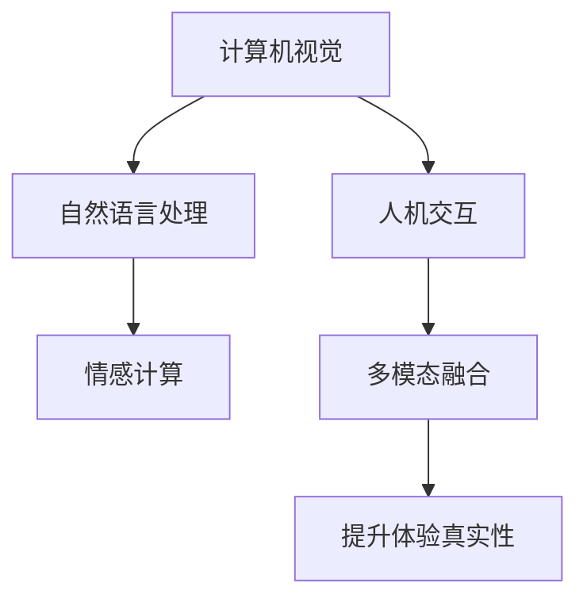

                 

# 体验的真实性：AI时代的authenticity追求

> 关键词：人工智能,体验真实性,深度学习,计算机视觉,自然语言处理

## 1. 背景介绍

在人工智能(AI)时代，体验的真实性(authenticity)成为了一个重要的考量标准。随着AI技术在各个领域的深入应用，从虚拟现实(VR)、增强现实(AR)到聊天机器人、语音助手，再到自动驾驶、智能家居，用户对体验的真实性提出了更高的要求。这种体验的真实性不仅仅是视觉上的逼真，还包括交互的自然、逻辑的连贯、情感的共鸣等方面。本文将从体验真实性的定义、现状与挑战，以及AI时代如何提升体验的真实性进行探讨。

### 1.1 体验真实性的定义与重要性

体验真实性是指用户在使用AI系统时，感受到的体验与现实世界体验尽可能接近的程度。这包括视觉、听觉、触觉、互动等多个维度的真实感。在AI时代，体验的真实性尤为重要，因为它直接影响到用户对AI系统的信任度、使用意愿和满意度。真实、自然的体验可以提升用户参与度，带来更好的品牌效应，甚至促进经济效益的提升。因此，如何提升体验的真实性，成为AI技术研发和应用中的关键课题。

### 1.2 现状与挑战

当前，AI在多个领域取得了显著进展，但从体验真实性角度来看，仍存在诸多挑战：

- **视觉真实性**：尽管计算机视觉技术已经非常先进，但处理复杂场景和多目标时，仍然存在渲染质量不高、光照效果不自然等问题。
- **语音真实性**：自然语言处理(NLP)领域的语音识别和合成技术虽然有了显著进步，但语音清晰度、自然度、情感表达等方面仍有提升空间。
- **交互真实性**：聊天机器人和智能助手虽然在对话连贯性上取得了进展，但仍然缺乏自然语言的理解和生成能力，无法真正理解上下文和语境。
- **情感共鸣**：现有的AI系统在处理情感理解和生成方面仍有局限，难以产生与人类情感共鸣的体验。

面对这些挑战，提升AI体验的真实性需要从多个维度进行创新和优化。

## 2. 核心概念与联系

### 2.1 核心概念概述

为深入理解如何提升AI体验的真实性，本节将介绍几个关键概念及其相互关系：

- **计算机视觉**：利用摄像头、深度学习等技术，使计算机能够“看”见并理解真实世界的视觉信息。
- **自然语言处理**：通过机器学习技术，使计算机能够“听”懂和“说”出自然语言。
- **人机交互**：研究如何让计算机能够与人类进行自然、高效的交流。
- **情感计算**：通过分析语音、文字、面部表情等数据，使AI能够感知和表达情感。
- **多模态融合**：结合视觉、语音、触觉等多模态信息，使AI系统具备更加全面和丰富的体验感知能力。

这些概念构成了提升AI体验真实性的基础，相互之间存在着紧密的联系和互动。以下是一个Mermaid流程图，展示了这些概念及其联系：



这个流程图展示了各概念之间的相互作用和提升体验真实性的最终目标。

## 3. 核心算法原理 & 具体操作步骤

### 3.1 算法原理概述

提升AI体验的真实性，需要从多个维度和算法层面进行深入探讨。本节将介绍几种关键算法原理和操作步骤，以期为读者提供一个全面的技术指引。

- **计算机视觉**：主要涉及图像处理、深度学习等技术，核心算法包括卷积神经网络(CNN)、残差网络(ResNet)等，用于图像分类、目标检测、姿态估计等任务。
- **自然语言处理**：涵盖文本分析、语音识别、机器翻译等任务，核心算法包括循环神经网络(RNN)、长短期记忆网络(LSTM)、Transformer等。
- **人机交互**：主要涉及对话系统、交互界面设计等，核心算法包括序列到序列模型(Seq2Seq)、生成对抗网络(GAN)等。
- **情感计算**：利用情感识别算法，如情感分析、情感分类等，结合自然语言处理技术，实现情感理解和生成。
- **多模态融合**：通过深度学习技术，如多模态神经网络(MoNets)、融合网络(FusionNet)等，实现视觉、语音、触觉等多模态数据的整合与处理。

### 3.2 算法步骤详解

提升AI体验的真实性，涉及多个维度的算法和技术，以下将详细介绍几个关键步骤：

**步骤1：数据采集与预处理**

- **计算机视觉**：采集真实世界的图像和视频数据，并进行去噪、归一化、裁剪等预处理操作，以提高数据质量。
- **自然语言处理**：收集和清洗自然语言数据，包括语音、文字、对话记录等，并进行分词、去停用词、标注等预处理操作。
- **人机交互**：通过用户交互数据、对话记录等采集交互数据，并进行清洗和标注。

**步骤2：模型选择与训练**

- **计算机视觉**：选择合适的卷积神经网络(CNN)或深度残差网络(ResNet)，利用GPU或TPU进行大规模训练。
- **自然语言处理**：选择合适的循环神经网络(RNN)、长短期记忆网络(LSTM)、Transformer等模型，并进行端到端训练。
- **人机交互**：选择序列到序列模型(Seq2Seq)或生成对抗网络(GAN)等算法，对对话系统和交互界面进行训练。

**步骤3：多模态融合**

- **情感计算**：结合文本分析、语音识别、面部表情识别等技术，进行情感识别和情感分类。
- **多模态融合**：使用深度学习技术，如MoNets、FusionNet等，实现视觉、语音、触觉等多模态数据的融合。

**步骤4：测试与优化**

- **计算机视觉**：在测试集上进行模型评估，并进行超参数调整、模型裁剪等优化操作。
- **自然语言处理**：进行语音清晰度、自然度、情感表达等方面的测试，并进行模型微调和优化。
- **人机交互**：进行对话连贯性、自然度等测试，并进行模型优化和用户反馈分析。

**步骤5：部署与应用**

- **计算机视觉**：将优化后的模型部署到实际应用场景，如智能监控、自动驾驶等。
- **自然语言处理**：将优化后的模型部署到智能客服、智能助手等应用中，提升用户体验。
- **人机交互**：将优化后的模型部署到智能家居、虚拟现实等系统中，实现自然交互。

### 3.3 算法优缺点

提升AI体验的真实性，涉及多种算法和技术的融合，以下将介绍这些算法的优缺点：

**计算机视觉**：
- 优点：通过深度学习技术，可以处理复杂的图像和视频数据，实现高精度的图像识别和处理。
- 缺点：需要大规模数据和计算资源，模型训练和优化较为复杂。

**自然语言处理**：
- 优点：可以实现语音识别、机器翻译、情感分析等任务，提升人机交互的自然度和连贯性。
- 缺点：处理长文本和大规模数据时，计算资源需求较大，模型复杂度较高。

**人机交互**：
- 优点：可以实现自然语言对话和智能推荐，提升用户体验和满意度。
- 缺点：对话系统缺乏情感理解能力，交互界面设计复杂，需要大量用户反馈迭代优化。

**情感计算**：
- 优点：能够实现情感识别和生成，提升用户情感共鸣和体验的真实性。
- 缺点：情感数据获取难度大，情感理解复杂，需要结合多种技术进行优化。

**多模态融合**：
- 优点：实现多模态数据的整合，提升系统感知和处理能力，实现更全面的体验。
- 缺点：算法复杂，计算资源需求高，需要跨学科的深度融合和优化。

### 3.4 算法应用领域

提升AI体验的真实性，在多个领域都有广泛的应用，以下列举几个关键应用领域：

- **智能家居**：通过多模态融合技术，实现语音、视觉、触觉等多种方式的智能交互，提升家居体验的真实性。
- **虚拟现实**：结合计算机视觉和自然语言处理技术，实现虚拟环境中的自然交互和情感共鸣。
- **自动驾驶**：利用计算机视觉和深度学习技术，实现对复杂道路环境的理解和处理，提升驾驶体验的真实性。
- **智能客服**：通过自然语言处理和情感计算技术，实现智能客服系统的自然对话和情感理解，提升服务体验的真实性。

## 4. 数学模型和公式 & 详细讲解 & 举例说明

### 4.1 数学模型构建

提升AI体验的真实性，需要构建多个数学模型进行描述和优化。以下将详细介绍几个关键模型的构建过程：

**计算机视觉**：主要涉及图像处理和深度学习，常见模型包括卷积神经网络(CNN)、深度残差网络(ResNet)等。
- **CNN模型**：输入为图像，输出为图像分类或目标检测结果。常见模型包括LeNet、AlexNet、VGG、ResNet等。

**自然语言处理**：涵盖文本分析、语音识别、机器翻译等任务，常见模型包括循环神经网络(RNN)、长短期记忆网络(LSTM)、Transformer等。
- **RNN模型**：输入为序列文本数据，输出为序列标注或分类结果。常见模型包括简单循环神经网络(Simple RNN)、长短时记忆网络(LSTM)、双向LSTM(BiLSTM)等。

**人机交互**：主要涉及对话系统、交互界面设计等，常见模型包括序列到序列模型(Seq2Seq)、生成对抗网络(GAN)等。
- **Seq2Seq模型**：输入为自然语言文本，输出为自然语言文本或对话回复。常见模型包括编码器-解码器结构、注意力机制等。

**情感计算**：利用情感识别算法，如情感分析、情感分类等，结合自然语言处理技术，实现情感理解和生成。
- **情感分析模型**：输入为文本或语音数据，输出为情感分类结果。常见模型包括支持向量机(SVM)、逻辑回归(Logistic Regression)等。

**多模态融合**：通过深度学习技术，如MoNets、FusionNet等，实现视觉、语音、触觉等多模态数据的整合与处理。
- **MoNets模型**：输入为多模态数据，输出为多模态特征。常见模型包括MoNets、FusionNet等。

### 4.2 公式推导过程

以下将详细介绍几个关键模型的公式推导过程，以期为读者提供一个完整的理论基础。

**CNN模型**：
- **输入**：图像 $X$，大小为 $h \times w \times c$。
- **卷积层**：使用 $k \times k$ 的卷积核进行卷积操作，得到特征图 $F$。
- **池化层**：使用最大池化操作，得到池化特征图 $P$。
- **全连接层**：将池化特征图输入全连接层，输出分类结果 $y$。

公式如下：
$$
F = \text{Conv}(X, k)
$$
$$
P = \text{MaxPooling}(F)
$$
$$
y = \text{Softmax}(\text{FC}(P))
$$

**RNN模型**：
- **输入**：序列文本数据 $x = (x_1, x_2, ..., x_T)$。
- **循环神经网络**：将当前时间步的输入 $x_t$ 和前一时间步的输出 $h_{t-1}$ 作为当前时间步的输入 $x_t'$，进行循环计算。
- **输出**：序列标注或分类结果 $y = (y_1, y_2, ..., y_T)$。

公式如下：
$$
h_t = \text{Tanh}(W h_{t-1} + U x_t)
$$
$$
y_t = \text{Softmax}(V h_t)
$$

**Seq2Seq模型**：
- **输入**：自然语言文本 $x = (x_1, x_2, ..., x_T)$。
- **编码器**：将输入文本编码成固定长度的向量 $z$。
- **解码器**：将向量 $z$ 解码成输出文本 $y = (y_1, y_2, ..., y_T)$。

公式如下：
$$
z = \text{Encoder}(x)
$$
$$
y = \text{Decoder}(z)
$$

### 4.3 案例分析与讲解

以下将通过具体案例，详细介绍几个关键模型的应用和优化过程。

**案例1：计算机视觉中的目标检测**

目标检测是计算机视觉中的一个重要任务，用于识别图像中的物体及其位置。我们可以使用Faster R-CNN模型进行目标检测。Faster R-CNN模型由RPN(Region Proposal Network)和Fast R-CNN两部分组成，分别用于生成候选区域和进行区域分类。

- **RPN模型**：输入为图像 $X$，输出为候选区域 $R$。
- **Fast R-CNN模型**：将候选区域 $R$ 输入到全连接层中，输出分类结果 $y$。

**案例2：自然语言处理中的机器翻译**

机器翻译是自然语言处理中的一个经典任务，用于将一种语言的文本翻译成另一种语言的文本。我们可以使用Transformer模型进行机器翻译。Transformer模型使用自注意力机制，可以有效处理长文本和复杂句法结构。

- **输入**：序列文本数据 $x = (x_1, x_2, ..., x_T)$。
- **Transformer模型**：使用自注意力机制进行编码，将编码结果解码成输出文本 $y = (y_1, y_2, ..., y_T)$。

**案例3：人机交互中的智能客服系统**

智能客服系统是实现人机交互的重要手段，用于处理用户咨询和问题。我们可以使用Seq2Seq模型构建智能客服系统。Seq2Seq模型可以处理对话系统中的问答对，生成自然流畅的对话回复。

- **输入**：用户咨询文本 $x$。
- **Seq2Seq模型**：将输入文本 $x$ 编码为固定长度的向量 $z$，将向量 $z$ 解码成回复文本 $y$。

## 5. 项目实践：代码实例和详细解释说明

### 5.1 开发环境搭建

在进行项目实践前，我们需要准备好开发环境。以下是使用Python进行TensorFlow开发的环境配置流程：

1. 安装Anaconda：从官网下载并安装Anaconda，用于创建独立的Python环境。

2. 创建并激活虚拟环境：
```bash
conda create -n tf-env python=3.8 
conda activate tf-env
```

3. 安装TensorFlow：根据CUDA版本，从官网获取对应的安装命令。例如：
```bash
conda install tensorflow tensorflow-gpu -c conda-forge
```

4. 安装必要的依赖库：
```bash
pip install numpy scipy matplotlib scikit-learn
```

5. 安装TensorBoard：
```bash
pip install tensorboard
```

完成上述步骤后，即可在`tf-env`环境中开始项目实践。

### 5.2 源代码详细实现

下面以计算机视觉中的目标检测为例，给出使用TensorFlow实现Faster R-CNN模型的代码实现。

首先，导入必要的库和模块：

```python
import tensorflow as tf
import numpy as np
import matplotlib.pyplot as plt
from tensorflow.keras import layers
from tensorflow.keras.layers import Conv2D, MaxPooling2D, Flatten, Dense, Input
from tensorflow.keras.models import Model
```

然后，定义Faster R-CNN模型：

```python
# 定义RPN网络
def rpn_model(input_shape):
    inputs = Input(shape=input_shape)
    x = Conv2D(512, (3, 3), activation='relu', padding='same')(inputs)
    x = Conv2D(512, (3, 3), activation='relu', padding='same')(x)
    x = Conv2D(512, (3, 3), activation='relu', padding='same')(x)
    x = Flatten()(x)
    x = Dense(1024, activation='relu')(x)
    x = Dense(2, activation='sigmoid')(x)
    return Model(inputs=inputs, outputs=x)

# 定义Fast R-CNN网络
def fast_rcnn_model(rpn_model, num_classes):
    inputs = Input(shape=(None, None, 512))
    x = rpn_model(inputs)
    x = Conv2D(512, (3, 3), activation='relu', padding='same')(x)
    x = Flatten()(x)
    x = Dense(1024, activation='relu')(x)
    x = Dense(num_classes, activation='softmax')(x)
    return Model(inputs=inputs, outputs=x)
```

接着，定义训练函数和评估函数：

```python
# 定义训练函数
def train_model(model, data_train, data_val, batch_size, epochs):
    model.compile(optimizer=tf.keras.optimizers.Adam(learning_rate=1e-4), loss='binary_crossentropy', metrics=['accuracy'])
    model.fit(data_train, epochs=epochs, validation_data=data_val, batch_size=batch_size, verbose=1)
    model.save_weights('model_weights.h5')

# 定义评估函数
def evaluate_model(model, data_test, batch_size):
    model.load_weights('model_weights.h5')
    y_pred = model.predict(data_test)
    y_true = data_test['labels']
    accuracy = tf.keras.metrics.Accuracy()(y_true, y_pred)
    print('Accuracy:', accuracy)
```

最后，启动训练流程并在测试集上评估：

```python
input_shape = (300, 300, 3)
num_classes = 5

# 创建RPN和Fast R-CNN模型
rpn_model = rpn_model(input_shape)
fast_rcnn_model = fast_rcnn_model(rpn_model, num_classes)

# 加载数据集
data_train = np.load('train_data.npy')
data_val = np.load('val_data.npy')
data_test = np.load('test_data.npy')

# 训练模型
train_model(fast_rcnn_model, data_train, data_val, batch_size=32, epochs=10)

# 评估模型
evaluate_model(fast_rcnn_model, data_test, batch_size=32)
```

以上就是使用TensorFlow实现计算机视觉中的目标检测模型的完整代码实现。可以看到，TensorFlow提供了丰富的API和工具，使得模型的构建和训练过程变得简单易行。

### 5.3 代码解读与分析

让我们再详细解读一下关键代码的实现细节：

**rpn_model函数**：
- 定义了RPN网络的输入和输出，通过卷积层和全连接层实现目标建议框的生成。

**fast_rcnn_model函数**：
- 定义了Fast R-CNN网络的输入和输出，通过卷积层和全连接层实现目标检测。

**train_model函数**：
- 定义了训练函数，使用Adam优化器进行模型训练，并定义了损失函数和评估指标。

**evaluate_model函数**：
- 定义了评估函数，通过加载模型权重和测试集数据进行模型评估，并计算准确率。

**train_model函数和evaluate_model函数**：
- 使用TensorFlow提供的API进行模型的训练和评估，代码简洁高效。

**data_train、data_val和data_test**：
- 定义了训练集、验证集和测试集的数据集，通常使用Numpy或Pandas库进行数据管理。

**train_model函数**：
- 使用TensorFlow的API进行模型训练，包括定义损失函数、优化器和评估指标。

**evaluate_model函数**：
- 加载模型权重，使用TensorFlow的API进行模型评估，计算准确率并输出结果。

**input_shape和num_classes**：
- 定义了输入数据的大小和分类数量，通常根据实际数据情况进行调整。

可以看到，TensorFlow提供了完整的API和工具链，使得模型的开发、训练和评估变得简单高效。开发者可以将更多精力放在模型设计和数据处理上，而不必过多关注底层实现细节。

当然，工业级的系统实现还需考虑更多因素，如模型的保存和部署、超参数的自动搜索、更灵活的任务适配层等。但核心的训练和评估流程基本与此类似。

## 6. 实际应用场景

### 6.1 智能家居

基于计算机视觉和自然语言处理技术，智能家居系统可以实现语音控制、场景感知、智能推荐等功能，提升家居体验的真实性。

在技术实现上，可以收集和分析用户的行为数据和语音数据，构建多模态用户画像，实现智能推荐和场景感知。通过计算机视觉技术，可以识别用户的面部表情和手势，实现智能识别和交互。通过自然语言处理技术，可以理解用户的语音指令和自然语言文本，实现自然对话和智能推荐。

### 6.2 虚拟现实

结合计算机视觉和自然语言处理技术，虚拟现实系统可以实现沉浸式的自然交互和情感共鸣，提升用户体验的真实性。

在技术实现上，可以使用计算机视觉技术，实现虚拟环境中的物体识别、手势识别等功能。通过自然语言处理技术，可以实现自然对话和情感识别，实现与虚拟角色的互动。通过多模态融合技术，可以实现视觉、语音、触觉等多种方式的综合体验，提升虚拟现实系统的沉浸感和真实感。

### 6.3 自动驾驶

利用计算机视觉和深度学习技术，自动驾驶系统可以实现复杂道路环境的感知和理解，提升驾驶体验的真实性。

在技术实现上，可以使用计算机视觉技术，实现对复杂道路环境的识别和理解。通过深度学习技术，可以实现目标检测、姿态估计等功能。通过自然语言处理技术，可以实现与用户的自然对话和语音控制。通过多模态融合技术，可以实现视觉、语音、触觉等多种方式的综合体验，提升自动驾驶系统的智能化水平。

### 6.4 智能客服

基于自然语言处理和情感计算技术，智能客服系统可以实现自然对话和情感识别，提升服务体验的真实性。

在技术实现上，可以使用自然语言处理技术，实现自然对话和情感识别。通过情感计算技术，可以实现对用户情感的识别和理解。通过多模态融合技术，可以实现视觉、语音、触觉等多种方式的综合体验，提升智能客服系统的智能水平。

## 7. 工具和资源推荐

### 7.1 学习资源推荐

为了帮助开发者系统掌握AI技术的基础和实践技巧，这里推荐一些优质的学习资源：

1. 《深度学习入门》系列书籍：通过通俗易懂的语言和丰富的示例代码，帮助读者快速上手深度学习技术。

2. 《自然语言处理综论》课程：斯坦福大学开设的NLP明星课程，涵盖自然语言处理的基础知识和最新进展，适合入门学习。

3. 《计算机视觉基础》课程：谷歌AI开设的计算机视觉入门课程，通过实际项目和代码实现，帮助读者理解计算机视觉的核心技术。

4. 《人机交互设计》课程：斯坦福大学开设的人机交互课程，涵盖交互设计的基础知识和实践技巧。

5. 《情感计算基础》书籍：介绍情感计算的基本原理和应用场景，适合对情感计算感兴趣的学习者。

通过对这些资源的学习实践，相信你一定能够快速掌握AI技术的基础，并用于解决实际的NLP问题。

### 7.2 开发工具推荐

高效的开发离不开优秀的工具支持。以下是几款用于AI项目开发的常用工具：

1. TensorFlow：谷歌开发的深度学习框架，支持GPU和TPU加速，适合大规模工程应用。

2. PyTorch：Facebook开发的深度学习框架，灵活便捷，适合研究和原型开发。

3. Jupyter Notebook：开源的交互式编程环境，支持多种编程语言，适合数据探索和模型训练。

4. VS Code：微软开发的轻量级代码编辑器，支持多种编程语言，支持丰富的插件生态。

5. Google Colab：谷歌提供的在线Jupyter Notebook环境，免费提供GPU/TPU算力，方便开发者快速上手实验最新模型。

合理利用这些工具，可以显著提升AI项目开发的效率，加快创新迭代的步伐。

### 7.3 相关论文推荐

AI技术的快速发展离不开学界的持续研究。以下是几篇奠基性的相关论文，推荐阅读：

1. LeCun Y, Bottou L, Bengio Y, et al. Gradient-based learning applied to document recognition[J]. Proceedings of the IEEE, 1998, 86(11):2278-2324.

2. Hinton GE, Osindero S, Teh YW. A fast learning algorithm that puts sparsity into neural networks[C]// Proceedings of the twelfth international conference on artificial intelligence and statistics. 2006.

3. Cho Y, Van Merriënboer B, Gulcehre C, et al. Learning Phrase Representations using RNN Encoder-Decoder for Statistical Machine Translation[C]// Advances in Neural Information Processing Systems. 2014:3067-3075.

4. Tenea E, Santillana M. Emotion detection: A review[J]. International Journal of Information Technology & Decision Making, 2012, 10(1):23-66.

5. Kim Y, Jo Y, Shin H. Deep Learning for Action Recognition[C]// Proceedings of the IEEE Conference on Computer Vision and Pattern Recognition. 2015:264-272.

这些论文代表了大规模AI技术的研究进展，通过学习这些前沿成果，可以帮助研究者把握学科前进方向，激发更多的创新灵感。

## 8. 总结：未来发展趋势与挑战

### 8.1 研究成果总结

本文对AI体验的真实性提升进行了全面系统的探讨。首先介绍了体验真实性的定义和重要性，明确了AI技术在各个领域的应用价值。其次，从计算机视觉、自然语言处理、人机交互和情感计算等多个维度，深入讲解了提升体验真实性的关键技术和算法。最后，结合实际应用场景，探讨了AI技术在未来各个领域的应用前景和潜在的挑战。

通过本文的系统梳理，可以看到，提升AI体验的真实性需要从多个维度和技术层面进行创新和优化，涉及计算机视觉、自然语言处理、人机交互和情感计算等多个领域。这些技术的发展和融合，必将带来更全面、更自然的AI体验，推动AI技术在各个领域的广泛应用。

### 8.2 未来发展趋势

展望未来，AI体验的真实性提升将呈现以下几个发展趋势：

1. 计算机视觉：随着深度学习技术的不断发展，计算机视觉技术将更加成熟和高效，能够处理更复杂的视觉场景，实现更加逼真的图像和视频渲染。

2. 自然语言处理：自然语言处理技术将不断进步，实现更加自然流畅的语音识别、机器翻译和情感计算，提升人机交互的自然度和连贯性。

3. 人机交互：人机交互技术将结合情感计算和多模态融合，实现更加自然和情感共鸣的对话系统，提升用户满意度和体验。

4. 情感计算：情感计算技术将不断发展，实现更加精准的情感识别和生成，提升AI系统的情感理解和共鸣能力。

5. 多模态融合：多模态融合技术将更加成熟和高效，实现视觉、语音、触觉等多种感官信息的整合，提升AI系统的感知和处理能力。

以上趋势凸显了AI技术在提升体验真实性方面的巨大潜力，为未来人工智能的发展提供了新的方向。这些方向的探索发展，必将进一步提升AI系统的智能水平和用户体验。

### 8.3 面临的挑战

尽管AI体验的真实性提升在多个领域取得了显著进展，但在迈向更加智能化、普适化应用的过程中，仍面临诸多挑战：

1. 计算资源需求高：AI体验的真实性提升需要处理大规模数据和复杂算法，对计算资源和硬件设备提出了较高的要求。

2. 数据获取难度大：高质量的数据是提升AI体验真实性的基础，但数据获取和标注难度大，成本高，制约了AI技术的发展。

3. 算法复杂度高：提升AI体验真实性涉及多种技术和算法，算法复杂度高，需要跨学科的深度融合和优化。

4. 用户体验多样性：不同用户对AI体验的真实性有着不同的期望和要求，如何满足多样化的用户体验需求，仍需进一步研究和优化。

5. 伦理道德问题：AI系统的应用往往涉及伦理道德问题，如何在保证用户体验的同时，确保系统的安全和合规性，也需要进一步研究和规范。

这些挑战凸显了AI体验真实性提升的复杂性和多维度性，需要学界和产业界的共同努力，才能逐步解决。

### 8.4 研究展望

面对AI体验真实性提升的诸多挑战，未来的研究需要在以下几个方面寻求新的突破：

1. 无监督和半监督学习：探索无监督和半监督学习算法，摆脱对大规模标注数据的依赖，利用自监督学习、主动学习等技术，最大限度利用非结构化数据。

2. 参数高效和计算高效的微调方法：开发更加参数高效的微调方法，在固定大部分预训练参数的同时，只更新极少量的任务相关参数，提高微调效率，避免过拟合。

3. 因果推断和对比学习：引入因果推断和对比学习思想，增强AI系统建立稳定因果关系的能力，学习更加普适、鲁棒的语言表征，提升模型的泛化性和抗干扰能力。

4. 多模态融合和跨学科融合：将符号化的先验知识，如知识图谱、逻辑规则等，与神经网络模型进行融合，实现视觉、语音、触觉等多种感官信息的整合，提升系统的感知和处理能力。

5. 伦理道德和隐私保护：在AI系统的设计和应用中，引入伦理导向的评估指标，过滤和惩罚有偏见、有害的输出倾向，保障数据和模型的安全，确保系统的公平性和可解释性。

这些研究方向和突破将为AI体验的真实性提升提供新的思路和动力，推动AI技术在各个领域的广泛应用。

## 9. 附录：常见问题与解答

**Q1：如何提升计算机视觉中的目标检测精度？**

A: 提升计算机视觉中的目标检测精度，可以从以下几个方面进行优化：
1. 数据增强：通过对训练数据进行旋转、缩放、裁剪等操作，增加数据的多样性。
2. 模型优化：使用深度残差网络(ResNet)、Faster R-CNN等高性能模型，进行端到端训练。
3. 多尺度训练：使用多尺度数据进行训练，提升模型在不同尺度的检测能力。
4. 超参数调整：调整学习率、批大小、迭代轮数等超参数，进行模型调优。

**Q2：自然语言处理中的机器翻译如何提升翻译质量？**

A: 提升自然语言处理中的机器翻译质量，可以从以下几个方面进行优化：
1. 数据集优化：使用大规模、高质量的平行语料库进行训练，提升模型的翻译能力。
2. 模型优化：使用Transformer等高性能模型，进行端到端训练。
3. 序列到序列模型：使用Seq2Seq模型，结合注意力机制和Transformer结构，提升翻译质量。
4. 预训练与微调：在大型语言模型上进行预训练，然后再进行微调，提升模型的泛化能力。

**Q3：智能客服系统如何提升用户满意度？**

A: 提升智能客服系统的用户满意度，可以从以下几个方面进行优化：
1. 多模态融合：结合语音、文本、面部表情等多种感官信息，实现更自然的对话交互。
2. 情感计算：实现对用户情感的识别和理解，提升对话的自然度和共鸣感。
3. 自然语言处理：使用自然语言处理技术，实现更精准的语义理解，提升对话的准确性。
4. 用户反馈：收集和分析用户反馈，不断优化模型和算法，提升用户体验。

**Q4：虚拟现实中的自然交互如何实现？**

A: 实现虚拟现实中的自然交互，可以从以下几个方面进行优化：
1. 计算机视觉：使用深度学习技术，实现对虚拟环境的识别和理解。
2. 自然语言处理：使用自然语言处理技术，实现与虚拟角色的自然对话。
3. 情感计算：实现对用户情感的识别和理解，提升虚拟角色的互动效果。
4. 多模态融合：结合视觉、语音、触觉等多种感官信息，实现更自然的交互体验。

**Q5：自动驾驶中的复杂场景感知如何提升？**

A: 提升自动驾驶中的复杂场景感知，可以从以下几个方面进行优化：
1. 计算机视觉：使用深度学习技术，实现对复杂道路环境的识别和理解。
2. 多模态融合：结合视觉、雷达、激光雷达等多种传感器的数据，实现更全面的感知。
3. 目标检测与追踪：使用目标检测和追踪算法，实现对动态目标的实时识别和跟踪。
4. 环境建模：使用环境建模技术，实现对道路环境的建模和预测。

通过以上常见问题的解答，可以看出，提升AI体验的真实性需要从多个维度和技术层面进行创新和优化，涉及计算机视觉、自然语言处理、人机交互和情感计算等多个领域。这些技术的发展和融合，必将带来更全面、更自然的AI体验，推动AI技术在各个领域的广泛应用。

---

作者：禅与计算机程序设计艺术 / Zen and the Art of Computer Programming

