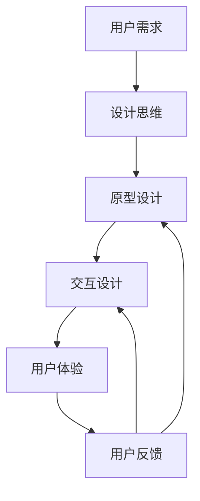

                 

# 体验设计师：AI时代的新兴职业

> 关键词：体验设计,人工智能,设计思维,人机交互,用户体验

## 1. 背景介绍

### 1.1 问题由来

随着人工智能技术的迅猛发展，人们的生活和工作方式正在发生翻天覆地的变化。AI技术在各个领域中的应用，无论是医疗、教育、娱乐还是商业，都展现出了巨大的潜力。然而，这些技术的应用并不是孤立的，它们需要与用户进行紧密的互动和沟通，这便是体验设计师的角色所在。

体验设计师（Experience Designer, XD）是AI时代的新兴职业，他们在设计人工智能产品时起着至关重要的作用。他们不仅需要了解AI技术的原理，还需要具备设计和心理学方面的知识，能够从用户的角度出发，创造令人满意的用户体验。随着AI技术的普及，体验设计师的需求也日益增加，他们的角色正在变得越来越重要。

### 1.2 问题核心关键点

体验设计师的核心职责是确保AI产品能够与用户进行有效的交互，提供良好的用户体验。以下是体验设计师需要关注的几个关键点：

1. **用户需求理解**：体验设计师需要对用户的心理、行为和需求有深入的理解，从而设计出符合用户期望的产品。
2. **设计原型**：利用设计思维（Design Thinking）方法，设计师需要将抽象的概念转化为可行的产品原型。
3. **交互设计**：设计师需要设计直观、易用的用户界面（UI）和用户体验（UX），确保用户能够轻松地使用产品。
4. **反馈迭代**：在产品开发的各个阶段，设计师需要与用户进行不断的反馈和迭代，以优化产品体验。

### 1.3 问题研究意义

研究体验设计师的工作原理和最佳实践，对于推动人工智能技术的广泛应用，提升用户体验具有重要意义：

1. **增强用户满意度**：通过精心设计的人机交互界面，可以显著提升用户的满意度，增加用户对AI产品的黏性。
2. **降低开发成本**：良好的用户体验设计可以减少用户在产品学习上的成本，提高用户转化率和留存率。
3. **推动AI普及**：优质的用户体验能够让用户更易接受AI技术，加速AI技术在各个行业中的普及和应用。
4. **提升创新能力**：通过设计思维，设计师能够从用户的痛点和需求出发，设计出创新性强的产品，推动技术不断进步。
5. **保障伦理安全**：在产品设计中考虑用户体验的同时，还需要注重隐私保护、安全性等伦理问题，确保AI技术的健康发展。

## 2. 核心概念与联系

### 2.1 核心概念概述

体验设计师在AI产品设计过程中涉及到的核心概念包括：

- **设计思维（Design Thinking）**：一种以用户为中心的设计方法，强调通过观察用户需求，理解用户痛点，来设计出解决问题的产品。
- **人机交互（Human-Computer Interaction, HCI）**：研究人与计算机如何通过界面进行交互的学科，重点在于提升用户体验。
- **用户体验（User Experience, UX）**：涉及所有与用户接触的产品方面，旨在提供满足用户需求和期望的体验。
- **用户界面（User Interface, UI）**：设计产品的操作界面，包括视觉、交互和导航等方面，确保用户能够轻松使用。

### 2.2 核心概念原理和架构的 Mermaid 流程图

这个流程图展示了体验设计师在设计AI产品过程中，从用户需求出发，通过设计思维、原型设计、交互设计等步骤，最终实现优质的用户体验。

## 3. 核心算法原理 & 具体操作步骤

### 3.1 算法原理概述

体验设计师的工作原理主要基于设计思维和用户体验设计的方法论。其核心思想是通过用户研究、原型设计、迭代测试等步骤，不断优化产品的用户体验。以下是体验设计师常用的几个关键算法原理：

1. **用户研究**：通过定性或定量的研究方法，收集用户需求和反馈，为设计提供依据。
2. **原型设计**：利用设计工具（如Sketch、Figma等）创建交互式原型，供用户测试和反馈。
3. **迭代设计**：根据用户反馈，不断调整设计方案，优化产品体验。
4. **用户体验评估**：通过用户测试、问卷调查等方式，评估产品的使用效果和用户满意度。

### 3.2 算法步骤详解

体验设计师的工作流程主要包括以下几个步骤：

1. **用户研究**：通过问卷调查、用户访谈、用户测试等方式，收集用户需求和行为数据。
2. **定义用户旅程**：根据用户研究结果，绘制用户与产品互动的旅程图，识别关键触点和痛点。
3. **创建设计原型**：利用设计工具创建初步的产品原型，并进行用户测试。
4. **迭代设计**：根据用户测试结果，优化设计方案，创建新的设计原型，进行下一轮测试。
5. **用户体验评估**：通过用户反馈和测试结果，评估产品性能，提出改进意见。

### 3.3 算法优缺点

体验设计师的算法具有以下优点：

1. **用户中心**：通过深入了解用户需求，设计出的产品更符合用户期望。
2. **灵活迭代**：设计过程是一个不断迭代、优化的过程，能够及时发现和解决问题。
3. **跨学科结合**：结合心理学、设计学、计算机科学等多学科知识，设计出综合性强的产品。

同时，也存在一些缺点：

1. **时间成本高**：设计流程较长，需要较多的时间进行用户研究和原型测试。
2. **复杂度高**：需要综合考虑多方面的因素，设计方案的复杂度较高。
3. **依赖用户反馈**：设计过程中需要大量依赖用户反馈，如果用户反馈不一致，可能造成设计方向不明确。

### 3.4 算法应用领域

体验设计师在AI产品的设计中，广泛应用于以下领域：

- **智能家居**：设计智能音箱、智能照明等产品，提升用户的生活体验。
- **智能办公**：设计智能办公系统、会议机器人等产品，提高工作效率。
- **智能医疗**：设计智能健康助手、虚拟医生等产品，提供更加个性化的医疗服务。
- **智能教育**：设计智能学习平台、虚拟助教等产品，提升教育效果。
- **智能金融**：设计智能理财顾问、虚拟客服等产品，提供更加便捷的金融服务。

## 4. 数学模型和公式 & 详细讲解 & 举例说明

### 4.1 数学模型构建

体验设计师的工作主要涉及用户体验评估，可以通过数学模型来量化用户体验。常用的用户体验评估指标包括：

- **任务完成时间**：衡量用户完成任务所需的时间。
- **错误率**：衡量用户在使用产品过程中出现的错误次数。
- **满意度**：衡量用户对产品的整体满意度，通常通过问卷调查获取。

### 4.2 公式推导过程

以下是一个简单的用户体验评估公式示例：

$$
\text{用户体验得分} = \frac{\text{用户满意度} \times \text{任务完成时间} \times (1 - \text{错误率})}{1000}
$$

其中，用户满意度通过问卷调查获得，任务完成时间和错误率通过用户测试获得。这个公式将用户体验得分量化为一个0到1的分数，便于比较和优化。

### 4.3 案例分析与讲解

假设我们设计了一个智能助手产品，通过问卷调查和用户测试，得到了以下数据：

- 用户满意度为85%
- 任务完成时间为120秒
- 错误率为5%

代入上述公式，得到：

$$
\text{用户体验得分} = \frac{0.85 \times 120 \times (1 - 0.05)}{1000} = 0.855
$$

这个得分可以用于与其他产品进行比较，或者用于产品迭代优化时，衡量新设计方案的用户体验提升效果。

## 5. 项目实践：代码实例和详细解释说明

### 5.1 开发环境搭建

体验设计师的工作通常需要使用多种工具进行原型设计和用户测试。以下是搭建开发环境的常用工具：

- **设计工具**：Sketch、Figma、Adobe XD等。
- **用户测试工具**：UserTesting.com、Lookback、UserZoom等。
- **数据分析工具**：Google Analytics、Mixpanel、Amplitude等。
- **开发工具**：JIRA、Trello、Asana等项目管理工具。

### 5.2 源代码详细实现

以设计一个智能助手产品为例，以下是用户体验设计的大致流程：

1. **用户研究**：通过问卷调查和用户访谈，了解用户需求和痛点。
2. **定义用户旅程**：绘制用户旅程图，识别关键触点和痛点。
3. **创建设计原型**：利用Sketch或Figma创建初步设计原型，进行用户测试。
4. **迭代设计**：根据用户测试结果，优化设计方案，创建新的设计原型，进行下一轮测试。
5. **用户体验评估**：通过问卷调查和用户测试，评估产品性能，提出改进意见。

### 5.3 代码解读与分析

用户体验设计的实现通常依赖于多学科知识的综合运用，具体代码的实现较为复杂，但可以借助设计工具和用户测试工具进行简化。以下是使用Sketch创建原型并进行用户测试的基本流程：

1. **创建原型**：在Sketch中绘制用户界面原型，包括主界面、操作流程、交互细节等。
2. **导出原型**：将Sketch的原型导出为HTML格式，嵌入到网页中。
3. **用户测试**：将HTML原型嵌入到测试平台（如UserTesting.com），邀请用户进行测试，收集反馈。
4. **分析反馈**：利用数据分析工具（如Mixpanel）分析用户测试结果，识别出用户反馈的问题点。
5. **优化设计**：根据用户反馈，修改设计方案，创建新的原型，进行下一轮测试。

### 5.4 运行结果展示

用户体验设计的结果可以通过多种方式展示，例如用户旅程图、原型测试视频、用户反馈图表等。以下是一些常见的展示方式：

- **用户旅程图**：通过可视化方式展示用户与产品的互动过程，识别出关键触点和痛点。
- **原型测试视频**：记录用户测试过程，展示用户如何使用产品，发现潜在问题。
- **用户反馈图表**：利用数据分析工具生成用户反馈的统计图表，直观展示用户满意度、任务完成时间、错误率等指标。

## 6. 实际应用场景

### 6.1 智能家居

智能家居产品，如智能音箱、智能照明等，需要通过体验设计师来设计产品界面和交互方式。例如，智能音箱需要考虑用户如何输入指令、如何接收反馈等问题，设计师需要设计简洁、易用的用户界面。

### 6.2 智能办公

智能办公系统，如智能会议机器人、智能文档管理系统等，设计师需要考虑用户如何与系统进行交互、如何获取反馈等问题。例如，智能会议机器人需要设计友好的语音交互界面，使用户能够轻松完成会议记录和调度任务。

### 6.3 智能医疗

智能健康助手、虚拟医生等产品，设计师需要考虑用户如何输入健康信息、如何获取诊断结果等问题。例如，智能健康助手需要设计简单易用的界面，让用户能够方便地输入症状和历史健康数据，获取个性化的健康建议。

### 6.4 未来应用展望

随着AI技术的不断进步，体验设计师的工作也将面临更多的机遇和挑战。未来，体验设计师需要更加注重跨学科知识的融合，结合AI技术，设计出更加智能、个性化的产品。

1. **增强现实（AR）和虚拟现实（VR）**：通过AR和VR技术，设计师可以创建沉浸式的产品体验，提升用户互动的沉浸感和真实感。
2. **个性化推荐系统**：利用AI技术，设计师可以设计更加智能的推荐系统，为用户提供个性化的产品和服务。
3. **自适应设计**：根据用户行为和偏好，设计师可以设计自适应界面，动态调整界面元素和交互方式，提升用户满意度。
4. **情感计算**：通过情感分析技术，设计师可以设计出能够感知和响应用户情感的产品，提升用户体验。

## 7. 工具和资源推荐

### 7.1 学习资源推荐

体验设计师需要不断学习和提升自身的设计和AI技术能力，以下是一些推荐的资源：

1. **设计思维课程**：例如，IDEO U的Design Thinking课程，帮助设计师掌握设计思维的原理和应用。
2. **AI技术课程**：例如，Coursera上的Deep Learning Specialization课程，帮助设计师理解AI技术的原理和应用。
3. **用户体验设计书籍**：例如，《设计心理学》、《用户体验设计》等书籍，帮助设计师掌握用户体验设计的理论和实践。
4. **设计工具教程**：例如，Sketch官方文档和YouTube上的Sketch教程，帮助设计师掌握设计工具的使用。

### 7.2 开发工具推荐

体验设计师的工作需要依赖多种工具进行设计和测试，以下是一些推荐的工具：

1. **设计工具**：Sketch、Figma、Adobe XD等。
2. **用户测试工具**：UserTesting.com、Lookback、UserZoom等。
3. **数据分析工具**：Google Analytics、Mixpanel、Amplitude等。
4. **项目管理工具**：JIRA、Trello、Asana等。

### 7.3 相关论文推荐

体验设计师的工作涉及多学科知识的综合运用，以下是一些推荐的相关论文：

1. **设计思维论文**：例如，《设计思维：通过迭代设计优化用户体验》（Design Thinking: Iterative Design for Optimizing User Experience）。
2. **人机交互论文**：例如，《用户界面设计原理》（Principles of Human-Computer Interaction）。
3. **用户体验论文**：例如，《用户体验评估方法》（User Experience Evaluation Methods）。
4. **AI技术论文**：例如，《深度学习在自然语言处理中的应用》（Deep Learning in Natural Language Processing）。

## 8. 总结：未来发展趋势与挑战

### 8.1 研究成果总结

体验设计师的工作原理和最佳实践，为AI技术在各个领域的应用提供了重要的参考。其核心思想是通过用户研究、原型设计、迭代测试等步骤，不断优化产品的用户体验。

### 8.2 未来发展趋势

随着AI技术的不断进步，体验设计师的工作也将面临更多的机遇和挑战。未来，体验设计师需要更加注重跨学科知识的融合，结合AI技术，设计出更加智能、个性化的产品。

1. **增强现实和虚拟现实**：通过AR和VR技术，设计师可以创建沉浸式的产品体验，提升用户互动的沉浸感和真实感。
2. **个性化推荐系统**：利用AI技术，设计师可以设计更加智能的推荐系统，为用户提供个性化的产品和服务。
3. **自适应设计**：根据用户行为和偏好，设计师可以设计自适应界面，动态调整界面元素和交互方式，提升用户满意度。
4. **情感计算**：通过情感分析技术，设计师可以设计出能够感知和响应用户情感的产品，提升用户体验。

### 8.3 面临的挑战

体验设计师的工作虽然充满机遇，但也面临诸多挑战：

1. **跨学科知识需求高**：设计师需要掌握设计学、心理学、计算机科学等多学科知识，学习曲线较陡。
2. **用户体验设计复杂**：用户体验设计涉及多方面的因素，设计方案的复杂度较高。
3. **依赖用户反馈**：设计过程中需要大量依赖用户反馈，如果用户反馈不一致，可能造成设计方向不明确。

### 8.4 研究展望

未来的研究需要在以下几个方面寻求新的突破：

1. **设计思维与AI技术结合**：将设计思维和AI技术进行深度融合，设计出更加智能、高效的产品。
2. **用户体验评估方法改进**：研究更加全面、准确的用户体验评估方法，提升设计方案的可验证性。
3. **人机交互界面优化**：研究更直观、易用的用户界面设计方法，提升用户操作的便捷性和效率。
4. **自适应设计理论**：研究自适应设计理论，设计出能够动态适应用户行为的产品。

## 9. 附录：常见问题与解答

**Q1：用户体验设计的流程是什么？**

A: 用户体验设计的流程通常包括以下几个步骤：

1. 用户研究：通过问卷调查、用户访谈等方式收集用户需求和行为数据。
2. 定义用户旅程：绘制用户旅程图，识别关键触点和痛点。
3. 创建设计原型：利用设计工具创建初步设计原型，进行用户测试。
4. 迭代设计：根据用户测试结果，优化设计方案，创建新的设计原型，进行下一轮测试。
5. 用户体验评估：通过问卷调查和用户测试，评估产品性能，提出改进意见。

**Q2：如何选择合适的用户研究方法？**

A: 用户研究方法的选择应根据具体产品和用户群体进行。例如，定性研究适用于理解用户需求和行为，定量研究适用于验证设计假设和用户满意度。常用的用户研究方法包括问卷调查、用户访谈、用户测试等。

**Q3：如何提升用户体验设计的效率？**

A: 提升用户体验设计的效率，可以通过以下几个方法：

1. 使用设计工具：利用Sketch、Figma等设计工具，快速创建原型和用户界面。
2. 优化用户测试流程：通过用户测试平台（如UserTesting.com）进行高效的用户测试。
3. 数据分析工具：利用Google Analytics、Mixpanel等工具，快速获取用户行为数据。
4. 自动化设计流程：使用设计工具的自动化功能，如Sketch的自动布局、Figma的插件等，提升设计效率。

**Q4：用户体验设计中的常见误区有哪些？**

A: 用户体验设计中的常见误区包括：

1. 忽视用户需求：只关注产品功能，忽略用户需求和行为。
2. 设计过于复杂：设计方案过于复杂，用户难以理解和使用。
3. 忽视用户反馈：只关注设计方案，忽视用户反馈和迭代改进。
4. 忽略可访问性：产品设计未考虑到可访问性，用户难以使用。

---

作者：禅与计算机程序设计艺术 / Zen and the Art of Computer Programming

