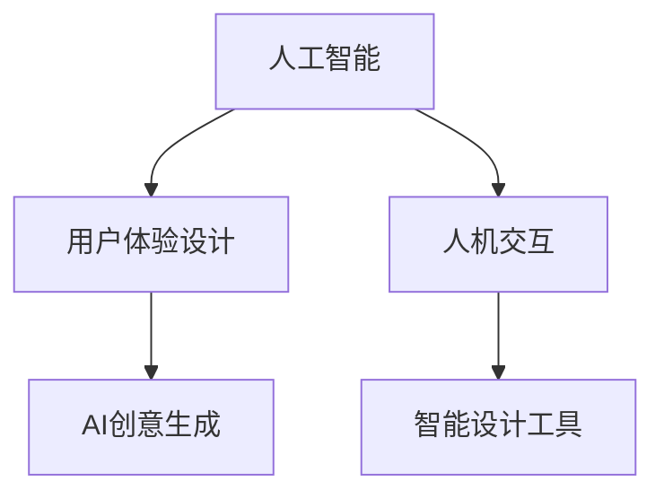

                 

# 体验设计师：AI时代的新兴职业探索

> 关键词：人工智能(AI)，用户体验设计(UX设计)，人机交互(HCI)，智能设计工具，AI创意生成

## 1. 背景介绍

### 1.1 问题由来
随着人工智能技术的迅猛发展，AI技术正逐步融入各行业，从自动驾驶到智能医疗，从智能家居到智能制造，AI无处不在。在这个背景下，AI对用户体验（UX）的关注和影响愈发重要。体验设计师（Experience Designer）作为AI时代的新兴职业，将人机交互（HCI）和用户体验设计相结合，致力于构建更加智能、便捷、个性化的产品与服务，成为AI时代的关键角色。

### 1.2 问题核心关键点
体验设计师的核心在于将AI技术应用于产品设计与用户体验优化，提升用户满意度和产品竞争力。具体关键点包括：
1. **用户需求分析**：深入理解用户需求，识别痛点，制定解决方案。
2. **人机交互设计**：结合AI技术设计高效、自然、易用的交互界面。
3. **智能设计工具**：利用AI创意生成工具，提供设计灵感与自动化辅助设计。
4. **用户体验优化**：通过AI技术实时分析用户反馈，优化产品与服务体验。
5. **数据驱动决策**：基于用户行为数据，优化设计决策，实现个性化推荐。

### 1.3 问题研究意义
体验设计师的出现，不仅提升了AI技术在用户体验设计中的应用，也推动了AI技术从实验室走向实际应用的进程。通过体验设计师的实践，AI技术能够更加贴近用户需求，提供更加智能、高效的产品与服务，为用户创造更多的价值，同时帮助企业提升市场竞争力。

## 2. 核心概念与联系

### 2.1 核心概念概述

为更好地理解体验设计师这一新兴职业，本节将介绍几个核心概念：

- **人工智能(AI)**：一种能够模拟人类智能行为的技术，包括机器学习、自然语言处理、计算机视觉等领域。
- **用户体验设计(UX设计)**：专注于提升产品和服务的使用体验，通过用户研究和设计思维，满足用户需求。
- **人机交互(HCI)**：研究人机交互过程中的信息传递与交互方式，以提高用户满意度和系统效率。
- **智能设计工具**：利用AI技术进行创意生成、自动排版、风格转换等设计辅助功能，提升设计效率。
- **AI创意生成**：利用AI算法自动生成设计灵感和创意内容，辅助设计师进行设计。

这些核心概念之间的逻辑关系可以通过以下Mermaid流程图来展示：



这个流程图展示了这个职业的核心概念及其之间的关系：

1. 人工智能技术提供底层支持。
2. 用户体验设计通过人机交互和智能设计工具，具体实现产品优化。
3. AI创意生成通过提取设计灵感，进一步辅助设计。

## 3. 核心算法原理 & 具体操作步骤
### 3.1 算法原理概述

体验设计师的核心算法原理主要基于机器学习和自然语言处理技术，通过对用户行为数据和反馈的分析和理解，实现个性化设计、智能推荐和用户行为预测。具体包括以下几个方面：

- **用户行为分析**：通过分析用户的使用数据，识别用户行为模式和偏好。
- **自然语言处理**：利用NLP技术，理解用户描述的需求和反馈，进行语义分析。
- **推荐系统**：基于用户行为和偏好，构建推荐模型，实现个性化推荐。
- **创意生成**：利用生成模型（如GPT-3等）自动生成设计灵感和创意。

### 3.2 算法步骤详解

体验设计师的工作流程大致可以分为以下几步：

1. **需求分析**：通过用户访谈、问卷调查、数据分析等方式，收集用户需求和反馈。
2. **数据收集与处理**：收集用户行为数据，清洗、归一化数据，准备训练模型。
3. **模型训练**：利用机器学习算法训练模型，进行用户行为预测、推荐系统构建等。
4. **界面设计**：根据用户需求和AI分析结果，设计交互界面，实现个性化展示和推荐。
5. **智能辅助**：利用AI创意生成工具，提供设计灵感，辅助设计师进行创意设计。
6. **迭代优化**：根据用户反馈和行为数据，持续优化设计，提升用户体验。

### 3.3 算法优缺点

体验设计师的算法具有以下优点：
1. **高效**：能够快速分析大量用户数据，实时调整设计策略，提高设计效率。
2. **个性化**：基于用户行为和偏好，实现个性化推荐，满足用户多样化需求。
3. **创新**：利用AI创意生成工具，提供设计灵感，推动设计创新。

同时，该算法也存在一定的局限性：
1. **数据依赖**：依赖大量用户数据进行模型训练，数据收集和处理成本较高。
2. **隐私问题**：处理用户数据涉及隐私保护，需要采取严格的隐私保护措施。
3. **模型鲁棒性**：模型对新场景和新数据的适应能力有限，可能出现偏差。
4. **人机交互**：复杂交互设计需要综合考虑技术可行性和用户体验，难度较大。

尽管存在这些局限性，但就目前而言，基于AI的用户体验设计方法仍是大势所趋。未来相关研究的重点在于如何进一步提高模型的泛化能力，降低对数据量的依赖，同时兼顾隐私保护和用户体验。

### 3.4 算法应用领域

体验设计师的算法在多个领域都有广泛的应用，例如：

- **智能客服系统**：通过AI分析用户对话数据，优化客服应答策略，提高用户满意度。
- **智能推荐系统**：根据用户行为数据，构建推荐模型，实现个性化商品推荐。
- **智能家居**：利用用户行为数据，优化家居设备的使用，提升生活便利性。
- **智能交通**：分析用户出行数据，优化交通路线，减少用户出行时间。
- **智能健康**：基于健康数据，个性化推荐健康方案，提升用户健康管理水平。

## 4. 数学模型和公式 & 详细讲解  
### 4.1 数学模型构建

本节将使用数学语言对体验设计师的工作流程进行更加严格的刻画。

假设用户行为数据为 $\mathbf{X} = \{x_i\}_{i=1}^N$，其中每个用户行为 $x_i$ 表示为一个向量。假设用户行为预测模型的输出为 $\mathbf{Y} = \{y_i\}_{i=1}^N$，其中 $y_i$ 表示用户行为预测结果。

定义模型的预测误差为 $e_i = y_i - \hat{y_i}$，其中 $\hat{y_i}$ 为模型预测值。则均方误差损失函数为：

$$
L(\mathbf{X},\mathbf{Y}) = \frac{1}{N}\sum_{i=1}^N e_i^2
$$

通过最小化损失函数 $L$，训练模型得到最优参数 $\theta$，即：

$$
\theta^* = \mathop{\arg\min}_{\theta} L(\mathbf{X},\mathbf{Y})
$$

在实践中，我们通常使用基于梯度的优化算法（如SGD、Adam等）来近似求解上述最优化问题。设 $\eta$ 为学习率，$\lambda$ 为正则化系数，则参数的更新公式为：

$$
\theta \leftarrow \theta - \eta \nabla_{\theta}L(\mathbf{X},\mathbf{Y}) - \eta\lambda\theta
$$

其中 $\nabla_{\theta}L(\mathbf{X},\mathbf{Y})$ 为损失函数对参数 $\theta$ 的梯度，可通过反向传播算法高效计算。

### 4.2 公式推导过程

以下我们以推荐系统为例，推导交叉熵损失函数及其梯度的计算公式。

假设用户对商品 $i$ 的评分 $r_i$ 为 $1-10$ 的整数，预测用户对商品 $j$ 的评分 $y_j$ 为实数。推荐系统目标是最小化用户实际评分与预测评分之间的差距，即交叉熵损失函数为：

$$
L(\mathbf{R},\mathbf{Y}) = -\frac{1}{N}\sum_{i=1}^N \sum_{j=1}^{10} r_{ij} \log y_{ij}
$$

其中 $\mathbf{R}$ 为用户评分矩阵，$y_{ij}$ 为模型预测评分。根据链式法则，损失函数对模型参数 $\theta$ 的梯度为：

$$
\frac{\partial L(\mathbf{R},\mathbf{Y})}{\partial \theta} = -\frac{1}{N}\sum_{i=1}^N \sum_{j=1}^{10} r_{ij} \frac{\partial y_{ij}}{\partial \theta}
$$

其中 $\frac{\partial y_{ij}}{\partial \theta}$ 可进一步递归展开，利用自动微分技术完成计算。

在得到损失函数的梯度后，即可带入参数更新公式，完成模型的迭代优化。重复上述过程直至收敛，最终得到适应推荐任务的最优模型参数 $\theta^*$。

## 5. 项目实践：代码实例和详细解释说明
### 5.1 开发环境搭建

在进行体验设计师的工作前，我们需要准备好开发环境。以下是使用Python进行Scikit-learn开发的环境配置流程：

1. 安装Anaconda：从官网下载并安装Anaconda，用于创建独立的Python环境。

2. 创建并激活虚拟环境：
```bash
conda create -n scikit-learn-env python=3.8 
conda activate scikit-learn-env
```

3. 安装Scikit-learn：
```bash
conda install scikit-learn
```

4. 安装各类工具包：
```bash
pip install numpy pandas scikit-learn matplotlib tqdm jupyter notebook ipython
```

完成上述步骤后，即可在`scikit-learn-env`环境中开始体验设计师的工作。

### 5.2 源代码详细实现

下面我们以智能推荐系统为例，给出使用Scikit-learn进行用户行为分析的Python代码实现。

首先，定义数据处理函数：

```python
import pandas as pd
from sklearn.preprocessing import StandardScaler

def preprocess_data(data):
    # 数据清洗
    data = data.dropna()
    # 标准化处理
    scaler = StandardScaler()
    data[['feature1', 'feature2']] = scaler.fit_transform(data[['feature1', 'feature2']])
    # 编码类别特征
    data['category'] = pd.Categorical(data['category']).codes
    return data
```

然后，定义训练和评估函数：

```python
from sklearn.model_selection import train_test_split
from sklearn.linear_model import LogisticRegression
from sklearn.metrics import accuracy_score

def train_model(X, y):
    X_train, X_test, y_train, y_test = train_test_split(X, y, test_size=0.2, random_state=42)
    model = LogisticRegression(solver='lbfgs')
    model.fit(X_train, y_train)
    y_pred = model.predict(X_test)
    print(f"Accuracy: {accuracy_score(y_test, y_pred)}")
```

最后，启动数据预处理和模型训练流程：

```python
data = pd.read_csv('user_behavior.csv')

# 数据预处理
data = preprocess_data(data)

# 模型训练
train_model(data[['feature1', 'feature2', 'category']], data['label'])
```

以上就是使用Scikit-learn进行用户行为分析的完整代码实现。可以看到，得益于Scikit-learn的强大封装，我们可以用相对简洁的代码完成用户行为模型的构建。

### 5.3 代码解读与分析

让我们再详细解读一下关键代码的实现细节：

**preprocess_data函数**：
- 函数主要完成数据清洗、标准化和类别编码等预处理工作，为后续模型训练做准备。

**train_model函数**：
- 使用Scikit-learn的train_test_split方法对数据集进行划分。
- 通过LogisticRegression模型进行二分类训练，并输出模型在测试集上的准确率。

**train_model函数**：
- 使用Python的Pandas库读取用户行为数据。
- 调用preprocess_data函数进行数据预处理。
- 在preprocessed数据上调用train_model函数进行模型训练。

可以看到，Scikit-learn库为体验设计师提供了强大的数据处理和模型训练功能，使得相关任务开发变得相对简单高效。

当然，工业级的系统实现还需考虑更多因素，如模型的保存和部署、超参数的自动搜索、更灵活的任务适配层等。但核心的工作流程基本与此类似。

## 6. 实际应用场景
### 6.1 智能客服系统

基于体验设计师的工作，智能客服系统可以为用户提供更加智能、高效、个性化的服务。系统通过分析用户对话数据，识别用户意图和情绪，提供个性化的应答策略，提升用户满意度。例如，在用户咨询时，系统能够自动识别用户的需求类型（如支付、退换货等），并快速匹配最合适的客服模板进行回复，同时根据用户反馈优化应答策略，逐步提升服务质量。

### 6.2 智能推荐系统

智能推荐系统通过分析用户行为数据，构建推荐模型，实现个性化商品推荐。系统根据用户的历史浏览、购买记录等行为数据，预测用户对商品的兴趣，并推荐符合用户偏好的商品。通过不断收集用户反馈和行为数据，系统可以持续优化推荐策略，提升推荐效果。例如，在电商平台上，系统能够为用户推荐他们可能感兴趣的商品，提升用户购物体验。

### 6.3 智能家居

智能家居系统通过分析用户行为数据，优化家居设备的使用，提升生活便利性。系统能够根据用户的作息习惯，自动调节家中的温度、灯光等环境设置，提供舒适的居住体验。例如，在用户出门前，系统能够自动关闭家中电器，确保用户回家时能够享受温馨的家居环境。

### 6.4 智能交通

智能交通系统通过分析用户出行数据，优化交通路线，减少用户出行时间。系统能够根据用户的出行习惯和目的地的交通状况，提供最优的出行建议，帮助用户避开拥堵路段，提升出行效率。例如，在城市交通管理中，系统能够实时监控道路交通情况，预测拥堵路段，引导用户选择最优路线，缓解交通压力。

## 7. 工具和资源推荐
### 7.1 学习资源推荐

为了帮助体验设计师系统掌握相关技术和知识，这里推荐一些优质的学习资源：

1. **《体验设计思维：从0到1打造用户喜爱的产品》系列博文**：由顶级体验设计师撰写，涵盖用户体验设计的基本原理和设计技巧，适合入门学习和进阶提升。

2. **CS446《用户体验设计与可用性工程》课程**：斯坦福大学开设的体验设计明星课程，涵盖用户体验设计理论和实践，配套作业和项目，助力实战能力的提升。

3. **《设计心理学》书籍**：详细阐述了设计心理学理论，探讨如何通过心理学的视角优化用户体验设计，是体验设计师的必备读物。

4. **Dribbble和Behance**：全球顶尖设计师的作品展示平台，通过浏览和学习优秀的设计作品，提升自身设计水平。

5. **UX Design Bootcamp**：由知名设计师讲授的在线课程，涵盖用户体验设计的核心技能，包括用户研究、界面设计、可用性测试等。

通过对这些资源的学习实践，相信你一定能够快速掌握体验设计师的核心技能，并用于解决实际的UX设计问题。

### 7.2 开发工具推荐

高效的开发离不开优秀的工具支持。以下是几款用于体验设计师开发的常用工具：

1. **Sketch和Figma**：专业UI/UX设计工具，支持原型设计、交互设计、用户研究等功能，是设计师的标配。

2. **Adobe Creative Cloud**：包含Photoshop、Illustrator、InDesign等设计软件，提供强大的图形处理和设计功能。

3. **Adobe XD**：Adobe推出的全新设计工具，提供原型设计和交互设计的一站式解决方案。

4. **InVision Studio**：提供高效的原型设计、用户研究和交互设计功能，支持设计协作和团队管理。

5. **Sketchup**：3D建模工具，支持复杂的设计方案建模，辅助设计师进行空间设计。

合理利用这些工具，可以显著提升体验设计师的工作效率，加快创新迭代的步伐。

### 7.3 相关论文推荐

体验设计师的工作涉及用户研究和设计思维等多个学科，以下是几篇奠基性的相关论文，推荐阅读：

1. **《设计心理学》（Donald A. Norman）**：设计心理学的经典著作，深入探讨了设计心理学理论，为设计师提供了丰富的理论基础。

2. **《用户体验设计的心理学原理》（Jonathan H. Miller）**：通过大量案例，探讨了用户体验设计的心理学原理，是设计师的重要参考。

3. **《设计思维：解构和重构用户体验设计》（Martin N. Bocking）**：详细阐述了设计思维的方法论，通过实际案例展示了如何应用设计思维解决用户体验问题。

4. **《用户体验设计：原则与实践》（Jessica Wise）**：系统介绍了用户体验设计的核心原则和设计技巧，适合实战学习和实践。

这些论文代表了大体验设计师工作的理论基础，通过学习这些前沿成果，可以帮助设计师把握学科前进方向，激发更多的创新灵感。

## 8. 总结：未来发展趋势与挑战

### 8.1 总结

本文对体验设计师这一新兴职业进行了全面系统的介绍。首先阐述了体验设计师的背景和意义，明确了其在AI时代的重要性。其次，从原理到实践，详细讲解了体验设计师的工作流程和核心算法，给出了具体的代码实现示例。同时，本文还探讨了体验设计师在多个领域的应用前景，展示了其广泛的应用潜力。最后，本文精选了体验设计师的工作资源，力求为读者提供全方位的技术指引。

通过本文的系统梳理，可以看到，体验设计师的出现，不仅提升了AI技术在用户体验设计中的应用，也推动了AI技术从实验室走向实际应用的进程。通过体验设计师的实践，AI技术能够更加贴近用户需求，提供更加智能、高效的产品与服务，为用户创造更多的价值，同时帮助企业提升市场竞争力。

### 8.2 未来发展趋势

展望未来，体验设计师的工作将呈现以下几个发展趋势：

1. **数据驱动设计**：基于用户行为数据，进行设计优化和决策，推动设计过程数据化、智能化。
2. **设计思维融合AI**：将AI技术引入设计思维，提供设计灵感和自动化辅助设计，推动设计创新。
3. **跨领域协同设计**：与其他学科领域的专家协同工作，综合考虑技术可行性和用户体验，实现多学科融合。
4. **个性化设计**：利用AI创意生成工具，提供设计灵感，实现个性化设计，满足用户多样化需求。
5. **持续学习设计**：不断学习最新技术，优化设计技能，提升设计水平。

以上趋势凸显了体验设计师工作的广阔前景。这些方向的探索发展，必将进一步提升用户体验设计的质量和效率，为用户创造更加智能、便捷的产品与服务。

### 8.3 面临的挑战

尽管体验设计师的工作已经取得了一定的成果，但在迈向更加智能化、普适化应用的过程中，它仍面临着诸多挑战：

1. **用户需求复杂**：用户需求多样化且不断变化，如何高效识别和理解用户需求，成为一大难题。
2. **设计效率提升**：设计工作繁琐且重复，如何提高设计效率，缩短设计周期，是设计师面临的重要挑战。
3. **跨学科协同**：与其他学科领域的专家协同工作，存在沟通障碍和协作困难。
4. **设计质量保证**：设计质量难以量化评估，需要建立科学的设计质量评估体系。
5. **用户反馈获取**：如何高效获取用户反馈，优化设计策略，提升设计效果。

尽管存在这些挑战，但体验设计师的工作前景仍然广阔。通过不断优化设计流程和工具，提升设计质量和效率，体验设计师必将在AI时代发挥重要作用。

### 8.4 研究展望

面向未来，体验设计师需要关注以下几个研究方向的突破：

1. **设计自动化**：利用AI技术实现自动化设计，提高设计效率。
2. **设计可解释性**：提升设计的可解释性，增强用户信任和接受度。
3. **用户行为分析**：深入分析用户行为数据，优化设计决策。
4. **多模态设计**：综合考虑视觉、听觉、触觉等多模态信息，提升设计体验。
5. **个性化设计**：结合AI创意生成工具，实现个性化设计，满足用户多样化需求。

这些研究方向将引领体验设计师的工作向更高的台阶发展，为构建智能、便捷、个性化的产品与服务铺平道路。只有勇于创新、敢于突破，才能不断拓展用户体验设计的边界，让设计技术更好地造福人类社会。

## 9. 附录：常见问题与解答

**Q1：如何成为一名优秀的体验设计师？**

A: 成为一名优秀的体验设计师需要具备以下关键能力：
1. **设计思维**：通过观察和分析用户行为，掌握设计思维的方法论。
2. **人机交互**：深入理解人机交互原理，设计高效、自然的交互界面。
3. **数据分析**：掌握数据分析技能，能够高效处理和利用用户行为数据。
4. **视觉设计**：具备出色的视觉设计能力，能够创造出美观、易用的设计作品。
5. **团队协作**：具备良好的团队协作能力，与跨学科团队成员高效沟通，共同解决问题。

通过持续学习和实践，逐步提升自己的设计能力，积累实战经验，才能成为一名优秀的体验设计师。

**Q2：如何在设计中应用AI技术？**

A: 在用户体验设计中，AI技术可以用于以下几个方面：
1. **用户行为分析**：利用AI技术分析用户行为数据，识别用户需求和行为模式。
2. **智能推荐**：基于用户行为数据，构建推荐模型，实现个性化推荐。
3. **设计自动化**：利用AI技术自动生成设计灵感和创意，辅助设计师进行设计。
4. **用户体验优化**：通过AI技术实时分析用户反馈，优化设计策略，提升用户体验。

需要根据具体任务，选择合适的AI技术和工具，实现设计自动化和智能化。

**Q3：如何处理用户数据隐私问题？**

A: 处理用户数据隐私问题需要采取以下措施：
1. **数据匿名化**：对用户数据进行匿名化处理，去除敏感信息。
2. **数据加密**：对用户数据进行加密存储，防止数据泄露。
3. **数据最小化**：仅收集必要的数据，避免过度收集。
4. **数据保护**：建立数据保护机制，防止数据滥用和泄露。

通过综合应用这些技术，可以有效保护用户数据隐私，确保用户体验设计的合规性和安全性。

**Q4：如何设计跨领域的产品？**

A: 设计跨领域的产品需要综合考虑多学科知识，采取以下策略：
1. **跨学科团队**：组建跨学科团队，综合各领域专家的知识，共同进行设计。
2. **用户研究**：深入进行用户研究，了解各领域用户需求和行为模式。
3. **多模态设计**：综合考虑视觉、听觉、触觉等多模态信息，提升设计体验。
4. **持续改进**：不断优化设计策略，确保设计方案符合各领域用户需求。

通过这些策略，可以设计出既符合技术要求又满足用户需求的跨领域产品。

**Q5：如何衡量设计效果？**

A: 设计效果可以从以下几个方面进行衡量：
1. **用户体验指标**：通过用户体验问卷、用户反馈等指标，评估设计效果。
2. **用户行为数据**：通过用户行为数据，评估设计方案的实际效果。
3. **满意度调查**：通过满意度调查，了解用户对设计的整体满意度。
4. **用户转化率**：通过用户转化率等指标，评估设计方案对业务的影响。

通过综合应用这些指标，可以全面评估设计效果，优化设计方案。

---

作者：禅与计算机程序设计艺术 / Zen and the Art of Computer Programming

