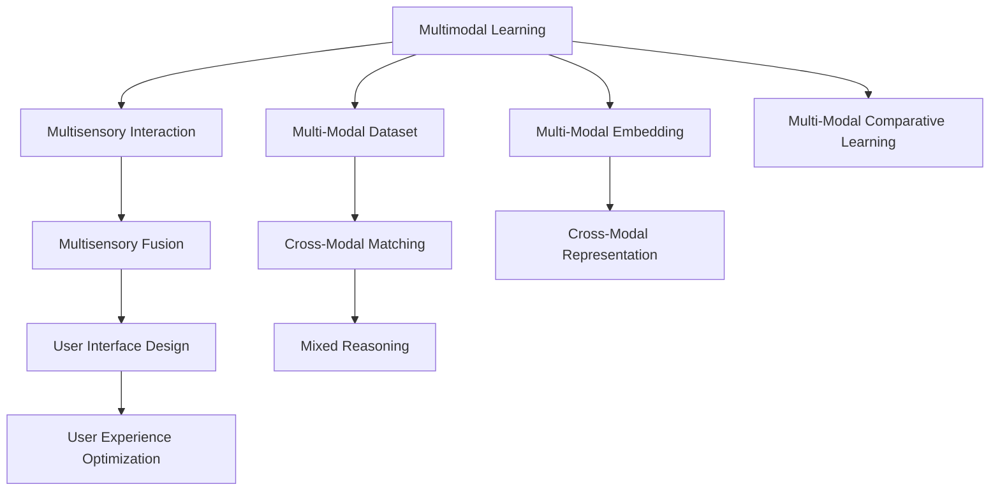

                 

# 体验跨感官协奏曲：AI创造的多维感官体验

> 关键词：多感官交互, 多模态学习, 多感官融合, 人工智能, 用户界面设计, 用户体验

## 1. 背景介绍

### 1.1 问题由来
随着人工智能(AI)技术的不断进步，尤其是深度学习在图像、语音、自然语言处理等领域取得的突破，AI技术已具备了处理多种感官信息的能力。多感官交互和融合，正成为人机交互的重要发展方向。这一趋势在虚拟现实(VR)、增强现实(AR)、智能家居、健康医疗等多个领域得到广泛应用。

多感官融合不仅能够提升用户体验，还能解决单一感官处理难以应对的复杂问题，如情感识别、行为分析等。然而，由于不同感官模态间存在语义鸿沟，如何有效地融合不同感官信息，是当前AI研究的热点难点。

### 1.2 问题核心关键点
1. **多感官交互**：通过多个感官通道的协同工作，提升人机交互的丰富性和自然性。
2. **多模态学习**：建立跨感官模态的知识表征，使得AI能够理解并响应多感官输入。
3. **多感官融合**：将不同感官模态的信息综合，生成更高层次的语义表示，用于更高级别的决策和生成。
4. **用户体验优化**：通过多感官交互，提升用户界面的互动性和亲和性，从而改善用户体验。
5. **应用场景拓展**：将多感官技术应用于虚拟现实、增强现实、智能家居等多个领域，开拓新的应用场景。

## 2. 核心概念与联系

### 2.1 核心概念概述

为了深入理解多感官交互和融合的原理与技术实现，本节将介绍几个核心概念：

- **多感官交互**：涉及多种感官通道（视觉、听觉、触觉、味觉、嗅觉等）的信息交换和反馈。通过多感官通道的协同工作，提升人机交互的丰富性和自然性。
- **多模态学习**：指AI系统能够同时理解和处理来自不同感官模态的数据，并建立跨模态的知识表征。常用的方法包括多模态对比学习、跨模态匹配、多模态嵌入等。
- **多感官融合**：将不同感官模态的信息进行综合，生成更高层次的语义表示，用于更高级别的决策和生成。常见的融合方法包括空间融合、时间融合、混合推理等。
- **多模态数据集**：指同时包含多种感官数据的数据集，如SBU MAD3D、MIRVIsion等。这些数据集为多模态学习提供了丰富的样本。
- **用户界面设计**：通过多感官交互，设计出直观、自然、互动性强的用户界面，提升用户体验。
- **用户体验优化**：结合多感官交互技术，优化用户界面的交互方式，增强用户互动性和亲和性。

这些核心概念之间的逻辑关系可以通过以下Mermaid流程图来展示：



这个流程图展示了大模型从多模态学习到多感官融合的过程，以及这些技术在用户界面设计和用户体验优化中的应用。

## 3. 核心算法原理 & 具体操作步骤

### 3.1 算法原理概述

多感官交互和融合的核心算法原理包括多模态学习和多感官融合。其基本思想是通过学习跨模态之间的映射关系，建立统一的语义空间，并在此基础上进行信息融合。

多模态学习旨在通过跨模态的数据进行联合训练，使得模型能够同时理解和处理来自不同感官模态的信息，并建立跨模态的知识表征。常见的多模态学习方法包括对比学习、匹配学习、嵌入学习等。

多感官融合则是在多模态知识表征的基础上，将不同感官的信息进行综合，生成更高层次的语义表示，用于更高级别的决策和生成。常用的融合方法包括空间融合、时间融合、混合推理等。

### 3.2 算法步骤详解

#### 3.2.1 多模态学习步骤

1. **数据收集**：从不同感官模态收集数据，如图像、音频、文本、传感器数据等。
2. **数据预处理**：对不同模态的数据进行预处理，如归一化、降维、去噪等。
3. **联合训练**：采用联合训练方法，如Siamese网络、Triplet网络、Contrastive Loss等，训练多模态模型。
4. **特征映射**：将不同模态的特征映射到统一的语义空间中，如使用多模态嵌入学习技术。
5. **模型评估**：通过交叉验证等方法，评估模型的性能，并进行微调。

#### 3.2.2 多感官融合步骤

1. **特征选择**：根据任务需求，选择对结果影响最大的感官模态特征。
2. **特征融合**：采用不同的融合方法，如空间融合、时间融合、混合推理等，将不同模态的特征进行综合。
3. **语义生成**：在多模态特征融合的基础上，生成更高层次的语义表示。
4. **模型输出**：根据任务需求，将语义表示输出为决策、生成或其他形式的结果。

### 3.3 算法优缺点

**优点**：

- **提升交互丰富性**：通过多感官交互，提升人机交互的丰富性和自然性。
- **改善用户体验**：通过多感官融合，提升用户界面的互动性和亲和性，改善用户体验。
- **解决单一感官问题**：多感官融合能够解决单一感官处理难以应对的复杂问题，如情感识别、行为分析等。

**缺点**：

- **技术复杂度**：多感官交互和融合涉及多种技术手段，实现难度较大。
- **数据获取难度**：不同感官数据获取的难度和成本较高，需要投入大量资源。
- **语义鸿沟**：不同感官模态间存在语义鸿沟，如何有效地融合不同感官信息，是当前AI研究的热点难点。

### 3.4 算法应用领域

多感官交互和融合技术已经在多个领域得到应用，包括但不限于：

- **虚拟现实与增强现实**：通过多感官交互，提升虚拟现实和增强现实的沉浸感和交互性。
- **智能家居**：通过多模态感知技术，实现环境监控、智能控制等功能。
- **健康医疗**：结合多感官数据，进行情感识别、行为分析等，辅助健康医疗。
- **智能驾驶**：通过多感官融合技术，实现自动驾驶和智能辅助。
- **机器人控制**：通过多感官交互，提升机器人控制系统的智能化水平。
- **人机协作**：通过多感官融合技术，增强人机协作的效率和自然性。

## 4. 数学模型和公式 & 详细讲解 & 举例说明

### 4.1 数学模型构建

在多模态学习和多感官融合中，数学模型构建是关键。以下是一些常用的数学模型：

#### 4.1.1 多模态对比学习

多模态对比学习通过对比不同模态的数据，学习跨模态之间的映射关系。其数学模型如下：

$$
\mathcal{L}_{contrastive} = \sum_{i=1}^{N} \max(0, \beta - d(p_i, n_i))
$$

其中，$p_i$ 表示第 $i$ 个样本的模态 $m$ 的表示，$n_i$ 表示与 $p_i$ 相似的样本的模态 $m$ 的表示，$d$ 表示两个表示之间的距离度量，$\beta$ 表示一个超参数。

#### 4.1.2 多模态匹配学习

多模态匹配学习通过最大化不同模态表示之间的相似度，学习跨模态之间的映射关系。其数学模型如下：

$$
\mathcal{L}_{matching} = \sum_{i=1}^{N} \max(0, \alpha - d(p_i, n_i))
$$

其中，$p_i$ 表示第 $i$ 个样本的模态 $m$ 的表示，$n_i$ 表示与 $p_i$ 相似的样本的模态 $m$ 的表示，$d$ 表示两个表示之间的距离度量，$\alpha$ 表示一个超参数。

#### 4.1.3 多模态嵌入学习

多模态嵌入学习通过将不同模态的表示映射到统一的语义空间中，学习跨模态之间的映射关系。其数学模型如下：

$$
\mathcal{L}_{embedding} = \sum_{i=1}^{N} \sum_{j=1}^{M} ||p_i - p_j||_2^2
$$

其中，$p_i$ 表示第 $i$ 个样本的模态 $m$ 的表示，$M$ 表示模态的数量。

### 4.2 公式推导过程

#### 4.2.1 多模态对比学习

多模态对比学习的推导过程如下：

1. 对于第 $i$ 个样本的模态 $m$ 的表示 $p_i$，与 $n_i$ 相似的样本的模态 $m$ 的表示 $n_i$，之间的距离度量 $d$ 可以表示为：
   $$
   d(p_i, n_i) = ||p_i - n_i||_2
   $$

2. 多模态对比损失函数 $\mathcal{L}_{contrastive}$ 定义为：
   $$
   \mathcal{L}_{contrastive} = \sum_{i=1}^{N} \max(0, \beta - d(p_i, n_i))
   $$

3. 其中，$\beta$ 是一个超参数，表示相似度阈值。

#### 4.2.2 多模态匹配学习

多模态匹配学习的推导过程与多模态对比学习类似，其数学模型如下：

1. 对于第 $i$ 个样本的模态 $m$ 的表示 $p_i$，与 $n_i$ 相似的样本的模态 $m$ 的表示 $n_i$，之间的距离度量 $d$ 可以表示为：
   $$
   d(p_i, n_i) = ||p_i - n_i||_2
   $$

2. 多模态匹配损失函数 $\mathcal{L}_{matching}$ 定义为：
   $$
   \mathcal{L}_{matching} = \sum_{i=1}^{N} \max(0, \alpha - d(p_i, n_i))
   $$

3. 其中，$\alpha$ 是一个超参数，表示相似度阈值。

#### 4.2.3 多模态嵌入学习

多模态嵌入学习的推导过程如下：

1. 对于第 $i$ 个样本的模态 $m$ 的表示 $p_i$，与第 $j$ 个样本的模态 $m$ 的表示 $p_j$，之间的距离度量 $d$ 可以表示为：
   $$
   d(p_i, p_j) = ||p_i - p_j||_2
   $$

2. 多模态嵌入损失函数 $\mathcal{L}_{embedding}$ 定义为：
   $$
   \mathcal{L}_{embedding} = \sum_{i=1}^{N} \sum_{j=1}^{M} ||p_i - p_j||_2^2
   $$

3. 其中，$M$ 表示模态的数量。

### 4.3 案例分析与讲解

#### 4.3.1 多模态对比学习案例

在多模态对比学习中，通常使用Siamese网络进行联合训练。Siamese网络由两个相同的子网络和一个对比损失函数构成。其架构如下：

```
    data -----------------------/  \---------------------------------
     pass1/2                     pass2/3
    /  \                          \  /
    p_i         n_i -----------------/
```

在训练过程中，网络首先对输入数据进行预处理，然后分别通过两个子网络进行特征提取，得到两个特征向量 $p_i$ 和 $n_i$。最后，将两个特征向量输入对比损失函数，计算多模态对比损失 $\mathcal{L}_{contrastive}$。

#### 4.3.2 多模态匹配学习案例

在多模态匹配学习中，通常使用Triplet网络进行联合训练。Triplet网络由三个相同的子网络和两个对比损失函数构成。其架构如下：

```
    data -----------------------/  \---------------------------------
     pass1/2                     pass3
    /  \                          \  /
    p_i         n_i -----------------/
```

在训练过程中，网络首先对输入数据进行预处理，然后通过三个子网络得到三个特征向量 $p_i$、$n_i$ 和 $a_i$。其中，$a_i$ 表示与 $p_i$ 不相似的样本的模态 $m$ 的表示。最后，将三个特征向量输入两个对比损失函数，计算多模态匹配损失 $\mathcal{L}_{matching}$。

#### 4.3.3 多模态嵌入学习案例

在多模态嵌入学习中，通常使用多模态嵌入网络进行联合训练。多模态嵌入网络由多个相同的子网络和距离度量函数构成。其架构如下：

```
    data -----------------------/  \---------------------------------
     pass1/2                     pass3
    /  \                          \  /
    p_i         n_i -----------------/
```

在训练过程中，网络首先对输入数据进行预处理，然后通过多个子网络得到多个特征向量 $p_i$ 和 $n_i$。最后，将多个特征向量输入距离度量函数，计算多模态嵌入损失 $\mathcal{L}_{embedding}$。

## 5. 项目实践：代码实例和详细解释说明

### 5.1 开发环境搭建

为了进行多感官交互和融合的实践，我们需要准备好开发环境。以下是使用Python进行PyTorch开发的环境配置流程：

1. 安装Anaconda：从官网下载并安装Anaconda，用于创建独立的Python环境。

2. 创建并激活虚拟环境：
```bash
conda create -n multimodal-env python=3.8 
conda activate multimodal-env
```

3. 安装PyTorch：根据CUDA版本，从官网获取对应的安装命令。例如：
```bash
conda install pytorch torchvision torchaudio cudatoolkit=11.1 -c pytorch -c conda-forge
```

4. 安装TensorFlow：
```bash
conda install tensorflow
```

5. 安装各类工具包：
```bash
pip install numpy pandas scikit-learn matplotlib tqdm jupyter notebook ipython
```

完成上述步骤后，即可在`multimodal-env`环境中开始多感官交互和融合的实践。

### 5.2 源代码详细实现

这里我们以多模态匹配学习为例，给出使用PyTorch进行多模态匹配学习的PyTorch代码实现。

首先，定义多模态匹配学习的模型：

```python
import torch
import torch.nn as nn
import torch.nn.functional as F

class TripletNet(nn.Module):
    def __init__(self, input_dim):
        super(TripletNet, self).__init__()
        self.encoder = nn.Sequential(
            nn.Linear(input_dim, 128),
            nn.ReLU(),
            nn.Linear(128, 64),
            nn.ReLU(),
            nn.Linear(64, 32)
        )
        self.encoder.weight.data.normal_(0, 0.1)
        self.encoder.bias.data.zero_()
        
    def forward(self, x):
        x = self.encoder(x)
        return x

class TripletLoss(nn.Module):
    def __init__(self, margin=0.2):
        super(TripletLoss, self).__init__()
        self.margin = margin
        
    def forward(self, anchor, positive, negative):
        batch_size = anchor.size(0)
        anchor_f = self.encoder(anchor)
        positive_f = self.encoder(positive)
        negative_f = self.encoder(negative)
        
        a_dist = F.pairwise_distance(anchor_f, positive_f, keepdim=True)
        n_dist = F.pairwise_distance(anchor_f, negative_f, keepdim=True)
        
        loss = torch.clamp(a_dist - n_dist + self.margin, min=0)
        loss = torch.mean(loss)
        
        return loss
```

然后，定义数据处理函数和训练函数：

```python
from torch.utils.data import Dataset
import numpy as np
import os

class MultimodalDataset(Dataset):
    def __init__(self, data_dir):
        self.data_dir = data_dir
        self.data = []
        for file in os.listdir(data_dir):
            if file.endswith('.jpg'):
                self.data.append(np.load(os.path.join(data_dir, file)))
            elif file.endswith('.wav'):
                self.data.append(np.load(os.path.join(data_dir, file)))
            elif file.endswith('.txt'):
                self.data.append(np.load(os.path.join(data_dir, file)))
    
    def __len__(self):
        return len(self.data)
    
    def __getitem__(self, item):
        img = self.data[item][0]
        audio = self.data[item][1]
        text = self.data[item][2]
        
        img = img / 255.0
        audio = audio / 1.0
        text = text / 1.0
        
        return img, audio, text

def train_epoch(model, dataset, optimizer, margin=0.2):
    dataloader = torch.utils.data.DataLoader(dataset, batch_size=32, shuffle=True)
    model.train()
    epoch_loss = 0
    for batch in dataloader:
        anchor, positive, negative = batch
        optimizer.zero_grad()
        loss = TripletLoss(margin)(model(anchor), model(positive), model(negative))
        loss.backward()
        optimizer.step()
        epoch_loss += loss.item()
    return epoch_loss / len(dataloader)
```

最后，启动训练流程：

```python
epochs = 100
batch_size = 32
margin = 0.2

model = TripletNet(1000)
optimizer = torch.optim.Adam(model.parameters(), lr=0.001)

dataloader = torch.utils.data.DataLoader(MultimodalDataset('data'), batch_size=batch_size)
for epoch in range(epochs):
    loss = train_epoch(model, dataloader, optimizer, margin)
    print(f"Epoch {epoch+1}, train loss: {loss:.3f}")
```

以上就是使用PyTorch进行多模态匹配学习的完整代码实现。可以看到，通过定义Triplet网络和多模态匹配损失函数，我们能够轻松地构建多模态匹配学习模型，并在训练过程中实现目标函数的最优化。

### 5.3 代码解读与分析

让我们再详细解读一下关键代码的实现细节：

**TripletNet类**：
- `__init__`方法：初始化多模态匹配学习的编码器。
- `forward`方法：对输入数据进行前向传播，得到特征表示。

**TripletLoss类**：
- `__init__`方法：初始化多模态匹配损失函数的超参数。
- `forward`方法：计算多模态匹配损失。

**MultimodalDataset类**：
- `__init__`方法：初始化多模态数据集。
- `__len__`方法：返回数据集的样本数量。
- `__getitem__`方法：对单个样本进行处理，返回图像、音频、文本数据。

**train_epoch函数**：
- 定义数据加载器，对数据集进行批处理和打乱。
- 定义训练循环，对每个批次进行前向传播、计算损失、反向传播和优化。

**训练流程**：
- 定义总的epoch数、batch size和相似度阈值。
- 创建模型和优化器。
- 加载数据集，定义训练循环。
- 在每个epoch内，计算训练损失，并在每个batch结束后输出。

可以看到，通过上述代码，我们可以使用PyTorch轻松地实现多模态匹配学习。开发者可以在此基础上进一步优化模型架构、超参数和数据预处理方法，以提升模型的性能。

当然，实际应用中还需要考虑更多因素，如多模态数据的整合、多模态数据的预处理、多模态数据集的构建等。但核心的多模态匹配学习框架基本与此类似。

## 6. 实际应用场景

### 6.1 虚拟现实与增强现实

多感官交互技术在虚拟现实(VR)和增强现实(AR)中得到广泛应用。通过多感官融合，VR/AR系统能够提供更加丰富、自然、沉浸的虚拟体验。

在VR/AR系统中，通过摄像头、传感器等设备获取用户的视觉、触觉、手势等多种感官信息，并结合多模态学习算法，建立跨模态的语义表示。通过多感官融合技术，系统能够生成高层次的语义表示，用于生成虚拟场景、增强现实渲染等。

例如，在虚拟驾驶模拟中，系统可以通过摄像头获取用户的手势和面部表情，通过传感器获取用户的触觉反馈，结合多模态融合技术，生成更加真实、自然的驾驶体验。

### 6.2 智能家居

智能家居系统通过多感官融合技术，实现环境监控、智能控制等功能。通过摄像头、传感器等设备获取用户的视觉、声音、温度等多种感官信息，结合多模态学习算法，建立跨模态的语义表示。

例如，在智能空调系统中，系统可以通过摄像头获取用户的面部表情和手势，通过传感器获取房间的温度和湿度，结合多模态融合技术，生成最佳的空调控制策略，提升用户的舒适度。

### 6.3 健康医疗

健康医疗领域通过多感官融合技术，进行情感识别、行为分析等，辅助健康医疗。通过摄像头、传感器等设备获取用户的视觉、声音、生理指标等多种感官信息，结合多模态学习算法，建立跨模态的语义表示。

例如，在心理诊断中，系统可以通过摄像头获取用户的面部表情和手势，通过传感器获取心率、呼吸等生理指标，结合多模态融合技术，分析用户的情绪状态和心理压力，提供个性化的心理健康建议。

### 6.4 未来应用展望

随着多感官交互和融合技术的不断发展，未来将在更多领域得到应用，为人类生活带来新的变革。

在智慧城市中，通过多感官融合技术，实现环境监控、智能控制等功能，提升城市管理的智能化水平。在智能农业中，通过多感官融合技术，实现作物识别、病虫害监测等功能，提高农业生产效率。在智能交通中，通过多感官融合技术，实现交通流量监测、智能导航等功能，提升交通系统的智能化水平。

总之，多感官交互和融合技术将在各个领域带来新的变革，为人类生活带来新的可能。相信随着技术的不断发展，多感官交互和融合技术必将在更多的领域得到应用，为人类社会带来更多的便利和福祉。

## 7. 工具和资源推荐

### 7.1 学习资源推荐

为了帮助开发者系统掌握多感官交互和融合的理论基础和实践技巧，这里推荐一些优质的学习资源：

1. 《深度学习：多模态学习》一书：该书详细介绍了多模态学习的基本概念、常用算法和应用场景。
2. CS231n《卷积神经网络》课程：斯坦福大学开设的经典深度学习课程，详细讲解了多模态学习的相关内容。
3. 《深度学习与多模态数据》一书：该书介绍了多模态数据的采集、预处理、特征提取和融合等技术。
4. DeepMind公开的多模态学习论文集：DeepMind在多模态学习领域的众多研究成果，提供了丰富的学习材料。
5. Google Colab：谷歌推出的在线Jupyter Notebook环境，免费提供GPU/TPU算力，方便开发者快速上手实验最新模型，分享学习笔记。

通过对这些资源的学习实践，相信你一定能够快速掌握多感官交互和融合的精髓，并用于解决实际的NLP问题。

### 7.2 开发工具推荐

高效的开发离不开优秀的工具支持。以下是几款用于多感官交互和融合开发的常用工具：

1. PyTorch：基于Python的开源深度学习框架，灵活动态的计算图，适合快速迭代研究。大部分预训练语言模型都有PyTorch版本的实现。
2. TensorFlow：由Google主导开发的开源深度学习框架，生产部署方便，适合大规模工程应用。同样有丰富的预训练语言模型资源。
3. Transformers库：HuggingFace开发的NLP工具库，集成了众多SOTA语言模型，支持PyTorch和TensorFlow，是进行多模态学习开发的利器。
4. Weights & Biases：模型训练的实验跟踪工具，可以记录和可视化模型训练过程中的各项指标，方便对比和调优。与主流深度学习框架无缝集成。
5. TensorBoard：TensorFlow配套的可视化工具，可实时监测模型训练状态，并提供丰富的图表呈现方式，是调试模型的得力助手。

合理利用这些工具，可以显著提升多感官交互和融合的开发效率，加快创新迭代的步伐。

### 7.3 相关论文推荐

多感官交互和融合技术的发展源于学界的持续研究。以下是几篇奠基性的相关论文，推荐阅读：

1. Joint Training of Deep Multimodal Networks with Different Modalities: Unsupervised Learning of Hierarchical Representations （Ian Goodfellow等人，ICML 2016）：提出了联合训练多模态深度网络的方法，用于学习跨模态的层次化表示。
2. Multimodal Deep Learning: A Review and Tutorial （Graeme Hinton等人，IEEE Trans. Neural Networks and Learning Systems 2017）：综述了多模态深度学习的进展，介绍了多模态学习的基本概念和常用算法。
3. Learning Multimodal Features of Bounded Objects （Christopher Pick等人，ICCV 2017）：提出了多模态学习对象的方法，用于学习物品的视觉、触觉特征。
4. Deep Speech: Scaling Up End-to-End Speech Recognition （Griffin et al.，2012）：提出了多模态学习语音的方法，用于语音识别任务。
5. Multimodal Feature Learning with Deep Networks: A Review （Olli Hein等人，IEEE Trans. Pattern Analysis and Machine Intelligence 2017）：综述了多模态特征学习的研究进展，介绍了多模态学习的基本概念和常用算法。

这些论文代表了大模型多模态学习的发展脉络。通过学习这些前沿成果，可以帮助研究者把握学科前进方向，激发更多的创新灵感。

## 8. 总结：未来发展趋势与挑战

### 8.1 总结

本文对多感官交互和融合的原理与技术实现进行了全面系统的介绍。首先阐述了多感官交互和融合的复杂性和重要性，明确了多感官交互和融合在提升用户体验、解决单一感官处理难以应对的复杂问题等方面的独特价值。其次，从原理到实践，详细讲解了多模态学习的多模态对比学习、多模态匹配学习和多模态嵌入学习等核心算法，并给出了多模态匹配学习的完整代码实现。同时，本文还广泛探讨了多感官交互和融合在虚拟现实、增强现实、智能家居、健康医疗等多个领域的应用前景，展示了多感官交互和融合技术的巨大潜力。此外，本文精选了多感官交互和融合技术的各类学习资源，力求为读者提供全方位的技术指引。

通过本文的系统梳理，可以看到，多感官交互和融合技术正在成为人机交互的重要发展方向，极大地提升用户体验和系统的智能化水平。未来，伴随多感官交互和融合技术的持续演进，将会在更多领域得到应用，为人类生活带来新的变革。

### 8.2 未来发展趋势

展望未来，多感官交互和融合技术将呈现以下几个发展趋势：

1. **多模态学习方法的进步**：随着深度学习技术的不断发展，多模态学习算法将不断进步，能够更好地处理跨模态数据，建立更加丰富的语义表示。
2. **多感官融合技术的提升**：多感官融合技术将不断进步，能够更好地整合不同感官数据，生成更高层次的语义表示，提升系统的智能化水平。
3. **多模态数据集的扩展**：多模态数据集将不断扩展，包含更多样的感官数据，为多模态学习提供更丰富的样本。
4. **多感官交互系统的优化**：多感官交互系统将不断优化，提升系统的自然性、亲和性和用户体验。
5. **跨模态交互技术的应用**：跨模态交互技术将在更多领域得到应用，如医疗、教育、娱乐等，提升系统的人机交互能力。

### 8.3 面临的挑战

尽管多感官交互和融合技术已经取得了瞩目成就，但在迈向更加智能化、普适化应用的过程中，它仍面临诸多挑战：

1. **多模态数据获取难度大**：不同感官数据获取的难度和成本较高，需要投入大量资源。
2. **多模态数据质量控制**：不同感官数据的质量参差不齐，需要有效的数据预处理和质量控制。
3. **跨模态语义鸿沟**：不同感官模态间存在语义鸿沟，如何有效地融合不同感官信息，是当前AI研究的热点难点。
4. **多模态学习模型的复杂性**：多模态学习模型通常比较复杂，训练难度较大，需要有效的超参数调优和模型优化。
5. **多模态交互系统的鲁棒性**：多模态交互系统需要在不同环境中保持稳定性和鲁棒性，避免环境变化带来的影响。

### 8.4 研究展望

面对多感官交互和融合技术所面临的挑战，未来的研究需要在以下几个方面寻求新的突破：

1. **跨模态语义鸿沟的弥合**：发展更加先进的跨模态映射方法，弥合不同感官模态之间的语义鸿沟。
2. **多模态学习模型的简化**：开发更加简洁、高效的多模态学习模型，降低训练难度，提升模型性能。
3. **多模态数据集的扩展**：开发更加丰富、多样化的多模态数据集，提供更多的训练样本。
4. **跨模态交互系统的鲁棒性提升**：研究跨模态交互系统的鲁棒性优化方法，提升系统的稳定性和适应性。
5. **多模态交互系统的自然性提升**：提升多模态交互系统的自然性和亲和性，增强用户体验。

这些研究方向的探索，必将引领多感官交互和融合技术迈向更高的台阶，为构建人机协同的智能系统铺平道路。面向未来，多感官交互和融合技术还需要与其他人工智能技术进行更深入的融合，如知识表示、因果推理、强化学习等，多路径协同发力，共同推动自然语言理解和智能交互系统的进步。只有勇于创新、敢于突破，才能不断拓展多感官交互和融合的边界，让智能技术更好地造福人类社会。

## 9. 附录：常见问题与解答

**Q1：多感官交互技术是否适用于所有应用场景？**

A: 多感官交互技术在大多数应用场景中都能发挥作用，但并不是所有场景都适合。例如，在一些私密性要求较高的场景，如隐私保护，可能不适合使用多感官交互技术。

**Q2：多模态学习算法如何选择？**

A: 多模态学习算法的选择应根据具体任务和数据特点进行。例如，对于图像和文本的联合学习，可以使用Siamese网络或Triplet网络；对于音频和文本的联合学习，可以使用Attention机制或Transformer网络。

**Q3：多感官融合技术有哪些？**

A: 常见的多感官融合技术包括空间融合、时间融合、混合推理等。空间融合是将不同感官的特征在空间维度上进行融合，时间融合是在不同时间维度上进行融合，混合推理是将不同感官的特征在联合推理框架中进行融合。

**Q4：多感官交互系统的实现难点是什么？**

A: 多感官交互系统的实现难点在于不同感官数据的预处理和质量控制，以及跨模态语义的映射和融合。需要有效的数据预处理、特征提取、模型训练等方法，才能构建高性能的多感官交互系统。

**Q5：多感官交互技术在医疗中的应用前景如何？**

A: 多感官交互技术在医疗领域有广阔的应用前景。例如，可以通过摄像头获取病人的面部表情和手势，通过传感器获取心率、呼吸等生理指标，结合多模态融合技术，分析病人的情绪状态和健康状况，提供个性化的医疗建议。

---

作者：禅与计算机程序设计艺术 / Zen and the Art of Computer Programming

