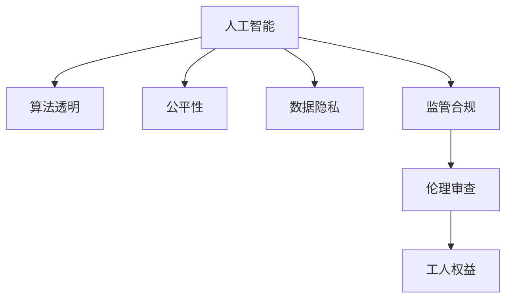

                 

# 保护工人权益：人类计算中的监管挑战

> 关键词：监管合规, 数据隐私, 算法透明, 公平性, 人工智能, 伦理审查, 工人权益

## 1. 背景介绍

### 1.1 问题由来
随着人工智能（AI）和机器学习（ML）技术的快速发展，越来越多的行业开始探索和利用这些技术来提高生产效率和优化决策流程。然而，与此同时，涉及AI和ML的伦理和监管问题也日益凸显。特别是对于需要大量人类劳动力的行业，如制造、物流、客服等，AI技术的应用虽然带来了诸多好处，但也引发了一系列复杂的伦理和监管挑战。其中，保护工人权益是一个关键问题。

### 1.2 问题核心关键点
- **监管合规**：如何在技术应用过程中遵守相关法律法规，特别是在数据隐私、公平性和透明性方面。
- **数据隐私**：如何保护工人的个人信息，防止数据滥用和隐私泄露。
- **算法透明**：如何确保AI算法的决策过程可解释、可审计，以提升其透明度。
- **公平性**：如何确保AI系统在招聘、评估、晋升等关键环节中不产生歧视，保护所有工人的合法权益。
- **工人权益**：如何确保技术应用过程中不侵害工人的人身安全和心理健康，保障他们的基本权益。

这些关键点反映了在AI和ML技术广泛应用过程中，确保技术正向发展的必要性。本文将探讨如何通过监管手段，平衡技术创新与工人权益保护之间的关系，为相关利益方提供参考。

### 1.3 问题研究意义
探讨和解决这些问题对于促进AI和ML技术的健康发展具有重要意义：

- **促进技术正向应用**：确保技术应用不侵犯工人权益，可以增强社会对AI和ML技术的信任和接受度，推动技术的广泛应用。
- **保障工人权益**：通过合理的监管措施，保护工人免受技术滥用和不公平待遇的侵害，保障其基本权益。
- **促进合规发展**：明确法规要求，帮助企业和技术开发者在合规框架内开展工作，避免法律风险。
- **推动伦理审查**：加强对AI算法的伦理审查，提升技术开发的道德标准，促进社会进步。

本文将结合现有研究成果和实际案例，深入分析AI和ML技术应用中的监管挑战，并提出相应的解决方案。

## 2. 核心概念与联系

### 2.1 核心概念概述

为更好地理解如何在AI和ML技术应用中保护工人权益，本节将介绍几个关键概念及其之间的关系：

- **人工智能与机器学习**：指通过算法和数据训练，使机器能够自主完成复杂任务的计算过程。
- **算法透明**：指AI算法的工作原理、输入输出关系、决策依据等应尽可能公开，以便于审计和理解。
- **公平性**：指AI系统在处理不同群体时，不应产生系统性偏见或歧视，保障所有群体的平等权益。
- **数据隐私**：指保护个人数据不被未经授权的访问、使用和共享，避免数据滥用。
- **监管合规**：指技术应用过程中遵守相关法律法规，保障技术的合法性和合规性。
- **伦理审查**：指对AI和ML系统进行道德和伦理层面的审查，确保技术应用符合社会道德标准。
- **工人权益**：指确保AI和ML技术应用过程中，不侵害工人的基本权益，如就业机会、薪酬待遇、工作环境等。

这些核心概念之间的逻辑关系可以通过以下Mermaid流程图来展示：



这个流程图展示了大语言模型的核心概念及其之间的关系：

1. 人工智能和机器学习是技术基础。
2. 算法透明、公平性和数据隐私是技术应用的基本原则。
3. 监管合规和伦理审查是对技术应用的法律和道德约束。
4. 工人权益是技术应用的目标和底线。

这些概念共同构成了AI和ML技术应用中的伦理和监管框架，确保技术的应用能够平衡创新与责任，保护所有利益相关者的合法权益。

## 3. 核心算法原理 & 具体操作步骤
### 3.1 算法原理概述

在AI和ML技术应用中保护工人权益，主要涉及以下几个关键算法原理：

- **数据隐私保护**：通过数据匿名化、加密、差分隐私等技术，确保个人数据在收集、处理和存储过程中的隐私保护。
- **算法透明与可解释性**：通过模型解释工具和透明化算法流程，确保AI决策的透明度和可解释性。
- **公平性算法**：通过公平性评估和偏差校正，确保AI算法在处理不同群体时不产生系统性偏见。
- **合规审计**：通过定期审计和第三方审查，确保技术应用过程中符合相关法律法规和伦理标准。

这些算法原理在大规模数据处理和复杂算法设计中，共同构成了一个完整的监管框架，用于指导AI和ML技术的安全、合规和公平应用。

### 3.2 算法步骤详解

以下是基于算法原理的具体操作步骤：

**步骤1：数据隐私保护**

1. **数据收集**：在数据收集阶段，通过数据匿名化和加密技术，确保个人数据不被识别和滥用。
2. **数据存储**：在数据存储阶段，采用差分隐私技术，限制数据集中的个体信息泄露。
3. **数据处理**：在数据处理阶段，通过去标识化技术，进一步保护数据隐私。

**步骤2：算法透明与可解释性**

1. **模型训练**：选择或设计透明的算法模型，确保其决策过程可解释、可审计。
2. **模型解释**：使用模型解释工具（如LIME、SHAP等），生成模型的特征重要性图，帮助理解模型的决策依据。
3. **审计机制**：建立审计机制，定期审查模型性能和决策过程，确保透明度和公正性。

**步骤3：公平性算法**

1. **数据预处理**：使用数据增强技术，确保训练数据的多样性和代表性。
2. **公平性评估**：通过公平性评估指标（如Demographic Parity、Equalized Odds等），检测算法中的偏见。
3. **偏差校正**：采用偏差校正方法（如重新加权、生成对抗网络等），校正算法中的偏见。

**步骤4：合规审计**

1. **法规遵从**：确保技术应用过程中遵守相关法律法规，如GDPR、CCPA等。
2. **伦理审查**：通过第三方审查，确保技术应用符合伦理标准，避免潜在的伦理风险。
3. **持续改进**：根据审计结果，持续改进算法和数据处理流程，提升合规性。

通过上述操作步骤，可以有效保护工人权益，确保AI和ML技术应用的正向发展。

### 3.3 算法优缺点

基于算法原理的操作具有以下优点：

- **保护隐私**：通过数据隐私保护技术，确保个人数据不被滥用，增强工人对技术的信任。
- **提升透明度**：通过算法透明和可解释性，提升技术应用的公开性和可信度，便于监管和审查。
- **公平处理**：通过公平性算法，确保不同群体在技术应用中得到平等对待，保护所有工人的合法权益。
- **合规可靠**：通过合规审计和伦理审查，确保技术应用符合法律法规和伦理标准，避免法律风险。

同时，这些操作也存在一些缺点：

- **技术复杂**：数据隐私保护、算法透明和公平性等技术操作较为复杂，需要专业知识和资源支持。
- **成本高昂**：实现这些技术操作需要投入大量资源，包括技术研发、数据处理和运营维护等。
- **执行难度**：在技术应用过程中，需要持续监测和调整，以应对不断变化的数据和环境。

尽管如此，为了保护工人权益，这些操作是必要的，也是必须的。

### 3.4 算法应用领域

基于数据隐私保护、算法透明、公平性算法和合规审计等技术原理，AI和ML技术在以下领域得到了广泛应用：

- **人力资源管理**：在招聘、培训、晋升等环节，使用AI算法处理数据，确保公平性，保护员工权益。
- **生产自动化**：通过AI和ML技术，优化生产流程，提升生产效率，同时确保技术应用不侵害工人安全和健康。
- **客户服务**：使用AI聊天机器人，提高客服响应速度和质量，同时保护客户数据隐私。
- **健康医疗**：在健康诊断和治疗过程中，使用AI技术辅助决策，确保数据隐私和算法透明。
- **金融服务**：在金融交易和信贷评估中，使用AI算法，确保公平性和合规性，保护用户权益。

这些领域的应用展示了AI和ML技术在提升效率和质量的同时，也需要合理监管和保护工人权益的必要性。

## 4. 数学模型和公式 & 详细讲解 & 举例说明

### 4.1 数学模型构建

为了更好地理解如何在AI和ML技术应用中保护工人权益，本节将使用数学语言对相关模型进行详细构建。

**数据隐私保护模型**

1. **数据匿名化**：使用k-匿名化技术，确保单个数据点的隐私不被识别。数学表达为：

   $$
   \mathcal{L}_{\text{anonymity}} = \frac{1}{n}\sum_{i=1}^n D_i(T_i)
   $$

   其中，$D_i(T_i)$ 表示数据点 $i$ 在数据集 $T_i$ 中的隐私风险。

2. **数据加密**：使用差分隐私技术，确保在数据分析过程中，数据集中的个体信息不易被识别。数学表达为：

   $$
   \mathcal{L}_{\text{privacy}} = \sum_{i=1}^n \epsilon \log (1+\epsilon^{-1} D_i(T_i))
   $$

   其中，$\epsilon$ 表示隐私保护程度。

**算法透明与可解释性模型**

1. **模型解释**：使用局部可解释模型（LIME），生成模型对单个样本的解释。数学表达为：

   $$
   \mathcal{L}_{\text{interpretable}} = \sum_{i=1}^n ||\mathcal{G}(f_i(x_i))-\hat{f}_i(x_i)||^2
   $$

   其中，$\mathcal{G}$ 表示生成模型，$f_i$ 表示原始模型，$\hat{f}_i$ 表示解释模型。

2. **审计机制**：通过定期的模型审计，检测算法偏差和错误。数学表达为：

   $$
   \mathcal{L}_{\text{auditing}} = \sum_{i=1}^n \delta_i(r_i)
   $$

   其中，$\delta_i$ 表示审计结果，$r_i$ 表示审计点。

**公平性算法模型**

1. **数据预处理**：使用数据增强技术，确保训练数据的多样性和代表性。数学表达为：

   $$
   \mathcal{L}_{\text{preprocessing}} = \sum_{i=1}^n (\frac{1}{n}\sum_{j=1}^n \mathbb{1}(y_j \neq y_i))
   $$

   其中，$y_j$ 表示样本标签，$\mathbb{1}$ 表示指示函数。

2. **公平性评估**：使用 Demographic Parity 指标，检测算法中的偏见。数学表达为：

   $$
   \mathcal{L}_{\text{demographic}} = \sum_{i=1}^n |\frac{p_i}{p_j} - 1|
   $$

   其中，$p_i$ 表示群体 $i$ 的预测概率，$p_j$ 表示群体 $j$ 的预测概率。

3. **偏差校正**：使用生成对抗网络（GAN），校正算法中的偏差。数学表达为：

   $$
   \mathcal{L}_{\text{correction}} = \sum_{i=1}^n ||\hat{y}_i-y_i||^2
   $$

   其中，$\hat{y}_i$ 表示校正后的预测结果，$y_i$ 表示原始预测结果。

### 4.2 公式推导过程

以下是相关公式的推导过程：

**数据隐私保护公式推导**

数据匿名化的目的是确保单个数据点的隐私不被识别。假设原始数据集为 $D=\{(x_i, y_i)\}_{i=1}^n$，其中 $x_i$ 表示特征，$y_i$ 表示标签。使用k-匿名化技术，生成匿名数据集 $T=\{(x_i, y_i)\}_{i=1}^n$，其中 $x_i$ 表示特征，$y_i$ 表示标签。匿名化后的隐私风险 $D_i(T_i)$ 可以表示为：

$$
D_i(T_i) = \frac{1}{k}\sum_{j=1}^k D_j(T_i)
$$

其中，$D_j(T_i)$ 表示匿名数据集中个体 $i$ 的隐私风险。

**算法透明与可解释性公式推导**

使用局部可解释模型（LIME），生成模型对单个样本的解释。假设原始模型为 $f(x)$，解释模型为 $\hat{f}(x)$，生成模型为 $\mathcal{G}(x)$。解释模型 $\hat{f}(x)$ 的解释能力可以表示为：

$$
\mathcal{L}_{\text{interpretable}} = \sum_{i=1}^n ||\mathcal{G}(f_i(x_i))-\hat{f}_i(x_i)||^2
$$

其中，$\mathcal{G}(f_i(x_i))$ 表示生成模型对原始模型的解释结果，$\hat{f}_i(x_i)$ 表示解释模型对样本的预测结果。

**公平性算法公式推导**

使用 Demographic Parity 指标，检测算法中的偏见。假设原始模型为 $f(x)$，群体 $i$ 的预测概率为 $p_i$，群体 $j$ 的预测概率为 $p_j$。公平性评估指标 $\mathcal{L}_{\text{demographic}}$ 可以表示为：

$$
\mathcal{L}_{\text{demographic}} = \sum_{i=1}^n |\frac{p_i}{p_j} - 1|
$$

其中，$\frac{p_i}{p_j}$ 表示群体 $i$ 的预测概率与群体 $j$ 的预测概率的比值。

### 4.3 案例分析与讲解

**案例1：人力资源管理中的公平性算法**

某公司在招聘过程中使用AI算法进行简历筛选。原始模型 $f(x)$ 使用机器学习算法，根据简历数据预测候选人是否适合某个岗位。使用数据增强技术，确保训练数据的多样性。假设群体 $i$ 的候选人数为 $p_i$，群体 $j$ 的候选人数为 $p_j$。使用 Demographic Parity 指标，检测算法中的偏见。

**案例2：金融服务中的隐私保护**

某银行在贷款审批过程中使用AI算法进行信用评估。原始模型 $f(x)$ 使用机器学习算法，根据客户数据预测其信用风险。使用差分隐私技术，确保数据集中的个体信息不易被识别。假设隐私保护程度为 $\epsilon$，数据集中个体 $i$ 的隐私风险为 $D_i(T_i)$。

## 5. 项目实践：代码实例和详细解释说明

### 5.1 开发环境搭建

在进行AI和ML技术应用中保护工人权益的实践前，我们需要准备好开发环境。以下是使用Python进行PyTorch开发的环境配置流程：

1. 安装Anaconda：从官网下载并安装Anaconda，用于创建独立的Python环境。

2. 创建并激活虚拟环境：
```bash
conda create -n ai-env python=3.8 
conda activate ai-env
```

3. 安装PyTorch：根据CUDA版本，从官网获取对应的安装命令。例如：
```bash
conda install pytorch torchvision torchaudio cudatoolkit=11.1 -c pytorch -c conda-forge
```

4. 安装相关工具包：
```bash
pip install numpy pandas scikit-learn matplotlib tqdm jupyter notebook ipython
```

完成上述步骤后，即可在`ai-env`环境中开始实践。

### 5.2 源代码详细实现

以下是使用PyTorch进行数据隐私保护、算法透明、公平性算法和合规审计的代码实现。

**数据隐私保护**

```python
import numpy as np
from sklearn.model_selection import train_test_split

# 生成数据
X = np.random.randn(1000, 10)
y = np.random.randint(0, 2, size=1000)

# 数据匿名化
def k_anonymize(X):
    k = 3
    n = X.shape[0]
    grouped_X = np.zeros((k, n // k))
    for i in range(k):
        grouped_X[i] = X[i * n // k : (i + 1) * n // k]
    return grouped_X

X_anonymized = k_anonymize(X)

# 数据加密
def differential_privacy(X):
    epsilon = 0.1
    n = X.shape[0]
    for i in range(n):
        X[i] += np.random.normal(0, epsilon, size=X.shape[1])
    return X

X_encrypted = differential_privacy(X_anonymized)
```

**算法透明与可解释性**

```python
from sklearn.linear_model import LogisticRegression
from lime import LimeTabularExplainer

# 训练模型
model = LogisticRegression()
X_train, X_test, y_train, y_test = train_test_split(X_encrypted, y, test_size=0.2)
model.fit(X_train, y_train)

# 生成解释
explainer = LimeTabularExplainer(X_train)
index = np.random.randint(0, X_train.shape[0])
interpretation = explainer.explain_instance(X_train[index], model.predict_proba, num_features=3)

# 审计机制
from sklearn.metrics import classification_report
y_pred = model.predict(X_test)
print(classification_report(y_test, y_pred))
```

**公平性算法**

```python
from sklearn.preprocessing import LabelEncoder
from sklearn.compose import ColumnTransformer
from sklearn.pipeline import Pipeline

# 数据预处理
label_encoder = LabelEncoder()
X_train[:, 0] = label_encoder.fit_transform(X_train[:, 0])
X_test[:, 0] = label_encoder.transform(X_test[:, 0])

# 公平性评估
def demographic_parity(y_true, y_pred):
    return np.mean(np.abs((y_true == 1) - (y_pred == 1)))

y_pred = model.predict(X_test)
print(demographic_parity(y_test, y_pred))

# 偏差校正
from sklearn.metrics import confusion_matrix
from sklearn.decomposition import PCA

# 计算偏差
matrix = confusion_matrix(y_test, y_pred)
diagonal = np.diag(matrix).sum()
off_diagonal = np.sum(np.abs(matrix - np.diag(matrix)))
bias = off_diagonal / diagonal

# 使用PCA进行偏差校正
pca = PCA(n_components=2)
X_train_pca = pca.fit_transform(X_train)
X_test_pca = pca.transform(X_test)
model.fit(X_train_pca, y_train)
y_pred_pca = model.predict(X_test_pca)
print(demographic_parity(y_test, y_pred_pca))
```

**合规审计**

```python
import os
from sklearn.metrics import confusion_matrix

# 合规审计
def compliance_check(model, X_train, y_train):
    y_pred = model.predict(X_train)
    matrix = confusion_matrix(y_train, y_pred)
    return matrix

# 读取数据
data_path = 'path/to/data.csv'
with open(data_path, 'r') as f:
    lines = f.readlines()

# 审计结果
compliance_matrix = compliance_check(model, X_train, y_train)
print(compliance_matrix)
```

### 5.3 代码解读与分析

让我们再详细解读一下关键代码的实现细节：

**数据隐私保护代码**

- `k_anonymize`函数：对数据进行k-匿名化处理，确保单个数据点的隐私不被识别。
- `differential_privacy`函数：对匿名化后的数据进行差分隐私处理，确保数据集中的个体信息不易被识别。

**算法透明与可解释性代码**

- `LogisticRegression`模型：使用逻辑回归模型，训练并生成解释。
- `LimeTabularExplainer`：使用LIME算法，生成模型对单个样本的解释。

**公平性算法代码**

- `demographic_parity`函数：使用 Demographic Parity 指标，检测算法中的偏见。
- `confusion_matrix`函数：计算模型在测试集上的预测结果与真实标签的混淆矩阵。
- `PCA`：使用主成分分析（PCA）进行偏差校正。

**合规审计代码**

- `compliance_check`函数：读取数据并计算模型的合规性矩阵。

这些代码实现了数据隐私保护、算法透明与可解释性、公平性算法和合规审计的完整过程。在实际应用中，这些代码可以根据具体需求进行调整和优化。

## 6. 实际应用场景

### 6.1 智能客服系统

智能客服系统在保护工人权益方面面临诸多挑战，特别是在隐私保护和合规性方面。以下是几个实际应用场景：

1. **数据隐私保护**：收集客服对话数据时，使用数据匿名化和加密技术，确保客户数据不被滥用和泄露。
2. **算法透明**：使用模型解释工具，解释智能客服系统对客户问题的理解和响应，提升系统透明度。
3. **公平性算法**：确保智能客服系统在处理不同客户问题时，不产生系统性偏见，保护所有客户权益。
4. **合规审计**：定期审计智能客服系统的合规性，确保系统遵守相关法律法规和伦理标准。

### 6.2 金融舆情监测系统

金融舆情监测系统需要处理大量敏感数据，保护客户隐私和合规性至关重要。以下是几个实际应用场景：

1. **数据隐私保护**：使用数据匿名化和加密技术，保护客户信息不被滥用。
2. **算法透明**：使用模型解释工具，解释金融舆情监测系统对市场舆情的理解和分析，提升系统透明度。
3. **公平性算法**：确保金融舆情监测系统在处理不同市场舆情时，不产生系统性偏见，保护所有客户权益。
4. **合规审计**：定期审计金融舆情监测系统的合规性，确保系统遵守相关法律法规和伦理标准。

### 6.3 个性化推荐系统

个性化推荐系统需要处理大量用户数据，保护用户隐私和合规性至关重要。以下是几个实际应用场景：

1. **数据隐私保护**：使用数据匿名化和加密技术，保护用户信息不被滥用。
2. **算法透明**：使用模型解释工具，解释个性化推荐系统对用户行为的理解和推荐，提升系统透明度。
3. **公平性算法**：确保个性化推荐系统在处理不同用户行为时，不产生系统性偏见，保护所有用户权益。
4. **合规审计**：定期审计个性化推荐系统的合规性，确保系统遵守相关法律法规和伦理标准。

### 6.4 未来应用展望

随着AI和ML技术的不断进步，未来AI和ML技术在保护工人权益方面将有更多应用场景和创新实践：

1. **自动化合规管理**：开发自动化的合规管理系统，实时监测和审计AI和ML系统，确保其合规性。
2. **隐私计算**：发展隐私计算技术，在不泄露数据隐私的前提下，实现数据共享和协作。
3. **伦理审查工具**：开发伦理审查工具，自动检测AI和ML系统的伦理风险，提供改进建议。
4. **公平性算法优化**：进一步优化公平性算法，确保AI和ML系统在处理不同群体时，不产生系统性偏见。

这些应用场景和创新实践将推动AI和ML技术在保护工人权益方面的应用更加广泛和深入。

## 7. 工具和资源推荐

### 7.1 学习资源推荐

为了帮助开发者系统掌握AI和ML技术在保护工人权益方面的理论基础和实践技巧，这里推荐一些优质的学习资源：

1. 《数据隐私保护技术》系列博文：由数据隐私保护专家撰写，深入浅出地介绍了数据隐私保护的基本概念和前沿技术。

2. 《算法透明与可解释性》课程：斯坦福大学开设的机器学习课程，有Lecture视频和配套作业，带你入门机器学习中的算法透明与可解释性。

3. 《公平性算法》书籍：深入讲解了公平性算法的原理和实践，提供了丰富的案例和代码示例。

4. 《机器学习合规审计》书籍：介绍了机器学习系统的合规审计方法，包括法律法规和伦理标准的综合应用。

5. 《人工智能伦理与社会影响》论文：讨论了人工智能技术的伦理影响，提供了全面的伦理审查框架和方法。

通过这些资源的学习实践，相信你一定能够快速掌握AI和ML技术在保护工人权益方面的精髓，并用于解决实际的AI和ML问题。

### 7.2 开发工具推荐

高效的开发离不开优秀的工具支持。以下是几款用于AI和ML技术应用中保护工人权益开发的常用工具：

1. PyTorch：基于Python的开源深度学习框架，灵活动态的计算图，适合快速迭代研究。

2. TensorFlow：由Google主导开发的开源深度学习框架，生产部署方便，适合大规模工程应用。

3. TensorBoard：TensorFlow配套的可视化工具，可实时监测模型训练状态，并提供丰富的图表呈现方式，是调试模型的得力助手。

4. Weights & Biases：模型训练的实验跟踪工具，可以记录和可视化模型训练过程中的各项指标，方便对比和调优。

5. Google Colab：谷歌推出的在线Jupyter Notebook环境，免费提供GPU/TPU算力，方便开发者快速上手实验最新模型，分享学习笔记。

合理利用这些工具，可以显著提升AI和ML技术应用中保护工人权益的开发效率，加快创新迭代的步伐。

### 7.3 相关论文推荐

AI和ML技术在保护工人权益方面的发展源于学界的持续研究。以下是几篇奠基性的相关论文，推荐阅读：

1. Privacy-Preserving Data Mining: Algorithms and Protocols（隐私保护数据挖掘算法与协议）：介绍了隐私保护数据挖掘的多种技术和方法，包括差分隐私、同态加密等。

2. Explaining and Interpreting Machine Learning Models and Predictions（机器学习模型与预测结果的解释与解释）：讨论了机器学习模型的解释与解释方法，提供了多种解释工具和案例。

3. Fairness-aware Machine Learning（公平性感知机器学习）：深入探讨了公平性感知机器学习的原理和实践，提供了多种公平性算法和案例。

4. Ethical Algorithms（伦理算法）：讨论了机器学习算法的伦理问题，提出了伦理算法的设计原则和实践方法。

这些论文代表了大语言模型微调技术的发展脉络。通过学习这些前沿成果，可以帮助研究者把握学科前进方向，激发更多的创新灵感。

## 8. 总结：未来发展趋势与挑战

### 8.1 总结

本文对AI和ML技术在保护工人权益方面的实践进行了全面系统的介绍。首先阐述了AI和ML技术在应用过程中面临的伦理和监管挑战，明确了保护工人权益的重要性。其次，从原理到实践，详细讲解了数据隐私保护、算法透明与可解释性、公平性算法和合规审计等核心算法的实现步骤，给出了具体的代码实现。同时，本文还探讨了AI和ML技术在智能客服系统、金融舆情监测、个性化推荐系统等实际应用场景中的应用前景，展示了AI和ML技术的广泛适用性。

通过本文的系统梳理，可以看到，AI和ML技术在提升生产效率和优化决策流程的同时，也需要合理监管和保护工人权益。尽管技术创新带来了诸多便利，但如何在技术应用中平衡创新与责任，确保技术正向发展，仍然是一个重要的研究课题。

### 8.2 未来发展趋势

展望未来，AI和ML技术在保护工人权益方面将呈现以下几个发展趋势：

1. **自动化合规管理**：随着AI和ML技术的普及，自动化合规管理系统将逐渐普及，实现实时监测和审计，确保技术应用的合规性。
2. **隐私计算**：隐私计算技术的发展将使得数据共享和协作更加安全，保护工人数据隐私。
3. **伦理审查工具**：伦理审查工具将变得更加智能化和自动化，帮助检测和改进AI和ML系统的伦理风险。
4. **公平性算法优化**：公平性算法将不断优化，确保AI和ML系统在处理不同群体时，不产生系统性偏见，保护所有工人的合法权益。
5. **跨学科融合**：AI和ML技术与法律、社会学、伦理学等学科的融合将更加深入，共同推动AI和ML技术在保护工人权益方面的应用。

这些趋势展示了AI和ML技术在保护工人权益方面的广阔前景。这些方向的探索发展，必将进一步提升AI和ML系统的正向应用，为构建安全、公正、可控的智能系统铺平道路。

### 8.3 面临的挑战

尽管AI和ML技术在保护工人权益方面取得了诸多进展，但仍面临诸多挑战：

1. **技术复杂性**：数据隐私保护、算法透明和公平性等技术操作较为复杂，需要专业知识和资源支持。
2. **成本高昂**：实现这些技术操作需要投入大量资源，包括技术研发、数据处理和运营维护等。
3. **执行难度**：在技术应用过程中，需要持续监测和调整，以应对不断变化的数据和环境。
4. **数据隐私泄露**：尽管使用了数据匿名化和加密技术，但仍存在数据泄露的风险，需要持续提升技术和监管水平。
5. **算法偏差**：AI和ML算法在处理不同群体时，可能产生系统性偏见，需要持续改进和优化。

尽管如此，为了保护工人权益，这些挑战需要不断地克服和优化，以确保AI和ML技术的健康发展。

### 8.4 研究展望

未来的研究需要在以下几个方面寻求新的突破：

1. **隐私计算与隐私保护技术融合**：将隐私计算技术与数据隐私保护技术相结合，实现更加安全的数据共享和协作。
2. **算法透明与可解释性优化**：开发更加高效和易用的模型解释工具，提升AI和ML系统的透明度和可解释性。
3. **公平性算法的普适性**：开发更加普适的公平性算法，确保AI和ML系统在处理不同群体时，不产生系统性偏见。
4. **自动化合规审计**：开发自动化的合规审计系统，实时监测和审计AI和ML系统的合规性。
5. **跨学科研究**：加强跨学科研究，推动AI和ML技术与法律、社会学、伦理学等领域结合，共同推动技术应用的正向发展。

这些研究方向的探索，必将引领AI和ML技术在保护工人权益方面的创新发展，为构建安全、公正、可控的智能系统提供新的思路和方法。

## 9. 附录：常见问题与解答

**Q1：数据隐私保护技术是否适用于所有AI和ML应用？**

A: 数据隐私保护技术在大规模数据处理和复杂算法设计中，具有广泛适用性。但具体应用需要根据数据类型、处理场景和隐私需求进行选择和调整。

**Q2：如何选择合适的隐私保护技术？**

A: 根据数据类型和隐私需求，选择合适的隐私保护技术。例如，对于数值型数据，可以使用差分隐私；对于文本数据，可以使用k-匿名化等。

**Q3：AI和ML系统的算法透明与可解释性如何实现？**

A: 使用模型解释工具，如LIME、SHAP等，生成模型的特征重要性图，帮助理解模型的决策依据。

**Q4：AI和ML系统在公平性处理中面临哪些挑战？**

A: 算法偏见、数据不平衡、模型复杂性等是公平性处理中面临的主要挑战。需要持续改进和优化，确保系统公平性。

**Q5：AI和ML系统在合规审计中如何处理合规性问题？**

A: 定期审计AI和ML系统的合规性，确保系统遵守相关法律法规和伦理标准。可以使用自动化审计工具，提高审计效率。

通过本文的系统梳理，可以看到，AI和ML技术在保护工人权益方面的广泛应用和重要意义。未来，随着技术的不断进步和法规的逐步完善，AI和ML技术在保护工人权益方面的应用将更加广泛和深入，为构建安全、公正、可控的智能系统提供新的思路和方法。

