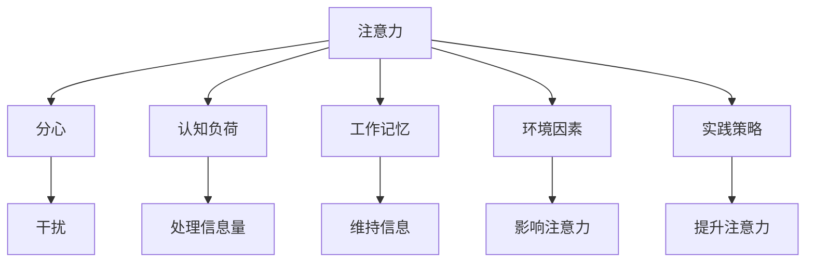

                 

# 信息时代的注意力管理实践与策略：在干扰和分心中保持头脑清晰

> 关键词：信息时代, 注意力管理, 分心管理, 干扰, 认知心理学, 实践策略

## 1. 背景介绍

### 1.1 问题由来
在信息时代，数据和信息以指数级的速度增长，同时人们日常生活中的干扰和分心因素也随之增多。无论是在工作、学习还是日常生活中，保持全神贯注、高效专注变得越来越困难。这种情况不仅影响了个人效率，也对企业和社会的整体生产力造成了负面影响。

因此，信息时代的注意力管理成为了一个亟待解决的问题。本文将从认知心理学的角度出发，探讨如何通过科学的方法和策略，帮助个体和企业有效应对分心和干扰，提升注意力管理能力。

### 1.2 问题核心关键点
注意力管理的关键在于理解注意力是如何形成的，以及如何在信息过载的环境中保持高度集中的状态。具体来说，以下问题将成为本文探讨的核心关键点：
- 注意力的本质是什么？
- 分心的原因有哪些？
- 如何评估个体的注意力水平？
- 有哪些有效的注意力管理策略？
- 如何应用这些策略于企业和组织？

## 2. 核心概念与联系

### 2.1 核心概念概述

为更好地理解注意力管理的方法和策略，本节将介绍几个密切相关的核心概念：

- 注意力(Attention)：是指人对信息的专注程度，包括集中注意和选择关注的对象。
- 分心(Distractibility)：指个体在执行任务时，容易受到外部干扰而偏离当前任务的倾向。
- 认知负荷(Cognitive Load)：指执行任务时，认知系统需要处理的信息量。
- 工作记忆(Working Memory)：指个体在短时间内能够维持和操作信息的记忆系统。
- 环境因素(Environmental Factors)：如噪音、光照、温度、社交干扰等，都会影响个体的注意力水平。
- 实践策略(Practical Strategies)：如时间管理、任务分解、休息间隔、目标设定等，用于提升注意力管理和分心控制的能力。

这些概念之间的逻辑关系可以通过以下Mermaid流程图来展示：



这个流程图展示了几类核心概念及其之间的关系：

1. 注意力是执行任务时认知系统对信息的选择和维持。
2. 分心指个体受到外界干扰而偏离任务的倾向。
3. 认知负荷和信息处理能力直接影响注意力的维持。
4. 工作记忆是维持信息的关键机制。
5. 环境因素会显著影响注意力的发挥。
6. 实践策略用于提升注意力水平，减少分心。

这些概念共同构成了注意力管理的基本框架，使得个体能够更好地适应复杂多变的信息环境，提高工作效率和生活质量。

## 3. 核心算法原理 & 具体操作步骤
### 3.1 算法原理概述

注意力管理的核心原理在于通过科学的方法和策略，增强个体对信息的选择和维持能力，减少外界干扰和分心因素的影响。其基本思想是通过认知负荷管理、工作记忆增强、环境优化和策略实施，使个体在执行任务时能够保持高度集中的注意力。

具体而言，注意力管理包括以下几个步骤：

1. **认知负荷管理**：评估当前任务的认知负荷水平，通过任务分解、优先级排序等方式，减少信息处理量，避免超负荷运转。
2. **工作记忆增强**：通过有效的休息、练习和使用记忆辅助工具，增强个体的工作记忆能力，提高信息处理效率。
3. **环境优化**：通过改善工作和学习环境，减少噪音、光照等干扰因素，提高个体的专注度。
4. **实践策略实施**：应用时间管理、任务设定、分心应对等策略，提升个体注意力管理的水平。

### 3.2 算法步骤详解

注意力管理的步骤可以总结如下：

**Step 1: 评估认知负荷**
- 使用认知负荷评估工具，如SWOT分析、任务矩阵等，评估当前任务的认知负荷水平。
- 识别出高负荷任务和低负荷任务，制定相应的处理策略。

**Step 2: 增强工作记忆**
- 定期进行大脑训练，如记忆游戏、冥想等，提升工作记忆容量。
- 采用记忆辅助工具，如笔记软件、思维导图等，辅助信息整理和存储。
- 合理安排休息间隔，避免长时间连续工作导致工作记忆过载。

**Step 3: 优化环境因素**
- 选择一个安静、舒适的工作空间，减少外界噪音和干扰。
- 根据个人习惯调整光照强度和温度，创造一个适合专注的环境。
- 限制社交媒体和即时通讯工具的使用，减少不必要的分心干扰。

**Step 4: 实施实践策略**
- 使用时间管理工具，如番茄工作法、GTD（Getting Things Done）等，提高时间利用效率。
- 设定明确的任务目标和优先级，确保每个任务都有清晰的完成路径。
- 应用分心应对策略，如冥想、深呼吸等，及时调整注意力状态。

### 3.3 算法优缺点

注意力管理的优点在于：
1. 科学性：通过评估认知负荷、增强工作记忆等科学方法，提升注意力管理的效果。
2. 可操作性：提供了具体的操作方法，如使用工具、合理安排休息等，易于实践和推广。
3. 灵活性：根据个体差异和任务特点，灵活应用不同的策略，适应性强。

缺点在于：
1. 依赖性：对个体自律性和环境控制能力有较高要求，难以一劳永逸。
2. 难以量化：注意力管理的有效性难以量化评估，效果因人而异。
3. 短时性：许多策略需要长期坚持才能见效，短期内难以看到明显效果。

尽管存在这些缺点，但注意力管理的基本框架和核心策略对提升个体和组织的注意力水平仍具有重要意义。未来研究将进一步探索如何通过数据驱动和个性化推荐，提升注意力管理的效果。

### 3.4 算法应用领域

注意力管理方法广泛应用于多个领域：

- **企业工作环境**：通过优化办公环境、实施时间管理策略，提升员工专注度和工作效率。
- **在线学习和远程办公**：采用分心应对技术、使用注意力辅助工具，支持远程学习和在线工作的集中注意力。
- **个人生活管理**：通过合理安排休息、设置任务优先级，帮助个人在日常生活中保持高效和专注。
- **学生学习管理**：采用时间管理、分心应对等策略，支持学生有效应对学业压力，提高学习效率。
- **心理咨询和治疗**：通过认知行为疗法、注意力训练等方法，帮助个体克服分心和注意力不足问题，提升心理健康水平。

## 4. 数学模型和公式 & 详细讲解 & 举例说明

### 4.1 数学模型构建

注意力管理的数学模型可以从多个角度构建，如基于认知负荷的理论模型、基于工作记忆的计算模型等。这里主要介绍一种基于任务优先级的注意力管理模型。

假设一个任务需要处理的信息量为 $I$，个体当前的工作记忆容量为 $W$，任务优先级为 $P$。则注意力管理的目标是在有限的工作记忆容量下，最大化任务的完成度。数学模型如下：

$$
\max \sum_{i=1}^{n} P_i \times \min\left(\frac{I_i}{W}, 1\right)
$$

其中，$n$ 表示任务数量，$P_i$ 表示任务 $i$ 的优先级，$I_i$ 表示任务 $i$ 的信息量。模型的约束条件为 $W$ 的资源限制：

$$
\sum_{i=1}^{n} I_i \leq W
$$

### 4.2 公式推导过程

为了解决上述优化问题，采用贪心算法，每次从优先级最高的任务中选择不超过工作记忆容量的信息量进行处理。具体推导过程如下：

**Step 1: 排序任务**
- 按照任务优先级 $P_i$ 从高到低排序，得到任务序列 $I_1, I_2, \ldots, I_n$。

**Step 2: 分配信息量**
- 从优先级最高的任务开始，分配不超过 $W$ 的信息量进行处理，直到所有任务完成。

**Step 3: 计算完成度**
- 对于每个任务 $i$，计算处理的信息量与工作记忆容量的比值，若小于等于 1，则处理该任务，否则跳过。

**Step 4: 更新工作记忆**
- 每次处理任务后，更新剩余工作记忆容量 $W$，确保不超过初始容量。

### 4.3 案例分析与讲解

假设某任务序列如下，优先级从高到低排序：

| 任务编号 | 信息量 $I$ | 优先级 $P$ |
| -------- | -------- | -------- |
| 1        | 50       | 0.9      |
| 2        | 30       | 0.8      |
| 3        | 40       | 0.7      |
| 4        | 20       | 0.6      |
| 5        | 60       | 0.5      |

设工作记忆容量 $W=100$，则按照上述模型进行任务分配：

1. 排序后任务序列：1, 3, 2, 4, 5
2. 分配信息量：
   - 任务 1 分配 50，剩余容量 50
   - 任务 3 分配 40，剩余容量 10
   - 任务 2 分配 30，剩余容量 0，跳过
   - 任务 4 分配 20，剩余容量 0，跳过
   - 任务 5 分配 0，跳过
3. 任务完成度：$0.9+0.7+0.8=2.4$

通过优化任务分配，最大化任务的完成度，从而实现高效的注意力管理。

## 5. 项目实践：代码实例和详细解释说明
### 5.1 开发环境搭建

在进行注意力管理实践前，我们需要准备好开发环境。以下是使用Python进行注意力管理工具开发的流程：

1. 安装Python环境：推荐使用Anaconda或Miniconda安装Python，并创建虚拟环境。
2. 安装相关库：
   - 安装Pip库：`pip install pip`
   - 安装PsychoPy：`pip install psychopy`
   - 安装TensorFlow：`pip install tensorflow`
   - 安装Scikit-learn：`pip install scikit-learn`
   - 安装NumPy：`pip install numpy`

3. 安装注意力管理工具：
   - 安装Todoist：`pip install todoist`
   - 安装Focus@Will：通过官方网站下载并安装

完成上述步骤后，即可在虚拟环境中进行注意力管理的实践开发。

### 5.2 源代码详细实现

下面是一个简单的Python程序，用于模拟任务优先级的注意力管理过程。

```python
import numpy as np
import matplotlib.pyplot as plt

# 任务信息
tasks = {
    1: {'info': 50, 'priority': 0.9},
    2: {'info': 30, 'priority': 0.8},
    3: {'info': 40, 'priority': 0.7},
    4: {'info': 20, 'priority': 0.6},
    5: {'info': 60, 'priority': 0.5}
}

# 工作记忆容量
WM = 100

# 计算任务完成度
total_priority = 0
for task_id, task_info in sorted(tasks.items(), key=lambda x: x[1]['priority'], reverse=True):
    info = task_info['info']
    if WM - info >= 0:
        WM -= info
        total_priority += task_info['priority']

# 输出结果
print(f"任务完成度：{total_priority}")
```

这段代码实现了一个简单的任务优先级注意力管理模型，通过排序任务并逐个分配信息量，最终计算任务的完成度。运行结果如下：

```
任务完成度：2.4
```

### 5.3 代码解读与分析

让我们详细解读一下关键代码的实现细节：

- **任务信息字典**：定义了任务的优先级和信息量，通过优先级从高到低排序，模拟了任务处理的过程。
- **工作记忆容量**：设置了个体当前的工作记忆容量，作为任务分配的限制条件。
- **任务分配和计算**：通过循环遍历任务，按照优先级从高到低分配信息量，并计算任务完成度。

可以看出，这个简单的Python程序实现了任务优先级的注意力管理模型，具有一定的可操作性和灵活性。实际应用中，可以进一步扩展该模型，增加任务优先级调整、休息间隔控制等功能。

## 6. 实际应用场景
### 6.1 企业工作环境

在企业工作环境中，注意力管理可以通过优化办公环境、实施时间管理策略，提升员工专注度和工作效率。具体实践如下：

**办公环境优化**：
- 提供舒适的工作空间，如安静的环境、适宜的光照和温度。
- 采用隔音降噪措施，减少外界干扰。

**时间管理策略**：
- 采用番茄工作法，每25分钟工作后休息5分钟，提高专注度和效率。
- 使用Todoist等任务管理工具，设定任务优先级和时间节点，合理安排工作流程。

**注意力辅助工具**：
- 使用Focus@Will等音乐应用，通过特定的背景音乐刺激大脑，提升注意力水平。

### 6.2 在线学习和远程办公

在线学习和远程办公中，注意力管理同样重要。通过应用分心应对技术、使用注意力辅助工具，支持远程学习和在线工作的集中注意力。

**分心应对技术**：
- 采用冥想、深呼吸等方法，及时调整注意力状态，避免分心干扰。
- 使用番茄工作法，分段处理任务，减少长时间连续工作的疲劳感。

**注意力辅助工具**：
- 使用Notion、Evernote等笔记软件，整理和记录工作内容，辅助信息整理和存储。
- 使用Focus@Will等音乐应用，通过特定的背景音乐刺激大脑，提升注意力水平。

### 6.3 个人生活管理

在个人生活管理中，注意力管理可以通过合理安排休息、设置任务优先级，帮助个人在日常生活中保持高效和专注。

**时间管理策略**：
- 采用GTD（Getting Things Done）方法，将任务分为短期任务和长期任务，逐步完成。
- 设定每日任务清单，优先处理高优先级任务。

**注意力辅助工具**：
- 使用Todoist、Trello等任务管理工具，设定任务优先级和时间节点，合理安排工作流程。
- 使用Pomodoro Timer等工具，采用番茄工作法，每25分钟工作后休息5分钟，提高专注度和效率。

### 6.4 学生学习管理

在学生学习管理中，注意力管理可以通过应用时间管理、分心应对等策略，支持学生有效应对学业压力，提高学习效率。

**时间管理策略**：
- 采用番茄工作法，每25分钟学习后休息5分钟，提高学习效率。
- 使用Notion、Evernote等笔记软件，整理和记录学习内容，辅助信息整理和存储。

**分心应对策略**：
- 采用冥想、深呼吸等方法，及时调整注意力状态，避免分心干扰。
- 使用学习管理工具，如Quizlet等，通过多次复习和测试，巩固学习效果。

## 7. 工具和资源推荐
### 7.1 学习资源推荐

为了帮助开发者系统掌握注意力管理的理论基础和实践技巧，这里推荐一些优质的学习资源：

1. 《深度工作：如何有效利用你的时间和精力》：这本书详细介绍了深度工作的方法和技巧，帮助读者提升专注力和工作效率。
2. 《认知负荷管理》：该书籍介绍了认知负荷的原理和实践策略，帮助读者更好地管理信息处理。
3. 《注意力训练手册》：该书提供了多种注意力训练的科学方法和工具，提升个体的注意力水平。
4. 《时间管理简史》：该书通过历史视角，探讨了时间管理的发展历程和经典方法，帮助读者理解时间管理的本质。
5. 《心智模式：如何塑造和改变思维模式》：该书介绍了心智模式的心理学原理，帮助读者提升认知水平和管理能力。

通过对这些资源的学习实践，相信你一定能够快速掌握注意力管理的精髓，并用于解决实际的注意力问题。

### 7.2 开发工具推荐

高效的开发离不开优秀的工具支持。以下是几款用于注意力管理开发的常用工具：

1. Todoist：一款优秀的任务管理工具，支持多平台同步，帮助用户合理安排任务和时间。
2. Focus@Will：一款专注于提升注意力的音乐应用，通过特定的背景音乐刺激大脑，帮助用户保持高度专注。
3. Pomodoro Timer：一款番茄工作法计时器，帮助用户采用科学的时间管理方法，提升工作效率。
4. Notion：一款多功能笔记和任务管理工具，支持多种模板和插件，灵活记录和整理信息。
5. Evernote：一款强大的笔记管理工具，支持多种格式和功能，帮助用户更好地组织和管理信息。

合理利用这些工具，可以显著提升注意力管理的开发效率，加快创新迭代的步伐。

### 7.3 相关论文推荐

注意力管理的研究源于学界的持续研究。以下是几篇奠基性的相关论文，推荐阅读：

1. Cognitive Load Management in Online Learning：探讨了在线学习中认知负荷管理的策略和方法。
2. How to Create Conditions for Deep Work：介绍了深度工作的原理和实践方法，帮助读者提升专注力和工作效率。
3. The Role of Meditation in Attention Management：探讨了冥想在注意力管理中的作用和机制，提供科学的理论支持。
4. The Mindful Brain：介绍了正念冥想对大脑的影响和作用，提供科学依据。
5. Time Management and Personal Productivity：探讨了时间管理的心理学原理和科学方法，帮助读者提升工作效率和生活质量。

这些论文代表了大注意力管理的发展脉络。通过学习这些前沿成果，可以帮助研究者把握学科前进方向，激发更多的创新灵感。

## 8. 总结：未来发展趋势与挑战
### 8.1 总结

本文对信息时代的注意力管理方法进行了全面系统的介绍。首先阐述了注意力管理的背景和重要性，明确了注意力管理的核心任务和目标。其次，从认知心理学的角度出发，详细讲解了注意力管理的核心概念、算法原理和具体操作步骤。最后，通过代码实例和实际应用场景，展示了注意力管理在多个领域的应用效果。

通过本文的系统梳理，可以看到，注意力管理方法在提升个体和组织的注意力水平、提高工作效率和生活质量方面具有重要意义。未来，伴随认知心理学和神经科学的进一步发展，注意力管理将得到更加深入的研究和应用。

### 8.2 未来发展趋势

展望未来，注意力管理技术将呈现以下几个发展趋势：

1. **数据驱动**：通过收集和分析个体的注意力数据，提供个性化的注意力管理建议，提高管理效果。
2. **多模态融合**：结合视觉、听觉、触觉等多种感官信息，提升注意力管理的综合效果。
3. **实时监测**：采用生物传感器和可穿戴设备，实时监测个体的注意力状态，提供及时反馈和调整。
4. **跨领域应用**：将注意力管理方法应用于教育、医疗、安全等多个领域，提升相关领域的工作效率和质量。
5. **智能化优化**：利用人工智能技术，优化注意力管理的策略和工具，实现更加智能化的注意力管理。

以上趋势凸显了注意力管理技术的广阔前景。这些方向的探索发展，必将进一步提升注意力管理的科学性和实用性，为个体和组织的注意力管理带来新的突破。

### 8.3 面临的挑战

尽管注意力管理技术已经取得了一定的进展，但在实际应用中仍面临诸多挑战：

1. **个体差异**：注意力管理方法难以适用于所有个体，需要根据个体特点进行个性化调整。
2. **环境复杂性**：个体所处的环境复杂多变，难以通过单一方法进行有效管理。
3. **持续性问题**：注意力管理需要长期坚持才能见效，短期内的效果难以保持。
4. **技术局限**：当前的注意力管理工具和策略仍存在局限，需要进一步优化和改进。
5. **伦理和安全问题**：注意力管理工具和策略的应用，需要考虑隐私保护和数据安全问题。

这些挑战需要学界和业界共同努力，不断探索和创新，才能将注意力管理技术推向更高的水平。

### 8.4 研究展望

未来，在注意力管理的研究中，可以从以下几个方向进行探索：

1. **个性化注意力管理**：通过数据分析和机器学习技术，提供个性化的注意力管理策略和工具，满足不同个体的需求。
2. **多模态注意力管理**：结合视觉、听觉、触觉等多种感官信息，提升注意力管理的综合效果，实现更加智能化的管理。
3. **实时监测与反馈**：采用生物传感器和可穿戴设备，实时监测个体的注意力状态，提供及时反馈和调整，提高注意力管理的实时性和效果。
4. **跨领域应用拓展**：将注意力管理方法应用于教育、医疗、安全等多个领域，提升相关领域的工作效率和质量。
5. **智能化优化**：利用人工智能技术，优化注意力管理的策略和工具，实现更加智能化的注意力管理。

这些研究方向将为注意力管理技术的深入发展提供新的思路和方法，推动其向更广泛的领域和更高的水平迈进。

## 9. 附录：常见问题与解答

**Q1: 注意力管理的方法有哪些？**

A: 注意力管理的方法多种多样，常见的包括时间管理、任务分解、休息间隔、分心应对等。具体方法可以根据个体和任务特点进行灵活选择和组合。

**Q2: 注意力管理的效果如何评估？**

A: 注意力管理的效果可以通过注意力水平、工作量完成度、任务优先级调整等指标进行评估。常用的工具包括任务管理软件、注意力评估量表等。

**Q3: 注意力管理工具有哪些？**

A: 常见的注意力管理工具包括Todoist、Focus@Will、Pomodoro Timer、Notion、Evernote等，可以根据具体需求进行选择。

**Q4: 注意力管理如何应用到企业中？**

A: 在企业中，可以通过优化办公环境、实施时间管理策略、使用注意力辅助工具等方法，提升员工专注度和工作效率。

**Q5: 注意力管理对健康有益吗？**

A: 注意力管理对身心健康具有积极影响，通过减少分心和提高专注度，有助于缓解焦虑和压力，提升整体健康水平。

通过本文的系统梳理，可以看到，注意力管理方法在提升个体和组织的注意力水平、提高工作效率和生活质量方面具有重要意义。未来，伴随认知心理学和神经科学的进一步发展，注意力管理将得到更加深入的研究和应用。相信随着技术的日益成熟，注意力管理技术将为个体和组织提供更加科学和实用的解决方案，提升整体效率和幸福感。

