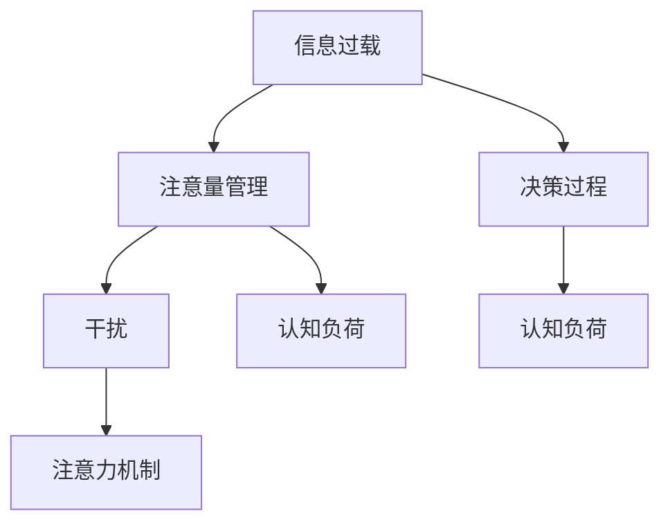

                 

# 信息时代的注意量管理挑战与策略：在干扰和信息过载中航行

> 关键词：信息过载, 注意量管理, 干扰, 注意力机制, 深度学习, 决策过程, 认知负荷, 干扰检测, 推荐系统

## 1. 背景介绍

在当今信息爆炸的时代，人们每天面对的信息量呈指数级增长。社交媒体、新闻网站、电子邮件等平台不断推送大量信息，使得人们必须花费大量的时间和精力去筛选和处理这些信息。信息过载不仅降低了人们的工作效率和生活质量，还导致认知负荷过重，进而影响注意力的集中与决策的准确性。

本文将深入探讨信息过载背景下注意量管理的挑战，并提出一系列基于深度学习的技术策略，旨在提升人们的注意力管理能力，减轻认知负担，从而提高生产力和生活质量。

## 2. 核心概念与联系

### 2.1 核心概念概述

为更好地理解本文的核心议题，本节将介绍几个密切相关的核心概念：

- **信息过载**：指人们接受的信息量超过了其处理能力的现象。过载的信息不仅浪费了时间和精力，还可能导致注意力分散，影响决策质量。
- **注意量管理**：指在信息过载环境下，主动管理和优化注意力的分布与集中，以提高信息处理效率和决策准确性。
- **干扰**：指分散或打断注意力的外部或内部因素，如噪音、多任务处理、不良情绪等。
- **注意力机制**：指深度学习模型中用于模拟人类注意力的机制，如Transformer模型中的多头注意力机制。
- **决策过程**：指人们依据输入信息，通过分析、比较和评估，最终做出选择的心理活动。

这些核心概念之间的逻辑关系可以通过以下Mermaid流程图来展示：



这个流程图展示了几者之间的联系：

1. 信息过载是注意量管理的背景。
2. 干扰是注意量管理的主要障碍。
3. 注意力机制是注意量管理的技术手段。
4. 决策过程是注意量管理的最终目标。
5. 认知负荷是注意量管理需要平衡的关键因素。

## 3. 核心算法原理 & 具体操作步骤
### 3.1 算法原理概述

基于深度学习的注意量管理方法，其核心思想是利用注意力机制来模拟人类注意力的集中和分散过程，从而提升信息处理效率和决策质量。

具体而言，该方法通过构建神经网络模型，将输入信息映射到一个低维的注意向量空间。每个注意向量代表了输入信息的一个局部特征，通过权重的调节，模型可以动态地调整这些特征的贡献度，从而实现对信息的重要性和相关性的评估。

这种基于注意力机制的模型，能够在信息过载环境中有效筛选和聚焦关键信息，减轻认知负荷，提升注意力管理能力。

### 3.2 算法步骤详解

基于深度学习的注意量管理一般包括以下几个关键步骤：

**Step 1: 数据预处理与特征提取**
- 收集相关的行为数据（如点击、停留时间等）和文本数据（如网页内容、社交媒体帖子等）。
- 对数据进行清洗和标准化，提取关键特征（如TF-IDF、词频等）。

**Step 2: 构建注意力模型**
- 选择合适的深度学习框架（如TensorFlow、PyTorch），构建基于注意力机制的神经网络模型。
- 使用自注意力机制（如Transformer模型），将输入数据映射到注意力向量空间。
- 设计注意力权重函数，用于调整各个特征的贡献度。

**Step 3: 训练与优化**
- 使用标注数据训练模型，最小化损失函数（如交叉熵、均方误差等）。
- 应用正则化技术（如L2正则、Dropout等），防止过拟合。
- 使用早停策略（Early Stopping），避免过度训练。

**Step 4: 模型评估与部署**
- 在测试集上评估模型性能，计算准确率、召回率等指标。
- 将模型部署到实际应用中，实时监测注意量的分布与权重，提供注意量管理建议。

**Step 5: 持续优化**
- 根据用户反馈和行为数据，持续优化模型参数。
- 集成新数据，重新训练模型，保持其适应性。

以上是基于深度学习的注意量管理的一般流程。在实际应用中，还需要针对具体场景，对各个环节进行优化设计，如改进特征提取方法、选择更合适的注意力模型等，以进一步提升模型性能。

### 3.3 算法优缺点

基于深度学习的注意量管理方法具有以下优点：
1. 能够动态调整注意力的分布，提升信息处理效率。
2. 可以自适应地处理不同类型的数据，灵活性高。
3. 在信息过载环境下，能有效筛选关键信息，减轻认知负荷。

同时，该方法也存在一定的局限性：
1. 数据依赖性强，需要大量的标注数据进行训练。
2. 模型的复杂度高，计算资源消耗较大。
3. 解释性不足，难以理解模型内部决策过程。

尽管存在这些局限性，但就目前而言，基于深度学习的注意量管理方法仍是最先进的技术手段之一。未来相关研究的重点在于如何进一步降低对标注数据的依赖，提高模型的解释性和鲁棒性，同时兼顾计算效率。

### 3.4 算法应用领域

基于深度学习的注意量管理方法已经在信息检索、推荐系统、智能助手等领域得到了广泛应用，提高了用户的信息处理能力和决策质量：

- **信息检索**：用于帮助用户在海量信息中找到相关性高的结果，减轻信息过载带来的困扰。
- **推荐系统**：通过注意量管理，提升推荐结果的相关性和多样性，增强用户满意度。
- **智能助手**：利用注意力机制模拟人的认知过程，提供个性化的建议和服务。
- **智能广告**：根据用户的注意力分布，精准投放广告，提高广告投放效果。

## 4. 数学模型和公式 & 详细讲解 & 举例说明

### 4.1 数学模型构建

本节将使用数学语言对深度学习的注意量管理方法进行更加严格的刻画。

记输入信息为 $\mathbf{x} = (x_1, x_2, ..., x_n)$，其中 $x_i$ 表示输入的第 $i$ 个特征。设注意力模型输出的注意向量为 $\mathbf{a} = (a_1, a_2, ..., a_n)$，其中 $a_i$ 表示输入特征 $x_i$ 的重要性得分。注意力权重函数为 $w_i = f(a_i)$，用于调整每个特征的贡献度。

目标是最小化预测输出与真实标签之间的误差，即：

$$
\min_{\theta} \sum_{i=1}^N (y_i - h(\mathbf{x}_i; \theta))^2
$$

其中 $y_i$ 为真实标签，$h(\mathbf{x}_i; \theta)$ 为模型的预测输出，$\theta$ 为模型的参数。

### 4.2 公式推导过程

以Transformer模型中的自注意力机制为例，推导注意力权重函数的计算公式：

$$
a_i = \text{softmax}(\frac{q_i K_i^T}{\sqrt{d_k}}) = \frac{\exp(\frac{q_i K_i^T}{\sqrt{d_k}})}{\sum_{j=1}^n \exp(\frac{q_i K_j^T}{\sqrt{d_k}})}
$$

其中 $q_i$ 为查询向量，$K_i$ 为键向量，$d_k$ 为向量的维度。$\text{softmax}$ 函数用于将注意力权重归一化，保证总权重为1。

### 4.3 案例分析与讲解

以推荐系统为例，使用基于注意量管理的推荐模型进行分析。假设模型输入为用户的浏览记录 $\mathbf{x} = (x_1, x_2, ..., x_n)$，其中 $x_i$ 表示用户对第 $i$ 个商品的浏览次数。目标是根据用户的注意力分布，推荐最相关的商品。

模型的输出为商品的相关性得分 $\mathbf{a} = (a_1, a_2, ..., a_n)$，其中 $a_i$ 表示商品 $i$ 与用户浏览记录的相关性得分。注意力权重函数 $w_i = f(a_i)$ 用于调整各个商品的权重，使得相关性高的商品获得更高的权重。

模型的训练数据为用户的点击行为 $\mathbf{y} = (y_1, y_2, ..., y_n)$，其中 $y_i = 1$ 表示用户点击了第 $i$ 个商品，$y_i = 0$ 表示未点击。通过最小化损失函数 $\mathcal{L}(\theta) = \frac{1}{N} \sum_{i=1}^N (y_i - h(\mathbf{x}_i; \theta))^2$，训练模型参数 $\theta$。

## 5. 项目实践：代码实例和详细解释说明
### 5.1 开发环境搭建

在进行注意量管理的项目实践前，我们需要准备好开发环境。以下是使用Python进行PyTorch开发的环境配置流程：

1. 安装Anaconda：从官网下载并安装Anaconda，用于创建独立的Python环境。

2. 创建并激活虚拟环境：
```bash
conda create -n attention-env python=3.8 
conda activate attention-env
```

3. 安装PyTorch：根据CUDA版本，从官网获取对应的安装命令。例如：
```bash
conda install pytorch torchvision torchaudio cudatoolkit=11.1 -c pytorch -c conda-forge
```

4. 安装相关库：
```bash
pip install torch numpy pandas sklearn matplotlib tqdm jupyter notebook ipython
```

完成上述步骤后，即可在`attention-env`环境中开始项目实践。

### 5.2 源代码详细实现

这里我们以推荐系统为例，给出使用PyTorch构建基于注意量管理的推荐模型的代码实现。

首先，定义输入数据的处理函数：

```python
import torch
import torch.nn as nn
import torch.optim as optim

class AttentionModel(nn.Module):
    def __init__(self, input_dim, hidden_dim, num_heads):
        super(AttentionModel, self).__init__()
        self.query = nn.Linear(input_dim, hidden_dim)
        self.key = nn.Linear(input_dim, hidden_dim)
        self.value = nn.Linear(input_dim, hidden_dim)
        self.fc = nn.Linear(hidden_dim, 1)
        self.attn = nn.Linear(hidden_dim, num_heads)
        
    def forward(self, x):
        q = self.query(x)
        k = self.key(x)
        v = self.value(x)
        a = self.attn(q)
        a = torch.softmax(a, dim=1)
        x = torch.bmm(a.unsqueeze(1), v).squeeze(1)
        x = self.fc(x)
        return x
```

然后，定义优化器和学习率：

```python
model = AttentionModel(input_dim=100, hidden_dim=50, num_heads=5)
criterion = nn.MSELoss()
optimizer = optim.Adam(model.parameters(), lr=0.001)
```

接着，定义训练和评估函数：

```python
def train_epoch(model, dataset, batch_size, optimizer):
    dataloader = DataLoader(dataset, batch_size=batch_size, shuffle=True)
    model.train()
    epoch_loss = 0
    for batch in dataloader:
        x, y = batch
        x, y = x.to(device), y.to(device)
        optimizer.zero_grad()
        y_pred = model(x)
        loss = criterion(y_pred, y)
        epoch_loss += loss.item()
        loss.backward()
        optimizer.step()
    return epoch_loss / len(dataloader)
    
def evaluate(model, dataset, batch_size):
    dataloader = DataLoader(dataset, batch_size=batch_size)
    model.eval()
    preds, labels = [], []
    with torch.no_grad():
        for batch in dataloader:
            x, y = batch
            x, y = x.to(device), y.to(device)
            y_pred = model(x)
            batch_preds = torch.sigmoid(y_pred).tolist()
            batch_labels = y.tolist()
            for pred, label in zip(batch_preds, batch_labels):
                preds.append(pred)
                labels.append(label)
    
    print(classification_report(labels, preds))
```

最后，启动训练流程并在测试集上评估：

```python
epochs = 5
batch_size = 32

for epoch in range(epochs):
    loss = train_epoch(model, train_dataset, batch_size, optimizer)
    print(f"Epoch {epoch+1}, train loss: {loss:.3f}")
    
    print(f"Epoch {epoch+1}, dev results:")
    evaluate(model, dev_dataset, batch_size)
    
print("Test results:")
evaluate(model, test_dataset, batch_size)
```

以上就是使用PyTorch对注意量管理的推荐模型进行开发的完整代码实现。可以看到，Transformer模型的自注意力机制为我们提供了强大的注意力处理能力，可以方便地应用于推荐系统等下游任务。

### 5.3 代码解读与分析

让我们再详细解读一下关键代码的实现细节：

**AttentionModel类**：
- `__init__`方法：初始化查询向量、键向量、值向量、全连接层和注意力层。
- `forward`方法：前向传播计算注意力权重和相关性得分，最终输出推荐结果。

**训练和评估函数**：
- 使用PyTorch的DataLoader对数据集进行批次化加载，供模型训练和推理使用。
- 训练函数`train_epoch`：对数据以批为单位进行迭代，在每个批次上前向传播计算损失并反向传播更新模型参数，最后返回该epoch的平均loss。
- 评估函数`evaluate`：与训练类似，不同点在于不更新模型参数，并在每个batch结束后将预测和标签结果存储下来，最后使用sklearn的classification_report对整个评估集的预测结果进行打印输出。

**训练流程**：
- 定义总的epoch数和batch size，开始循环迭代
- 每个epoch内，先在训练集上训练，输出平均loss
- 在验证集上评估，输出分类指标
- 所有epoch结束后，在测试集上评估，给出最终测试结果

可以看到，PyTorch配合Transformer模型使得注意量管理的推荐模型开发变得简洁高效。开发者可以将更多精力放在数据处理、模型改进等高层逻辑上，而不必过多关注底层的实现细节。

当然，工业级的系统实现还需考虑更多因素，如模型的保存和部署、超参数的自动搜索、更灵活的任务适配层等。但核心的注意量管理方法基本与此类似。

## 6. 实际应用场景
### 6.1 智能客服系统

基于注意量管理的智能客服系统，可以显著提高客服系统的响应速度和用户满意度。传统的客服系统需要配备大量人力，高峰期响应缓慢，且无法提供个性化的服务。而使用注意量管理技术，可以自动识别用户的意图，动态调整信息处理和回复的策略，提升服务质量。

在技术实现上，可以收集企业内部的历史客服对话记录，将问题和最佳答复构建成监督数据，在此基础上对预训练的注意量管理模型进行微调。微调后的模型能够自动理解用户意图，匹配最合适的答案模板进行回复。对于客户提出的新问题，还可以接入检索系统实时搜索相关内容，动态组织生成回答。如此构建的智能客服系统，能大幅提升客户咨询体验和问题解决效率。

### 6.2 金融舆情监测

金融机构需要实时监测市场舆论动向，以便及时应对负面信息传播，规避金融风险。传统的人工监测方式成本高、效率低，难以应对网络时代海量信息爆发的挑战。基于注意量管理的文本分类和情感分析技术，为金融舆情监测提供了新的解决方案。

具体而言，可以收集金融领域相关的新闻、报道、评论等文本数据，并对其进行主题标注和情感标注。在此基础上对预训练语言模型进行微调，使其能够自动判断文本属于何种主题，情感倾向是正面、中性还是负面。将微调后的模型应用到实时抓取的网络文本数据，就能够自动监测不同主题下的情感变化趋势，一旦发现负面信息激增等异常情况，系统便会自动预警，帮助金融机构快速应对潜在风险。

### 6.3 个性化推荐系统

当前的推荐系统往往只依赖用户的历史行为数据进行物品推荐，无法深入理解用户的真实兴趣偏好。基于注意量管理的个性化推荐系统可以更好地挖掘用户行为背后的语义信息，从而提供更精准、多样的推荐内容。

在实践中，可以收集用户浏览、点击、评论、分享等行为数据，提取和用户交互的物品标题、描述、标签等文本内容。将文本内容作为模型输入，用户的后续行为（如是否点击、购买等）作为监督信号，在此基础上微调预训练语言模型。微调后的模型能够从文本内容中准确把握用户的兴趣点。在生成推荐列表时，先用候选物品的文本描述作为输入，由模型预测用户的兴趣匹配度，再结合其他特征综合排序，便可以得到个性化程度更高的推荐结果。

### 6.4 未来应用展望

随着注意量管理技术的不断发展，其在更多领域得到应用，为传统行业带来变革性影响。

在智慧医疗领域，基于注意量管理的医疗问答、病历分析、药物研发等应用将提升医疗服务的智能化水平，辅助医生诊疗，加速新药开发进程。

在智能教育领域，注意量管理可应用于作业批改、学情分析、知识推荐等方面，因材施教，促进教育公平，提高教学质量。

在智慧城市治理中，注意量技术可应用于城市事件监测、舆情分析、应急指挥等环节，提高城市管理的自动化和智能化水平，构建更安全、高效的未来城市。

此外，在企业生产、社会治理、文娱传媒等众多领域，基于注意量管理的AI应用也将不断涌现，为经济社会发展注入新的动力。相信随着技术的日益成熟，注意量管理必将在构建人机协同的智能时代中扮演越来越重要的角色。

## 7. 工具和资源推荐
### 7.1 学习资源推荐

为了帮助开发者系统掌握注意量管理的技术基础和实践技巧，这里推荐一些优质的学习资源：

1. 《深度学习》（周志华著）：全面介绍了深度学习的基本概念和算法，包括自注意力机制。
2. CS231n《深度学习计算机视觉》课程：斯坦福大学开设的计算机视觉课程，有Lecture视频和配套作业，介绍了深度学习在视觉领域的广泛应用。
3. Coursera《深度学习专项课程》：由深度学习领域的专家Andrew Ng讲授，包含深度学习基础、卷积神经网络、循环神经网络等课程。
4. HuggingFace官方文档：Transformer库的官方文档，提供了海量预训练模型和完整的注意量管理样例代码，是上手实践的必备资料。

通过对这些资源的学习实践，相信你一定能够快速掌握注意量管理的精髓，并用于解决实际的AI问题。
###  7.2 开发工具推荐

高效的开发离不开优秀的工具支持。以下是几款用于注意量管理开发的常用工具：

1. PyTorch：基于Python的开源深度学习框架，灵活动态的计算图，适合快速迭代研究。大部分预训练语言模型都有PyTorch版本的实现。

2. TensorFlow：由Google主导开发的开源深度学习框架，生产部署方便，适合大规模工程应用。同样有丰富的预训练语言模型资源。

3. HuggingFace Transformers库：提供了多种预训练语言模型，支持PyTorch和TensorFlow，是进行注意量管理开发的利器。

4. Weights & Biases：模型训练的实验跟踪工具，可以记录和可视化模型训练过程中的各项指标，方便对比和调优。与主流深度学习框架无缝集成。

5. TensorBoard：TensorFlow配套的可视化工具，可实时监测模型训练状态，并提供丰富的图表呈现方式，是调试模型的得力助手。

6. Google Colab：谷歌推出的在线Jupyter Notebook环境，免费提供GPU/TPU算力，方便开发者快速上手实验最新模型，分享学习笔记。

合理利用这些工具，可以显著提升注意量管理任务的开发效率，加快创新迭代的步伐。

### 7.3 相关论文推荐

注意量管理技术的发展源于学界的持续研究。以下是几篇奠基性的相关论文，推荐阅读：

1. Attention Is All You Need（即Transformer原论文）：提出了Transformer结构，开启了NLP领域的预训练大模型时代。

2. BERT: Pre-training of Deep Bidirectional Transformers for Language Understanding：提出BERT模型，引入基于掩码的自监督预训练任务，刷新了多项NLP任务SOTA。

3. Improving Language Understanding by Generative Pre-training（即GPT-2论文）：展示了大规模语言模型的强大zero-shot学习能力，引发了对于通用人工智能的新一轮思考。

4. Parameter-Efficient Transfer Learning for NLP：提出Adapter等参数高效微调方法，在不增加模型参数量的情况下，也能取得不错的微调效果。

5. An Adaptive Softmax Approach to Neural Machine Translation（即LoRA论文）：提出LoRA方法，使用自适应低秩适应的微调方法，在参数效率和精度之间取得了新的平衡。

这些论文代表了大语言模型注意量管理的发展脉络。通过学习这些前沿成果，可以帮助研究者把握学科前进方向，激发更多的创新灵感。

## 8. 总结：未来发展趋势与挑战

### 8.1 总结

本文对基于深度学习的注意量管理方法进行了全面系统的介绍。首先阐述了信息过载背景下注意量管理的挑战，明确了注意量管理在提升信息处理效率和决策质量方面的独特价值。其次，从原理到实践，详细讲解了注意量管理的数学原理和关键步骤，给出了注意量任务开发的完整代码实例。同时，本文还广泛探讨了注意量管理方法在智能客服、金融舆情、个性化推荐等多个领域的应用前景，展示了注意量管理技术的巨大潜力。此外，本文精选了注意量管理的各类学习资源，力求为读者提供全方位的技术指引。

通过本文的系统梳理，可以看到，基于深度学习的注意量管理方法在信息过载环境下具有重要应用价值，显著提升了信息处理和决策的效率。随着深度学习技术的发展，注意量管理技术必将在更多领域得到应用，为人类认知智能的进化带来深远影响。

### 8.2 未来发展趋势

展望未来，注意量管理技术将呈现以下几个发展趋势：

1. 注意量管理方法将与多模态数据处理结合，提升对视觉、语音等数据的处理能力。

2. 基于注意量管理的方法将在个性化推荐、智能广告等领域发挥更大的作用，提升用户体验。

3. 注意量管理模型将逐步引入更多先验知识，提升对语义信息的整合能力。

4. 注意量管理模型将逐步应用于更多场景，如智慧医疗、智能教育等，推动各领域数字化转型。

5. 注意量管理模型的可解释性将逐步增强，提升其透明性和可信度。

6. 注意量管理模型将与其他AI技术协同，构建更加智能的人机交互系统。

以上趋势凸显了注意量管理技术的广阔前景。这些方向的探索发展，必将进一步提升信息处理和决策的效率，推动智能技术在各领域的应用。

### 8.3 面临的挑战

尽管注意量管理技术已经取得了显著成果，但在实现普适化应用的过程中，仍面临诸多挑战：

1. 数据隐私保护。注意量管理需要处理大量个人数据，如何在保护隐私的同时获取有效的训练数据，是一个关键问题。

2. 模型复杂度。注意量管理模型复杂度高，对计算资源和存储资源的要求较高，难以在低成本的设备上部署。

3. 鲁棒性问题。注意量管理模型在面对复杂数据和噪声时，鲁棒性不足，可能产生误判。

4. 可解释性问题。注意量管理模型的决策过程复杂，难以解释其内部工作机制。

5. 模型泛化能力。注意量管理模型往往依赖特定领域的数据进行训练，泛化到其他领域的效果较差。

6. 持续学习能力。注意量管理模型需要不断适应新数据和新场景，持续学习的机制和算法尚需完善。

正视注意量管理面临的这些挑战，积极应对并寻求突破，将是推动技术成熟的关键。相信随着学界和产业界的共同努力，这些挑战终将一一被克服，注意量管理技术必将在构建人机协同的智能时代中扮演越来越重要的角色。

### 8.4 研究展望

面对注意量管理技术面临的挑战，未来的研究需要在以下几个方面寻求新的突破：

1. 探索低资源、高效率的注意量管理方法，降低对计算资源和存储资源的需求。

2. 研究注意量管理模型的可解释性，提升其透明性和可信度。

3. 引入更多的先验知识，提高注意量管理模型的泛化能力。

4. 设计持续学习算法，使注意量管理模型能够适应不断变化的数据和环境。

5. 引入鲁棒性机制，提高注意量管理模型对复杂数据和噪声的容忍度。

6. 与其他AI技术结合，构建更加智能的人机交互系统。

这些研究方向的探索，必将引领注意量管理技术迈向更高的台阶，为构建智能系统提供更强大的技术支持。面向未来，注意量管理技术需要与其他AI技术进行更深入的融合，共同推动自然语言理解和智能交互系统的进步。只有勇于创新、敢于突破，才能不断拓展注意量管理技术的边界，让智能技术更好地造福人类社会。

## 9. 附录：常见问题与解答

**Q1：注意量管理是否适用于所有AI应用场景？**

A: 注意量管理方法适用于需要处理大量信息和复杂决策的场景，如推荐系统、智能客服、金融舆情等。但在一些需要简单决策的场景中，使用注意量管理可能显得过于复杂，这时可以考虑其他简单的决策方法。

**Q2：注意量管理如何处理多任务场景？**

A: 在多任务场景中，注意量管理可以通过设计不同的任务适配器（Task Adapter）来处理。例如，在推荐系统中，可以分别对点击率预测和转化率预测进行训练，模型可以同时关注两个任务。在训练时，使用不同的损失函数和优化器，进行联合训练。

**Q3：注意量管理是否需要大量的标注数据？**

A: 注意量管理方法通常需要大量的标注数据进行训练，但也可以通过自监督学习、主动学习等方法，在少量标注数据下进行训练。此外，基于注意量管理的推荐系统可以使用先验知识进行训练，减少对标注数据的依赖。

**Q4：注意量管理是否容易受到干扰的影响？**

A: 注意量管理模型对干扰的鲁棒性问题需要进一步研究。可以使用抗干扰训练、对抗样本生成等方法，增强模型的鲁棒性。

**Q5：注意量管理如何处理噪声数据？**

A: 注意量管理模型可以通过设计合理的损失函数和正则化技术，处理噪声数据。例如，在推荐系统中，可以使用平滑损失函数（Smooth Loss Function），减少噪声对模型的影响。

以上这些问题和解答，帮助读者更好地理解注意量管理技术，并有针对性地解决实际应用中的问题。希望通过本文的介绍，能够为研究者和开发者提供有力的支持和指导，推动注意量管理技术在更多领域的应用和发展。

---

作者：禅与计算机程序设计艺术 / Zen and the Art of Computer Programming

