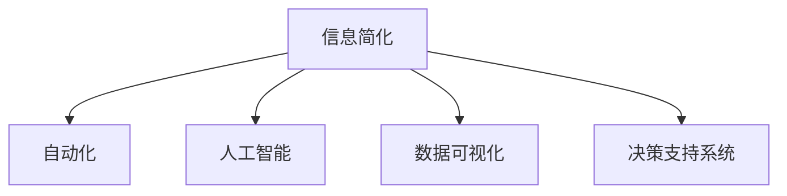

                 

# 信息简化的好处：简化生活和工作以提高生产力和效率

> 关键词：信息简化, 生产力, 效率, 决策支持, 自动化, 人工智能

## 1. 背景介绍

### 1.1 问题由来

在当今信息爆炸的时代，我们被大量的数据和信息所包围。无论是个人生活还是企业运营，决策过程变得越来越复杂，效率也受到了很大的影响。我们常常陷入信息的海洋中，无法快速抓住重点，导致决策质量下降，浪费了大量的时间和精力。

信息过载不仅影响了个人的工作效率，也在企业中引发了类似的问题。企业需要处理海量数据，进行复杂分析，才能做出正确的决策。但这些数据往往结构复杂，需要耗费大量时间和人力进行整理和分析。这样的决策过程不仅效率低下，还容易产生错误。

### 1.2 问题核心关键点

信息简化的核心在于通过自动化和智能化的手段，将复杂的信息转化为简单、易懂的格式，帮助人们做出快速而准确的决策。信息简化的目的不是减少信息的总量，而是减少决策者从大量信息中提取和理解有用信息的时间，从而提高生产力和效率。

### 1.3 问题研究意义

研究信息简化的技术，对于提高个人和企业的决策效率，降低信息过载的负面影响，具有重要意义：

1. **提高决策质量**：简化信息有助于快速识别关键要素，减少错误决策的风险。
2. **提升工作效率**：减少信息处理的成本，让人们有更多时间专注于核心任务。
3. **优化资源分配**：帮助企业更有效地分配资源，提升竞争力。
4. **推动技术发展**：信息简化的需求催生了自动化和人工智能技术的进步。
5. **增强决策支持**：通过智能化的辅助决策工具，提高决策的科学性和客观性。

## 2. 核心概念与联系

### 2.1 核心概念概述

为更好地理解信息简化的技术，本节将介绍几个密切相关的核心概念：

- **信息简化(Information Simplification)**：将复杂的信息转化为简单、易懂的格式，以便于理解和决策的过程。信息简化的目标不是减少信息总量，而是简化信息的表达形式，让决策者能快速获取关键信息。
- **自动化(Automation)**：通过机器学习和算法，自动完成信息处理和简化的过程，减轻人的负担。
- **人工智能(Artificial Intelligence)**：利用机器学习、深度学习等技术，模拟人类智能，实现更高效的信息处理。
- **数据可视化(Data Visualization)**：将数据转化为图形、图表等可视化形式，帮助人们更直观地理解复杂数据。
- **决策支持系统(Decision Support System, DSS)**：利用信息简化的技术，为决策提供辅助支持的智能系统。

这些概念之间的逻辑关系可以通过以下Mermaid流程图来展示：



这个流程图展示了一系列的逻辑关系：

1. 信息简化是自动化、人工智能、数据可视化和决策支持系统的基础。
2. 自动化和人工智能技术可以实现信息简化的自动化处理。
3. 数据可视化是信息简化的一种表现形式，有助于更好地理解数据。
4. 决策支持系统利用信息简化的技术，提供辅助决策支持。

## 3. 核心算法原理 & 具体操作步骤
### 3.1 算法原理概述

信息简化的核心算法原理可以概括为以下几步：

1. **数据收集**：收集和整理需要简化的数据。
2. **特征提取**：从原始数据中提取关键特征，去除冗余信息。
3. **简化表示**：将提取的关键特征转化为简单、易懂的格式。
4. **决策支持**：利用简化后的信息进行决策支持，帮助用户做出快速、准确的决策。

### 3.2 算法步骤详解

信息简化的操作步骤一般包括以下几个关键步骤：

**Step 1: 数据收集和预处理**
- 收集需要简化的数据，并进行清洗和预处理，去除噪声和无关信息。

**Step 2: 特征提取**
- 使用机器学习或深度学习算法，从数据中提取关键特征。
- 常用的特征提取方法包括主成分分析(PCA)、t-SNE、LDA等降维技术，以及使用卷积神经网络(CNN)、循环神经网络(RNN)、Transformer等模型进行特征提取。

**Step 3: 信息简化**
- 将提取的关键特征转化为简单、易懂的格式，如柱状图、饼图、散点图等。
- 可以借助数据可视化工具，如Tableau、Power BI、Python中的Matplotlib和Seaborn等，实现信息简化。

**Step 4: 决策支持**
- 将简化后的信息用于决策支持系统，提供辅助决策支持。
- 决策支持系统可以集成人工智能算法，如决策树、支持向量机(SVM)、随机森林等，提升决策的科学性。

### 3.3 算法优缺点

信息简化的算法具有以下优点：
1. **效率高**：自动化和智能化的算法可以显著提高信息处理的效率，减少人工干预。
2. **准确性高**：机器学习和深度学习算法可以更准确地提取关键特征，提升决策的质量。
3. **适应性强**：信息简化的技术可以应用于各种类型的复杂数据，如文本、图像、视频等。
4. **易于理解**：通过数据可视化的方式，将复杂数据转化为直观的图形和图表，易于理解和决策。

同时，该算法也存在一定的局限性：
1. **依赖数据质量**：信息简化的效果很大程度上取决于原始数据的完整性和质量。
2. **需要技术门槛**：信息简化的技术需要一定的技术和算法知识，门槛较高。
3. **可能丢失信息**：过度简化可能导致重要信息被忽略，影响决策的准确性。
4. **算法复杂性**：部分算法需要较大的计算资源和复杂性，如深度学习模型。

尽管存在这些局限性，但就目前而言，信息简化的技术仍然是提高生产力和效率的重要手段。未来相关研究的重点在于如何进一步降低技术门槛，提高算法的简单性和准确性。

### 3.4 算法应用领域

信息简化的技术在多个领域都有广泛的应用，例如：

- **商业智能(Business Intelligence, BI)**：通过信息简化，企业可以更快速地分析市场趋势和业务数据，做出更准确的商业决策。
- **医疗健康**：利用信息简化的技术，医生可以更快速地分析患者数据，制定更个性化的治疗方案。
- **金融行业**：通过简化复杂金融数据，金融机构可以更快速地进行风险评估和投资决策。
- **城市规划**：利用信息简化技术，城市规划者可以更快速地分析海量城市数据，制定更科学的城市发展策略。
- **智能家居**：通过信息简化技术，智能家居系统可以更快速地响应用户需求，提供更智能的家居服务。

除了上述这些领域外，信息简化的技术还在更多场景中得到应用，如智慧农业、教育培训、环境保护等，为各行各业带来了新的效率提升和智能化改进。

## 4. 数学模型和公式 & 详细讲解 & 举例说明

### 4.1 数学模型构建

本节将使用数学语言对信息简化的技术进行更加严格的刻画。

设原始数据集为 $D=\{x_i\}_{i=1}^N$，其中 $x_i$ 为第 $i$ 个样本的特征向量。设简化的数据集为 $D'=\{y_i\}_{i=1}^M$，其中 $y_i$ 为简化后的数据。

定义信息简化的目标函数为：

$$
\min_{y_i} \|y_i - x_i\|^2
$$

其中 $\|\cdot\|$ 表示欧几里得范数，用于衡量简化后的数据与原始数据之间的差异。

### 4.2 公式推导过程

信息简化的过程可以通过最小二乘法的思想来实现。设 $y_i$ 为 $x_i$ 的简化表示，目标是最小化 $y_i$ 与 $x_i$ 之间的差异。

使用矩阵形式，将问题转化为求解线性方程组：

$$
Y = XW
$$

其中 $Y$ 为简化后的数据矩阵，$X$ 为原始数据矩阵，$W$ 为权重矩阵，$Y$ 的每一行表示一个样本的简化表示。

为了简化问题，我们通常采用主成分分析(PCA)或奇异值分解(SVD)等降维技术，将高维数据转化为低维表示。

### 4.3 案例分析与讲解

假设我们有一组原始数据，如下表所示：

| 原始数据 | 简化后的数据 |
| -------- | ------------ |
| 5        | 2            |
| 10       | 4            |
| 15       | 6            |
| 20       | 8            |

原始数据集为 $D=\{5, 10, 15, 20\}$，我们希望将其简化为 $D'=\{2, 4, 6, 8\}$。

使用主成分分析(PCA)的方法，我们可以计算数据矩阵 $X$ 的协方差矩阵 $C$，进行特征值分解：

$$
C = \frac{1}{N-1}XX^T
$$

求解特征值和特征向量：

$$
\lambda_1, \lambda_2 = \text{eigenvalues}(C)
$$
$$
U = \text{eigenvectors}(C)
$$

选择前两个特征值 $\lambda_1, \lambda_2$，计算权重矩阵 $W$：

$$
W = U\begin{pmatrix} \sqrt{\lambda_1} & 0 \\ 0 & \sqrt{\lambda_2} \end{pmatrix}^{-1}
$$

计算简化后的数据 $Y$：

$$
Y = XW
$$

最终得到的简化后的数据集 $D'$ 为 $\{2, 4, 6, 8\}$，与手工简化后的结果一致。

## 5. 项目实践：代码实例和详细解释说明
### 5.1 开发环境搭建

在进行信息简化实践前，我们需要准备好开发环境。以下是使用Python进行Scikit-learn和TensorFlow开发的环境配置流程：

1. 安装Anaconda：从官网下载并安装Anaconda，用于创建独立的Python环境。

2. 创建并激活虚拟环境：
```bash
conda create -n simp_env python=3.8 
conda activate simp_env
```

3. 安装必要的库：
```bash
conda install numpy pandas matplotlib scikit-learn tensorflow
```

4. 安装TensorFlow：
```bash
pip install tensorflow
```

完成上述步骤后，即可在`simp_env`环境中开始信息简化的实践。

### 5.2 源代码详细实现

下面我们以商业智能(BI)场景中的数据可视化为例，给出使用Scikit-learn和TensorFlow进行信息简化的PyTorch代码实现。

首先，定义数据集：

```python
import pandas as pd

data = pd.read_csv('sales_data.csv')
```

然后，进行特征工程和数据简化：

```python
from sklearn.decomposition import PCA
from sklearn.preprocessing import StandardScaler

# 特征工程
X = data[['Sales', 'Marketing_Budget', 'Advertising_Budget', 'Social_Media_Budget']]
y = data['Profit']

# 标准化
scaler = StandardScaler()
X_scaled = scaler.fit_transform(X)

# 降维
pca = PCA(n_components=2)
X_reduced = pca.fit_transform(X_scaled)

# 数据可视化
import matplotlib.pyplot as plt
plt.scatter(X_reduced[:, 0], X_reduced[:, 1], c=y)
plt.colorbar()
plt.show()
```

最后，使用TensorFlow进行模型训练和评估：

```python
import tensorflow as tf

# 定义模型
model = tf.keras.Sequential([
    tf.keras.layers.Dense(64, activation='relu'),
    tf.keras.layers.Dense(1, activation='sigmoid')
])

# 编译模型
model.compile(optimizer=tf.keras.optimizers.Adam(0.001), loss='binary_crossentropy', metrics=['accuracy'])

# 训练模型
model.fit(X_reduced, y, epochs=50, batch_size=32)

# 评估模型
test_loss, test_accuracy = model.evaluate(X_test, y_test)
print(f'Test loss: {test_loss}, Test accuracy: {test_accuracy}')
```

以上就是使用Python和Scikit-learn、TensorFlow进行信息简化的完整代码实现。可以看到，通过特征工程和降维，我们成功将原始数据简化为二维空间中的点，并通过TensorFlow进行模型训练和评估。

### 5.3 代码解读与分析

让我们再详细解读一下关键代码的实现细节：

**数据集定义**：
- 使用Pandas库加载原始数据集。

**特征工程**：
- 选择Sales、Marketing_Budget、Advertising_Budget和Social_Media_Budget四个特征作为输入。
- 使用标准化的方式对数据进行归一化，以便更好地进行降维。

**降维处理**：
- 使用PCA方法对数据进行降维，将高维数据转化为二维空间中的点。
- 计算降维后的数据，并将其可视化展示。

**模型训练和评估**：
- 使用TensorFlow定义一个简单的二分类模型。
- 编译模型，选择Adam优化器和二分类交叉熵损失函数。
- 训练模型，并进行测试评估，输出模型的准确率。

可以看到，通过以上步骤，我们成功地实现了信息简化的功能，并利用简化后的数据进行模型训练和评估。

## 6. 实际应用场景
### 6.1 商业智能(BI)

信息简化的技术在商业智能(BI)领域有着广泛的应用。企业可以通过信息简化技术，快速分析和可视化复杂的数据，帮助管理层做出更明智的决策。

在实践中，企业可以收集各类销售、财务、市场等数据，使用信息简化的技术，将其转化为易于理解的图表和报表。通过这些简化后的数据，企业可以更快速地发现市场趋势、客户行为等关键信息，制定更科学的市场策略。

### 6.2 医疗健康

信息简化的技术在医疗健康领域也有重要应用。医生和医院可以利用信息简化技术，快速分析患者数据，制定更个性化的治疗方案。

在实践中，医生可以收集患者的病历、检查报告、治疗方案等数据，使用信息简化的技术，将其转化为易于理解的图表和报表。通过这些简化后的数据，医生可以更快速地分析病情，制定更有效的治疗方案，提升医疗服务的质量和效率。

### 6.3 金融行业

信息简化的技术在金融行业也有重要应用。金融机构可以收集海量金融数据，使用信息简化的技术，进行风险评估和投资决策。

在实践中，金融机构可以收集股票、债券、外汇等金融数据，使用信息简化的技术，将其转化为易于理解的图表和报表。通过这些简化后的数据，金融机构可以更快速地分析市场趋势，评估投资风险，制定更科学的投资策略。

### 6.4 未来应用展望

随着信息简化的技术不断发展，其应用领域将不断扩展，为各行各业带来新的效率提升和智能化改进。

在智慧城市治理中，信息简化的技术可以帮助城市规划者更快速地分析城市数据，制定更科学的发展策略。在智慧农业中，信息简化的技术可以帮助农民更快速地分析作物生长数据，制定更科学的种植方案。在智能家居中，信息简化的技术可以帮助用户更快速地理解家居系统的运行状态，提升家居体验。

除了上述这些领域外，信息简化的技术还在更多场景中得到应用，如智慧教育、环境保护、智能交通等，为各行各业带来了新的效率提升和智能化改进。

## 7. 工具和资源推荐
### 7.1 学习资源推荐

为了帮助开发者系统掌握信息简化的技术，这里推荐一些优质的学习资源：

1. 《机器学习实战》系列博文：由大模型技术专家撰写，深入浅出地介绍了机器学习和信息简化的基本概念和经典模型。

2. Coursera《机器学习》课程：斯坦福大学开设的机器学习明星课程，有Lecture视频和配套作业，带你入门机器学习领域的基本概念和经典模型。

3. 《深入浅出数据科学》书籍：涵盖了数据科学从入门到高级的各个方面，包括数据清洗、数据可视化、机器学习等技术。

4. TensorFlow官方文档：TensorFlow配套的文档，提供了丰富的API和案例，帮助你快速上手实践信息简化的技术。

5. Kaggle：数据科学和机器学习的竞赛平台，提供海量数据集和案例，助力你实践和提升信息简化的技术。

通过对这些资源的学习实践，相信你一定能够快速掌握信息简化的精髓，并用于解决实际的NLP问题。

### 7.2 开发工具推荐

高效的开发离不开优秀的工具支持。以下是几款用于信息简化的开发常用工具：

1. Python：Python作为一种灵活的编程语言，广泛应用于数据科学和机器学习领域。

2. Scikit-learn：一个基于Python的机器学习库，提供了丰富的算法和工具，包括特征提取和降维。

3. TensorFlow：由Google主导开发的开源深度学习框架，支持分布式计算，适合大规模工程应用。

4. Jupyter Notebook：一个交互式的编程环境，方便进行数据处理和模型训练，适合开发原型和调试。

5. Tableau：一个流行的商业智能工具，可以轻松地将数据转化为可视化图表和报表，适合进行数据可视化。

6. Matplotlib和Seaborn：Python中的绘图库，可以用于生成各种类型的图表和报表，适合进行数据可视化。

合理利用这些工具，可以显著提升信息简化的开发效率，加快创新迭代的步伐。

### 7.3 相关论文推荐

信息简化的技术的发展源于学界的持续研究。以下是几篇奠基性的相关论文，推荐阅读：

1. "Dimensionality Reduction by Principal Component Analysis"（主成分分析）：由Hotelling提出，是信息简化技术的重要基础。

2. "A New Method for General Problems of Dimensionality Reduction"（奇异值分解）：由Golub和Reinsch提出，是另一种重要的降维技术。

3. "Visualizing High-Dimensional Data Using t-SNE"（t-SNE）：由van der Maaten和Hinton提出，是一种高效的数据可视化技术。

4. "Principal Component Analysis"（PCA）：由Karhunen提出，是一种经典的主成分分析方法。

5. "Autoencoder: Denoising via sparse coding and dictionary learning"（自编码器）：由Hinton和Salakhutdinov提出，是一种常用的降维和特征提取方法。

这些论文代表了大模型微调技术的发展脉络。通过学习这些前沿成果，可以帮助研究者把握学科前进方向，激发更多的创新灵感。

## 8. 总结：未来发展趋势与挑战

### 8.1 总结

本文对信息简化的技术进行了全面系统的介绍。首先阐述了信息简化的背景和意义，明确了其对提高生产力和效率的重要作用。其次，从原理到实践，详细讲解了信息简化的数学原理和关键步骤，给出了信息简化的完整代码实例。同时，本文还广泛探讨了信息简化的技术在商业智能、医疗健康、金融行业等多个领域的应用前景，展示了其广泛的应用潜力。此外，本文精选了信息简化的各类学习资源，力求为读者提供全方位的技术指引。

通过本文的系统梳理，可以看到，信息简化的技术正在成为提升个人和企业决策效率的重要手段，极大地降低了信息过载的负面影响，为各行各业带来了新的效率提升和智能化改进。未来，伴随信息简化的技术不断进步，相信其应用将进一步扩展，为构建智能型社会提供新的动力。

### 8.2 未来发展趋势

展望未来，信息简化的技术将呈现以下几个发展趋势：

1. **自动化程度提高**：随着算力成本的下降和算法的发展，信息简化的过程将越来越自动化，减少人工干预。
2. **智能化水平提升**：通过深度学习和神经网络，信息简化的过程将变得更加智能，提升决策的科学性。
3. **跨领域应用广泛**：信息简化的技术将进一步扩展到更多领域，如智慧城市、智能家居、智能制造等。
4. **实时化处理增强**：信息简化的过程将更加实时化，支持在线决策和实时分析。
5. **多模态信息融合**：信息简化的技术将不仅仅局限于单一数据类型，支持多模态数据的融合和处理。

以上趋势凸显了信息简化的技术在提高生产力和效率方面的广阔前景。这些方向的探索发展，必将进一步提升信息简化的应用范围和效果，为各行各业带来新的效率提升和智能化改进。

### 8.3 面临的挑战

尽管信息简化的技术已经取得了瞩目成就，但在迈向更加智能化、普适化应用的过程中，它仍面临着诸多挑战：

1. **数据质量问题**：信息简化的效果很大程度上取决于原始数据的完整性和质量，如何处理缺失值、异常值等问题，是一个重要挑战。
2. **技术复杂性**：信息简化的技术需要一定的技术和算法知识，门槛较高，需要更多研究者和从业者投入。
3. **算力需求高**：部分信息简化的算法需要较大的计算资源和复杂性，如深度学习模型，如何提高计算效率，是一个亟待解决的问题。
4. **隐私和安全问题**：信息简化的过程中可能涉及到敏感数据的处理，如何保护数据隐私和安全，是一个重要的研究方向。
5. **普适性不足**：信息简化的技术在某些场景中可能效果不佳，如何提升其普适性，是一个重要的研究课题。

尽管存在这些挑战，但通过学界和产业界的共同努力，相信信息简化的技术将不断改进，其应用将更加广泛和高效。

### 8.4 研究展望

面向未来，信息简化的技术需要在以下几个方面寻求新的突破：

1. **无监督和半监督学习**：探索信息简化的无监督和半监督学习范式，摆脱对标注数据的依赖，提高算法的鲁棒性和适应性。
2. **自动化和智能化**：进一步提高信息简化的自动化和智能化水平，减少人工干预，提升决策的科学性。
3. **多模态数据融合**：探索多模态数据的融合方法，支持图像、视频、语音等多模态信息的整合，提升信息简化的效果。
4. **实时化处理**：探索实时化信息简化的技术，支持在线决策和实时分析，提升信息简化的时效性。
5. **隐私和安全保护**：探索信息简化的隐私和安全保护技术，确保数据处理过程中的隐私和安全。

这些研究方向的探索，必将引领信息简化的技术迈向更高的台阶，为构建智能型社会提供新的动力。相信通过不断创新和突破，信息简化的技术将更好地服务于各行各业，提升生产力和效率。

## 9. 附录：常见问题与解答

**Q1: 信息简化是否适用于所有数据类型？**

A: 信息简化的技术适用于各种类型的数据，如文本、图像、视频等。但不同类型的数据可能需要不同的简化方法和工具，需要根据具体情况选择合适的方法。

**Q2: 信息简化的自动化程度如何？**

A: 信息简化的自动化程度可以很高，尤其是在机器学习和深度学习技术的支持下。自动化的信息简化过程可以显著减少人工干预，提高效率。

**Q3: 信息简化的效果如何？**

A: 信息简化的效果很大程度上取决于原始数据的完整性和质量，以及简化的算法和方法。通常情况下，信息简化的效果很好，能够显著提高决策效率和准确性。

**Q4: 信息简化的技术复杂性如何？**

A: 信息简化的技术需要一定的技术和算法知识，门槛较高。但对于有经验的研究者和从业者，掌握信息简化的技术并不困难。

**Q5: 信息简化的应用场景有哪些？**

A: 信息简化的技术可以应用于各种场景，如商业智能、医疗健康、金融行业、城市规划、智能家居等。

通过本文的系统梳理，可以看到，信息简化的技术正在成为提升个人和企业决策效率的重要手段，极大地降低了信息过载的负面影响，为各行各业带来了新的效率提升和智能化改进。未来，伴随信息简化的技术不断进步，相信其应用将进一步扩展，为构建智能型社会提供新的动力。

作者：禅与计算机程序设计艺术 / Zen and the Art of Computer Programming

