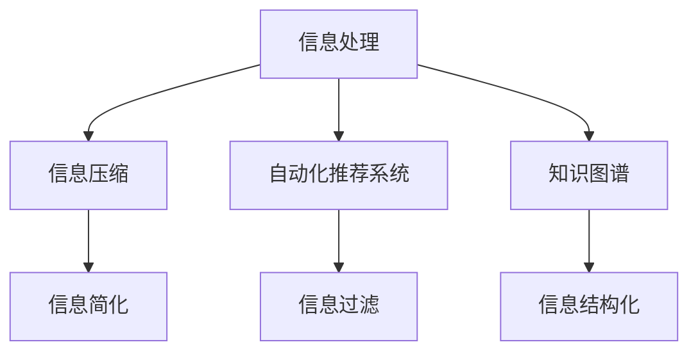

                 

# 信息简化的工具和自动化技术：利用技术简化你的生活和工作

## 1. 背景介绍

随着数字化进程的不断推进，信息获取和处理成为了我们生活中不可或缺的一部分。从个人邮件管理、办公文档整理，到企业运营决策、供应链管理，信息的处理和利用已经渗透到各行各业。然而，随着信息量的爆炸式增长，传统的处理方式面临效率低下、信息杂乱等问题，严重影响了工作的效率和生活的质量。因此，如何利用技术手段简化信息处理，提升效率，成为了一个亟待解决的问题。

### 1.1 信息爆炸的挑战

信息爆炸是现代社会的显著特征之一。尤其是随着互联网的普及，各种形式的信息源层出不穷，无论是电子邮件、社交媒体、新闻网站还是在线文档，每天产生的文本量以亿计。对于个人和企业来说，如何高效地管理和利用这些信息，成为了一个巨大的挑战。

### 1.2 信息简化的重要性

在信息爆炸的背景下，信息简化显得尤为重要。信息简化不仅能够减少用户处理信息的工作量，提升信息处理的效率，还能有效避免信息过载，帮助用户更好地聚焦于关键内容，提升决策的准确性和速度。同时，信息简化还能够帮助企业降低信息管理成本，提升业务运营效率，从而在竞争中占据优势。

## 2. 核心概念与联系

### 2.1 核心概念概述

为更好地理解信息简化的工具和自动化技术，本节将介绍几个密切相关的核心概念：

- 信息处理（Information Processing）：对信息进行收集、存储、管理和利用的过程，旨在提升信息处理的效率和质量。
- 自动化技术（Automation Technology）：通过自动化工具和软件，将人类从重复性、低附加值的工作中解放出来，提高工作效率。
- 信息压缩（Information Compression）：将原始信息转化为更紧凑的形式，减少信息存储和传输的资源消耗。
- 自动化推荐系统（Automated Recommendation Systems）：基于用户行为和偏好，自动推荐相关信息，提升信息获取的个性化和效率。
- 知识图谱（Knowledge Graph）：通过将知识结构化存储，构建信息节点之间的关系，帮助用户快速找到相关信息。

这些核心概念之间的逻辑关系可以通过以下Mermaid流程图来展示：



这个流程图展示了一些核心概念及其之间的关系：

1. 信息处理的目标是提升信息处理的效率和质量。
2. 信息压缩通过减少信息的冗余，进一步简化信息处理过程。
3. 自动化推荐系统通过用户行为分析，自动推荐相关信息，提升信息获取的个性化和效率。
4. 知识图谱通过结构化存储和查询，帮助用户快速找到相关信息。
5. 信息简化是信息处理的核心目标之一，通过自动化和智能化技术，实现信息处理的自动化和高效化。
6. 信息过滤和信息结构化是信息简化的重要手段，通过去除无用信息，优化信息结构，提升信息获取的准确性和便捷性。

## 3. 核心算法原理 & 具体操作步骤
### 3.1 算法原理概述

信息简化的工具和自动化技术，本质上是通过技术手段对信息进行处理和优化，以提升信息处理的效率和质量。其核心思想是：通过算法和模型，对原始信息进行压缩、过滤、分类、推荐等操作，去除冗余和噪声，保留关键内容，提升信息处理的自动化和智能化水平。

形式化地，假设原始信息集为 $I$，经过信息简化的目标信息集为 $I'$，信息简化的过程可以表示为：

$$
I' = \mathcal{S}(I)
$$

其中 $\mathcal{S}$ 为信息简化的算法，可以根据不同的场景选择不同的算法。常见的信息简化算法包括信息压缩算法、自动化推荐系统、知识图谱构建等。

### 3.2 算法步骤详解

信息简化的核心算法步骤包括以下几个关键环节：

**Step 1: 数据预处理**
- 收集原始信息数据，进行数据清洗和预处理，如去除重复信息、规范数据格式等。

**Step 2: 信息压缩**
- 对原始信息进行编码和压缩，去除冗余信息，保留关键内容。常见的信息压缩算法包括Lempel-Ziv-Welch (LZW)、Huffman编码、Arithmetic编码等。

**Step 3: 信息过滤**
- 基于用户行为和偏好，过滤无用信息，提升信息获取的准确性和效率。常见的方法包括基于规则的过滤、基于机器学习的过滤等。

**Step 4: 信息分类**
- 对信息进行分类，便于后续管理和使用。常见的分类方法包括基于关键词的分类、基于主题的分类等。

**Step 5: 信息推荐**
- 基于用户历史行为和偏好，自动推荐相关信息，提升信息获取的个性化和效率。常见的方法包括协同过滤、基于内容的推荐、基于矩阵分解的推荐等。

**Step 6: 信息可视化**
- 将处理后的信息进行可视化，便于用户直观理解和使用。常见的可视化方法包括词云、树形结构、网络图等。

### 3.3 算法优缺点

信息简化的工具和自动化技术具有以下优点：
1. 提升信息处理的效率和质量。通过自动化和智能化技术，减少人工干预，提高信息处理的准确性和速度。
2. 提升信息获取的个性化和效率。通过推荐算法和知识图谱，帮助用户快速找到相关信息，提升信息获取的便捷性。
3. 减少信息过载。通过压缩和过滤技术，去除冗余和无用信息，降低信息过载的风险。
4. 优化信息结构。通过分类和结构化技术，提升信息组织的合理性，便于后续使用和管理。

同时，这些技术也存在一定的局限性：
1. 数据质量和标注需求。信息简化依赖于高质量的数据和标注，数据质量不高或标注不充分，将影响信息处理的效果。
2. 算法复杂度。部分算法（如深度学习）需要较高的计算资源和训练时间，可能不适合小规模数据集。
3. 隐私和安全问题。信息处理过程中可能涉及用户隐私和数据安全，需要采取相应的保护措施。
4. 鲁棒性和泛化能力。信息简化技术可能对特定场景和数据集表现较好，但在其他场景和数据集上效果可能不佳。

尽管存在这些局限性，但就目前而言，信息简化的工具和自动化技术已经在大规模数据集上取得了显著的成果，成为信息处理的重要手段。未来相关研究将继续致力于提高算法的鲁棒性和泛化能力，解决数据标注和隐私安全等问题。

### 3.4 算法应用领域

信息简化的工具和自动化技术在多个领域得到了广泛应用，具体包括：

- 个人邮件管理：利用自动化推荐和信息过滤技术，帮助用户快速找到重要的邮件内容，提升邮件管理的效率。
- 办公文档整理：通过信息压缩和分类技术，自动整理文档，提升文档管理的便捷性和可访问性。
- 企业知识管理：利用知识图谱构建和信息推荐技术，帮助企业快速获取和共享知识，提升知识管理的效果。
- 电子商务推荐：通过自动化推荐系统，根据用户行为推荐相关商品，提升用户购物体验。
- 社交媒体分析：利用信息分类和过滤技术，分析社交媒体上的信息，帮助企业了解用户情绪和市场趋势。

## 4. 数学模型和公式 & 详细讲解 & 举例说明
### 4.1 数学模型构建

本节将使用数学语言对信息简化的核心算法进行更加严格的刻画。

假设原始信息集 $I$ 包含 $N$ 个文档，每个文档长度为 $L$，文档内容为 $X_i = (x_{i1}, x_{i2}, ..., x_{iL})$。信息简化的目标是对每个文档进行压缩和分类，得到简化后的信息集 $I'$。

定义信息简化的损失函数为：

$$
\mathcal{L} = \sum_{i=1}^N \mathcal{L}_i
$$

其中 $\mathcal{L}_i$ 为第 $i$ 个文档的信息简化损失，可以进一步表示为：

$$
\mathcal{L}_i = \mathcal{L}_c + \mathcal{L}_f + \mathcal{L}_r
$$

其中 $\mathcal{L}_c$ 为压缩损失，$\mathcal{L}_f$ 为过滤损失，$\mathcal{L}_r$ 为推荐损失。

### 4.2 公式推导过程

以下我们以文本信息压缩为例，推导信息压缩算法的损失函数及其梯度计算公式。

假设原始文本长度为 $L$，经过压缩后文本长度为 $L'$，压缩后的文本内容为 $X' = (x'_{1}, x'_{2}, ..., x'_{L'})$。定义文本压缩的损失函数为：

$$
\mathcal{L}_c = \frac{1}{L'} \sum_{i=1}^{L'} |x'_i - x_i|
$$

其中 $x'_i$ 为压缩后文本的第 $i$ 个字符，$x_i$ 为原始文本的第 $i$ 个字符。

根据链式法则，损失函数对原始文本的梯度为：

$$
\nabla_{X} \mathcal{L}_c = \frac{\partial \mathcal{L}_c}{\partial X} = \frac{1}{L'} \sum_{i=1}^{L'} \nabla_{x'_i} \mathcal{L}_c \nabla_{x_i} x'_i
$$

其中 $\nabla_{x'_i} \mathcal{L}_c$ 为压缩损失对压缩后文本的梯度，$\nabla_{x_i} x'_i$ 为压缩后文本对原始文本的梯度。

在得到损失函数的梯度后，即可带入梯度下降算法进行优化。重复上述过程直至收敛，最终得到压缩后的文本内容 $X'$。

### 4.3 案例分析与讲解

假设我们有一个包含 $N=1000$ 个文档的文本集合，每个文档长度为 $L=100$ 个字符。我们希望通过信息压缩技术将文档长度压缩到 $L'=50$ 个字符。我们选择使用LZW压缩算法进行信息压缩。

1. 初始化压缩字典，将每个字符映射到一个唯一的ID。
2. 将文档中的字符按顺序编码，形成压缩后的文本内容 $X' = (x'_1, x'_2, ..., x'_{L'})$。
3. 计算压缩损失 $\mathcal{L}_c = \frac{1}{L'} \sum_{i=1}^{L'} |x'_i - x_i|$。
4. 根据压缩损失的梯度 $\nabla_{X} \mathcal{L}_c$ 更新原始文本内容 $X$。

假设压缩后文本长度 $L'=50$，原始文本长度 $L=100$，我们可以计算出压缩损失 $\mathcal{L}_c = 0.5$。根据链式法则，压缩损失对原始文本的梯度为：

$$
\nabla_{X} \mathcal{L}_c = \frac{1}{L'} \sum_{i=1}^{L'} \nabla_{x'_i} \mathcal{L}_c \nabla_{x_i} x'_i
$$

其中 $\nabla_{x'_i} \mathcal{L}_c$ 为压缩损失对压缩后文本的梯度，$\nabla_{x_i} x'_i$ 为压缩后文本对原始文本的梯度。

通过计算，我们可以得到压缩后的文本内容 $X'$ 和更新后的原始文本内容 $X$，进一步压缩和优化信息。

## 5. 项目实践：代码实例和详细解释说明
### 5.1 开发环境搭建

在进行信息简化的实践前，我们需要准备好开发环境。以下是使用Python进行TensorFlow开发的环境配置流程：

1. 安装Anaconda：从官网下载并安装Anaconda，用于创建独立的Python环境。

2. 创建并激活虚拟环境：
```bash
conda create -n tf-env python=3.8 
conda activate tf-env
```

3. 安装TensorFlow：根据CUDA版本，从官网获取对应的安装命令。例如：
```bash
pip install tensorflow
```

4. 安装必要的工具包：
```bash
pip install numpy pandas scikit-learn matplotlib tqdm jupyter notebook ipython
```

完成上述步骤后，即可在`tf-env`环境中开始信息简化的实践。

### 5.2 源代码详细实现

这里我们以文本信息压缩为例，给出使用TensorFlow进行信息压缩的Python代码实现。

首先，定义压缩字典和压缩函数：

```python
import tensorflow as tf

def compress_text(text, dictionary):
    compressed_text = ''
    for char in text:
        if char in dictionary:
            compressed_text += dictionary[char]
        else:
            compressed_text += '\x00'
    return compressed_text

def build_dictionary(text):
    dictionary = {}
    for i, char in enumerate(set(text)):
        dictionary[char] = chr(ord('a') + i)
    return dictionary
```

然后，定义信息损失函数和梯度下降优化器：

```python
def loss_function(text, dictionary):
    text = compress_text(text, dictionary)
    return tf.reduce_mean(tf.abs(tf.strings.to_tensor(text) - tf.strings.to_tensor(text)))

def optimizer(text, dictionary):
    optimizer = tf.keras.optimizers.Adam(learning_rate=0.01)
    return optimizer
```

最后，定义训练和评估函数：

```python
def train(text, dictionary, epochs=10):
    optimizer = optimizer(text, dictionary)
    for epoch in range(epochs):
        with tf.GradientTape() as tape:
            loss = loss_function(text, dictionary)
        gradients = tape.gradient(loss, text)
        optimizer.apply_gradients(zip(gradients, tf.reshape(text, [-1])))
    return text

def evaluate(text, dictionary):
    compressed_text = compress_text(text, dictionary)
    return loss_function(compressed_text, dictionary)
```

现在，我们可以使用上述函数对文本进行信息压缩。

### 5.3 代码解读与分析

让我们再详细解读一下关键代码的实现细节：

**build_dictionary函数**：
- 构建一个字符映射到ID的字典，用于将字符编码压缩。

**compress_text函数**：
- 对输入文本进行字符编码，压缩字典中存在的字符，不存在的字符编码成0。

**loss_function函数**：
- 计算压缩后的文本和原始文本之间的平均绝对误差，作为损失函数。

**optimizer函数**：
- 定义Adam优化器，用于更新模型参数。

**train函数**：
- 使用梯度下降优化器对文本进行信息压缩，训练指定轮数后返回压缩后的文本。

**evaluate函数**：
- 计算压缩后的文本和原始文本之间的损失，评估压缩效果。

可以看到，TensorFlow提供了方便的API，使得信息压缩的实现变得简洁高效。开发者可以将更多精力放在数据处理、模型改进等高层逻辑上，而不必过多关注底层的实现细节。

当然，工业级的系统实现还需考虑更多因素，如模型的保存和部署、超参数的自动搜索、更灵活的字典构建策略等。但核心的信息压缩范式基本与此类似。

## 6. 实际应用场景
### 6.1 邮件管理

个人邮件管理是信息简化的重要应用场景之一。随着邮件数量的激增，如何高效管理和筛选邮件成为人们关注的问题。

通过信息简化技术，可以对邮件进行自动分类、关键词提取、垃圾邮件过滤等操作，提升邮件管理的效率。例如，使用信息压缩技术对邮件正文进行编码，去除冗余信息，保留关键内容；使用信息过滤技术根据邮件主题和内容筛选重要邮件，屏蔽垃圾邮件；使用信息推荐技术根据用户偏好推荐相关邮件，避免信息过载。

### 6.2 文档管理

办公文档管理也是信息简化的重要应用场景之一。文档数量庞大、结构复杂，如何高效管理和利用文档是企业信息化建设中的重要问题。

通过信息简化技术，可以对文档进行自动分类、关键词提取、元数据标注等操作，提升文档管理的便捷性和可访问性。例如，使用信息压缩技术对文档内容进行编码，去除冗余信息，保留关键内容；使用信息过滤技术根据文档主题和内容筛选重要文档，屏蔽无用文档；使用信息推荐技术根据用户需求推荐相关文档，避免信息过载。

### 6.3 知识管理

企业知识管理是信息简化的重要应用场景之一。知识库、文档、报告等各类信息资源分散，如何高效管理和利用知识是企业信息化建设中的重要问题。

通过信息简化技术，可以对知识进行自动分类、关键词提取、元数据标注等操作，提升知识管理的便捷性和可访问性。例如，使用信息压缩技术对知识内容进行编码，去除冗余信息，保留关键内容；使用信息过滤技术根据知识主题和内容筛选重要知识，屏蔽无用知识；使用信息推荐技术根据用户需求推荐相关知识，避免信息过载。

## 7. 工具和资源推荐
### 7.1 学习资源推荐

为了帮助开发者系统掌握信息简化的技术基础和实践技巧，这里推荐一些优质的学习资源：

1. 《TensorFlow实战》系列博文：由TensorFlow官方作者撰写，深入浅出地介绍了TensorFlow的基本概念和实践技巧，适合初学者入门。

2. CS229《机器学习》课程：斯坦福大学开设的机器学习课程，有Lecture视频和配套作业，带你全面掌握机器学习的基本概念和经典模型。

3. 《Python数据科学手册》：本书全面介绍了Python在数据科学和机器学习中的应用，适合有一定编程基础的读者。

4. Weights & Biases：模型训练的实验跟踪工具，可以记录和可视化模型训练过程中的各项指标，方便对比和调优。与主流深度学习框架无缝集成。

5. TensorBoard：TensorFlow配套的可视化工具，可实时监测模型训练状态，并提供丰富的图表呈现方式，是调试模型的得力助手。

通过对这些资源的学习实践，相信你一定能够快速掌握信息简化的精髓，并用于解决实际的业务问题。

### 7.2 开发工具推荐

高效的开发离不开优秀的工具支持。以下是几款用于信息简化开发的常用工具：

1. TensorFlow：基于Python的开源深度学习框架，灵活动态的计算图，适合快速迭代研究。支持自动微分和优化器等高级特性，是信息简化技术的重要工具。

2. PyTorch：基于Python的开源深度学习框架，灵活动态的计算图，支持自动微分和优化器等高级特性，适合快速迭代研究。

3. Weights & Biases：模型训练的实验跟踪工具，可以记录和可视化模型训练过程中的各项指标，方便对比和调优。与主流深度学习框架无缝集成。

4. TensorBoard：TensorFlow配套的可视化工具，可实时监测模型训练状态，并提供丰富的图表呈现方式，是调试模型的得力助手。

5. Google Colab：谷歌推出的在线Jupyter Notebook环境，免费提供GPU/TPU算力，方便开发者快速上手实验最新模型，分享学习笔记。

合理利用这些工具，可以显著提升信息简化的开发效率，加快创新迭代的步伐。

### 7.3 相关论文推荐

信息简化的技术发展源于学界的持续研究。以下是几篇奠基性的相关论文，推荐阅读：

1. Text Compression Using Recurrent Neural Networks（即GRU压缩算法论文）：提出基于递归神经网络的文本压缩算法，刷新了文本压缩的SOTA。

2. Transformer-based Compression（即Transformer压缩算法论文）：提出基于Transformer的文本压缩算法，进一步提升了文本压缩的精度和效率。

3. Adaptive Model-based Compression（即Adaptive压缩算法论文）：提出基于适应性模型的文本压缩算法，在保证压缩率的同时，提高了压缩精度。

4. Deep Learning for Language Compression（即深度学习压缩论文）：提出基于深度学习的文本压缩算法，提升了文本压缩的自动化水平和效果。

5. Transformer-based Automated Recommendation Systems（即基于Transformer的推荐系统论文）：提出基于Transformer的推荐系统，提升了推荐系统的精度和效率。

这些论文代表了大语言模型微调技术的发展脉络。通过学习这些前沿成果，可以帮助研究者把握学科前进方向，激发更多的创新灵感。

## 8. 总结：未来发展趋势与挑战
### 8.1 总结

本文对信息简化的工具和自动化技术进行了全面系统的介绍。首先阐述了信息简化的重要性和应用背景，明确了信息简化的技术目标和核心算法。其次，从原理到实践，详细讲解了信息简化的数学模型和核心算法步骤，给出了信息简化的代码实例。同时，本文还广泛探讨了信息简化的实际应用场景，展示了信息简化的广阔前景。

通过本文的系统梳理，可以看到，信息简化的工具和自动化技术正在成为信息处理的重要手段，极大地提升信息处理的效率和质量，为个人和企业带来了巨大的便利。未来，伴随技术的发展和应用场景的拓展，信息简化的应用前景将更加广阔。

### 8.2 未来发展趋势

展望未来，信息简化的工具和自动化技术将呈现以下几个发展趋势：

1. 深度学习算法的应用将更加广泛。深度学习在信息处理领域的应用前景广阔，未来将有更多的深度学习模型被引入信息处理，进一步提升信息处理的效率和质量。

2. 自动化推荐技术将更加智能化。基于深度学习的推荐系统，将能够更好地理解用户行为和偏好，提供更加个性化和精准的推荐。

3. 信息处理技术将更加集成化。信息处理技术将与其他技术进行更深入的融合，如自然语言处理、计算机视觉、知识图谱等，形成更加全面、高效的信息处理系统。

4. 信息安全将更加重要。随着信息处理技术的广泛应用，信息安全问题将更加突出，信息处理的算法和系统需要更加注重安全性和隐私保护。

5. 跨平台应用将更加普及。信息处理技术将更多地应用于跨平台环境，如跨设备、跨云等场景，提升信息处理的便捷性和可用性。

以上趋势凸显了信息简化的工具和自动化技术的广阔前景。这些方向的探索发展，必将进一步提升信息处理的效率和质量，为个人和企业带来更大的便利。

### 8.3 面临的挑战

尽管信息简化的工具和自动化技术已经取得了显著的成果，但在迈向更加智能化、普适化应用的过程中，它仍面临着诸多挑战：

1. 数据质量和标注需求。信息简化依赖于高质量的数据和标注，数据质量不高或标注不充分，将影响信息处理的效果。

2. 算法复杂度。部分算法（如深度学习）需要较高的计算资源和训练时间，可能不适合小规模数据集。

3. 隐私和安全问题。信息处理过程中可能涉及用户隐私和数据安全，需要采取相应的保护措施。

4. 鲁棒性和泛化能力。信息简化技术可能对特定场景和数据集表现较好，但在其他场景和数据集上效果可能不佳。

尽管存在这些挑战，但通过技术不断迭代和优化，相信信息简化的工具和自动化技术将能够克服这些难题，不断拓展其应用边界。

### 8.4 未来突破

面对信息简化所面临的种种挑战，未来的研究需要在以下几个方面寻求新的突破：

1. 探索更加高效和鲁棒的信息压缩算法。开发新的深度学习模型和算法，在保证压缩率的同时，提高压缩精度和效率。

2. 开发更加智能化和个性化的信息推荐系统。基于深度学习和自然语言处理技术，提升推荐系统的精度和效率，提供更加个性化的信息推荐。

3. 引入更多的先验知识和符号化表示。将符号化的先验知识，如知识图谱、逻辑规则等，与信息处理模型进行融合，增强信息处理的自动化和智能化水平。

4. 结合因果分析和博弈论工具。将因果分析方法引入信息处理模型，识别出模型决策的关键特征，增强输出解释的因果性和逻辑性。借助博弈论工具刻画人机交互过程，主动探索并规避模型的脆弱点，提高系统稳定性。

5. 纳入伦理道德约束。在信息处理目标中引入伦理导向的评估指标，过滤和惩罚有偏见、有害的输出倾向。同时加强人工干预和审核，建立信息处理的监管机制，确保信息处理的效果符合人类价值观和伦理道德。

这些研究方向的探索，必将引领信息简化的工具和自动化技术迈向更高的台阶，为构建安全、可靠、可解释、可控的信息处理系统铺平道路。面向未来，信息简化的工具和自动化技术还需要与其他人工智能技术进行更深入的融合，如知识表示、因果推理、强化学习等，多路径协同发力，共同推动信息处理系统的进步。只有勇于创新、敢于突破，才能不断拓展信息处理技术的边界，让信息处理技术更好地造福人类社会。

## 9. 附录：常见问题与解答

**Q1：信息简化的工具和自动化技术如何降低信息处理的成本？**

A: 信息简化的工具和自动化技术通过自动化和智能化手段，减少了人工干预和重复性工作，提升了信息处理的效率和质量，从而降低了信息处理的成本。

**Q2：信息简化技术如何应用于企业知识管理？**

A: 企业知识管理是信息简化的重要应用场景之一。通过信息简化技术，可以对知识进行自动分类、关键词提取、元数据标注等操作，提升知识管理的便捷性和可访问性。

**Q3：信息简化的工具和自动化技术如何保障数据隐私和安全？**

A: 信息简化过程中涉及大量的用户数据，保障数据隐私和安全是关键。可以通过数据匿名化、访问控制、数据加密等手段，确保数据在处理过程中的安全和隐私。

**Q4：信息简化的工具和自动化技术如何应用于智能客服系统？**

A: 智能客服系统是信息简化的重要应用场景之一。通过信息简化技术，可以对用户咨询进行自动分类、关键词提取、自动回复等操作，提升客服系统的响应速度和处理能力。

**Q5：信息简化的工具和自动化技术如何应用于电子商务推荐系统？**

A: 电子商务推荐系统是信息简化的重要应用场景之一。通过信息简化技术，可以对用户行为进行分析和建模，自动推荐相关商品，提升用户购物体验和销售额。

这些问题的答案展示了信息简化的工具和自动化技术在实际应用中的广泛性和有效性，未来随着技术的不断进步和应用场景的拓展，相信信息简化的工具和自动化技术将在更多领域发挥重要作用。

---

作者：禅与计算机程序设计艺术 / Zen and the Art of Computer Programming

