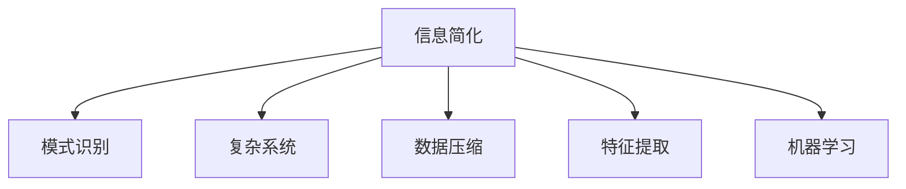

                 

# 信息简化的艺术与科学：在混乱中找到模式，在复杂中简化

> 关键词：信息简化, 模式识别, 复杂系统, 数据压缩, 人工智能, 机器学习

## 1. 背景介绍

### 1.1 问题由来
在现代社会中，信息量呈指数级增长。从数据量庞大的互联网，到海量存储的云服务，再到实时流动的社交媒体，信息的获取、处理和利用正以前所未有的速度发展。然而，这些信息往往包含大量噪音和冗余，如何从中提取有价值的模式和知识，成为亟待解决的问题。信息简化艺术与科学，正是在这一背景下兴起的。

### 1.2 问题核心关键点
信息简化的核心在于，如何高效地从原始数据中抽取出有意义的信号，去除噪音和冗余，以便更好地进行模式识别和决策。这不仅是信息技术领域的核心问题，也是人类认知过程中的重要环节。

信息简化的方法多种多样，包括但不限于数据压缩、特征提取、模型训练等。其中，信息简化与模式识别的结合，是当前研究的热点和难点。

### 1.3 问题研究意义
研究信息简化的艺术与科学，对于提升数据处理效率、挖掘数据价值、改善决策质量等方面具有重要意义：

1. **提升数据处理效率**：通过信息简化，可以大幅减少数据的存储空间和传输带宽，加速数据处理流程。
2. **挖掘数据价值**：简化后的数据更容易进行模式识别和分析，从而挖掘出数据背后的规律和洞察。
3. **改善决策质量**：在决策过程中，简洁明了的信号能够提供更准确的判断依据，减少决策错误。

## 2. 核心概念与联系

### 2.1 核心概念概述

为更好地理解信息简化的艺术与科学，本节将介绍几个密切相关的核心概念：

- **信息简化**：从原始数据中提取有意义的信号，去除冗余和噪音的过程。
- **模式识别**：从简化后的数据中识别出规则、规律和模式的过程。
- **复杂系统**：由大量相互作用的部分组成的系统，其行为和结构通常难以直观理解。
- **数据压缩**：通过算法将原始数据转换为更小的表示，以减少存储空间和传输带宽。
- **特征提取**：从原始数据中提取出最具有区分性的特征，以便进行分类、识别等任务。
- **机器学习**：利用算法和模型从数据中学习规律和模式，并应用于新数据的预测和分类。

这些核心概念之间的逻辑关系可以通过以下Mermaid流程图来展示：



这个流程图展示了许多与信息简化相关的重要概念及其之间的关系：

1. **信息简化**作为基础环节，从原始数据中提取有意义的信号。
2. **模式识别**在此基础上进行，识别出数据中的规则和规律。
3. **复杂系统**的数据通常需要更高级的信息简化技术。
4. **数据压缩**和**特征提取**是信息简化的具体实现手段。
5. **机器学习**依赖于信息简化，从数据中学习规律，进行预测和分类。

## 3. 核心算法原理 & 具体操作步骤
### 3.1 算法原理概述

信息简化的核心算法原理，在于从原始数据中提取最具有区分性和代表性的特征，去除冗余和噪音，以便进行有效的模式识别和决策。这一过程通常包括以下几个步骤：

1. **数据预处理**：对原始数据进行清洗、归一化、分词等预处理操作，以便进行后续的简化和分析。
2. **特征选择**：从原始数据中提取最具有区分性的特征，去除无关特征和噪音。
3. **模型训练**：利用机器学习算法对简化后的数据进行训练，学习数据中的模式和规律。
4. **预测与分类**：利用训练好的模型对新数据进行预测和分类，得出结论。

### 3.2 算法步骤详解

以下将详细介绍信息简化与模式识别的具体算法步骤和实现方法：

**Step 1: 数据预处理**
- **清洗**：去除数据中的缺失值、异常值和重复值。
- **归一化**：将数据转换为标准形式，以便模型更好地学习。
- **分词**：对文本数据进行分词操作，将其转化为模型可以处理的格式。

**Step 2: 特征选择**
- **主成分分析(PCA)**：通过线性变换，将高维数据降维，提取主成分，去除冗余。
- **t-SNE**：使用非线性变换，将数据映射到低维空间，保持相似性。
- **LDA**：对文本数据进行主题建模，提取主题分布。
- **特征选择算法**：如互信息、方差阈值等方法，选择最具有区分性的特征。

**Step 3: 模型训练**
- **线性回归**：用于数值预测任务。
- **支持向量机(SVM)**：用于分类任务。
- **决策树**：用于分类和回归任务。
- **神经网络**：用于复杂模式的识别和学习。

**Step 4: 预测与分类**
- **交叉验证**：对模型进行交叉验证，评估模型性能。
- **模型调优**：调整模型参数，优化模型性能。
- **预测与评估**：利用模型对新数据进行预测，评估模型效果。

### 3.3 算法优缺点

信息简化的算法具有以下优点：
1. **高效性**：能够显著减少数据的存储空间和传输带宽，加速数据处理流程。
2. **准确性**：简化后的数据更易于模式识别和分析，提高决策质量。
3. **鲁棒性**：算法对数据中的噪音和冗余有很好的鲁棒性，能够适应不同类型的数据。

同时，这些算法也存在一定的局限性：
1. **复杂度**：一些复杂算法（如神经网络）计算复杂度较高，训练时间较长。
2. **可解释性**：一些高级算法（如深度学习）的内部机制难以解释，不利于模型理解和调试。
3. **过拟合**：在简化过程中，过度压缩数据可能导致模型过拟合，影响泛化能力。

### 3.4 算法应用领域

信息简化的算法在多个领域得到了广泛应用，包括但不限于：

- **金融领域**：利用数据压缩和特征提取技术，预测股票价格、风险评估等。
- **医疗领域**：通过模式识别和特征选择，辅助诊断疾病、优化治疗方案等。
- **交通领域**：利用数据简化和机器学习，优化交通流量、预测交通拥堵等。
- **自然语言处理**：在文本分类、情感分析、机器翻译等任务中，利用特征提取和模型训练进行信息简化。
- **图像处理**：在图像识别、图像分割等任务中，利用数据压缩和特征选择进行信息简化。
- **物联网**：在设备互联、数据融合等任务中，利用数据简化和机器学习优化系统性能。

## 4. 数学模型和公式 & 详细讲解 & 举例说明（备注：数学公式请使用latex格式，latex嵌入文中独立段落使用 $$，段落内使用 $)
### 4.1 数学模型构建

信息简化与模式识别的数学模型构建，通常包括以下几个步骤：

1. **数据表示**：将原始数据转化为数学模型可以处理的形式。
2. **特征提取**：从数据中提取出最具有区分性的特征。
3. **模型训练**：利用机器学习算法对特征进行训练，学习模式和规律。
4. **预测与评估**：利用训练好的模型对新数据进行预测，并评估模型效果。

### 4.2 公式推导过程

以下以线性回归为例，介绍信息简化与模式识别的数学模型构建和公式推导过程：

**数据表示**：
假设有一组线性回归数据 $(x_1, y_1), (x_2, y_2), \ldots, (x_n, y_n)$，其中 $x_i$ 为自变量，$y_i$ 为因变量。

**特征提取**：
对自变量 $x_i$ 进行归一化处理，得到归一化后的自变量 $\tilde{x}_i = \frac{x_i - \mu}{\sigma}$，其中 $\mu$ 和 $\sigma$ 分别为均值和标准差。

**模型训练**：
根据最小二乘法，求解线性回归模型 $\hat{y}_i = \hat{\beta}_0 + \hat{\beta}_1 \tilde{x}_i$ 中的系数 $\hat{\beta}_0$ 和 $\hat{\beta}_1$。
$$
\hat{\beta}_0 = \frac{\sum_{i=1}^n (\tilde{x}_i - \bar{\tilde{x}})(y_i - \bar{y})}{\sum_{i=1}^n (\tilde{x}_i - \bar{\tilde{x}})^2}
$$
$$
\hat{\beta}_1 = \frac{\sum_{i=1}^n (\tilde{x}_i - \bar{\tilde{x}})(y_i - \bar{y})}{\sum_{i=1}^n (\tilde{x}_i - \bar{\tilde{x}})^2}
$$

**预测与评估**：
利用训练好的模型对新数据进行预测，并使用均方误差（MSE）评估模型效果。
$$
MSE = \frac{1}{n} \sum_{i=1}^n (y_i - \hat{y}_i)^2
$$

### 4.3 案例分析与讲解

以金融领域为例，介绍信息简化的具体应用。

假设有一组历史股票价格数据，包含多个特征（如开盘价、收盘价、成交量等）。通过对这些数据进行归一化、主成分分析等简化处理，可以提取出最具区分性的特征，去除冗余和噪音。利用线性回归模型对这些特征进行训练，可以预测未来股票价格的变化趋势。

## 5. 项目实践：代码实例和详细解释说明
### 5.1 开发环境搭建

在进行信息简化和模式识别的项目实践前，我们需要准备好开发环境。以下是使用Python进行Scikit-learn开发的示例环境配置流程：

1. 安装Anaconda：从官网下载并安装Anaconda，用于创建独立的Python环境。

2. 创建并激活虚拟环境：
```bash
conda create -n sklearn-env python=3.8 
conda activate sklearn-env
```

3. 安装Scikit-learn：
```bash
pip install scikit-learn
```

4. 安装各类工具包：
```bash
pip install numpy pandas scikit-learn matplotlib tqdm jupyter notebook ipython
```

完成上述步骤后，即可在`sklearn-env`环境中开始项目实践。

### 5.2 源代码详细实现

以下是一个简单的线性回归项目示例，演示如何使用Scikit-learn进行信息简化和模式识别：

```python
from sklearn.model_selection import train_test_split
from sklearn.linear_model import LinearRegression
from sklearn.metrics import mean_squared_error
from sklearn.preprocessing import StandardScaler
import numpy as np

# 生成随机数据
np.random.seed(0)
X = np.random.randn(100, 3)
y = 0.1 * X[:, 0] + 0.2 * X[:, 1] + np.random.randn(100)

# 分割训练集和测试集
X_train, X_test, y_train, y_test = train_test_split(X, y, test_size=0.2, random_state=0)

# 标准化处理
scaler = StandardScaler()
X_train = scaler.fit_transform(X_train)
X_test = scaler.transform(X_test)

# 训练线性回归模型
reg = LinearRegression()
reg.fit(X_train, y_train)

# 预测并评估模型
y_pred = reg.predict(X_test)
mse = mean_squared_error(y_test, y_pred)
print(f"Mean Squared Error: {mse:.3f}")
```

这段代码展示了使用Scikit-learn进行线性回归的完整流程：

1. **数据生成**：生成100个随机样本数据，每个样本包含3个特征。
2. **数据分割**：将数据分为训练集和测试集。
3. **标准化处理**：对数据进行标准化，以便模型更好地学习。
4. **模型训练**：使用线性回归模型对训练集进行训练。
5. **预测与评估**：对测试集进行预测，并计算均方误差。

### 5.3 代码解读与分析

让我们再详细解读一下关键代码的实现细节：

**数据生成**：
```python
np.random.seed(0)
X = np.random.randn(100, 3)
y = 0.1 * X[:, 0] + 0.2 * X[:, 1] + np.random.randn(100)
```
- `np.random.seed(0)`：设置随机种子，保证每次运行结果一致。
- `X = np.random.randn(100, 3)`：生成100个3维随机样本数据。
- `y = 0.1 * X[:, 0] + 0.2 * X[:, 1] + np.random.randn(100)`：生成因变量y，与X线性相关，并加入随机噪声。

**数据分割**：
```python
X_train, X_test, y_train, y_test = train_test_split(X, y, test_size=0.2, random_state=0)
```
- `train_test_split`：将数据分为训练集和测试集，测试集占20%。
- `random_state=0`：设置随机种子，保证每次分割结果一致。

**标准化处理**：
```python
scaler = StandardScaler()
X_train = scaler.fit_transform(X_train)
X_test = scaler.transform(X_test)
```
- `StandardScaler`：标准化处理，将数据转换为标准形式。
- `fit_transform`：对训练集进行拟合和转换。
- `transform`：对测试集进行转换。

**模型训练**：
```python
reg = LinearRegression()
reg.fit(X_train, y_train)
```
- `LinearRegression`：线性回归模型。
- `fit`：训练模型。

**预测与评估**：
```python
y_pred = reg.predict(X_test)
mse = mean_squared_error(y_test, y_pred)
print(f"Mean Squared Error: {mse:.3f}")
```
- `predict`：预测测试集。
- `mean_squared_error`：计算均方误差。
- `print`：输出均方误差。

## 6. 实际应用场景
### 6.1 智能推荐系统

信息简化技术在智能推荐系统中的应用，可以显著提高推荐效果。推荐系统通常面临大量用户行为数据，需要从中提取最具区分性的特征，进行用户画像构建和推荐。通过对用户行为数据进行归一化、主成分分析等简化处理，可以提取出最具区分性的特征，去除冗余和噪音。利用机器学习算法对这些特征进行训练，可以学习用户偏好，生成个性化推荐。

在实践中，可以收集用户的历史浏览、点击、购买等行为数据，提取并标准化这些数据，利用PCA等方法进行特征选择，最后利用线性回归、支持向量机等算法对特征进行训练，生成推荐结果。

### 6.2 工业物联网

工业物联网（IIoT）中，设备产生的数据量巨大且复杂。通过信息简化技术，可以有效降低数据处理和传输的复杂度。例如，利用主成分分析（PCA）将传感器数据降维，提取最具区分性的特征，去除冗余和噪音。利用机器学习算法对这些特征进行训练，可以预测设备状态，优化生产流程，提高生产效率。

在实践中，可以收集工厂中的传感器数据，提取并标准化这些数据，利用PCA等方法进行特征选择，最后利用线性回归、支持向量机等算法对特征进行训练，生成预测结果。

### 6.3 金融风险评估

在金融领域，信息简化技术可以帮助评估风险，预测市场趋势。通过数据简化技术，可以有效降低数据处理和存储的复杂度。例如，利用PCA将金融市场数据降维，提取最具区分性的特征，去除冗余和噪音。利用机器学习算法对这些特征进行训练，可以预测股票价格变化趋势，评估金融风险。

在实践中，可以收集金融市场数据，提取并标准化这些数据，利用PCA等方法进行特征选择，最后利用线性回归、支持向量机等算法对特征进行训练，生成预测结果。

## 7. 工具和资源推荐
### 7.1 学习资源推荐

为了帮助开发者系统掌握信息简化的理论基础和实践技巧，这里推荐一些优质的学习资源：

1. **《Python数据科学手册》**：全面介绍了Python在数据科学中的应用，包括数据预处理、特征选择、机器学习等。
2. **《机器学习实战》**：通过实战案例，详细讲解了机器学习算法的实现和应用。
3. **Coursera《数据科学导论》课程**：由斯坦福大学教授主讲，涵盖数据预处理、特征工程、机器学习等内容。
4. **Kaggle竞赛**：通过实际比赛，学习数据预处理、特征选择、模型训练等技能。
5. **Kaggle平台数据集**：包含各类数据集，便于进行实验和研究。

通过对这些资源的学习实践，相信你一定能够快速掌握信息简化的精髓，并用于解决实际的NLP问题。
###  7.2 开发工具推荐

高效的开发离不开优秀的工具支持。以下是几款用于信息简化和模式识别的常用工具：

1. **Scikit-learn**：Python的机器学习库，提供了丰富的算法和模型，包括PCA、线性回归、支持向量机等。
2. **TensorFlow**：Google开发的深度学习框架，支持分布式训练和多种模型结构。
3. **Keras**：基于TensorFlow的高级API，简化了深度学习模型的开发。
4. **Matplotlib**：数据可视化库，便于进行图表展示和分析。
5. **Pandas**：数据处理库，支持数据清洗、归一化等预处理操作。
6. **Jupyter Notebook**：交互式编程环境，便于进行实验和演示。

合理利用这些工具，可以显著提升信息简化的开发效率，加快创新迭代的步伐。

### 7.3 相关论文推荐

信息简化的研究源于学界的持续探索。以下是几篇奠基性的相关论文，推荐阅读：

1. **"Principal Component Analysis"**：Pearson和Karhunen-Loève分别独立提出的主成分分析算法，是信息简化领域的重要里程碑。
2. **"Support Vector Machines"**：Vapnik等人提出的支持向量机算法，广泛应用于模式识别和分类任务。
3. **"Deep Learning"**：Hinton等人提出的深度学习算法，极大地提高了模式识别的精度和鲁棒性。
4. **"Neural Network Architecture"**：LeCun等人提出的卷积神经网络（CNN）和循环神经网络（RNN），广泛应用于图像和序列数据的处理。
5. **"Random Forests"**：Breiman等人提出的随机森林算法，用于分类和回归任务。

这些论文代表了大数据、深度学习等领域的发展脉络。通过学习这些前沿成果，可以帮助研究者把握学科前进方向，激发更多的创新灵感。

## 8. 总结：未来发展趋势与挑战

### 8.1 总结

本文对信息简化的艺术与科学进行了全面系统的介绍。首先阐述了信息简化的研究背景和意义，明确了其在提升数据处理效率、挖掘数据价值、改善决策质量等方面的重要性。其次，从原理到实践，详细讲解了信息简化的数学模型和实现方法，给出了信息简化的完整代码实例。同时，本文还探讨了信息简化在多个领域的应用场景，展示了信息简化的广泛前景。

通过本文的系统梳理，可以看到，信息简化技术在提升数据处理效率、挖掘数据价值、改善决策质量等方面具有重要价值。它能够从原始数据中提取最具区分性的特征，去除冗余和噪音，以便更好地进行模式识别和决策。未来，随着数据量的不断增长和应用场景的日益多样化，信息简化的艺术与科学将迎来更多的发展机遇和挑战。

### 8.2 未来发展趋势

展望未来，信息简化的技术将呈现以下几个发展趋势：

1. **算法复杂度降低**：随着算法算法的不断优化，一些复杂算法（如深度学习）的计算复杂度将进一步降低，训练时间也将缩短。
2. **模型鲁棒性提升**：通过改进模型训练和优化算法，信息简化的模型将更具鲁棒性，能够适应不同类型的数据。
3. **数据质量提升**：随着数据采集技术的提升，信息简化的数据质量也将不断提高，从而提升模型性能。
4. **自动化程度提高**：自动化特征选择和模型调参技术将逐渐普及，减少人工干预。
5. **跨领域应用推广**：信息简化技术将逐渐应用于更多领域，如医疗、金融、物联网等，提升这些领域的数据处理和分析能力。

### 8.3 面临的挑战

尽管信息简化技术已经取得了瞩目成就，但在迈向更加智能化、普适化应用的过程中，它仍面临着诸多挑战：

1. **数据隐私问题**：在信息简化的过程中，需要处理大量敏感数据，如何保护用户隐私是一个重要问题。
2. **算法可解释性**：一些高级算法（如深度学习）的内部机制难以解释，不利于模型理解和调试。
3. **计算资源消耗**：一些复杂算法（如深度学习）对计算资源的需求较高，需要高效的计算平台支持。
4. **模型泛化能力**：在信息简化的过程中，过度压缩数据可能导致模型泛化能力下降。
5. **数据处理成本**：数据采集、清洗、归一化等预处理操作需要大量时间和人力。

### 8.4 研究展望

面对信息简化所面临的挑战，未来的研究需要在以下几个方面寻求新的突破：

1. **隐私保护技术**：研究如何在信息简化的过程中保护用户隐私，如差分隐私、联邦学习等技术。
2. **模型可解释性**：研究如何提高模型的可解释性，如可视化工具、可解释模型等技术。
3. **高效计算平台**：研究如何构建高效的计算平台，支持复杂算法的训练和推理。
4. **鲁棒性优化**：研究如何优化模型的鲁棒性，提高模型的泛化能力和适应性。
5. **自动化预处理**：研究如何自动化数据预处理流程，降低人工干预。

这些研究方向的探索，必将引领信息简化技术迈向更高的台阶，为构建安全、可靠、可解释、可控的智能系统铺平道路。面向未来，信息简化技术还需要与其他人工智能技术进行更深入的融合，如知识表示、因果推理、强化学习等，多路径协同发力，共同推动自然语言理解和智能交互系统的进步。只有勇于创新、敢于突破，才能不断拓展信息简化的边界，让智能技术更好地造福人类社会。

## 9. 附录：常见问题与解答

**Q1：信息简化的过程是否需要大量的计算资源？**

A: 信息简化的过程需要一定的计算资源，尤其是当数据量较大或使用复杂的算法时。例如，深度学习模型的训练需要大量的计算资源和时间。但随着硬件设备的提升和算法优化，计算资源的需求将逐渐降低。

**Q2：信息简化的过程中如何处理缺失数据？**

A: 缺失数据是信息简化中的常见问题。处理方法包括插值法、删除法、均值填补法等。具体选择哪种方法，需要根据数据特点和任务需求进行综合考虑。

**Q3：信息简化后的数据如何评估模型效果？**

A: 信息简化后的数据可以使用交叉验证、均方误差（MSE）、准确率、召回率等指标进行评估。这些指标能够反映模型在不同数据集上的性能。

**Q4：信息简化与深度学习的关系是什么？**

A: 深度学习是一种信息简化技术，通过多层神经网络从原始数据中提取最具有区分性的特征。深度学习能够处理复杂的非线性关系，但计算复杂度较高，训练时间较长。

**Q5：信息简化技术是否可以用于实时应用？**

A: 信息简化技术可以用于实时应用，如在智能推荐系统中，利用在线学习技术，实时更新模型参数，满足实时性的需求。

---

作者：禅与计算机程序设计艺术 / Zen and the Art of Computer Programming

