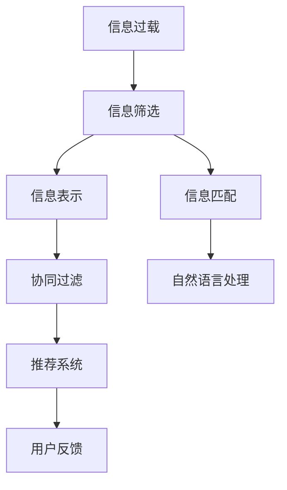

                 

# 信息过载与信息筛选策略与技术：在信息洪流中找到有价值的信息

## 1. 背景介绍

### 1.1 问题由来

在信息时代，数据和信息的总量呈爆炸式增长，人们获取和处理信息的能力却无法同步提升。面对海量、异构、复杂的信息，如何有效筛选和组织信息，成为了当代信息社会亟待解决的问题。信息过载（Information Overload），即信息的数量超出了人们处理能力的极限，导致了注意力分散、决策困难、认知负担等问题。

信息筛选（Information Filtering），是指从海量信息中选出与用户需求相关、有价值的信息。信息筛选技术广泛应用于内容推荐、搜索引擎、社交网络等场景中，帮助用户高效地获取关键信息，提升信息检索效率。

### 1.2 问题核心关键点

信息筛选的目的是在信息洪流中找到对用户有用的信息。问题的关键在于：

1. **用户需求多样性**：不同用户的兴趣、需求千差万别，如何构建一个能适应多用户的通用模型。
2. **信息表示与匹配**：如何将信息转化为可计算的表示，匹配用户需求，找到相关性高的信息。
3. **算法效率与效果**：在保证算法效果的同时，如何提升处理大规模数据集的效率。
4. **交互与反馈**：如何通过用户反馈不断优化算法，提升信息筛选的精准度。
5. **隐私与安全**：如何在信息筛选中保护用户隐私，防止数据泄露和滥用。

### 1.3 问题研究意义

信息筛选技术的研究对于提升信息获取效率、缓解信息过载、提升决策质量具有重要意义：

1. **提升信息效率**：通过高效的信息筛选，用户可以快速找到所需信息，提高工作学习效率。
2. **缓解信息过载**：筛选技术能够过滤掉无关信息，减少信息噪音，减轻用户认知负担。
3. **提升决策质量**：相关信息的聚合有助于用户做出更全面的决策，减少因信息不对称导致的错误判断。
4. **支持个性化服务**：通过分析用户行为和偏好，为用户提供定制化信息服务，提升用户体验。
5. **支持数据驱动决策**：在企业决策中，信息筛选技术可以提供关键数据支持，辅助管理层做出更精准的决策。

## 2. 核心概念与联系

### 2.1 核心概念概述

为更好地理解信息筛选技术，本节将介绍几个关键概念：

- **信息过载**：信息数量超出用户处理能力，导致注意力分散、认知负担增加。
- **信息筛选**：从海量信息中选出对用户有用的信息。
- **信息表示**：将信息转换为计算机可处理的表示形式，如文本向量、特征向量等。
- **信息匹配**：通过计算模型匹配用户需求与信息表示，找出相关性高的信息。
- **协同过滤**：利用用户间交互的相似性，推荐相关物品或信息。
- **自然语言处理**：利用自然语言处理技术，如分词、情感分析等，对文本信息进行处理。
- **推荐系统**：基于用户行为、物品属性、协同过滤等算法，为用户推荐个性化内容。

这些概念之间的逻辑关系可以通过以下Mermaid流程图来展示：



这个流程图展示了好几个关键概念之间的联系：

1. 信息过载驱动了信息筛选的需求。
2. 信息筛选的输入是信息表示，经过信息匹配，输出推荐结果。
3. 协同过滤和自然语言处理是信息匹配的重要手段。
4. 推荐系统基于协同过滤和信息匹配的结果，实现个性化推荐。
5. 用户反馈用于不断优化推荐算法，提升系统效果。

这些概念共同构成了信息筛选的核心框架，帮助用户在海量信息中找到有价值的内容。

## 3. 核心算法原理 & 具体操作步骤
### 3.1 算法原理概述

信息筛选技术的核心算法包括协同过滤、基于内容的推荐、基于模型的推荐等。这里主要介绍基于内容的推荐和基于模型的推荐。

基于内容的推荐（Content-Based Filtering, CB），是通过分析用户历史行为和物品属性，找出用户可能感兴趣的物品。这种方法适用于信息库较为稠密的情况，易于理解和实现。

基于模型的推荐（Model-Based Filtering, MB），是通过构建推荐模型，预测用户对物品的评分，从而推荐物品。这种方法可以处理稀疏矩阵，且效果通常优于基于内容的推荐。

### 3.2 算法步骤详解

**基于内容的推荐**：

1. **用户行为分析**：收集用户的历史行为数据，如浏览、点击、评分等。
2. **物品属性提取**：提取物品的属性特征，如标题、描述、标签等。
3. **相似度计算**：通过余弦相似度、欧氏距离等方法，计算用户行为与物品属性之间的相似度。
4. **推荐排序**：根据相似度排序，将与用户兴趣最相关的物品推荐给用户。

**基于模型的推荐**：

1. **数据预处理**：将用户行为和物品属性数据转换为矩阵形式。
2. **模型训练**：选择合适的模型（如矩阵分解、神经网络等），对用户行为和物品属性进行训练，得到推荐模型。
3. **预测评分**：利用训练好的模型，预测用户对物品的评分，作为推荐依据。
4. **推荐排序**：根据评分排序，将高评分的物品推荐给用户。

### 3.3 算法优缺点

基于内容的推荐方法具有以下优点：

1. **易于理解**：基于用户的明确行为和物品属性，推荐逻辑简单直观。
2. **泛化性好**：对新物品和新用户的推荐效果通常较好。
3. **不依赖评分数据**：不需要用户对物品进行评分，适合冷启动场景。

基于内容的推荐方法也存在以下缺点：

1. **对物品属性依赖大**：物品属性的完整性和准确性直接影响推荐效果。
2. **依赖用户行为数据**：需要大量历史行为数据，才能有效分析用户偏好。
3. **难以处理稀疏数据**：在用户行为矩阵稀疏的情况下，难以进行准确的相似度计算。

基于模型的推荐方法具有以下优点：

1. **处理稀疏矩阵**：能够处理用户行为矩阵的稀疏性，推荐效果较好。
2. **多模态信息融合**：可以结合用户行为、物品属性、时间等多模态信息，提升推荐精度。
3. **适应性强**：可以处理多种推荐任务，如基于用户兴趣的推荐、基于时间序列的推荐等。

基于模型的推荐方法也存在以下缺点：

1. **模型复杂度高**：模型训练和预测过程较为复杂，计算成本高。
2. **数据质量要求高**：需要高质量的用户行为数据和物品属性数据。
3. **冷启动困难**：对于新用户和新物品，模型预测效果较差。

### 3.4 算法应用领域

基于内容的推荐和基于模型的推荐在多个领域都有广泛应用：

1. **电子商务**：如淘宝、亚马逊等电商平台，为用户推荐商品。
2. **社交网络**：如微博、微信等社交平台，为用户推荐内容。
3. **视频网站**：如YouTube、Netflix等视频网站，为用户推荐视频。
4. **新闻推荐**：如今日头条、网易新闻等新闻平台，为用户推荐新闻。
5. **音乐推荐**：如Spotify、网易云音乐等音乐平台，为用户推荐歌曲。
6. **广告推荐**：如Google Adwords、Facebook Ads等广告平台，为用户推荐广告。

## 4. 数学模型和公式 & 详细讲解 & 举例说明
### 4.1 数学模型构建

为了更好地理解基于模型的推荐算法，这里给出常见的协同过滤和基于矩阵分解的推荐模型的数学模型。

**协同过滤**：

协同过滤算法可以通过用户-物品评分矩阵 $R$ 来表示，其中 $R_{ui}$ 表示用户 $u$ 对物品 $i$ 的评分。

协同过滤的目标是找出用户 $u$ 可能感兴趣的物品 $i$，即求解 $i$ 使得 $R_{ui}$ 尽可能大。常用的协同过滤方法有基于用户的协同过滤和基于物品的协同过滤。

基于用户的协同过滤，是指通过找到与用户 $u$ 兴趣相似的用户 $v$，推荐 $v$ 喜欢的物品。

基于物品的协同过滤，是指通过找到与物品 $i$ 相似的物品 $j$，推荐 $j$ 被用户喜欢的物品。

**基于矩阵分解的推荐模型**：

基于矩阵分解的推荐模型，通常通过将用户行为矩阵 $R$ 分解为两个低秩矩阵 $U$ 和 $V$ 的乘积来表示。其中 $U$ 表示用户矩阵，$V$ 表示物品矩阵，$R=U\times V$。

设用户 $u$ 和物品 $i$ 的嵌入向量为 $u_i$ 和 $v_i$，则推荐模型的目标是最小化预测评分与实际评分的平方误差，即：

$$
\min_{U,V}\frac{1}{2} \sum_{u,i}\|U_uV_i-R_{ui}\|^2
$$

通过求解上述优化问题，可以得到用户和物品的嵌入向量 $u_i$ 和 $v_i$，从而得到用户对物品的预测评分 $\hat{R}_{ui}=U_u\times V_i$。

### 4.2 公式推导过程

**基于矩阵分解的推荐模型**：

上述优化问题可以使用梯度下降等优化算法求解。设 $U$ 和 $V$ 的更新规则为：

$$
U \leftarrow U - \eta \nabla_{U}\mathcal{L}(U,V)
$$

$$
V \leftarrow V - \eta \nabla_{V}\mathcal{L}(U,V)
$$

其中 $\eta$ 为学习率，$\mathcal{L}(U,V)$ 为损失函数。

**基于用户的协同过滤**：

基于用户的协同过滤，可以采用余弦相似度计算用户间的相似度 $sim(u,v)$，推荐物品的方法为：

$$
\hat{R}_{ui} \leftarrow \max_{i\in \mathcal{I}} \sum_{v\in \mathcal{U}}R_{vi} \times sim(u,v)
$$

其中 $\mathcal{I}$ 表示物品集合，$\mathcal{U}$ 表示用户集合。

**基于物品的协同过滤**：

基于物品的协同过滤，可以采用余弦相似度计算物品间的相似度 $sim(i,j)$，推荐物品的方法为：

$$
\hat{R}_{ui} \leftarrow \max_{i\in \mathcal{I}} R_{vi} \times sim(i,j)
$$

### 4.3 案例分析与讲解

**示例：用户兴趣推荐**

假设有一个电商平台，收集了用户的历史行为数据 $R$，每个用户对每个物品的评分表示为 $R_{ui}$。设用户 $u$ 对物品 $i$ 的嵌入向量为 $u_i$ 和 $v_i$，可以通过矩阵分解的方法，求出用户 $u$ 对物品 $i$ 的预测评分 $\hat{R}_{ui}$。

具体步骤如下：

1. 将用户行为矩阵 $R$ 分解为两个低秩矩阵 $U$ 和 $V$，即 $R=U\times V$。
2. 计算用户 $u$ 和物品 $i$ 的预测评分 $\hat{R}_{ui}=U_u\times V_i$。
3. 根据 $\hat{R}_{ui}$ 的排序，向用户 $u$ 推荐评分最高的物品。

## 5. 项目实践：代码实例和详细解释说明
### 5.1 开发环境搭建

在进行信息筛选的实践前，我们需要准备好开发环境。以下是使用Python进行PyTorch开发的环境配置流程：

1. 安装Anaconda：从官网下载并安装Anaconda，用于创建独立的Python环境。

2. 创建并激活虚拟环境：
```bash
conda create -n pytorch-env python=3.8 
conda activate pytorch-env
```

3. 安装PyTorch：根据CUDA版本，从官网获取对应的安装命令。例如：
```bash
conda install pytorch torchvision torchaudio cudatoolkit=11.1 -c pytorch -c conda-forge
```

4. 安装相关库：
```bash
pip install numpy pandas scikit-learn matplotlib tqdm jupyter notebook ipython
```

完成上述步骤后，即可在`pytorch-env`环境中开始信息筛选实践。

### 5.2 源代码详细实现

这里我们以基于矩阵分解的推荐模型为例，给出使用PyTorch的代码实现。

首先，定义数据集和模型参数：

```python
import torch
from torch import nn
from torch.nn import Parameter

class Recommender(nn.Module):
    def __init__(self, n_users, n_items, latent_dim=50, learning_rate=0.01):
        super(Recommender, self).__init__()
        self.user_embedding = nn.Embedding(n_users, latent_dim)
        self.item_embedding = nn.Embedding(n_items, latent_dim)
        self.W = nn.Parameter(torch.randn(n_users, n_items))
        self.b = nn.Parameter(torch.randn(n_items))
        self.learning_rate = learning_rate
        
    def forward(self, user_ids, item_ids):
        u = self.user_embedding(user_ids)
        v = self.item_embedding(item_ids)
        pred = u @ v.t() + self.W[user_ids] + self.b[item_ids]
        return pred
```

然后，定义损失函数和优化器：

```python
from torch import nn
from torch.nn import BCELoss

def train_epoch(model, optimizer, user_ids, item_ids, ratings):
    model.train()
    optimizer.zero_grad()
    pred = model(user_ids, item_ids)
    loss = BCELoss()(pred, ratings)
    loss.backward()
    optimizer.step()
    return loss.item()

def evaluate(model, user_ids, item_ids, ratings):
    model.eval()
    with torch.no_grad():
        pred = model(user_ids, item_ids)
        loss = BCELoss()(pred, ratings)
    return loss.item()
```

最后，启动训练流程并在测试集上评估：

```python
import torch
from torch.utils.data import TensorDataset, DataLoader

# 准备数据
n_users = 1000
n_items = 1000
latent_dim = 50
learning_rate = 0.01
batch_size = 256

# 生成随机评分矩阵
R = torch.randn(n_users, n_items)

# 定义模型
model = Recommender(n_users, n_items, latent_dim, learning_rate)

# 定义优化器
optimizer = torch.optim.Adam(model.parameters(), lr=learning_rate)

# 训练
train_dataset = TensorDataset(user_ids, item_ids, ratings)
dev_dataset = TensorDataset(user_ids, item_ids, ratings)
test_dataset = TensorDataset(user_ids, item_ids, ratings)

for epoch in range(10):
    loss = train_epoch(model, optimizer, user_ids, item_ids, ratings)
    print(f"Epoch {epoch+1}, train loss: {loss:.3f}")
    
    print(f"Epoch {epoch+1}, dev results:")
    evaluate(model, user_ids, item_ids, ratings)
    
print("Test results:")
evaluate(model, user_ids, item_ids, ratings)
```

以上就是使用PyTorch对基于矩阵分解的推荐模型进行代码实现。可以看到，利用PyTorch的封装能力，我们可以很方便地实现基于矩阵分解的推荐模型。

### 5.3 代码解读与分析

让我们再详细解读一下关键代码的实现细节：

**Recommender类**：
- `__init__`方法：初始化模型参数和超参数，如用户嵌入层、物品嵌入层、权重矩阵和偏置向量。
- `forward`方法：前向传播，计算预测评分。

**train_epoch和evaluate函数**：
- 利用PyTorch的自动微分能力，计算损失函数。
- 使用Adam优化器进行参数更新，训练模型。
- 在测试集上评估模型效果，打印损失。

**训练流程**：
- 定义总迭代次数，启动循环。
- 每个epoch内，在训练集上训练模型，并在验证集上评估效果。
- 所有epoch结束后，在测试集上评估模型效果，打印结果。

可以看到，PyTorch配合神经网络框架，使得信息筛选的代码实现变得简洁高效。开发者可以将更多精力放在模型改进和数据处理上，而不必过多关注底层的实现细节。

## 6. 实际应用场景
### 6.1 智能推荐系统

智能推荐系统是信息筛选技术的重要应用领域之一，广泛应用于电子商务、社交网络、视频平台等场景。

**电子商务**：
- 在电商平台，通过分析用户浏览、点击、购买等行为，推荐用户可能感兴趣的商品。
- 利用用户评分数据，提升推荐模型的准确性。
- 结合用户属性、物品属性、时间等信息，实现个性化推荐。

**社交网络**：
- 在社交平台，根据用户浏览、点赞、分享等行为，推荐可能感兴趣的内容。
- 利用用户的社交关系，实现信息共享和扩散。
- 结合用户标签、兴趣等信息，推荐相关群组和话题。

**视频平台**：
- 在视频网站，根据用户观看历史、评分数据，推荐可能感兴趣的视频。
- 利用用户行为数据，实现视频推荐和内容创作。
- 结合视频标签、时长等信息，实现智能播放和推荐。

### 6.2 新闻推荐系统

新闻推荐系统通过分析用户的阅读习惯、浏览历史等数据，为用户推荐新闻内容。

**传统媒体**：
- 通过用户订阅、阅读行为，推荐相关新闻和文章。
- 利用编辑推送和算法推荐，提升新闻的曝光度和覆盖面。
- 结合新闻标签、分类等信息，实现精准推荐。

**社交媒体**：
- 通过用户分享、评论等行为，推荐相关新闻和内容。
- 利用社交网络传播，实现新闻的广泛传播和影响。
- 结合用户兴趣、话题等信息，实现个性化推荐。

**聚合平台**：
- 通过爬取和聚合新闻数据，为用户提供全站新闻推荐。
- 利用算法和编辑双重机制，提升新闻质量和用户体验。
- 结合搜索和推荐技术，实现信息检索和个性化推荐。

### 6.3 广告推荐系统

广告推荐系统通过分析用户的浏览、点击、购买等行为，推荐相关广告内容。

**搜索广告**：
- 在搜索引擎，根据用户的查询行为，推荐相关广告。
- 利用搜索关键词，实现精准广告投放。
- 结合用户属性、兴趣等信息，提升广告效果。

**展示广告**：
- 在网站、应用等平台上，根据用户的浏览行为，推荐相关广告。
- 利用展示位置和时序信息，实现动态广告投放。
- 结合用户行为数据和上下文信息，提升广告转化率。

**视频广告**：
- 在视频平台，根据用户的观看行为，推荐相关视频广告。
- 利用视频内容标签和用户兴趣，实现精准广告投放。
- 结合视频播放和广告播放，提升广告互动性。

### 6.4 未来应用展望

未来，信息筛选技术将在更多领域得到广泛应用，为各行各业带来颠覆性变革。

1. **医疗健康**：
   - 利用患者病历、体检数据，推荐个性化治疗方案。
   - 结合医生经验，实现精准医学诊断。
   - 利用健康数据，实现疾病预警和预防。

2. **金融行业**：
   - 分析客户交易数据，推荐个性化理财方案。
   - 利用舆情分析，实现市场监控和风险预警。
   - 结合用户画像，实现精准广告投放和客户服务。

3. **教育培训**：
   - 分析学生学习数据，推荐个性化学习内容。
   - 利用在线互动，实现个性化教学。
   - 结合学习行为，实现学习效果评估和提升。

4. **智能家居**：
   - 分析用户行为数据，推荐个性化家居服务。
   - 利用智能设备数据，实现场景联动和自动化控制。
   - 结合用户偏好，实现个性化家庭管理。

5. **智慧城市**：
   - 分析城市运行数据，推荐城市管理策略。
   - 利用智能感知设备，实现城市运营优化。
   - 结合用户需求，实现智慧交通、环保等公共服务。

6. **智能制造**：
   - 分析生产数据，推荐优化方案和维护计划。
   - 利用设备数据，实现智能生产和质量控制。
   - 结合工况数据，实现生产过程的动态调整和优化。

## 7. 工具和资源推荐
### 7.1 学习资源推荐

为了帮助开发者系统掌握信息筛选技术，这里推荐一些优质的学习资源：

1. 《推荐系统实战》：这本书详细介绍了推荐系统的工作原理、算法设计和实现技巧，适合有一定基础的开发者阅读。
2. 《深度学习与推荐系统》：这本书系统讲解了深度学习在推荐系统中的应用，涵盖协同过滤、矩阵分解等经典算法。
3. 《信息检索与信息检索系统》：这本书详细介绍了信息检索的理论基础和实现方法，适合对信息检索感兴趣的读者。
4. 《自然语言处理综论》：这本书涵盖了自然语言处理的核心技术和应用场景，适合对NLP感兴趣的读者。
5. 《Python数据科学手册》：这本书全面介绍了Python在数据科学中的应用，包括数据处理、机器学习等，适合初学者入门。
6. 《Python深度学习》：这本书详细讲解了深度学习的基础知识和技术应用，适合有编程基础的读者。

通过对这些资源的学习实践，相信你一定能够快速掌握信息筛选技术的精髓，并用于解决实际的NLP问题。

### 7.2 开发工具推荐

高效的开发离不开优秀的工具支持。以下是几款用于信息筛选开发的常用工具：

1. PyTorch：基于Python的开源深度学习框架，灵活动态的计算图，适合快速迭代研究。
2. TensorFlow：由Google主导开发的开源深度学习框架，生产部署方便，适合大规模工程应用。
3. Scikit-learn：Python的机器学习库，提供了丰富的机器学习算法和工具。
4. Pandas：Python的数据处理库，提供了高效的数据操作和分析功能。
5. Numpy：Python的数值计算库，提供了高效的数组操作和数学运算。
6. Jupyter Notebook：Python的交互式开发环境，方便快速验证算法和数据处理。

合理利用这些工具，可以显著提升信息筛选任务的开发效率，加快创新迭代的步伐。

### 7.3 相关论文推荐

信息筛选技术的研究源于学界的持续探索。以下是几篇奠基性的相关论文，推荐阅读：

1. "A Collaborative Approach to Multiuser Recommendation"：Wang等人在2005年发表的论文，提出基于协同过滤的推荐系统框架，奠定了协同过滤算法的基础。
2. "Matrix Factorization Techniques for Recommender Systems"：Koren在2009年发表的论文，提出基于矩阵分解的推荐模型，展示了其在推荐系统中的应用效果。
3. "An Analysis of Recommendation Algorithms with Explicit Feedback"：Bell等人在2007年发表的论文，系统分析了基于内容的推荐和协同过滤的优缺点，为推荐系统设计提供了理论基础。
4. "Item-based Collaborative Filtering Recommendation Algorithms"：Sarwar等人在2000年发表的论文，提出基于物品的协同过滤算法，并展示了其优于基于用户的协同过滤算法。
5. "Graph-Based Recommendation Systems"：Gao等人在2015年发表的论文，提出基于图结构的推荐模型，展示了其在推荐系统中的潜力。

这些论文代表了大信息筛选技术的发展脉络。通过学习这些前沿成果，可以帮助研究者把握学科前进方向，激发更多的创新灵感。

## 8. 总结：未来发展趋势与挑战
### 8.1 总结

本文对基于模型的信息筛选技术进行了全面系统的介绍。首先阐述了信息过载和信息筛选技术的研究背景和意义，明确了信息筛选技术在提升信息效率、缓解信息过载、提升决策质量方面的重要价值。其次，从原理到实践，详细讲解了基于模型的推荐算法，给出了代码实现示例。同时，本文还广泛探讨了信息筛选技术在多个行业领域的应用前景，展示了其在推荐系统、新闻推荐、广告推荐等场景中的应用潜力。此外，本文精选了信息筛选技术的各类学习资源，力求为读者提供全方位的技术指引。

通过本文的系统梳理，可以看到，基于模型的信息筛选技术正在成为信息处理的重要手段，极大地提升了大规模信息处理的能力。面对海量、异构、复杂的信息，信息筛选技术为构建高效、个性化的信息服务提供了重要保障。未来，随着模型的不断优化和算法的创新，信息筛选技术将在更多领域得到应用，为人类认知智能的进化带来深远影响。

### 8.2 未来发展趋势

展望未来，信息筛选技术将呈现以下几个发展趋势：

1. **深度学习方法的引入**：深度学习方法的引入，使得信息筛选模型可以处理更加复杂的非线性关系，提升推荐效果。
2. **多模态信息的融合**：利用文本、图像、音频等多模态信息，提升信息筛选的全面性和准确性。
3. **在线学习的引入**：利用在线学习算法，实现实时推荐，适应用户动态变化的需求。
4. **知识图谱的引入**：利用知识图谱中的结构化信息，提升信息筛选的推理能力。
5. **个性化推荐模型的优化**：通过模型结构优化和算法创新，提升个性化推荐的效果。
6. **分布式计算的引入**：利用分布式计算技术，处理大规模数据集，提升信息筛选的效率。
7. **联邦学习的引入**：利用联邦学习技术，保护用户隐私，实现分布式推荐。
8. **冷启动问题的解决**：通过多源数据融合和用户行为预测，提升冷启动效果。

这些趋势凸显了信息筛选技术的广阔前景。这些方向的探索发展，必将进一步提升信息筛选模型的性能和应用范围，为构建高效、个性化的信息服务提供新的技术路径。

### 8.3 面临的挑战

尽管信息筛选技术已经取得了不少进展，但在迈向更加智能化、普适化应用的过程中，它仍面临着诸多挑战：

1. **数据质量要求高**：高质量的标注数据和用户行为数据是信息筛选模型的基础，数据质量直接影响推荐效果。
2. **模型复杂度高**：深度学习模型的训练和预测过程较为复杂，需要高性能的计算资源。
3. **隐私与安全**：如何在信息筛选过程中保护用户隐私，防止数据泄露和滥用，是一个重要的伦理问题。
4. **推荐效果难以控制**：如何保证推荐结果的公正性、多样性和稳定性，是一个挑战性的问题。
5. **冷启动困难**：对于新用户和新物品，模型推荐效果较差，需要结合多源数据和行为预测进行优化。
6. **实时性要求高**：在线推荐系统需要具备高实时性，以适应用户动态变化的需求。
7. **分布式计算成本高**：处理大规模数据集需要高性能的分布式计算环境，成本较高。
8. **算法鲁棒性不足**：模型在面对数据异常和攻击时，容易产生偏差和错误。

### 8.4 研究展望

面对信息筛选技术所面临的种种挑战，未来的研究需要在以下几个方面寻求新的突破：

1. **数据质量的提升**：收集高质量的用户行为数据和物品属性数据，提升信息筛选模型的基础。
2. **算法的优化**：优化深度学习模型和算法，提升推荐效果和实时性。
3. **隐私保护技术**：开发隐私保护技术，保护用户数据隐私，防止数据泄露和滥用。
4. **多模态信息的融合**：利用多模态信息，提升信息筛选的全面性和准确性。
5. **个性化推荐模型的优化**：通过模型结构优化和算法创新，提升个性化推荐的效果。
6. **分布式计算技术**：利用分布式计算技术，处理大规模数据集，提升信息筛选的效率。
7. **联邦学习的应用**：利用联邦学习技术，实现分布式推荐，保护用户隐私。
8. **冷启动问题的解决**：通过多源数据融合和用户行为预测，提升冷启动效果。
9. **推荐系统的公平性**：保证推荐结果的公正性、多样性和稳定性，防止偏见和歧视。
10. **推荐系统的透明度**：提升推荐系统的透明度和可解释性，增强用户信任。

这些研究方向的探索，必将引领信息筛选技术迈向更高的台阶，为构建高效、智能化的信息服务提供新的技术保障。面向未来，信息筛选技术还需要与其他人工智能技术进行更深入的融合，如知识表示、因果推理、强化学习等，多路径协同发力，共同推动信息筛选系统的进步。只有勇于创新、敢于突破，才能不断拓展信息筛选技术的边界，让智能技术更好地服务于人类社会。

## 9. 附录：常见问题与解答

**Q1：信息筛选技术如何处理冷启动问题？**

A: 冷启动问题是指对于新用户和新物品，推荐系统难以提供准确的推荐结果。常见的处理方式包括：

1. **基于内容的推荐**：利用物品属性、用户画像等非行为数据，进行推荐。
2. **协同过滤**：通过相似用户和物品之间的行为数据，进行推荐。
3. **混合推荐**：结合多种推荐算法，提升推荐效果。
4. **多源数据融合**：利用多源数据融合技术，提升推荐准确性。
5. **行为预测**：通过预测用户行为，提升推荐效果。
6. **个性化推荐模型**：通过模型结构优化和算法创新，提升个性化推荐的效果。

这些方法通常需要结合具体场景和数据特点，进行灵活设计和优化。

**Q2：信息筛选技术如何保证推荐结果的公正性、多样性和稳定性？**

A: 推荐结果的公正性、多样性和稳定性是信息筛选技术的重要指标。常见的处理方式包括：

1. **多样性约束**：在推荐模型中增加多样性约束，防止推荐结果过于集中。
2. **公平性约束**：在推荐模型中增加公平性约束，防止推荐结果出现偏见和歧视。
3. **稳定性约束**：在推荐模型中增加稳定性约束，防止推荐结果的波动。
4. **反馈机制**：通过用户反馈机制，实时调整推荐模型，提升推荐效果。
5. **多模态信息融合**：利用多模态信息，提升推荐结果的全面性和稳定性。
6. **多任务学习**：结合多种任务，提升推荐模型的多目标优化能力。

这些方法通常需要结合具体场景和数据特点，进行灵活设计和优化。

**Q3：信息筛选技术如何处理推荐效果难以控制的问题？**

A: 推荐效果难以控制是指推荐结果的质量难以保证，可能导致用户的不满和信任危机。常见的处理方式包括：

1. **透明度提升**：增加推荐系统的透明度，让用户了解推荐过程和结果。
2. **多任务学习**：结合多种任务，提升推荐模型的多目标优化能力。
3. **反馈机制**：通过用户反馈机制，实时调整推荐模型，提升推荐效果。
4. **多源数据融合**：利用多源数据融合技术，提升推荐准确性。
5. **用户画像提升**：通过提升用户画像的质量，提升推荐效果。
6. **个性化推荐模型**：通过模型结构优化和算法创新，提升个性化推荐的效果。

这些方法通常需要结合具体场景和数据特点，进行灵活设计和优化。

**Q4：信息筛选技术如何保护用户隐私？**

A: 保护用户隐私是信息筛选技术的重要伦理问题。常见的处理方式包括：

1. **联邦学习**：利用联邦学习技术，在保护用户隐私的前提下，实现分布式推荐。
2. **差分隐私**：通过差分隐私技术，保护用户数据隐私，防止数据泄露和滥用。
3. **隐私保护技术**：利用隐私保护技术，保护用户数据隐私，防止数据泄露和滥用。
4. **多源数据融合**：利用多源数据融合技术，保护用户数据隐私，防止数据泄露和滥用。
5. **匿名化处理**：对用户数据进行匿名化处理，保护用户隐私。

这些方法通常需要结合具体场景和数据特点，进行灵活设计和优化。

**Q5：信息筛选技术如何提升推荐系统的实时性？**

A: 提升推荐系统的实时性是信息筛选技术的重要目标。常见的处理方式包括：

1. **在线学习**：利用在线学习算法，实现实时推荐，适应用户动态变化的需求。
2. **增量学习**：利用增量学习算法，快速更新推荐模型，提升推荐效果。
3. **分布式计算**：利用分布式计算技术，处理大规模数据集，提升信息筛选的效率。
4. **缓存技术**：利用缓存技术，减少数据加载时间，提升推荐效果。
5. **多级缓存**：利用多级缓存技术，提升推荐系统的响应速度。

这些方法通常需要结合具体场景和数据特点，进行灵活设计和优化。

---

作者：禅与计算机程序设计艺术 / Zen and the Art of Computer Programming

