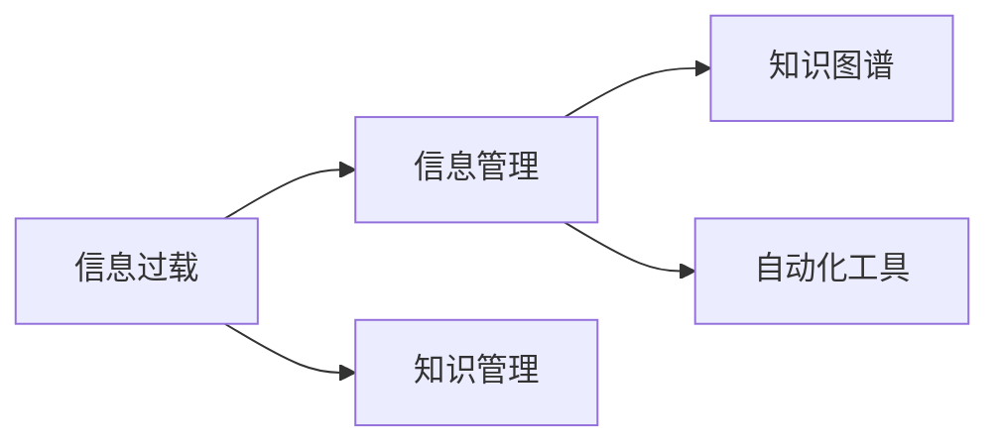

                 

# 信息过载与知识工作者：如何管理信息以提高生产力

## 1. 背景介绍

### 1.1 问题由来

随着信息技术的飞速发展，数据量呈指数级增长，几乎每一个知识工作者都需要应对海量的信息输入。面对数据源的爆炸式增长，如何高效地获取、处理、使用信息，成为了当代知识工作者面临的一大难题。信息过载不仅影响了工作效率，还可能造成决策失误，影响组织的战略发展。

信息过载的产生主要原因有：

- 信息传播渠道多样，如社交媒体、新闻网站、邮件系统、项目管理工具等，使得知识工作者难以在短时间内有效筛选有用信息。
- 数据量大、更新快，人工审核和筛选的信息量远远超出其处理能力。
- 信息质量参差不齐，有些数据可能与工作无关，或是过时、错误的信息，增加了噪音。

在知识工作者高强度工作的环境中，信息过载已成为制约生产力提升的关键因素。如果不能有效管理信息，工作进程将变得缓慢，产生错误决策的风险也会大幅提升。

### 1.2 问题核心关键点

知识工作者应对信息过载的主要问题包括：

- **信息筛选难度大**：在众多信息源中，如何识别和筛选出与工作相关的信息？
- **信息处理效率低**：对于需要人工处理的信息，如何降低处理时间，提升效率？
- **信息使用不当**：即便筛选出了重要信息，如何最大化地使用这些信息，提升工作成效？
- **信息共享困难**：对于团队协作的信息共享，如何确保信息透明、准确，并方便检索使用？

本文章将详细介绍如何通过一系列技术手段，帮助知识工作者有效管理信息，提升生产力。

## 2. 核心概念与联系

### 2.1 核心概念概述

为更好理解信息管理与生产力提升的关系，本节将介绍几个核心概念及其相互联系：

- **信息过载(Information Overload)**：指的是知识工作者面临的信息量超出了其有效处理和吸收的能力，导致决策和执行受阻。
- **知识工作者(Knowledge Worker)**：指依赖脑力劳动完成工作的人员，如研究人员、分析师、程序员等。
- **信息管理(Information Management)**：指的是通过技术手段，对信息进行收集、存储、检索、共享等过程的管理。
- **知识管理(Knowledge Management)**：将信息转化为知识，通过共享、传播和使用，最终形成组织智慧的过程。
- **知识图谱(Knowledge Graph)**：一种用图结构表示知识的网络模型，可以帮助快速检索和关联信息，提升信息使用效率。
- **自动化工具(Automation Tools)**：如自然语言处理(NLP)、推荐系统等，用于自动化信息处理和分析，减轻知识工作者的工作负担。

这些概念之间的逻辑关系可以通过以下Mermaid流程图来展示：



这个流程图展示了信息过载的源头，通过信息管理和知识管理这两个关键过程，借助知识图谱和自动化工具，最终帮助知识工作者提高生产力。

## 3. 核心算法原理 & 具体操作步骤

### 3.1 算法原理概述

信息管理与知识工作者的生产力提升，本质上是通过一系列信息处理和知识提取的算法和工具，实现对信息的高效利用。具体算法原理如下：

**信息过滤(Information Filtering)**：从海量信息中筛选出与工作相关的信息，减少信息过载。常见的信息过滤算法包括基于规则的过滤、协同过滤、内容过滤等。

**知识抽取(Knowledge Extraction)**：从文本、图像、音频等多种信息源中提取结构化知识，形成有价值的信息片段。常见的知识抽取方法包括命名实体识别、关系抽取、事件抽取等。

**推荐系统(Recommendation Systems)**：基于用户历史行为数据，推荐相关性和有价值的信息。推荐算法包括协同过滤、基于内容的推荐、深度学习推荐等。

**知识图谱(Knowledge Graphs)**：将知识组织成图结构，通过图算法实现高效的信息检索、关联和推理。常见的知识图谱构建方法包括知识抽取、实体关系抽取、图神经网络等。

### 3.2 算法步骤详解

基于上述算法原理，信息管理与知识工作者生产力提升的操作步骤如下：

**Step 1: 信息收集与存储**

1. 建立信息收集管道，通过API、爬虫、数据库导入等方式获取信息。
2. 对信息进行去重和清洗，确保数据质量。
3. 选择合适的存储方式，如关系型数据库、文档数据库、图形数据库等，存储和管理信息。

**Step 2: 信息过滤与筛选**

1. 分析信息需求，确定信息筛选的标准和规则。
2. 应用信息过滤算法，筛选出相关性高的信息。
3. 对筛选结果进行人工审核，确认最终信息集合。

**Step 3: 知识抽取与构建**

1. 选择知识抽取算法，从信息源中提取结构化知识。
2. 对提取的知识进行合并、去重和标准化，形成有价值的数据点。
3. 使用知识图谱工具，将知识构建成图结构，存储在知识库中。

**Step 4: 信息推荐与智能检索**

1. 收集用户行为数据，建立用户画像。
2. 设计推荐算法，根据用户画像推荐相关信息。
3. 使用图搜索算法，在知识图谱中高效检索相关信息。

**Step 5: 知识使用与共享**

1. 对推荐和检索的信息进行聚合与分析，形成有价值的洞察。
2. 利用可视化工具，将信息转化为图表、报表等形式，方便使用和共享。
3. 通过API接口和协作工具，将知识传递给其他知识工作者，促进共享和协作。

**Step 6: 持续优化与反馈**

1. 对信息过滤、知识抽取、推荐系统等模块进行持续优化，提高算法效果。
2. 收集用户反馈，调整信息管理策略，优化信息体验。

### 3.3 算法优缺点

信息管理与知识工作者生产力提升的算法，具有以下优缺点：

**优点**：

1. **提高信息筛选效率**：通过自动化算法，可以大幅减少人工筛选信息的时间，提升处理效率。
2. **知识检索与关联**：利用知识图谱和图算法，实现高效的智能检索和关联，便于知识工作者快速获取信息。
3. **个性化推荐**：根据用户行为和偏好，提供个性化的信息推荐，减少信息噪音。
4. **提升知识共享**：通过API接口和协作工具，方便知识工作者共享和获取信息，促进团队协作。

**缺点**：

1. **算法复杂度高**：需要处理大量数据，算法复杂度较高，计算资源消耗大。
2. **数据质量依赖性强**：算法的准确性高度依赖于输入数据的质量，数据错误可能导致错误决策。
3. **隐私与安全问题**：涉及大量个人信息，需要严格保护隐私，确保数据安全。

### 3.4 算法应用领域

信息管理与知识工作者生产力提升的算法，广泛应用于各种行业和场景，如：

- **企业管理**：通过信息过滤和知识管理，提升决策效率和执行效果。
- **医疗领域**：使用推荐系统和知识图谱，提高诊疗效率和医疗服务质量。
- **教育行业**：构建知识图谱和智能推荐系统，提供个性化学习方案，提升教学效果。
- **金融行业**：利用数据分析和推荐系统，发现投资机会，提升投资决策准确性。
- **零售业**：通过智能推荐和信息检索，提高用户体验和销售额。
- **新闻媒体**：使用自动化信息筛选和推荐，提升新闻推送和内容分发效率。

## 4. 数学模型和公式 & 详细讲解 & 举例说明

### 4.1 数学模型构建

信息管理与知识工作者生产力提升的数学模型，主要由以下几个部分构成：

1. **信息过滤模型**：基于规则的过滤模型，公式为：
   $$
   \text{Filtered Data} = \text{Original Data} \cap \text{Rule Set}
   $$
   其中，$\text{Original Data}$ 为原始数据，$\text{Rule Set}$ 为筛选规则。

2. **知识抽取模型**：命名实体识别（NER）模型，公式为：
   $$
   \text{Named Entities} = \text{Text} \rightarrow \text{Entity Set}
   $$
   其中，$\text{Text}$ 为文本数据，$\text{Entity Set}$ 为提取的命名实体。

3. **推荐系统模型**：协同过滤算法，公式为：
   $$
   \text{Recommended Items} = \text{User Profile} \times \text{Item Database} \times \text{Similarity Matrix}
   $$
   其中，$\text{User Profile}$ 为用户画像，$\text{Item Database}$ 为商品数据库，$\text{Similarity Matrix}$ 为相似度矩阵。

4. **知识图谱模型**：基于图神经网络的知识图谱构建模型，公式为：
   $$
   \text{Knowledge Graph} = \text{Knowledge Points} \rightarrow \text{Graph Structure}
   $$
   其中，$\text{Knowledge Points}$ 为知识节点，$\text{Graph Structure}$ 为图结构。

### 4.2 公式推导过程

以知识抽取模型为例，介绍命名实体识别（NER）模型的推导过程。

假设输入文本 $T$ 中包含多个实体，每个实体的类型（如人名、地名、机构名等）已知。NLP中的命名实体识别模型，使用条件随机场（CRF）或双向LSTM等模型，对文本进行标注，得到实体序列 $S$。模型输出 $S$ 中每个单词属于某个实体类型的概率 $P(\text{Type}|T_i)$。

以一个简单的LSTM模型为例，公式为：
$$
P(\text{Type}|T_i) = \text{softmax}(W_i\cdot \text{tanh}(X_i) + b_i)
$$
其中，$W_i$ 和 $b_i$ 为模型参数，$X_i$ 为输入向量，$T_i$ 为文本中的单词，$\text{softmax}$ 函数将模型输出映射为概率分布。

通过多轮标注和优化，模型能够准确识别文本中的实体类型，提取有价值的信息点。

### 4.3 案例分析与讲解

**案例1: 企业管理中的应用**

某企业需要处理大量的市场数据，包括竞争对手信息、客户反馈、销售数据等。企业可以通过信息过滤算法，筛选出与决策相关的市场数据，利用知识抽取模型提取重要信息点，构建知识图谱，并通过推荐系统向决策层推荐关键信息。同时，利用可视化工具将信息转化为图表，方便决策层快速查看和理解。

**案例2: 医疗领域的应用**

医院需要处理大量的病人数据和病历记录，通过信息过滤算法筛选出有价值的医疗信息，利用知识抽取模型提取病情描述、治疗方案等信息，构建知识图谱，帮助医生快速查找和关联相关信息。推荐系统可以根据医生的历史诊疗记录，推荐相关的医学知识和研究成果，提高诊疗效率。

## 5. 项目实践：代码实例和详细解释说明

### 5.1 开发环境搭建

信息管理与知识工作者生产力提升的项目开发，需要一个高效的开发环境。以下是一些常用的开发工具和环境：

1. **Python**：作为主要的编程语言，Python拥有丰富的NLP和推荐系统库。
2. **Jupyter Notebook**：用于编写和运行Python代码，支持代码单元格的执行和结果的可视化展示。
3. **TensorFlow**：谷歌开源的深度学习框架，适用于构建复杂的推荐系统和知识图谱。
4. **PyTorch**：Facebook开源的深度学习框架，支持动态图计算，适合NLP任务。
5. **Hugging Face Transformers**：提供了预训练模型和工具，便于微调和使用。

**安装步骤**：

1. 安装Anaconda：从官网下载并安装Anaconda，用于创建独立的Python环境。

2. 创建并激活虚拟环境：
```bash
conda create -n myenv python=3.8
conda activate myenv
```

3. 安装Python依赖库：
```bash
pip install pandas numpy scikit-learn scikit-networks gensim jupyter notebook transformers
```

4. 安装TensorFlow和PyTorch：
```bash
pip install tensorflow
pip install torch
```

5. 安装Hugging Face Transformers：
```bash
pip install transformers
```

完成上述步骤后，即可在`myenv`环境中开始信息管理与知识工作者生产力提升的开发。

### 5.2 源代码详细实现

下面以推荐系统为例，介绍如何使用Python和TensorFlow构建推荐模型。

**数据准备**：
1. 收集用户行为数据，包括浏览历史、购买记录等。
2. 对数据进行预处理和标准化。

**模型实现**：
1. 导入TensorFlow库，定义输入数据和模型结构。
```python
import tensorflow as tf
import tensorflow_datasets as tfds

# 定义输入数据
user_ids = tf.data.Dataset.from_tensor_slices(user_ids)
item_ids = tf.data.Dataset.from_tensor_slices(item_ids)

# 定义模型结构
model = tf.keras.Sequential([
    tf.keras.layers.Dense(128, activation='relu'),
    tf.keras.layers.Dense(128, activation='relu'),
    tf.keras.layers.Dense(1, activation='sigmoid')
])
```

2. 定义损失函数和优化器，训练模型。
```python
# 定义损失函数和优化器
loss = tf.keras.losses.BinaryCrossentropy()
optimizer = tf.keras.optimizers.Adam(learning_rate=0.001)

# 训练模型
model.compile(optimizer=optimizer, loss=loss)
model.fit(user_ids, item_ids, epochs=10, batch_size=32)
```

3. 定义推荐函数，生成推荐结果。
```python
def recommend(user_id):
    user_data = user_ids[user_id]
    item_predictions = model.predict(user_data)
    recommended_items = []
    for i, item in enumerate(item_ids):
        probability = item_predictions[i]
        if probability > 0.5:
            recommended_items.append(item.numpy())
    return recommended_items
```

**代码解读与分析**：

**用户数据预处理**：
- 从TensorFlow数据集库中获取用户行为数据，并进行预处理和标准化。
- 通过`tf.data.Dataset`对数据进行批处理和迭代，方便模型训练。

**模型结构设计**：
- 使用Keras定义神经网络模型，包括输入层、隐藏层和输出层。
- 隐藏层使用ReLU激活函数，输出层使用sigmoid函数，确保输出在0到1之间。

**模型训练与优化**：
- 使用二元交叉熵作为损失函数，Adam优化器进行参数更新。
- 设置训练轮数和批大小，进行模型训练。

**推荐函数设计**：
- 定义推荐函数，输入用户ID，获取用户的行为数据，并通过模型预测物品的推荐概率。
- 根据预测概率阈值，筛选出推荐物品ID，返回推荐结果。

**运行结果展示**：

使用上述代码和模型，我们可以对用户行为数据进行分析和推荐，帮助企业优化产品推荐，提升用户体验。

### 5.3 代码解读与分析

**用户数据预处理**：
- 使用`tf.data.Dataset.from_tensor_slices`将用户行为数据转换成TensorFlow的Dataset对象。
- 通过`tf.data.Dataset.shuffle`和`tf.data.Dataset.batch`对数据进行随机打乱和批处理，确保训练数据的多样性。

**模型结构设计**：
- 定义多层神经网络模型，使用`tf.keras.layers.Dense`构建全连接层。
- 通过`tf.keras.layers.Activation`设置激活函数。
- 使用`tf.keras.layers.Dense`和`tf.keras.layers.Activation`构建输出层，并设置激活函数。

**模型训练与优化**：
- 使用`tf.keras.Model.compile`对模型进行编译，定义损失函数和优化器。
- 通过`tf.keras.Model.fit`进行模型训练，设置训练轮数和批大小。
- 使用`tf.keras.Model.predict`进行模型预测，获取推荐结果。

**推荐函数设计**：
- 定义推荐函数，输入用户ID，获取用户的行为数据，并通过模型预测物品的推荐概率。
- 根据预测概率阈值，筛选出推荐物品ID，返回推荐结果。

## 6. 实际应用场景

### 6.1 企业管理

**场景描述**：
某公司业务涉及多个部门，数据量大且复杂，信息过载严重。公司需要建立信息管理系统，提升决策效率和执行效果。

**解决方案**：
1. **信息过滤**：通过规则引擎对公司内部的邮件、文档、项目数据等进行过滤，筛选出与决策相关的信息。
2. **知识抽取**：使用NLP技术对文本信息进行实体抽取，提取公司名称、产品名称、项目进度等信息。
3. **知识图谱**：构建公司内部知识图谱，方便员工快速查找和关联信息。
4. **推荐系统**：使用协同过滤算法，根据员工的历史行为数据，推荐相关的文档、项目和研究成果。
5. **可视化工具**：使用Tableau等可视化工具，将信息转化为图表，方便决策层快速查看和理解。

**效果分析**：
通过信息过滤和知识抽取，公司减少了信息过载，提高了决策效率。利用知识图谱和推荐系统，员工可以快速获取相关信息，提升工作效率。最终，公司决策层能够迅速掌握关键信息，做出更有依据的决策，推动公司发展。

### 6.2 医疗领域

**场景描述**：
某医院医疗数据量大，医生需要快速处理大量病历和病人信息，信息过载严重。医院需要建立信息管理系统，提升诊疗效率和医疗服务质量。

**解决方案**：
1. **信息过滤**：通过规则引擎对医院内部的病历数据、病人信息、实验室检查结果等进行过滤，筛选出与诊疗相关的信息。
2. **知识抽取**：使用NLP技术对文本信息进行实体抽取，提取病情描述、治疗方案等信息。
3. **知识图谱**：构建医疗知识图谱，方便医生快速查找和关联相关信息。
4. **推荐系统**：使用协同过滤算法，根据医生的历史诊疗记录，推荐相关的医学知识和研究成果。
5. **可视化工具**：使用Tableau等可视化工具，将信息转化为图表，方便医生快速查看和理解。

**效果分析**：
通过信息过滤和知识抽取，医院减少了信息过载，提高了诊疗效率。利用知识图谱和推荐系统，医生可以快速获取相关信息，提升诊疗质量。最终，医院能够迅速掌握关键信息，做出更有依据的诊疗决策，提升患者满意度。

## 7. 工具和资源推荐

### 7.1 学习资源推荐

为了帮助开发者系统掌握信息管理与知识工作者的生产力提升，这里推荐一些优质的学习资源：

1. **《自然语言处理综论》**：斯坦福大学自然语言处理课程，介绍了NLP的基础知识和算法，适合初学者和进阶开发者。
2. **《深度学习》**：Ian Goodfellow的深度学习书籍，全面介绍了深度学习的理论基础和实践技巧。
3. **《推荐系统》**：KDD2017上的推荐系统综述文章，介绍了推荐算法的基础和前沿进展。
4. **《Python机器学习》**：一个系统学习机器学习的教程，使用Python实现各种机器学习算法。
5. **《TensorFlow实战》**：谷歌开源的TensorFlow框架教程，适合TensorFlow初学者。
6. **《PyTorch教程》**：Facebook开源的PyTorch框架教程，适合PyTorch初学者。

通过对这些资源的学习实践，相信你一定能够快速掌握信息管理与知识工作者的生产力提升的精髓，并用于解决实际的NLP问题。

### 7.2 开发工具推荐

高效的开发离不开优秀的工具支持。以下是几款用于信息管理与知识工作者的生产力提升开发的常用工具：

1. **Python**：作为主要的编程语言，Python拥有丰富的NLP和推荐系统库。
2. **Jupyter Notebook**：用于编写和运行Python代码，支持代码单元格的执行和结果的可视化展示。
3. **TensorFlow**：谷歌开源的深度学习框架，适用于构建复杂的推荐系统和知识图谱。
4. **PyTorch**：Facebook开源的深度学习框架，支持动态图计算，适合NLP任务。
5. **Hugging Face Transformers**：提供了预训练模型和工具，便于微调和使用。
6. **ELK Stack**：用于日志收集和分析的开源工具栈，方便构建信息管理系统。

合理利用这些工具，可以显著提升信息管理与知识工作者的生产力提升的开发效率，加快创新迭代的步伐。

### 7.3 相关论文推荐

信息管理与知识工作者的生产力提升的研究源于学界的持续研究。以下是几篇奠基性的相关论文，推荐阅读：

1. **《自然语言处理综论》**：Stanford自然语言处理课程讲义，系统介绍了NLP的基本概念和算法。
2. **《深度学习》**：Ian Goodfellow的深度学习书籍，全面介绍了深度学习的理论基础和实践技巧。
3. **《推荐系统》**：KDD2017上的推荐系统综述文章，介绍了推荐算法的基础和前沿进展。
4. **《Python机器学习》**：一个系统学习机器学习的教程，使用Python实现各种机器学习算法。
5. **《TensorFlow实战》**：谷歌开源的TensorFlow框架教程，适合TensorFlow初学者。
6. **《PyTorch教程》**：Facebook开源的PyTorch框架教程，适合PyTorch初学者。

这些论文代表了大语言模型微调技术的发展脉络。通过学习这些前沿成果，可以帮助研究者把握学科前进方向，激发更多的创新灵感。

## 8. 总结：未来发展趋势与挑战

### 8.1 总结

本文对信息管理与知识工作者的生产力提升的方法进行了全面系统的介绍。首先阐述了信息过载对知识工作者的影响，明确了信息管理的重要性和紧迫性。其次，从原理到实践，详细讲解了信息过滤、知识抽取、推荐系统等关键算法，给出了具体代码实现。同时，本文还广泛探讨了信息管理与知识工作者生产力提升的应用场景，展示了其在多个领域的应用前景。此外，本文精选了信息管理与知识工作者生产力提升的相关学习资源和开发工具，力求为读者提供全方位的技术指引。

通过本文的系统梳理，可以看到，信息管理与知识工作者的生产力提升技术正在成为信息时代的重要范式，极大地拓展了知识工作者的信息处理能力，提高了工作效率。未来，伴随信息管理技术的不断发展，知识工作者能够更好地应对信息爆炸，提升决策和执行能力，推动组织发展。

### 8.2 未来发展趋势

展望未来，信息管理与知识工作者生产力提升技术将呈现以下几个发展趋势：

1. **智能推荐系统**：随着深度学习技术的不断发展，推荐系统将更加智能化，能够根据用户行为和兴趣，实时调整推荐内容，提供个性化的信息服务。
2. **知识图谱的普及**：知识图谱技术将逐步普及，成为信息管理的基础设施，提升信息检索和关联效率。
3. **跨领域知识融合**：通过跨领域知识融合，实现多模态信息的协同建模，提升信息管理的效果和质量。
4. **自动化知识抽取**：利用自然语言处理技术，实现自动化知识抽取和构建，提升知识管理效率。
5. **知识共享与协作**：通过知识共享和协作工具，实现知识在团队内的高效传递和共享，提升团队协作能力。
6. **信息安全的保障**：随着信息管理系统的广泛应用，信息安全和隐私保护将成为重要课题，需要加强数据保护和隐私管理。

以上趋势凸显了信息管理与知识工作者生产力提升技术的广阔前景。这些方向的探索发展，必将进一步提升信息管理的精度和效率，为知识工作者的生产力提升提供有力支撑。

### 8.3 面临的挑战

尽管信息管理与知识工作者生产力提升技术已经取得了瞩目成就，但在迈向更加智能化、普适化应用的过程中，它仍面临着诸多挑战：

1. **数据质量问题**：信息管理依赖于数据质量，数据错误或不完整会导致信息过载。
2. **算法复杂度**：复杂的算法和模型需要高昂的计算资源，限制了其在实际应用中的普及。
3. **隐私和安全**：涉及大量个人信息，数据安全和隐私保护成为重要问题。
4. **用户体验**：信息管理系统需要考虑用户体验，避免复杂和不友好的操作界面。
5. **多领域应用**：信息管理技术在不同领域的适应性和实用性需要不断改进。
6. **技术更新**：信息管理技术需要不断更新，以适应新的技术趋势和业务需求。

正视信息管理面临的这些挑战，积极应对并寻求突破，将是大语言模型微调走向成熟的必由之路。相信随着学界和产业界的共同努力，这些挑战终将一一被克服，信息管理技术必将带来信息时代的新一轮变革。

### 8.4 研究展望

面向未来，信息管理与知识工作者的生产力提升需要从以下几个方面进行深入研究：

1. **自动化和智能化**：开发更加自动化和智能化的信息管理系统，减少人工干预，提升信息管理效率。
2. **跨领域知识融合**：实现跨领域知识融合，提升信息管理的综合能力。
3. **知识图谱与推荐系统的结合**：利用知识图谱优化推荐系统，提升推荐效果和用户体验。
4. **隐私和安全保护**：研究数据安全和隐私保护的最新技术，保障用户数据安全。
5. **多模态信息处理**：研究多模态信息处理技术，提升信息管理的质量。
6. **用户体验优化**：研究用户体验设计的最新方法，提升信息管理系统的可用性。

这些研究方向将引领信息管理与知识工作者生产力提升技术迈向更高的台阶，为信息时代的信息管理提供新的突破。只有勇于创新、敢于突破，才能不断拓展信息管理的边界，让信息管理技术更好地服务于信息时代的发展。

