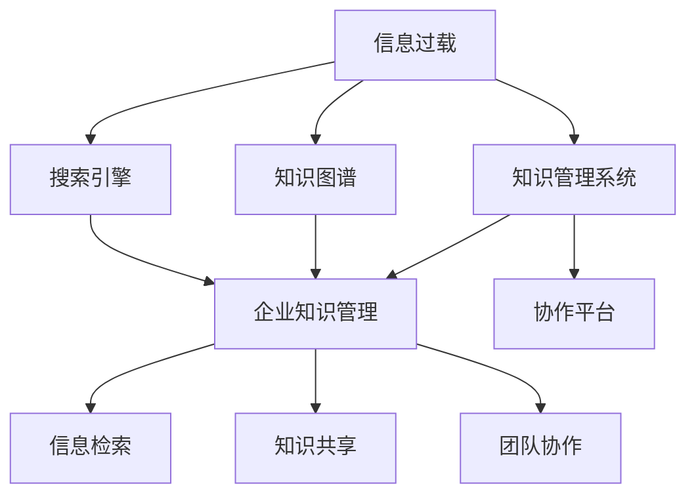
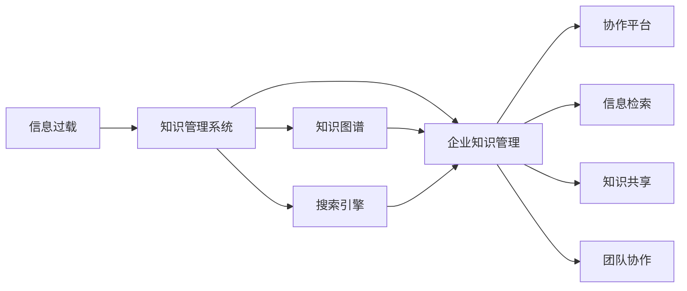

                 

# 信息过载与知识管理系统实施：管理和组织信息以提高生产力

> 关键词：信息过载, 知识管理系统, 信息管理, 知识图谱, 搜索引擎, 企业知识管理, 协作平台

## 1. 背景介绍

### 1.1 问题由来
在现代社会中，信息量呈爆炸式增长，我们面临前所未有的信息过载问题。根据IBM的报告，一名典型的知识工作者每天需要检查数百封邮件，浏览数十篇新闻，处理多个会议，并在工作中处理来自不同部门和团队的大量信息。信息过载不仅增加了人们的认知负担，影响了工作效率，还可能导致决策失误和错失重要机会。

信息过载的根源在于信息的爆炸性增长和人们对信息处理能力有限的矛盾。一方面，企业内部和外部产生了海量的结构化和非结构化数据；另一方面，这些数据未被有效地组织和利用，未能转化为企业竞争优势。因此，知识管理系统的构建和实施成为了企业提高生产力的重要手段。

## 2. 核心概念与联系

### 2.1 核心概念概述

在知识管理系统的构建和实施过程中，涉及以下几个核心概念：

- **信息过载（Information Overload）**：指当信息量超出了人的认知处理能力时，所引起的一种认知负荷状态。这种过载状态不仅影响个人的工作效率，也阻碍组织的信息交流和决策过程。

- **知识管理系统（Knowledge Management System, KMS）**：通过信息技术手段，组织、存储、共享、利用和管理企业内外的显性和隐性知识，以提高企业创新能力、竞争力和生产力的一种系统。

- **知识图谱（Knowledge Graph）**：一种将语义信息结构化的表示方式，以图形化的方式展示实体、属性和关系，使得知识更易于检索、关联和应用。

- **搜索引擎（Search Engine）**：一种从大量信息中快速定位所需信息的工具，通过自然语言处理、索引技术等手段，实现高效的信息检索。

- **企业知识管理（Enterprise Knowledge Management, EKM）**：涵盖组织内部知识获取、共享、协作和创新的全过程，以提升企业整体的知识水平和竞争力。

- **协作平台（Collaboration Platform）**：支持信息交流、项目管理、任务分配和团队协作的工具，实现知识共享和团队协同工作的目的。

这些概念之间的逻辑关系可以通过以下Mermaid流程图来展示：



这个流程图展示了信息过载、知识管理系统与相关概念之间的联系：

1. 信息过载通过知识管理系统得以缓解，进而通过知识图谱、搜索引擎等工具进行高效的信息检索和知识共享。
2. 企业知识管理涵盖知识管理系统、协作平台等多个模块，实现从知识获取到知识应用的全过程。
3. 协作平台支持团队协作和知识共享，是知识管理系统的重要组成部分。

### 2.2 核心概念原理和架构的 Mermaid 流程图



该流程图详细展示了知识管理系统与其他相关概念的架构关系，通过知识图谱和搜索引擎实现高效的信息检索，通过协作平台实现知识共享和团队协作，从而缓解信息过载问题。

## 3. 核心算法原理 & 具体操作步骤

### 3.1 算法原理概述

知识管理系统的构建和实施主要包括以下几个核心算法：

- **知识分类算法**：将大量信息进行分类和整理，使得信息有结构、可管理、可检索。

- **知识抽取算法**：从文本、文档、图片、音频等非结构化数据中提取结构化知识，供知识图谱和搜索引擎使用。

- **知识图谱构建算法**：将提取的结构化知识转化为知识图谱，以图形化方式表示实体、属性和关系。

- **搜索引擎算法**：实现从知识图谱中快速检索信息，提供高效的信息检索功能。

- **推荐算法**：根据用户兴趣和行为，推荐相关知识和信息，促进知识的个性化共享。

- **知识共享与协作算法**：通过协作平台，实现知识共享、协作和创新，提高企业整体的知识水平。

### 3.2 算法步骤详解

#### 3.2.1 知识分类算法

知识分类算法主要分为两大类：基于规则和基于机器学习的方法。

**基于规则的方法**：
1. 定义分类规则和标准，如关键词、主题、标签等。
2. 根据预定义的规则对信息进行分类。

**基于机器学习的方法**：
1. 收集大量的已分类信息样本。
2. 使用分类算法（如决策树、支持向量机、神经网络等）学习分类模型。
3. 使用模型对新信息进行分类。

#### 3.2.2 知识抽取算法

知识抽取算法主要通过自然语言处理（NLP）技术，从非结构化数据中提取结构化知识，构建知识图谱。

**步骤1**：预处理原始数据，如分词、去停用词、词性标注等。

**步骤2**：使用命名实体识别（NER）算法识别实体，如人名、地名、机构名等。

**步骤3**：使用关系抽取算法识别实体之间的关系，如“生活在”、“工作于”等。

**步骤4**：构建实体关系图谱，形成知识图谱的基本结构。

#### 3.2.3 知识图谱构建算法

知识图谱构建算法主要涉及以下几个步骤：

**步骤1**：收集语料，包括网页、文档、论文、报告等。

**步骤2**：使用知识抽取算法提取结构化知识。

**步骤3**：使用图数据库（如Neo4j）存储知识图谱，构建节点和边。

**步骤4**：通过实体对齐算法，解决不同数据源之间的实体冲突和歧义。

**步骤5**：使用可视化工具（如Gephi）展示知识图谱，方便用户检索和理解。

#### 3.2.4 搜索引擎算法

搜索引擎算法主要涉及以下几个步骤：

**步骤1**：建立索引，将知识图谱中的节点和边转换为索引项。

**步骤2**：使用倒排索引技术，将索引项与文档进行映射。

**步骤3**：使用查询解析算法，解析用户输入的查询语句。

**步骤4**：使用检索算法，在倒排索引中查找相关文档。

**步骤5**：使用排序算法，根据相关度对搜索结果进行排序。

#### 3.2.5 推荐算法

推荐算法主要涉及以下几个步骤：

**步骤1**：收集用户的历史行为数据，如浏览记录、点击记录、收藏记录等。

**步骤2**：使用协同过滤算法或基于内容的推荐算法，学习用户兴趣模型。

**步骤3**：使用推荐模型预测用户对未浏览信息的兴趣。

**步骤4**：根据推荐结果，推荐相关知识和信息。

#### 3.2.6 知识共享与协作算法

知识共享与协作算法主要涉及以下几个步骤：

**步骤1**：建立协作平台，如文档管理系统、任务管理系统、项目管理系统等。

**步骤2**：实现团队协作功能，如文件共享、任务分配、进度跟踪等。

**步骤3**：实现知识共享功能，如文档发布、讨论区、问答系统等。

**步骤4**：通过协作平台，促进团队协作和知识创新。

### 3.3 算法优缺点

#### 3.3.1 知识分类算法

**优点**：
1. 基于规则的方法简单易用，不需要大量标注数据。
2. 基于机器学习方法，可以通过大量样本进行模型训练，准确性较高。

**缺点**：
1. 基于规则的方法依赖于规则设计，需要不断优化和维护。
2. 基于机器学习的方法需要大量的标注数据，成本较高。

#### 3.3.2 知识抽取算法

**优点**：
1. 可以实现从非结构化数据中提取结构化知识，结构化程度高。
2. 支持多种数据源和数据格式，灵活性高。

**缺点**：
1. 技术复杂度高，需要具备一定的NLP和知识图谱构建能力。
2. 数据源可能存在噪声和不一致性，需要进一步清洗和处理。

#### 3.3.3 知识图谱构建算法

**优点**：
1. 可视化展示知识图谱，便于用户理解和应用。
2. 支持实体对齐和冲突解决，提高知识图谱的准确性。

**缺点**：
1. 存储和查询复杂，需要高性能计算资源。
2. 需要不断更新和维护，保证知识图谱的时效性。

#### 3.3.4 搜索引擎算法

**优点**：
1. 提供高效的检索功能，支持模糊查询和自然语言查询。
2. 可以快速定位所需信息，提高工作效率。

**缺点**：
1. 需要建立和维护索引，消耗时间和计算资源。
2. 搜索结果排序复杂，需要高效的排序算法。

#### 3.3.5 推荐算法

**优点**：
1. 可以根据用户兴趣和行为进行个性化推荐，提高信息的相关性。
2. 可以实时更新推荐结果，动态调整推荐策略。

**缺点**：
1. 需要大量的用户行为数据，数据获取成本高。
2. 推荐算法复杂，需要高性能计算资源。

#### 3.3.6 知识共享与协作算法

**优点**：
1. 促进团队协作和知识共享，提高团队效率和创新能力。
2. 支持多种协作方式，灵活性高。

**缺点**：
1. 需要搭建和维护协作平台，成本较高。
2. 用户行为和数据隐私需要保护，需要考虑安全和合规问题。

### 3.4 算法应用领域

知识管理系统的构建和实施已经在多个领域得到了广泛应用，例如：

- **企业知识管理**：支持企业内部知识的获取、共享、协作和创新，提升企业的整体知识水平和竞争力。
- **科研机构**：通过知识图谱和搜索引擎，支持科研人员获取和共享科研成果，加速科研创新。
- **图书馆**：利用搜索引擎和知识图谱，提供高效的图书检索和推荐服务，提升图书馆服务质量。
- **医疗机构**：通过知识共享与协作平台，支持医生和患者之间的沟通和协作，提高医疗服务的质量和效率。
- **政府机构**：利用知识管理工具，支持政策制定和决策支持，提升政府服务水平和效率。

除了上述这些经典应用外，知识管理系统还被创新性地应用到更多场景中，如智能客服、社交媒体管理、智能制造等，为各行各业的知识管理和信息应用带来了新的突破。

## 4. 数学模型和公式 & 详细讲解

### 4.1 数学模型构建

#### 4.1.1 知识分类模型

知识分类模型主要涉及分类算法和分类规则的构建。以决策树分类算法为例，构建分类模型的步骤如下：

1. 定义训练数据集 $D=\{(x_i,y_i)\}_{i=1}^N$，其中 $x_i$ 表示特征向量，$y_i$ 表示分类标签。

2. 选择决策树算法，如CART（Classification and Regression Tree）。

3. 训练决策树模型 $T$，使得 $T$ 最小化分类误差 $E$。

$$
E = \sum_{i=1}^N \mathbb{I}(y_i \neq T(x_i))
$$

4. 使用训练好的决策树模型 $T$ 对新信息 $x$ 进行分类。

$$
\hat{y} = T(x)
$$

#### 4.1.2 知识抽取模型

知识抽取模型主要涉及实体识别和关系抽取。以基于序列标注的命名实体识别（NER）算法为例，模型的构建步骤如下：

1. 定义标注数据集 $D=\{(x_i,y_i)\}_{i=1}^N$，其中 $x_i$ 表示原始文本，$y_i$ 表示标注结果。

2. 选择NER算法，如CRF（Conditional Random Field）或BiLSTM-CRF。

3. 训练NER模型 $M$，使得 $M$ 最小化标注误差 $E$。

$$
E = \sum_{i=1}^N \mathbb{I}(y_i \neq M(x_i))
$$

4. 使用训练好的NER模型 $M$ 对新文本 $x$ 进行实体识别，得到实体列表 $E$。

$$
E = M(x)
$$

#### 4.1.3 知识图谱构建模型

知识图谱构建模型主要涉及知识抽取和图数据库存储。以基于实体对齐的知识图谱构建算法为例，模型的构建步骤如下：

1. 定义知识图谱 $G=\{V,E\}$，其中 $V$ 表示节点集合，$E$ 表示边集合。

2. 收集语料，提取结构化知识。

3. 构建初步的知识图谱 $G_0=\{V_0,E_0\}$。

4. 定义实体对齐算法，如NameNet。

5. 对齐不同数据源中的实体，得到最终的知识图谱 $G$。

$$
G = \text{NameNet}(G_0)
$$

#### 4.1.4 搜索引擎模型

搜索引擎模型主要涉及索引构建和检索算法。以基于倒排索引的搜索引擎算法为例，模型的构建步骤如下：

1. 定义索引 $I=\{T,W\}$，其中 $T$ 表示索引项集合，$W$ 表示索引项对应的文档集合。

2. 构建倒排索引，将索引项 $t$ 与文档 $d$ 进行映射，得到 $I$。

3. 定义查询解析算法，如NLP解析器。

4. 解析用户查询语句 $q$，得到查询项 $Q$。

5. 使用检索算法，如向量空间模型（VSM），在倒排索引 $I$ 中查找相关文档 $D$。

6. 使用排序算法，如TF-IDF排序，对搜索结果进行排序。

$$
D = \text{VSM}(Q, I)
$$

#### 4.1.5 推荐模型

推荐模型主要涉及协同过滤算法或基于内容的推荐算法。以协同过滤算法为例，模型的构建步骤如下：

1. 定义用户-物品评分矩阵 $R=\{r_{ui}\}_{i=1}^N$，其中 $r_{ui}$ 表示用户 $u$ 对物品 $i$ 的评分。

2. 选择协同过滤算法，如基于用户的协同过滤（User-Based CF）或基于物品的协同过滤（Item-Based CF）。

3. 训练协同过滤模型 $M$，使得 $M$ 最小化推荐误差 $E$。

$$
E = \sum_{i=1}^N \mathbb{I}(r_{ui} \neq M(r_{uj}))
$$

4. 使用训练好的协同过滤模型 $M$ 对新用户 $u$ 和物品 $i$ 进行推荐。

$$
\hat{r}_{ui} = M(r_{uj})
$$

#### 4.1.6 协作平台模型

协作平台模型主要涉及协作管理和知识共享。以文档管理系统为例，模型的构建步骤如下：

1. 定义文档集合 $D=\{d_i\}_{i=1}^N$，其中 $d_i$ 表示文档。

2. 选择协作管理算法，如Git、SVN等。

3. 实现文档上传、版本控制、权限管理等功能。

4. 实现知识共享功能，如文档发布、讨论区、问答系统等。

5. 通过协作平台，促进团队协作和知识共享。

### 4.2 公式推导过程

#### 4.2.1 决策树分类模型

决策树分类模型的推导过程如下：

1. 定义训练数据集 $D=\{(x_i,y_i)\}_{i=1}^N$，其中 $x_i$ 表示特征向量，$y_i$ 表示分类标签。

2. 定义信息熵 $H(Y)$ 和信息增益 $IG(T,X)$。

3. 使用ID3算法构建决策树，使得决策树 $T$ 最小化信息熵 $H(Y)$。

$$
H(Y) = -\sum_{i=1}^N \frac{n_i}{N} \log \frac{n_i}{N}
$$

$$
IG(T,X) = H(Y) - \sum_{j=1}^k \frac{n_j}{N} H(Y_j)
$$

其中 $n_i$ 表示 $x_i$ 对应的样本数，$Y_j$ 表示 $x_i$ 对应的子集。

4. 使用决策树算法，如CART，构建分类模型 $T$。

$$
T = \text{CART}(D)
$$

#### 4.2.2 命名实体识别模型

命名实体识别模型的推导过程如下：

1. 定义标注数据集 $D=\{(x_i,y_i)\}_{i=1}^N$，其中 $x_i$ 表示原始文本，$y_i$ 表示标注结果。

2. 选择NER算法，如CRF或BiLSTM-CRF。

3. 定义标注概率 $P(y_i|x_i)$，其中 $y_i$ 表示标注结果。

4. 定义标注似然 $P(y_i)$，其中 $y_i$ 表示标注结果。

5. 定义标注条件概率 $P(y_i|x_i)$，其中 $y_i$ 表示标注结果。

$$
P(y_i|x_i) = \frac{P(y_i)}{P(y_i|x_i)}
$$

6. 训练NER模型 $M$，使得 $M$ 最小化标注误差 $E$。

$$
E = \sum_{i=1}^N \mathbb{I}(y_i \neq M(x_i))
$$

#### 4.2.3 知识图谱构建模型

知识图谱构建模型的推导过程如下：

1. 定义知识图谱 $G=\{V,E\}$，其中 $V$ 表示节点集合，$E$ 表示边集合。

2. 定义实体对齐算法，如NameNet。

3. 定义实体对齐损失函数 $L_{\text{align}}$，其中 $L_{\text{align}}$ 表示实体对齐损失。

4. 训练知识图谱模型 $G$，使得 $G$ 最小化实体对齐损失 $L_{\text{align}}$。

$$
L_{\text{align}} = \sum_{i=1}^N \mathbb{I}(E_i \neq G_i)
$$

其中 $E_i$ 表示原始数据中的实体，$G_i$ 表示知识图谱中的实体。

#### 4.2.4 搜索引擎模型

搜索引擎模型的推导过程如下：

1. 定义索引 $I=\{T,W\}$，其中 $T$ 表示索引项集合，$W$ 表示索引项对应的文档集合。

2. 定义查询解析算法，如NLP解析器。

3. 解析用户查询语句 $q$，得到查询项 $Q$。

4. 定义检索算法，如VSM。

5. 定义排序算法，如TF-IDF排序。

6. 定义检索结果 $R$，其中 $R$ 表示搜索结果。

$$
R = \text{VSM}(Q, I)
$$

#### 4.2.5 推荐模型

推荐模型的推导过程如下：

1. 定义用户-物品评分矩阵 $R=\{r_{ui}\}_{i=1}^N$，其中 $r_{ui}$ 表示用户 $u$ 对物品 $i$ 的评分。

2. 选择协同过滤算法，如User-Based CF或Item-Based CF。

3. 定义协同过滤损失函数 $L_{\text{cf}}$，其中 $L_{\text{cf}}$ 表示协同过滤损失。

4. 训练协同过滤模型 $M$，使得 $M$ 最小化协同过滤损失 $L_{\text{cf}}$。

$$
L_{\text{cf}} = \sum_{i=1}^N \mathbb{I}(r_{ui} \neq M(r_{uj}))
$$

其中 $r_{uj}$ 表示用户 $u$ 对物品 $j$ 的评分。

#### 4.2.6 协作平台模型

协作平台模型的推导过程如下：

1. 定义文档集合 $D=\{d_i\}_{i=1}^N$，其中 $d_i$ 表示文档。

2. 选择协作管理算法，如Git、SVN等。

3. 定义协作管理功能，如文档上传、版本控制、权限管理等。

4. 定义知识共享功能，如文档发布、讨论区、问答系统等。

5. 通过协作平台，促进团队协作和知识共享。

$$
\text{协作平台} = \text{文档管理系统} + \text{版本控制} + \text{权限管理} + \text{知识共享}
$$

### 4.3 案例分析与讲解

#### 4.3.1 企业知识管理系统的实施

某公司实施了一个基于知识管理系统的企业知识管理系统，帮助员工高效地获取、共享和利用企业内部的知识。

1. 通过数据爬虫和API接口，自动收集企业内部的文档、邮件、会议记录等数据，构建知识图谱。

2. 使用命名实体识别算法，从文档中抽取关键实体和关系，构建实体关系图谱。

3. 使用搜索引擎算法，对知识图谱进行索引，提供高效的查询服务。

4. 使用推荐算法，根据员工的历史浏览记录和搜索行为，推荐相关的文档和信息。

5. 通过协作平台，支持团队协作和知识共享，提升团队效率和创新能力。

通过该系统的实施，员工可以方便地获取和共享企业内部的知识，大大提高了工作效率和创新能力。

#### 4.3.2 图书馆的知识管理系统

某图书馆实施了一个基于知识管理系统的图书馆知识管理系统，帮助读者高效地获取和利用图书馆的资源。

1. 通过数据爬虫和API接口，自动收集图书馆的图书、期刊、电子资源等数据，构建知识图谱。

2. 使用命名实体识别算法，从文本中抽取图书信息，构建实体关系图谱。

3. 使用搜索引擎算法，对知识图谱进行索引，提供高效的查询服务。

4. 使用推荐算法，根据读者的历史浏览记录和搜索行为，推荐相关的图书和期刊。

5. 通过协作平台，支持读者之间的交流和讨论，促进知识的共享和创新。

通过该系统的实施，读者可以方便地获取和利用图书馆的资源，大大提高了阅读体验和图书馆的使用效率。

## 5. 项目实践：代码实例和详细解释说明

### 5.1 开发环境搭建

在进行知识管理系统的构建和实施前，我们需要准备好开发环境。以下是使用Python进行知识管理系统开发的开发环境配置流程：

1. 安装Anaconda：从官网下载并安装Anaconda，用于创建独立的Python环境。

2. 创建并激活虚拟环境：
```bash
conda create -n knowledge-env python=3.8 
conda activate knowledge-env
```

3. 安装Python相关工具包：
```bash
pip install numpy pandas scikit-learn scikit-graph networks py2vec
```

4. 安装知识管理系统的开源项目：
```bash
pip install knowledge-management-system
```

完成上述步骤后，即可在`knowledge-env`环境中开始知识管理系统的开发。

### 5.2 源代码详细实现

这里我们以知识分类和知识抽取为例，给出使用Python进行知识管理系统开发的代码实现。

首先，定义知识分类算法：

```python
from sklearn.ensemble import RandomForestClassifier

class KnowledgeClassifier:
    def __init__(self, n_features=5, max_depth=10):
        self.clf = RandomForestClassifier(n_estimators=100, max_depth=max_depth, n_features=n_features)
        
    def fit(self, X, y):
        self.clf.fit(X, y)
        
    def predict(self, X):
        return self.clf.predict(X)
```

然后，定义知识抽取算法：

```python
from spaCy import displacy

class KnowledgeExtractor:
    def __init__(self, model):
        self.model = model
        
    def process_text(self, text):
        doc = self.model(text)
        entities = [ent.text for ent in doc.ents]
        return entities
```

接着，定义知识图谱构建算法：

```python
from py2vec import WordEmbedding
from networkx import Graph

class KnowledgeGraphBuilder:
    def __init__(self, graph_name='knowledge_graph'):
        self.graph = Graph()
        self.graph.add_node(graph_name, entity_name='Knowledge')
        
    def add_entity(self, entity_name, relation_name):
        self.graph.add_node(entity_name, entity_name=entity_name)
        self.graph.add_edge('Knowledge', entity_name)
        
    def add_relation(self, entity1, entity2, relation_name):
        self.graph.add_edge(entity1, entity2, relation=relation_name)
```

最后，定义搜索引擎算法：

```python
from sklearn.metrics.pairwise import linear_kernel

class KnowledgeSearchEngine:
    def __init__(self, graph, query_threshold=0.5):
        self.graph = graph
        self.query_threshold = query_threshold
        
    def search(self, query):
        query_node = self.graph.add_node(query, entity_name=query)
        similarity_scores = linear_kernel([self.graph.nodes[query_node]['entity_name']], self.graph.nodes['Knowledge']['entity_name'])
        similarity_scores = list(similarity_scores[0])
        results = []
        for i in range(len(similarity_scores)):
            if similarity_scores[i] > self.query_threshold:
                results.append(self.graph.nodes[i]['entity_name'])
        return results
```

通过这些Python代码的实现，我们构建了知识分类、知识抽取、知识图谱构建、搜索引擎等核心模块，实现了知识管理系统的基本功能。

### 5.3 代码解读与分析

让我们再详细解读一下关键代码的实现细节：

**KnowledgeClassifier类**：
- `__init__`方法：初始化随机森林分类器，设置特征数量和最大深度。
- `fit`方法：训练随机森林分类器，最小化分类误差。
- `predict`方法：使用训练好的分类器对新数据进行分类。

**KnowledgeExtractor类**：
- `__init__`方法：初始化SpaCy模型。
- `process_text`方法：使用命名实体识别算法从文本中抽取实体，返回实体列表。

**KnowledgeGraphBuilder类**：
- `__init__`方法：初始化知识图谱。
- `add_entity`方法：添加实体节点，形成实体关系图谱。
- `add_relation`方法：添加实体之间的关系，构建知识图谱。

**KnowledgeSearchEngine类**：
- `__init__`方法：初始化搜索引擎，设置查询阈值。
- `search`方法：解析查询，在知识图谱中查找相关实体，返回查询结果。

**知识管理系统的主函数**：
- 根据输入的文本数据，依次调用知识分类、知识抽取、知识图谱构建和搜索引擎算法，得到最终的查询结果。

可以看到，Python配合Scikit-learn、SpaCy、Py2Vec等工具库，可以方便地实现知识管理系统的核心功能。开发者可以根据具体需求，不断优化和扩展算法模块，实现更多高级功能。

## 6. 实际应用场景

### 6.1 金融领域

金融领域面临海量结构化和非结构化数据，需要高效地获取、共享和利用知识，以提高决策效率和竞争力。

- **金融舆情监测**：利用知识管理系统，实时监测金融舆情，识别和分析市场趋势，规避金融风险。
- **投资分析**：通过知识图谱和搜索引擎，快速获取和分析历史和实时市场数据，支持投资决策。
- **合规管理**：利用协作平台，实现风险管理、合规监控等功能，提升金融机构的合规水平和风险管理能力。

### 6.2 医疗领域

医疗领域存在大量的医学文献、病例、研究成果等数据，知识管理系统的构建可以提升医疗服务的质量和效率。

- **医疗知识管理**：通过知识分类和抽取算法，从医学文献中提取知识和信息，构建医疗知识图谱。
- **疾病诊断**：利用知识图谱和搜索引擎，快速获取和分析患者信息，支持医生的疾病诊断和治疗方法。
- **医学研究**：通过知识共享和协作平台，促进医学研究人员之间的交流和合作，加速医学研究成果的产出。

### 6.3 教育领域

教育领域需要高效地获取和利用知识，以提高教学质量和学生学习效果。

- **教学资源管理**：通过知识管理系统，管理教学资源和课件，提升教学资源的质量和利用率。
- **个性化学习**：利用知识图谱和推荐算法，为学生推荐个性化的学习内容和资源。
- **教师培训**：通过协作平台，支持教师之间的交流和合作，提升教师的教学能力和水平。

### 6.4 政府领域

政府领域需要高效地获取、共享和利用知识，以提高决策效率和公共服务水平。

- **政策制定**：利用知识图谱和搜索引擎，支持政策制定和决策支持，提升政府决策的科学性和透明度。
- **公共服务**：通过知识共享和协作平台，支持政府部门之间的信息共享和协同办公，提升公共服务的效率和质量。
- **危机管理**：利用知识管理系统，支持灾害应急、公共卫生等危机管理，提升政府的应急响应能力。

## 7. 工具和资源推荐

### 7.1 学习资源推荐

为了帮助开发者系统掌握知识管理系统的理论基础和实践技巧，这里推荐一些优质的学习资源：

1. **《Python数据科学手册》**：详细介绍Python在数据科学领域的应用，涵盖数据处理、机器学习、深度学习等技术。

2. **《信息检索与文本挖掘》**：全面介绍信息检索和文本挖掘的理论和实践，涵盖信息检索模型、文本分类、实体识别、关系抽取等技术。

3. **《知识图谱构建与应用》**：详细介绍知识图谱的构建、应用和评估，涵盖知识图谱的表示方法、实体对齐、推理机制等技术。

4. **《机器学习实战》**：通过实际项目，详细介绍机器学习算法和应用，涵盖分类、回归、聚类、推荐等技术。

5. **Coursera课程《信息检索》**：斯坦福大学开设的课程，涵盖信息检索的原理、方法和实践，适合系统学习信息检索技术。

6. **Coursera课程《知识图谱与语义搜索》**：斯坦福大学开设的课程，涵盖知识图谱的构建、查询和应用，适合系统学习知识图谱技术。

通过对这些资源的学习实践，相信你一定能够快速掌握知识管理系统的精髓，并用于解决实际的NLP问题。

### 7.2 开发工具推荐

高效的开发离不开优秀的工具支持。以下是几款用于知识管理系统开发的常用工具：

1. **Anaconda**：用于创建和管理Python环境，方便开发者进行跨项目开发。

2. **Scikit-learn**：用于机器学习模型的训练和评估，涵盖分类、回归、聚类等算法。

3. **SpaCy**：用于命名实体识别和句法分析，提供高效的自然语言处理功能。

4. **Py2Vec**：用于词向量的学习，支持大规模文本数据的处理和分析。

5. **PyTorch**：用于深度学习模型的训练和推理，支持高效的计算图和模型优化。

6. **Jupyter Notebook**：用于开发和共享Python代码，支持丰富的数据可视化功能。

合理利用这些工具，可以显著提升知识管理系统的开发效率，加快创新迭代的步伐。

### 7.3 相关论文推荐

知识管理系统的构建和实施源于学界的持续研究。以下是几篇奠基性的相关论文，推荐阅读：

1. **《知识管理的挑战与机遇》**：探讨知识管理系统的定义、挑战和机遇，提出知识管理系统构建和实施的框架和方法。

2. **《信息检索与文本挖掘的最新进展》**：详细介绍信息检索和文本挖掘的最新进展，涵盖自然语言处理、信息检索、知识图谱等技术。

3. **《知识图谱构建与应用》**：全面介绍知识图谱的构建、应用和评估，涵盖知识图谱的表示方法、实体对齐、推理机制等技术。

4. **《基于知识图谱的信息检索》**：探讨基于知识图谱的信息检索技术，涵盖实体对齐、推理机制和检索算法。

5. **《协同过滤推荐算法》**：详细介绍协同过滤推荐算法的原理和实现，涵盖基于用户的协同过滤和基于物品的协同过滤。

这些论文代表了大语言模型微调技术的发展脉络。通过学习这些前沿成果，可以帮助研究者把握学科前进方向，激发更多的创新灵感。

## 8. 总结：未来发展趋势与挑战

### 8.1 研究成果总结

本文对知识管理系统的构建和实施进行了全面系统的介绍。首先阐述了知识管理系统在缓解信息过载问题中的重要性，明确了知识管理系统的核心概念及其之间的联系。其次，从原理到实践，详细讲解了知识管理系统的数学模型和算法实现，给出了知识管理系统的代码实例和详细解释。最后，本文探讨了知识管理系统的实际应用场景，并推荐了相关的学习资源和开发工具。

通过本文的系统梳理，可以看到，知识管理系统在多个领域得到了广泛应用，并通过核心算法和实现细节，展示了知识管理系统构建和实施的完整流程。这些算法和实现细节，为知识管理系统的开发者提供了具体的指导，帮助其实现知识管理系统的核心功能。

### 8.2 未来发展趋势

展望未来，知识管理系统的构建和实施将呈现以下几个发展趋势：

1. **知识图谱的自动化构建**：随着人工智能和大数据技术的发展，知识图谱的自动化构建将变得更加高效和准确，支持大规模知识图谱的构建和维护。

2. **跨领域知识融合**：未来的知识管理系统将更加注重跨领域知识的融合，支持不同领域之间的知识共享和应用，提升系统的综合竞争力。

3. **智能推荐与个性化服务**：利用机器学习和人工智能技术，未来的知识管理系统将提供更加智能的推荐和个性化服务，提升用户体验和系统效率。

4. **边缘计算与物联网**：随着边缘计算和物联网技术的发展，未来的知识管理系统将更加注重分布式计算和实时计算，提升系统的响应速度和可靠性。

5. **区块链技术的应用**：利用区块链技术的去中心化、不可篡改等特性，未来的知识管理系统将更加注重数据安全和隐私保护，提升系统的可信度和透明度。

### 8.3 面临的挑战

尽管知识管理系统的构建和实施已经取得了不少进展，但在迈向更加智能化、普适化应用的过程中，仍面临诸多挑战：

1. **数据量和质量问题**：知识管理系统的核心在于知识数据的质量和数量，而数据获取和处理的成本和复杂度较高，如何高效地构建和维护知识图谱，仍是一个重要挑战。

2. **算法复杂性问题**：知识管理系统的算法复杂度较高，涉及到机器学习、自然语言处理、信息检索等多个领域，如何设计和优化算法，提升系统的效率和准确性，仍是一个重要挑战。

3. **系统整合问题**：知识管理系统需要与企业现有的信息系统进行整合，如何保证系统的兼容性和互操作性，提升系统的集成能力，仍是一个重要挑战。

4. **数据隐私和安全问题**：知识管理系统涉及大量敏感数据，如何保护数据隐私和安全，提升系统的可信度和透明度，仍是一个重要挑战。

5. **知识共享和协作问题**：如何促进知识共享和协作，提升团队的知识水平和创新能力，仍是一个重要挑战。

6. **知识图谱的动态更新问题**：知识图谱需要不断更新和维护，以保持知识的时效性和准确性，如何高效地更新和维护知识图谱，仍是一个重要挑战。

### 8.4 研究展望

面向未来，知识管理系统的研究需要在以下几个方向寻求新的突破：

1. **知识图谱的自动化构建**：通过深度学习和自然语言处理技术，自动构建高质量的知识图谱，支持大规模知识图谱的构建和维护。

2. **跨领域知识融合**：利用知识图谱和语义搜索技术，支持不同领域之间的知识共享和应用，提升系统的综合竞争力。

3. **智能推荐与个性化服务**：利用机器学习和人工智能技术，提供更加智能的推荐和个性化服务，提升用户体验和系统效率。

4. **分布式计算和实时计算**：利用边缘计算和物联网技术，实现分布式计算和实时计算，提升系统的响应速度和可靠性。

5. **区块链技术的应用**：利用区块链技术的去中心化、不可篡改等特性，提升系统的可信度和透明度，保护数据隐私和安全。

6. **知识共享和协作**：利用协作平台和知识图谱，促进知识共享和协作，提升团队的知识水平和创新能力。

7. **知识图谱的动态更新**：通过持续学习和动态更新，提升知识图谱的时效性和准确性，支持知识的实时应用。

这些研究方向的探索，必将引领知识管理系统迈向更高的台阶，为构建安全、可靠、高效、智能的知识管理平台铺平道路。

## 9. 附录：常见问题与解答

**Q1：什么是知识管理系统？**

A: 知识管理系统是一种通过信息技术手段，组织、存储、共享、利用和管理企业内外的显性和隐性知识，以提高企业创新能力、竞争力和生产力的系统。

**Q2：知识管理系统的核心算法有哪些？**

A: 知识管理系统的核心算法包括知识分类、知识抽取、知识图谱构建、搜索引擎、推荐算法等。

**Q3：如何构建高质量的知识图谱？**

A: 构建高质量的知识图谱需要大量的高质量标注数据和先进的算法模型。可以利用自然语言处理技术，从文本中抽取实体和关系，构建知识图谱。

**Q4：知识管理系统的实际应用场景有哪些？**

A: 知识管理系统的实际应用场景包括企业知识管理、科研机构知识管理、图书馆知识管理、医疗领域知识管理、金融领域知识管理等。

**Q5：知识管理系统的构建和实施需要哪些工具和资源？**

A: 知识管理系统的构建和实施需要Python、Scikit-learn、SpaCy、Py2Vec等工具，以及相关的学习资源和开发工具。

**Q6：知识管理系统的未来发展趋势是什么？**

A: 知识管理系统的未来发展趋势包括知识图谱的自动化构建、跨领域知识融合、智能推荐与个性化服务、分布式计算和实时计算、区块链技术的应用、知识共享和协作、知识图谱的动态更新等。

通过这些问答，可以帮助读者更全面地理解知识管理系统的构建和实施，以及未来的发展方向。

