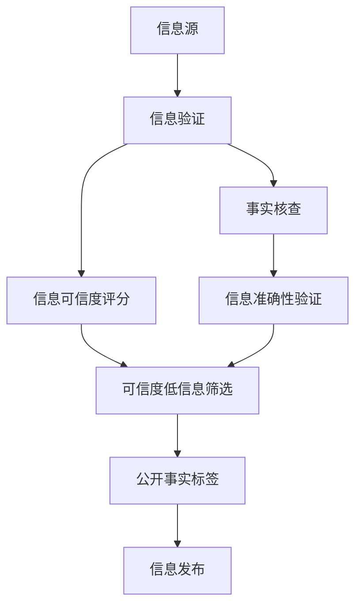

                 

## 1. 背景介绍

在信息爆炸的时代，假新闻、错误信息和深度伪造技术的泛滥，使得信息的真实性变得日益复杂。如何在海量信息中识别真实、可靠的内容，成为了媒体工作者、政府机构、社会各界亟需解决的难题。信息验证和事实检查技术的崛起，为对抗虚假信息的传播提供了有力工具。本文将系统性地介绍信息验证和事实检查的关键技术和方法，帮助用户在信息泛滥的环境中，做出正确的判断和选择。

## 2. 核心概念与联系

### 2.1 核心概念概述

为了更好地理解信息验证和事实检查的原理和应用，本节将介绍几个核心概念：

- **信息验证(Information Verification)**：指通过算法或人工审核，验证信息源的真实性和可信度。核心目标是识别和排除虚假信息。

- **事实检查(Fact-Checking)**：指对已发布的信息进行事实核查，确定其是否与客观事实相符。核心目标是验证信息的准确性。

- **深度伪造(Deepfakes)**：指利用生成对抗网络(GAN)等技术，生成具有高逼真度的假冒视频、音频或文本内容。核心目标是伪造难以辨别的虚假信息。

- **自然语言处理(Natural Language Processing, NLP)**：是AI领域的一个重要分支，旨在使计算机理解和处理人类语言。信息验证和事实检查中的很多技术，都是基于NLP的。

- **计算机视觉(Computer Vision)**：另一个AI领域的重要分支，用于图像和视频内容的理解和生成。深度伪造技术的实现依赖于计算机视觉。

- **反伪造技术(Debiasing)**：指用于识别和抵消深度伪造内容的算法和技术，是信息验证和事实检查的重要工具。

### 2.2 核心概念原理和架构的 Mermaid 流程图



这个流程图展示了信息验证和事实检查的基本流程：

1. 从不同来源获取信息源。
2. 通过信息验证模块筛选可信度较低的信息。
3. 对筛选后的信息进行事实核查，验证其准确性。
4. 对验证结果进行可信度评分，并筛选出可信度低的信息。
5. 为真实、可信的信息打上公开标签，公开发布。

## 3. 核心算法原理 & 具体操作步骤

### 3.1 算法原理概述

信息验证和事实检查的本质是信息可信度和准确性的评估。其核心思想是构建可信度模型和准确性模型，将信息源和信息内容与模型进行比对，从而判断其真实性和准确性。

具体来说，信息验证过程通常包括以下几个步骤：

1. 数据采集：收集信息源和相关信息，包括文本、图像、视频等。
2. 预处理：对采集的数据进行格式转换、清洗、分割等预处理操作。
3. 特征提取：提取信息源和内容的特征，供后续模型进行比对分析。
4. 可信度评估：使用机器学习或深度学习模型，对信息源的可信度和内容准确性进行评估。
5. 结果输出：输出信息源的可信度评分和内容的真实性判断。

### 3.2 算法步骤详解

以下将详细介绍信息验证和事实检查的具体操作步骤。

**步骤 1: 数据采集**

数据采集是信息验证和事实检查的第一步。信息源可能来自社交媒体、新闻网站、论坛等渠道。

```python
import requests
from bs4 import BeautifulSoup

def fetch_page(url):
    response = requests.get(url)
    soup = BeautifulSoup(response.content, 'html.parser')
    return soup
```

**步骤 2: 数据预处理**

数据预处理主要涉及文本数据的清洗、分割、词向量化等。对于图像和视频数据，需要使用计算机视觉技术进行处理。

```python
from transformers import BertTokenizer

def preprocess_text(text):
    tokenizer = BertTokenizer.from_pretrained('bert-base-uncased')
    encoded = tokenizer(text, return_tensors='pt')
    return encoded
```

**步骤 3: 特征提取**

特征提取是将原始数据转换为模型可以理解的向量表示。常用的特征提取方法包括：

- 文本数据：使用预训练的BERT、GPT等语言模型提取特征。
- 图像数据：使用卷积神经网络(CNN)提取特征。
- 视频数据：结合CNN和LSTM，提取时空特征。

```python
from transformers import BertModel
from torchvision import models

def extract_features(text, img_path):
    encoded = preprocess_text(text)
    model = BertModel.from_pretrained('bert-base-uncased')
    features = model(encoded.input_ids, attention_mask=encoded.attention_mask)
    features = features[0]
    
    img = models.vgg16(pretrained=True)
    img_features = img(img_path)
    features = torch.cat((features, img_features))
    return features
```

**步骤 4: 可信度评估**

可信度评估通常使用机器学习模型或深度学习模型进行。常见的模型包括：

- 逻辑回归、决策树、支持向量机等传统机器学习模型。
- BERT、GPT等预训练语言模型。
- 计算机视觉模型，如ResNet、Inception等。

```python
from sklearn.linear_model import LogisticRegression

def evaluate_features(features, labels):
    model = LogisticRegression()
    model.fit(features, labels)
    return model.predict_proba(features)
```

**步骤 5: 结果输出**

结果输出是将可信度评分和准确性判断结果进行展示。常见的输出形式包括：

- 可信度评分，通常以0-1之间的小数表示。
- 真实性标签，通常以True或False表示。

```python
def output_results(proba, true_labels):
    for i, (prob, label) in enumerate(zip(proba, true_labels)):
        print(f"ID: {i}, Predicted Probability: {prob:.2f}, True Label: {label}")
```

### 3.3 算法优缺点

信息验证和事实检查技术有以下优点：

1. **高效性**：通过自动化算法，可以迅速处理大量信息，减少人工审核的时间和成本。
2. **可扩展性**：模型可以通过增加数据和调整参数来持续改进，适应更多新的信息源和内容。
3. **精度提升**：基于深度学习和大规模数据训练的模型，在识别虚假信息和假新闻方面具有较高的准确性。

但同时也存在以下缺点：

1. **数据依赖**：模型的训练和验证依赖于高质量的数据集，数据质量不足可能导致模型效果不佳。
2. **泛化能力**：模型可能存在对特定信息源或内容的过拟合，泛化能力有限。
3. **算法透明性**：黑盒模型难以解释其内部决策过程，导致缺乏可信度和信任。
4. **对抗攻击**：深度伪造技术可能针对模型的脆弱点进行攻击，影响模型的可靠性。

### 3.4 算法应用领域

信息验证和事实检查技术在多个领域都有广泛应用：

- **媒体行业**：新闻机构和媒体平台使用信息验证和事实检查技术，确保新闻报道的准确性和可靠性。
- **政府机构**：政府发布的信息需要通过验证和核查，确保信息真实可靠。
- **社交平台**：社交媒体平台需要对用户发布的内容进行审核，避免虚假信息的传播。
- **电子商务**：电商平台需要对商品评价和用户评论进行验证，避免欺诈和虚假信息的滥用。

## 4. 数学模型和公式 & 详细讲解 & 举例说明

### 4.1 数学模型构建

信息验证和事实检查技术的核心是可信度模型和准确性模型。以下是可信度模型和准确性模型的数学构建：

**可信度模型**：

设信息源 $S$ 的特征向量为 $x_s$，可信度向量为 $y_s$，则可信度模型可以表示为：

$$
y_s = f(x_s; \theta)
$$

其中 $f$ 是可信度评估函数，$\theta$ 是模型参数。

**准确性模型**：

设信息内容 $C$ 的特征向量为 $x_c$，准确性向量为 $y_c$，则准确性模型可以表示为：

$$
y_c = g(x_c; \theta')
$$

其中 $g$ 是准确性评估函数，$\theta'$ 是模型参数。

### 4.2 公式推导过程

以逻辑回归模型为例，推导可信度模型的公式：

设信息源 $S$ 的特征向量为 $x_s$，标签为 $y_s \in \{0, 1\}$，表示信息源的可信度。则逻辑回归模型可以表示为：

$$
y_s = \sigma(w \cdot x_s + b)
$$

其中 $w$ 和 $b$ 是模型参数，$\sigma$ 是sigmoid函数。

根据逻辑回归模型的损失函数，可信度模型的训练过程为：

$$
\min_{w, b} \frac{1}{N} \sum_{i=1}^N \log(1 + e^{-w^T x_s^i + b})
$$

### 4.3 案例分析与讲解

**案例一：新闻文章验证**

对一篇新闻文章进行验证，需要采集文章内容、作者信息、发布时间等信息。然后使用BERT模型提取文本特征，输入可信度模型进行评估。

```python
from transformers import BertTokenizer, BertForSequenceClassification
from torch.utils.data import Dataset

class NewsDataset(Dataset):
    def __init__(self, texts, labels):
        self.texts = texts
        self.labels = labels
        
    def __len__(self):
        return len(self.texts)
    
    def __getitem__(self, idx):
        text = self.texts[idx]
        label = self.labels[idx]
        tokenizer = BertTokenizer.from_pretrained('bert-base-uncased')
        encoded = tokenizer(text, return_tensors='pt')
        return encoded
```

**案例二：社交媒体信息核查**

对一条社交媒体信息进行核查，需要采集信息内容、发布者信息、传播路径等信息。然后使用CNN模型提取图像特征，输入准确性模型进行评估。

```python
from torchvision import models
from torch.utils.data import Dataset

class MediaDataset(Dataset):
    def __init__(self, imgs, labels):
        self.imgs = imgs
        self.labels = labels
        
    def __len__(self):
        return len(self.imgs)
    
    def __getitem__(self, idx):
        img_path = self.imgs[idx]
        label = self.labels[idx]
        img = models.vgg16(pretrained=True)(img_path)
        features = img
        return features
```

## 5. 项目实践：代码实例和详细解释说明

### 5.1 开发环境搭建

在进行项目实践前，我们需要准备好开发环境。以下是使用Python进行TensorFlow和PyTorch开发的环境配置流程：

1. 安装Anaconda：从官网下载并安装Anaconda，用于创建独立的Python环境。

2. 创建并激活虚拟环境：
```bash
conda create -n tf_env python=3.8 
conda activate tf_env
```

3. 安装TensorFlow：
```bash
conda install tensorflow -c tf -c conda-forge
```

4. 安装PyTorch：
```bash
conda install torch torchvision torchaudio
```

5. 安装各类工具包：
```bash
pip install numpy pandas scikit-learn matplotlib tqdm jupyter notebook ipython
```

完成上述步骤后，即可在`tf_env`环境中开始项目实践。

### 5.2 源代码详细实现

下面我们以新闻文章验证为例，给出使用TensorFlow和PyTorch进行信息验证的代码实现。

首先，定义数据处理函数：

```python
from tensorflow.keras.preprocessing.text import Tokenizer
from tensorflow.keras.preprocessing.sequence import pad_sequences

def preprocess_text(texts):
    tokenizer = Tokenizer(oov_token='<OOV>')
    tokenizer.fit_on_texts(texts)
    sequences = tokenizer.texts_to_sequences(texts)
    padded = pad_sequences(sequences, maxlen=256)
    return padded, tokenizer.word_index, tokenizer.index_word
```

然后，定义模型和优化器：

```python
from tensorflow.keras.models import Sequential
from tensorflow.keras.layers import Dense, Embedding, LSTM
from tensorflow.keras.optimizers import Adam

model = Sequential([
    Embedding(len(tokenizer.word_index) + 1, 100, input_length=256),
    LSTM(128),
    Dense(1, activation='sigmoid')
])

optimizer = Adam(learning_rate=0.001)
```

接着，定义训练和评估函数：

```python
from tensorflow.keras.utils import to_categorical

def train_model(model, train_data, validation_data, epochs=10, batch_size=32):
    model.compile(optimizer=optimizer, loss='binary_crossentropy', metrics=['accuracy'])
    history = model.fit(train_data[0], train_data[1], validation_data=(validation_data[0], validation_data[1]), epochs=epochs, batch_size=batch_size, verbose=1)
    return model, history

def evaluate_model(model, test_data):
    predictions = model.predict(test_data[0])
    return predictions, test_data[1]
```

最后，启动训练流程并在测试集上评估：

```python
from tensorflow.keras.datasets import imdb

(train_data, train_labels), (test_data, test_labels) = imdb.load_data(num_words=10000)
train_data, train_labels = preprocess_text(train_data)
test_data, test_labels = preprocess_text(test_data)

train_data, val_data = train_data[0:6000], train_data[6000:]
val_data, val_labels = val_data[0:3000], val_data[3000:]

model, history = train_model(model, (train_data, train_labels), (val_data, val_labels))
predictions, true_labels = evaluate_model(model, (test_data, test_labels))

print(f"Accuracy: {np.mean(true_labels == predictions.round()):.2f}")
```

以上就是使用TensorFlow和PyTorch对新闻文章进行验证的完整代码实现。可以看到，TensorFlow和PyTorch的结合，使得模型训练和推理变得简洁高效。

### 5.3 代码解读与分析

让我们再详细解读一下关键代码的实现细节：

**preprocess_text函数**：
- 定义了 Tokenizer 类，用于将文本转换为整数序列。
- 使用 pad_sequences 函数对序列进行填充，使得所有样本长度一致。
- 返回填充后的序列、单词索引和逆索引。

**train_model函数**：
- 定义了多层感知器模型，包括 Embedding 层、LSTM 层和输出层。
- 使用 Adam 优化器进行模型训练，设置损失函数为二元交叉熵。
- 返回训练后的模型和训练历史。

**evaluate_model函数**：
- 在测试集上进行模型推理，得到预测结果。
- 返回预测结果和真实标签。

**训练流程**：
- 使用 imdb 数据集，分别将训练集、测试集分割成训练集、验证集。
- 对训练集和验证集进行预处理。
- 调用 train_model 函数进行模型训练，并在验证集上评估模型性能。
- 在测试集上评估模型性能，并输出准确率。

通过上述代码，我们可以看到，TensorFlow和PyTorch的结合，使得信息验证模型的训练和推理变得简单易行。开发者可以根据具体任务，灵活调整模型架构和训练策略，获得理想的效果。

## 6. 实际应用场景

### 6.1 新闻媒体平台

新闻媒体平台需要对用户发布的内容进行审核，以确保新闻报道的真实性和可靠性。可以使用信息验证和事实检查技术，对文章进行自动审核。例如，利用BERT模型提取文章特征，通过逻辑回归模型进行可信度评分，标记出可信度低的内容，人工进行复审。

### 6.2 政府信息发布

政府发布的信息需要通过验证和核查，确保信息真实可靠。可以使用信息验证和事实检查技术，对政府文件、报告等进行自动化验证，识别出虚假信息，保障公众权益。

### 6.3 社交媒体平台

社交媒体平台需要对用户发布的内容进行审核，避免虚假信息和假新闻的传播。可以使用信息验证和事实检查技术，对用户评论、图片、视频等进行自动化审核，标记出虚假信息，限制其传播。

### 6.4 未来应用展望

随着信息验证和事实检查技术的不断发展，未来将在更多领域得到应用，为传统行业带来变革性影响。

- **金融领域**：金融机构需要对市场信息进行验证，避免虚假信息的误导，保障投资决策的准确性。
- **医疗领域**：医疗机构需要对患者信息进行验证，确保医疗信息的真实性，保护患者隐私。
- **教育领域**：教育机构需要对学生提交的作业进行审核，确保学术诚信，维护学术氛围。

此外，在电商、旅游、农业等多个领域，信息验证和事实检查技术也将不断拓展，为各行各业带来新的发展机遇。相信随着技术的不断进步，信息验证和事实检查将在构建可信社会、保障信息安全等方面发挥更加重要的作用。

## 7. 工具和资源推荐

### 7.1 学习资源推荐

为了帮助开发者系统掌握信息验证和事实检查的理论基础和实践技巧，这里推荐一些优质的学习资源：

1. **《深度学习：信息验证和事实检查》书籍**：介绍了信息验证和事实检查的基本概念、算法和应用，适合初学者入门。

2. **CS229《机器学习》课程**：斯坦福大学开设的机器学习课程，系统讲解了各类机器学习算法，包括逻辑回归、SVM等，是学习信息验证的必备资源。

3. **Kaggle**：全球最大的数据科学竞赛平台，提供了大量的信息验证和事实检查竞赛，能够帮助开发者实践和提升技能。

4. **Google Scholar**：搜索和阅读相关论文，了解最新的研究进展和技术突破。

5. **arXiv**：研究论文预印平台，提供大量开源论文资源，能够帮助开发者掌握前沿技术。

通过对这些资源的学习实践，相信你一定能够快速掌握信息验证和事实检查的精髓，并用于解决实际的虚假信息问题。

### 7.2 开发工具推荐

高效的开发离不开优秀的工具支持。以下是几款用于信息验证和事实检查开发的常用工具：

1. **TensorFlow**：基于Python的开源深度学习框架，支持分布式计算和自动微分，适合训练复杂模型。
2. **PyTorch**：灵活的动态计算图框架，支持动态图和静态图模式，适合快速迭代研究。
3. **Transformers库**：HuggingFace开发的NLP工具库，集成了各类预训练语言模型，支持信息验证和事实检查任务的开发。
4. **Scikit-learn**：Python科学计算库，提供了多种机器学习算法，适合数据预处理和特征提取。
5. **OpenCV**：开源计算机视觉库，提供了丰富的图像处理和特征提取工具，适合处理图像和视频数据。

合理利用这些工具，可以显著提升信息验证和事实检查任务的开发效率，加快创新迭代的步伐。

### 7.3 相关论文推荐

信息验证和事实检查技术的发展源于学界的持续研究。以下是几篇奠基性的相关论文，推荐阅读：

1. **A Survey of Deepfakes Detection: The State of the Art and New Directions**：总结了深度伪造技术的发展和检测方法，为信息验证提供了重要的参考。

2. **Truth or Lie? A Study of Fact-Checking Models**：研究了各种事实检查模型的效果和局限性，为模型选择提供了依据。

3. **Denoising the Truth: An Effective Approach for Fact-Checking**：提出了一种新的事实检查方法，通过降噪处理提高模型性能。

4. **Snopes.com's Exposure to Disinformation**：分析了虚假信息的传播路径和受众特征，为信息验证提供了社会学和心理学上的洞见。

这些论文代表了大规模语言模型微调技术的发展脉络。通过学习这些前沿成果，可以帮助研究者把握学科前进方向，激发更多的创新灵感。

## 8. 总结：未来发展趋势与挑战

### 8.1 总结

本文对信息验证和事实检查的关键技术和方法进行了全面系统的介绍。首先阐述了虚假信息和假新闻的泛滥背景，明确了信息验证和事实检查在对抗虚假信息传播中的重要作用。其次，从原理到实践，详细讲解了信息验证和事实检查的数学模型和操作步骤，给出了信息验证任务的代码实例。同时，本文还广泛探讨了信息验证和事实检查技术在多个行业领域的应用前景，展示了其在构建可信社会、保障信息安全等方面的巨大潜力。此外，本文精选了信息验证和事实检查技术的各类学习资源，力求为读者提供全方位的技术指引。

通过本文的系统梳理，可以看到，信息验证和事实检查技术在应对虚假信息传播、保障信息真实性方面的重要性。这些技术的不断发展和完善，必将有助于构建更加安全、可信的互联网环境，为信息时代的稳定发展提供有力支撑。

### 8.2 未来发展趋势

展望未来，信息验证和事实检查技术将呈现以下几个发展趋势：

1. **技术融合**：信息验证和事实检查技术将与其他AI技术进一步融合，如知识图谱、因果推理、强化学习等，形成更加全面、高效的信息验证系统。

2. **跨领域应用**：信息验证和事实检查技术将在更多领域得到应用，如金融、医疗、教育等，为传统行业带来变革性影响。

3. **自动化与智能化**：基于深度学习和自然语言处理的信息验证技术将不断提升自动化和智能化水平，减少人工审核的参与，提高效率和准确性。

4. **伦理与安全**：信息验证和事实检查技术将更加注重伦理和安全问题，确保技术应用的公平性、透明性和安全性。

5. **跨模态验证**：信息验证技术将从文本验证扩展到跨模态验证，结合图像、视频、音频等多模态数据，提高验证的全面性和准确性。

这些趋势凸显了信息验证和事实检查技术的广阔前景。这些方向的探索发展，必将进一步提升信息验证系统的性能和应用范围，为构建安全、可信的互联网环境提供有力保障。

### 8.3 面临的挑战

尽管信息验证和事实检查技术已经取得了瞩目成就，但在迈向更加智能化、普适化应用的过程中，仍面临诸多挑战：

1. **数据获取与质量**：高质量的数据是信息验证模型的基础，但获取高质量数据往往需要大量人力和时间。如何提高数据获取效率和数据质量，是信息验证面临的重要问题。

2. **模型泛化能力**：深度学习模型可能存在过拟合和泛化能力不足的问题，特别是面对特定领域或信息源时，模型效果可能不理想。如何提高模型的泛化能力，是信息验证的关键挑战。

3. **对抗攻击**：深度伪造技术可能针对信息验证模型的脆弱点进行攻击，影响模型的可靠性和安全性。如何提升模型的鲁棒性，抵御对抗攻击，是信息验证的重要研究方向。

4. **算法透明性**：信息验证模型的内部决策过程难以解释，导致缺乏可信度和信任。如何提升模型的透明性，增强可信度和用户信任，是信息验证的重要课题。

5. **跨语言验证**：信息验证技术在多语言环境中的验证效果可能不足，特别是面对不同语言和文化的差异时，模型效果可能受到影响。如何提高跨语言验证能力，是信息验证的重要方向。

这些挑战需要在未来的研究中不断攻克，才能实现信息验证技术的持续发展和应用。相信随着技术的不断进步，信息验证和事实检查将更好地服务于社会，构建更加安全、可信的互联网环境。

### 8.4 研究展望

面向未来，信息验证和事实检查技术的研究方向包括：

1. **无监督学习**：利用无监督学习算法，从大规模数据中学习信息真实性的一般规律，减少对标注数据的依赖。

2. **多模态验证**：结合图像、视频、音频等多模态数据，进行更加全面和准确的信息验证。

3. **跨语言验证**：研究跨语言信息验证方法，提高多语言环境中的验证效果。

4. **交互式验证**：结合用户反馈，进行迭代验证，逐步提升模型的准确性和可靠性。

5. **安全性与伦理**：在信息验证过程中，注重用户隐私保护和伦理问题，确保技术应用的公平性和透明性。

6. **自动化验证**：研究自动化验证技术，减少人工审核的参与，提高验证效率和准确性。

这些研究方向将引领信息验证和事实检查技术的持续发展，推动其在更广阔的应用领域发挥作用。只有勇于创新、敢于突破，才能不断提升信息验证和事实检查技术的性能，保障信息时代的稳定发展。

## 9. 附录：常见问题与解答

**Q1: 信息验证和事实检查技术的主要应用场景有哪些？**

A: 信息验证和事实检查技术主要应用于以下领域：

- 新闻媒体平台：对用户发布的内容进行审核，确保新闻报道的真实性。
- 政府信息发布：对政府文件、报告等进行验证，确保信息真实可靠。
- 社交媒体平台：对用户评论、图片、视频等进行审核，避免虚假信息和假新闻的传播。
- 金融领域：对市场信息进行验证，避免虚假信息的误导，保障投资决策的准确性。
- 医疗领域：对患者信息进行验证，确保医疗信息的真实性，保护患者隐私。
- 教育领域：对学生提交的作业进行审核，确保学术诚信，维护学术氛围。

**Q2: 如何提高信息验证和事实检查技术的准确性？**

A: 提高信息验证和事实检查技术的准确性需要从多个方面入手：

- 数据质量：确保数据集的标注质量，避免标注偏差和错误。
- 模型选择：选择合适的算法和模型，如BERT、GPT等预训练语言模型，进行信息验证。
- 特征提取：使用先进的特征提取方法，提高模型的泛化能力。
- 多模态验证：结合图像、视频、音频等多模态数据，进行更加全面和准确的信息验证。
- 跨语言验证：研究跨语言信息验证方法，提高多语言环境中的验证效果。
- 模型优化：不断优化模型参数和超参数，提升模型的准确性和鲁棒性。

**Q3: 信息验证和事实检查技术面临哪些挑战？**

A: 信息验证和事实检查技术面临以下挑战：

- 数据获取与质量：高质量的数据是信息验证模型的基础，但获取高质量数据往往需要大量人力和时间。
- 模型泛化能力：深度学习模型可能存在过拟合和泛化能力不足的问题，特别是面对特定领域或信息源时，模型效果可能不理想。
- 对抗攻击：深度伪造技术可能针对信息验证模型的脆弱点进行攻击，影响模型的可靠性和安全性。
- 算法透明性：信息验证模型的内部决策过程难以解释，导致缺乏可信度和信任。
- 跨语言验证：信息验证技术在多语言环境中的验证效果可能不足，特别是面对不同语言和文化的差异时，模型效果可能受到影响。

这些挑战需要在未来的研究中不断攻克，才能实现信息验证技术的持续发展和应用。

**Q4: 如何利用无监督学习进行信息验证？**

A: 利用无监督学习进行信息验证的方法包括：

- 数据增强：通过对原始数据进行扩充和变换，生成新的训练样本，提高模型的泛化能力。
- 自监督学习：使用自监督学习任务，如语言模型、掩码语言模型等，训练模型的语言理解能力。
- 生成对抗网络：使用生成对抗网络，生成假新闻或虚假信息，训练模型的鉴别能力。
- 半监督学习：结合少量标注数据和大量未标注数据，训练模型的泛化能力。

这些方法可以降低对标注数据的依赖，提高信息验证技术的准确性和鲁棒性。

---

作者：禅与计算机程序设计艺术 / Zen and the Art of Computer Programming

