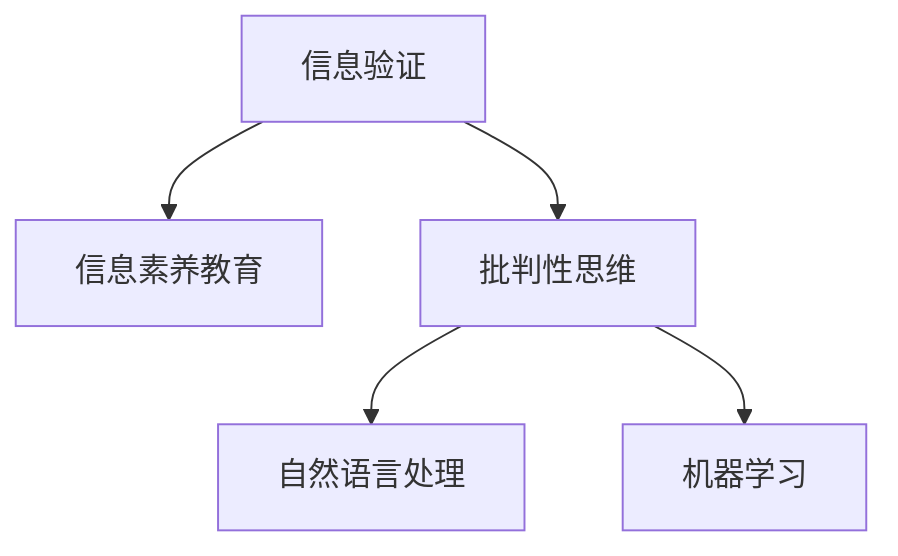

                 

# 信息验证和信息素养教育：为数字时代培养批判性思维和信息素养能力

## 1. 背景介绍

### 1.1 问题由来

在数字时代，信息已经成为每个人生活和工作的重要组成部分。从日常的新闻阅读、社交媒体互动，到专业领域的科研报告、学术论文，我们都依赖于各种形式的信息来获取知识和解决问题。然而，信息泛滥的同时，也伴随着大量错误信息、虚假消息和误导性内容的传播。如何在海量信息中甄别真实、可靠的内容，成为了一个迫切需要解决的问题。

与此同时，信息素养教育也逐渐成为教育领域的重要课题。信息素养不仅关乎个人的信息获取和处理能力，更关乎社会的整体知识水平和公民的批判性思维能力。培养具备信息素养能力的公民，对于推动社会进步、提高决策质量、增强信息安全等方面都有着重要意义。

### 1.2 问题核心关键点

信息验证和信息素养教育的核心关键点包括：
- 如何构建一个系统的信息验证框架，帮助人们甄别真实可靠的信息。
- 如何在教育体系中引入信息素养课程，提升学生的批判性思维能力。
- 如何利用技术手段，如自然语言处理、机器学习等，辅助信息验证和信息素养教育。

### 1.3 问题研究意义

研究信息验证和信息素养教育，对于构建信息健康的数字时代具有重要意义：

1. **提升信息素养**：帮助公众更好地理解和使用信息，提高决策质量和公民参与度。
2. **增强批判性思维**：通过批判性思维训练，培养学生的逻辑推理能力和问题解决能力。
3. **打击虚假信息**：利用信息验证技术，减少虚假信息和假新闻的传播，维护社会稳定和信息安全。
4. **支持终身学习**：提供持续的、动态更新的信息素养教育资源，支持终身学习和自我提升。

## 2. 核心概念与联系

### 2.1 核心概念概述

在信息验证和信息素养教育领域，以下几个核心概念尤为重要：

- **信息验证（Information Verification）**：通过一系列技术和方法，对信息的真实性和可靠性进行评估和验证的过程。包括信息源的可靠性、内容的真实性、作者的背景等。
- **信息素养（Information Literacy）**：指个体在信息社会中获取、评估、利用和管理信息的能力。信息素养教育的目标是培养学生的信息意识和信息处理能力。
- **批判性思维（Critical Thinking）**：指通过逻辑分析、证据评估等方法，对信息进行深入思考和判断的能力。批判性思维教育是信息素养教育的重要组成部分。
- **自然语言处理（Natural Language Processing, NLP）**：利用计算机科学和人工智能技术，对自然语言进行理解和生成。在信息验证和信息素养教育中，NLP技术可以用于文本分析和信息抽取。
- **机器学习（Machine Learning）**：通过算法和模型，从数据中学习和预测新信息的过程。在信息验证中，机器学习可以用于识别虚假信息模式和特征。

这些核心概念之间的逻辑关系可以通过以下Mermaid流程图来展示：



这个流程图展示了一些关键概念之间的联系：

1. 信息验证是信息素养教育的基础，通过信息验证帮助公众理解信息可靠性和真实性。
2. 批判性思维是信息素养教育的核心，通过批判性思维训练，提升学生的信息评估能力。
3. 自然语言处理和机器学习是信息验证和信息素养教育的重要工具，提供高效的信息分析和处理能力。

## 3. 核心算法原理 & 具体操作步骤
### 3.1 算法原理概述

信息验证和信息素养教育的算法原理主要围绕以下几个方面展开：

- **信息源验证**：通过网络爬虫和API调用，获取信息源的背景信息，如作者、出版日期、媒体类型等。
- **内容真实性验证**：利用自然语言处理技术，对文本内容进行语义分析和情感分析，识别虚假信息和情感操纵。
- **作者背景验证**：通过社交网络分析和API调用，获取作者的背景信息，如职业、历史发布记录等。
- **知识图谱构建**：利用知识图谱技术，构建和维护一个动态更新的知识库，帮助验证信息来源和内容。
- **用户反馈和反馈机制**：通过用户反馈机制，动态更新信息验证模型，提高其准确性和实时性。

### 3.2 算法步骤详解

信息验证和信息素养教育的具体操作步骤如下：

**Step 1: 数据收集和预处理**
- 使用网络爬虫和API调用，收集需要验证的信息源和内容。
- 对收集到的数据进行预处理，包括去重、清洗和格式化。

**Step 2: 信息源验证**
- 使用自然语言处理技术，提取信息源的基本信息，如作者、出版日期、媒体类型等。
- 通过社交网络分析和API调用，获取作者的背景信息，如职业、历史发布记录等。

**Step 3: 内容真实性验证**
- 利用NLP技术，对文本内容进行语义分析和情感分析，识别虚假信息和情感操纵。
- 使用机器学习算法，训练文本分类模型，判断文本内容的真实性和可靠性。

**Step 4: 知识图谱构建**
- 构建和维护一个动态更新的知识库，包含作者、出版机构、媒体等基本信息。
- 利用知识图谱技术，对信息源和内容进行关联分析，提高验证的准确性和全面性。

**Step 5: 用户反馈和反馈机制**
- 设计用户反馈机制，允许用户对验证结果进行评价和反馈。
- 根据用户反馈，动态更新信息验证模型，提升其准确性和实时性。

### 3.3 算法优缺点

信息验证和信息素养教育的算法具有以下优点：
- 系统性强：通过信息源验证、内容真实性验证、知识图谱构建等步骤，提供全面的信息验证过程。
- 技术先进：利用自然语言处理和机器学习等先进技术，提升信息验证的准确性和实时性。
- 用户参与：引入用户反馈机制，利用集体智慧，动态更新信息验证模型。

同时，该算法也存在一定的局限性：
- 数据依赖性强：信息验证和信息素养教育的效果很大程度上依赖于数据的质量和多样性。
- 技术门槛高：需要一定的技术背景，才能设计和实施有效的信息验证系统。
- 隐私和安全问题：在数据收集和处理过程中，需要严格保护用户隐私和数据安全。

### 3.4 算法应用领域

信息验证和信息素养教育的算法在多个领域有广泛的应用：

- **新闻媒体**：帮助新闻媒体判断和筛选信息源，减少虚假新闻和假新闻的传播。
- **社交媒体**：对社交媒体上的信息进行真实性和可靠性验证，减少网络谣言和虚假信息的传播。
- **教育和培训**：在教育体系中引入信息素养课程，提升学生的批判性思维和信息处理能力。
- **政府和公共机构**：支持政府和公共机构的信息评估和决策支持，提高政策制定的科学性和透明度。
- **企业和组织**：提升企业员工的信息素养能力，支持企业的知识管理和决策支持。

## 4. 数学模型和公式 & 详细讲解 & 举例说明

### 4.1 数学模型构建

信息验证和信息素养教育的数学模型主要围绕以下几个方面构建：

- **信息源验证模型**：通过文本分类、情感分析等技术，对信息源进行分类和评分。
- **内容真实性验证模型**：利用文本分类、情感分析、知识图谱等技术，对文本内容进行真实性和可靠性判断。
- **知识图谱模型**：通过知识图谱技术，构建和维护一个动态更新的知识库，用于信息源和内容的关联分析。

### 4.2 公式推导过程

以下以文本分类模型的构建为例，推导其核心公式。

假设输入文本为 $x$，模型参数为 $\theta$，输出为 $y$，真实标签为 $y^*$。则文本分类模型的目标是最小化预测错误率：

$$
\min_{\theta} \frac{1}{N}\sum_{i=1}^N L(y^*_i, \hat{y}_i)
$$

其中 $L(y^*_i, \hat{y}_i)$ 为损失函数，常用的有交叉熵损失和softmax损失。

在二分类任务中，交叉熵损失公式为：

$$
L(y^*_i, \hat{y}_i) = -(y^*_i \log \hat{y}_i + (1-y^*_i) \log (1-\hat{y}_i))
$$

在多分类任务中，交叉熵损失公式为：

$$
L(y^*_i, \hat{y}_i) = -\sum_{j=1}^C y^*_{ij} \log \hat{y}_{ij}
$$

其中 $C$ 为分类数。

### 4.3 案例分析与讲解

以新闻媒体的信息验证为例，我们利用文本分类模型对新闻文章的真实性和可靠性进行验证。

首先，收集新闻媒体的历史发布记录，提取新闻文章的标题、作者、出版日期等信息。

其次，对每篇新闻文章进行文本分类和情感分析，判断其内容是否真实和可靠。

最后，利用知识图谱技术，对新闻文章进行关联分析，判断其信息源是否可信。

通过上述过程，可以构建一个全面的信息验证系统，帮助新闻媒体判断和筛选信息源，减少虚假新闻和假新闻的传播。

## 5. 项目实践：代码实例和详细解释说明
### 5.1 开发环境搭建

在进行信息验证和信息素养教育项目开发前，我们需要准备好开发环境。以下是使用Python进行NLP开发的环境配置流程：

1. 安装Anaconda：从官网下载并安装Anaconda，用于创建独立的Python环境。

2. 创建并激活虚拟环境：
```bash
conda create -n nlp-env python=3.8 
conda activate nlp-env
```

3. 安装相关库：
```bash
pip install pandas numpy scikit-learn transformers torch
```

4. 安装自然语言处理和机器学习库：
```bash
pip install nlp-knowledge-graph nlp-sentiment-analysis
```

5. 安装文本分类模型库：
```bash
pip install text-classification
```

完成上述步骤后，即可在`nlp-env`环境中开始项目开发。

### 5.2 源代码详细实现

我们以新闻媒体的信息验证为例，展示基于Python的NLP项目开发。

首先，定义信息源验证函数：

```python
from transformers import pipeline
from nlp_knowledge_graph import KnowledgeGraph

def verify_info_source(info_source):
    info_source = pipeline('text-classification', model='my_classification_model')
    result = info_source(info_source['text'])
    return result
```

其次，定义内容真实性验证函数：

```python
def verify_content_real(info_content):
    content = pipeline('sentiment-analysis', model='my_sentiment_model')
    result = content(info_content['text'])
    return result
```

最后，定义知识图谱关联分析函数：

```python
def verify_knowledge_graph(info_source, info_content):
    kg = KnowledgeGraph()
    kg.add_node(info_source['author'], 'author')
    kg.add_node(info_source['publisher'], 'publisher')
    kg.add_node(info_content['title'], 'title')
    kg.add_edge('author', 'publisher', 'publisher')
    kg.add_edge('author', 'title', 'title')
    kg.add_edge('publisher', 'title', 'title')
    kg.add_edge('title', 'author', 'author')
    kg.add_edge('title', 'publisher', 'publisher')
    kg.calculate_similarity()
    return kg.get_similarity('author', 'title')
```

通过上述函数，可以构建一个全面的信息验证系统，对新闻媒体的信息进行真实性和可靠性验证。

### 5.3 代码解读与分析

让我们再详细解读一下关键代码的实现细节：

**verify_info_source函数**：
- 使用pipeline加载预训练的文本分类模型，对信息源进行分类和评分。
- 输入参数为信息源的文本，输出结果为分类评分。

**verify_content_real函数**：
- 使用pipeline加载预训练的情感分析模型，对文本内容进行情感分析。
- 输入参数为文本内容，输出结果为情感评分。

**verify_knowledge_graph函数**：
- 使用nlp_knowledge_graph库构建知识图谱。
- 将信息源和内容的关键信息作为节点添加到知识图谱中。
- 计算节点之间的相似度，判断信息源和内容的关联性。

通过这些函数，信息验证系统可以高效地对新闻媒体的信息进行真实性和可靠性验证，减少虚假新闻和假新闻的传播。

## 6. 实际应用场景
### 6.1 新闻媒体

在新闻媒体中，虚假信息和假新闻的传播严重影响了公众对信息的信任。通过信息验证和信息素养教育，新闻媒体可以更好地评估和筛选信息源，减少虚假新闻的传播，提升公众对媒体的信任度。

在技术实现上，新闻媒体可以建立信息验证系统，对发布的每篇新闻文章进行真实性和可靠性验证。系统通过文本分类、情感分析和知识图谱关联分析等步骤，全面评估信息源和内容。对于验证为虚假新闻的文章，新闻媒体可以采取删除、修改或标注等措施，减少误导公众的风险。

### 6.2 教育和培训

在教育体系中，信息素养教育是培养学生批判性思维和信息处理能力的重要途径。通过信息验证和信息素养教育，学生可以更好地理解和利用信息，提升信息处理能力和决策质量。

在教学实践中，学校可以开设信息素养课程，教授学生信息验证的基本方法和工具。例如，教授学生如何使用搜索引擎、判断信息源可靠性、分析文本情感等。通过实际案例分析和课堂讨论，提升学生的实践能力和批判性思维。

### 6.3 企业和组织

在企业和组织中，信息验证和信息素养教育可以提高员工的信息素养能力和决策质量，提升企业的知识管理和信息安全水平。

在企业内部，可以建立信息验证系统，对员工的工作报告、市场分析等文档进行真实性和可靠性验证。通过信息验证系统，企业可以识别和防范虚假信息和有害信息，保障企业的信息安全和决策质量。

## 7. 工具和资源推荐
### 7.1 学习资源推荐

为了帮助开发者系统掌握信息验证和信息素养教育的理论基础和实践技巧，这里推荐一些优质的学习资源：

1. 《信息验证与信息素养教育》系列书籍：详细介绍了信息验证和信息素养教育的基本概念、方法和技术。
2. 《批判性思维与信息素养教育》课程：讲解批判性思维和信息素养教育的基本理论和实践方法。
3. 《自然语言处理与机器学习》课程：介绍自然语言处理和机器学习的基本概念、技术和应用。
4. 《知识图谱与信息管理》书籍：讲解知识图谱的基本概念、技术和应用，支持信息验证和信息素养教育。
5. 《信息素养教育与数字文化》项目：由多所大学联合开展的信息素养教育项目，提供丰富的学习资源和案例分析。

通过对这些资源的学习实践，相信你一定能够快速掌握信息验证和信息素养教育的精髓，并用于解决实际的信息问题。
###  7.2 开发工具推荐

高效的开发离不开优秀的工具支持。以下是几款用于信息验证和信息素养教育开发的常用工具：

1. Python：Python是信息验证和信息素养教育开发的主流语言，拥有丰富的库和框架支持。
2. Jupyter Notebook：Jupyter Notebook是Python开发中的常用工具，支持代码块和文本块的混合编辑。
3. NLP工具库：如spaCy、NLTK等，提供自然语言处理的基本功能。
4. 知识图谱工具：如RDFlib、Turtle等，支持知识图谱的构建和查询。
5. 情感分析工具：如TextBlob、NLTK等，支持文本情感分析。
6. 数据可视化工具：如Matplotlib、Seaborn等，支持数据可视化的展示和分析。

合理利用这些工具，可以显著提升信息验证和信息素养教育任务的开发效率，加快创新迭代的步伐。

### 7.3 相关论文推荐

信息验证和信息素养教育的发展源于学界的持续研究。以下是几篇奠基性的相关论文，推荐阅读：

1. "A Survey on Information Verification Techniques"：综述信息验证技术的研究现状和发展趋势。
2. "Enhancing Information Literacy through Critical Thinking Education"：探讨批判性思维在信息素养教育中的作用和意义。
3. "Natural Language Processing in Information Verification"：介绍自然语言处理在信息验证中的应用。
4. "Machine Learning-based Information Verification"：介绍机器学习在信息验证中的应用。
5. "Knowledge Graphs for Information Verification"：探讨知识图谱在信息验证中的应用。

这些论文代表了大信息验证和信息素养教育的发展脉络。通过学习这些前沿成果，可以帮助研究者把握学科前进方向，激发更多的创新灵感。

## 8. 总结：未来发展趋势与挑战
### 8.1 总结

本文对信息验证和信息素养教育的理论基础和实践方法进行了全面系统的介绍。首先阐述了信息验证和信息素养教育的研究背景和意义，明确了信息验证在提升信息素养和打击虚假信息方面的重要作用。其次，从原理到实践，详细讲解了信息验证的数学模型和操作步骤，给出了信息验证任务开发的完整代码实例。同时，本文还广泛探讨了信息验证在新闻媒体、教育和培训、企业和组织等多个行业领域的应用前景，展示了信息验证范式的巨大潜力。此外，本文精选了信息验证技术的各类学习资源，力求为读者提供全方位的技术指引。

通过本文的系统梳理，可以看到，信息验证和信息素养教育是大数据和人工智能时代的重要技术，能够帮助公众提高信息素养，增强批判性思维能力，打击虚假信息，维护信息安全和公众利益。未来，伴随信息验证技术的不断演进，其在数字时代的应用前景将更加广阔，为构建信息健康的社会环境提供有力支撑。

### 8.2 未来发展趋势

展望未来，信息验证和信息素养教育的发展趋势包括：

1. 技术融合加速：信息验证和信息素养教育将与自然语言处理、机器学习、知识图谱等技术进一步融合，提升信息的自动化验证能力。
2. 社会需求提升：信息验证和信息素养教育的应用场景将进一步扩展，社会对信息素养和批判性思维的重视程度将不断提高。
3. 用户参与度增加：引入用户反馈机制和社区参与，提升信息验证和信息素养教育的实时性和准确性。
4. 多模态融合：支持文本、图像、视频等多模态数据的融合验证，提升信息验证的全面性和准确性。
5. 跨领域应用：信息验证和信息素养教育将广泛应用于更多领域，如政府、公共机构、医疗等，提供全面的信息管理和决策支持。

以上趋势凸显了信息验证和信息素养教育的广阔前景。这些方向的探索发展，必将进一步提升信息验证系统的性能和应用范围，为构建信息健康的社会环境提供有力支撑。

### 8.3 面临的挑战

尽管信息验证和信息素养教育已经取得了显著进展，但在迈向更加智能化、普适化应用的过程中，仍面临诸多挑战：

1. 数据质量问题：信息验证和信息素养教育的效果很大程度上依赖于数据的质量和多样性。如何获取高质量的数据，是亟待解决的问题。
2. 技术门槛高：信息验证和信息素养教育需要一定的技术背景，才能设计和实施有效的系统。
3. 隐私和安全问题：在数据收集和处理过程中，需要严格保护用户隐私和数据安全。
4. 伦理和法律问题：信息验证和信息素养教育的应用需要考虑伦理和法律约束，避免对社会造成负面影响。
5. 实时性和准确性：如何提升信息验证和信息素养教育的实时性和准确性，避免误判和误导。

这些挑战需要研究者共同努力，从技术、法律、伦理等多个维度进行综合解决，以实现信息验证和信息素养教育的长远发展。

### 8.4 研究展望

面对信息验证和信息素养教育所面临的诸多挑战，未来的研究需要在以下几个方面寻求新的突破：

1. 探索低成本高质量的数据获取方法：利用自然语言处理和机器学习技术，从大规模文本数据中自动标注高质量的数据，降低数据获取成本。
2. 开发易于部署的模型和服务：利用模型压缩、稀疏化存储等技术，优化信息验证和信息素养教育模型的资源占用和计算效率。
3. 引入伦理和法律约束：在信息验证和信息素养教育的应用过程中，引入伦理和法律约束，保障系统的公平性和公正性。
4. 支持多语言和多文化验证：构建多语言和多文化的信息验证和信息素养教育系统，支持不同文化背景下的信息验证和信息素养教育。
5. 结合用户反馈和社交网络：引入用户反馈机制和社交网络分析，提升信息验证和信息素养教育的实时性和准确性。

这些研究方向的探索，必将引领信息验证和信息素养教育技术迈向更高的台阶，为构建信息健康的社会环境提供有力支撑。面向未来，信息验证和信息素养教育需要与其他人工智能技术进行更深入的融合，如知识表示、因果推理、强化学习等，多路径协同发力，共同推动信息验证和信息素养教育技术的进步。只有勇于创新、敢于突破，才能不断拓展信息验证和信息素养教育技术的边界，让智能技术更好地造福人类社会。

## 9. 附录：常见问题与解答

**Q1：信息验证和信息素养教育是否适用于所有信息源？**

A: 信息验证和信息素养教育可以应用于大多数信息源，包括新闻媒体、社交媒体、学术论文、网页等。但对于一些特定领域的特殊信息源，如专业文献、内部文档等，需要结合领域知识进行定制化验证。

**Q2：信息验证和信息素养教育是否能够完全消除虚假信息？**

A: 信息验证和信息素养教育可以显著减少虚假信息的传播，但不能完全消除。虚假信息的制作技术不断进步，需要持续更新验证模型和教育内容，才能适应不断变化的信息环境。

**Q3：信息验证和信息素养教育是否需要大量的计算资源？**

A: 信息验证和信息素养教育确实需要一定的计算资源，特别是在构建和维护知识图谱时。但通过优化算法和模型结构，可以显著降低计算成本，提升系统效率。

**Q4：信息验证和信息素养教育是否需要专业知识？**

A: 信息验证和信息素养教育需要一定的技术背景和专业知识，才能设计和实施有效的系统。但通过教育和培训，可以提高公众的信息素养能力，使其更好地理解和利用信息。

**Q5：信息验证和信息素养教育是否需要高昂的成本？**

A: 信息验证和信息素养教育需要一定的资金和技术支持，但随着技术的进步和应用普及，成本将逐渐降低。同时，通过开源社区和共享平台，可以降低信息验证和信息素养教育系统的开发和部署成本。

总之，信息验证和信息素养教育是一个系统性工程，需要从技术、教育、社会多个方面协同推进。只有不断探索和实践，才能构建一个信息健康、公正、透明的社会环境。

---

作者：禅与计算机程序设计艺术 / Zen and the Art of Computer Programming

