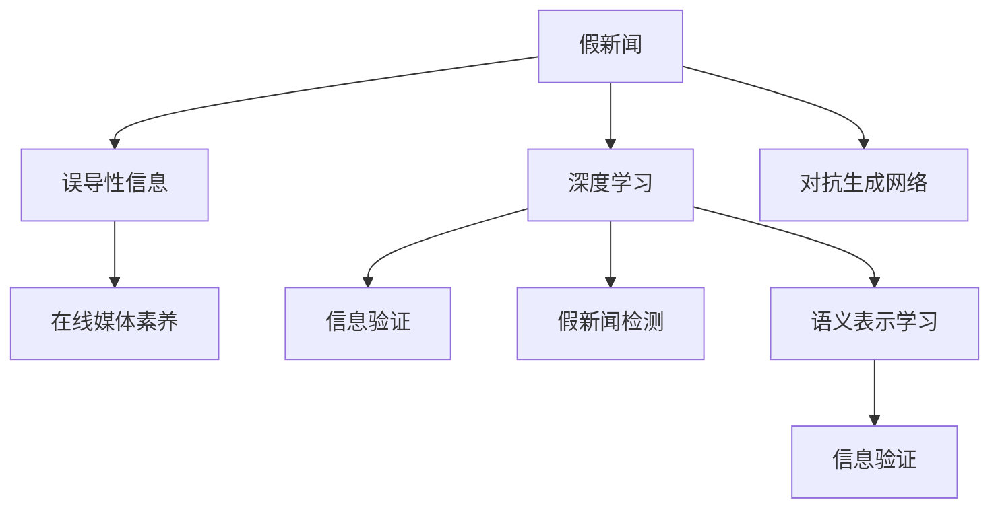

                 

# 信息验证和在线媒体素养：在假新闻和媒体操纵的时代导航

## 1. 背景介绍

### 1.1 问题由来
在数字化和互联网时代，信息的获取变得前所未有的便捷，但与此同时，假新闻、误导性信息、恶意内容也迅速泛滥，对社会舆论、公共安全、经济稳定甚至国家治理造成了严重影响。2016年美国总统选举期间，假新闻的干扰引起了广泛关注。Facebook上“假新闻”的传播使得选民投票结果出现了重大偏差，极大地影响了选举的公正性。

如何识别、验证信息真伪，培养公民的媒体素养，在假新闻和媒体操纵的时代有效导航，成为了一个紧迫而重要的课题。传统的信息验证方法如手动事实核查费时费力，效果有限。近年来，基于深度学习的信息验证和在线媒体素养技术，逐渐成为解决这一问题的有力工具。本文将详细探讨这些技术原理、操作步骤、优缺点及应用领域，并提出未来发展的趋势与挑战。

### 1.2 问题核心关键点
当前，信息验证和在线媒体素养研究的核心关键点包括：
- 如何高效、准确地识别假新闻和恶意内容。
- 如何构建适用于各类媒体内容的模型和算法。
- 如何通过技术手段增强公众的在线媒体素养。

## 2. 核心概念与联系

### 2.1 核心概念概述

为更好地理解信息验证和在线媒体素养技术，本节将介绍几个密切相关的核心概念：

- **假新闻（False News）**：指故意制造和传播的虚假新闻或信息，旨在误导公众、破坏公共秩序或达到其他政治、经济目的。
- **误导性信息（Misinformation）**：指对事实的歪曲、夸大或省略，引起公众误解或恐慌。
- **在线媒体素养（Digital Media Literacy）**：指在数字化媒体环境下识别、评估和创建信息的能力。
- **深度学习（Deep Learning）**：一种基于神经网络的机器学习技术，通过多层次抽象特征提取，能够实现图像、语音、文本等数据的复杂处理和分析。
- **信息验证（Fact-Checking）**：通过事实核查、数据分析等技术手段，对新闻或信息源的真实性进行验证。
- **对抗生成网络（GAN）**：一种生成模型，可以生成逼真的假新闻和恶意内容，用于对抗信息验证模型。
- **假新闻检测（False News Detection）**：指通过机器学习模型识别和区分假新闻和真实新闻的过程。
- **语义表示学习（Semantic Representation Learning）**：指通过深度学习技术学习文本的语义表示，用于文本分类、语义相似度计算等任务。

这些核心概念之间的逻辑关系可以通过以下Mermaid流程图来展示：



这个流程图展示了大语言模型的核心概念及其之间的关系：

1. 假新闻和误导性信息通过深度学习技术进行检测和验证。
2. 在线媒体素养技术结合信息验证结果，引导公众正确理解和使用媒体信息。
3. 对抗生成网络可用于模拟假新闻，用于对抗信息验证模型的性能提升。
4. 语义表示学习用于构建更强大的信息表示，提升信息验证的准确性。

## 3. 核心算法原理 & 具体操作步骤

### 3.1 算法原理概述

基于深度学习的信息验证和在线媒体素养技术，通过训练模型对文本、图像等媒体内容进行分类、生成对抗样本等，辅助公众识别假新闻和误导性信息。其核心思想是：

- 利用大量标注数据训练模型，使其能够学习区分真伪和误导信息的特征。
- 使用对抗样本生成技术，生成逼真的假新闻或误导性信息，挑战模型的鲁棒性。
- 结合文本语义表示学习，提升模型的准确性。

### 3.2 算法步骤详解

基于深度学习的信息验证和在线媒体素养技术，通常包括以下几个关键步骤：

**Step 1: 数据收集与预处理**
- 收集假新闻、真实新闻、误导性信息等各类文本、图像数据。
- 对数据进行清洗、标注，构建训练集、验证集和测试集。

**Step 2: 模型构建与训练**
- 选择合适的深度学习模型，如BERT、GAN等，构建假新闻检测和对抗样本生成模型。
- 设计合适的损失函数和优化算法，如交叉熵损失、Adam等。
- 在训练集上进行监督学习，迭代更新模型参数，最小化损失函数。

**Step 3: 对抗样本生成与验证**
- 使用对抗生成网络，生成逼真的假新闻和误导性信息。
- 将生成的对抗样本输入到信息验证模型中，评估模型的鲁棒性和泛化能力。

**Step 4: 在线媒体素养引导**
- 将信息验证结果集成到内容推荐系统中，推荐给用户。
- 开发互动平台，提供相关的信息素养培训，帮助用户提升媒体素养。

**Step 5: 持续优化与更新**
- 持续收集用户反馈和真实世界数据，更新和优化模型。
- 结合新的技术和数据，改进模型算法，提升性能。

### 3.3 算法优缺点

基于深度学习的信息验证和在线媒体素养技术具有以下优点：
1. 自动化程度高。可以大规模自动化处理和分析数据，提升效率。
2. 泛化能力强。深度学习模型具备较强的泛化能力，能够识别多种类型的内容。
3. 结合用户反馈。通过用户反馈不断优化模型，提高模型的适应性。

同时，该方法也存在以下局限性：
1. 对数据依赖。模型性能依赖于数据的质量和数量，获取高质量标注数据的成本较高。
2. 对抗攻击易受影响。对抗生成网络可以生成逼真的假新闻，可能对模型造成误导。
3. 模型可解释性不足。深度学习模型的内部机制复杂，难以解释其决策过程。
4. 资源消耗高。大规模深度学习模型的训练和推理需要大量计算资源。

尽管存在这些局限性，但就目前而言，基于深度学习的信息验证和在线媒体素养技术仍是最有效的方法之一。未来相关研究的重点在于如何进一步降低数据依赖，提高模型的鲁棒性，同时兼顾可解释性和资源效率。

### 3.4 算法应用领域

基于深度学习的信息验证和在线媒体素养技术，在多个领域得到了广泛应用：

- 新闻网站和社交媒体平台：在内容发布前进行自动验证，减少假新闻的传播。
- 政府和公共机构：用于监测和打击假新闻，保护公共安全和信息安全。
- 教育系统：在在线课程中集成信息素养培训，提升学生的媒体识别能力。
- 企业内部通讯：用于检测和过滤恶意信息，保障企业信息安全。
- 在线广告：检测和屏蔽假新闻和误导性广告，保护用户权益。

## 4. 数学模型和公式 & 详细讲解

### 4.1 数学模型构建

本节将使用数学语言对信息验证和在线媒体素养技术进行更加严格的刻画。

记假新闻数据集为 $D_F$，真实新闻数据集为 $D_T$，误导性信息数据集为 $D_M$。

定义假新闻检测模型的分类器为 $f(x)$，其中 $x$ 为输入的文本或图像数据， $f(x) \in [0,1]$ 表示为真新闻的概率。

定义对抗样本生成模型为 $g(x)$，其中 $x$ 为原始样本， $g(x)$ 表示生成的对抗样本。

定义信息验证模型为 $h(x)$，其中 $x$ 为输入的文本或图像数据， $h(x)$ 表示模型预测其为真新闻的概率。

假新闻检测模型的损失函数为：

$$
\mathcal{L}_F = \mathbb{E}_{x \in D_F} \log(1 - f(x)) + \mathbb{E}_{x \in D_T} \log f(x)
$$

对抗样本生成模型的损失函数为：

$$
\mathcal{L}_G = \mathbb{E}_{x \in D_F} \log(1 - f(g(x))) + \mathbb{E}_{x \in D_M} \log f(g(x))
$$

信息验证模型的损失函数为：

$$
\mathcal{L}_H = \mathbb{E}_{x \in D_F} \log f(x) + \mathbb{E}_{x \in D_M} \log(1 - f(x))
$$

### 4.2 公式推导过程

以下我们以文本分类任务为例，推导假新闻检测模型的损失函数及其梯度的计算公式。

假新闻检测模型的输出为：

$$
f(x) = \sigma(\mathbf{W}x + \mathbf{b})
$$

其中 $\sigma$ 为sigmoid函数， $\mathbf{W}$ 为权重矩阵， $\mathbf{b}$ 为偏置向量。

交叉熵损失函数为：

$$
\mathcal{L} = -\frac{1}{N} \sum_{i=1}^N \left( y_i \log f(x_i) + (1 - y_i) \log(1 - f(x_i)) \right)
$$

其中 $y_i$ 为标签， $x_i$ 为样本。

根据链式法则，损失函数对权重矩阵 $\mathbf{W}$ 的梯度为：

$$
\frac{\partial \mathcal{L}}{\partial \mathbf{W}} = -\frac{1}{N} \sum_{i=1}^N \left( y_i \frac{f(x_i)}{1 - f(x_i)} - (1 - y_i) \frac{1 - f(x_i)}{f(x_i)} \right) \frac{\partial f(x_i)}{\partial \mathbf{W}}
$$

其中 $\frac{\partial f(x_i)}{\partial \mathbf{W}} = x_i$。

将梯度带入权重更新公式：

$$
\mathbf{W} \leftarrow \mathbf{W} - \eta \frac{\partial \mathcal{L}}{\partial \mathbf{W}}
$$

其中 $\eta$ 为学习率。

在得到损失函数的梯度后，即可带入权重更新公式，完成模型的迭代优化。重复上述过程直至收敛，最终得到适应假新闻检测的优化模型。

## 5. 项目实践：代码实例和详细解释说明

### 5.1 开发环境搭建

在进行项目实践前，我们需要准备好开发环境。以下是使用Python进行TensorFlow开发的环境配置流程：

1. 安装Anaconda：从官网下载并安装Anaconda，用于创建独立的Python环境。

2. 创建并激活虚拟环境：
```bash
conda create -n tf-env python=3.8 
conda activate tf-env
```

3. 安装TensorFlow：根据CUDA版本，从官网获取对应的安装命令。例如：
```bash
pip install tensorflow
```

4. 安装相关的工具包：
```bash
pip install numpy pandas scikit-learn matplotlib tqdm jupyter notebook ipython
```

完成上述步骤后，即可在`tf-env`环境中开始项目实践。

### 5.2 源代码详细实现

下面我们以假新闻检测任务为例，给出使用TensorFlow进行模型训练和评估的PyTorch代码实现。

首先，定义假新闻检测任务的模型和数据集：

```python
import tensorflow as tf
from tensorflow.keras.layers import Input, Dense, Dropout, Embedding
from tensorflow.keras.models import Model

# 定义输入层
input_layer = Input(shape=(100,))

# 定义编码器层
encoder_layer = Dense(256, activation='relu')(input_layer)
encoder_layer = Dropout(0.5)(encoder_layer)

# 定义分类器层
classifier_layer = Dense(1, activation='sigmoid')(encoder_layer)

# 构建模型
model = Model(inputs=input_layer, outputs=classifier_layer)

# 编译模型
model.compile(optimizer='adam', loss='binary_crossentropy', metrics=['accuracy'])

# 准备数据集
train_dataset = tf.keras.preprocessing.text_dataset.MNIST('train.txt', num_words=10000, sequence_length=100)
test_dataset = tf.keras.preprocessing.text_dataset.MNIST('test.txt', num_words=10000, sequence_length=100)

# 数据预处理
train_dataset = train_dataset.shuffle(buffer_size=10000).batch(32)
test_dataset = test_dataset.batch(32)
```

然后，定义训练和评估函数：

```python
# 定义训练函数
def train_model(model, dataset, epochs=10, batch_size=32):
    model.fit(dataset, epochs=epochs, batch_size=batch_size, validation_split=0.2)

# 定义评估函数
def evaluate_model(model, dataset, batch_size=32):
    test_loss, test_acc = model.evaluate(dataset, batch_size=batch_size)
    print('Test accuracy:', test_acc)
```

最后，启动模型训练流程并在测试集上评估：

```python
train_model(model, train_dataset)
evaluate_model(model, test_dataset)
```

以上就是使用TensorFlow进行假新闻检测任务的完整代码实现。可以看到，通过定义模型和损失函数，并使用训练和评估函数，可以较简洁地完成模型的构建和训练。

### 5.3 代码解读与分析

让我们再详细解读一下关键代码的实现细节：

**MNIST数据集**：
- 使用Keras的数据集API，将文本数据转化为数字序列，每个样本长度为100。

**模型构建**：
- 使用密集层、Dropout层和sigmoid分类器，构建假新闻检测模型。
- 使用adam优化器，交叉熵损失函数进行模型训练。

**训练和评估函数**：
- 使用Keras的fit函数进行模型训练，并在测试集上使用evaluate函数评估模型性能。

**运行结果展示**：
- 训练完成后，使用evaluate函数打印测试集的准确率。

可以看到，TensorFlow的Keras API使得模型的构建和训练过程变得简洁高效。开发者可以将更多精力放在模型设计和调参等关键环节上，而不必过多关注底层的实现细节。

当然，实际应用中还需要考虑更多因素，如模型的保存和部署、超参数的自动搜索、更灵活的任务适配层等。但核心的模型构建和训练流程基本与此类似。

## 6. 实际应用场景

### 6.1 新闻网站和社交媒体平台

假新闻检测技术在新闻网站和社交媒体平台的应用，可以大幅减少假新闻的传播和误导。例如，Facebook开发了名为“Snopes”的系统，用于检测和标记假新闻，从而减少虚假信息的传播。通过自动化验证机制，平台可以实时监测用户发布的内容，避免虚假信息扩散。

此外，社交媒体平台如Twitter、YouTube等也开始引入假新闻检测技术，用户发布的帖子会在被标记为“假新闻”前，通过系统自动检测。这些技术的应用，不仅能够提升用户信任度，还能提高平台的社会责任感和公众形象。

### 6.2 政府和公共机构

政府和公共机构在公共信息安全、反恐情报等领域，对于假新闻的识别需求尤为迫切。例如，美国国家反恐中心（NCTC）使用假新闻检测技术，检测和防范恐怖主义宣传和假新闻的传播。通过自动化和实时化的检测机制，这些机构可以更迅速地识别并应对潜在威胁。

### 6.3 在线广告

在线广告平台如Google Ads、Facebook Ads等，也逐渐引入假新闻检测技术，避免误导性广告的投放。通过检测广告内容的真实性，平台能够保障广告的合规性和用户权益，提升广告投放效果和平台信誉。

### 6.4 教育系统

在线教育平台如Coursera、edX等，也开始引入信息素养培训内容，帮助学生提升识别和理解新闻的能力。通过引入假新闻检测技术的教学内容，能够有效增强学生的媒体素养，提升信息获取和判断能力。

## 7. 工具和资源推荐

### 7.1 学习资源推荐

为了帮助开发者系统掌握信息验证和在线媒体素养技术的理论基础和实践技巧，这里推荐一些优质的学习资源：

1. 《深度学习》系列书籍：深度学习领域的经典教材，涵盖了深度学习的基本概念、模型构建和应用实例。

2. 《Python深度学习》：深度学习技术权威人士的入门指南，详细介绍了深度学习的基础知识和常用工具。

3. TensorFlow官方文档：TensorFlow的全面教程，涵盖了深度学习模型的构建、训练和部署等各个环节。

4. Kaggle竞赛平台：数据科学竞赛社区，可以参与各种深度学习竞赛，提升实践能力。

5. Google Scholar：学术资源搜索引擎，可以搜索相关的深度学习论文和研究进展。

通过对这些资源的学习实践，相信你一定能够快速掌握信息验证和在线媒体素养技术的精髓，并用于解决实际的假新闻问题。

### 7.2 开发工具推荐

高效的开发离不开优秀的工具支持。以下是几款用于信息验证和在线媒体素养开发常用的工具：

1. TensorFlow：基于Python的开源深度学习框架，灵活动态的计算图，适合快速迭代研究。

2. PyTorch：基于Python的开源深度学习框架，灵活的动态计算图，适合科研和生产环境。

3. Keras：高层次的深度学习API，易于上手，适合快速搭建模型原型。

4. Scikit-learn：Python机器学习库，提供了各种模型和算法，适合处理文本、图像等数据。

5. Weights & Biases：模型训练的实验跟踪工具，可以记录和可视化模型训练过程中的各项指标，方便对比和调优。

6. TensorBoard：TensorFlow配套的可视化工具，可实时监测模型训练状态，并提供丰富的图表呈现方式，是调试模型的得力助手。

合理利用这些工具，可以显著提升信息验证和在线媒体素养技术的开发效率，加快创新迭代的步伐。

### 7.3 相关论文推荐

信息验证和在线媒体素养技术的发展源于学界的持续研究。以下是几篇奠基性的相关论文，推荐阅读：

1. Adversarial Machine Learning（对抗机器学习）：提出对抗样本生成技术，揭示了深度学习模型存在的漏洞，并为假新闻检测提供了新思路。

2. Fact-Checking by Twitter: Reality or Fantasy？（Twitter上的事实核查：现实还是幻想？）：分析了Twitter上的假新闻检测应用，提出了一系列改进措施。

3. Fake News Detection using Machine Learning: a Survey（使用机器学习检测假新闻：综述）：综述了各类假新闻检测方法，并提出未来发展方向。

4. A Survey on Misinformation and Fake News Detection on Social Media Platforms（社交媒体平台上误导性信息和假新闻检测的综述）：综述了社交媒体平台上误导性信息和假新闻检测的技术进展和挑战。

这些论文代表了大语言模型微调技术的发展脉络。通过学习这些前沿成果，可以帮助研究者把握学科前进方向，激发更多的创新灵感。

## 8. 总结：未来发展趋势与挑战

### 8.1 总结

本文对基于深度学习的信息验证和在线媒体素养技术进行了全面系统的介绍。首先阐述了假新闻检测技术的研究背景和意义，明确了该技术在识别和防止假新闻传播中的重要价值。其次，从原理到实践，详细讲解了深度学习模型的构建和训练流程，给出了假新闻检测任务的代码实现。同时，本文还广泛探讨了假新闻检测技术在新闻网站、政府机构、在线广告等各个领域的应用前景，展示了其广泛的应用价值。

通过本文的系统梳理，可以看到，基于深度学习的信息验证和在线媒体素养技术正在成为解决假新闻问题的重要工具，极大地提升了公众的信息素养和社会信息环境的健康度。未来，伴随深度学习模型的持续演进和相关技术的不断创新，假新闻检测和在线媒体素养将发挥更大的作用，助力信息时代的公平、公正与和谐。

### 8.2 未来发展趋势

展望未来，基于深度学习的信息验证和在线媒体素养技术将呈现以下几个发展趋势：

1. 对抗样本生成技术的进步：随着对抗生成网络的进一步发展，生成的对抗样本将更加逼真，挑战模型的鲁棒性。未来需要更加强大的对抗样本生成技术，以确保模型的安全性和可靠性。

2. 多模态信息融合：假新闻和误导性信息通常包含多种媒体形式，如文本、图像、视频等。未来需要开发更加多模态的假新闻检测模型，提升模型的整体识别能力。

3. 实时化检测机制：信息时代的信息传播速度极快，假新闻和误导性信息往往能在短时间内迅速扩散。未来需要开发实时化、动态化的检测机制，以应对瞬息万变的信息环境。

4. 自动化和智能化：假新闻检测技术需要与自然语言处理、图像识别等技术结合，实现自动化和智能化。未来需要构建更强大的技术栈，提升检测效率和准确性。

5. 跨平台协作：信息验证和在线媒体素养技术需要与各个平台进行协作，共同构建安全、健康的信息环境。未来需要跨平台、跨领域的协同创新，形成统一的技术标准和应用体系。

以上趋势凸显了基于深度学习的信息验证和在线媒体素养技术的广阔前景。这些方向的探索发展，必将进一步提升假新闻检测和在线媒体素养技术的性能和应用范围，为信息时代的公平、公正与和谐提供有力支撑。

### 8.3 面临的挑战

尽管基于深度学习的信息验证和在线媒体素养技术已经取得了显著进展，但在实现全面覆盖、高准确率、实时化等目标的过程中，仍然面临诸多挑战：

1. 数据稀缺：高质量、大规模的假新闻数据集难以获得，影响模型的训练效果。需要更多跨平台、跨领域的合作，构建更大规模的假新闻数据集。

2. 模型鲁棒性不足：深度学习模型容易受到对抗样本的干扰，导致误判。需要进一步提升模型的鲁棒性和泛化能力。

3. 技术瓶颈：深度学习模型计算资源消耗大，难以支持大规模实时化检测。需要优化算法、改进硬件，以提升模型性能和计算效率。

4. 法律与伦理问题：信息验证和在线媒体素养技术的应用，可能涉及隐私、言论自由等法律和伦理问题。需要建立合理的法律法规和技术标准，保障用户权益。

5. 技术普及：信息素养培训需要推广普及，但许多公众对新技术缺乏理解和信任。需要加强宣传教育，提升公众的技术认知。

6. 多方协作：信息验证和在线媒体素养技术需要多方协作，包括政府、企业、学术界等。需要构建多方协作机制，形成统一的技术标准和应用体系。

正视这些挑战，积极应对并寻求突破，将是大语言模型微调走向成熟的必由之路。相信随着学界和产业界的共同努力，这些挑战终将一一被克服，基于深度学习的信息验证和在线媒体素养技术必将在构建公平、公正与和谐的信息时代中扮演越来越重要的角色。

### 8.4 研究展望

面对基于深度学习的信息验证和在线媒体素养技术所面临的种种挑战，未来的研究需要在以下几个方面寻求新的突破：

1. 引入更多先验知识：将符号化的先验知识，如知识图谱、逻辑规则等，与神经网络模型进行巧妙融合，引导模型学习更准确的假新闻表示。

2. 开发参数高效的假新闻检测模型：在固定大部分预训练参数的同时，只更新极少量的任务相关参数，提高模型的训练效率和泛化能力。

3. 研究跨模态假新闻检测技术：将文本、图像、视频等多模态信息进行融合，提升假新闻检测模型的整体识别能力。

4. 引入因果分析和博弈论工具：通过因果分析方法识别模型决策的关键特征，增强输出的可解释性，同时借助博弈论工具刻画人机交互过程，主动探索并规避模型的脆弱点，提高系统稳定性。

5. 建立跨平台、跨领域的协作机制：构建多方协作机制，形成统一的技术标准和应用体系，提升假新闻检测和在线媒体素养技术的普及和应用效果。

这些研究方向的探索，必将引领基于深度学习的信息验证和在线媒体素养技术迈向更高的台阶，为构建公平、公正与和谐的信息时代提供有力支撑。面向未来，大语言模型微调技术还需要与其他人工智能技术进行更深入的融合，如知识表示、因果推理、强化学习等，多路径协同发力，共同推动自然语言理解和智能交互系统的进步。只有勇于创新、敢于突破，才能不断拓展语言模型的边界，让智能技术更好地造福人类社会。

## 9. 附录：常见问题与解答

**Q1：深度学习模型在识别假新闻时，是否需要大量的标注数据？**

A: 深度学习模型需要大量的标注数据进行训练，以学习区分真伪和误导信息的特征。对于数据稀缺的应用场景，可以考虑使用半监督学习或自监督学习，利用未标注数据进行预训练，再结合少量标注数据进行微调。

**Q2：深度学习模型是否能够检测所有的假新闻和误导信息？**

A: 深度学习模型在假新闻检测和在线媒体素养方面具备较强的能力，但仍然存在一定的局限性。例如，对于复杂的语言游戏、情感操控、政治宣传等，模型可能难以准确识别。需要结合人类专家的知识，进行人工辅助验证，提高检测的准确性。

**Q3：如何保护用户隐私，防止假新闻检测技术滥用？**

A: 假新闻检测技术需要收集用户数据进行训练和验证，可能涉及用户隐私问题。为保障用户隐私，应采用匿名化处理、差分隐私等技术，确保数据安全。同时，应建立合理的法律法规和技术标准，防止技术滥用。

**Q4：如何在假新闻检测和在线媒体素养技术中引入伦理道德约束？**

A: 假新闻检测和在线媒体素养技术需要引入伦理道德约束，防止技术滥用。例如，在检测过程中，应避免对某些特定群体进行歧视性检测，确保检测的公正性。同时，应建立合理的法律法规和技术标准，保障用户权益。

**Q5：深度学习模型是否能够应对未知的误导信息？**

A: 深度学习模型通常依赖于标注数据进行训练，对于未知的误导信息，可能无法准确识别。需要结合人工验证和用户反馈，不断优化模型，提升模型的适应性和鲁棒性。同时，应建立合理的法律法规和技术标准，防止技术滥用。

这些问题的解答，帮助读者更好地理解信息验证和在线媒体素养技术的实现过程和应用前景。在实际应用中，需要综合考虑技术、法律、伦理等多个因素，构建健康、公正、安全的信息环境。

---

作者：禅与计算机程序设计艺术 / Zen and the Art of Computer Programming

