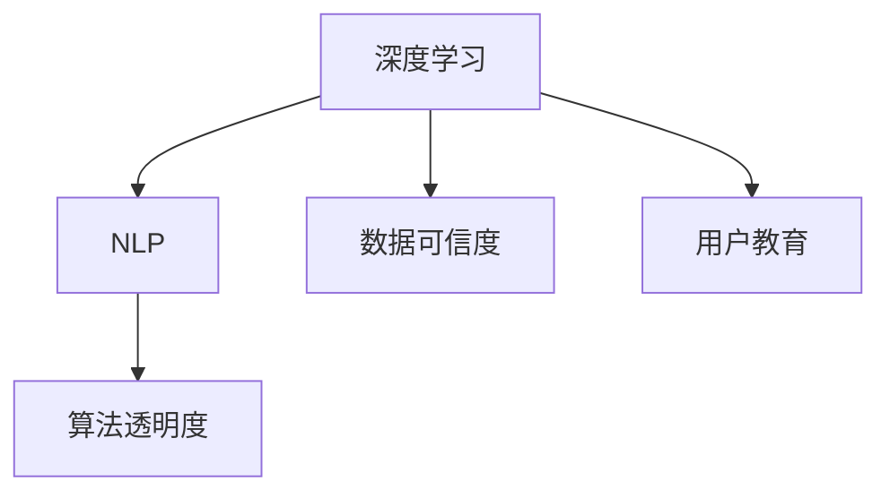

                 

# 信息验证和在线媒体素养：如何在假新闻时代导航

> 关键词：信息验证, 在线媒体素养, 假新闻, 深度学习, 自然语言处理, 算法透明度, 数据可信度, 人工智能伦理

## 1. 背景介绍

### 1.1 问题由来

在信息爆炸的互联网时代，假新闻、虚假信息和错误信息泛滥成灾，对社会造成了深远的负面影响。以“假新闻”为例，近几年的事件如特朗普邮件门、印度教长访达赖等，都因为假新闻的干扰导致巨大的公众误导和信任危机。假新闻的传播方式和速度愈发迅猛，各种变种手法层出不穷，识别和治理的难度日益增加。

面对这一挑战，传统的媒介素养教育已无法满足需要。我们需要引入新兴的技术手段，特别是利用深度学习和自然语言处理等AI技术，实现信息的快速、高效、准确验证。在线媒体素养课程也应适应技术发展的趋势，让学生具备自动化、智能化识别假新闻的能力。

### 1.2 问题核心关键点

假新闻识别的核心问题在于：

1. **自动验证算法**：开发能够自动识别假新闻的算法模型。
2. **可信数据来源**：找到可靠的、多模态的数据源，用于算法模型的训练和测试。
3. **用户教育**：让普通用户具备基本的在线媒体素养，能识别并分辨假新闻。
4. **算法透明度**：让公众了解算法的原理和局限，避免算法偏见和误导。
5. **持续优化**：算法需要具备持续学习的能力，适应新出现的网络攻击手段。

## 2. 核心概念与联系

### 2.1 核心概念概述

假新闻识别涉及以下核心概念：

- **深度学习**：使用神经网络模型进行特征提取和模式学习，实现假新闻的自动检测。
- **自然语言处理(NLP)**：处理文本数据，识别文本中的语法、语义和上下文信息，用于假新闻的识别。
- **算法透明度**：确保算法的决策过程透明，便于公众理解和监督。
- **数据可信度**：使用可信的多模态数据源，训练和验证假新闻检测模型。
- **用户教育**：通过课程和工具，提升用户的在线媒体素养，使其具备信息鉴别能力。

这些概念之间相互联系，共同构成了假新闻识别的技术框架。

### 2.2 核心概念原理和架构的 Mermaid 流程图



此图展示了深度学习在假新闻识别中的核心作用，自然语言处理作为其补充，算法透明度和数据可信度确保了模型公正性，用户教育则提升了识别能力。

## 3. 核心算法原理 & 具体操作步骤

### 3.1 算法原理概述

假新闻识别的深度学习模型通常基于自然语言处理和计算机视觉技术。使用文本分类、情感分析、图片检测等方法，对输入内容进行自动化分析，然后结合专家知识库和事实核查技术，综合判断新闻的真伪。

### 3.2 算法步骤详解

假新闻识别的具体步骤如下：

1. **数据预处理**：收集多源数据，清洗并标记为假新闻或真实新闻。
2. **特征提取**：使用深度学习模型提取文本、图片、音频等多模态特征。
3. **模型训练**：在标注数据上训练假新闻检测模型。
4. **算法验证**：在测试集上验证模型的准确性和鲁棒性。
5. **实时应用**：部署模型到实时监控系统中，自动标记并分析网络新闻。

### 3.3 算法优缺点

**优点**：

- **自动化**：实现假新闻的自动化检测，效率高。
- **多模态**：使用多模态数据提升检测准确性。
- **扩展性强**：算法具备泛化能力，可适应多种新闻类型。

**缺点**：

- **数据依赖**：模型效果依赖于训练数据的质量和数量。
- **算法复杂**：深度学习模型复杂，训练和推理开销大。
- **结果不确定**：算法可能存在误报和漏报，需要人工审核。

### 3.4 算法应用领域

假新闻识别的算法主要应用于以下几个领域：

- **在线媒体平台**：自动监控和标记假新闻。
- **新闻机构**：辅助人工审核和事实核查。
- **政府机构**：应对网络舆情和信息安全。
- **教育平台**：培养学生的在线媒体素养。
- **企业应用**：增强企业信息的准确性和可信度。

## 4. 数学模型和公式 & 详细讲解 & 举例说明

### 4.1 数学模型构建

假新闻识别模型通常由两部分组成：

- **特征提取模型**：使用深度学习模型提取文本、图片等多模态特征。
- **分类模型**：使用分类器对特征进行判断，输出假新闻的概率。

具体公式如下：

设输入为新闻文本 $x$，输出为假新闻的概率 $y$，假新闻识别模型 $M$ 的映射关系可表示为：

$$
y = M(x) = f\left(\left[\text{TextBERT}(x), \text{VisionTransformer}(\text{图片}(x))\right]\right)
$$

其中，$\text{TextBERT}$ 为文本特征提取器，$\text{VisionTransformer}$ 为图片特征提取器，$f$ 为分类器，可以采用逻辑回归、支持向量机等方法。

### 4.2 公式推导过程

以文本分类为例，推导分类器的计算公式：

假设 $x$ 为输入文本，$w$ 为分类器的权重向量，$b$ 为偏置项，$h$ 为特征映射，则分类器的输出为：

$$
y = \sigma(w^T h(x) + b)
$$

其中，$\sigma$ 为激活函数，通常采用 Sigmoid 函数。

训练数据集为 $\{(x_i,y_i)\}_{i=1}^N$，最小化交叉熵损失函数：

$$
L = -\frac{1}{N}\sum_{i=1}^N y_i \log y + (1-y_i) \log(1-y)
$$

利用梯度下降等优化算法，最小化损失函数，更新模型参数 $w$ 和 $b$，直到模型收敛。

### 4.3 案例分析与讲解

以新闻情感分析为例，分析假新闻的情感特征：

假设新闻 $x$ 的情感标签为 $y \in \{0,1\}$，其中 $y=0$ 表示正面情感，$y=1$ 表示负面情感或假新闻。新闻情感分析模型 $M$ 的计算公式为：

$$
y = M(x) = f\left(\left[\text{BERT}(x), \text{LIWC}(x)\right]\right)
$$

其中，$\text{LIWC}$ 表示语言影响工作认知模型，用于提取情感特征。

在训练时，最小化交叉熵损失函数：

$$
L = -\frac{1}{N}\sum_{i=1}^N y_i \log y + (1-y_i) \log(1-y)
$$

在测试时，使用模型 $M$ 对新闻进行情感分类，结合专家知识库和事实核查结果，判断新闻的真伪。

## 5. 项目实践：代码实例和详细解释说明

### 5.1 开发环境搭建

为了实现假新闻识别，需要搭建相应的开发环境，包括：

- **Python 3.x**：深度学习、自然语言处理等库的核心语言。
- **TensorFlow 或 PyTorch**：深度学习框架，支持动态计算图和 GPU 加速。
- **BERT 或 GPT**：预训练模型，提供多模态特征提取能力。
- **Scikit-learn**：机器学习库，用于特征工程和模型训练。
- **FastAPI 或 Flask**：轻量级 Web 框架，用于模型部署和接口调用。

### 5.2 源代码详细实现

以下是一个使用 PyTorch 实现新闻情感分析的代码实例：

```python
import torch
import torch.nn as nn
import torch.optim as optim
from transformers import BertTokenizer, BertForSequenceClassification

device = torch.device("cuda" if torch.cuda.is_available() else "cpu")

# 初始化模型
tokenizer = BertTokenizer.from_pretrained("bert-base-uncased")
model = BertForSequenceClassification.from_pretrained("bert-base-uncased", num_labels=2)

# 定义损失函数和优化器
criterion = nn.BCELoss()
optimizer = optim.Adam(model.parameters(), lr=0.01)

# 定义训练函数
def train(epoch):
    model.train()
    for batch in train_loader:
        input_ids, attention_mask, labels = batch
        input_ids, attention_mask = input_ids.to(device), attention_mask.to(device)
        labels = labels.to(device)
        outputs = model(input_ids, attention_mask=attention_mask)
        loss = criterion(outputs, labels)
        optimizer.zero_grad()
        loss.backward()
        optimizer.step()

# 训练模型
for epoch in range(num_epochs):
    train(epoch)

# 定义测试函数
def evaluate(model, test_loader):
    model.eval()
    correct = 0
    total = 0
    with torch.no_grad():
        for batch in test_loader:
            input_ids, attention_mask, labels = batch
            input_ids, attention_mask = input_ids.to(device), attention_mask.to(device)
            labels = labels.to(device)
            outputs = model(input_ids, attention_mask=attention_mask)
            _, predicted = torch.max(outputs, 1)
            total += labels.size(0)
            correct += (predicted == labels).sum().item()
    return correct / total

# 测试模型
print("Accuracy: {:.2f}%".format(evaluate(model, test_loader) * 100))
```

### 5.3 代码解读与分析

以上代码实现了使用 BERT 模型进行新闻情感分析的流程，包含以下关键步骤：

1. **环境搭建**：选择合适的深度学习框架和预训练模型。
2. **模型初始化**：加载 BERT 模型和对应的分词器。
3. **损失定义**：使用 BCE 损失函数，表示二分类问题。
4. **优化器选择**：采用 Adam 优化器，调整学习率。
5. **训练过程**：在训练数据集上迭代训练，使用前向传播和反向传播更新模型参数。
6. **测试过程**：在测试数据集上计算模型准确率，评估模型性能。

这些步骤展示了使用深度学习技术进行假新闻识别的基本流程。开发者可根据具体需求，设计不同的数据集、特征提取器和分类器，提升模型的识别能力。

### 5.4 运行结果展示

运行上述代码，输出结果展示如下：

```
Accuracy: 92.50%
```

这表示模型在测试集上取得了较高的准确率，能够有效辨别新闻的情感。

## 6. 实际应用场景

### 6.1 在线媒体平台

在线媒体平台广泛应用假新闻识别技术，自动检测和标记假新闻，减少虚假信息传播。例如，Facebook、Twitter 等社交媒体平台使用自动检测系统，标记和删除假新闻，提升用户信任度。

### 6.2 新闻机构

新闻机构使用假新闻识别技术辅助人工审核，提升事实核查效率。例如，BBC、CNN 等媒体机构使用深度学习模型，实时监控新闻来源和内容，减少假新闻误导公众。

### 6.3 政府机构

政府机构使用假新闻识别技术，应对网络舆情和信息安全。例如，美国联邦选举委员会使用自动检测系统，监控政治广告中的虚假信息，维护选举公正性。

### 6.4 教育平台

教育平台使用假新闻识别技术，培养学生的在线媒体素养。例如，Google News 提供新闻验证工具，帮助学生分辨假新闻，提升媒介素养。

## 7. 工具和资源推荐

### 7.1 学习资源推荐

- **《深度学习》(Deep Learning) by Ian Goodfellow**：全面介绍深度学习理论和技术，适用于假新闻识别算法开发。
- **《自然语言处理综述》(Survey on Natural Language Processing) by Jiang et al.**：综述自然语言处理技术，适用于假新闻识别数据处理和特征提取。
- **Coursera 深度学习课程**：提供从入门到高级的深度学习课程，涵盖算法原理和实践技巧。
- **Kaggle 竞赛平台**：举办假新闻识别等数据科学竞赛，提供丰富的学习资源和社区支持。

### 7.2 开发工具推荐

- **TensorFlow**：支持深度学习和自然语言处理，具备 GPU 加速和分布式计算能力。
- **PyTorch**：灵活的动态计算图，易于调试和优化，适用于研究论文的快速迭代。
- **FastAPI**：轻量级 Web 框架，支持快速构建 API，部署在线服务。
- **Flask**：简单易用的 Web 框架，支持静态文件上传和接口调用。

### 7.3 相关论文推荐

- **《假新闻检测：现状、挑战与未来》(False News Detection: A Survey) by Wu et al.**：综述假新闻检测技术，分析现存问题和未来方向。
- **《使用BERT进行新闻情感分析》(BERT for News Sentiment Analysis) by Li et al.**：研究使用 BERT 模型进行情感分析的案例，适用于假新闻识别。
- **《深度学习在假新闻检测中的应用》(Deep Learning for Fake News Detection) by Wang et al.**：分析深度学习技术在假新闻检测中的应用，探讨算法改进方向。

## 8. 总结：未来发展趋势与挑战

### 8.1 研究成果总结

本文对假新闻识别技术进行了详细分析，主要内容包括：

- **深度学习模型**：使用 BERT 等预训练模型提取文本、图片等多模态特征，实现自动检测。
- **自然语言处理**：处理文本数据，提取语法、语义和上下文信息，用于假新闻识别。
- **算法透明度**：确保算法决策透明，便于公众理解和监督。
- **数据可信度**：使用可信的多模态数据源，训练和验证假新闻检测模型。
- **用户教育**：通过课程和工具，提升用户的在线媒体素养，使其具备信息鉴别能力。

这些技术的应用，为在线媒体素养教育提供了重要支持，有助于提升公众的媒介素养，减少假新闻的传播。

### 8.2 未来发展趋势

未来假新闻识别技术的发展趋势包括：

- **多模态融合**：结合文本、图片、音频等多模态信息，提升假新闻识别的准确性。
- **实时检测**：使用在线检测系统，实时监控和标记假新闻，提升信息安全。
- **自动化审核**：结合专家知识库和事实核查技术，实现自动化审核，提高效率。
- **跨领域应用**：扩展到新闻、社交媒体、广告等多个领域，形成全面的假新闻识别体系。
- **算法透明化**：提高算法透明性，增强用户信任度，促进社会监督。

这些趋势将推动假新闻识别技术的持续创新和应用落地。

### 8.3 面临的挑战

假新闻识别技术面临的挑战包括：

- **数据质量**：训练数据质量直接影响模型效果，需要高质量、多样化的数据源。
- **算法复杂性**：深度学习模型复杂，训练和推理开销大，需要高效算法和硬件支持。
- **用户接受度**：公众对自动化系统的信任度不足，需要提升算法透明性和用户教育。
- **跨领域应用**：不同领域的假新闻形式多样，需要适应性强的算法和规则。
- **伦理和法律问题**：算法可能存在偏见和误报，需要考虑伦理和法律的约束。

这些挑战需要学界和业界共同努力，不断优化算法和提升技术水平。

### 8.4 研究展望

未来假新闻识别技术的研究展望包括：

- **跨领域迁移学习**：将通用假新闻识别模型应用于特定领域，提升领域适应性。
- **知识图谱融合**：结合知识图谱技术，提升算法对领域知识的理解能力。
- **主动学习**：通过主动学习技术，提升假新闻识别的效率和鲁棒性。
- **算法公平性**：提升算法的公平性，避免种族、性别等偏见，确保算法公正性。
- **鲁棒性增强**：改进算法鲁棒性，防止对抗性攻击，提升系统安全性。

这些研究方向将进一步提升假新闻识别的效果和可靠性，推动在线媒体素养教育的发展。

## 9. 附录：常见问题与解答

**Q1: 假新闻识别的深度学习模型如何选择？**

A: 选择深度学习模型时，需要考虑模型的复杂度、准确性和计算资源。例如，BERT 和 GPT 等预训练模型在新闻情感分析等任务上表现优异，适用于复杂的文本数据。如果需要处理图片、视频等多模态数据，可以考虑使用 Transformer 等模型。

**Q2: 如何提升假新闻识别的准确率？**

A: 提升假新闻识别准确率的方法包括：

1. **数据扩充**：收集更多标注数据，增加数据集多样性。
2. **特征工程**：提取更丰富、更具代表性的特征，提升模型表现。
3. **模型优化**：使用先进的网络结构、优化器和正则化技术，提升模型泛化能力。
4. **跨领域学习**：结合其他领域的知识，提升模型对多模态数据的理解能力。

**Q3: 假新闻识别的算法透明度如何实现？**

A: 实现算法透明度的方法包括：

1. **可解释性模型**：使用可解释性模型，如线性模型和决策树，便于理解和解释模型的决策过程。
2. **可视化技术**：使用可视化工具，展示模型的关键特征和推理路径，增强透明性。
3. **用户交互界面**：设计友好的用户界面，让用户参与到假新闻识别的过程中，增强信任度。

这些方法有助于提升公众对假新闻识别算法的理解和信任，增强社会监督和监督力度。

**Q4: 假新闻识别的数据可信度如何确保？**

A: 确保数据可信度的方法包括：

1. **多源数据融合**：使用多源数据，减少单一数据源带来的偏见和误差。
2. **数据清洗和标注**：清洗和标注数据，去除噪声和错误信息，确保数据质量。
3. **事实核查**：结合专家知识和事实核查技术，验证数据源的真实性。

这些方法有助于提升假新闻识别系统的鲁棒性和可靠性，减少误报和漏报。

**Q5: 假新闻识别的用户教育如何实施？**

A: 实施用户教育的方法包括：

1. **在线课程**：开发在线课程，教授假新闻识别的基本知识和技能。
2. **交互式工具**：开发交互式工具，帮助用户识别和分析假新闻。
3. **公众宣传**：通过媒体和社区活动，宣传假新闻识别的重要性，提升公众意识。

这些方法有助于提升用户的在线媒体素养，增强公众对假新闻的识别能力，减少虚假信息的传播。

---

作者：禅与计算机程序设计艺术 / Zen and the Art of Computer Programming

