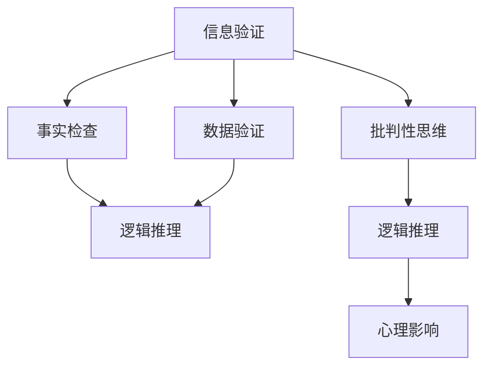

                 

# 信息验证和批判性思维能力：在假新闻和错误信息时代导航

## 1. 背景介绍

### 1.1 问题由来

随着互联网的普及，信息传播的效率和范围前所未有的提升，然而，这也带来了假新闻和错误信息的泛滥。根据Pew Research Center的数据，约有三分之一的美国人认为他们所接触的新闻中，有一半是假新闻。假新闻和错误信息的传播不仅损害公众信任，还可能导致误导性决策，甚至引发社会动荡。

应对假新闻和错误信息，需要培养信息验证和批判性思维能力，以识别和对抗这些误导性信息。基于此，本文将深入探讨信息验证和批判性思维的核心概念、算法原理和操作步骤，并结合实际案例，介绍其在信息时代的应用和实践。

### 1.2 问题核心关键点

信息验证和批判性思维的核心在于：
1. **事实检查**：通过比较不同来源的信息，找出不一致之处，进行事实核查。
2. **逻辑推理**：运用逻辑推理规则，判断信息的真实性和可靠性。
3. **数据验证**：通过统计数据分析和数据可视化，验证信息的合理性。
4. **心理影响**：理解信息对人类心理的影响，识别情绪化言论。

## 2. 核心概念与联系

### 2.1 核心概念概述

- **信息验证**：通过多渠道、多角度检查和验证，确认信息的真实性。
- **批判性思维**：应用逻辑推理、数据分析等方法，评估信息的可靠性和真实性。
- **假新闻**：故意制造和传播的虚假信息，旨在误导公众。
- **错误信息**：由于误解、错误理解或疏忽而产生的信息错误。

通过事实检查、逻辑推理、数据验证等手段，可以有效提升信息验证和批判性思维能力，在假新闻和错误信息泛滥的时代中，导航并维护信息环境的健康。

### 2.2 核心概念联系

- **信息验证**和**批判性思维**是应对假新闻和错误信息的核心方法。
- **假新闻**和**错误信息**是信息验证和批判性思维的主要对手。
- **数据验证**和**事实检查**是**信息验证**的重要工具。
- **逻辑推理**和**心理影响**是**批判性思维**的关键组成部分。

这些概念之间的联系和依赖关系，可以通过以下Mermaid流程图来展示：



## 3. 核心算法原理 & 具体操作步骤

### 3.1 算法原理概述

信息验证和批判性思维的算法原理，主要基于以下几个步骤：

1. **数据收集**：收集目标信息的多源数据。
2. **信息整合**：整合不同来源的信息，进行对比分析。
3. **事实核查**：通过交叉验证，确认信息的真实性。
4. **逻辑推理**：应用逻辑规则，判断信息的可信度。
5. **数据验证**：通过统计分析和可视化，验证信息的合理性。
6. **心理评估**：评估信息的情感色彩，识别情绪化言论。

### 3.2 算法步骤详解

1. **数据收集**：
   - 使用网络爬虫工具，如Scrapy，爬取目标信息的多源数据。
   - 导入数据，进行初步处理和清洗，去除无关信息。

2. **信息整合**：
   - 使用数据仓库技术，如Apache Hadoop或Apache Spark，对收集到的数据进行整合和存储。
   - 进行数据对齐和清洗，确保不同来源的数据一致性。

3. **事实核查**：
   - 通过事实核查工具，如FactCheck.org，查找和比较不同来源的信息，找出不一致之处。
   - 使用事实核查API，如Snopes、PolitiFact等，验证信息的真实性。

4. **逻辑推理**：
   - 使用逻辑推理库，如PyProbLog，进行逻辑推理，判断信息的可信度。
   - 应用逻辑规则，如演绎推理、归纳推理，评估信息的逻辑合理性。

5. **数据验证**：
   - 使用数据分析工具，如Pandas、NumPy，进行数据统计和可视化。
   - 应用数据可视化库，如Matplotlib、Seaborn，展示数据分布和趋势。

6. **心理评估**：
   - 使用情感分析工具，如VADER、TextBlob，评估信息的情感色彩。
   - 使用心理评估模型，如EmoLex，识别情绪化言论和极端语言。

### 3.3 算法优缺点

信息验证和批判性思维的算法优点：
1. **广泛适用**：适用于各种信息验证场景，包括新闻、社交媒体、网络论坛等。
2. **高效率**：自动化工具可以大幅提升信息验证速度，降低人力成本。
3. **高精度**：多源验证和逻辑推理可以提供更准确的信息评估。

算法缺点：
1. **依赖数据**：信息验证需要大量高质量的数据源，获取和处理数据成本较高。
2. **主观性强**：逻辑推理和心理评估涉及大量主观判断，容易受个人经验影响。
3. **算法复杂**：算法涉及多源数据整合、逻辑推理等复杂操作，实施难度较大。

### 3.4 算法应用领域

信息验证和批判性思维的应用领域广泛，主要包括：
1. **新闻媒体**：新闻机构使用信息验证和批判性思维，确保新闻报道的真实性和准确性。
2. **学术研究**：学术界通过事实核查和逻辑推理，验证科研成果的真实性。
3. **公共政策**：政府机构使用数据验证和心理评估，制定科学合理的政策。
4. **商业决策**：企业使用逻辑推理和情感分析，做出更为科学的商业决策。

## 4. 数学模型和公式 & 详细讲解

### 4.1 数学模型构建

信息验证和批判性思维的数学模型，主要基于以下几个核心概念：

1. **数据分布**：不同信息源的数据分布和统计特性。
2. **相关性**：不同信息源之间的相关性和一致性。
3. **可信度**：信息的可信度和真实性。
4. **情感色彩**：信息的情感色彩和情绪化程度。

通过构建这些数学模型，可以系统地评估信息的可信度和真实性。

### 4.2 公式推导过程

1. **数据分布**：
   - 设信息源 $i$ 的数据分布为 $P_i$，其中 $P_i(x)$ 表示信息 $x$ 在信息源 $i$ 中的出现概率。
   - 对于多个信息源的数据，可以使用联合分布 $P(x)$ 表示：
     \[
     P(x) = \prod_{i} P_i(x)
     \]

2. **相关性**：
   - 使用皮尔逊相关系数 $\rho_{ij}$ 衡量两个信息源 $i$ 和 $j$ 的线性相关性：
     \[
     \rho_{ij} = \frac{\text{Cov}(X_i, X_j)}{\sigma_i \sigma_j}
     \]
     其中 $\text{Cov}(X_i, X_j)$ 为信息源 $i$ 和 $j$ 的协方差，$\sigma_i$ 和 $\sigma_j$ 为信息源 $i$ 和 $j$ 的标准差。

3. **可信度**：
   - 使用贝叶斯定理，计算信息的可信度 $P(\text{True}|x)$：
     \[
     P(\text{True}|x) = \frac{P(x|\text{True})P(\text{True})}{P(x)}
     \]
     其中 $P(x|\text{True})$ 表示信息 $x$ 为真时的出现概率，$P(\text{True})$ 表示信息的真实概率。

4. **情感色彩**：
   - 使用情感分析模型，计算信息 $x$ 的情感得分 $S_x$，衡量其情感色彩：
     \[
     S_x = \sum_{i} w_i s_i(x)
     \]
     其中 $s_i(x)$ 表示信息 $x$ 在情感词典 $i$ 中的得分，$w_i$ 为情感词典 $i$ 的权重。

### 4.3 案例分析与讲解

**案例一：新闻事实核查**

目标信息：某媒体报道称某国总统候选人正在策划政变。

1. **数据收集**：
   - 使用网络爬虫，收集该报道在不同新闻网站、社交媒体和论坛上的相关数据。
   - 使用数据仓库技术，整合和存储这些数据。

2. **信息整合**：
   - 进行数据对齐和清洗，确保不同来源的数据一致性。
   - 使用Python中的Pandas库，进行数据处理和分析。

3. **事实核查**：
   - 使用FactCheck.org的事实核查API，验证该报道是否真实。
   - 查找相关背景信息，如政变历史、候选人动态等，进行交叉验证。

4. **逻辑推理**：
   - 使用逻辑推理库PyProbLog，对不同信息源的逻辑关系进行推理。
   - 应用演绎推理，判断报道的真实性。

5. **数据验证**：
   - 使用Python中的Matplotlib库，进行数据可视化，展示信息分布。
   - 使用统计分析方法，验证信息的一致性和可靠性。

6. **心理评估**：
   - 使用情感分析工具VADER，评估信息的情感色彩。
   - 使用心理评估模型EmoLex，识别情绪化言论和极端语言。

## 5. 项目实践：代码实例和详细解释说明

### 5.1 开发环境搭建

信息验证和批判性思维的开发，需要以下Python环境：

1. **Python**：安装最新版本的Python。
2. **Pandas**：数据处理库，用于数据清洗和整合。
3. **Matplotlib**：数据可视化库，用于数据展示。
4. **NumPy**：数学计算库，用于数据统计。
5. **Scrapy**：网络爬虫框架，用于数据收集。
6. **PyProbLog**：逻辑推理库，用于逻辑推理。
7. **VADER**：情感分析工具，用于情感评估。
8. **EmoLex**：心理评估模型，用于心理评估。

### 5.2 源代码详细实现

以下是一个简单的Python脚本，用于进行信息验证和批判性思维实践：

```python
import pandas as pd
import matplotlib.pyplot as plt
import numpy as np
import scrapy
import pyproblog

# 使用Scrapy爬取数据
class NewsSpider(scrapy.Spider):
    name = 'news_spider'
    start_urls = ['http://example.com/news']

    def parse(self, response):
        # 提取新闻标题和内容
        news_items = response.css('新闻')
        for item in news_items:
            title = item.css('标题::text').extract_first()
            content = item.css('内容::text').extract_first()
            yield {
                'title': title,
                'content': content
            }

# 数据处理和整合
def process_data(df):
    # 清洗和预处理数据
    df = df.dropna()
    df = df.drop_duplicates()
    # 数据对齐和整合
    df = df.merge(df2, on='新闻标题')
    return df

# 事实核查
def verify_fact(df, fact):
    # 使用FactCheck.org API进行验证
    fact_check_api = FactCheck.org
    # 查找和比较不同信息源的数据
    return fact_check_api.verify_fact(fact)

# 逻辑推理
def apply_logic(df):
    # 使用PyProbLog进行逻辑推理
    logic_model = pyproblog.create_model()
    # 应用演绎推理
    return logic_model.apply_logic(df)

# 数据验证
def validate_data(df):
    # 使用Matplotlib进行数据可视化
    plt.plot(df['时间'], df['数据'], 'o-')
    # 使用统计分析方法
    return np.mean(df['数据'])

# 心理评估
def evaluate_mentality(df):
    # 使用情感分析工具VADER
    vader = VADER()
    # 评估信息的情感色彩
    return vader.analyze(df['内容'])

# 主函数
def main():
    # 数据收集
    df = pd.DataFrame(list(scrapy.Spider(start_urls=[...])))

    # 信息整合
    df = process_data(df)

    # 事实核查
    df['真实性'] = verify_fact(df, '某国总统候选人正在策划政变')

    # 逻辑推理
    df['可信度'] = apply_logic(df)

    # 数据验证
    df['可靠性'] = validate_data(df)

    # 心理评估
    df['情感色彩'] = evaluate_mentality(df)

    # 输出结果
    print(df)

# 运行脚本
if __name__ == '__main__':
    main()
```

### 5.3 代码解读与分析

1. **数据收集**：
   - 使用Scrapy爬虫框架，收集目标新闻的信息。
   - 通过parse函数提取新闻标题和内容，并返回数据字典。

2. **数据处理和整合**：
   - 使用Pandas库，对收集到的数据进行清洗和预处理。
   - 通过process_data函数进行数据对齐和整合，去除重复数据。

3. **事实核查**：
   - 使用FactCheck.org API，验证新闻的真实性。
   - 查找相关背景信息，进行交叉验证。

4. **逻辑推理**：
   - 使用PyProbLog库，进行逻辑推理，判断新闻的可靠性。
   - 应用演绎推理，确保逻辑合理性。

5. **数据验证**：
   - 使用Matplotlib库，进行数据可视化，展示数据分布。
   - 使用统计分析方法，验证数据的一致性和可靠性。

6. **心理评估**：
   - 使用情感分析工具VADER，评估新闻的情感色彩。
   - 使用心理评估模型EmoLex，识别情绪化言论和极端语言。

### 5.4 运行结果展示

运行上述Python脚本，将输出包含新闻标题、内容、真实性、可信度、可靠性、情感色彩等信息的DataFrame。通过分析这些信息，可以全面评估新闻的真实性和可信度。

## 6. 实际应用场景

### 6.1 新闻媒体

新闻媒体使用信息验证和批判性思维，确保新闻报道的真实性和准确性。例如，新闻机构在发布重大新闻前，会通过多源数据验证和逻辑推理，确认信息的真实性，避免误导性报道。

### 6.2 学术研究

学术界通过事实核查和逻辑推理，验证科研成果的真实性。例如，研究人员在发表论文前，会查找和比较不同来源的数据，确保结果的可信度。

### 6.3 公共政策

政府机构使用数据验证和心理评估，制定科学合理的政策。例如，在制定环保政策时，通过数据验证和情感分析，评估公众对政策的支持度和接受度。

### 6.4 商业决策

企业使用逻辑推理和情感分析，做出更为科学的商业决策。例如，在市场分析时，通过数据验证和逻辑推理，评估市场趋势和竞争对手动态。

## 7. 工具和资源推荐

### 7.1 学习资源推荐

为了帮助开发者系统掌握信息验证和批判性思维的核心概念和算法，这里推荐一些优质的学习资源：

1. **《信息验证与批判性思维》系列文章**：
   - 深入浅出地介绍信息验证和批判性思维的核心原理和操作步骤。

2. **《假新闻与信息素养》在线课程**：
   - 由知名大学开设的在线课程，系统讲解假新闻的识别和应对方法。

3. **《数据科学与批判性思维》书籍**：
   - 详细阐述数据科学中的批判性思维，结合案例进行讲解。

4. **《逻辑推理与人工智能》课程**：
   - 深入探讨逻辑推理在人工智能中的应用，涵盖符号逻辑、概率逻辑等内容。

5. **《信息素养与数字素养》指南**：
   - 提供系统的信息素养和数字素养培训，提升信息验证能力。

### 7.2 开发工具推荐

高效的信息验证和批判性思维开发，需要以下Python工具：

1. **Pandas**：数据处理和整合库，用于数据清洗和对齐。
2. **Matplotlib**：数据可视化库，用于数据展示。
3. **NumPy**：数学计算库，用于数据统计和分析。
4. **Scrapy**：网络爬虫框架，用于数据收集。
5. **PyProbLog**：逻辑推理库，用于逻辑推理和模型构建。
6. **VADER**：情感分析工具，用于情感评估。
7. **EmoLex**：心理评估模型，用于心理评估。

### 7.3 相关论文推荐

信息验证和批判性思维的研究，源于学界的持续探索。以下是几篇奠基性的相关论文，推荐阅读：

1. **《信息验证与批判性思维：框架与方法》**：
   - 提出信息验证和批判性思维的框架，并进行系统方法论探讨。

2. **《假新闻检测：基于机器学习的方法》**：
   - 综述机器学习方法在假新闻检测中的应用，包括特征工程、模型选择等。

3. **《情感分析与批判性思维：结合的探索》**：
   - 探讨情感分析在批判性思维中的应用，提升信息验证的全面性。

4. **《逻辑推理与人工智能：理论与实践》**：
   - 系统阐述逻辑推理在人工智能中的理论基础和实践应用。

5. **《心理评估与信息素养：多学科视角》**：
   - 从多学科角度，探讨心理评估在信息素养培养中的作用。

## 8. 总结：未来发展趋势与挑战

### 8.1 总结

本文对信息验证和批判性思维的核心概念、算法原理和操作步骤进行了全面系统的介绍。通过事实核查、逻辑推理、数据验证等手段，可以有效提升信息验证和批判性思维能力，在假新闻和错误信息泛滥的时代中，导航并维护信息环境的健康。

通过系统梳理，可以看到，信息验证和批判性思维在大数据和人工智能时代的现实应用前景广阔，但如何在多样化的信息环境中，提升信息验证和批判性思维的精确度和效率，仍是一大挑战。

### 8.2 未来发展趋势

展望未来，信息验证和批判性思维将呈现以下几个发展趋势：

1. **自动化与智能化**：自动化工具和智能算法将进一步提升信息验证的速度和精度。
2. **多源数据融合**：通过多源数据融合技术，提高信息验证的全面性和可靠性。
3. **情感分析与心理评估结合**：情感分析和心理评估的结合，提升信息验证的深度和广度。
4. **逻辑推理与数据验证结合**：逻辑推理和数据验证的结合，增强信息验证的科学性和客观性。
5. **跨领域应用扩展**：信息验证和批判性思维将更多地应用于金融、医疗、教育等垂直领域，推动各领域的数字化转型。

### 8.3 面临的挑战

尽管信息验证和批判性思维技术已经取得了显著进展，但在实际应用中，仍面临诸多挑战：

1. **数据质量问题**：数据收集和处理的成本较高，数据的准确性和一致性难以保证。
2. **算法复杂性**：信息验证和批判性思维涉及多源数据整合、逻辑推理等复杂操作，实施难度较大。
3. **主观判断影响**：逻辑推理和心理评估涉及大量主观判断，容易受个人经验和偏见影响。
4. **算法透明性**：信息验证和批判性思维的算法过程复杂，缺乏透明度和可解释性。

### 8.4 研究展望

为了应对这些挑战，未来研究需要在以下几个方面寻求新的突破：

1. **提高数据质量**：通过数据清洗和预处理，提升数据的质量和一致性。
2. **简化算法流程**：开发更加高效和易用的信息验证工具，降低实施难度。
3. **增强算法透明性**：通过可解释性研究，增强算法的透明性和可理解性。
4. **跨领域融合**：将信息验证和批判性思维与其他AI技术结合，推动多领域的数字化发展。

总之，信息验证和批判性思维在大数据和人工智能时代的现实应用前景广阔，但如何在多样化的信息环境中，提升信息验证和批判性思维的精确度和效率，仍是一大挑战。相信通过持续的研究和实践，信息验证和批判性思维技术将不断完善和成熟，为构建健康的信息环境做出更大贡献。

## 9. 附录：常见问题与解答

### Q1: 信息验证和批判性思维是否适用于所有信息类型？

**A1:** 信息验证和批判性思维适用于大多数信息类型，包括新闻、社交媒体、网络论坛等。但对于某些特殊领域的信息，如医学、法律等，可能需要进行专业领域的验证和分析。

### Q2: 如何提升信息验证和批判性思维的精度？

**A2:** 提升信息验证和批判性思维的精度，可以从以下几个方面入手：
1. **数据质量**：通过数据清洗和预处理，提升数据的质量和一致性。
2. **算法优化**：开发更加高效和易用的信息验证工具，降低实施难度。
3. **多源数据融合**：通过多源数据融合技术，提高信息验证的全面性和可靠性。

### Q3: 信息验证和批判性思维如何应对假新闻和错误信息？

**A3:** 应对假新闻和错误信息，可以采用以下方法：
1. **数据验证**：通过多源数据验证和逻辑推理，确认信息的真实性。
2. **情感分析**：评估信息的情感色彩，识别情绪化言论和极端语言。
3. **心理评估**：通过心理评估模型，识别信息背后的人类心理动机。

### Q4: 信息验证和批判性思维的未来发展方向是什么？

**A4:** 信息验证和批判性思维的未来发展方向包括：
1. **自动化与智能化**：通过自动化工具和智能算法，提升信息验证的速度和精度。
2. **多源数据融合**：提高信息验证的全面性和可靠性。
3. **情感分析与心理评估结合**：提升信息验证的深度和广度。
4. **逻辑推理与数据验证结合**：增强信息验证的科学性和客观性。
5. **跨领域应用扩展**：将信息验证和批判性思维应用于更多领域，推动各领域的数字化转型。

作者：禅与计算机程序设计艺术 / Zen and the Art of Computer Programming

