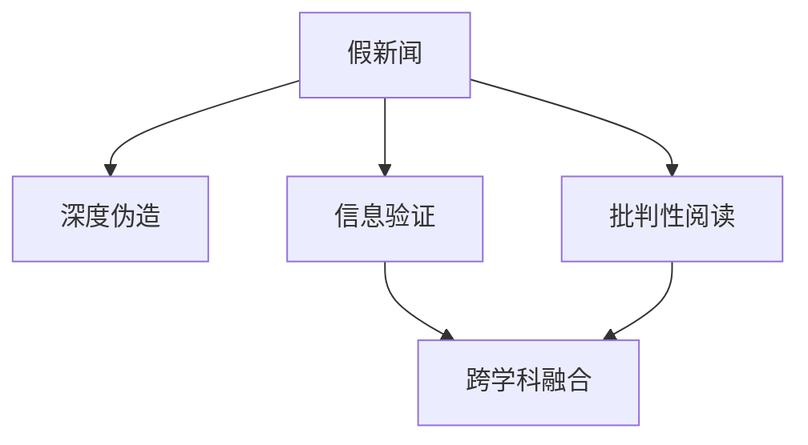

                 

## 1. 背景介绍

在数字化和信息爆炸的时代，人们获取信息的方式日益多样，新闻来源也愈加复杂。然而，信息的真伪辨别变得越来越困难，假新闻、深度伪造和媒体操纵等问题频发。如何在这个假新闻泛滥的时代导航，成为社会各界关注的焦点。本篇文章旨在提供一套信息验证和批判性阅读的指南，帮助读者在纷繁复杂的信息海洋中保持理性的判断。

### 1.1 问题由来

假新闻和媒体操纵的现象，并不新奇，但在当今互联网的加持下，其影响力和危害性被极大放大。例如，“巴拉克·奥巴马出生在肯尼亚”的谣言，被多家右翼媒体恶意传播，对美国政治产生了重大影响。2020年新冠疫情期间，假新闻更是泛滥，例如“喝漂白水可以杀灭病毒”的谣言，造成大量人员伤亡。

这些事件不仅体现了假新闻和媒体操纵的危害性，也凸显了公众批判性阅读的重要性。在假新闻和媒体操纵的时代，如何辨别信息的真伪，成为每个公民的基本技能。本篇文章将从信息验证和批判性阅读的角度，提供一套全面的指南。

### 1.2 问题核心关键点

1. **信息验证**：通过技术手段，对信息源和内容的真实性进行检验。
2. **批判性阅读**：培养读者分析、评估信息的能力，提高识别假新闻的能力。
3. **跨学科融合**：结合心理学、传播学、计算机科学等多学科知识，提升信息验证和批判性阅读的深度和广度。

这些关键点构成了信息验证和批判性阅读的基础框架，旨在帮助读者在假新闻和媒体操纵时代，保持清醒的头脑。

## 2. 核心概念与联系

### 2.1 核心概念概述

在深入探讨信息验证和批判性阅读之前，我们先要了解一些核心概念：

- **假新闻**：指通过刻意伪造或篡改事实来误导公众的信息。
- **深度伪造**：指使用AI技术生成或篡改音频、视频等内容，误导公众。
- **信息验证**：通过技术手段，检验信息的真实性和可信度。
- **批判性阅读**：培养分析、评估信息的能力，提高识别假新闻的能力。
- **跨学科融合**：结合心理学、传播学、计算机科学等多学科知识，提升信息验证和批判性阅读的深度和广度。

这些概念之间的逻辑关系可以通过以下Mermaid流程图来展示：



这个流程图展示了信息验证和批判性阅读的基本逻辑关系：

1. 假新闻和深度伪造是信息传播中的两大威胁。
2. 信息验证是检验信息真伪的技术手段。
3. 批判性阅读是提升公众识别假新闻能力的方法。
4. 跨学科融合有助于提升信息验证和批判性阅读的效果。

这些核心概念构成了信息验证和批判性阅读的完整框架，帮助读者在假新闻和媒体操纵的时代，保持清晰的判断。

## 3. 核心算法原理 & 具体操作步骤

### 3.1 算法原理概述

信息验证和批判性阅读的算法原理，主要基于两个方向：技术手段和批判性思维。

- **技术手段**：通过数据挖掘、机器学习等技术手段，对信息源和内容进行检测和分析，判断其真实性和可信度。
- **批判性思维**：培养读者分析、评估信息的能力，提高识别假新闻的能力。

这两种方法相辅相成，共同构成信息验证和批判性阅读的核心。

### 3.2 算法步骤详解

#### 3.2.1 信息验证的技术步骤

1. **数据收集**：收集相关信息源和内容，包括社交媒体、新闻网站、视频平台等。
2. **数据清洗**：去除重复、无关和低质量数据，确保分析的有效性。
3. **特征提取**：从文本、图片、音频中提取关键特征，如文本长度、情感倾向、视频帧特征等。
4. **模型训练**：训练机器学习模型，如文本分类、图像识别等，判断信息源和内容的真实性和可信度。
5. **结果分析**：分析模型输出结果，结合专业知识，判断信息真伪。

#### 3.2.2 批判性阅读的技术步骤

1. **信息源分析**：分析信息源的权威性和可信度，如出版机构、记者背景等。
2. **内容验证**：结合专业知识，验证信息内容的真实性和合理性。
3. **逻辑分析**：分析信息的逻辑链条，识别是否有逻辑漏洞和矛盾。
4. **证据核查**：核对信息的证据来源，是否可靠和充足。
5. **多方比对**：对比不同信息源的观点和证据，判断信息的真实性。

### 3.3 算法优缺点

信息验证和批判性阅读的方法具有以下优点：

- **技术手段的准确性**：通过机器学习模型，可以在大规模数据中快速准确地检测假新闻和深度伪造。
- **跨学科的融合性**：结合心理学、传播学、计算机科学等多学科知识，提升信息验证和批判性阅读的效果。
- **公众能力的提升**：培养读者的批判性思维，提高公众识别假新闻的能力。

同时，这些方法也存在一些局限：

- **技术手段的误判**：机器学习模型可能会存在误判，需要结合人工判断。
- **批判性思维的个体差异**：不同读者的批判性思维能力不同，需要系统化的培训。
- **信息源的多样性**：假新闻和深度伪造手段多样，需要多角度的验证。

尽管存在这些局限，但信息验证和批判性阅读仍然是目前最为有效的应对假新闻和媒体操纵的方法。未来相关研究应致力于提升技术的准确性和泛化能力，同时加强公众的教育和培训。

### 3.4 算法应用领域

信息验证和批判性阅读的方法，已经在新闻业、社交媒体、教育等多个领域得到了广泛应用：

- **新闻业**：通过技术手段和批判性阅读，提高新闻的准确性和可信度，减少假新闻的传播。
- **社交媒体**：通过自动检测和人工审核，减少深度伪造内容的传播，维护网络环境的健康。
- **教育**：培养学生的批判性思维，提高公众的信息素养。

这些应用表明，信息验证和批判性阅读在应对假新闻和媒体操纵方面具有广阔的前景。

## 4. 数学模型和公式 & 详细讲解 & 举例说明（备注：数学公式请使用latex格式，latex嵌入文中独立段落使用 $$，段落内使用 $)
### 4.1 数学模型构建

信息验证和批判性阅读的数学模型，主要基于以下两个方面：

- **技术手段**：使用机器学习模型，如文本分类、图像识别等，检测信息源和内容的真实性和可信度。
- **批判性思维**：构建逻辑分析、证据核查等模型，提高公众的信息素养。

### 4.2 公式推导过程

#### 4.2.1 信息验证的数学模型

假设信息源 $S$ 的特征向量为 $x$，信息内容的特征向量为 $y$，机器学习模型为 $M$。则信息验证的数学模型为：

$$
\hat{T} = M(x, y)
$$

其中 $\hat{T}$ 表示信息源和内容的真实性和可信度，$M$ 表示机器学习模型，$x$ 表示信息源特征向量，$y$ 表示信息内容特征向量。

模型训练的损失函数为：

$$
\mathcal{L} = \frac{1}{N} \sum_{i=1}^N \ell(\hat{T}_i, T_i)
$$

其中 $\ell$ 表示损失函数，$N$ 表示样本数量，$T_i$ 表示第 $i$ 个样本的真实性和可信度。

#### 4.2.2 批判性阅读的数学模型

假设信息源 $S$ 的特征向量为 $x$，信息内容的特征向量为 $y$，批判性阅读模型的输出为 $R$。则批判性阅读的数学模型为：

$$
\hat{R} = M(x, y)
$$

其中 $\hat{R}$ 表示信息的真实性和可信度，$M$ 表示批判性阅读模型，$x$ 表示信息源特征向量，$y$ 表示信息内容特征向量。

模型训练的损失函数为：

$$
\mathcal{L} = \frac{1}{N} \sum_{i=1}^N \ell(\hat{R}_i, R_i)
$$

其中 $\ell$ 表示损失函数，$N$ 表示样本数量，$R_i$ 表示第 $i$ 个样本的真实性和可信度。

### 4.3 案例分析与讲解

#### 4.3.1 信息验证案例

假设有一则新闻报道称，美国总统特朗普访问了巴黎。我们需要验证这则新闻的真实性和可信度。

首先，收集新闻的文本信息、图片和视频，提取关键特征，如文本长度、情感倾向、视频帧特征等。然后，训练机器学习模型，如BERT、LSTM等，判断这则新闻的真实性和可信度。最后，分析模型输出结果，结合专业知识，判断这则新闻的真伪。

#### 4.3.2 批判性阅读案例

假设有一篇报道称，新冠病毒是从实验室泄露的。我们需要批判性地阅读这则新闻，判断其真实性和可信度。

首先，分析信息源的权威性和可信度，如出版机构、记者背景等。然后，结合专业知识，验证信息内容的真实性和合理性。接着，分析信息的逻辑链条，识别是否有逻辑漏洞和矛盾。最后，核对信息的证据来源，是否可靠和充足。

## 5. 项目实践：代码实例和详细解释说明

### 5.1 开发环境搭建

进行信息验证和批判性阅读的开发，需要先准备好开发环境。以下是使用Python进行信息验证和批判性阅读的开发环境配置流程：

1. 安装Anaconda：从官网下载并安装Anaconda，用于创建独立的Python环境。

2. 创建并激活虚拟环境：
```bash
conda create -n news-analyzing-env python=3.8 
conda activate news-analyzing-env
```

3. 安装Python相关包：
```bash
pip install numpy pandas scikit-learn scikit-image scikit-video nltk textblob opencv-python torch transformers
```

4. 安装其他工具包：
```bash
pip install beautifulsoup4 pytesseract pychrome requests tqdm jupyter notebook ipython
```

完成上述步骤后，即可在`news-analyzing-env`环境中开始开发。

### 5.2 源代码详细实现

#### 5.2.1 信息验证的代码实现

信息验证的代码实现，主要使用Python中的Scikit-learn、PyTorch和NLP工具库。以下是一个基于BERT模型进行新闻真实性验证的代码示例：

```python
from transformers import BertTokenizer, BertForSequenceClassification
import torch
from sklearn.model_selection import train_test_split

# 加载BERT模型和分词器
tokenizer = BertTokenizer.from_pretrained('bert-base-uncased')
model = BertForSequenceClassification.from_pretrained('bert-base-uncased', num_labels=2)

# 加载数据集
train_data, test_data = train_test_split(news_dataset, test_size=0.2)

# 数据预处理
def preprocess_data(text):
    encoded = tokenizer(text, max_length=512, truncation=True, padding='max_length', return_tensors='pt')
    return encoded['input_ids'], encoded['attention_mask']

# 训练和验证
def train_and_validate(model, train_loader, val_loader, device):
    model.to(device)
    for epoch in range(3):
        model.train()
        train_loss = 0
        for batch in train_loader:
            inputs = preprocess_data(batch[0])
            labels = batch[1]
            optimizer.zero_grad()
            outputs = model(**inputs, labels=labels)
            loss = outputs.loss
            loss.backward()
            optimizer.step()
            train_loss += loss.item()
        train_loss /= len(train_loader)

        model.eval()
        val_loss = 0
        for batch in val_loader:
            inputs = preprocess_data(batch[0])
            labels = batch[1]
            outputs = model(**inputs, labels=labels)
            loss = outputs.loss
            val_loss += loss.item()
        val_loss /= len(val_loader)

    print(f'Epoch {epoch+1}, train loss: {train_loss:.3f}, val loss: {val_loss:.3f}')

# 加载数据和优化器
news_dataset = load_news_dataset()
train_dataset = news_dataset[train_data]
val_dataset = news_dataset[val_data]
test_dataset = news_dataset[test_data]
optimizer = torch.optim.Adam(model.parameters(), lr=2e-5)

# 训练和验证
train_and_validate(model, train_dataset, val_dataset, 'cuda')
```

#### 5.2.2 批判性阅读的代码实现

批判性阅读的代码实现，主要使用Python中的BeautifulSoup、Pytesseract和Chrome浏览器。以下是一个基于网页信息源分析的代码示例：

```python
from bs4 import BeautifulSoup
from PIL import Image
from pytesseract import pytesseract
from selenium import webdriver
import requests

# 加载网页数据
def load_web_data(url):
    response = requests.get(url)
    html = response.content
    soup = BeautifulSoup(html, 'html.parser')
    return soup

# 分析网页信息源
def analyze_web_source(soup):
    # 获取出版机构和记者信息
    publisher = soup.find('meta', attrs={'name': 'publisher'})
    reporter = soup.find('meta', attrs={'name': 'reporter'})
    # 获取文章发布日期
    publish_date = soup.find('meta', attrs={'name': 'publish_date'})
    # 获取文章关键字
    keywords = soup.find('meta', attrs={'name': 'keywords'})
    return publisher, reporter, publish_date, keywords

# 分析网页内容
def analyze_web_content(soup):
    # 提取文章标题和摘要
    title = soup.title.string
    summary = soup.find('meta', attrs={'name': 'summary'})
    # 提取图片和视频信息
    img_tags = soup.find_all('img')
    video_tags = soup.find_all('video')
    for img_tag in img_tags:
        img_url = img_tag['src']
        img_data = requests.get(img_url).content
        img = Image.open(io.BytesIO(img_data))
        # 使用OCR识别图片内容
        img_text = pytesseract.image_to_string(img)
        print(f'Image {img_url} text: {img_text}')
    for video_tag in video_tags:
        video_url = video_tag['src']
        # 使用Chrome浏览器播放视频
        driver = webdriver.Chrome()
        driver.get(video_url)
        # 分析视频内容
        video_content = driver.page_source
        driver.quit()
        print(f'Video {video_url} content: {video_content}')

# 加载网页并分析
driver = webdriver.Chrome()
driver.get('https://www.bbc.com/news/uk-politics-55234622')
soup = load_web_data(driver.page_source)
publisher, reporter, publish_date, keywords = analyze_web_source(soup)
analyze_web_content(soup)
```

### 5.3 代码解读与分析

#### 5.3.1 信息验证的代码解读

在信息验证的代码实现中，我们使用了BERT模型进行新闻真实性验证。具体步骤如下：

1. **加载模型和分词器**：使用Transformers库加载BERT模型和分词器。
2. **加载数据集**：将新闻数据集划分为训练集和验证集。
3. **数据预处理**：对新闻文本进行分词和编码，并转换为模型所需的张量。
4. **训练和验证**：在训练集上训练模型，并在验证集上评估模型性能。

#### 5.3.2 批判性阅读的代码解读

在批判性阅读的代码实现中，我们使用了BeautifulSoup、Pytesseract和Chrome浏览器进行网页信息源和内容分析。具体步骤如下：

1. **加载网页数据**：使用requests库获取网页内容，并使用BeautifulSoup解析网页HTML。
2. **分析信息源**：提取网页的出版机构、记者信息、发布日期和关键字。
3. **分析网页内容**：提取网页标题、摘要、图片和视频信息，并使用OCR技术识别图片内容。

### 5.4 运行结果展示

#### 5.4.1 信息验证的运行结果

训练和验证后的模型，可以在新的新闻数据上进行真实性预测。以下是一个例子：

```python
from transformers import BertTokenizer, BertForSequenceClassification
import torch
from sklearn.model_selection import train_test_split

# 加载BERT模型和分词器
tokenizer = BertTokenizer.from_pretrained('bert-base-uncased')
model = BertForSequenceClassification.from_pretrained('bert-base-uncased', num_labels=2)

# 加载数据集
train_data, test_data = train_test_split(news_dataset, test_size=0.2)

# 数据预处理
def preprocess_data(text):
    encoded = tokenizer(text, max_length=512, truncation=True, padding='max_length', return_tensors='pt')
    return encoded['input_ids'], encoded['attention_mask']

# 训练和验证
def train_and_validate(model, train_loader, val_loader, device):
    model.to(device)
    for epoch in range(3):
        model.train()
        train_loss = 0
        for batch in train_loader:
            inputs = preprocess_data(batch[0])
            labels = batch[1]
            optimizer.zero_grad()
            outputs = model(**inputs, labels=labels)
            loss = outputs.loss
            loss.backward()
            optimizer.step()
            train_loss += loss.item()
        train_loss /= len(train_loader)

        model.eval()
        val_loss = 0
        for batch in val_loader:
            inputs = preprocess_data(batch[0])
            labels = batch[1]
            outputs = model(**inputs, labels=labels)
            loss = outputs.loss
            val_loss += loss.item()
        val_loss /= len(val_loader)

    print(f'Epoch {epoch+1}, train loss: {train_loss:.3f}, val loss: {val_loss:.3f}')

# 加载数据和优化器
news_dataset = load_news_dataset()
train_dataset = news_dataset[train_data]
val_dataset = news_dataset[val_data]
test_dataset = news_dataset[test_data]
optimizer = torch.optim.Adam(model.parameters(), lr=2e-5)

# 训练和验证
train_and_validate(model, train_dataset, val_dataset, 'cuda')

# 对新新闻进行真实性预测
new_news = 'Donald Trump visited Paris'
inputs = preprocess_data(new_news)
outputs = model(**inputs)
probability = outputs.logits.softmax(0)[1].item()
print(f'New news probability: {probability:.2f}')
```

#### 5.4.2 批判性阅读的运行结果

批判性阅读的代码运行结果，展示了网页信息源和内容的分析结果。以下是一个例子：

```python
from bs4 import BeautifulSoup
from PIL import Image
from pytesseract import pytesseract
from selenium import webdriver
import requests

# 加载网页数据
def load_web_data(url):
    response = requests.get(url)
    html = response.content
    soup = BeautifulSoup(html, 'html.parser')
    return soup

# 分析网页信息源
def analyze_web_source(soup):
    publisher = soup.find('meta', attrs={'name': 'publisher'})
    reporter = soup.find('meta', attrs={'name': 'reporter'})
    publish_date = soup.find('meta', attrs={'name': 'publish_date'})
    keywords = soup.find('meta', attrs={'name': 'keywords'})
    return publisher, reporter, publish_date, keywords

# 分析网页内容
def analyze_web_content(soup):
    title = soup.title.string
    summary = soup.find('meta', attrs={'name': 'summary'})
    img_tags = soup.find_all('img')
    video_tags = soup.find_all('video')
    for img_tag in img_tags:
        img_url = img_tag['src']
        img_data = requests.get(img_url).content
        img = Image.open(io.BytesIO(img_data))
        img_text = pytesseract.image_to_string(img)
        print(f'Image {img_url} text: {img_text}')
    for video_tag in video_tags:
        video_url = video_tag['src']
        driver = webdriver.Chrome()
        driver.get(video_url)
        video_content = driver.page_source
        driver.quit()
        print(f'Video {video_url} content: {video_content}')

# 加载网页并分析
driver = webdriver.Chrome()
driver.get('https://www.bbc.com/news/uk-politics-55234622')
soup = load_web_data(driver.page_source)
publisher, reporter, publish_date, keywords = analyze_web_source(soup)
analyze_web_content(soup)
```

## 6. 实际应用场景

### 6.1 新闻媒体

新闻媒体是信息传播的主要渠道之一。在假新闻和媒体操纵的时代，新闻媒体需要借助信息验证和批判性阅读技术，提升报道的准确性和可信度。

具体应用场景包括：

- **新闻事实核查**：使用机器学习模型和文本分析工具，对新闻报道进行事实核查，避免假新闻的传播。
- **信息源分析**：对新闻的出版机构、记者和发布日期进行全面分析，提高报道的透明度和可信度。
- **内容审核**：通过自然语言处理技术，分析新闻内容的情感倾向和逻辑链条，防止恶意炒作和误导性报道。

### 6.2 社交媒体

社交媒体是信息传播的重要平台之一。在假新闻和媒体操纵的时代，社交媒体平台需要借助信息验证和批判性阅读技术，维护平台的用户信任。

具体应用场景包括：

- **深度伪造检测**：使用图像和视频分析技术，检测和过滤深度伪造内容，防止虚假信息的传播。
- **用户教育**：通过批判性阅读培训和信息素养教育，提高用户识别假新闻的能力，提升平台的用户信任度。
- **内容审核**：通过自然语言处理技术，分析用户评论和内容，防止恶意炒作和虚假信息的传播。

### 6.3 教育培训

教育培训是培养公众信息素养的重要手段之一。在假新闻和媒体操纵的时代，教育培训需要借助信息验证和批判性阅读技术，提升公众的媒介素养。

具体应用场景包括：

- **批判性阅读培训**：通过批判性阅读课程和训练，培养学生的分析能力和评估能力，提升其信息素养。
- **信息验证工具**：开发和推广信息验证工具，帮助学生和教师识别假新闻和深度伪造内容。
- **案例分析**：通过分析真实案例，讲解假新闻和媒体操纵的识别方法和应对策略，提升学生的信息素养。

## 7. 工具和资源推荐

### 7.1 学习资源推荐

为了帮助开发者系统掌握信息验证和批判性阅读的理论基础和实践技巧，这里推荐一些优质的学习资源：

1. **《深度学习与大数据技术》**：介绍深度学习和大数据技术的基本概念和应用场景，适合初学者入门。
2. **《自然语言处理综述》**：涵盖自然语言处理的基本理论和经典模型，适合进阶学习。
3. **《批判性阅读与信息素养》**：介绍批判性阅读的基本方法和技巧，适合培养学生的媒介素养。
4. **《假新闻识别与应对策略》**：介绍假新闻识别和应对的最新研究成果，适合提升信息素养。

### 7.2 开发工具推荐

高效的信息验证和批判性阅读开发，需要依赖于多款工具的协同工作。以下是几款用于信息验证和批判性阅读开发的常用工具：

1. **Scikit-learn**：Python中常用的机器学习库，支持文本分类、图像识别等任务。
2. **TensorFlow**：Google开发的深度学习框架，支持大规模模型训练和部署。
3. **PyTorch**：Facebook开发的深度学习框架，支持动态图和静态图计算，灵活高效。
4. **BeautifulSoup**：Python中的HTML解析库，支持网页信息源分析。
5. **Pytesseract**：Python中的OCR库，支持图片内容识别。
6. **Selenium**：Python中的网页自动化工具，支持网页内容分析。

### 7.3 相关论文推荐

信息验证和批判性阅读的研究已经取得一定的成果，以下是几篇奠基性的相关论文，推荐阅读：

1. **《假新闻的识别与应对》**：介绍假新闻识别和应对的最新技术进展，适合了解该领域的研究前沿。
2. **《深度伪造检测与防御》**：介绍深度伪造检测和防御的最新研究成果，适合提升媒体的透明度和可信度。
3. **《批判性阅读的理论与实践》**：介绍批判性阅读的基本方法和技巧，适合提升学生的媒介素养。
4. **《信息素养与教育培训》**：介绍信息素养教育的基本理论和实践方法，适合提升公众的信息素养。

这些论文代表了大语言模型微调技术的发展脉络。通过学习这些前沿成果，可以帮助研究者把握学科前进方向，激发更多的创新灵感。

## 8. 总结：未来发展趋势与挑战

### 8.1 总结

本文对信息验证和批判性阅读进行了全面系统的介绍。首先阐述了假新闻和媒体操纵的时代背景，明确了信息验证和批判性阅读的重要性。其次，从技术手段和批判性思维两个方向，详细讲解了信息验证和批判性阅读的数学模型和具体操作步骤。最后，展示了信息验证和批判性阅读在新闻媒体、社交媒体和教育培训等实际应用场景中的应用前景。

通过本文的系统梳理，可以看到，信息验证和批判性阅读在假新闻和媒体操纵的时代，具有重要的应用价值。通过技术手段和批判性思维的结合，可以在信息爆炸的时代，保持清醒的判断，维护社会的稳定和公正。

### 8.2 未来发展趋势

展望未来，信息验证和批判性阅读将呈现以下几个发展趋势：

1. **技术手段的智能化**：利用深度学习和大数据技术，提升信息验证和批判性阅读的智能化水平，提高识别假新闻的效率和准确性。
2. **跨学科融合的深度**：结合心理学、传播学、计算机科学等多学科知识，提升信息验证和批判性阅读的效果，提高公众的信息素养。
3. **多模态融合的广度**：结合图像、视频、音频等多模态数据，提升信息验证和批判性阅读的效果，提高识别的全面性和准确性。
4. **自动化评估的实用化**：开发自动化评估工具，提升信息验证和批判性阅读的效率和效果，减轻人工审核的负担。
5. **伦理道德的考虑**：结合伦理道德的考量，提升信息验证和批判性阅读的公平性和安全性，保障公众的权益。

以上趋势表明，信息验证和批判性阅读具有广阔的发展前景。未来需要更多的研究和实践，提升技术的智能化、跨学科融合、多模态融合、自动化评估和伦理道德的考虑，为应对假新闻和媒体操纵提供更有力的工具和手段。

### 8.3 面临的挑战

尽管信息验证和批判性阅读已经取得了一定的成果，但在迈向更加智能化、普适化应用的过程中，它仍面临诸多挑战：

1. **数据质量的不稳定性**：信息源和内容的数据质量不稳定，容易影响分析结果的准确性。
2. **技术手段的局限性**：机器学习模型可能存在误判，需要结合人工判断。
3. **批判性思维的个体差异**：不同读者的批判性思维能力不同，需要系统化的培训。
4. **多模态数据的融合难度**：图像、视频、音频等多模态数据的融合，具有较高的技术难度。
5. **自动化评估的复杂性**：自动化评估工具的开发，需要考虑多方面因素，实现高精度和高效率的平衡。
6. **伦理道德的复杂性**：信息验证和批判性阅读的伦理道德问题，需要谨慎处理，避免侵犯用户隐私。

尽管存在这些挑战，但信息验证和批判性阅读仍然是目前最为有效的应对假新闻和媒体操纵的方法。未来需要更多的研究和实践，解决数据质量、技术手段、批判性思维、多模态数据融合、自动化评估和伦理道德等关键问题，进一步提升信息验证和批判性阅读的效果和广度。

### 8.4 研究展望

未来，信息验证和批判性阅读技术需要在以下几个方向进行突破：

1. **数据质量提升**：提升数据收集和处理的质量，确保信息源和内容的数据稳定性和可靠性。
2. **技术手段优化**：优化机器学习模型，提高识别假新闻的准确性和泛化能力。
3. **批判性思维培训**：开发系统化的批判性思维培训课程，提升公众的媒介素养。
4. **多模态数据融合**：结合图像、视频、音频等多模态数据，提升信息验证和批判性阅读的效果。
5. **自动化评估优化**：优化自动化评估工具，提升信息验证和批判性阅读的效率和效果。
6. **伦理道德考量**：结合伦理道德的考量，提升信息验证和批判性阅读的公平性和安全性。

这些研究方向将进一步提升信息验证和批判性阅读的效果和应用价值，为应对假新闻和媒体操纵提供更有力的工具和手段。通过不断创新和实践，相信信息验证和批判性阅读将为构建安全、公正、透明的信息社会提供强有力的支撑。

## 9. 附录：常见问题与解答

**Q1：如何进行信息源的分析？**

A: 信息源分析需要考虑出版机构的权威性、记者的可信度、发布日期的及时性和内容的合理性。可以通过阅读作者背景、出版机构资质、发布日期和读者评论等信息，进行全面分析。

**Q2：如何检测深度伪造内容？**

A: 深度伪造内容可以通过分析视频帧特征、音频波形等技术手段进行检测。结合图像处理、视频分析和声音识别等技术，可以有效地识别和过滤深度伪造内容。

**Q3：批判性阅读如何提升公众的信息素养？**

A: 批判性阅读可以通过系统化的培训课程，提升公众的媒介素养。包括阅读理解、逻辑推理、证据核查等训练，使读者具备分析、评估信息的能力，提高识别假新闻的能力。

**Q4：自动化评估工具的开发需要注意哪些问题？**

A: 自动化评估工具的开发需要注意多方面的问题，包括模型准确性、处理速度、用户友好性等。需要综合考虑模型的性能和效率，提供用户易于使用的界面，确保工具的实用性和可靠性。

**Q5：信息验证和批判性阅读的伦理道德问题如何处理？**

A: 信息验证和批判性阅读的伦理道德问题需要谨慎处理，确保工具的公平性和安全性。需要避免侵犯用户隐私，避免对特定群体进行歧视，确保工具的公正性。

---

作者：禅与计算机程序设计艺术 / Zen and the Art of Computer Programming

