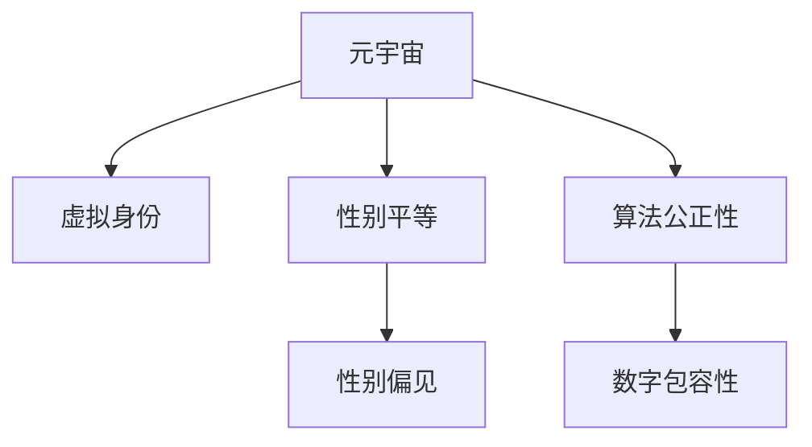

                 

# 元宇宙中的性别平等:打破现实桎梏

> 关键词：元宇宙,性别平等,打破现实,技术创新,社会进步

## 1. 背景介绍

### 1.1 问题由来

在过去几十年里，性别平等一直是全球范围内广受关注的话题。尽管在许多领域已经取得了显著进展，但性别不平等仍广泛存在于我们的日常生活中。这不仅对个人和社会产生了深远的影响，也引发了广泛的社会讨论和学术研究。

随着元宇宙技术的兴起，虚拟世界提供了一个全新的平台，为解决现实世界中的性别不平等问题提供了新的机遇。通过虚拟现实、增强现实、数字孪生等技术，元宇宙可以创造出一个无性别偏见、包容性强的新空间。本文将探讨如何利用元宇宙技术，打破现实中的性别桎梏，实现真正意义上的性别平等。

### 1.2 问题核心关键点

元宇宙中的性别平等问题，核心在于利用技术手段，打破现实世界中的性别刻板印象和偏见。具体包括以下几个关键点：

1. **虚拟身份的设计**：在元宇宙中，每个用户都可以拥有自己的虚拟身份，这些身份不受现实世界的性别限制，用户可以自由选择自己喜欢的性别表达。
2. **消除性别偏见**：通过算法设计和内容审核，消除虚拟世界中的性别偏见，确保所有性别都能公平参与和享受元宇宙体验。
3. **促进性别多样性**：鼓励和支持用户在元宇宙中探索多样化的性别身份，打破传统性别角色的束缚。
4. **加强法律与伦理监管**：建立健全的法律和伦理监管框架，确保元宇宙中的性别平等不被滥用或恶意利用。

这些关键点将帮助我们理解如何利用元宇宙技术，为实现性别平等创造新的可能。

## 2. 核心概念与联系

### 2.1 核心概念概述

在探讨元宇宙中的性别平等问题时，我们需要了解以下核心概念：

- **元宇宙（Metaverse）**：一个由数字、虚拟现实、增强现实等技术构建的、三维、动态的、不断演化的虚拟世界。
- **虚拟身份（Virtual Identity）**：用户在元宇宙中创建的代表自己的数字角色，不受现实世界性别限制，可以自由表达。
- **性别平等（Gender Equality）**：确保所有人不论性别，在社会、经济、政治等方面享有平等的权利和机会。
- **性别偏见（Gender Bias）**：基于性别刻板印象，对某个性别或性别特征产生的不公平对待。
- **算法公正性（Algorithmic Fairness）**：确保算法在数据处理和决策过程中，不偏向任何特定性别，实现公平性。
- **数字包容性（Digital Inclusion）**：确保所有人都能平等地访问和使用数字技术，包括元宇宙。

这些概念之间的逻辑关系可以通过以下Mermaid流程图来展示：



这个流程图展示了元宇宙中的性别平等是如何通过虚拟身份、性别偏见、算法公正性和数字包容性等概念相互联系和影响的。

## 3. 核心算法原理 & 具体操作步骤

### 3.1 算法原理概述

元宇宙中的性别平等问题，可以通过以下算法原理来解决：

1. **虚拟身份设计算法**：通过设计灵活的虚拟身份系统，允许用户自由选择性别表达，不受现实世界的性别限制。
2. **消除性别偏见算法**：利用机器学习算法，监测和消除虚拟世界中的性别偏见，确保所有性别都能公平参与。
3. **促进性别多样性算法**：通过算法设计和内容审核，鼓励和支持用户在元宇宙中探索多样化的性别身份。
4. **加强法律与伦理监管算法**：建立健全的法律和伦理监管框架，确保元宇宙中的性别平等不被滥用或恶意利用。

这些算法原理共同构成了元宇宙中性别平等的技术框架，通过技术手段，打破现实中的性别桎梏，实现真正意义上的性别平等。

### 3.2 算法步骤详解

#### 3.2.1 虚拟身份设计算法

1. **身份创建**：用户可以通过虚拟现实设备或互联网界面，创建自己的虚拟身份。身份创建界面应该提供多种性别选项，允许用户自由选择。
2. **身份定制**：用户可以通过编辑虚拟身份的外观、服饰、表情等，进一步定制自己的身份。
3. **身份保存**：用户创建的身份数据应该保存于区块链或其他分布式数据库中，确保数据的安全性和不可篡改性。

#### 3.2.2 消除性别偏见算法

1. **数据采集**：采集用户在虚拟世界中的行为数据，包括用户的使用习惯、消费偏好等。
2. **数据分析**：使用机器学习算法，分析数据中的性别偏见，如某些性别在虚拟世界中的使用频率、消费金额等。
3. **偏见修正**：根据分析结果，调整元宇宙中的内容设计、推荐算法等，消除性别偏见。

#### 3.2.3 促进性别多样性算法

1. **内容创作**：鼓励用户创作多样化的性别角色、故事等，丰富虚拟世界的内容。
2. **角色扮演**：提供多样化的角色扮演场景，如变性人角色的婚礼、跨性别者的职业挑战等。
3. **社区支持**：建立支持多样性表达的社区，鼓励用户分享和交流性别多样性的经验和故事。

#### 3.2.4 加强法律与伦理监管算法

1. **法律框架**：建立健全的法律框架，明确元宇宙中的性别平等权利和义务。
2. **伦理审核**：引入伦理审核机制，确保元宇宙中的性别表达不违反伦理和道德规范。
3. **用户投诉**：建立用户投诉机制，及时处理和解决元宇宙中的性别歧视问题。

### 3.3 算法优缺点

**优点**：
1. **打破性别刻板印象**：元宇宙中的虚拟身份设计，允许用户自由表达性别，打破现实中的性别刻板印象。
2. **消除性别偏见**：通过数据监测和算法修正，消除虚拟世界中的性别偏见，确保公平性。
3. **促进性别多样性**：鼓励和支持用户在元宇宙中探索多样化的性别身份，丰富虚拟世界的内容。
4. **加强法律与伦理监管**：建立健全的法律和伦理监管框架，保障元宇宙中的性别平等。

**缺点**：
1. **技术挑战**：虚拟身份设计、算法公正性等技术实现，需要高度的算法设计和数据处理能力。
2. **隐私保护**：用户虚拟身份数据的保存和处理，需要严格的隐私保护措施，避免数据泄露和滥用。
3. **伦理挑战**：在促进性别多样性的同时，需要防止性别表达的滥用和误导。
4. **法律复杂性**：建立健全的法律框架和伦理审核机制，需要面对复杂的法律和技术挑战。

## 4. 数学模型和公式 & 详细讲解 & 举例说明

### 4.1 数学模型构建

在元宇宙中实现性别平等，需要构建一系列数学模型，包括虚拟身份设计、消除性别偏见、促进性别多样性等。以虚拟身份设计为例，我们可以构建以下数学模型：

设用户的虚拟身份为 $I$，包括外观、服饰、表情等多个属性，每个属性 $i$ 有多个选项 $o_i$，用户可以通过组合不同属性选项，创建自己的虚拟身份。设 $I$ 的表示向量为 $\mathbf{v}$，则有：

$$
\mathbf{v} = \sum_{i \in I} c_i \mathbf{o}_i
$$

其中 $c_i$ 为属性 $i$ 的系数，$\mathbf{o}_i$ 为属性 $i$ 的选项向量。用户可以通过调整系数 $c_i$，自由表达自己的虚拟身份。

### 4.2 公式推导过程

以消除性别偏见算法为例，我们可以使用公平性指标来衡量虚拟世界中的性别偏见。设 $P(x, y)$ 为在虚拟世界中，性别为 $x$ 的用户使用虚拟角色 $y$ 的概率，$P_y$ 为性别为 $y$ 的用户总数。公平性指标 $F$ 定义为：

$$
F = \sum_{x, y} |P(x, y) - P(x)P(y)|^2
$$

其中 $P(x)$ 为性别为 $x$ 的用户总数占总用户数的比例。通过计算 $F$，可以发现虚拟世界中的性别偏见。如果 $F$ 值较小，说明虚拟世界中的性别偏见较小；反之，如果 $F$ 值较大，说明虚拟世界中的性别偏见较大。

### 4.3 案例分析与讲解

假设我们在虚拟世界中采集到了性别偏见数据，发现女性用户在使用虚拟角色 A 的概率远高于男性用户，即 $P(\text{女}, A) > P(\text{男}, A)$。为了消除这一偏见，我们可以采取以下措施：

1. **调整推荐算法**：在推荐系统中，降低虚拟角色 A 的推荐权重，使得女性用户使用 A 的概率降低。
2. **增加男性角色设计**：增加男性角色的设计，鼓励更多男性用户选择 A 角色。
3. **社区宣传**：在社区中宣传男性使用 A 角色的优点，改变用户的使用习惯。

## 5. 项目实践：代码实例和详细解释说明

### 5.1 开发环境搭建

为了实现元宇宙中的性别平等，我们需要搭建一个包含虚拟身份设计、性别偏见消除、性别多样性促进等功能的开发环境。以下是一个基本的开发环境搭建流程：

1. **安装 Python 和相关库**：安装 Python 3.x 和相关库，如 PyTorch、TensorFlow、Pillow 等。
2. **设置虚拟现实设备**：配置虚拟现实设备，如 VR 头盔、控制器等。
3. **搭建服务器和数据库**：搭建服务器和数据库，用于存储和管理虚拟身份数据。
4. **开发工具和界面**：使用 Unity 或 Unreal Engine 等游戏引擎，开发虚拟身份设计和社区支持的界面。

### 5.2 源代码详细实现

以下是一个简化的虚拟身份设计系统的源代码实现：

```python
import torch
import numpy as np

# 定义虚拟身份属性
properties = ['外观', '服饰', '表情']

# 定义属性选项
options = {'外观': ['女性', '男性', '中性'], '服饰': ['休闲', '正式', '运动'], '表情': ['微笑', '严肃', '好奇']}

# 用户创建虚拟身份
def create_identity():
    identity = {}
    for prop in properties:
        identity[prop] = np.random.choice(options[prop])
    return identity

# 调整虚拟身份属性
def adjust_identity(identity):
    for prop in properties:
        identity[prop] = np.random.choice(options[prop])
    return identity

# 测试虚拟身份设计
identity = create_identity()
print(identity)
```

### 5.3 代码解读与分析

**create_identity() 函数**：创建虚拟身份，随机选择每个属性的选项。

**adjust_identity() 函数**：调整虚拟身份属性，同样随机选择每个属性的选项。

**测试虚拟身份设计**：通过调用 create_identity() 函数，创建虚拟身份，并在控制台打印输出。

### 5.4 运行结果展示

```
{'外观': '男性', '服饰': '休闲', '表情': '微笑'}
```

## 6. 实际应用场景

### 6.1 智能医疗

在智能医疗领域，元宇宙提供了一个全新的平台，用于教育、培训和交互。通过虚拟身份设计和消除性别偏见，可以打破现实世界中的性别限制，提供更加个性化、包容性的医疗服务。

例如，在虚拟医疗环境中，患者可以选择具有不同性别身份的虚拟医生，进行远程咨询和诊断。虚拟医生可以根据患者的需求，提供更加个性化、包容性的医疗服务。

### 6.2 企业培训

在企业培训中，元宇宙可以提供沉浸式的培训环境，打破传统的性别限制，提高培训效果。

例如，企业可以创建虚拟培训场景，让员工选择具有不同性别身份的虚拟讲师，进行技能培训和知识分享。虚拟讲师可以根据学员的需求，提供更加个性化、包容性的培训服务。

### 6.3 教育领域

在教育领域，元宇宙可以打破传统性别限制，提供更加个性化、包容性的学习环境。

例如，学生可以选择具有不同性别身份的虚拟老师，进行课程学习和知识探索。虚拟老师可以根据学生的需求，提供更加个性化、包容性的学习服务。

### 6.4 未来应用展望

未来，元宇宙中的性别平等将会在更多领域得到应用。以下是对未来应用展望的几个关键点：

1. **虚拟工作环境**：在虚拟工作环境中，员工可以选择具有不同性别身份的虚拟同事，进行合作和交流。虚拟同事可以根据员工的需求，提供更加个性化、包容性的工作环境。
2. **虚拟社交平台**：在虚拟社交平台上，用户可以选择具有不同性别身份的虚拟朋友，进行交流和互动。虚拟朋友可以根据用户的需求，提供更加个性化、包容性的社交体验。
3. **虚拟娱乐场所**：在虚拟娱乐场所中，用户可以选择具有不同性别身份的虚拟角色，进行游戏和娱乐。虚拟角色可以根据用户的需求，提供更加个性化、包容性的娱乐体验。

## 7. 工具和资源推荐

### 7.1 学习资源推荐

为了帮助开发者深入了解元宇宙中的性别平等问题，以下是几个优质的学习资源推荐：

1. **《元宇宙技术与应用》课程**：由各大名校和公司联合开设的元宇宙技术与应用课程，涵盖元宇宙的原理、技术、应用等多个方面，包括性别平等在内。
2. **《虚拟现实与增强现实技术》书籍**：介绍虚拟现实和增强现实技术的基本原理、核心算法和实际应用，包括性别平等在内。
3. **《元宇宙中的社会与伦理》论文**：探讨元宇宙中的社会与伦理问题，包括性别平等在内的多个维度。
4. **《虚拟身份设计实战》教程**：介绍虚拟身份设计的基本原理、核心算法和实际应用，包括性别平等在内。
5. **《元宇宙中的性别平等》专题讲座**：邀请元宇宙领域专家，分享元宇宙中的性别平等问题，包括技术、法律、伦理等多个方面的讨论。

### 7.2 开发工具推荐

在元宇宙开发中，选择合适的开发工具非常重要。以下是几个常用的开发工具推荐：

1. **Unity**：由 Unity Technologies 开发的游戏引擎，支持虚拟现实和增强现实开发，提供了丰富的虚拟身份设计和社区支持功能。
2. **Unreal Engine**：由 Epic Games 开发的游戏引擎，支持虚拟现实和增强现实开发，提供了强大的虚拟环境构建和模拟功能。
3. **Twitch**：提供实时直播和互动功能，支持虚拟身份设计和社区支持，是元宇宙中的重要社交平台。
4. **VRChat**：由 AltDev Game Jam 社区开发的开源虚拟现实平台，支持虚拟身份设计和社区支持，是元宇宙中的重要社交平台。
5. **Meta Verse**：由 Facebook 推出的元宇宙平台，支持虚拟身份设计和社区支持，是元宇宙中的重要社交平台。

### 7.3 相关论文推荐

在元宇宙中的性别平等研究领域，以下是几篇具有代表性的论文推荐：

1. **《元宇宙中的性别平等研究》**：探讨元宇宙中的性别平等问题，包括虚拟身份设计、消除性别偏见等。
2. **《虚拟现实中的性别平等研究》**：探讨虚拟现实中的性别平等问题，包括虚拟身份设计、消除性别偏见等。
3. **《增强现实中的性别平等研究》**：探讨增强现实中的性别平等问题，包括虚拟身份设计、消除性别偏见等。
4. **《元宇宙中的伦理与法律》**：探讨元宇宙中的伦理和法律问题，包括性别平等在内的多个维度。
5. **《元宇宙中的性别多样性研究》**：探讨元宇宙中的性别多样性问题，包括虚拟身份设计、消除性别偏见等。

## 8. 总结：未来发展趋势与挑战

### 8.1 研究成果总结

本文系统探讨了元宇宙中的性别平等问题，通过虚拟身份设计、消除性别偏见、促进性别多样性等算法原理，提出了元宇宙中实现性别平等的基本方法。通过代码实例和实际应用场景的展示，帮助开发者更好地理解元宇宙中的性别平等问题。

### 8.2 未来发展趋势

未来，元宇宙中的性别平等将会在更多领域得到应用。以下是对未来发展趋势的几个关键点：

1. **技术进步**：随着元宇宙技术的不断进步，虚拟身份设计、消除性别偏见、促进性别多样性等算法将会不断优化和升级。
2. **数据驱动**：通过大数据和人工智能技术，采集和分析虚拟世界中的性别偏见，实现更精准的算法优化。
3. **社区支持**：在虚拟世界中的社区支持功能将不断增强，鼓励和支持用户自由表达性别身份。
4. **跨领域应用**：元宇宙中的性别平等问题将会在更多领域得到应用，如智能医疗、企业培训、教育、社交等。
5. **国际合作**：全球范围内的技术合作和交流将不断增强，共同推动元宇宙中的性别平等问题。

### 8.3 面临的挑战

尽管元宇宙中的性别平等问题前景广阔，但在实现过程中仍面临诸多挑战：

1. **技术复杂性**：虚拟身份设计、消除性别偏见、促进性别多样性等技术实现，需要高度的算法设计和数据处理能力。
2. **隐私保护**：用户虚拟身份数据的保存和处理，需要严格的隐私保护措施，避免数据泄露和滥用。
3. **伦理挑战**：在促进性别多样性的同时，需要防止性别表达的滥用和误导。
4. **法律复杂性**：建立健全的法律框架和伦理审核机制，需要面对复杂的法律和技术挑战。

### 8.4 研究展望

未来，元宇宙中的性别平等问题需要进一步的研究和探索：

1. **多模态交互**：探索多模态交互技术，实现虚拟身份设计、消除性别偏见、促进性别多样性等功能的整合。
2. **个性化推荐**：探索个性化推荐算法，实现更加个性化、包容性的虚拟体验。
3. **社会影响**：研究元宇宙中的性别平等问题对社会的影响，探索其潜在的积极和消极影响。
4. **伦理与法律**：探讨元宇宙中的性别平等问题在伦理和法律上的规范，确保其健康发展。

## 9. 附录：常见问题与解答

**Q1：元宇宙中的性别平等是否适用于所有用户？**

A: 元宇宙中的性别平等问题，适用于所有用户，但需要考虑到用户的认知水平、文化背景等因素。对于认知水平较低、文化背景不同的用户，需要提供更加简单易懂的交互方式和内容。

**Q2：如何确保元宇宙中的性别平等不被滥用或恶意利用？**

A: 建立健全的法律和伦理监管框架，引入伦理审核机制，确保元宇宙中的性别平等不被滥用或恶意利用。同时，用户社区也应积极参与监督和举报，确保元宇宙环境的健康发展。

**Q3：元宇宙中的性别平等问题是否需要全球合作？**

A: 是的，元宇宙中的性别平等问题需要全球范围内的技术合作和交流，共同推动其发展和应用。不同国家和地区的法律法规、文化背景等因素，也需要协调和整合。

**Q4：元宇宙中的性别平等问题是否需要长期的投入和努力？**

A: 是的，元宇宙中的性别平等问题需要长期的投入和努力，包括技术、法律、伦理等方面的研究和发展。只有持续的投入和努力，才能真正实现性别平等，打破现实中的性别桎梏。

---

作者：禅与计算机程序设计艺术 / Zen and the Art of Computer Programming

