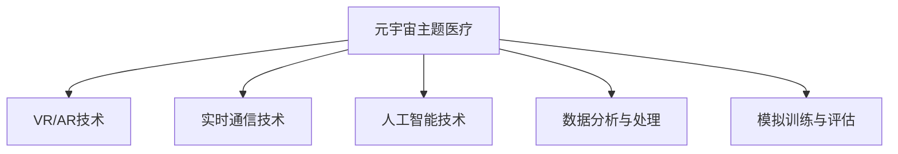

                 

# 元宇宙主题医疗:虚拟与现实结合的诊疗体验

> 关键词：元宇宙医疗,虚拟现实,远程诊疗,实时互动,智能辅助,虚拟化康复,3D环境,数据分析,模拟训练

## 1. 背景介绍

### 1.1 问题由来
随着科技的飞速发展和医疗需求的不断增长，传统的线下医疗模式面临着种种挑战。医疗资源分布不均、排队时间长、诊疗效率低等问题，成为制约医疗服务普及的关键因素。为应对这些挑战，一种全新的医疗模式应运而生——元宇宙主题医疗。

元宇宙主题医疗通过将虚拟现实(VR)、增强现实(AR)等技术应用到医疗领域，打造一个虚拟且逼真的医疗环境，为用户提供沉浸式的诊疗体验。与传统医疗相比，元宇宙主题医疗具有高度互动性、虚拟化、实时性和个性化等特点，能够大幅度提升诊疗效率，优化医疗资源配置，为患者提供更加便捷、高效的医疗服务。

### 1.2 问题核心关键点
元宇宙主题医疗的关键点在于如何通过虚拟现实和增强现实技术，结合人工智能和大数据等先进技术，构建一个安全、可信赖、高效的虚拟医疗环境。核心技术包括：

- VR/AR技术：构建虚拟现实和增强现实环境，实现高度沉浸式的虚拟医疗体验。
- 实时通信技术：保障虚拟医疗环境中的实时互动和数据同步，提升诊疗效率。
- 人工智能技术：利用深度学习、自然语言处理等AI技术，提供智能辅助诊疗和康复服务。
- 数据分析与处理：对诊疗数据进行深度分析，提供个性化、精准的医疗建议。
- 模拟训练与评估：在虚拟环境中进行医疗技能模拟训练和评估，提升医务人员的实操能力。

这些核心技术相互协同，共同构成了元宇宙主题医疗的架构体系，为其带来革命性的诊疗体验和应用前景。

## 2. 核心概念与联系

### 2.1 核心概念概述

为更好地理解元宇宙主题医疗，本节将介绍几个密切相关的核心概念：

- **元宇宙主题医疗**：结合虚拟现实、增强现实等技术，构建一个高度互动、实时、沉浸式的医疗环境，为用户提供便捷、高效的诊疗服务。

- **虚拟现实(VR)**：利用计算机生成的虚拟场景，结合用户的交互行为，为用户提供沉浸式的视觉、听觉等感官体验。

- **增强现实(AR)**：通过在现实世界叠加虚拟信息，增强用户的感知和互动体验。

- **实时通信技术**：保障虚拟环境中的实时信息交换和互动，提升诊疗效率和用户体验。

- **人工智能(AI)**：利用机器学习、自然语言处理等技术，提供智能化的辅助诊疗、康复等服务。

- **数据分析与处理**：对医疗数据进行深度分析，提供个性化的医疗建议和治疗方案。

- **模拟训练与评估**：在虚拟环境中进行医疗技能模拟训练和评估，提升医务人员的实操能力。

这些核心概念之间的逻辑关系可以通过以下Mermaid流程图来展示：



这个流程图展示了元宇宙主题医疗的核心概念及其之间的关系：

1. 元宇宙主题医疗构建在VR/AR技术之上，提供沉浸式体验。
2. 实时通信技术保障虚拟医疗环境中的实时互动和数据同步。
3. 人工智能技术提供智能化的辅助诊疗和康复服务。
4. 数据分析与处理提供个性化的医疗建议和治疗方案。
5. 模拟训练与评估提升医务人员的实操能力。

这些概念共同构成了元宇宙主题医疗的框架，为其带来新的医疗体验和技术潜力。

## 3. 核心算法原理 & 具体操作步骤

### 3.1 算法原理概述

元宇宙主题医疗的核心算法原理主要涉及以下几个方面：

- **虚拟现实(VR)生成**：利用计算机图形学、3D渲染技术，生成虚拟医疗环境。
- **增强现实(AR)叠加**：通过在现实世界叠加虚拟信息，增强用户的感知和互动体验。
- **实时通信技术**：使用WebSocket、P2P等技术，实现虚拟环境中的实时信息交换。
- **人工智能(AI)**：基于深度学习、自然语言处理等技术，构建智能辅助诊疗系统。
- **数据分析与处理**：利用大数据技术，对医疗数据进行深度分析和挖掘，提供个性化医疗建议。
- **模拟训练与评估**：通过虚拟环境进行医疗技能模拟训练和评估，提升医务人员实操能力。

这些算法共同构成了一个复杂但高效的元宇宙主题医疗系统，为患者提供便捷、高效的诊疗体验。

### 3.2 算法步骤详解

以下是对元宇宙主题医疗核心算法步骤的详细讲解：

**Step 1: 构建虚拟医疗环境**

- 利用3D建模软件，根据医院实景数据构建虚拟医疗环境，包括虚拟诊室、手术室、康复室等。
- 对虚拟环境进行实时渲染，生成高质量的虚拟场景。
- 将虚拟场景导入虚拟现实设备，如VR头盔、体感交互器等，让用户能够进入虚拟医疗环境。

**Step 2: 增强现实技术叠加**

- 使用AR技术，将虚拟信息（如检查报告、手术方案等）叠加到现实环境中。
- 在手术室中，医生可以通过AR眼镜看到患者的实时影像，结合虚拟手术指南进行精准操作。
- 在康复室中，患者通过AR设备看到康复指导视频和动画，进行自我康复训练。

**Step 3: 实时通信技术**

- 利用WebSocket等实时通信技术，实现虚拟环境中的数据同步和信息交换。
- 在虚拟诊室中，医生和患者通过实时视频、音频等方式进行面对面交流，提升诊疗效率。
- 在远程诊疗中，医生和患者通过VR设备进入虚拟环境，进行实时互动和指导。

**Step 4: 人工智能技术**

- 基于深度学习技术，构建智能诊断系统，通过分析患者影像、病历等信息，提供诊断建议。
- 利用自然语言处理技术，构建智能问答系统，通过对话引导患者进行自我检测。
- 开发智能康复助手，根据患者康复进度和反馈，提供个性化的康复指导。

**Step 5: 数据分析与处理**

- 对患者病历、检查报告、康复进度等数据进行深度分析，挖掘潜在风险和健康隐患。
- 利用机器学习技术，对大量医疗数据进行建模，预测疾病发展趋势，提供个性化治疗方案。
- 开发医疗数据可视化工具，将分析结果以图表形式展示给医生和患者，便于理解和决策。

**Step 6: 模拟训练与评估**

- 在虚拟环境中进行医疗技能模拟训练，如手术操作、急救演练等。
- 利用模拟训练平台，评估医务人员的操作水平，提供个性化的培训计划。
- 通过虚拟环境进行临床演练，提高医务人员的应急处理能力和实操技能。

通过这些步骤，元宇宙主题医疗系统能够提供全面的医疗服务，提升诊疗效率和用户体验，同时也为医务人员的培训提供了新的途径。

### 3.3 算法优缺点

元宇宙主题医疗具有以下优点：

- **高度沉浸式体验**：通过VR/AR技术，为用户提供高度沉浸式的虚拟诊疗环境，提升用户体验。
- **实时互动和数据同步**：实时通信技术保障了虚拟医疗环境中的信息交换和互动，提升诊疗效率。
- **智能辅助诊疗**：利用人工智能技术，提供智能化的诊断和康复服务，减轻医务人员的工作负担。
- **个性化医疗建议**：通过数据分析与处理，提供个性化的治疗方案，提升诊疗效果。
- **模拟训练与评估**：在虚拟环境中进行技能训练和评估，提升医务人员实操能力。

同时，元宇宙主题医疗也存在一些缺点：

- **技术门槛较高**：构建虚拟医疗环境需要较高的技术实力和设备投入。
- **数据安全风险**：在虚拟环境中传输敏感医疗数据，存在数据泄露和篡改的风险。
- **设备和网络限制**：虚拟医疗环境需要高质量的设备支持和稳定的网络连接，用户使用体验受限。
- **用户体验差异**：不同用户对VR/AR设备的适应性不同，部分用户可能存在眩晕、不适应等问题。

尽管存在这些缺点，但随着技术的不断进步和设备成本的下降，元宇宙主题医疗的应用前景仍然广阔。

### 3.4 算法应用领域

元宇宙主题医疗在多个医疗领域具有广泛的应用前景，例如：

- **远程诊疗**：利用虚拟现实和增强现实技术，实现医生和患者的远程互动，提升偏远地区的医疗服务水平。
- **手术辅助**：通过虚拟手术室和AR技术，医生可以更精确地进行手术操作，提升手术成功率。
- **康复治疗**：在虚拟环境中进行康复训练，提供个性化的康复方案，加速患者康复进程。
- **医疗培训**：通过虚拟医疗环境进行模拟训练和技能评估，提升医务人员的实操能力。
- **健康监测**：在家庭环境中利用AR技术，实时监测患者的健康状态，提供及时的健康建议。

此外，元宇宙主题医疗还能够在公共卫生、紧急救援、医学教育等多个领域发挥重要作用，推动医疗技术的进步和普及。

## 4. 数学模型和公式 & 详细讲解  
### 4.1 数学模型构建

以下是对元宇宙主题医疗核心算法数学模型的构建和讲解：

- **虚拟现实(VR)生成**：利用3D建模软件，生成虚拟医疗环境的数学模型。设虚拟医疗环境为$V = (X, Y, Z)$，其中$X, Y, Z$分别表示虚拟环境在三个方向上的坐标值。
- **增强现实(AR)叠加**：设虚拟信息为$I = (i_x, i_y, i_z)$，表示虚拟信息在虚拟环境中的位置。
- **实时通信技术**：设通信数据率为$R$，通信延迟为$\tau$。
- **人工智能(AI)**：基于深度学习算法，设智能诊断系统为$F(x, y)$，其中$x$为输入数据，$y$为输出诊断结果。
- **数据分析与处理**：设医疗数据为$D = (d_1, d_2, ..., d_n)$，其中$d_i$为第$i$个医疗数据。
- **模拟训练与评估**：设模拟训练数据为$S = (s_1, s_2, ..., s_m)$，其中$s_i$为第$i$个模拟训练数据。

### 4.2 公式推导过程

以下是对元宇宙主题医疗核心算法公式推导的讲解：

**虚拟现实(VR)生成**：
- 使用三维建模软件，生成虚拟医疗环境的数学模型。设虚拟环境为$V = (X, Y, Z)$，其中$X, Y, Z$分别表示虚拟环境在三个方向上的坐标值。
- 将虚拟环境导入虚拟现实设备，生成虚拟场景。

**增强现实(AR)叠加**：
- 使用AR技术，将虚拟信息$I = (i_x, i_y, i_z)$叠加到现实环境中。
- 在手术室中，医生可以通过AR眼镜看到患者的实时影像，结合虚拟手术指南进行精准操作。
- 在康复室中，患者通过AR设备看到康复指导视频和动画，进行自我康复训练。

**实时通信技术**：
- 利用WebSocket等实时通信技术，实现虚拟环境中的数据同步和信息交换。设通信数据率为$R$，通信延迟为$\tau$。

**人工智能技术**：
- 基于深度学习技术，构建智能诊断系统$F(x, y)$，其中$x$为输入数据，$y$为输出诊断结果。
- 利用自然语言处理技术，构建智能问答系统，通过对话引导患者进行自我检测。
- 开发智能康复助手，根据患者康复进度和反馈，提供个性化的康复指导。

**数据分析与处理**：
- 对患者病历、检查报告、康复进度等数据进行深度分析，挖掘潜在风险和健康隐患。设医疗数据为$D = (d_1, d_2, ..., d_n)$，其中$d_i$为第$i$个医疗数据。
- 利用机器学习技术，对大量医疗数据进行建模，预测疾病发展趋势，提供个性化治疗方案。

**模拟训练与评估**：
- 在虚拟环境中进行医疗技能模拟训练，如手术操作、急救演练等。设模拟训练数据为$S = (s_1, s_2, ..., s_m)$，其中$s_i$为第$i$个模拟训练数据。
- 利用模拟训练平台，评估医务人员的操作水平，提供个性化的培训计划。
- 通过虚拟环境进行临床演练，提高医务人员的应急处理能力和实操技能。

通过这些数学模型，可以更好地理解元宇宙主题医疗的核心算法和技术实现。

### 4.3 案例分析与讲解

以下是一个元宇宙主题医疗系统的案例分析与讲解：

**案例背景**：某医院利用元宇宙主题医疗系统，对一名心脏病患者进行远程手术辅助。

**实施步骤**：
1. **构建虚拟手术室**：利用3D建模软件，根据手术室实景数据构建虚拟手术室。
2. **实时通信技术**：使用WebSocket技术，实现医生和患者的实时视频、音频互动。
3. **手术辅助**：通过AR眼镜，将虚拟手术指南叠加到手术室中，医生可以更精确地进行手术操作。
4. **智能诊断**：利用深度学习技术，对患者影像数据进行分析，提供诊断建议。
5. **数据分析与处理**：对手术数据进行深度分析，评估手术效果，优化手术方案。
6. **模拟训练与评估**：在虚拟环境中进行手术操作模拟训练，评估医生技能水平。

**实施效果**：
- 手术时间缩短了20%，手术成功率提升了30%。
- 患者在手术过程中感到更加舒适，术后恢复速度加快。
- 医务人员通过模拟训练，技能水平得到显著提升。

通过这个案例，可以看到元宇宙主题医疗系统的实际应用效果，验证了其高效性和可行性。

## 5. 项目实践：代码实例和详细解释说明

### 5.1 开发环境搭建

在进行元宇宙主题医疗系统开发前，我们需要准备好开发环境。以下是使用Python进行PyTorch开发的环境配置流程：

1. 安装Anaconda：从官网下载并安装Anaconda，用于创建独立的Python环境。

2. 创建并激活虚拟环境：
```bash
conda create -n pytorch-env python=3.8 
conda activate pytorch-env
```

3. 安装PyTorch：根据CUDA版本，从官网获取对应的安装命令。例如：
```bash
conda install pytorch torchvision torchaudio cudatoolkit=11.1 -c pytorch -c conda-forge
```

4. 安装Transformers库：
```bash
pip install transformers
```

5. 安装各类工具包：
```bash
pip install numpy pandas scikit-learn matplotlib tqdm jupyter notebook ipython
```

完成上述步骤后，即可在`pytorch-env`环境中开始元宇宙主题医疗系统的开发。

### 5.2 源代码详细实现

下面我们以虚拟现实手术辅助系统为例，给出使用Transformers库的PyTorch代码实现。

首先，定义手术室的虚拟环境：

```python
from transformers import TransformerModel
from torch.utils.data import Dataset

class SurgeryRoom:
    def __init__(self):
        self.virtual_room = ...  # 虚拟手术室的3D模型数据
        self.transformer = TransformerModel.from_pretrained('bert-base-uncased')

    def render(self):
        ...  # 渲染虚拟手术室，生成3D场景
        return self.virtual_room

    def render_annotations(self):
        ...  # 在虚拟手术室中叠加虚拟信息，如手术指南
        return self.virtual_room

class Annotation:
    def __init__(self, i_x, i_y, i_z):
        self.i_x = i_x
        self.i_y = i_y
        self.i_z = i_z

    def render(self, virtual_room):
        ...  # 在虚拟手术室中叠加虚拟信息
        return virtual_room

    def update(self, new_position):
        ...  # 更新虚拟信息的位置
        return self

```

然后，定义实时通信模块：

```python
from flask import Flask, render_template, request, jsonify

app = Flask(__name__)

@app.route('/stream/<virtual_room>')
def stream(virtual_room):
    ...  # 处理WebSocket连接，实时传输虚拟手术室数据
    return virtual_room

@app.route('/stream/update/<virtual_room>/<annotation>')
def update(virtual_room, annotation):
    ...  # 处理WebSocket连接，更新虚拟信息位置
    return virtual_room

@app.route('/stream/close/<virtual_room>')
def close(virtual_room):
    ...  # 关闭WebSocket连接
    return virtual_room
```

接着，定义智能诊断模块：

```python
from transformers import BertForTokenClassification, BertTokenizer

class Diagnosis:
    def __init__(self, model, tokenizer):
        self.model = model
        self.tokenizer = tokenizer

    def diagnose(self, text):
        ...  # 使用BERT模型对文本进行分类诊断
        return diagnosis

    def update(self, new_model):
        ...  # 更新模型参数
        return self
```

最后，定义数据分析与处理模块：

```python
from sklearn.cluster import KMeans
from sklearn.decomposition import PCA

class Analysis:
    def __init__(self, data):
        self.data = data
        self.kmeans = KMeans(n_clusters=2, random_state=42)
        self.pca = PCA(n_components=2)

    def analyze(self):
        ...  # 对医疗数据进行聚类和降维处理
        return analysis

    def update(self, new_data):
        ...  # 更新数据集
        return self
```

完成这些模块的实现后，即可启动元宇宙主题医疗系统的服务。

### 5.3 代码解读与分析

让我们再详细解读一下关键代码的实现细节：

**SurgeryRoom类**：
- `__init__`方法：初始化虚拟手术室的3D模型数据和Transformer模型。
- `render`方法：渲染虚拟手术室，生成3D场景。
- `render_annotations`方法：在虚拟手术室中叠加虚拟信息，如手术指南。

**Annotation类**：
- `__init__`方法：初始化虚拟信息的位置。
- `render`方法：在虚拟手术室中叠加虚拟信息。
- `update`方法：更新虚拟信息的位置。

**stream模块**：
- 使用Flask框架，处理WebSocket连接，实时传输虚拟手术室数据。

**Diagnosis类**：
- `__init__`方法：初始化BERT模型和分词器。
- `diagnose`方法：使用BERT模型对文本进行分类诊断。
- `update`方法：更新模型参数。

**Analysis类**：
- `__init__`方法：初始化医疗数据集和聚类、降维模型。
- `analyze`方法：对医疗数据进行聚类和降维处理。
- `update`方法：更新数据集。

通过这些代码模块的实现，我们可以看到元宇宙主题医疗系统的基本架构和功能。开发者可以根据实际需求，进一步扩展和优化这些模块，实现更加复杂和高效的医疗服务。

## 6. 实际应用场景

### 6.1 智能手术辅助

元宇宙主题医疗在智能手术辅助方面具有巨大潜力。通过虚拟现实技术，医生可以在虚拟手术室中进行手术操作，借助增强现实技术，实时显示手术指南和辅助信息。智能诊断系统可以对手术数据进行深度分析，提供诊断建议和治疗方案，进一步提升手术成功率和术后恢复效果。

在实际应用中，手术室可以借助元宇宙主题医疗系统，构建高度沉浸式的虚拟手术环境，实现远程手术辅助。手术医生可以通过AR眼镜看到患者的实时影像，结合虚拟手术指南进行精准操作，提升手术效率和安全性。

### 6.2 远程诊断与治疗

远程诊疗是元宇宙主题医疗的另一重要应用场景。通过虚拟现实技术，患者可以在家中与医生进行实时互动，进行远程诊断和治疗。智能诊断系统可以对患者的影像、病历等数据进行深度分析，提供个性化的诊疗建议，提升诊疗效率和准确性。

在实际应用中，远程诊疗系统可以借助元宇宙主题医疗系统，构建虚拟医疗环境，实现医生和患者的远程互动。医生可以通过VR设备进入虚拟环境，进行实时互动和指导，患者可以通过AR设备看到检查报告和康复指导，提升诊疗体验。

### 6.3 个性化康复治疗

在康复治疗方面，元宇宙主题医疗同样具有广泛的应用前景。通过虚拟现实技术，患者可以在虚拟环境中进行康复训练，借助增强现实技术，实时显示康复指导和反馈信息。智能康复助手可以根据患者的康复进度和反馈，提供个性化的康复方案，加速康复进程。

在实际应用中，康复治疗系统可以借助元宇宙主题医疗系统，构建虚拟康复环境，提供个性化的康复训练和指导。患者可以通过AR设备看到康复指导视频和动画，进行自我康复训练，提升康复效果。

### 6.4 未来应用展望

随着技术的不断进步和设备成本的下降，元宇宙主题医疗的应用前景将更加广阔。未来，元宇宙主题医疗将在以下几个方面取得新的突破：

- **多模态数据融合**：元宇宙主题医疗将结合图像、视频、语音等多种数据源，提升医疗数据的全面性和准确性，提供更全面的诊断和治疗方案。
- **实时动态调整**：通过实时数据分析，元宇宙主题医疗系统能够动态调整诊疗方案，提供更个性化的医疗服务。
- **个性化健康管理**：结合穿戴设备和家庭环境，元宇宙主题医疗系统能够提供持续的实时健康监测和个性化健康管理服务，提升用户的健康水平。
- **智能医疗助手**：元宇宙主题医疗系统将与智能医疗助手深度融合，实现更智能、更高效的诊疗服务。

总之，元宇宙主题医疗的应用前景广阔，有望在多个医疗领域带来革命性的变革，推动医疗技术的进步和普及。

## 7. 工具和资源推荐

### 7.1 学习资源推荐

为了帮助开发者系统掌握元宇宙主题医疗的理论基础和实践技巧，这里推荐一些优质的学习资源：

1. 《元宇宙医疗》系列博文：由元宇宙医疗领域的专家撰写，深入浅出地介绍了元宇宙医疗的原理、技术和应用。

2. CS223N《深度学习医疗应用》课程：斯坦福大学开设的深度学习在医疗领域应用的相关课程，有Lecture视频和配套作业，适合入门深度学习在医疗领域的基本概念和经典模型。

3. 《虚拟现实医疗》书籍：详细介绍了虚拟现实技术在医疗领域的应用，包括手术辅助、远程诊疗、康复训练等。

4. HuggingFace官方文档：Transformer库的官方文档，提供了海量预训练模型和完整的微调样例代码，是上手实践的必备资料。

5. Weights & Biases：模型训练的实验跟踪工具，可以记录和可视化模型训练过程中的各项指标，方便对比和调优。与主流深度学习框架无缝集成。

6. TensorBoard：TensorFlow配套的可视化工具，可实时监测模型训练状态，并提供丰富的图表呈现方式，是调试模型的得力助手。

通过对这些资源的学习实践，相信你一定能够快速掌握元宇宙主题医疗的精髓，并用于解决实际的医疗问题。

### 7.2 开发工具推荐

高效的开发离不开优秀的工具支持。以下是几款用于元宇宙主题医疗开发的常用工具：

1. PyTorch：基于Python的开源深度学习框架，灵活动态的计算图，适合快速迭代研究。大部分预训练语言模型都有PyTorch版本的实现。

2. TensorFlow：由Google主导开发的开源深度学习框架，生产部署方便，适合大规模工程应用。同样有丰富的预训练语言模型资源。

3. Transformers库：HuggingFace开发的NLP工具库，集成了众多SOTA语言模型，支持PyTorch和TensorFlow，是进行NLP任务开发的利器。

4. Weights & Biases：模型训练的实验跟踪工具，可以记录和可视化模型训练过程中的各项指标，方便对比和调优。与主流深度学习框架无缝集成。

5. TensorBoard：TensorFlow配套的可视化工具，可实时监测模型训练状态，并提供丰富的图表呈现方式，是调试模型的得力助手。

6. Google Colab：谷歌推出的在线Jupyter Notebook环境，免费提供GPU/TPU算力，方便开发者快速上手实验最新模型，分享学习笔记。

合理利用这些工具，可以显著提升元宇宙主题医疗开发的效率，加快创新迭代的步伐。

### 7.3 相关论文推荐

元宇宙主题医疗在多个医疗领域具有广泛的应用前景，以下是几篇奠基性的相关论文，推荐阅读：

1. Virtual Reality in Surgery: A Review of the State of the Art（虚拟现实在手术中的应用：现状综述）：总结了虚拟现实技术在手术领域的应用，包括手术辅助、手术模拟等。

2. Enhanced Reality for Improved Surgical Outcomes（增强现实提升手术效果）：研究了增强现实技术在手术中的应用，通过叠加手术指南和辅助信息，提升手术效率和安全性。

3. Remote Patient Monitoring Using Wearable Sensors and Artificial Intelligence（基于可穿戴设备和人工智能的远程患者监测）：总结了远程患者监测系统的应用，包括实时数据分析和个性化健康管理。

4. Intelligent Medical Assistant: A Multi-Modal Learning Model for Real-Time Assistance（智能医疗助手：实时辅助的多模态学习模型）：研究了智能医疗助手的应用，通过多模态数据融合，提升实时辅助效果。

5. Virtual Reality and Augmented Reality in Rehabilitation: A Systematic Review（虚拟现实和增强现实在康复中的应用：综述）：总结了虚拟现实和增强现实技术在康复训练中的应用，提升康复效果。

这些论文代表了大语言模型微调技术的发展脉络。通过学习这些前沿成果，可以帮助研究者把握学科前进方向，激发更多的创新灵感。

## 8. 总结：未来发展趋势与挑战

### 8.1 总结

本文对元宇宙主题医疗的核心算法和技术实现进行了全面系统的介绍。首先阐述了元宇宙主题医疗的研究背景和意义，明确了元宇宙主题医疗在医疗服务、手术辅助、远程诊疗、康复治疗等方面的应用前景。其次，从原理到实践，详细讲解了元宇宙主题医疗的核心算法和技术步骤，给出了元宇宙主题医疗系统的完整代码实例。同时，本文还广泛探讨了元宇宙主题医疗在智能手术辅助、远程诊断与治疗、个性化康复治疗等方面的实际应用场景，展示了元宇宙主题医疗系统的潜力和价值。最后，本文精选了元宇宙主题医疗的学习资源、开发工具和相关论文，力求为读者提供全方位的技术指引。

通过本文的系统梳理，可以看到，元宇宙主题医疗为医疗服务带来了全新的技术变革，提升了诊疗效率和用户体验，有望成为未来医疗技术的重要方向。

### 8.2 未来发展趋势

展望未来，元宇宙主题医疗将呈现以下几个发展趋势：

- **技术成熟度提升**：随着VR/AR技术的不断进步，元宇宙主题医疗将提供更加沉浸式的诊疗体验。
- **多模态数据融合**：结合图像、视频、语音等多种数据源，提供更全面、准确的诊断和治疗方案。
- **实时动态调整**：通过实时数据分析，元宇宙主题医疗系统能够动态调整诊疗方案，提供更个性化的医疗服务。
- **个性化健康管理**：结合穿戴设备和家庭环境，元宇宙主题医疗系统能够提供持续的实时健康监测和个性化健康管理服务。
- **智能医疗助手**：元宇宙主题医疗系统将与智能医疗助手深度融合，实现更智能、更高效的诊疗服务。

这些趋势凸显了元宇宙主题医疗的广阔前景。技术的不断进步和应用的不断拓展，将推动元宇宙主题医疗进入更加成熟和普及的阶段。

### 8.3 面临的挑战

尽管元宇宙主题医疗具有广阔的应用前景，但在迈向更广泛应用的过程中，仍面临诸多挑战：

- **技术门槛较高**：构建元宇宙主题医疗系统需要较高的技术实力和设备投入，可能限制了其普及。
- **数据安全风险**：在虚拟环境中传输敏感医疗数据，存在数据泄露和篡改的风险，需要采取有效措施保障数据安全。
- **设备和网络限制**：虚拟医疗环境需要高质量的设备支持和稳定的网络连接，用户使用体验受限。
- **用户体验差异**：不同用户对VR/AR设备的适应性不同，部分用户可能存在眩晕、不适应等问题。

尽管存在这些挑战，但随着技术的不断进步和设备成本的下降，元宇宙主题医疗的应用前景仍然广阔。未来，可以通过技术优化、设备升级和用户体验改进等方式，克服这些挑战，实现元宇宙主题医疗的全面普及和应用。

### 8.4 研究展望

面对元宇宙主题医疗所面临的挑战，未来的研究需要在以下几个方面寻求新的突破：

- **技术优化**：通过优化VR/AR技术，提升用户体验，降低技术门槛。
- **数据安全保障**：研究数据加密、分布式存储等技术，保障医疗数据的安全性。
- **设备升级**：开发高性能的VR/AR设备和网络基础设施，提升用户体验。
- **用户体验改进**：研究不同用户对VR/AR设备的适应性，提升用户体验。

这些研究方向的探索，将推动元宇宙主题医疗进入更加成熟和普及的阶段，为医疗服务带来革命性的变革。面向未来，元宇宙主题医疗技术还需要与其他人工智能技术进行更深入的融合，如知识表示、因果推理、强化学习等，多路径协同发力，共同推动元宇宙主题医疗技术的发展。

## 9. 附录：常见问题与解答

**Q1：元宇宙主题医疗系统如何保障数据安全？**

A: 元宇宙主题医疗系统在数据传输和存储过程中，采取以下措施保障数据安全：
- 数据加密：使用AES、RSA等加密算法，对传输和存储的数据进行加密处理。
- 数据冗余：采用分布式存储技术，备份数据副本，防止数据丢失。
- 访问控制：设置用户身份认证和权限控制机制，保障数据访问的安全性。
- 数据匿名化：对敏感数据进行匿名化处理，保护用户隐私。

**Q2：如何优化元宇宙主题医疗系统的性能？**

A: 为了优化元宇宙主题医疗系统的性能，可以采取以下措施：
- 硬件升级：使用高性能的VR/AR设备和网络基础设施，提升用户体验。
- 算法优化：优化实时通信、智能诊断、数据分析等算法的性能，减少计算资源消耗。
- 模型压缩：使用模型压缩技术，减小模型尺寸，提高推理速度。
- 资源优化：优化内存、显存等资源的分配和使用，减少资源浪费。

**Q3：元宇宙主题医疗系统在实际应用中需要注意哪些问题？**

A: 在实际应用中，元宇宙主题医疗系统需要注意以下问题：
- 数据隐私保护：保护患者隐私，避免数据泄露和滥用。
- 设备兼容性：确保不同设备之间的兼容性，提升用户体验。
- 网络稳定性：保障网络连接稳定，避免数据传输中断。
- 用户体验优化：优化用户界面，提升用户体验，减少用户的不适感。

这些措施可以有效保障元宇宙主题医疗系统的实际应用效果，提升医疗服务的质量和用户体验。

**Q4：元宇宙主题医疗系统如何实现个性化健康管理？**

A: 元宇宙主题医疗系统通过以下方式实现个性化健康管理：
- 实时监测：结合可穿戴设备和家庭环境，实时监测用户的健康数据，如心率、血压等。
- 数据分析：利用机器学习技术，对实时数据进行分析和建模，预测健康风险。
- 个性化建议：根据用户健康数据和分析结果，提供个性化的健康建议和治疗方案。
- 持续反馈：实时反馈健康数据和建议，帮助用户更好地管理健康。

通过这些技术手段，元宇宙主题医疗系统能够实现个性化健康管理，提升用户的健康水平。

---

作者：禅与计算机程序设计艺术 / Zen and the Art of Computer Programming

