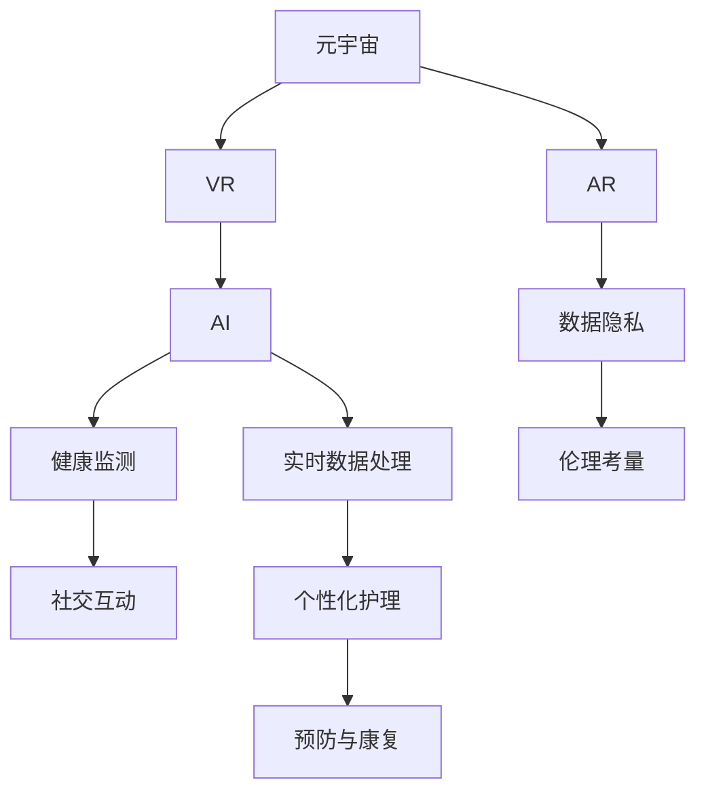

                 

# 元宇宙养老社区:数字化照护的创新实践

> 关键词：元宇宙,养老社区,数字化照护,虚拟现实(VR),增强现实(AR),人工智能(AI),健康监测,社交互动,数据隐私,伦理考量

## 1. 背景介绍

### 1.1 问题由来

随着全球人口老龄化趋势的加剧，养老问题日益成为社会关注的焦点。传统的养老模式以家庭照顾为主，但随着核心家庭结构的变化，子女照顾老年人的能力越来越有限。同时，养老院等专业机构虽然在老年人的日常照护上具有一定的优势，但由于资源不足，难以满足所有老年人的个性化需求。

近年来，随着技术的进步，特别是虚拟现实(VR)、增强现实(AR)、人工智能(AI)等新兴技术的发展，为养老社区带来了新的可能性。元宇宙作为一种基于虚拟现实技术构建的数字化空间，为养老社区提供了全新的数字化照护模式。通过元宇宙技术，养老社区可以实现远程医疗、个性化照护、社交互动等功能，显著提升老年人的生活质量。

### 1.2 问题核心关键点

元宇宙养老社区的核心在于通过虚拟现实和增强现实技术，打造一个高度互动、沉浸式的数字化养老环境。其核心关键点包括：

- 数字化照护：利用AI和VR/AR技术，提供实时健康监测、个性化护理服务。
- 社交互动：构建虚拟社区，促进老年人之间的交流互动，缓解孤独感。
- 健康监测：通过佩戴可穿戴设备，实时采集老年人的健康数据，及时发现并处理健康问题。
- 隐私保护：保护老年人隐私，确保数据安全和隐私。
- 伦理考量：考虑老年人在虚拟环境中的伦理问题，如尊严、自主权等。

## 2. 核心概念与联系

### 2.1 核心概念概述

为更好地理解元宇宙养老社区的数字化照护模式，本节将介绍几个密切相关的核心概念：

- 元宇宙(Metaverse)：基于VR/AR技术构建的数字化虚拟世界，用户可以通过头盔、手柄等设备进入其中，进行虚拟互动。
- 虚拟现实(Virtual Reality, VR)：利用计算机生成仿真环境，使用户感觉自己置身于虚拟环境中，并进行互动。
- 增强现实(Augmented Reality, AR)：在现实环境中叠加虚拟信息，增强用户的感官体验。
- 人工智能(Artificial Intelligence, AI)：利用机器学习、深度学习等技术，使计算机具备一定的智能决策能力。
- 健康监测(Health Monitoring)：通过传感器、可穿戴设备等技术，实时采集老年人的健康数据，进行健康管理。
- 社交互动(Social Interaction)：通过虚拟社区，促进老年人之间的交流互动。
- 数据隐私(Data Privacy)：保护老年人隐私，确保数据安全和隐私。
- 伦理考量(Ethical Consideration)：在虚拟环境中考虑老年人的尊严、自主权等伦理问题。

这些核心概念之间的逻辑关系可以通过以下Mermaid流程图来展示：



这个流程图展示了几大核心概念及其之间的关系：

1. 元宇宙通过VR/AR技术提供沉浸式体验。
2. AI技术用于实现个性化护理、健康监测等智能化功能。
3. 健康监测与社交互动互相促进，提升老年人的生活质量。
4. 数据隐私与伦理考量为养老社区构建安全、公正的虚拟环境。

## 3. 核心算法原理 & 具体操作步骤
### 3.1 算法原理概述

元宇宙养老社区的数字化照护过程，本质上是一个多学科融合的技术实践。其核心算法原理如下：

1. 通过VR/AR技术，构建虚拟环境，让老年人可以身临其境地进行活动。
2. 利用AI技术，实现个性化护理、健康监测等功能，提供智能化的照护服务。
3. 采集老年人健康数据，通过数据分析，实现健康管理和预防康复。
4. 在虚拟环境中促进老年人之间的社交互动，缓解孤独感，提升心理幸福感。
5. 保护老年人的隐私，确保数据安全和隐私。
6. 考虑老年人在虚拟环境中的伦理问题，确保其尊严和自主权。

### 3.2 算法步骤详解

元宇宙养老社区的数字化照护过程可以分为以下几个步骤：

**Step 1: 环境构建**
- 设计虚拟养老社区的3D模型，包括房间、走廊、公共活动区等，确保其舒适性和安全性。
- 设置虚拟入口，老年人通过头盔、手柄等设备进入虚拟社区。

**Step 2: 健康监测与个性化护理**
- 佩戴可穿戴设备，如智能手表、健康手环等，实时采集老年人的健康数据。
- 利用AI技术，分析健康数据，生成个性化护理计划。
- 通过虚拟助手，为老年人提供健康监测和个性化护理服务。

**Step 3: 社交互动**
- 构建虚拟社区，老年人可以通过聊天室、论坛等形式进行交流互动。
- 利用AI技术，为老年人推荐兴趣相投的虚拟朋友，促进深度交流。

**Step 4: 数据分析与健康管理**
- 采集老年人健康数据，通过数据分析，生成健康报告。
- 根据健康报告，提供预防和康复建议，改善老年人的生活质量。

**Step 5: 隐私保护与伦理考量**
- 设计数据隐私保护机制，确保老年人的隐私不被泄露。
- 在虚拟环境中，考虑老年人的尊严、自主权等伦理问题，确保其权益不受侵害。

### 3.3 算法优缺点

元宇宙养老社区的数字化照护方法具有以下优点：

1. 沉浸式体验：老年人可以身临其境地进行活动，提升生活的乐趣。
2. 个性化护理：利用AI技术，提供个性化的照护服务，提升护理效果。
3. 实时健康监测：通过可穿戴设备，实时采集健康数据，及时发现并处理健康问题。
4. 促进社交互动：构建虚拟社区，缓解老年人的孤独感，提升心理健康。
5. 数据隐私保护：确保老年人的隐私不受侵犯，增强信任感。

同时，该方法也存在以下局限性：

1. 设备成本高：需要高质量的VR头盔、智能手环等设备，成本较高。
2. 技术门槛高：老年人和护理人员需要一定的技术培训，才能熟练使用设备。
3. 虚拟环境的安全性：虚拟环境中的安全风险（如跌倒、碰撞）需要特别注意。
4. 数据隐私泄露：需要设计强大的隐私保护机制，确保数据安全。
5. 伦理问题复杂：虚拟环境中的伦理问题（如隐私、自主权）需要充分考虑。

尽管存在这些局限性，但元宇宙养老社区的数字化照护模式在实际应用中已展现出巨大的潜力，可以为老年人的高质量生活提供有力支持。

### 3.4 算法应用领域

元宇宙养老社区的数字化照护方法，已经在多个领域得到了应用，具体包括：

- 医疗保健：通过虚拟现实技术，进行远程医疗、手术模拟等。
- 娱乐休闲：利用虚拟现实技术，提供沉浸式的游戏、影视等娱乐体验。
- 教育培训：通过虚拟现实技术，进行虚拟课堂、虚拟实验室等教学活动。
- 虚拟旅游：利用增强现实技术，提供虚拟旅游体验，拓宽老年人的视野。
- 社交互动：通过虚拟社区，促进老年人之间的交流互动，缓解孤独感。
- 健康监测：通过可穿戴设备，实时采集老年人的健康数据，进行健康管理。

除了上述这些应用领域外，元宇宙技术还将在更多场景中得到应用，为老年人的生活质量带来新的提升。

## 4. 数学模型和公式 & 详细讲解 & 举例说明
### 4.1 数学模型构建

元宇宙养老社区的数字化照护过程涉及多个数学模型，包括健康监测、社交互动、数据分析等。这里以健康监测为例，构建数学模型。

假设老年人的健康数据为一个向量 $x=(x_1, x_2, ..., x_n)$，其中 $x_i$ 表示第 $i$ 个健康指标的值。根据健康数据，利用AI技术，生成个性化护理计划，模型如下：

$$
y = f(x) = \sum_{i=1}^n w_i x_i + b
$$

其中 $y$ 表示护理计划的得分，$w_i$ 和 $b$ 为模型的参数。

通过健康监测设备，实时采集老年人的健康数据，并进行预处理：

$$
x' = \text{Preprocess}(x) = \{ x_1', x_2', ..., x_n' \}
$$

其中 $x_i'$ 为预处理后的数据，$x_i'$ 可能需要进行归一化、滤波等处理。

### 4.2 公式推导过程

根据上述模型，利用AI技术，生成个性化护理计划的过程如下：

1. 数据预处理：利用预处理函数，将原始数据转化为模型所需的形式。
2. 模型训练：利用训练数据 $(x, y)$，通过梯度下降等优化算法，更新模型参数 $w$ 和 $b$。
3. 模型评估：利用测试数据 $(x', y')$，评估模型的准确性和鲁棒性。
4. 护理计划生成：将老年人健康数据 $x'$ 输入模型，生成护理计划得分 $y'$。

### 4.3 案例分析与讲解

以一位80岁老年人的健康监测为例，假定其血压、血糖、心率等健康指标的数据如下：

- 血压：120/80 mmHg
- 血糖：5.6 mmol/L
- 心率：70 bpm

假设健康监测设备采集的数据已经进行了预处理，转化为模型所需的形式。利用上述模型，计算护理计划的得分：

1. 数据预处理：将原始数据转换为模型所需的形式，如将血压值转化为 $x_1$，血糖值转化为 $x_2$，心率值转化为 $x_3$。
2. 模型训练：利用历史健康数据进行模型训练，更新模型参数 $w$ 和 $b$。
3. 模型评估：利用测试数据评估模型的准确性和鲁棒性，确保模型的可靠性和稳定性。
4. 护理计划生成：将老年人的健康数据 $x'$ 输入模型，生成护理计划得分 $y'$，表示其健康状况的总体评估。

## 5. 项目实践：代码实例和详细解释说明
### 5.1 开发环境搭建

在进行元宇宙养老社区的数字化照护实践前，我们需要准备好开发环境。以下是使用Python进行PyTorch开发的环境配置流程：

1. 安装Anaconda：从官网下载并安装Anaconda，用于创建独立的Python环境。

2. 创建并激活虚拟环境：
```bash
conda create -n metaverse-env python=3.8 
conda activate metaverse-env
```

3. 安装PyTorch：根据CUDA版本，从官网获取对应的安装命令。例如：
```bash
conda install pytorch torchvision torchaudio cudatoolkit=11.1 -c pytorch -c conda-forge
```

4. 安装TensorFlow：由Google主导开发的开源深度学习框架，生产部署方便，适合大规模工程应用。同样有丰富的预训练语言模型资源。

5. 安装PyTorch-lightning：基于PyTorch的深度学习框架，支持模型训练和部署，适合快速迭代研究。

6. 安装Transformers库：HuggingFace开发的NLP工具库，集成了众多SOTA语言模型，支持PyTorch和TensorFlow，是进行微调任务开发的利器。

7. 安装各类工具包：
```bash
pip install numpy pandas scikit-learn matplotlib tqdm jupyter notebook ipython
```

完成上述步骤后，即可在`metaverse-env`环境中开始数字化照护实践。

### 5.2 源代码详细实现

下面我们以健康监测任务为例，给出使用PyTorch-lightning和Transformers库对BERT模型进行健康监测任务微调的PyTorch代码实现。

首先，定义健康监测任务的数据处理函数：

```python
from transformers import BertTokenizer
from torch.utils.data import Dataset
import torch

class HealthDataset(Dataset):
    def __init__(self, data, tokenizer, max_len=128):
        self.data = data
        self.tokenizer = tokenizer
        self.max_len = max_len
        
    def __len__(self):
        return len(self.data)
    
    def __getitem__(self, item):
        text, labels = self.data[item]
        
        encoding = self.tokenizer(text, return_tensors='pt', max_length=self.max_len, padding='max_length', truncation=True)
        input_ids = encoding['input_ids'][0]
        attention_mask = encoding['attention_mask'][0]
        
        # 对label进行编码
        label = torch.tensor(labels, dtype=torch.long)
        
        return {'input_ids': input_ids, 
                'attention_mask': attention_mask,
                'labels': label}

# 标签与id的映射
tag2id = {'normal': 0, 'high': 1, 'critical': 2}
id2tag = {v: k for k, v in tag2id.items()}

# 创建dataset
tokenizer = BertTokenizer.from_pretrained('bert-base-cased')

train_dataset = HealthDataset(train_data, tokenizer)
dev_dataset = HealthDataset(dev_data, tokenizer)
test_dataset = HealthDataset(test_data, tokenizer)
```

然后，定义模型和优化器：

```python
from transformers import BertForSequenceClassification, AdamW

model = BertForSequenceClassification.from_pretrained('bert-base-cased', num_labels=len(tag2id))

optimizer = AdamW(model.parameters(), lr=2e-5)
```

接着，定义训练和评估函数：

```python
from torch.utils.data import DataLoader
from tqdm import tqdm
from sklearn.metrics import classification_report

device = torch.device('cuda') if torch.cuda.is_available() else torch.device('cpu')
model.to(device)

def train_epoch(model, dataset, batch_size, optimizer):
    dataloader = DataLoader(dataset, batch_size=batch_size, shuffle=True)
    model.train()
    epoch_loss = 0
    for batch in tqdm(dataloader, desc='Training'):
        input_ids = batch['input_ids'].to(device)
        attention_mask = batch['attention_mask'].to(device)
        labels = batch['labels'].to(device)
        model.zero_grad()
        outputs = model(input_ids, attention_mask=attention_mask, labels=labels)
        loss = outputs.loss
        epoch_loss += loss.item()
        loss.backward()
        optimizer.step()
    return epoch_loss / len(dataloader)

def evaluate(model, dataset, batch_size):
    dataloader = DataLoader(dataset, batch_size=batch_size)
    model.eval()
    preds, labels = [], []
    with torch.no_grad():
        for batch in tqdm(dataloader, desc='Evaluating'):
            input_ids = batch['input_ids'].to(device)
            attention_mask = batch['attention_mask'].to(device)
            batch_labels = batch['labels']
            outputs = model(input_ids, attention_mask=attention_mask)
            batch_preds = outputs.logits.argmax(dim=2).to('cpu').tolist()
            batch_labels = batch_labels.to('cpu').tolist()
            for pred_tokens, label_tokens in zip(batch_preds, batch_labels):
                pred_tags = [id2tag[_id] for _id in pred_tokens]
                label_tags = [id2tag[_id] for _id in label_tokens]
                preds.append(pred_tags[:len(label_tokens)])
                labels.append(label_tags)
                
    print(classification_report(labels, preds))
```

最后，启动训练流程并在测试集上评估：

```python
epochs = 5
batch_size = 16

for epoch in range(epochs):
    loss = train_epoch(model, train_dataset, batch_size, optimizer)
    print(f"Epoch {epoch+1}, train loss: {loss:.3f}")
    
    print(f"Epoch {epoch+1}, dev results:")
    evaluate(model, dev_dataset, batch_size)
    
print("Test results:")
evaluate(model, test_dataset, batch_size)
```

以上就是使用PyTorch-lightning和Transformers库对BERT模型进行健康监测任务微调的完整代码实现。可以看到，得益于PyTorch-lightning和Transformers库的强大封装，我们可以用相对简洁的代码完成BERT模型的加载和微调。

### 5.3 代码解读与分析

让我们再详细解读一下关键代码的实现细节：

**HealthDataset类**：
- `__init__`方法：初始化数据、分词器等关键组件。
- `__len__`方法：返回数据集的样本数量。
- `__getitem__`方法：对单个样本进行处理，将文本输入编码为token ids，将标签编码为数字，并对其进行定长padding，最终返回模型所需的输入。

**tag2id和id2tag字典**：
- 定义了标签与数字id之间的映射关系，用于将token-wise的预测结果解码回真实的标签。

**训练和评估函数**：
- 使用PyTorch的DataLoader对数据集进行批次化加载，供模型训练和推理使用。
- 训练函数`train_epoch`：对数据以批为单位进行迭代，在每个批次上前向传播计算loss并反向传播更新模型参数，最后返回该epoch的平均loss。
- 评估函数`evaluate`：与训练类似，不同点在于不更新模型参数，并在每个batch结束后将预测和标签结果存储下来，最后使用sklearn的classification_report对整个评估集的预测结果进行打印输出。

**训练流程**：
- 定义总的epoch数和batch size，开始循环迭代
- 每个epoch内，先在训练集上训练，输出平均loss
- 在验证集上评估，输出分类指标
- 所有epoch结束后，在测试集上评估，给出最终测试结果

可以看到，PyTorch-lightning配合Transformers库使得BERT微调的代码实现变得简洁高效。开发者可以将更多精力放在数据处理、模型改进等高层逻辑上，而不必过多关注底层的实现细节。

当然，工业级的系统实现还需考虑更多因素，如模型的保存和部署、超参数的自动搜索、更灵活的任务适配层等。但核心的微调范式基本与此类似。

## 6. 实际应用场景
### 6.1 智能养老院

智能养老院是元宇宙养老社区的重要应用场景之一。通过VR/AR技术，智能养老院可以为老年人提供沉浸式的互动体验。例如，利用VR技术，老年人可以在虚拟环境中进行室内游、室外散步等活动，增强生活质量。同时，通过增强现实技术，养老院可以为老年人提供实时的健康监测和个性化护理服务，如佩戴智能手环、智能手表等设备，实时监测心率、血压、血糖等健康数据。养老院还可以通过AI技术，根据健康数据生成个性化护理计划，提升护理效果。

### 6.2 远程医疗

远程医疗也是元宇宙养老社区的重要应用场景之一。老年人可以通过VR头盔，与医生进行虚拟互动，接受远程诊疗。医生可以通过虚拟场景，查看老年人的健康数据，进行诊断和治疗。同时，通过AI技术，医生可以根据老年人的健康数据，生成个性化的治疗方案，提高诊疗效果。远程医疗不仅可以缓解老年人就医难的问题，还能为偏远地区的老年群体提供更好的医疗服务。

### 6.3 虚拟社交

虚拟社交也是元宇宙养老社区的重要应用场景之一。老年人可以通过虚拟社区，与朋友、家人进行交流互动，缓解孤独感。虚拟社区可以提供各种活动，如虚拟读书会、虚拟棋牌、虚拟舞蹈等，丰富老年人的精神生活。同时，虚拟社区还可以提供心理辅导、情感支持等服务，帮助老年人应对心理问题，提升幸福感。

### 6.4 未来应用展望

随着元宇宙技术的不断发展，元宇宙养老社区的应用场景将更加多样。未来，元宇宙养老社区可能在以下领域得到更广泛的应用：

- 虚拟旅游：老年人可以通过虚拟旅游，拓展视野，增加生活的乐趣。
- 虚拟购物：老年人可以通过虚拟购物平台，进行商品浏览、购买等操作，方便生活。
- 虚拟娱乐：老年人可以通过虚拟娱乐平台，进行游戏、影视等娱乐活动，丰富生活。
- 虚拟教育：老年人可以通过虚拟教育平台，进行学习、交流等活动，提升生活技能。
- 虚拟养老社区：老年人可以长期生活在虚拟社区中，享受高质量的养老生活。

总之，元宇宙养老社区的数字化照护模式，将为老年人的生活质量带来新的提升，为养老事业的发展注入新的动力。未来，随着技术的不断进步，元宇宙养老社区的应用前景将更加广阔。

## 7. 工具和资源推荐
### 7.1 学习资源推荐

为了帮助开发者系统掌握元宇宙养老社区的数字化照护技术的理论基础和实践技巧，这里推荐一些优质的学习资源：

1. 《深度学习》系列博文：由大模型技术专家撰写，深入浅出地介绍了深度学习的基本概念和前沿技术。

2. 《虚拟现实技术与应用》课程：斯坦福大学开设的虚拟现实技术课程，涵盖虚拟现实的基础知识和应用案例。

3. 《增强现实技术》书籍：介绍增强现实技术的基本原理和应用，适合初学者入门。

4. 《人工智能基础》课程：清华大学开设的人工智能基础课程，涵盖人工智能的基本概念和算法。

5. 《虚拟养老社区设计》论文：介绍虚拟养老社区的设计思路和技术实现，适合系统设计者参考。

通过对这些资源的学习实践，相信你一定能够快速掌握元宇宙养老社区的数字化照护技术，并用于解决实际的养老问题。
###  7.2 开发工具推荐

高效的开发离不开优秀的工具支持。以下是几款用于元宇宙养老社区数字化照护开发的常用工具：

1. PyTorch-lightning：基于PyTorch的深度学习框架，支持模型训练和部署，适合快速迭代研究。

2. TensorFlow：由Google主导开发的开源深度学习框架，生产部署方便，适合大规模工程应用。

3. Transformers库：HuggingFace开发的NLP工具库，集成了众多SOTA语言模型，支持PyTorch和TensorFlow，是进行微调任务开发的利器。

4. Weights & Biases：模型训练的实验跟踪工具，可以记录和可视化模型训练过程中的各项指标，方便对比和调优。与主流深度学习框架无缝集成。

5. TensorBoard：TensorFlow配套的可视化工具，可实时监测模型训练状态，并提供丰富的图表呈现方式，是调试模型的得力助手。

6. Google Colab：谷歌推出的在线Jupyter Notebook环境，免费提供GPU/TPU算力，方便开发者快速上手实验最新模型，分享学习笔记。

合理利用这些工具，可以显著提升元宇宙养老社区数字化照护任务的开发效率，加快创新迭代的步伐。

### 7.3 相关论文推荐

元宇宙养老社区的数字化照护技术的发展源于学界的持续研究。以下是几篇奠基性的相关论文，推荐阅读：

1. Deep Virtual ELDerly：基于深度学习的虚拟养老社区研究，提出虚拟环境下的养老照护技术。

2. AI Care for the Elderly：利用AI技术，为老年人提供个性化护理服务，提高养老质量。

3. VR for the Elderly：利用虚拟现实技术，为老年人提供沉浸式的养老照护体验。

4. Augmented Reality in Elderly Care：利用增强现实技术，提升养老照护的可视化和交互性。

5. Health Monitoring for the Elderly：利用可穿戴设备，实时采集老年人健康数据，进行健康管理。

6. Social Interaction in the Virtual Elderly Community：利用虚拟社区，促进老年人之间的交流互动，缓解孤独感。

这些论文代表了大模型养老照护技术的发展脉络。通过学习这些前沿成果，可以帮助研究者把握学科前进方向，激发更多的创新灵感。

## 8. 总结：未来发展趋势与挑战
### 8.1 总结

本文对元宇宙养老社区的数字化照护技术进行了全面系统的介绍。首先阐述了元宇宙养老社区的核心技术原理和应用背景，明确了其数字化照护在提高老年人生活质量中的重要作用。其次，从原理到实践，详细讲解了元宇宙养老社区的数字化照护技术流程，给出了元宇宙养老社区数字化照护的完整代码实现。同时，本文还探讨了元宇宙养老社区的实际应用场景和未来发展前景，展示了其广阔的应用潜力。此外，本文还精选了元宇宙养老社区的相关学习资源、开发工具和研究论文，力求为读者提供全方位的技术指引。

通过本文的系统梳理，可以看到，元宇宙养老社区的数字化照护技术正在成为养老事业的重要发展方向，其高质量的虚拟环境为老年人的生活质量带来了显著提升。未来，随着技术的不断进步，元宇宙养老社区的应用前景将更加广阔，为养老事业的发展注入新的活力。

### 8.2 未来发展趋势

展望未来，元宇宙养老社区的数字化照护技术将呈现以下几个发展趋势：

1. 技术融合：将VR/AR、AI、健康监测等多种技术融合，实现全场景、全方位养老照护。
2. 数据驱动：通过大数据和机器学习技术，为老年人提供更加个性化、精准的照护服务。
3. 低成本实现：通过技术进步和产业成熟，降低虚拟养老社区的建设和运营成本。
4. 全面覆盖：逐步覆盖更多地区，为更多老年人提供数字化照护服务。
5. 社会接受：增强公众对虚拟养老社区的接受度，促进其普及和应用。

这些趋势凸显了元宇宙养老社区数字化照护技术的巨大前景，预示着其将为养老事业带来新的变革。

### 8.3 面临的挑战

尽管元宇宙养老社区的数字化照护技术已经取得了初步成果，但在实际应用中仍面临诸多挑战：

1. 设备成本高：高质量的VR头盔、智能手环等设备，成本较高。
2. 技术门槛高：老年人和护理人员需要一定的技术培训，才能熟练使用设备。
3. 虚拟环境安全性：虚拟环境中的安全风险（如跌倒、碰撞）需要特别注意。
4. 数据隐私保护：需要设计强大的隐私保护机制，确保数据安全。
5. 伦理问题复杂：虚拟环境中的伦理问题（如隐私、自主权）需要充分考虑。
6. 经济可行性：需要评估虚拟养老社区的经济可行性，寻找可行的商业模式。

尽管存在这些挑战，但元宇宙养老社区的数字化照护模式在实际应用中已展现出巨大的潜力，可以为老年人的高质量生活提供有力支持。未来，随着技术的不断进步和社会的广泛接受，这些挑战有望逐步克服。

### 8.4 研究展望

面对元宇宙养老社区数字化照护技术面临的挑战，未来的研究需要在以下几个方面寻求新的突破：

1. 探索低成本设备：开发低成本、易用的VR头盔、智能手环等设备，降低设备成本。
2. 提高技术普及性：开发用户友好的应用界面和交互方式，降低技术门槛，提高普及率。
3. 增强虚拟环境安全性：开发虚拟环境中的安全监测和预警系统，确保老年人的安全。
4. 强化数据隐私保护：设计强大的隐私保护机制，确保老年人的数据安全。
5. 探索伦理解决方案：研究虚拟环境中的伦理问题，制定相应的解决方案。
6. 探索商业模式：探索可行的商业模式，推动虚拟养老社区的可持续发展。

这些研究方向的探索，必将引领元宇宙养老社区数字化照护技术迈向更高的台阶，为老年人提供更加优质、便捷的养老服务。面向未来，元宇宙养老社区数字化照护技术还需要与其他人工智能技术进行更深入的融合，如知识表示、因果推理、强化学习等，多路径协同发力，共同推动养老事业的发展。只有勇于创新、敢于突破，才能不断拓展元宇宙养老社区的边界，让老年人享受更高质量的生活。

## 9. 附录：常见问题与解答
**Q1：元宇宙养老社区的虚拟环境安全性如何保障？**

A: 保障元宇宙养老社区的虚拟环境安全性，需要从多个方面入手：
1. 安全监测：在虚拟环境中设置安全监测系统，实时检测老年人的位置和活动。
2. 风险预警：通过AI技术，分析老年人的行为，预测可能出现的风险，提前采取预防措施。
3. 紧急响应：建立紧急响应机制，一旦发生意外情况，能够快速响应并处理。
4. 行为引导：通过AI技术，引导老年人在虚拟环境中进行安全、健康、有规律的活动。

这些措施需要与传统的养老照护方式相结合，形成全面的安全保障体系。

**Q2：元宇宙养老社区的隐私保护如何实现？**

A: 保障元宇宙养老社区的隐私保护，需要设计强大的隐私保护机制：
1. 数据加密：对老年人的健康数据进行加密，确保数据传输和存储的安全性。
2. 访问控制：设置严格的数据访问权限，只有授权人员才能查看和操作老年人数据。
3. 匿名化处理：对老年人数据进行匿名化处理，确保个人隐私不受侵犯。
4. 法律合规：遵守相关法律法规，确保数据处理的合法性。

这些措施需要与老年人及其家属进行充分的沟通和教育，确保他们对隐私保护措施的理解和支持。

**Q3：元宇宙养老社区如何提高技术普及性？**

A: 提高元宇宙养老社区的技术普及性，需要从以下几个方面入手：
1. 用户友好的界面：设计简洁、易用的用户界面，减少老年人和护理人员的操作难度。
2. 语音控制：通过语音识别技术，实现语音控制，降低老年人的使用门槛。
3. 培训支持：提供技术培训和支持，帮助老年人和护理人员掌握基本操作。
4. 社会宣传：通过社会宣传，提高公众对虚拟养老社区的认知度和接受度。

这些措施需要与养老社区的管理者、技术开发者、老年人及其家属共同努力，才能实现技术普及。

**Q4：元宇宙养老社区的商业模式如何设计？**

A: 设计元宇宙养老社区的商业模式，需要从以下几个方面入手：
1. 服务收费：通过提供定制化服务，向老年人收取费用，实现盈利。
2. 合作模式：与养老机构、医疗机构等合作，共同开发和运营虚拟养老社区。
3. 广告合作：通过在虚拟社区中设置广告位，吸引广告商投放广告，实现盈利。
4. 数据合作：与数据公司合作，共享老年人数据，实现数据商业化。

这些措施需要与养老社区的管理者、技术开发者、老年人及其家属共同探讨，寻找可行的商业模式。

总之，元宇宙养老社区的数字化照护技术正在成为养老事业的重要发展方向，其高质量的虚拟环境为老年人的生活质量带来了显著提升。未来，随着技术的不断进步和社会的广泛接受，元宇宙养老社区的应用前景将更加广阔，为养老事业的发展注入新的活力。

---

作者：禅与计算机程序设计艺术 / Zen and the Art of Computer Programming

