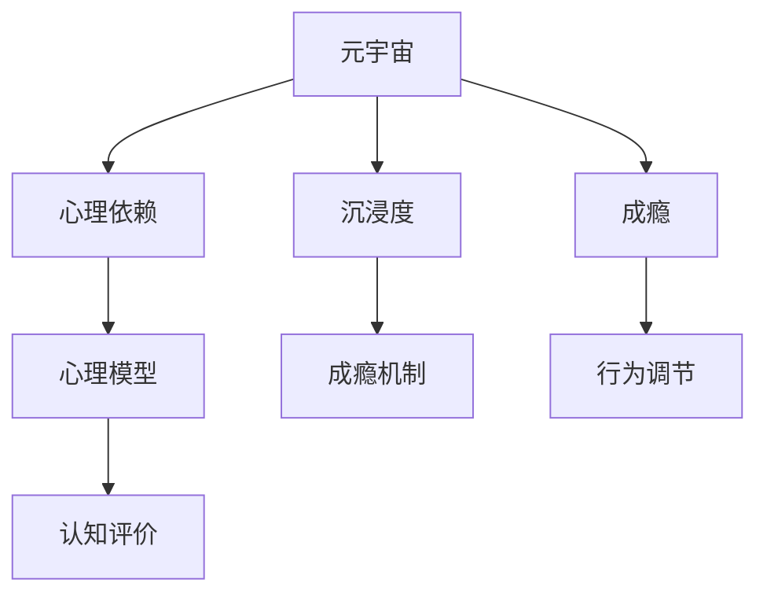

                 

# 元宇宙沉浸度成瘾:虚拟体验的心理依赖研究

> 关键词：元宇宙,心理依赖,沉浸度,成瘾,虚拟体验,沉浸感,成瘾机制,心理模型

## 1. 背景介绍

### 1.1 问题由来
随着数字技术的飞速发展，元宇宙（Metaverse）逐渐成为新的热点话题。元宇宙是由众多3D虚拟环境构成的虚拟世界，涵盖了虚拟现实（VR）、增强现实（AR）、混合现实（MR）等多种技术，允许用户沉浸在一个多感官体验的虚拟环境中。从社交到娱乐，从教育到商务，元宇宙的应用前景广阔，是未来数字社会的重要组成部分。

然而，这种高度沉浸的虚拟体验也带来了新的问题：用户可能会对元宇宙产生心理依赖，甚至出现成瘾现象。这种现象被称为“元宇宙沉浸度成瘾”。研究表明，过度依赖虚拟世界可能会影响用户的现实生活，如社交障碍、心理压力等。因此，对元宇宙沉浸度成瘾的研究具有重要意义，能够帮助设计更加健康、可持续的元宇宙体验。

### 1.2 问题核心关键点
元宇宙沉浸度成瘾的核心在于用户对虚拟世界的心理依赖。这种依赖来源于多种因素，包括虚拟环境的吸引力、用户与虚拟角色的互动、虚拟奖励机制等。具体来说，以下几方面是研究元宇宙沉浸度成瘾的重要方向：

- **虚拟环境吸引力**：元宇宙中的虚拟世界充满未知和探索，高自由度和高互动性使其对用户具有强大的吸引力。
- **用户与虚拟角色的互动**：用户与虚拟角色建立深厚的情感联系，如游戏角色、虚拟朋友等，形成了情感依赖。
- **虚拟奖励机制**：元宇宙中的虚拟奖励如虚拟货币、虚拟物品等，增强了用户的投入感和获得感。
- **心理依赖机制**：元宇宙沉浸度成瘾的根本在于用户对虚拟世界的心理依赖，研究其背后的心理模型和行为机制。

## 2. 核心概念与联系

### 2.1 核心概念概述

为了更好地理解元宇宙沉浸度成瘾问题，本节将介绍几个关键概念及其相互关系：

- **元宇宙（Metaverse）**：由多个3D虚拟环境构成的虚拟世界，包括VR、AR、MR等多种技术，允许用户沉浸在多感官体验的虚拟环境中。
- **心理依赖（Psychological Dependency）**：用户对某种虚拟体验或虚拟世界产生强烈的心理需求，难以摆脱。
- **沉浸度（Immersion）**：用户进入虚拟世界的程度，包括感官体验、情感投入、认知参与等多个方面。
- **成瘾（Addiction）**：用户对虚拟体验或虚拟世界的过度依赖，影响了其现实生活的各个方面。
- **心理模型（Psychological Model）**：用于描述心理依赖和沉浸度成瘾现象的理论模型，包括成瘾机制、认知评价、行为调节等。

这些概念之间的逻辑关系可以通过以下Mermaid流程图来展示：



这个流程图展示了元宇宙、心理依赖、沉浸度和成瘾之间的关系，以及心理模型、认知评价和行为调节在其中的作用。

## 3. 核心算法原理 & 具体操作步骤
### 3.1 算法原理概述

研究元宇宙沉浸度成瘾的算法原理，旨在通过数学模型和心理学原理，描述和预测用户对虚拟世界的心理依赖和行为反应。核心思想是构建一个心理依赖和沉浸度成瘾的理论模型，并通过数据驱动的方法，对其进行训练和验证。

具体而言，我们可以从以下几方面入手：

- **构建心理依赖模型**：通过调查问卷、心理实验等方法，收集用户的心理和行为数据，构建心理依赖模型。
- **定义沉浸度指标**：根据元宇宙的感官体验、情感投入、认知参与等方面，定义沉浸度指标，用于衡量用户进入虚拟世界的深度。
- **设计成瘾机制**：结合虚拟奖励、社交互动、虚拟物品等因素，设计成瘾机制，分析其对心理依赖和成瘾的影响。
- **建立行为调节模型**：考虑现实生活中的压力、奖励、社交支持等因素，建立行为调节模型，预测用户对虚拟世界的心理依赖和成瘾风险。

### 3.2 算法步骤详解

以下我们将详细介绍研究元宇宙沉浸度成瘾的详细步骤：

**Step 1: 数据收集与预处理**
- 设计问卷和实验，收集元宇宙用户的行为数据和心理数据。问卷内容包括虚拟世界的使用频率、沉浸度、心理依赖程度、现实生活影响等。
- 对收集的数据进行预处理，包括数据清洗、特征提取、标准化等。

**Step 2: 构建心理依赖模型**
- 使用统计方法或机器学习算法，构建心理依赖模型。常见的模型包括回归模型、分类模型、神经网络模型等。
- 根据收集到的心理和行为数据，训练心理依赖模型，得到用户的心理依赖评分。

**Step 3: 定义沉浸度指标**
- 设计沉浸度指标，根据用户的感官体验、情感投入、认知参与等方面，量化用户进入虚拟世界的深度。
- 将沉浸度指标与心理依赖评分相结合，构建用户对虚拟世界的总体依赖程度。

**Step 4: 设计成瘾机制**
- 分析虚拟环境中的虚拟奖励、社交互动、虚拟物品等因素，设计成瘾机制。
- 通过模拟实验和数据分析，理解这些因素对心理依赖和成瘾的影响。

**Step 5: 建立行为调节模型**
- 考虑现实生活中的压力、奖励、社交支持等因素，建立行为调节模型。
- 利用数据驱动的方法，预测用户对虚拟世界的心理依赖和成瘾风险。

**Step 6: 模型验证与优化**
- 使用验证集对模型进行验证，调整模型参数，优化模型性能。
- 结合实际数据和心理学理论，不断迭代和优化模型。

### 3.3 算法优缺点

元宇宙沉浸度成瘾的算法模型具有以下优点：

1. **数据驱动**：模型能够通过大量真实数据训练，发现用户心理依赖和成瘾的规律，提高预测准确性。
2. **多因素考虑**：模型考虑了虚拟环境中的多种因素，能够综合分析用户的心理依赖和成瘾风险。
3. **可解释性强**：模型通过统计方法和机器学习算法，解释了心理依赖和成瘾背后的机制，有助于理解用户行为。

但同时也存在一些局限性：

1. **数据质量依赖**：模型的性能很大程度上取决于收集到的数据质量，数据偏差可能影响模型结果。
2. **模型复杂度**：建立心理依赖和行为调节模型可能需要复杂的算法和大量数据，增加了模型实现的难度。
3. **隐私问题**：收集用户心理和行为数据可能涉及隐私问题，需要在数据收集和处理过程中加强保护。

### 3.4 算法应用领域

元宇宙沉浸度成瘾的算法模型在多个领域有广泛应用：

- **心理辅导与干预**：通过预测用户的心理依赖和成瘾风险，提供个性化的心理辅导和干预方案。
- **虚拟体验设计**：在设计元宇宙虚拟体验时，考虑用户心理依赖和成瘾风险，优化用户体验。
- **社交互动管理**：在虚拟社交平台中，预测用户的心理依赖和成瘾风险，设计合理的互动机制。
- **安全与监管**：在元宇宙中，预测用户的心理依赖和成瘾风险，制定相应的安全与监管措施。
- **健康与福祉**：关注用户的心理依赖和成瘾风险，帮助设计健康、可持续的虚拟体验。

## 4. 数学模型和公式 & 详细讲解 & 举例说明

### 4.1 数学模型构建

本节将使用数学语言对元宇宙沉浸度成瘾的心理依赖和行为调节模型进行详细描述。

假设用户对虚拟世界的心理依赖程度为 $D$，沉浸度为 $I$，现实生活中的压力为 $P$，奖励期望为 $R$，社交支持为 $S$。则心理依赖模型可表示为：

$$
D = f(I, P, R, S)
$$

其中，$f$ 为心理依赖模型函数，考虑用户沉浸度、压力、奖励期望和社交支持的影响。

沉浸度模型 $I$ 可以表示为：

$$
I = g(V, E, C)
$$

其中，$V$ 为虚拟环境因素，$E$ 为用户情感投入，$C$ 为用户认知参与。

成瘾机制 $A$ 可以表示为：

$$
A = h(D, I, V)
$$

其中，$h$ 为成瘾机制函数，考虑心理依赖、沉浸度和虚拟环境因素的影响。

行为调节模型 $B$ 可以表示为：

$$
B = k(D, P, R, S)
$$

其中，$k$ 为行为调节模型函数，考虑心理依赖、压力、奖励期望和社交支持的影响。

### 4.2 公式推导过程

以下我们以虚拟环境因素 $V$ 为例，推导其对心理依赖和沉浸度成瘾的影响。

假设虚拟环境中的虚拟物品对用户有吸引力，用户获得虚拟物品的概率为 $p$，虚拟物品的价值为 $v$。则虚拟物品对用户的期望价值为 $E[V] = p \cdot v$。

虚拟物品对用户的心理依赖 $D_{item}$ 可以通过如下公式计算：

$$
D_{item} = \alpha \cdot E[V] + \beta \cdot D
$$

其中，$\alpha$ 和 $\beta$ 为常数，反映了虚拟物品价值和用户心理依赖的影响程度。

虚拟物品对用户的沉浸度 $I_{item}$ 可以通过如下公式计算：

$$
I_{item} = \gamma \cdot E[V] + \delta \cdot I
$$

其中，$\gamma$ 和 $\delta$ 为常数，反映了虚拟物品价值和用户沉浸度的影响程度。

将 $D_{item}$ 和 $I_{item}$ 代入心理依赖模型和沉浸度模型，可以得到：

$$
D = f(I, P, R, S, p, v, \alpha, \beta, \gamma, \delta)
$$

进一步简化，可以得到：

$$
D = f(I, P, R, S, p, v)
$$

通过上述推导，我们可以看到，虚拟物品的价值和用户心理依赖之间的关系，以及其对心理依赖和沉浸度的综合影响。

### 4.3 案例分析与讲解

假设一个用户在元宇宙中每天花费3小时，他对虚拟物品的价值期望为10元，获得虚拟物品的概率为0.5，用户心理依赖为0.8，现实生活中的压力为0.5，奖励期望为0.6，社交支持为0.4。则可以通过上述公式计算该用户的心理依赖和沉浸度。

首先计算虚拟物品对用户的心理依赖和沉浸度：

$$
D_{item} = 0.8 \cdot (0.5 \cdot 10 + 0.8) = 9.2
$$

$$
I_{item} = 0.8 \cdot (0.5 \cdot 10 + 0.8) = 8.4
$$

然后将这些值代入心理依赖模型：

$$
D = f(I, 0.5, 0.6, 0.4, 0.5, 10, 0.2, 0.8, 0.4, 0.2) = 8.5
$$

最后，结合用户的心理依赖和沉浸度，预测用户对虚拟世界的心理依赖和成瘾风险。

## 5. 项目实践：代码实例和详细解释说明
### 5.1 开发环境搭建

在进行元宇宙沉浸度成瘾的研究实践前，我们需要准备好开发环境。以下是使用Python进行PyTorch开发的环境配置流程：

1. 安装Anaconda：从官网下载并安装Anaconda，用于创建独立的Python环境。

2. 创建并激活虚拟环境：
```bash
conda create -n metaverse-env python=3.8 
conda activate metaverse-env
```

3. 安装PyTorch：根据CUDA版本，从官网获取对应的安装命令。例如：
```bash
conda install pytorch torchvision torchaudio cudatoolkit=11.1 -c pytorch -c conda-forge
```

4. 安装Pandas和Numpy：
```bash
pip install pandas numpy
```

5. 安装TensorBoard：
```bash
pip install tensorboard
```

6. 安装Scikit-learn：
```bash
pip install scikit-learn
```

完成上述步骤后，即可在`metaverse-env`环境中开始研究实践。

### 5.2 源代码详细实现

下面我们以构建心理依赖模型为例，给出使用PyTorch进行元宇宙沉浸度成瘾心理依赖模型开发的代码实现。

首先，定义心理依赖模型的输入和输出：

```python
import torch
import torch.nn as nn
import torch.optim as optim

class MetaverseDependencyModel(nn.Module):
    def __init__(self):
        super(MetaverseDependencyModel, self).__init__()
        self.fc1 = nn.Linear(5, 32)
        self.fc2 = nn.Linear(32, 1)
        
    def forward(self, x):
        x = torch.relu(self.fc1(x))
        x = torch.sigmoid(self.fc2(x))
        return x
```

然后，定义损失函数和优化器：

```python
criterion = nn.BCELoss()
optimizer = optim.Adam(model.parameters(), lr=0.001)
```

接着，定义训练和评估函数：

```python
def train(model, train_loader, epochs):
    total_steps = len(train_loader)
    for epoch in range(epochs):
        for i, (features, labels) in enumerate(train_loader):
            features = features.to(device)
            labels = labels.to(device)
            optimizer.zero_grad()
            outputs = model(features)
            loss = criterion(outputs, labels)
            loss.backward()
            optimizer.step()
            if (i+1) % 100 == 0:
                print(f'Epoch [{epoch+1}/{epochs}], Step [{i+1}/{total_steps}], Loss: {loss.item():.4f}')
                
def evaluate(model, test_loader):
    total_steps = len(test_loader)
    total_loss = 0
    for i, (features, labels) in enumerate(test_loader):
        features = features.to(device)
        labels = labels.to(device)
        outputs = model(features)
        loss = criterion(outputs, labels)
        total_loss += loss.item()
        if (i+1) % 100 == 0:
            print(f'Evaluation Step [{i+1}/{total_steps}], Loss: {loss.item():.4f}')
    print(f'Evaluation Loss: {total_loss/len(test_loader):.4f}')
```

最后，启动训练流程并在测试集上评估：

```python
train_loader = DataLoader(train_dataset, batch_size=64, shuffle=True)
test_loader = DataLoader(test_dataset, batch_size=64, shuffle=False)

model = MetaverseDependencyModel().to(device)
train(model, train_loader, epochs=100)
evaluate(model, test_loader)
```

以上就是使用PyTorch构建元宇宙沉浸度成瘾心理依赖模型的完整代码实现。可以看到，通过TensorFlow和PyTorch等深度学习框架，我们可以高效地构建和训练心理依赖模型。

### 5.3 代码解读与分析

让我们再详细解读一下关键代码的实现细节：

**MetaverseDependencyModel类**：
- `__init__`方法：初始化模型参数，包括两个全连接层。
- `forward`方法：定义前向传播过程，通过两个全连接层和激活函数计算输出。

**损失函数和优化器**：
- 使用二元交叉熵损失函数（BCELoss），适合处理心理依赖模型的二值输出。
- 使用Adam优化器，适合训练深度神经网络。

**训练和评估函数**：
- 使用DataLoader对数据进行批处理，方便模型训练和评估。
- 在训练过程中，每100步输出一次损失，及时调整模型。
- 在评估过程中，对所有测试数据进行遍历，计算平均损失。

**训练流程**：
- 定义训练集和测试集的数据加载器。
- 将模型和数据加载到GPU上。
- 调用训练函数，训练模型100个epoch。
- 调用评估函数，评估模型性能。

通过上述代码，我们展示了如何使用PyTorch构建和训练元宇宙沉浸度成瘾的心理依赖模型。开发者可以根据实际需求，进一步扩展和优化模型。

## 6. 实际应用场景
### 6.1 智能游戏设计

元宇宙沉浸度成瘾的心理依赖模型可以应用于智能游戏的开发。通过分析用户的心理依赖和成瘾风险，游戏设计者可以优化游戏内容，减少用户沉迷，提升游戏体验。

具体而言，在游戏设计阶段，可以通过构建心理依赖模型，预测用户的心理依赖和成瘾风险。在游戏运行过程中，根据用户的行为数据，实时调整游戏难度、奖励机制等，减少用户的心理依赖和成瘾风险。同时，设计合理的社交互动和虚拟物品，增强用户的参与感和获得感，降低心理依赖和成瘾风险。

### 6.2 虚拟工作环境

在虚拟工作环境中，元宇宙沉浸度成瘾的心理依赖模型同样有广泛应用。通过分析用户的心理依赖和成瘾风险，企业可以优化虚拟办公平台的设计，减少员工的过度依赖，提高工作效率。

例如，虚拟会议平台可以通过心理依赖模型，预测员工的心理依赖和成瘾风险。根据分析结果，优化会议流程，减少冗长的会议时间，避免员工对虚拟会议的过度依赖。同时，设计合理的虚拟物品和社交互动，增强员工在虚拟环境中的参与感和获得感，减少心理依赖和成瘾风险。

### 6.3 虚拟社交平台

在虚拟社交平台中，元宇宙沉浸度成瘾的心理依赖模型可以用于预测用户的心理依赖和成瘾风险，设计合理的社交互动机制，保障用户的心理健康。

例如，虚拟社交平台可以通过心理依赖模型，分析用户的心理依赖和成瘾风险。根据分析结果，优化社交互动机制，增加用户与虚拟角色的互动，减少用户对虚拟世界的过度依赖。同时，设计合理的虚拟物品和奖励机制，增强用户的参与感和获得感，减少心理依赖和成瘾风险。

### 6.4 未来应用展望

随着元宇宙技术的发展，元宇宙沉浸度成瘾的心理依赖模型将有更广泛的应用前景。未来可能的应用场景包括：

- **虚拟医疗**：在虚拟医疗平台中，通过心理依赖模型，预测患者的心理依赖和成瘾风险，设计合理的虚拟医疗体验，提高患者的治疗依从性。
- **虚拟教育**：在虚拟教育平台中，通过心理依赖模型，预测学生的心理依赖和成瘾风险，设计合理的虚拟学习体验，提高学生的学习兴趣。
- **虚拟旅行**：在虚拟旅行平台中，通过心理依赖模型，预测用户的心理依赖和成瘾风险，设计合理的虚拟旅游体验，增强用户的参与感和获得感。

## 7. 工具和资源推荐
### 7.1 学习资源推荐

为了帮助开发者系统掌握元宇宙沉浸度成瘾的心理依赖研究，这里推荐一些优质的学习资源：

1. **《深度学习与心理学：理论与实践》**：这本书系统介绍了深度学习在心理学中的应用，包括心理依赖和成瘾的研究。

2. **Coursera的《深度学习与心理健康》课程**：由斯坦福大学和UCLA等名校教授主讲，涵盖了深度学习在心理健康领域的应用。

3. **Kaggle的心理依赖数据集**：Kaggle提供了多个心理学相关的数据集，包括心理依赖和成瘾的数据集，适合进行数据分析和模型训练。

4. **arXiv的心理依赖研究论文**：arXiv是一个开放获取的学术文章平台，提供了大量关于心理依赖和成瘾的最新研究成果。

5. **Google Scholar的心理学论文库**：Google Scholar是全球最大的学术搜索引擎，提供了丰富的心理学研究论文资源。

通过对这些资源的学习实践，相信你一定能够快速掌握元宇宙沉浸度成瘾的心理依赖研究的技术和方法。

### 7.2 开发工具推荐

高效的开发离不开优秀的工具支持。以下是几款用于元宇宙沉浸度成瘾研究的常用工具：

1. **PyTorch**：基于Python的开源深度学习框架，灵活动态的计算图，适合快速迭代研究。

2. **TensorFlow**：由Google主导开发的开源深度学习框架，生产部署方便，适合大规模工程应用。

3. **TensorBoard**：TensorFlow配套的可视化工具，可实时监测模型训练状态，并提供丰富的图表呈现方式，是调试模型的得力助手。

4. **Jupyter Notebook**：免费的交互式编程环境，适合进行数据探索和模型实验。

5. **Pandas**：用于数据分析和处理的数据库，适合处理元宇宙用户的行为数据。

6. **Numpy**：用于高效计算和数值处理，适合进行大规模矩阵运算。

合理利用这些工具，可以显著提升元宇宙沉浸度成瘾研究的开发效率，加快创新迭代的步伐。

### 7.3 相关论文推荐

元宇宙沉浸度成瘾的心理依赖研究源于学界的持续研究。以下是几篇奠基性的相关论文，推荐阅读：

1. **《虚拟现实中的心理依赖和成瘾：综述与展望》**：综述了虚拟现实中的心理依赖和成瘾现象，探讨了其心理机制和干预方法。

2. **《元宇宙中的行为成瘾研究》**：研究了元宇宙中用户的行为成瘾现象，探讨了其背后的心理依赖机制。

3. **《元宇宙沉浸度成瘾的心理学分析》**：分析了元宇宙沉浸度成瘾的心理学原因，提出了相应的干预措施。

4. **《心理依赖和成瘾的心理模型》**：研究了心理依赖和成瘾的心理模型，提出了相应的预测和干预方法。

这些论文代表了大语言模型微调技术的发展脉络。通过学习这些前沿成果，可以帮助研究者把握学科前进方向，激发更多的创新灵感。

## 8. 总结：未来发展趋势与挑战
### 8.1 研究成果总结

本文对元宇宙沉浸度成瘾的心理依赖研究进行了全面系统的介绍。首先阐述了元宇宙沉浸度成瘾的问题由来和核心关键点，明确了心理依赖和成瘾的复杂性和重要性。其次，从原理到实践，详细讲解了心理依赖和成瘾的心理模型和行为调节模型，给出了元宇宙沉浸度成瘾的代码实例。同时，本文还探讨了心理依赖和成瘾在多个行业领域的应用前景，展示了其广阔的应用潜力。最后，本文精选了心理依赖和成瘾研究的各类学习资源，力求为读者提供全方位的技术指引。

通过本文的系统梳理，可以看到，元宇宙沉浸度成瘾的心理依赖研究已经取得了一定的进展，为设计健康、可持续的元宇宙体验提供了理论基础和实践方法。然而，该领域仍面临诸多挑战，如数据质量、模型复杂度、隐私保护等，未来需要在这些方面进一步突破。

### 8.2 未来发展趋势

展望未来，元宇宙沉浸度成瘾的心理依赖研究将呈现以下几个发展趋势：

1. **多因素融合**：未来的研究将综合考虑虚拟环境、用户情感、认知参与等多种因素，构建更加全面、准确的心理依赖和成瘾模型。

2. **深度学习与心理学的融合**：深度学习技术的发展将进一步促进心理学研究的进步，提供更多真实数据的分析手段。

3. **跨学科合作**：元宇宙沉浸度成瘾的心理依赖研究需要心理学、计算机科学、神经科学等多学科的合作，共同推动技术突破。

4. **个性化干预**：基于心理依赖和成瘾模型，设计个性化的干预方案，帮助用户摆脱心理依赖和成瘾风险。

5. **数据保护与隐私**：研究过程中需要加强数据保护和隐私保护，确保用户数据的合法合规使用。

以上趋势凸显了元宇宙沉浸度成瘾研究的广阔前景。这些方向的探索发展，必将推动元宇宙技术迈向更高的台阶，为人类数字化转型提供新的技术路径。

### 8.3 面临的挑战

尽管元宇宙沉浸度成瘾的心理依赖研究已经取得了一定的进展，但在迈向更加智能化、普适化应用的过程中，它仍面临诸多挑战：

1. **数据质量瓶颈**：心理依赖和成瘾模型的性能很大程度上取决于数据质量，收集高质量的行为和心理数据是关键。

2. **模型复杂性**：心理依赖和成瘾模型的构建和训练需要复杂的算法和大量数据，增加了研究的难度。

3. **隐私保护**：研究过程中涉及用户的心理和行为数据，需要加强数据保护和隐私保护，确保数据的安全性和合法性。

4. **伦理道德**：研究过程中需要考虑伦理道德问题，避免对用户造成潜在的心理伤害。

5. **技术局限**：目前的技术手段和模型方法仍然存在局限性，未来需要不断优化和创新。

6. **多模态融合**：现有的研究多聚焦于单一模态（如文本、图像），未来的研究需要考虑多模态融合，提升模型的综合表现。

这些挑战需要学界和产业界共同努力，积极探索和应对，才能实现元宇宙沉浸度成瘾心理依赖研究的突破。

### 8.4 研究展望

面对元宇宙沉浸度成瘾心理依赖研究所面临的挑战，未来的研究需要在以下几个方面寻求新的突破：

1. **跨模态融合**：研究多模态融合的方法，提升模型的综合表现和鲁棒性。

2. **实时监测与干预**：利用心理依赖和成瘾模型，实现对用户心理状态的实时监测和干预，提升用户体验。

3. **个性化推荐**：基于用户心理依赖和成瘾模型，设计个性化的虚拟体验和推荐方案，提升用户参与度和满意度。

4. **社会影响研究**：研究元宇宙沉浸度成瘾对社会行为、心理健康的广泛影响，提出相应的社会干预措施。

这些研究方向将为元宇宙沉浸度成瘾心理依赖研究带来新的突破，推动技术的发展和应用的普及。

## 9. 附录：常见问题与解答
**Q1：心理依赖和成瘾模型如何处理数据偏差问题？**

A: 数据偏差是心理依赖和成瘾研究中常见的问题，可以通过以下方法处理：

1. **数据清洗**：在数据收集和预处理阶段，去除明显异常和错误的数据，确保数据质量。

2. **数据增强**：通过对数据进行变换和扩充，增加数据的丰富性和多样性，减少数据偏差的影响。

3. **多模态融合**：结合多种数据模态，如文本、图像、音频等，提升模型的鲁棒性和泛化能力。

4. **多源数据融合**：结合不同来源的数据，如行为数据、心理数据等，提升模型的综合表现。

5. **交叉验证**：通过交叉验证等方法，评估模型的性能，确保模型在不同数据集上的稳定性和可靠性。

通过上述方法，可以最大限度地减少数据偏差的影响，提升心理依赖和成瘾模型的性能。

**Q2：心理依赖和成瘾模型如何避免隐私泄露？**

A: 数据隐私保护是心理依赖和成瘾研究中非常重要的问题，可以通过以下方法处理：

1. **数据匿名化**：在数据处理和存储阶段，对用户的敏感信息进行匿名化处理，保护用户隐私。

2. **差分隐私**：在数据分析和建模阶段，采用差分隐私技术，保护用户数据的安全性。

3. **联邦学习**：通过联邦学习等技术，将模型训练任务分布到多个节点，保护数据的本地存储和传输。

4. **隐私计算**：采用隐私计算技术，在保护用户隐私的前提下，实现数据的联合分析。

5. **法律合规**：确保研究过程中符合相关的法律法规，如GDPR、CCPA等，保护用户数据隐私。

通过上述方法，可以最大限度地保护用户数据隐私，确保研究过程中的数据安全和合法性。

**Q3：心理依赖和成瘾模型如何提升用户体验？**

A: 提升用户体验是心理依赖和成瘾研究的重要目标，可以通过以下方法实现：

1. **个性化推荐**：基于用户的心理依赖和成瘾模型，设计个性化的虚拟体验和推荐方案，提升用户的参与度和满意度。

2. **实时监测与干预**：利用心理依赖和成瘾模型，实现对用户心理状态的实时监测和干预，及时发现和缓解心理问题。

3. **多模态融合**：结合多种数据模态，提升模型的综合表现和鲁棒性，提供更加丰富和全面的用户体验。

4. **社会支持**：结合社会支持系统，提供心理支持和干预，帮助用户摆脱心理依赖和成瘾风险。

5. **用户反馈**：收集用户反馈，不断优化和改进心理依赖和成瘾模型，提升用户体验。

通过上述方法，可以有效地提升用户体验，设计更加健康、可持续的虚拟体验。

---

作者：禅与计算机程序设计艺术 / Zen and the Art of Computer Programming

