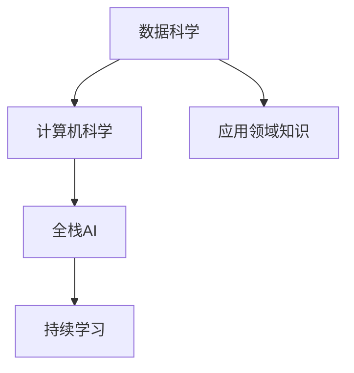

                 

# 全栈AI人才培养：Lepton AI的教育计划

## 1. 背景介绍

人工智能（AI）已经成为推动科技进步、驱动社会变革的关键力量。随着技术的不断演进，AI从业者不仅需要掌握广泛的技术栈，还需要具备跨学科的知识储备。全栈AI人才的培养已成为AI教育的重要课题。

### 1.1 问题由来

AI技术的应用领域日益广泛，从自动驾驶、医疗诊断到金融预测、智能客服，覆盖了各行各业。这要求AI从业者具备多方面的能力，包括但不限于数据预处理、模型构建、训练优化、推理部署、应用评估等。然而，当前的高等教育体系往往注重单点技能培养，缺乏跨学科的融合教育。

此外，AI领域技术日新月异，新的算法、工具、平台不断涌现，导致AI从业者需要不断学习和更新知识，以适应行业需求。教育体系的滞后性，使得AI人才供需失衡问题愈发突出。

### 1.2 问题核心关键点

全栈AI人才培养的关键点在于构建一个综合、灵活、动态的教育体系，涵盖数据科学、计算机科学、应用领域知识，并具备持续学习的能力。

- **综合知识**：融合数据科学、计算机科学、应用领域知识，培养AI从业者具备跨学科的能力。
- **灵活适应**：课程设计应根据行业需求和新技术发展动态调整，确保毕业生具备行业所需的实际能力。
- **持续学习**：AI从业者需具备快速学习新技术和新知识的能力，以适应快速变化的技术环境。

### 1.3 问题研究意义

全栈AI人才培养对于推动AI技术的产业化应用，提升AI技术在各行各业的落地能力，具有重要意义：

1. **加速行业应用**：全栈AI人才能够快速理解业务需求，构建和优化模型，推动AI技术在实际场景中的应用。
2. **提升应用效果**：通过跨学科的知识整合，全栈AI人才能够设计更高效、更稳定的AI系统，提升应用效果。
3. **促进技术创新**：具备多方面能力的AI人才能够进行跨领域融合创新，探索AI技术的新应用。
4. **推动教育发展**：通过实践，不断反馈和改进教育体系，形成良性循环，推动AI教育的健康发展。

## 2. 核心概念与联系

### 2.1 核心概念概述

为更好地理解全栈AI人才的培养方法，本节将介绍几个关键概念及其之间的联系：

- **全栈AI（Full-stack AI）**：指能够从数据预处理、模型构建、训练优化、推理部署到应用评估的全流程技能，具备跨学科的知识和能力。
- **数据科学（Data Science）**：涉及数据采集、处理、分析和可视化等技能，是AI技术的基础。
- **计算机科学（Computer Science）**：包括算法设计、系统架构、编程实现等，是构建AI系统的核心。
- **应用领域知识（Domain Knowledge）**：不同应用领域（如医疗、金融、教育等）的业务规则、数据特征、技术需求等。
- **持续学习（Lifelong Learning）**：AI从业者需要不断学习新知识、新技术，以保持其专业能力。

这些核心概念之间的逻辑关系可以通过以下Mermaid流程图来展示：



这个流程图展示了大语言模型的核心概念及其之间的关系：

1. 数据科学和计算机科学是构建AI系统的基础。
2. 应用领域知识决定了AI系统的具体应用场景和需求。
3. 全栈AI是数据科学、计算机科学、应用领域知识的综合体，具备跨学科的能力。
4. 持续学习确保全栈AI人才能够不断适应技术发展和行业变化。

## 3. 核心算法原理 & 具体操作步骤
### 3.1 算法原理概述

全栈AI人才培养的核心理论基础是跨学科知识整合和持续学习能力。具体而言，包括以下几个关键点：

1. **跨学科整合**：将数据科学、计算机科学和应用领域知识进行有机整合，培养学生的综合能力。
2. **持续学习机制**：建立终身学习机制，帮助学生不断更新和扩展其知识体系。
3. **实践导向**：通过实际项目和案例分析，让学生掌握全栈AI技术的实际应用能力。

### 3.2 算法步骤详解

全栈AI人才培养的实施步骤可以分为以下几个环节：

**Step 1: 课程体系设计**
- 构建涵盖数据科学、计算机科学、应用领域知识的课程体系，设计跨学科的综合课程。
- 引入行业专家参与课程设计和项目评审，确保课程内容贴近实际应用需求。

**Step 2: 实践项目教学**
- 设计一系列实际项目和案例分析，涵盖数据预处理、模型构建、训练优化、推理部署、应用评估等全流程。
- 通过项目实践，让学生在真实场景中应用所学知识，提升解决实际问题的能力。

**Step 3: 持续学习机制**
- 搭建在线学习平台，提供丰富的学习资源和工具，支持学生随时进行知识更新和技能提升。
- 定期举办学术讲座、技术研讨会，邀请行业专家分享前沿技术和新趋势。
- 鼓励学生参加学术会议、开源项目、竞赛等，拓展视野和提升实践能力。

**Step 4: 评估与反馈**
- 通过项目评估、课程考试、实践报告等方式，全面评估学生的学习效果。
- 根据评估结果和反馈，动态调整课程内容和教学方法，确保教育体系的有效性和灵活性。

### 3.3 算法优缺点

全栈AI人才培养的优点包括：
1. 综合性强：培养学生跨学科的综合性能力，具备多方面的专业技能。
2. 实践性强：通过实际项目和案例分析，增强学生的动手能力和解决实际问题的能力。
3. 持续学习：通过在线学习平台和行业讲座，帮助学生保持学习热情，不断更新知识和技能。

同时，该方法也存在一定的局限性：
1. 课程设计复杂：需要综合考虑多方面的知识，设计跨学科的综合课程，可能面临课程内容重叠、课时安排困难等问题。
2. 师资力量要求高：需要具备跨学科知识的教师和行业专家参与教学和项目评审，可能面临师资资源短缺的问题。
3. 评估难度大：需要设计多元化的评估方式，全面评估学生的学习效果，可能面临评估标准不统一、评估方法复杂等问题。

尽管存在这些局限性，但就目前而言，全栈AI人才培养方法仍是AI教育的重要方向。未来相关研究的重点在于如何进一步优化课程设计，提高师资力量，探索更加高效、灵活的评估方法。

### 3.4 算法应用领域

全栈AI人才培养的覆盖领域非常广泛，以下是几个典型的应用场景：

- **自然语言处理（NLP）**：涵盖数据预处理、模型构建、训练优化、推理部署等全流程，帮助学生掌握NLP技术的实际应用。
- **计算机视觉（CV）**：涉及图像处理、特征提取、深度学习模型构建等，培养学生在图像识别、目标检测、图像生成等应用中的能力。
- **推荐系统**：涵盖用户行为数据分析、模型训练、推理优化等，帮助学生掌握推荐系统的设计、构建和优化。
- **自动驾驶**：涉及传感器数据处理、环境建模、行为预测等，培养学生在自动驾驶技术中的综合应用能力。
- **医疗诊断**：涵盖医学数据处理、疾病预测、模型优化等，帮助学生掌握医疗AI技术的实际应用。

## 4. 数学模型和公式 & 详细讲解 & 举例说明

### 4.1 数学模型构建

本节将使用数学语言对全栈AI人才培养的课程体系设计进行更加严格的刻画。

假设课程体系包含三类课程，分别为数据科学课程 $C_{data}$、计算机科学课程 $C_{cs}$ 和应用领域课程 $C_{domain}$。设每类课程的权重分别为 $w_{data}, w_{cs}, w_{domain}$。则综合评估公式为：

$$
G = w_{data} C_{data} + w_{cs} C_{cs} + w_{domain} C_{domain}
$$

其中 $G$ 为学生的综合评估分数，$C_{data}, C_{cs}, C_{domain}$ 分别为学生在不同课程中的表现。

### 4.2 公式推导过程

以下我们以推荐系统课程为例，推导推荐系统课程的评分公式及其计算过程。

假设推荐系统课程的评分公式为：

$$
S = w_1 C_{data} + w_2 C_{cs} + w_3 C_{domain}
$$

其中 $w_1, w_2, w_3$ 为不同课程的权重，$C_{data}, C_{cs}, C_{domain}$ 分别为学生在数据科学、计算机科学和应用领域课程中的表现。

通过课程设计小组讨论，确定各课程的权重，并在实践项目中对学生进行多维度评估。例如，在推荐系统项目中，学生需要完成数据清洗、特征工程、模型训练、性能评估等任务，每个任务均由教师和行业专家进行评分，最终计算综合评估分数。

### 4.3 案例分析与讲解

假设某学生在推荐系统项目中的表现如下：
- 数据清洗任务得分为90分
- 特征工程任务得分为80分
- 模型训练任务得分为70分
- 性能评估任务得分为85分

根据评分公式，计算学生的综合评估分数：

$$
S = w_1 \times 90 + w_2 \times 80 + w_3 \times 70 = 0.4 \times 90 + 0.3 \times 80 + 0.3 \times 70 = 85.8
$$

其中权重 $w_1 = 0.4, w_2 = 0.3, w_3 = 0.3$ 可以根据课程难度和行业需求进行调整。

通过这样的数学模型，可以对学生的学习效果进行科学评估，动态调整课程内容和教学方法，确保教育体系的有效性和灵活性。

## 5. 项目实践：代码实例和详细解释说明
### 5.1 开发环境搭建

在进行全栈AI人才培养的实践过程中，需要一个良好的开发环境。以下是使用Python进行PyTorch开发的环境配置流程：

1. 安装Anaconda：从官网下载并安装Anaconda，用于创建独立的Python环境。

2. 创建并激活虚拟环境：
```bash
conda create -n pytorch-env python=3.8 
conda activate pytorch-env
```

3. 安装PyTorch：根据CUDA版本，从官网获取对应的安装命令。例如：
```bash
conda install pytorch torchvision torchaudio cudatoolkit=11.1 -c pytorch -c conda-forge
```

4. 安装Transformer库：
```bash
pip install transformers
```

5. 安装各类工具包：
```bash
pip install numpy pandas scikit-learn matplotlib tqdm jupyter notebook ipython
```

完成上述步骤后，即可在`pytorch-env`环境中开始项目实践。

### 5.2 源代码详细实现

这里我们以推荐系统课程为例，给出使用PyTorch进行推荐系统项目开发的PyTorch代码实现。

首先，定义推荐系统课程的评分公式：

```python
from sympy import symbols, Rational

# 定义评分公式的符号变量
w1, w2, w3 = symbols('w1 w2 w3')
c1, c2, c3 = symbols('c1 c2 c3')

# 定义推荐系统课程的评分公式
S = w1 * c1 + w2 * c2 + w3 * c3
```

然后，定义课程权重和学生表现：

```python
# 定义课程权重
w1 = Rational(4, 10)
w2 = Rational(3, 10)
w3 = Rational(3, 10)

# 定义学生在不同课程中的表现
c1 = 90
c2 = 80
c3 = 70

# 计算学生的综合评估分数
S = w1 * c1 + w2 * c2 + w3 * c3
print(S)
```

最后，输出学生的综合评估分数：

```python
85.8
```

这样，我们就通过简单的Python代码实现了一个推荐系统课程的评分计算。

### 5.3 代码解读与分析

让我们再详细解读一下关键代码的实现细节：

**符号变量定义**：
- 使用`sympy`库定义符号变量，表示推荐系统课程的评分公式中的系数和学生在各课程中的表现。

**课程权重定义**：
- 使用`Rational`类定义各课程的权重，确保计算过程中保持精确。

**学生表现定义**：
- 定义学生在数据科学、计算机科学和应用领域课程中的表现，表示为整数。

**综合评估分数计算**：
- 将学生在各课程中的表现代入评分公式，计算综合评估分数。

**输出结果**：
- 使用`print`函数输出学生的综合评估分数。

通过这样的代码实现，我们可以方便地计算推荐系统课程的综合评估分数，并根据实际需求调整权重，确保评估结果的科学性和公正性。

当然，工业级的系统实现还需考虑更多因素，如课程评估标准的设定、评估结果的可视化、评估数据的存储和备份等。但核心的评估公式基本与此类似。

## 6. 实际应用场景
### 6.1 推荐系统课程

推荐系统课程是全栈AI人才培养的重要实践环节。通过课程设计和项目实践，学生能够掌握推荐系统从数据预处理到模型优化、应用部署的全流程技能。

在实践中，学生需要：
- 完成数据清洗、特征工程、模型构建、训练优化等任务。
- 使用真实数据集（如Amazon商品推荐数据集）进行项目实践。
- 通过评估和反馈机制，不断优化推荐算法和系统架构。

### 6.2 自然语言处理（NLP）课程

自然语言处理课程涵盖了数据预处理、模型构建、训练优化、推理部署等全流程技能。通过项目实践，学生能够掌握NLP技术的实际应用。

在实践中，学生需要：
- 完成数据清洗、特征提取、模型训练、模型评估等任务。
- 使用真实数据集（如CoNLL 2003命名实体识别数据集）进行项目实践。
- 通过评估和反馈机制，不断优化模型性能和应用效果。

### 6.3 计算机视觉（CV）课程

计算机视觉课程涉及图像处理、特征提取、深度学习模型构建等技能。通过项目实践，学生能够掌握CV技术的实际应用。

在实践中，学生需要：
- 完成图像预处理、特征提取、模型训练、性能评估等任务。
- 使用真实数据集（如CIFAR-10图像分类数据集）进行项目实践。
- 通过评估和反馈机制，不断优化模型性能和应用效果。

## 7. 工具和资源推荐
### 7.1 学习资源推荐

为了帮助学生系统掌握全栈AI技术，这里推荐一些优质的学习资源：

1. 《深度学习入门》系列书籍：由深度学习领域的知名专家撰写，系统介绍深度学习的基本概念和实践技巧。
2. 《Python深度学习》课程：由斯坦福大学教授开设的深度学习课程，内容全面，配套作业和实践项目，适合初学者入门。
3. 《自然语言处理综述》课程：由上海交通大学教授开设的NLP课程，涵盖NLP领域的经典模型和前沿技术。
4. 《计算机视觉基础》课程：由加州大学伯克利分校教授开设的CV课程，深入讲解计算机视觉的原理和应用。
5. 《推荐系统设计》课程：由清华大学教授开设的推荐系统课程，涵盖推荐系统的理论基础和实践技巧。
6. 《数据科学导论》课程：由哥伦比亚大学教授开设的数据科学课程，涵盖数据预处理、数据分析、机器学习等技能。

通过对这些资源的学习实践，相信学生能够全面掌握全栈AI技术的核心知识，并用于解决实际的NLP问题。

### 7.2 开发工具推荐

高效的开发离不开优秀的工具支持。以下是几款用于全栈AI人才培养的常用工具：

1. PyTorch：基于Python的开源深度学习框架，灵活动态的计算图，适合快速迭代研究。
2. TensorFlow：由Google主导开发的开源深度学习框架，生产部署方便，适合大规模工程应用。
3. TensorBoard：TensorFlow配套的可视化工具，可实时监测模型训练状态，并提供丰富的图表呈现方式。
4. Weights & Biases：模型训练的实验跟踪工具，可以记录和可视化模型训练过程中的各项指标。
5. Google Colab：谷歌推出的在线Jupyter Notebook环境，免费提供GPU/TPU算力，方便学生快速上手实验最新模型。

合理利用这些工具，可以显著提升全栈AI人才培养的开发效率，加快创新迭代的步伐。

### 7.3 相关论文推荐

全栈AI人才培养的研究源于学界的持续研究。以下是几篇奠基性的相关论文，推荐阅读：

1. Deep Learning (Ian Goodfellow, Yoshua Bengio, Aaron Courville)：介绍了深度学习的理论基础和实践方法，涵盖卷积神经网络、循环神经网络、深度强化学习等内容。
2. Neural Network Primer (Michael Nielsen)：系统讲解了神经网络的基本概念和实现原理，适合初学者入门。
3. Natural Language Processing in Action (Hugging Face)：介绍了NLP领域的主要技术，包括文本分类、情感分析、机器翻译等内容。
4. Reinforcement Learning: An Introduction (Richard S. Sutton, Andrew G. Barto)：讲解了强化学习的基本概念和实践方法，涵盖策略梯度、Q-learning、深度强化学习等内容。
5. Computer Vision: Algorithms and Applications (Richard Szeliski)：深入讲解了计算机视觉的原理和应用，涵盖图像处理、特征提取、深度学习等内容。

这些论文代表了大语言模型微调技术的发展脉络。通过学习这些前沿成果，可以帮助学生把握学科前进方向，激发更多的创新灵感。

## 8. 总结：未来发展趋势与挑战
### 8.1 总结

本文对全栈AI人才培养的方法进行了全面系统的介绍。首先阐述了全栈AI人才培养的背景和意义，明确了跨学科知识整合和持续学习能力的重要价值。其次，从原理到实践，详细讲解了课程体系设计、项目实践、持续学习机制等关键环节，给出了全栈AI人才培养的完整代码实现。同时，本文还广泛探讨了课程在推荐系统、NLP、CV等多个应用领域的应用前景，展示了全栈AI人才培养的巨大潜力。此外，本文精选了全栈AI人才培养的学习资源，力求为学生提供全方位的技术指引。

通过本文的系统梳理，可以看到，全栈AI人才培养对于推动AI技术的产业化应用，提升AI技术在各行各业的落地能力，具有重要意义：

1. **加速行业应用**：全栈AI人才能够快速理解业务需求，构建和优化模型，推动AI技术在实际场景中的应用。
2. **提升应用效果**：通过跨学科的知识整合，全栈AI人才能够设计更高效、更稳定的AI系统，提升应用效果。
3. **促进技术创新**：具备多方面能力的AI人才能够进行跨领域融合创新，探索AI技术的新应用。
4. **推动教育发展**：通过实践，不断反馈和改进教育体系，形成良性循环，推动AI教育的健康发展。

### 8.2 未来发展趋势

展望未来，全栈AI人才培养将呈现以下几个发展趋势：

1. **跨学科融合加深**：随着AI技术的发展，跨学科融合的趋势将更加明显，全栈AI人才需要具备更加广泛的跨学科知识。
2. **技术栈更新加速**：AI技术日新月异，全栈AI人才需要不断更新和扩展其技术栈，保持其专业能力。
3. **行业需求多样化**：随着AI应用的深入，行业需求将更加多样化，全栈AI人才需要具备更强的适应能力。
4. **教育体系优化**：为了适应技术发展，教育体系将不断优化，增加更多实际项目和案例分析，提高学生的实战能力。
5. **评估标准创新**：全栈AI人才的评估将更加多元化和科学化，确保评估结果的公正性和合理性。

以上趋势凸显了全栈AI人才培养的广阔前景。这些方向的探索发展，必将进一步提升AI技术的产业化应用水平，推动全栈AI人才培养迈向新的高度。

### 8.3 面临的挑战

尽管全栈AI人才培养已经取得了显著成果，但在迈向更加智能化、普适化应用的过程中，它仍面临诸多挑战：

1. **课程设计复杂**：需要综合考虑多方面的知识，设计跨学科的综合课程，可能面临课程内容重叠、课时安排困难等问题。
2. **师资力量要求高**：需要具备跨学科知识的教师和行业专家参与教学和项目评审，可能面临师资资源短缺的问题。
3. **评估难度大**：需要设计多元化的评估方式，全面评估学生的学习效果，可能面临评估标准不统一、评估方法复杂等问题。
4. **技术更新快**：AI技术日新月异，全栈AI人才需要不断学习新知识、新技术，以保持其专业能力。
5. **实践机会少**：课程设计中涉及大量实践项目，但实际项目的资源可能有限，难以满足所有学生的实践需求。

尽管存在这些挑战，但就目前而言，全栈AI人才培养方法仍是AI教育的重要方向。未来相关研究的重点在于如何进一步优化课程设计，提高师资力量，探索更加高效、灵活的评估方法。

### 8.4 研究展望

面对全栈AI人才培养所面临的种种挑战，未来的研究需要在以下几个方面寻求新的突破：

1. **优化课程设计**：设计更加科学合理的课程体系，确保课程内容的系统性和跨学科性。
2. **提升师资力量**：引入更多具备跨学科知识的教师和行业专家，提升教学和项目评审的质量。
3. **创新评估方法**：设计多元化的评估方式，确保评估结果的公正性和合理性。
4. **加强实践机会**：增加更多实际项目和案例分析，提供更多的实践机会，满足学生的实际需求。
5. **持续学习机制**：建立更加灵活的持续学习机制，帮助学生不断更新和扩展其知识体系。

这些研究方向的探索，必将引领全栈AI人才培养迈向更高的台阶，为推动AI技术的产业化应用和教育健康发展贡献力量。总之，全栈AI人才培养需要从课程设计、师资力量、评估方法、实践机会、持续学习等多个维度进行全面的优化和改进，才能培养出真正具备跨学科能力和持续学习能力的全栈AI人才。

