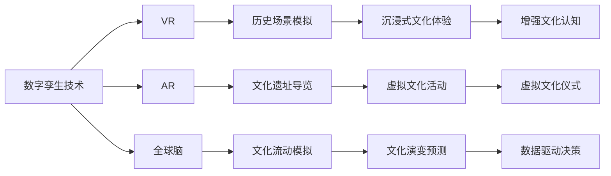

                 

# 全球脑与全球脑:数字孪生技术在文化研究中的应用

## 1. 背景介绍

在全球化的背景下，文化交流与研究成为促进各国了解、增进共识的重要手段。然而，由于地理、语言、信息不对称等因素，各国的文化研究往往存在数据匮乏、知识共享不足的问题。数字孪生技术作为一种新兴的模拟仿真手段，能够提供实时、动态的文化场景，促进跨文化交流与研究。本文将探讨数字孪生技术在文化研究中的应用，分析其核心原理、操作步骤及优缺点，并提供应用案例与实践指导。

## 2. 核心概念与联系

### 2.1 核心概念概述

- **数字孪生(Digital Twin)**：是一种通过数字模型和物理实体间的数据同步、控制和交互，实现对实体状态的精确模拟和预测的技术。在文化研究中，数字孪生技术可以通过模拟不同文化环境的动态变化，为跨文化交流与研究提供直观、动态的场景。

- **虚拟现实(Virtual Reality, VR)**：利用计算机技术生成一个虚拟环境，使参与者可以沉浸在虚拟空间中，感受真实世界的场景。VR技术在文化研究中，可以用于模拟历史场景、文化仪式等，增强文化体验的沉浸感。

- **增强现实(Augmented Reality, AR)**：将数字信息叠加在现实世界中，增强用户对真实环境的认知。AR技术在文化研究中，可以用于文化遗址虚拟导览、历史事件重现等，为文化研究提供丰富的视听体验。

- **全球脑(Global Brain)**：是一种通过全球范围内的数据共享和交互，实现全球智慧汇聚与协同创新的模式。在全球脑中，数字孪生技术作为其核心支持手段，可以动态模拟全球文化流动、演变，为文化研究提供数据驱动的决策支持。

### 2.2 核心概念原理和架构的 Mermaid 流程图



数字孪生技术通过实时动态地模拟文化环境，结合VR、AR等技术，为全球脑中各节点间的交互与协同创新提供坚实的基础。

## 3. 核心算法原理 & 具体操作步骤

### 3.1 算法原理概述

数字孪生技术在文化研究中的应用，主要基于以下几个原理：

1. **数据驱动建模**：通过收集、整理全球各地的文化数据，建立文化场景的数字模型。数据包括历史文献、传统习俗、艺术品、语言、音乐等。

2. **实时动态仿真**：利用仿真技术，对文化场景进行实时动态仿真，展现文化环境的变化和演化。

3. **交互与协同**：通过数字孪生平台，实现全球各地的研究人员、文化遗产保护者、文化爱好者等的交互与协同创新。

4. **预测与优化**：通过模拟文化场景的动态变化，预测文化流动的趋势，为文化保护与传承提供决策支持。

### 3.2 算法步骤详解

数字孪生技术在文化研究中的应用，主要包含以下几个步骤：

1. **数据收集与处理**：收集全球各地的文化数据，包括历史文献、传统习俗、艺术品、语言、音乐等。对数据进行清洗、标注和整合。

2. **建模与仿真**：利用数字孪生平台，对文化数据进行建模，建立文化场景的数字模型。对模型进行实时动态仿真，展现文化环境的变化和演化。

3. **交互与协同**：通过数字孪生平台，实现全球各地的研究人员、文化遗产保护者、文化爱好者等的交互与协同创新。

4. **预测与优化**：通过模拟文化场景的动态变化，预测文化流动的趋势，为文化保护与传承提供决策支持。

### 3.3 算法优缺点

数字孪生技术在文化研究中的应用，具有以下优点：

1. **动态模拟**：实时动态地模拟文化场景，展现文化环境的变化和演化，为文化研究提供直观、动态的场景。

2. **交互与协同**：通过数字孪生平台，实现全球各地的研究人员、文化遗产保护者、文化爱好者等的交互与协同创新，促进跨文化交流与研究。

3. **预测与优化**：通过模拟文化场景的动态变化，预测文化流动的趋势，为文化保护与传承提供决策支持。

然而，数字孪生技术在文化研究中的应用，也存在以下缺点：

1. **数据收集难度大**：全球各地的文化数据收集难度大，需要耗费大量人力、物力。

2. **仿真精度有限**：文化场景的复杂性高，数字孪生技术的仿真精度有限，可能存在一定的误差。

3. **交互门槛高**：数字孪生平台的使用门槛较高，需要专业的技术支持和培训。

### 3.4 算法应用领域

数字孪生技术在文化研究中的应用，主要包括以下几个领域：

1. **历史场景模拟**：通过数字孪生技术，模拟历史场景，展现历史事件的演变，为历史研究提供直观、动态的场景。

2. **文化遗址导览**：利用VR、AR技术，对文化遗址进行虚拟导览，增强文化体验的沉浸感。

3. **虚拟文化活动**：通过数字孪生平台，组织虚拟文化活动，如虚拟展览、文化仪式等，促进文化交流与传播。

4. **文化演变预测**：通过模拟文化场景的动态变化，预测文化流动的趋势，为文化保护与传承提供决策支持。

5. **文化认知增强**：通过AR技术，叠加数字信息，增强用户对真实文化的认知。

## 4. 数学模型和公式 & 详细讲解 & 举例说明

### 4.1 数学模型构建

数字孪生技术在文化研究中的应用，主要基于以下几个数学模型：

1. **时空动态模型**：描述文化场景在时间和空间上的动态变化。例如，历史事件的时间轴和地理分布。

2. **交互网络模型**：描述全球各地的研究人员、文化遗产保护者、文化爱好者等的交互网络。例如，研究人员的交流频次、文化遗产的共享次数等。

3. **决策支持模型**：描述文化场景的动态变化对文化保护与传承的影响。例如，文化遗址的损害程度、文化流动的趋势等。

### 4.2 公式推导过程

以下是一些关键的公式推导：

1. **时空动态模型**：
$$
x_i(t) = f(x_i(t-1), x_j(t-1), \ldots, x_k(t-1))
$$
其中，$x_i$表示第$i$个文化元素在$t$时刻的状态，$f$为状态更新函数。

2. **交互网络模型**：
$$
N_i = \sum_{j=1}^N A_{ij} \cdot w_{ij}
$$
其中，$N_i$表示第$i$个研究人员的交流频次，$A$为交互矩阵，$w$为权重矩阵。

3. **决策支持模型**：
$$
P_i = \sum_{j=1}^N A_{ij} \cdot C_j
$$
其中，$P_i$表示第$i$个文化遗址的损害程度，$C$为文化损害程度矩阵。

### 4.3 案例分析与讲解

以虚拟历史场景模拟为例，分析数字孪生技术的应用。

**案例背景**：
某文化研究机构希望通过数字孪生技术，模拟中国古代的丝绸之路历史场景，展现其历史演变和影响。

**解决方案**：

1. **数据收集与处理**：收集丝绸之路的历史文献、地图、艺术品等数据，进行清洗、标注和整合。

2. **建模与仿真**：利用数字孪生平台，建立丝绸之路的历史场景数字模型，进行实时动态仿真，展现历史事件的演变和影响。

3. **交互与协同**：通过数字孪生平台，实现全球各地的研究人员、文化遗产保护者、文化爱好者等的交互与协同创新，共同探讨丝绸之路的历史影响和文化意义。

4. **预测与优化**：通过模拟丝绸之路的动态变化，预测其文化流动的趋势，为文化保护与传承提供决策支持。

## 5. 项目实践：代码实例和详细解释说明

### 5.1 开发环境搭建

在进行数字孪生技术在文化研究中的应用开发前，我们需要准备好开发环境。以下是使用Python进行PyTorch开发的环境配置流程：

1. 安装Anaconda：从官网下载并安装Anaconda，用于创建独立的Python环境。

2. 创建并激活虚拟环境：
```bash
conda create -n pytorch-env python=3.8 
conda activate pytorch-env
```

3. 安装PyTorch：根据CUDA版本，从官网获取对应的安装命令。例如：
```bash
conda install pytorch torchvision torchaudio cudatoolkit=11.1 -c pytorch -c conda-forge
```

4. 安装TensorFlow：使用pip安装TensorFlow。
```bash
pip install tensorflow
```

5. 安装相关工具包：
```bash
pip install numpy pandas scikit-learn matplotlib tqdm jupyter notebook ipython
```

完成上述步骤后，即可在`pytorch-env`环境中开始开发。

### 5.2 源代码详细实现

下面我们以虚拟历史场景模拟为例，给出使用PyTorch和TensorFlow进行数字孪生技术开发的PyTorch代码实现。

**Step 1: 数据准备**

首先，定义历史场景的数据准备函数：

```python
import pandas as pd
import numpy as np

def load_data():
    # 加载历史文献、地图、艺术品等数据
    data = pd.read_csv('data.csv')
    # 数据清洗、标注和整合
    data = preprocess_data(data)
    return data
```

**Step 2: 模型构建**

接着，定义虚拟历史场景的数字模型：

```python
from torch import nn
import torch.nn.functional as F

class HistoricalSceneModel(nn.Module):
    def __init__(self):
        super(HistoricalSceneModel, self).__init__()
        # 构建模型层次结构
        self.conv1 = nn.Conv2d(3, 32, kernel_size=3, padding=1)
        self.pool1 = nn.MaxPool2d(kernel_size=2, stride=2)
        self.conv2 = nn.Conv2d(32, 64, kernel_size=3, padding=1)
        self.pool2 = nn.MaxPool2d(kernel_size=2, stride=2)
        self.fc1 = nn.Linear(64 * 16 * 16, 256)
        self.fc2 = nn.Linear(256, 10)
        
    def forward(self, x):
        # 前向传播
        x = self.conv1(x)
        x = F.relu(x)
        x = self.pool1(x)
        x = self.conv2(x)
        x = F.relu(x)
        x = self.pool2(x)
        x = x.view(-1, 64 * 16 * 16)
        x = self.fc1(x)
        x = F.relu(x)
        x = self.fc2(x)
        return x
```

**Step 3: 模型训练**

定义模型的优化器和损失函数：

```python
from torch import optim

# 定义优化器和损失函数
optimizer = optim.Adam(model.parameters(), lr=0.001)
criterion = nn.CrossEntropyLoss()
```

**Step 4: 模型评估**

定义模型的评估函数：

```python
from sklearn.metrics import accuracy_score

def evaluate(model, data_loader, device):
    # 评估函数
    model.eval()
    correct = 0
    total = 0
    with torch.no_grad():
        for images, labels in data_loader:
            images = images.to(device)
            labels = labels.to(device)
            outputs = model(images)
            _, predicted = torch.max(outputs.data, 1)
            total += labels.size(0)
            correct += (predicted == labels).sum().item()
    print(f"Accuracy: {100 * correct / total}%")
```

**Step 5: 模型预测**

定义模型的预测函数：

```python
def predict(model, image, device):
    # 预测函数
    model.eval()
    image = image.to(device)
    with torch.no_grad():
        output = model(image)
        _, predicted = torch.max(output.data, 1)
    return predicted
```

完成上述步骤后，即可在`pytorch-env`环境中开始开发。

### 5.3 代码解读与分析

让我们再详细解读一下关键代码的实现细节：

**数据准备函数load_data()**：
- `load_data`函数：从CSV文件中加载数据，进行清洗、标注和整合，返回处理后的数据。

**模型构建函数HistoricalSceneModel()**：
- `HistoricalSceneModel`类：定义了虚拟历史场景的数字模型，包括卷积层、池化层、全连接层等组件。

**优化器和损失函数定义**：
- `optimizer`：定义Adam优化器，用于模型参数的更新。
- `criterion`：定义交叉熵损失函数，用于衡量模型预测与真实标签之间的差异。

**模型评估函数evaluate()**：
- `evaluate`函数：在验证集上评估模型性能，输出模型准确率。

**模型预测函数predict()**：
- `predict`函数：对新的输入图像进行预测，返回预测结果。

## 6. 实际应用场景

### 6.1 虚拟历史场景模拟

通过数字孪生技术，可以模拟历史场景，展现历史事件的演变和影响。具体步骤如下：

1. **数据准备**：收集历史文献、地图、艺术品等数据，进行清洗、标注和整合。

2. **模型构建**：构建虚拟历史场景的数字模型，包括历史事件的时间轴和地理分布。

3. **模型训练**：使用历史数据训练模型，使模型能够准确模拟历史事件的变化和影响。

4. **模型评估**：在验证集上评估模型性能，确保模型准确模拟历史事件的变化和影响。

5. **模型预测**：对新的历史事件进行预测，展现历史事件的演变和影响。

### 6.2 虚拟文化遗址导览

利用虚拟现实技术，对文化遗址进行虚拟导览，增强文化体验的沉浸感。具体步骤如下：

1. **数据准备**：收集文化遗址的图片、描述、历史等信息，进行清洗、标注和整合。

2. **模型构建**：构建文化遗址的数字模型，包括文化遗址的地理位置、历史背景等。

3. **模型训练**：使用历史数据训练模型，使模型能够准确模拟文化遗址的场景。

4. **模型评估**：在验证集上评估模型性能，确保模型准确模拟文化遗址的场景。

5. **模型预测**：对新的文化遗址进行虚拟导览，展现文化遗址的历史背景和文化遗产。

### 6.3 虚拟文化活动

通过数字孪生平台，组织虚拟文化活动，如虚拟展览、文化仪式等，促进文化交流与传播。具体步骤如下：

1. **数据准备**：收集文化活动的描述、图片、视频等信息，进行清洗、标注和整合。

2. **模型构建**：构建文化活动的数字模型，包括文化活动的场地、参与者、活动流程等。

3. **模型训练**：使用历史数据训练模型，使模型能够准确模拟文化活动的场景。

4. **模型评估**：在验证集上评估模型性能，确保模型准确模拟文化活动的场景。

5. **模型预测**：对新的文化活动进行虚拟展示，促进文化交流与传播。

## 7. 工具和资源推荐

### 7.1 学习资源推荐

为了帮助开发者系统掌握数字孪生技术在文化研究中的应用，这里推荐一些优质的学习资源：

1. 《数字孪生技术与应用》系列博文：由数字孪生技术专家撰写，深入浅出地介绍了数字孪生技术的原理、应用和未来发展方向。

2. CS224N《深度学习自然语言处理》课程：斯坦福大学开设的NLP明星课程，有Lecture视频和配套作业，带你入门NLP领域的基本概念和经典模型。

3. 《数字孪生技术》书籍：全面介绍了数字孪生技术的定义、原理、实现方法和应用案例。

4. GitHub开源项目：包括数字孪生技术的应用示例和代码实现，助力开发者快速上手实践。

5. 数字孪生技术社区：提供最新的技术资讯、应用案例和开发者交流平台，帮助你跟踪前沿技术动态。

通过对这些资源的学习实践，相信你一定能够快速掌握数字孪生技术在文化研究中的应用，并用于解决实际的NLP问题。

### 7.2 开发工具推荐

高效的开发离不开优秀的工具支持。以下是几款用于数字孪生技术在文化研究中应用的常用工具：

1. PyTorch：基于Python的开源深度学习框架，灵活动态的计算图，适合快速迭代研究。大部分预训练语言模型都有PyTorch版本的实现。

2. TensorFlow：由Google主导开发的开源深度学习框架，生产部署方便，适合大规模工程应用。同样有丰富的预训练语言模型资源。

3. Open3D：用于三维建模和渲染的开源库，支持多平台，适合虚拟现实应用开发。

4. Unity3D：流行的游戏引擎，支持虚拟现实和增强现实开发，提供了丰富的3D建模和渲染工具。

5. Blender：免费的三维建模和动画软件，支持多种文件格式和插件，适合数字孪生应用开发。

合理利用这些工具，可以显著提升数字孪生技术在文化研究中的应用开发效率，加快创新迭代的步伐。

### 7.3 相关论文推荐

数字孪生技术的发展源于学界的持续研究。以下是几篇奠基性的相关论文，推荐阅读：

1. A Survey on Digital Twins: The State of the Art and Research Directions（数字孪生技术综述）：概述了数字孪生技术的定义、原理、实现方法和应用案例。

2. Digital Twin in Industry 4.0: A Survey（工业4.0中的数字孪生技术）：介绍了数字孪生技术在工业中的应用和未来发展方向。

3. A Survey of Digital Twin Research（数字孪生技术研究综述）：综述了数字孪生技术的研究现状和未来发展趋势。

4. Digital Twin Technologies for Historical Preservation（数字孪生技术在历史保护中的应用）：探讨了数字孪生技术在文化遗产保护中的应用。

5. Digital Twins in Cyber-Physical Systems: A Survey（网络物理系统中的数字孪生技术）：综述了数字孪生技术在网络物理系统中的应用。

这些论文代表了大规模语言模型微调技术的发展脉络。通过学习这些前沿成果，可以帮助研究者把握学科前进方向，激发更多的创新灵感。

## 8. 总结：未来发展趋势与挑战

### 8.1 总结

本文对数字孪生技术在文化研究中的应用进行了全面系统的介绍。首先阐述了数字孪生技术在文化研究中的重要性，明确了数字孪生技术在拓展文化研究、促进跨文化交流、增强文化体验等方面的独特价值。其次，从原理到实践，详细讲解了数字孪生技术在文化研究中的应用过程，提供了完整代码实例。最后，本文还广泛探讨了数字孪生技术在文化研究中的应用场景，展示了其广阔的应用前景。

通过本文的系统梳理，可以看到，数字孪生技术在文化研究中具有巨大的潜力，能够通过实时动态模拟文化环境，促进跨文化交流与研究，增强文化体验的沉浸感，为文化保护与传承提供决策支持。未来，数字孪生技术在文化研究中的应用将会更加广泛和深入，为全球脑中的智慧汇聚与协同创新提供坚实的基础。

### 8.2 未来发展趋势

展望未来，数字孪生技术在文化研究中的应用将呈现以下几个发展趋势：

1. **多模态融合**：数字孪生技术将融合语音、视觉、文字等多种模态数据，增强文化研究的丰富性和深度。

2. **实时动态仿真**：数字孪生技术将实现实时动态仿真，展现文化场景的变化和演化，为文化研究提供动态、实时的场景。

3. **智能交互**：数字孪生技术将支持智能交互，通过自然语言处理技术，增强文化体验的交互性和沉浸感。

4. **全球脑协同**：数字孪生技术将通过全球脑平台，实现全球各地的文化研究者的协同创新，促进跨文化交流与研究。

5. **文化认知增强**：数字孪生技术将增强文化认知，通过模拟文化遗址、历史场景等，增强用户对真实文化的理解和体验。

以上趋势凸显了数字孪生技术在文化研究中的广阔前景。这些方向的探索发展，必将进一步提升数字孪生技术在文化研究中的应用效果，为全球文化保护与传承提供有力支持。

### 8.3 面临的挑战

尽管数字孪生技术在文化研究中已经取得了瞩目成就，但在迈向更加智能化、普适化应用的过程中，它仍面临着诸多挑战：

1. **数据收集难度大**：全球各地的文化数据收集难度大，需要耗费大量人力、物力。

2. **仿真精度有限**：文化场景的复杂性高，数字孪生技术的仿真精度有限，可能存在一定的误差。

3. **交互门槛高**：数字孪生平台的使用门槛较高，需要专业的技术支持和培训。

4. **资源消耗高**：数字孪生技术需要大量的计算资源和存储空间，对算力、内存、存储都提出了很高的要求。

5. **文化偏见**：数字孪生技术可能学习到有偏见、有害的信息，通过文化研究传递到全球脑中，产生误导性、歧视性的输出，给实际应用带来安全隐患。

6. **文化认同**：数字孪生技术可能削弱文化认同感，通过虚拟场景代替真实文化，使得人们对真实文化的认识和理解逐渐减弱。

正视数字孪生技术在文化研究中面临的这些挑战，积极应对并寻求突破，将是大规模语言模型微调技术走向成熟的必由之路。相信随着学界和产业界的共同努力，这些挑战终将一一被克服，数字孪生技术必将在构建全球脑中的文化研究中扮演越来越重要的角色。

### 8.4 研究展望

面对数字孪生技术在文化研究中所面临的挑战，未来的研究需要在以下几个方面寻求新的突破：

1. **多模态数据融合**：融合语音、视觉、文字等多种模态数据，增强文化研究的丰富性和深度。

2. **实时动态仿真**：通过仿真技术，实现实时动态仿真，展现文化环境的变化和演化，为文化研究提供动态、实时的场景。

3. **智能交互技术**：开发智能交互技术，通过自然语言处理技术，增强文化体验的交互性和沉浸感。

4. **全球脑协同创新**：构建全球脑平台，实现全球各地的文化研究者的协同创新，促进跨文化交流与研究。

5. **文化认知增强**：通过模拟文化遗址、历史场景等，增强用户对真实文化的理解和体验。

6. **文化偏见过滤**：开发文化偏见过滤技术，确保数字孪生技术传递的信息不带有偏见和歧视。

7. **文化认同保护**：保护文化认同感，通过真实文化与虚拟场景的结合，增强用户对真实文化的认识和理解。

这些研究方向的前沿探索，必将引领数字孪生技术在文化研究中的应用走向新的高度，为全球文化保护与传承提供有力的技术支持。面向未来，数字孪生技术在文化研究中的应用还需与其他人工智能技术进行更深入的融合，如知识表示、因果推理、强化学习等，多路径协同发力，共同推动文化研究的进步。

## 9. 附录：常见问题与解答

**Q1：数字孪生技术在文化研究中的应用是否存在数据收集难度大的问题？**

A: 数字孪生技术在文化研究中的应用确实存在数据收集难度大的问题。全球各地的文化数据收集难度大，需要耗费大量人力、物力。但随着互联网和数字技术的发展，越来越多的文化数据被数字化，未来数字孪生技术在文化研究中的应用将更加便捷和高效。

**Q2：数字孪生技术的仿真精度有限，如何提高其仿真精度？**

A: 提高数字孪生技术的仿真精度需要从多个方面入手：

1. **数据质量提升**：通过数据清洗、标注和整合，提高数据的准确性和完整性。

2. **模型优化**：优化数字孪生技术的建模方法和算法，提高模型的仿真精度。

3. **实时更新**：通过实时更新模型参数，提高模型的动态仿真能力。

4. **多模态融合**：融合语音、视觉、文字等多种模态数据，增强文化研究的丰富性和深度。

5. **仿真硬件优化**：使用高性能的仿真硬件设备，提高仿真的精度和效率。

**Q3：数字孪生技术的交互门槛高，如何降低其交互门槛？**

A: 降低数字孪生技术的交互门槛需要从多个方面入手：

1. **用户培训**：通过用户培训，提高用户对数字孪生技术的理解和操作能力。

2. **界面优化**：优化数字孪生技术的界面设计，使用户操作更加便捷。

3. **自适应技术**：开发自适应技术，根据用户的操作习惯和需求，自动调整系统参数。

4. **智能交互**：开发智能交互技术，通过自然语言处理技术，增强文化体验的交互性和沉浸感。

**Q4：数字孪生技术在文化研究中的应用是否存在资源消耗高的问题？**

A: 数字孪生技术在文化研究中的应用确实存在资源消耗高的问题。数字孪生技术需要大量的计算资源和存储空间，对算力、内存、存储都提出了很高的要求。但随着高性能计算设备和存储设备的不断提升，数字孪生技术在文化研究中的应用将更加高效和便捷。

**Q5：数字孪生技术在文化研究中的应用是否存在文化偏见的问题？**

A: 数字孪生技术在文化研究中的应用可能存在文化偏见的问题。数字孪生技术可能学习到有偏见、有害的信息，通过文化研究传递到全球脑中，产生误导性、歧视性的输出，给实际应用带来安全隐患。因此，需要开发文化偏见过滤技术，确保数字孪生技术传递的信息不带有偏见和歧视。

**Q6：数字孪生技术在文化研究中的应用是否存在文化认同的问题？**

A: 数字孪生技术在文化研究中的应用可能存在文化认同的问题。数字孪生技术可能削弱文化认同感，通过虚拟场景代替真实文化，使得人们对真实文化的认识和理解逐渐减弱。因此，需要保护文化认同感，通过真实文化与虚拟场景的结合，增强用户对真实文化的认识和理解。

---

作者：禅与计算机程序设计艺术 / Zen and the Art of Computer Programming

