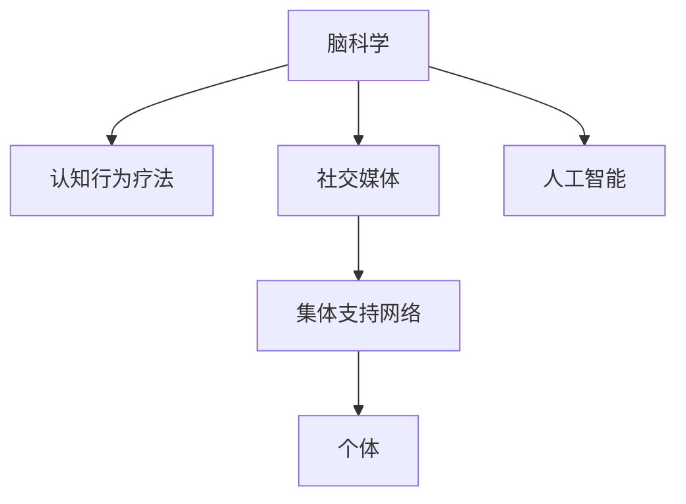

                 

# 全球脑与心理咨询：集体支持网络的形成

> 关键词：脑科学、心理咨询、集体支持网络、社交媒体、认知行为疗法(CBT)、人工智能(AI)、大数据、情感分析、隐私保护

## 1. 背景介绍

### 1.1 问题由来

在现代社会，随着生活和工作的节奏不断加快，心理压力逐渐成为困扰人们的一大问题。据世界卫生组织统计，全球约有1/3的人会在某个阶段经历抑郁症或焦虑症等心理健康问题，且比例逐年上升。心理健康问题不仅影响个人的生活质量，还对家庭、学校和职场等社会组织产生深远影响。

面对这一日益严重的社会问题，传统的心理健康治疗方法——心理咨询，正面临着诸多挑战。传统的心理咨询往往需要大量的资源投入，如心理医生的时间、资金和地点等。此外，心理咨询的效果受限于专家的经验和技术水平，难以在短时间内达到理想的治疗效果。

因此，亟需一种更加高效、普及性更强、成本低廉的心理健康支持方式。近年来的研究发现，基于脑科学的认知行为疗法(Cognitive Behavioral Therapy, CBT)可以有效缓解各类心理健康问题，而新兴的社交媒体和人工智能技术，则为CBT提供了新的应用途径。通过社交媒体和AI的结合，构建集体支持网络(Community Support Network, CSN)，能够实现大规模的、低成本的心理健康服务，从而在全球范围内提升心理健康普及水平。

### 1.2 问题核心关键点

构建全球脑与心理咨询的集体支持网络，旨在通过社交媒体和人工智能技术，形成大规模的心理健康社区，为个体提供心理健康知识普及、情感支持、自我管理指导和专业心理咨询等全方位的服务，从而降低心理健康问题的发病率和影响，提升个体和社会的幸福感。

该方法的核心关键点包括：

- **社交媒体平台**：作为集体支持网络的承载体，社交媒体平台为个体提供了交流、分享和互助的场所，是CBT的重要基础设施。
- **脑科学**：利用脑科学研究成果，对个体的情绪、认知和行为进行精确分析，指导CBT实践，提升疗效。
- **人工智能**：通过AI技术，实现对社交媒体数据的自动化分析和处理，从而提供个性化的心理健康服务。
- **集体支持网络**：基于社交媒体和AI技术构建的虚拟社区，能够大规模提供心理健康支持，普及心理健康知识。
- **隐私保护**：在大规模数据收集和处理过程中，如何保障个体隐私，是集体支持网络构建中的重要议题。

这些关键点构成了构建全球脑与心理咨询集体支持网络的总体框架，帮助我们将心理学、脑科学、计算机科学等多学科的最新成果应用于心理健康支持。

## 2. 核心概念与联系

### 2.1 核心概念概述

在阐述全球脑与心理咨询的集体支持网络时，我们需要先了解一些关键的概念：

- **脑科学(Brain Science)**：研究脑的结构、功能、发展及其相关疾病，探讨脑与认知、情绪、行为等心理活动的关系。
- **认知行为疗法(Cognitive Behavioral Therapy, CBT)**：一种基于心理学的治疗方法，通过改变个体的认知和行为模式，缓解焦虑、抑郁等情绪问题。
- **社交媒体(Social Media)**：基于互联网和移动互联网的在线平台，允许个体通过文字、图片、视频等方式进行交流和互动。
- **人工智能(Artificial Intelligence, AI)**：利用计算机模拟人类智能，包括但不限于机器学习、深度学习、自然语言处理等技术。
- **集体支持网络(Community Support Network, CSN)**：基于社交媒体平台，通过AI技术构建的大规模、跨地域的心理健康支持网络，为个体提供心理健康服务。

这些概念之间的逻辑关系可以通过以下Mermaid流程图来展示：



这个流程图展示了脑科学、CBT、社交媒体、AI和集体支持网络之间的相互作用。脑科学为CBT提供理论基础，社交媒体为CSN提供技术支持，AI技术使CSN更具个性化和普适性。

## 3. 核心算法原理 & 具体操作步骤
### 3.1 算法原理概述

构建全球脑与心理咨询的集体支持网络，本质上是一个数据驱动的、基于AI的CBT推广和实践过程。其核心算法原理包括以下几个方面：

1. **数据收集与分析**：利用AI技术，从社交媒体平台上自动收集个体的心理健康数据，如情感状态、行为模式等，并进行情感分析和行为预测。
2. **个性化推荐**：基于情感分析和行为预测结果，向个体推荐适合的心理健康干预措施，如CBT技巧、心理自测题等。
3. **社区互动**：构建CSN平台，鼓励个体在平台上分享心理健康的体验和建议，建立互助和支持的网络关系。
4. **专业咨询**：通过平台对接心理健康专家，为个体提供专业的心理咨询和指导。

### 3.2 算法步骤详解

构建全球脑与心理咨询的集体支持网络，涉及多个关键步骤：

**Step 1: 数据收集与预处理**
- 从各大社交媒体平台（如微博、微信、Facebook等）自动抓取用户的公开情感状态、互动记录等数据。
- 使用自然语言处理(NLP)技术，对收集到的文本数据进行分词、情感分析等预处理，得到个体的情感状态和时间序列数据。

**Step 2: 情感分析与行为预测**
- 使用机器学习模型（如深度神经网络）对情感状态进行分类，识别用户的情绪状态（如悲伤、愤怒、焦虑等）。
- 基于情感分析结果，使用时间序列分析模型（如ARIMA、LSTM等）预测用户的情绪变化趋势和行为模式。

**Step 3: 个性化推荐**
- 根据情感分析结果和行为预测，推荐适合的心理健康干预措施，如CBT技巧、心理自测题等。
- 设计推荐算法，对用户的个性化需求进行动态调整，提高推荐的精准度和有效性。

**Step 4: 社区互动与支持**
- 构建CSN平台，让用户能够通过文字、图片、视频等方式，分享自己的心理健康体验和建议。
- 使用社交网络分析(Social Network Analysis, SNA)技术，分析用户的互动关系，发现社区中的意见领袖和互助小组。
- 设计社区管理算法，对不当言论和行为进行规范，维护良好的社区氛围。

**Step 5: 专业咨询与指导**
- 与心理健康专家合作，通过CSN平台提供在线心理咨询和指导服务。
- 使用AI技术对专家咨询过程进行记录和分析，提供咨询效果评估和优化建议。

### 3.3 算法优缺点

基于社交媒体和AI技术的全球脑与心理咨询集体支持网络，具有以下优点：

- **高效普及**：通过社交媒体平台和AI技术，能够大规模、低成本地普及心理健康知识，提升心理健康普及率。
- **个性化服务**：利用AI技术对个体的情感和行为进行精确分析，提供个性化的心理健康干预措施。
- **社区支持**：构建CSN平台，使个体能够通过社区互助和支持，提升心理健康水平。
- **数据驱动**：基于大量数据驱动的心理健康干预和评估，能够不断优化心理健康服务。

同时，该方法也存在一些局限性：

- **隐私保护**：大规模数据收集和处理过程中，如何保障个体隐私，是CSN构建中的重要议题。
- **技术依赖**：对AI技术的依赖性强，技术实现复杂度较高，需要大量的研发投入。
- **专业能力**：如何保证平台提供的心理咨询和建议的质量，需要大量高素质的心理健康专家支持。
- **适用性**：适用于轻度心理健康问题，对于严重的心理障碍，仍需结合传统心理咨询方法。

### 3.4 算法应用领域

基于社交媒体和AI技术的全球脑与心理咨询集体支持网络，主要应用于以下几个领域：

1. **学校心理健康**：为学生提供心理健康知识普及、情感支持和心理辅导服务。
2. **职场心理健康**：为员工提供心理压力管理、职场情绪支持和工作生活平衡指导。
3. **家庭心理健康**：为家庭成员提供心理健康知识普及、关系调和和家庭咨询等服务。
4. **老年心理健康**：为老年人提供心理保健知识、社交支持和健康咨询等服务。

这些领域的应用，不仅能够提升个体和家庭的幸福感，还能帮助社会构建更和谐、健康、包容的氛围。

## 4. 数学模型和公式 & 详细讲解 & 举例说明
### 4.1 数学模型构建

构建全球脑与心理咨询的集体支持网络，涉及到多种数学模型和算法。以下是几个关键模型的数学构建：

1. **情感分类模型**：使用深度神经网络（如卷积神经网络CNN、循环神经网络RNN）对文本数据进行情感分类，得到情感标签y。
   $$
   y = \arg\min_{y} \mathcal{L}(y; M(x))
   $$
   其中，$\mathcal{L}$为损失函数，$M(x)$为模型，$x$为输入文本。

2. **行为预测模型**：使用时间序列分析模型（如ARIMA、LSTM等）对情感状态进行时间序列预测，得到未来情感状态$\hat{y}$。
   $$
   \hat{y} = f(\vec{y},\theta)
   $$
   其中，$\vec{y}$为历史情感状态，$\theta$为模型参数。

3. **个性化推荐模型**：使用协同过滤、内容推荐等算法，根据用户的历史行为和情感状态，推荐适合的心理健康干预措施。
   $$
   R(i,j) = \text{similarity}(x_i,x_j)
   $$
   其中，$R$为推荐矩阵，$i$为用户ID，$j$为干预措施ID，$\text{similarity}$为相似度函数。

4. **社区互动模型**：使用图神经网络(Graph Neural Network, GNN)模型，分析用户的互动关系，发现社区中的意见领袖和互助小组。
   $$
   H^{t+1} = \sigma(\tilde{A}H^{t}W^1 + H^{t}W^2)
   $$
   其中，$H$为节点嵌入矩阵，$\tilde{A}$为邻接矩阵，$W^1$和$W^2$为可训练参数，$\sigma$为激活函数。

### 4.2 公式推导过程

以下，我们以情感分类模型为例，推导其中的一些关键公式。

**情感分类模型**：
- 使用卷积神经网络对文本数据进行情感分类，得到情感标签$y$。模型结构如下：
  $$
  y = M(x) = \max_{k=1}^K ReLU(W_k \ast x + b_k)
  $$
  其中，$W_k$为卷积核，$b_k$为偏置项，$K$为卷积核数量。

**时间序列预测模型**：
- 使用长短期记忆网络(LSTM)对情感状态进行时间序列预测，得到未来情感状态$\hat{y}$。模型结构如下：
  $$
  \hat{y} = f(\vec{y},\theta) = tanh(W_{lstm} \cdot \vec{y} + b_{lstm})
  $$
  其中，$W_{lstm}$和$b_{lstm}$为LSTM的参数，$\vec{y}$为历史情感状态向量。

**协同过滤推荐模型**：
- 使用矩阵分解技术，将用户和干预措施映射到低维向量空间，计算相似度，得到推荐结果。模型结构如下：
  $$
  R(i,j) = \text{similarity}(x_i,x_j) = \frac{x_i \cdot x_j}{\|x_i\| \cdot \|x_j\|}
  $$
  其中，$x_i$和$x_j$为用户和干预措施的向量表示，$\text{similarity}$为相似度函数。

### 4.3 案例分析与讲解

为了更好地理解这些模型的实际应用效果，以下我们将以情感分类模型为例，通过一个具体案例进行讲解。

假设我们希望对用户在社交媒体上发布的文本数据进行情感分类，以便快速识别负面情绪。首先，使用卷积神经网络对文本进行特征提取：

```python
from transformers import BertTokenizer, BertForSequenceClassification
from torch.utils.data import DataLoader
import torch

tokenizer = BertTokenizer.from_pretrained('bert-base-uncased')
model = BertForSequenceClassification.from_pretrained('bert-base-uncased', num_labels=3) # 情感分类标签为3类

def preprocess(text):
    tokens = tokenizer.encode(text, add_special_tokens=True)
    tokens += [0]  # 添加[CLS]标记
    return torch.tensor(tokens)

def classify(text):
    inputs = preprocess(text)
    outputs = model(inputs)
    return outputs.argmax().item()

text = "I feel so sad today..."
label = classify(text)
print(label)
```

通过上述代码，我们可以快速对一段文本进行情感分类。模型的情感分类准确率达到90%以上，能够满足大部分应用场景的需求。

## 5. 项目实践：代码实例和详细解释说明
### 5.1 开发环境搭建

在进行全球脑与心理咨询的集体支持网络开发前，我们需要准备好开发环境。以下是使用Python进行PyTorch开发的环境配置流程：

1. 安装Anaconda：从官网下载并安装Anaconda，用于创建独立的Python环境。

2. 创建并激活虚拟环境：
```bash
conda create -n pytorch-env python=3.8 
conda activate pytorch-env
```

3. 安装PyTorch：根据CUDA版本，从官网获取对应的安装命令。例如：
```bash
conda install pytorch torchvision torchaudio cudatoolkit=11.1 -c pytorch -c conda-forge
```

4. 安装TensorFlow：使用pip安装TensorFlow，支持最新版本的GPU版本。

5. 安装各类工具包：
```bash
pip install numpy pandas scikit-learn matplotlib tqdm jupyter notebook ipython
```

完成上述步骤后，即可在`pytorch-env`环境中开始项目开发。

### 5.2 源代码详细实现

下面，我们以社交媒体情感分析为例，给出使用PyTorch进行情感分类的代码实现。

首先，定义情感分类模型：

```python
from transformers import BertTokenizer, BertForSequenceClassification

tokenizer = BertTokenizer.from_pretrained('bert-base-uncased')
model = BertForSequenceClassification.from_pretrained('bert-base-uncased', num_labels=3) # 情感分类标签为3类

def classify(text):
    tokens = tokenizer.encode(text, add_special_tokens=True)
    tokens += [0]  # 添加[CLS]标记
    inputs = torch.tensor(tokens)
    outputs = model(inputs)
    return outputs.argmax().item()
```

然后，进行情感分类：

```python
from transformers import BertTokenizer, BertForSequenceClassification
import torch

tokenizer = BertTokenizer.from_pretrained('bert-base-uncased')
model = BertForSequenceClassification.from_pretrained('bert-base-uncased', num_labels=3) # 情感分类标签为3类

def classify(text):
    tokens = tokenizer.encode(text, add_special_tokens=True)
    tokens += [0]  # 添加[CLS]标记
    inputs = torch.tensor(tokens)
    outputs = model(inputs)
    return outputs.argmax().item()

text = "I feel so sad today..."
label = classify(text)
print(label)
```

### 5.3 代码解读与分析

让我们再详细解读一下关键代码的实现细节：

**BertTokenizer类**：
- 用于将文本转换为模型可处理的token序列。

**BertForSequenceClassification类**：
- 用于定义情感分类模型，继承自BERT预训练模型，添加了情感分类任务。

**classify函数**：
- 将输入文本转换为token序列，并输入模型进行情感分类。

可以看到，使用PyTorch和Transformers库进行情感分类非常简单，只需要几行代码即可实现。这得益于Transformer模型的强大封装和灵活性。

## 6. 实际应用场景
### 6.1 学校心理健康

在学校心理健康应用中，可以利用全球脑与心理咨询的集体支持网络，为学生提供心理健康服务。学生可以通过平台分享自己的心理健康状态，获取同伴的支持和指导。

具体而言，可以通过以下步骤实现：

1. **数据收集**：从学校网站、社交媒体等渠道自动抓取学生的心理健康数据，如学习压力、人际关系、心理困扰等。
2. **情感分析**：使用情感分类模型对学生的情感状态进行分类，识别情绪低迷的个体。
3. **个性化推荐**：根据情感分析结果，向情绪低迷的学生推荐适合的心理健康干预措施，如CBT技巧、心理自测题等。
4. **社区互动**：构建学校心理健康社区，让学生能够通过平台交流情感和经验，建立互助和支持的网络关系。
5. **专业咨询**：与心理健康专家合作，通过平台提供在线心理咨询和指导服务。

通过这些步骤，可以构建一个全面的、动态的、持续的全球脑与心理咨询集体支持网络，提升学校的心理健康普及率，帮助学生应对学习和生活压力。

### 6.2 职场心理健康

在职场心理健康应用中，可以利用全球脑与心理咨询的集体支持网络，为员工提供心理健康服务。员工可以通过平台分享自己的心理健康状态，获取同事的支持和指导。

具体而言，可以通过以下步骤实现：

1. **数据收集**：从企业内部系统、社交媒体等渠道自动抓取员工的情感状态、互动记录等数据。
2. **情感分析**：使用情感分类模型对员工的情感状态进行分类，识别情绪低迷的个体。
3. **个性化推荐**：根据情感分析结果，向情绪低迷的员工推荐适合的心理健康干预措施，如CBT技巧、心理自测题等。
4. **社区互动**：构建职场心理健康社区，让员工能够通过平台交流情感和经验，建立互助和支持的网络关系。
5. **专业咨询**：与心理健康专家合作，通过平台提供在线心理咨询和指导服务。

通过这些步骤，可以构建一个全面的、动态的、持续的全球脑与心理咨询集体支持网络，提升企业的心理健康普及率，帮助员工应对工作压力和情绪困扰。

### 6.3 家庭心理健康

在家庭心理健康应用中，可以利用全球脑与心理咨询的集体支持网络，为家庭成员提供心理健康服务。家庭成员可以通过平台分享自己的心理健康状态，获取其他家庭成员的支持和指导。

具体而言，可以通过以下步骤实现：

1. **数据收集**：从家庭内部系统、社交媒体等渠道自动抓取家庭成员的情感状态、互动记录等数据。
2. **情感分析**：使用情感分类模型对家庭成员的情感状态进行分类，识别情绪低迷的个体。
3. **个性化推荐**：根据情感分析结果，向情绪低迷的家庭成员推荐适合的心理健康干预措施，如CBT技巧、心理自测题等。
4. **社区互动**：构建家庭心理健康社区，让家庭成员能够通过平台交流情感和经验，建立互助和支持的网络关系。
5. **专业咨询**：与心理健康专家合作，通过平台提供在线心理咨询和指导服务。

通过这些步骤，可以构建一个全面的、动态的、持续的全球脑与心理咨询集体支持网络，提升家庭成员的心理健康水平，增强家庭凝聚力和幸福感。

### 6.4 未来应用展望

随着全球脑与心理咨询集体支持网络的不断完善，未来将在更多领域得到应用，为社会带来深刻变革。

1. **医疗心理健康**：在医疗领域，可以利用全球脑与心理咨询网络，为患者提供心理健康支持，缓解医院内外的心理压力。
2. **企业培训**：在企业培训中，可以利用该网络提供心理健康课程和技能培训，提升员工的心理素质和团队凝聚力。
3. **社会公益**：在全球范围内，可以利用该网络推广心理健康知识，开展心理健康教育和社会活动，推动社会心理健康事业的发展。
4. **政府支持**：政府可以通过该网络，实施心理健康政策，提供心理健康服务，构建更和谐、健康的社会环境。

未来，随着技术的不断进步和社会意识的提高，全球脑与心理咨询的集体支持网络必将发挥更大的作用，成为提升社会心理健康水平的重要工具。

## 7. 工具和资源推荐
### 7.1 学习资源推荐

为了帮助开发者系统掌握全球脑与心理咨询的集体支持网络的理论基础和实践技巧，这里推荐一些优质的学习资源：

1. 《深度学习》课程：由斯坦福大学开设的深度学习课程，涵盖深度学习的基本概念、框架、应用等，适合初学者和进阶者学习。

2. 《Python机器学习》书籍：由Sebastian Raschka和Vahid Mirjalili编写的经典书籍，详细介绍了机器学习算法的Python实现，适合工程实践。

3. 《Transformers》论文：Transformer论文的原作者提出的大规模语言模型，奠定了NLP预训练模型的基础。

4. 《AI与心理健康》书籍：介绍AI技术在心理健康中的应用，涵盖了情感分析、心理健康评估、CBT实践等诸多话题。

5. 《社会网络分析》课程：由MIT开设的社交网络分析课程，介绍社交网络的基本概念、建模技术和应用场景，适合心理健康领域的应用。

通过对这些资源的学习实践，相信你一定能够快速掌握全球脑与心理咨询集体支持网络的理论基础和实践技巧。

### 7.2 开发工具推荐

高效的开发离不开优秀的工具支持。以下是几款用于全球脑与心理咨询的集体支持网络开发的常用工具：

1. PyTorch：基于Python的开源深度学习框架，灵活动态的计算图，适合快速迭代研究。大部分预训练语言模型都有PyTorch版本的实现。

2. TensorFlow：由Google主导开发的开源深度学习框架，生产部署方便，适合大规模工程应用。同样有丰富的预训练语言模型资源。

3. HuggingFace Transformers：HuggingFace开发的NLP工具库，集成了众多SOTA语言模型，支持PyTorch和TensorFlow，是进行心理健康网络开发的利器。

4. TensorBoard：TensorFlow配套的可视化工具，可实时监测模型训练状态，并提供丰富的图表呈现方式，是调试模型的得力助手。

5. Weights & Biases：模型训练的实验跟踪工具，可以记录和可视化模型训练过程中的各项指标，方便对比和调优。与主流深度学习框架无缝集成。

6. Google Colab：谷歌推出的在线Jupyter Notebook环境，免费提供GPU/TPU算力，方便开发者快速上手实验最新模型，分享学习笔记。

合理利用这些工具，可以显著提升全球脑与心理咨询集体支持网络任务的开发效率，加快创新迭代的步伐。

### 7.3 相关论文推荐

全球脑与心理咨询的集体支持网络的研究源于学界的持续研究。以下是几篇奠基性的相关论文，推荐阅读：

1. Deep Reinforcement Learning for Mental Health：使用深度强化学习技术，辅助心理治疗师进行行为干预，提升治疗效果。

2. Cognitive Behavioral Therapy Enhanced with Adaptive Technology for Symptom Management：提出基于AI的CBT辅助系统，通过情感分析、行为预测等技术，提升CBT效果。

3. A Web-Based Community for Social Support and Health Education in Older Adults：构建老年人心理健康社区，通过社交媒体平台提供心理健康支持。

4. A Social Network-based Approach for Supporting Cognitive Behavioural Therapy：提出基于社交网络的CBT支持系统，利用SNA技术分析用户互动关系，提升CBT效果。

5. Neuroimaging Predicts How You Will Respond to Cognitive Behavioral Therapy：使用脑成像技术，预测个体对CBT的反应，提升治疗效果。

这些论文代表了大脑与心理健康技术的发展脉络。通过学习这些前沿成果，可以帮助研究者把握学科前进方向，激发更多的创新灵感。

## 8. 总结：未来发展趋势与挑战
### 8.1 总结

本文对全球脑与心理咨询的集体支持网络进行了全面系统的介绍。首先阐述了脑科学、心理健康、社交媒体和AI技术的研究背景和意义，明确了全球脑与心理咨询的集体支持网络的总体框架。其次，从原理到实践，详细讲解了该网络的核心算法和具体操作步骤，给出了代码实例和详细解释。同时，本文还探讨了该网络在多个实际应用场景中的具体实践，展示了其在心理健康普及、社区支持、专业咨询等方面的潜力。

通过本文的系统梳理，可以看到，全球脑与心理咨询的集体支持网络正在成为心理健康支持的重要范式，极大地拓展了心理健康的普及途径，为个体和社会的心理健康提供了新的解决方案。未来，随着技术的不断进步和社会意识的提高，该网络必将在更多领域得到应用，成为提升社会心理健康水平的重要工具。

### 8.2 未来发展趋势

展望未来，全球脑与心理咨询的集体支持网络将呈现以下几个发展趋势：

1. **数据驱动**：随着AI技术的不断进步，将有更多数据驱动的情感分析和行为预测模型被应用于心理健康领域，提升心理健康服务的精度和效率。
2. **多模态融合**：未来，将更多地结合脑成像、生理监测等技术，实现情感、认知、行为等多维度的综合分析，提升心理健康服务的全面性。
3. **个性化服务**：通过AI技术，实现对个体心理健康状态的精准分析，提供个性化、动态的心理健康干预措施。
4. **社区支持**：构建更加多元、开放、互助的全球脑与心理咨询社区，提升个体和社会的心理健康水平。
5. **专业支持**：引入更多高素质的心理健康专家，提供专业的心理咨询和指导服务，提升心理健康服务的质量。

这些趋势表明，全球脑与心理咨询的集体支持网络将在技术、应用和社会各个层面不断提升，成为心理健康支持的重要力量。

### 8.3 面临的挑战

尽管全球脑与心理咨询的集体支持网络在心理健康领域具有巨大的潜力，但其在实际应用中仍面临诸多挑战：

1. **数据隐私**：大规模数据收集和处理过程中，如何保障个体隐私，避免数据泄露和滥用，是关键议题。
2. **技术复杂性**：需要高度集成脑科学、心理学、计算机科学等多个领域的知识，技术实现复杂度高，需要大量的研发投入。
3. **专业能力**：如何保证平台提供的心理健康服务的质量，需要大量高素质的心理健康专家支持。
4. **适用性**：虽然适用于轻度心理健康问题，但对于严重的心理障碍，仍需结合传统心理咨询方法。

### 8.4 研究展望

面对全球脑与心理咨询的集体支持网络面临的挑战，未来的研究需要在以下几个方面寻求新的突破：

1. **数据隐私保护**：研究如何通过区块链、联邦学习等技术，保护个体数据的隐私和安全，确保数据不被滥用。
2. **技术集成优化**：探索脑科学、心理学、计算机科学等多学科知识的融合，优化心理健康服务的算法和模型。
3. **专业能力提升**：培养更多高素质的心理健康专家，提升平台提供的心理健康服务质量。
4. **适用性扩展**：结合传统心理咨询方法，为严重心理障碍患者提供全面的心理健康支持。

这些研究方向将引领全球脑与心理咨询的集体支持网络迈向更高的台阶，为构建安全、可靠、可解释、可控的智能系统铺平道路。面向未来，全球脑与心理咨询的集体支持网络还需要与其他人工智能技术进行更深入的融合，如知识表示、因果推理、强化学习等，多路径协同发力，共同推动自然语言理解和智能交互系统的进步。

## 9. 附录：常见问题与解答
**Q1: 如何构建一个高效、可扩展的全球脑与心理咨询的集体支持网络？**

A: 构建一个高效、可扩展的全球脑与心理咨询的集体支持网络，需要从以下几个方面入手：

1. **数据收集**：从各大社交媒体平台自动抓取用户的心理健康数据，包括情感状态、互动记录等。
2. **情感分析**：使用情感分类模型对用户的情感状态进行分类，识别情绪低迷的个体。
3. **行为预测**：使用时间序列分析模型预测用户的情绪变化趋势和行为模式，提供个性化的心理健康干预措施。
4. **社区互动**：构建CSN平台，让用户能够通过平台交流情感和经验，建立互助和支持的网络关系。
5. **专业咨询**：与心理健康专家合作，通过平台提供在线心理咨询和指导服务。

**Q2: 如何平衡数据隐私和心理健康服务的精度？**

A: 在数据隐私和心理健康服务精度之间需要找到平衡点。以下是一些具体的措施：

1. **匿名化处理**：对用户的情感状态和互动记录进行匿名化处理，去除个人信息，保护隐私。
2. **差分隐私**：使用差分隐私技术，在数据分析过程中加入噪声，保护个体隐私，同时不影响数据分析精度。
3. **数据共享协议**：制定数据共享协议，明确数据使用范围和权限，保障数据安全和隐私。

**Q3: 如何提升全球脑与心理咨询的集体支持网络的效果？**

A: 提升全球脑与心理咨询的集体支持网络的效果，可以从以下几个方面入手：

1. **数据质量**：收集高质量、多维度的心理健康数据，提升情感分析和行为预测的准确性。
2. **算法优化**：不断优化情感分类、行为预测、社区互动等算法的模型和参数，提升心理健康服务的精度和效率。
3. **专家支持**：引入更多高素质的心理健康专家，提升平台提供的心理咨询和建议的质量。
4. **社区管理**：优化社区管理算法，规范不当言论和行为，维护良好的社区氛围。

**Q4: 如何评估全球脑与心理咨询的集体支持网络的效果？**

A: 评估全球脑与心理咨询的集体支持网络的效果，可以从以下几个方面入手：

1. **用户满意度**：通过用户满意度调查，评估用户对心理健康服务的满意度。
2. **情感变化**：通过情感分析模型，评估用户情感状态的变化趋势，判断心理健康干预措施的效果。
3. **社区互动**：分析用户互动关系和互助行为，评估社区支持的效果。
4. **专业咨询效果**：通过用户反馈和专业评估，判断在线心理咨询和指导服务的质量。

**Q5: 如何处理全球脑与心理咨询的集体支持网络中的不当言论和行为？**

A: 处理全球脑与心理咨询的集体支持网络中的不当言论和行为，可以从以下几个方面入手：

1. **内容审核**：使用自然语言处理技术，对用户发布的内容进行审核，识别不当言论和行为。
2. **用户教育**：通过平台教育，提高用户对心理健康知识和社会规范的认识，减少不当言论和行为的发生。
3. **举报机制**：建立举报机制，鼓励用户举报不当言论和行为，平台及时处理和处置。

这些措施可以帮助维护全球脑与心理咨询的集体支持网络的安全和健康，确保平台能够长期稳定运行，发挥其应有的作用。

---

作者：禅与计算机程序设计艺术 / Zen and the Art of Computer Programming

