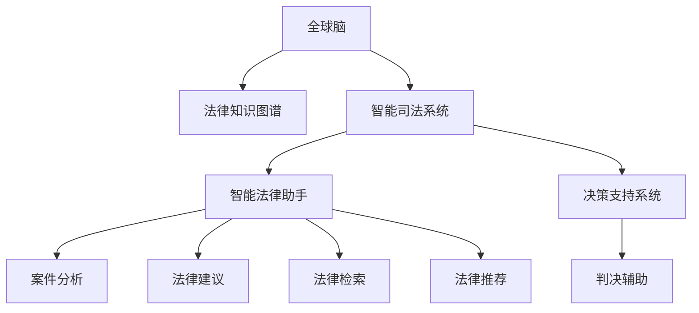

                 

# 全球脑与智能司法:人工智能辅助的法律服务

> 关键词：全球脑,智能司法,人工智能,法律服务,智能法律助手,决策支持系统,法律知识图谱,法律自然语言处理

## 1. 背景介绍

### 1.1 问题由来
随着人工智能技术的不断进步，全球脑和智能司法系统在法律领域的应用已成为热点话题。司法系统作为国家治理和社会稳定的重要组成部分，亟需通过先进的技术手段提升其效率和准确性。利用人工智能（AI）技术，可以大幅提升法律服务的智能化水平，推动司法公正和透明。

近年来，全球脑（Global Brain）的概念逐渐兴起，即构建一个由多节点组成的庞大网络，通过节点间的协同计算，实现对复杂系统的高效分析和管理。在司法领域，全球脑通过融合法律知识、大数据分析、自然语言处理（NLP）等技术，构建智能法律助手和决策支持系统，为法官、律师、检察官等法律从业者提供高效的辅助决策工具。

### 1.2 问题核心关键点
构建智能司法系统面临的核心挑战包括：
1. **法律知识图谱**：法律领域涉及大量的法律条款、案例和司法解释，需要构建一个全面的法律知识图谱以支持AI系统的理解和推理。
2. **自然语言处理**：法律文本通常包含高度复杂和抽象的表达方式，如何有效处理和理解法律文本是实现智能司法的关键。
3. **智能法律助手**：通过开发智能法律助手，辅助法律从业者进行案件分析、事实检索、法律建议等任务。
4. **决策支持系统**：构建基于法律知识图谱的决策支持系统，为法官提供参考，辅助其做出更准确、公正的判决。
5. **隐私与安全**：在智能司法系统中，如何保护案件信息、律师委托人的隐私，同时确保系统的安全性，是一个重要的技术挑战。

### 1.3 问题研究意义
研究全球脑与智能司法系统，对于提升司法系统的智能化水平，保障司法公正，提高司法效率，具有重要意义：

1. **提高司法效率**：智能司法系统能够自动化处理大量文书，辅助律师和法官快速找到相关法律依据，提高案件处理速度。
2. **提升司法公正**：利用知识图谱和大数据分析，智能司法系统能更全面、准确地理解法律条文和案例，辅助法官做出更公正的判决。
3. **促进法律创新**：智能司法系统的开发和应用，将推动法律领域的创新，如在线争议解决、电子证据验证等新兴法律服务形式。
4. **保障司法透明度**：智能司法系统能够记录和分析案件处理过程，提升司法透明度和公众信任度。
5. **应对法律需求**：随着法律体系的不断变化，智能司法系统能够持续学习和适应用户需求，提供及时的法律支持。

## 2. 核心概念与联系

### 2.1 核心概念概述

为更好地理解全球脑与智能司法系统的构建原理和应用，本节将介绍几个关键概念：

- **全球脑**：一个由多个计算节点组成的网络，通过协同计算实现对复杂系统的管理与分析。
- **智能司法系统**：利用AI技术，构建的法律服务系统，提供案件分析、法律检索、法律建议、判决辅助等服务。
- **法律知识图谱**：以图谱形式表示的法律知识体系，包括法律条款、案例、司法解释等，为AI系统提供知识基础。
- **自然语言处理**：涉及文本分析、语义理解、情感分析等技术，用于处理和理解法律文本。
- **智能法律助手**：通过AI技术构建的法律服务助手，提供法律咨询、案件分析、法律推荐等功能。
- **决策支持系统**：基于法律知识图谱和AI技术，辅助法官做出公正、准确的判决。

这些概念之间的逻辑关系可以通过以下Mermaid流程图来展示：



这个流程图展示了大脑脑与智能司法系统的核心概念及其相互关系：

1. **全球脑**通过构建法律知识图谱，支持智能司法系统的构建。
2. **智能司法系统**包括智能法律助手和决策支持系统，提供多方面的法律服务。
3. **智能法律助手**提供案件分析、法律建议等功能，辅助法律从业者。
4. **决策支持系统**基于法律知识图谱，为法官提供决策支持。

## 3. 核心算法原理 & 具体操作步骤
### 3.1 算法原理概述

全球脑与智能司法系统的核心算法原理主要基于知识图谱构建和自然语言处理。通过构建法律知识图谱，将法律知识以结构化的形式表示，为AI系统提供知识基础。利用自然语言处理技术，处理和理解法律文本，提取法律实体、关系和规则，辅助法律决策。

**知识图谱构建**：构建法律知识图谱通常分为以下几个步骤：
1. **数据收集**：从法律数据库、案例库、法规库等获取法律文本和案例数据。
2. **文本清洗与预处理**：清洗文本中的噪声，如停用词、标点等，并进行分词、词性标注等预处理。
3. **实体识别与关系抽取**：利用命名实体识别（NER）和关系抽取（Relation Extraction, RE）技术，从法律文本中识别出法律实体（如案件名称、当事人等）和实体间的关系（如原告与被告关系）。
4. **知识整合与图谱构建**：将识别出的实体和关系整合到知识图谱中，形成法律知识体系。

**自然语言处理**：利用自然语言处理技术，理解法律文本的语义和结构。具体步骤包括：
1. **分词与词性标注**：将法律文本分割成词汇，并进行词性标注，如名词、动词等。
2. **命名实体识别**：识别出文本中的法律实体，如人名、地名、法律条款等。
3. **句法分析**：分析法律文本的句法结构，提取句子成分。
4. **语义理解**：通过词向量表示、句法分析和上下文信息，理解法律文本的语义。

### 3.2 算法步骤详解

**步骤1：数据收集与预处理**
- 收集法律文本和案例数据，包括法律法规、判决书、案例等。
- 对文本进行清洗，去除噪声和无用信息。
- 进行分词和词性标注，识别出法律实体。

**步骤2：实体识别与关系抽取**
- 使用命名实体识别技术，识别文本中的法律实体。
- 使用关系抽取技术，抽取实体间的关系，如主诉与反诉关系。

**步骤3：知识整合与图谱构建**
- 将识别出的实体和关系整合到知识图谱中，形成结构化的法律知识体系。

**步骤4：自然语言处理**
- 使用分词、词性标注、命名实体识别和句法分析技术，处理法律文本。
- 利用语义理解技术，理解法律文本的语义和结构。

**步骤5：知识图谱查询**
- 将待处理的法律问题输入智能法律助手，查询知识图谱中的相关法律条款、案例和司法解释。

**步骤6：决策支持系统**
- 将查询结果输入决策支持系统，结合法官的经验和专业知识，辅助法官做出公正的判决。

### 3.3 算法优缺点

全球脑与智能司法系统的优点包括：
1. **知识整合**：通过构建法律知识图谱，整合大量法律知识和案例，提升系统的知识库。
2. **语义理解**：利用自然语言处理技术，能够理解和处理复杂的法律文本，辅助法律决策。
3. **高效查询**：知识图谱的构建和查询过程高效，能够快速提供法律信息。
4. **辅助决策**：决策支持系统结合法官的经验和专业知识，辅助法官做出更准确、公正的判决。

缺点主要包括：
1. **知识更新**：法律体系不断变化，需要定期更新法律知识图谱和系统算法，以保证系统的时效性。
2. **隐私保护**：在处理法律信息时，如何保护案件信息、律师委托人的隐私，是一个重要的技术挑战。
3. **复杂性高**：系统涉及的知识图谱构建、自然语言处理、法律推理等技术，复杂度较高，开发和维护难度大。

### 3.4 算法应用领域

全球脑与智能司法系统已在多个领域得到应用，包括：

1. **案件分析**：利用智能法律助手，对案件进行初步分析，提取关键信息。
2. **法律建议**：提供法律建议，如诉讼策略、证据收集等，辅助律师和当事人。
3. **法律检索**：快速检索相关法律条文、案例和司法解释，辅助法官和律师。
4. **判决辅助**：构建决策支持系统，辅助法官做出公正、准确的判决。
5. **在线争议解决**：提供在线争议解决平台，为当事人提供在线咨询和调解服务。
6. **电子证据验证**：利用AI技术，验证电子证据的真实性和有效性。

此外，全球脑与智能司法系统还在智慧法庭、司法数据分析、法律知识管理等多个领域得到应用，为司法系统带来了变革性影响。

## 4. 数学模型和公式 & 详细讲解  
### 4.1 数学模型构建

本节将使用数学语言对全球脑与智能司法系统的构建过程进行更加严格的刻画。

假设法律知识图谱中的法律实体为 $E$，法律关系为 $R$，法律事实为 $F$，则知识图谱可以表示为一个三元组集合 $\mathcal{G}=\{(e,r,f)\}$，其中 $e \in E$，$r \in R$，$f \in F$。每个法律实体 $e$ 有若干个事实 $f$，每个法律关系 $r$ 连接两个法律实体。

**法律知识图谱的构建**：
1. **实体识别**：从法律文本中识别出实体 $e$。
2. **关系抽取**：从法律文本中抽取实体间的关系 $r$。
3. **事实提取**：从法律文本中提取实体的事实 $f$。

**法律知识图谱的查询**：
设查询问题为 $q$，根据查询问题和知识图谱进行匹配，找到与查询问题相关的法律实体和关系。

### 4.2 公式推导过程

以下我们以二元关系查询为例，推导法律知识图谱查询的数学公式。

假设查询问题为 $q$，知识图谱中的实体和关系满足如下条件：
- 每个实体 $e$ 有 $n_e$ 个事实 $f$。
- 每个关系 $r$ 连接两个实体 $e_1$ 和 $e_2$。

查询问题 $q$ 表示为 $(q,e_1,e_2)$，其中 $e_1$ 和 $e_2$ 为查询的实体。查询目标是从知识图谱中找出满足 $(q,e_1,e_2)$ 的关系 $r$。

利用图谱的邻接矩阵 $\mathcal{A}$ 表示关系 $r$，其中 $\mathcal{A}(e_1,e_2) = 1$ 表示 $e_1$ 和 $e_2$ 之间存在关系 $r$。查询问题的解为满足 $(q,e_1,e_2)$ 的关系集合 $r(q,e_1,e_2)$。

查询问题的解可以通过图谱的邻接矩阵 $\mathcal{A}$ 进行求解，公式如下：

$$
r(q,e_1,e_2) = \mathcal{A} \times \mathcal{A}^T \times \mathcal{A} \times \ldots \times \mathcal{A}
$$

其中 $\mathcal{A} \times \mathcal{A}^T \times \mathcal{A} \times \ldots \times \mathcal{A}$ 表示邻接矩阵的幂次运算，运算次数取决于查询问题 $q$ 的复杂度。

### 4.3 案例分析与讲解

**案例分析：**

假设查询问题为 $q$，表示为 $(q,e_1,e_2)$，其中 $e_1$ 和 $e_2$ 分别为原告和被告。查询目标是从知识图谱中找出与 $(q,e_1,e_2)$ 相关的法律关系 $r$。

设知识图谱中的邻接矩阵为 $\mathcal{A}$，其中 $\mathcal{A}(e_1,e_2) = 1$ 表示 $e_1$ 和 $e_2$ 之间存在关系 $r$。通过邻接矩阵的幂次运算，可以求解查询问题 $q$ 的解，即满足 $(q,e_1,e_2)$ 的关系集合 $r(q,e_1,e_2)$。

**讲解：**

通过查询问题 $q$ 和知识图谱的邻接矩阵 $\mathcal{A}$，可以求解满足 $(q,e_1,e_2)$ 的关系集合 $r(q,e_1,e_2)$。这种查询方式在法律知识图谱的构建和查询中具有广泛应用，能够快速找到与法律问题相关的法律关系和实体。

## 5. 项目实践：代码实例和详细解释说明
### 5.1 开发环境搭建

在进行项目实践前，我们需要准备好开发环境。以下是使用Python进行PyTorch开发的环境配置流程：

1. 安装Anaconda：从官网下载并安装Anaconda，用于创建独立的Python环境。

2. 创建并激活虚拟环境：
```bash
conda create -n pytorch-env python=3.8 
conda activate pytorch-env
```

3. 安装PyTorch：根据CUDA版本，从官网获取对应的安装命令。例如：
```bash
conda install pytorch torchvision torchaudio cudatoolkit=11.1 -c pytorch -c conda-forge
```

4. 安装各类工具包：
```bash
pip install numpy pandas scikit-learn matplotlib tqdm jupyter notebook ipython
```

完成上述步骤后，即可在`pytorch-env`环境中开始项目实践。

### 5.2 源代码详细实现

下面我们以法律文本的命名实体识别（NER）任务为例，给出使用Transformers库对BERT模型进行法律知识图谱构建的PyTorch代码实现。

首先，定义NER任务的数据处理函数：

```python
from transformers import BertTokenizer
from torch.utils.data import Dataset
import torch

class LegalNERDataset(Dataset):
    def __init__(self, texts, tags, tokenizer, max_len=128):
        self.texts = texts
        self.tags = tags
        self.tokenizer = tokenizer
        self.max_len = max_len
        
    def __len__(self):
        return len(self.texts)
    
    def __getitem__(self, item):
        text = self.texts[item]
        tags = self.tags[item]
        
        encoding = self.tokenizer(text, return_tensors='pt', max_length=self.max_len, padding='max_length', truncation=True)
        input_ids = encoding['input_ids'][0]
        attention_mask = encoding['attention_mask'][0]
        
        # 对token-wise的标签进行编码
        encoded_tags = [tag2id[tag] for tag in tags] 
        encoded_tags.extend([tag2id['O']] * (self.max_len - len(encoded_tags)))
        labels = torch.tensor(encoded_tags, dtype=torch.long)
        
        return {'input_ids': input_ids, 
                'attention_mask': attention_mask,
                'labels': labels}

# 标签与id的映射
tag2id = {'O': 0, 'PER': 1, 'LOC': 2, 'ORG': 3, 'DATE': 4}
id2tag = {v: k for k, v in tag2id.items()}

# 创建dataset
tokenizer = BertTokenizer.from_pretrained('bert-base-cased')

train_dataset = LegalNERDataset(train_texts, train_tags, tokenizer)
dev_dataset = LegalNERDataset(dev_texts, dev_tags, tokenizer)
test_dataset = LegalNERDataset(test_texts, test_tags, tokenizer)
```

然后，定义模型和优化器：

```python
from transformers import BertForTokenClassification, AdamW

model = BertForTokenClassification.from_pretrained('bert-base-cased', num_labels=len(tag2id))

optimizer = AdamW(model.parameters(), lr=2e-5)
```

接着，定义训练和评估函数：

```python
from torch.utils.data import DataLoader
from tqdm import tqdm
from sklearn.metrics import classification_report

device = torch.device('cuda') if torch.cuda.is_available() else torch.device('cpu')
model.to(device)

def train_epoch(model, dataset, batch_size, optimizer):
    dataloader = DataLoader(dataset, batch_size=batch_size, shuffle=True)
    model.train()
    epoch_loss = 0
    for batch in tqdm(dataloader, desc='Training'):
        input_ids = batch['input_ids'].to(device)
        attention_mask = batch['attention_mask'].to(device)
        labels = batch['labels'].to(device)
        model.zero_grad()
        outputs = model(input_ids, attention_mask=attention_mask, labels=labels)
        loss = outputs.loss
        epoch_loss += loss.item()
        loss.backward()
        optimizer.step()
    return epoch_loss / len(dataloader)

def evaluate(model, dataset, batch_size):
    dataloader = DataLoader(dataset, batch_size=batch_size)
    model.eval()
    preds, labels = [], []
    with torch.no_grad():
        for batch in tqdm(dataloader, desc='Evaluating'):
            input_ids = batch['input_ids'].to(device)
            attention_mask = batch['attention_mask'].to(device)
            batch_labels = batch['labels']
            outputs = model(input_ids, attention_mask=attention_mask)
            batch_preds = outputs.logits.argmax(dim=2).to('cpu').tolist()
            batch_labels = batch_labels.to('cpu').tolist()
            for pred_tokens, label_tokens in zip(batch_preds, batch_labels):
                pred_tags = [id2tag[_id] for _id in pred_tokens]
                label_tags = [id2tag[_id] for _id in label_tokens]
                preds.append(pred_tags[:len(label_tokens)])
                labels.append(label_tags)
                
    print(classification_report(labels, preds))
```

最后，启动训练流程并在测试集上评估：

```python
epochs = 5
batch_size = 16

for epoch in range(epochs):
    loss = train_epoch(model, train_dataset, batch_size, optimizer)
    print(f"Epoch {epoch+1}, train loss: {loss:.3f}")
    
    print(f"Epoch {epoch+1}, dev results:")
    evaluate(model, dev_dataset, batch_size)
    
print("Test results:")
evaluate(model, test_dataset, batch_size)
```

以上就是使用PyTorch对BERT进行法律文本命名实体识别（NER）任务微调的完整代码实现。可以看到，得益于Transformers库的强大封装，我们可以用相对简洁的代码完成BERT模型的加载和微调。

### 5.3 代码解读与分析

让我们再详细解读一下关键代码的实现细节：

**LegalNERDataset类**：
- `__init__`方法：初始化文本、标签、分词器等关键组件。
- `__len__`方法：返回数据集的样本数量。
- `__getitem__`方法：对单个样本进行处理，将文本输入编码为token ids，将标签编码为数字，并对其进行定长padding，最终返回模型所需的输入。

**tag2id和id2tag字典**：
- 定义了标签与数字id之间的映射关系，用于将token-wise的预测结果解码回真实的标签。

**训练和评估函数**：
- 使用PyTorch的DataLoader对数据集进行批次化加载，供模型训练和推理使用。
- 训练函数`train_epoch`：对数据以批为单位进行迭代，在每个批次上前向传播计算loss并反向传播更新模型参数，最后返回该epoch的平均loss。
- 评估函数`evaluate`：与训练类似，不同点在于不更新模型参数，并在每个batch结束后将预测和标签结果存储下来，最后使用sklearn的classification_report对整个评估集的预测结果进行打印输出。

**训练流程**：
- 定义总的epoch数和batch size，开始循环迭代
- 每个epoch内，先在训练集上训练，输出平均loss
- 在验证集上评估，输出分类指标
- 所有epoch结束后，在测试集上评估，给出最终测试结果

可以看到，PyTorch配合Transformers库使得BERT微调的代码实现变得简洁高效。开发者可以将更多精力放在数据处理、模型改进等高层逻辑上，而不必过多关注底层的实现细节。

当然，工业级的系统实现还需考虑更多因素，如模型的保存和部署、超参数的自动搜索、更灵活的任务适配层等。但核心的微调范式基本与此类似。

## 6. 实际应用场景
### 6.1 智能法律助手

智能法律助手是全球脑与智能司法系统的重要组成部分，通过构建法律知识图谱和自然语言处理技术，提供案件分析、法律建议等功能。例如，在案件分析中，智能法律助手可以自动提取案件中的关键信息和事实，辅助律师和当事人准备诉讼材料。在法律建议中，智能法律助手可以根据案件情况，提供法律适用、证据收集等方面的建议。

### 6.2 在线争议解决

在线争议解决平台利用全球脑与智能司法系统，提供方便快捷的争议解决服务。平台上的AI系统可以快速处理用户的争议请求，提供法律咨询、在线调解等功能。例如，用户可以提交争议问题，智能法律助手通过查询知识图谱和进行法律推理，提供解决方案和调解建议。平台还可以记录争议处理过程，提供数据分析和报告，提升争议解决的效率和透明度。

### 6.3 电子证据验证

电子证据在现代社会中越来越普遍，但如何验证其真实性和有效性一直是法律领域的难点。利用全球脑与智能司法系统，可以构建电子证据验证系统，自动验证电子证据的真实性、完整性和可靠性。例如，系统可以通过自动比对电子证据与原件的一致性、通过自然语言处理技术分析证据内容的真实性等手段，确保电子证据的有效性。

### 6.4 未来应用展望

未来，全球脑与智能司法系统将在更多领域得到应用，为司法系统带来变革性影响：

1. **智慧法庭**：通过构建智能法庭系统，提升法庭的智能化水平，提高案件处理速度和效率。
2. **司法数据分析**：利用知识图谱和大数据分析技术，对司法数据进行深度挖掘和分析，提升司法决策的科学性和公正性。
3. **法律知识管理**：构建全面的法律知识管理系统，帮助法律从业者快速查找法律条款、案例等知识。
4. **智能判决辅助**：利用AI技术，构建智能判决辅助系统，辅助法官做出公正、准确的判决。
5. **在线法律咨询**：通过在线平台，提供法律咨询服务，帮助公众解答法律问题。
6. **法律教育培训**：利用智能法律助手，提供法律知识培训和模拟审判，提升法律从业者的专业水平。

此外，全球脑与智能司法系统还在智慧城市治理、社会管理、法律科技等多个领域得到应用，为司法系统带来了深刻变革。

## 7. 工具和资源推荐
### 7.1 学习资源推荐

为了帮助开发者系统掌握全球脑与智能司法系统的理论基础和实践技巧，这里推荐一些优质的学习资源：

1. **《法律人工智能》系列博文**：由法律人工智能领域的专家撰写，深入浅出地介绍了法律知识图谱构建、自然语言处理等核心技术。

2. **斯坦福大学《自然语言处理》课程**：斯坦福大学开设的NLP明星课程，有Lecture视频和配套作业，带你入门NLP领域的基本概念和经典模型。

3. **《法律人工智能》书籍**：系统介绍法律知识图谱构建、自然语言处理等技术，是法律人工智能领域的重要参考书。

4. **Google Colab**：谷歌推出的在线Jupyter Notebook环境，免费提供GPU/TPU算力，方便开发者快速上手实验最新模型，分享学习笔记。

5. **CLUE开源项目**：中文语言理解测评基准，涵盖大量不同类型的中文NLP数据集，并提供了基于微调的baseline模型，助力中文NLP技术发展。

通过对这些资源的学习实践，相信你一定能够快速掌握全球脑与智能司法系统的精髓，并用于解决实际的法律问题。
###  7.2 开发工具推荐

高效的开发离不开优秀的工具支持。以下是几款用于全球脑与智能司法系统开发的常用工具：

1. **PyTorch**：基于Python的开源深度学习框架，灵活动态的计算图，适合快速迭代研究。大部分预训练语言模型都有PyTorch版本的实现。

2. **TensorFlow**：由Google主导开发的开源深度学习框架，生产部署方便，适合大规模工程应用。同样有丰富的预训练语言模型资源。

3. **Transformers库**：HuggingFace开发的NLP工具库，集成了众多SOTA语言模型，支持PyTorch和TensorFlow，是进行法律知识图谱构建和自然语言处理任务开发的利器。

4. **Weights & Biases**：模型训练的实验跟踪工具，可以记录和可视化模型训练过程中的各项指标，方便对比和调优。与主流深度学习框架无缝集成。

5. **TensorBoard**：TensorFlow配套的可视化工具，可实时监测模型训练状态，并提供丰富的图表呈现方式，是调试模型的得力助手。

6. **LegalInfoAI平台**：专注于法律人工智能的开发平台，提供了丰富的法律知识图谱和自然语言处理工具，支持法律知识图谱构建和智能法律助手的开发。

合理利用这些工具，可以显著提升全球脑与智能司法系统的开发效率，加快创新迭代的步伐。

### 7.3 相关论文推荐

全球脑与智能司法系统的研究源于学界的持续研究。以下是几篇奠基性的相关论文，推荐阅读：

1. **《基于法律知识图谱的法律信息检索系统》**：介绍了一种基于法律知识图谱的法律信息检索系统，能够快速检索相关法律条文和案例。

2. **《法律文本分类与情感分析》**：利用自然语言处理技术，对法律文本进行分类和情感分析，辅助法律决策。

3. **《智能法律助手系统设计与实现》**：介绍了智能法律助手系统的设计与实现，提供了案件分析、法律建议等功能。

4. **《法律文本理解与知识抽取》**：利用深度学习技术，从法律文本中抽取法律实体和关系，构建法律知识图谱。

5. **《智能司法判决系统研究》**：介绍了智能司法判决系统的研究现状，探讨了智能司法判决的算法和技术。

这些论文代表了大脑脑与智能司法系统的发展脉络。通过学习这些前沿成果，可以帮助研究者把握学科前进方向，激发更多的创新灵感。

## 8. 总结：未来发展趋势与挑战

### 8.1 总结

本文对全球脑与智能司法系统的构建原理和应用进行了全面系统的介绍。首先阐述了全球脑和智能司法系统的研究背景和意义，明确了其在提升司法智能化水平、保障司法公正和效率方面的独特价值。其次，从原理到实践，详细讲解了法律知识图谱构建、自然语言处理等核心算法，给出了法律文本命名实体识别（NER）任务的代码实现。同时，本文还广泛探讨了智能法律助手、在线争议解决、电子证据验证等应用场景，展示了智能司法系统的广阔前景。此外，本文精选了相关学习资源，力求为读者提供全方位的技术指引。

通过本文的系统梳理，可以看到，全球脑与智能司法系统正逐渐成为司法系统智能化的重要手段，通过构建法律知识图谱和自然语言处理技术，显著提升了司法服务的智能化水平，为法律从业者和公众提供了高效、便捷的法律服务。未来，随着全球脑与智能司法系统的不断成熟，必将在司法公正、透明、高效等方面发挥更大的作用，推动司法系统的持续进步。

### 8.2 未来发展趋势

展望未来，全球脑与智能司法系统将呈现以下几个发展趋势：

1. **知识图谱的不断完善**：随着法律体系的不断更新，法律知识图谱将持续完善，为智能司法系统提供更全面、准确的知识支持。

2. **自然语言处理技术的进步**：自然语言处理技术的发展将进一步提升法律文本的理解和处理能力，支持更复杂、更抽象的法律问题解决。

3. **智能法律助手的普及**：智能法律助手将逐渐普及，为法律从业者提供全方位的法律支持，提升法律服务的质量和效率。

4. **在线争议解决的发展**：在线争议解决平台将不断优化，提供更高效、便捷的争议解决服务，减轻法院的负担。

5. **电子证据验证的完善**：电子证据验证系统将不断完善，确保电子证据的真实性和有效性，提升司法的公正性和透明度。

6. **智慧法庭的建设**：通过智能法庭系统，提升法庭的智能化水平，提高案件处理速度和效率。

7. **法律数据分析的应用**：利用大数据和AI技术，对司法数据进行深度挖掘和分析，提升司法决策的科学性和公正性。

以上趋势凸显了全球脑与智能司法系统的广阔前景。这些方向的探索发展，必将进一步提升司法系统的智能化水平，为司法公正和透明提供更强大的技术支持。

### 8.3 面临的挑战

尽管全球脑与智能司法系统已经取得了瞩目成就，但在迈向更加智能化、普适化应用的过程中，它仍面临诸多挑战：

1. **知识图谱构建的复杂性**：法律知识图谱的构建涉及大量的法律文本和案例数据，需要进行繁琐的数据清洗和实体识别，工作量较大。

2. **自然语言处理的局限性**：法律文本中的复杂表达方式和专业术语，对自然语言处理技术提出了较高要求。

3. **隐私保护问题**：在处理法律信息时，如何保护案件信息、律师委托人的隐私，是一个重要的技术挑战。

4. **系统复杂性**：全球脑与智能司法系统涉及的知识图谱构建、自然语言处理、法律推理等技术，复杂度较高，开发和维护难度大。

5. **模型可解释性**：智能司法系统中的AI模型往往缺乏可解释性，难以解释其内部工作机制和决策逻辑。

6. **技术落地应用**：如何将先进的AI技术应用到实际的司法场景中，实现高效、可靠的系统部署，是一个重要的工程挑战。

7. **伦理与安全**：如何确保智能司法系统的公平性、透明性和安全性，避免出现算法偏见和误判，是一个重要的伦理问题。

这些挑战需要从技术、工程、伦理等多个方面进行综合考虑和解决。唯有不断突破技术瓶颈，提升系统的可解释性，加强隐私保护和伦理审查，才能实现全球脑与智能司法系统的广泛应用。

### 8.4 研究展望

面对全球脑与智能司法系统所面临的挑战，未来的研究需要在以下几个方面寻求新的突破：

1. **知识图谱自动化构建**：研究自动化的法律知识图谱构建方法，减少人工干预，提升构建效率和准确性。

2. **自然语言处理技术的改进**：研发更高效的自然语言处理技术，提升法律文本的理解和处理能力。

3. **知识图谱扩展与更新**：研究知识图谱的扩展和更新方法，确保其时效性和全面性。

4. **智能法律助手的多样化**：开发多种类型的智能法律助手，满足不同法律场景的需求。

5. **在线争议解决的优化**：优化在线争议解决平台，提升其智能性和可靠性。

6. **电子证据验证的完善**：提升电子证据验证系统的准确性和鲁棒性，确保其有效性。

7. **智慧法庭系统的建设**：研究智慧法庭系统的架构和实现方法，提升法庭的智能化水平。

8. **法律数据分析的应用**：利用大数据和AI技术，提升司法数据分析的深度和广度。

9. **法律知识图谱的跨领域应用**：探索法律知识图谱在金融、医疗等领域的跨领域应用，拓展其应用范围。

10. **伦理与安全保障**：研究智能司法系统的伦理和安全保障机制，确保其公平、透明和可信。

这些研究方向凸显了全球脑与智能司法系统的未来发展方向，必将为司法系统的智能化转型提供更强大的技术支撑，推动司法公正和透明的持续进步。

## 9. 附录：常见问题与解答

**Q1：全球脑与智能司法系统如何保护案件信息隐私？**

A: 全球脑与智能司法系统在处理法律信息时，需要严格保护案件信息、律师委托人的隐私。具体措施包括：
1. **数据加密**：对存储的法律信息和处理数据进行加密处理，防止数据泄露。
2. **访问控制**：设置严格的访问权限，确保只有授权人员才能访问敏感信息。
3. **数据匿名化**：对涉及隐私的数据进行匿名化处理，保护用户隐私。
4. **安全审计**：定期进行安全审计，发现和修复潜在的安全漏洞。
5. **隐私政策**：制定明确的隐私政策，公开数据使用和保护方式。

**Q2：全球脑与智能司法系统在构建知识图谱时，如何处理法律文本的复杂性？**

A: 全球脑与智能司法系统在构建知识图谱时，需要对法律文本的复杂性进行处理。具体措施包括：
1. **文本清洗与预处理**：清洗法律文本中的噪声，如停用词、标点等，并进行分词、词性标注等预处理。
2. **实体识别与关系抽取**：利用命名实体识别和关系抽取技术，从法律文本中识别出法律实体和关系。
3. **规则驱动的解析**：引入法律规则和专家知识，解析法律文本中的复杂表达方式。
4. **跨领域知识融合**：结合法律知识和其他领域的知识，提升知识图谱的全面性和准确性。

**Q3：全球脑与智能司法系统在处理法律问题时，如何确保其公正性？**

A: 全球脑与智能司法系统在处理法律问题时，需要确保其公正性。具体措施包括：
1. **算法透明**：确保算法的透明性和可解释性，让法官和当事人理解系统的决策逻辑。
2. **人工干预**：在重要判决中引入人工干预，结合法官的经验和专业知识，确保判决的公正性。
3. **多模型融合**：结合多种模型进行决策，提升系统的鲁棒性和准确性。
4. **伦理审查**：进行系统的伦理审查，确保其符合伦理规范和公平原则。
5. **用户反馈**：收集用户反馈，持续改进系统的公正性和准确性。

**Q4：全球脑与智能司法系统在部署应用时，需要注意哪些问题？**

A: 将全球脑与智能司法系统部署到实际应用中，需要注意以下问题：
1. **系统兼容性**：确保系统与现有司法信息系统的兼容性，避免数据和功能冲突。
2. **用户培训**：提供系统的培训和支持，帮助用户快速上手和使用。
3. **性能优化**：优化系统的性能，确保其高效运行。
4. **数据管理**：建立数据管理机制，确保数据的安全和完整性。
5. **系统监控**：实时监控系统的运行状态，及时发现和解决故障。
6. **法规合规**：确保系统的部署和使用符合相关法律法规。

**Q5：全球脑与智能司法系统在构建法律知识图谱时，如何保证其准确性？**

A: 全球脑与智能司法系统在构建法律知识图谱时，需要保证其准确性。具体措施包括：
1. **多源数据融合**：从多个数据源获取法律知识，减少数据偏误。
2. **专家参与**：邀请法律专家参与知识图谱的构建，确保其准确性。
3. **知识验证**：定期进行知识图谱的验证和更新，确保其时效性和全面性。
4. **知识图谱可视化**：构建知识图谱的可视化界面，便于用户理解和验证。
5. **自动扩展**：利用机器学习技术，自动扩展知识图谱，提升其覆盖范围。

这些措施能够帮助全球脑与智能司法系统构建出准确、全面的法律知识图谱，为智能司法系统的应用提供坚实的知识基础。

---

作者：禅与计算机程序设计艺术 / Zen and the Art of Computer Programming

