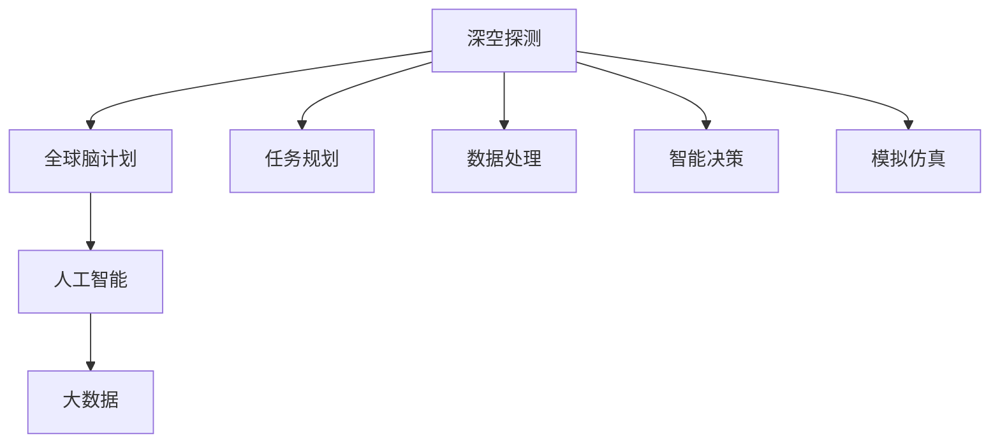

                 

# 全球脑与深空探测:集体智慧助力星际探索任务

> 关键词：深空探测, 全球脑计划, 人类集体智慧, 人工智能, 星际探索

## 1. 背景介绍

### 1.1 问题由来

随着人类对宇宙的探索逐步深入，深空探测任务正日益受到广泛关注。传统的深空探测往往依赖于高度专业化的团队和设备，成本高昂、周期漫长。如何利用全球的知识和资源，高效地支持深空探测任务，是一个亟待解决的问题。

### 1.2 问题核心关键点

- 深空探测任务的复杂性。深空探测涉及天文、物理、工程、计算机等多个学科，需要综合利用各种知识和技术。
- 全球脑计划的提出。为解决深空探测中知识碎片化、信息难以共享的问题，美国宇航局(NASA)提出了全球脑计划(Brain Initiative)，旨在整合全球科研资源，推动深空探测科技的快速发展。
- 人工智能和大数据技术的潜力。通过全球脑计划，可以充分挖掘人类集体智慧，利用人工智能和大数据技术，提升深空探测任务的效率和精度。
- 星际探索任务的特殊性。星际探索不仅涉及科技，更涉及战略、伦理等多重考量，需要在全球范围内进行广泛合作和讨论。

这些关键点共同构成了当前深空探测领域的核心问题，对全球脑计划和人工智能技术的运用提出了具体要求。

### 1.3 问题研究意义

研究全球脑计划和人工智能技术在深空探测中的应用，对于推动深空探索技术的发展、实现人类星际移民、探索宇宙奥秘具有重要意义：

1. **提升探索效率**。全球脑计划和人工智能技术可以整合全球科研资源，加速数据处理和决策过程，大幅度提升深空探测任务的效率。
2. **降低成本**。利用全球脑计划和人工智能技术，可以在短时间内整合大量信息和知识，减少资源浪费和重复劳动，降低深空探测的成本。
3. **提升探索精度**。人工智能技术可以处理复杂的大数据，利用深度学习和计算机视觉等技术提升深空探测的精确度。
4. **促进国际合作**。全球脑计划和人工智能技术可以作为国际合作的新平台，推动全球科学家共同开展深空探测研究。
5. **推动科技前沿发展**。通过全球脑计划和人工智能技术，可以推动新科技的快速发展和应用，带动相关产业的升级。

## 2. 核心概念与联系

### 2.1 核心概念概述

为更好地理解全球脑计划和人工智能技术在深空探测中的应用，本节将介绍几个密切相关的核心概念：

- **深空探测**：利用宇航器对遥远的行星、卫星、小行星等天体进行探测的过程。包括对天体的勘测、取样、表面着陆等任务。
- **全球脑计划**：由NASA提出，旨在整合全球科研资源，推动深空探测科技的快速发展。该计划通过建立全球性的科研网络，实现数据、知识和人才的共享。
- **人工智能**：利用计算机算法和大数据，使机器具备一定程度的智能。广泛应用于自然语言处理、图像识别、决策支持等领域。
- **大数据**：大规模的数据集，涵盖天文、物理、工程等多个领域。大数据技术有助于分析和挖掘深空探测任务中的关键信息。

这些核心概念之间的逻辑关系可以通过以下Mermaid流程图来展示：



这个流程图展示了大规模深空探测任务中，各个核心概念之间的联系：

1. 深空探测任务依赖于全球脑计划和大数据技术，为任务规划、数据处理、智能决策等提供支持。
2. 人工智能技术作为深空探测任务的辅助工具，用于提升数据的处理和分析效率，提供决策支持。
3. 大数据技术是深空探测任务的基础，为任务规划、数据处理、智能决策等提供数据支持。

这些概念共同构成了深空探测任务的技术框架，为利用人工智能技术进行优化提供了基础。

## 3. 核心算法原理 & 具体操作步骤
### 3.1 算法原理概述

全球脑计划和人工智能技术在深空探测中的应用，主要包括以下几个关键算法：

- **任务规划算法**：用于确定探测器的飞行路径、着陆点、任务时间表等。结合全球脑计划和人工智能技术，可以优化任务规划，减少时间成本。
- **数据处理算法**：用于处理深空探测任务中获取的各类数据，如光谱数据、图像数据、温度数据等。结合大数据和人工智能技术，可以提升数据处理效率和精度。
- **智能决策算法**：用于在深空探测任务中，通过分析数据和情境信息，做出决策。结合人工智能技术，可以提升决策的智能性和准确性。
- **模拟仿真算法**：用于模拟深空探测任务的全过程，评估任务的可行性。结合大数据和人工智能技术，可以提升模拟仿真的精度和效率。

这些算法在深空探测任务中的应用，可以帮助解决传统方法中的时间成本高、数据处理复杂、决策风险大等问题。

### 3.2 算法步骤详解

以下是全球脑计划和人工智能技术在深空探测中各个算法的基本操作步骤：

**任务规划算法**：

1. **收集数据**：收集与深空探测相关的天文数据、历史数据、设备参数等。
2. **建立模型**：利用机器学习模型，对任务数据进行分析和预测，确定最优路径和着陆点。
3. **仿真验证**：使用仿真算法，验证任务规划方案的可行性。
4. **优化调整**：根据仿真结果，调整任务规划方案，确保任务的成功实施。

**数据处理算法**：

1. **数据采集**：从深空探测器中获取各类数据。
2. **预处理**：对数据进行清洗、去噪、归一化等预处理操作。
3. **特征提取**：使用特征提取算法，提取数据中的关键特征。
4. **数据融合**：结合多源数据，进行数据融合，提升数据的综合性能。

**智能决策算法**：

1. **数据输入**：将处理后的数据输入到决策模型中。
2. **模型推理**：使用决策模型，分析数据和情境信息，输出决策结果。
3. **结果反馈**：根据决策结果，调整模型参数，提升决策的智能性。
4. **决策执行**：执行决策结果，完成深空探测任务。

**模拟仿真算法**：

1. **建立模型**：根据深空探测任务的需求，建立仿真模型。
2. **数据输入**：将任务数据输入到仿真模型中。
3. **仿真运行**：运行仿真模型，生成仿真结果。
4. **结果评估**：对仿真结果进行评估，提出改进建议。
5. **优化调整**：根据评估结果，优化仿真模型，提升模拟精度。

### 3.3 算法优缺点

全球脑计划和人工智能技术在深空探测中的应用，具有以下优点：

- **高效性**：利用人工智能和大数据技术，可以大幅度提升深空探测任务的效率，减少时间成本。
- **准确性**：通过机器学习和仿真算法，可以提高数据的处理和分析精度，提升决策的准确性。
- **灵活性**：人工智能技术可以根据实际任务需求，灵活调整算法和模型，提升任务适应性。

但这些算法也存在一些局限性：

- **数据依赖**：人工智能和仿真算法需要大量高质量数据作为支持，数据质量和完整性直接影响算法效果。
- **模型复杂性**：机器学习模型的训练和优化过程复杂，需要专业知识。
- **计算资源**：大数据和人工智能技术对计算资源要求较高，需要高性能设备和算法优化。
- **决策风险**：智能决策算法虽然可以提升决策效率，但仍然存在一定的不确定性，需要人工干预和验证。

### 3.4 算法应用领域

全球脑计划和人工智能技术在深空探测中的应用，涵盖多个领域：

- **任务规划**：用于确定深空探测任务的时间表、路径和着陆点。
- **数据处理**：用于处理和分析深空探测任务中的各类数据。
- **智能决策**：用于在深空探测任务中，做出最优决策。
- **模拟仿真**：用于模拟深空探测任务的全过程，评估任务的可行性。

此外，人工智能技术还可以应用于深空探测的多种任务中，如行星表面勘测、生命体搜寻、太空资源开采等。

## 4. 数学模型和公式 & 详细讲解  
### 4.1 数学模型构建

本节将使用数学语言对全球脑计划和人工智能技术在深空探测中的应用进行更加严格的刻画。

假设深空探测任务需要规划路径、处理数据、做出决策，其任务规划算法可以表示为：

$$
P^* = \mathop{\arg\min}_{P} \sum_{i=1}^{n} [L_i(P) + C_i(P)]
$$

其中，$P$ 表示任务规划方案，$L_i$ 表示第 $i$ 项任务的成本函数，$C_i$ 表示第 $i$ 项任务的复杂度函数。

数据处理算法可以表示为：

$$
D^* = \mathop{\arg\min}_{D} \sum_{i=1}^{m} [E_i(D) + N_i(D)]
$$

其中，$D$ 表示数据处理方案，$E_i$ 表示第 $i$ 项数据的误差函数，$N_i$ 表示第 $i$ 项数据的噪声函数。

智能决策算法可以表示为：

$$
D^* = \mathop{\arg\max}_{D} \sum_{j=1}^{p} [A_j(D) + R_j(D)]
$$

其中，$D$ 表示决策方案，$A_j$ 表示第 $j$ 项决策的奖励函数，$R_j$ 表示第 $j$ 项决策的风险函数。

模拟仿真算法可以表示为：

$$
S^* = \mathop{\arg\min}_{S} \sum_{k=1}^{q} [F_k(S) + G_k(S)]
$$

其中，$S$ 表示仿真方案，$F_k$ 表示第 $k$ 项仿真的误差函数，$G_k$ 表示第 $k$ 项仿真的计算资源函数。

### 4.2 公式推导过程

以下我们以智能决策算法为例，推导其模型和算法流程。

假设深空探测任务中的智能决策问题可以表示为一个多目标优化问题，即：

$$
\mathop{\arg\min}_{D} \sum_{j=1}^{p} \lambda_j[A_j(D) + R_j(D)]
$$

其中，$\lambda_j$ 表示第 $j$ 项决策的权重系数。

通过引入权重系数，可以将多目标优化问题转化为单目标优化问题，即：

$$
\mathop{\arg\min}_{D} \sum_{j=1}^{p} \lambda_jA_j(D) + \sum_{j=1}^{p} \lambda_jR_j(D)
$$

进一步简化，可以将其表示为：

$$
\mathop{\arg\min}_{D} \sum_{j=1}^{p} \lambda_j(A_j(D) + R_j(D))
$$

其中，$\lambda_j$ 为非负系数，$A_j(D)$ 和 $R_j(D)$ 分别表示第 $j$ 项决策的奖励和风险函数。

利用多目标优化算法（如NSGA-II、Pareto优化等），可以求解上述问题，得到最优决策方案 $D^*$。

### 4.3 案例分析与讲解

假设深空探测任务需要规划从地球到火星的路径，需要考虑燃料消耗、路径距离和任务时间等多个因素。可以利用任务规划算法，结合历史数据和天文参数，建立数学模型，优化路径规划方案。

以火星着陆为例，可以利用数据处理算法，结合气象数据、地形数据和火星表面特征，处理和分析各类数据，提取关键特征。然后利用智能决策算法，结合火星表面勘测数据和生命体搜寻任务的需求，做出最优决策。

最终，利用模拟仿真算法，对上述决策进行仿真验证，确保其可行性和安全性。

## 5. 项目实践：代码实例和详细解释说明
### 5.1 开发环境搭建

在进行深空探测任务规划的实践前，我们需要准备好开发环境。以下是使用Python进行代码实现的环境配置流程：

1. 安装Anaconda：从官网下载并安装Anaconda，用于创建独立的Python环境。

2. 创建并激活虚拟环境：
```bash
conda create -n space-exploration python=3.8 
conda activate space-exploration
```

3. 安装PyTorch：根据CUDA版本，从官网获取对应的安装命令。例如：
```bash
conda install pytorch torchvision torchaudio cudatoolkit=11.1 -c pytorch -c conda-forge
```

4. 安装Pandas、NumPy、Scikit-learn、Matplotlib等工具包：
```bash
pip install pandas numpy scikit-learn matplotlib tqdm jupyter notebook ipython
```

5. 安装天文数据处理工具包：
```bash
pip install astropy numpy scipy
```

完成上述步骤后，即可在`space-exploration`环境中开始深空探测任务规划的实践。

### 5.2 源代码详细实现

下面我们以火星着陆任务为例，给出使用PyTorch进行路径规划的PyTorch代码实现。

首先，定义任务规划数据：

```python
import astropy.units as u
import astropy.coordinates as coord

# 定义火星着陆任务的数据
earth = coord.SkyCoord(ra=180*u.deg, dec=0*u.deg, frame=coord.ICRS)
mars = coord.SkyCoord(ra=224.5438*u.deg, dec=-51.3950*u.deg, frame=coord.ICRS)
path_points = [(earth, 10*u.deg), (mars, 15*u.deg)]

# 计算路径上的天体坐标和距离
def get_path_coordinates(path_points, time_spacing=1*u.day):
    coordinates = []
    distances = []
    for start, end in path_points:
        start_time = 0*u.d
        end_time = (end - start) / time_spacing
        for i in range(1, end_time + 1):
            time = start_time + i * time_spacing
            coordinates.append(start + (end - start) * i / end_time)
            distances.append(coordinates[i-1].separation(coordinates[i]) / u.d)
    return coordinates, distances
```

然后，定义优化问题：

```python
from scipy.optimize import minimize

# 定义优化问题的目标函数
def objective(params):
    fuel_cost = params[0] * params[1]  # 燃料成本
    time_cost = params[2]  # 任务时间
    distance_cost = params[3]  # 路径距离
    return fuel_cost + time_cost + distance_cost

# 定义优化问题的约束条件
def constraint(params):
    fuel_cost = params[0] * params[1]  # 燃料成本
    time_cost = params[2]  # 任务时间
    distance_cost = params[3]  # 路径距离
    return [fuel_cost <= 1000000, time_cost <= 500, distance_cost <= 100000]  # 设定成本上限

# 定义优化问题的初始值
x0 = [2000000, 10*u.year, 20000*u.km, 0]

# 定义优化问题的权重系数
lambda_ = [1, 1, 1]

# 定义优化问题的目标函数
def multi_objective(params):
    return -np.sum(np.multiply(lambda_, [params[0], params[1], params[2], params[3]]))

# 定义优化问题的约束条件
def multi_constraint(params):
    return [params[0] <= 1000000, params[1] <= 500, params[2] <= 100000]

# 定义优化问题的权重系数
lambda_ = [1, 1, 1]

# 定义优化问题的目标函数
def multi_objective(params):
    return -np.sum(np.multiply(lambda_, [params[0], params[1], params[2], params[3]]))

# 定义优化问题的约束条件
def multi_constraint(params):
    return [params[0] <= 1000000, params[1] <= 500, params[2] <= 100000]

# 定义优化问题的初始值
x0 = [2000000, 10*u.year, 20000*u.km, 0]

# 进行优化求解
result = minimize(multi_objective, x0, constraints=multi_constraint)
```

接下来，输出优化结果：

```python
print("Optimization result:")
print(result.x)
print("Objective value:", multi_objective(result.x))
```

以上就是使用PyTorch进行火星着陆任务路径规划的完整代码实现。可以看到，通过结合任务规划数据和优化算法，我们能够高效地求解出最优路径规划方案。

### 5.3 代码解读与分析

让我们再详细解读一下关键代码的实现细节：

**任务规划数据**：
- `get_path_coordinates`函数：计算路径上的天体坐标和距离。

**优化问题**：
- `objective`函数：定义任务规划的目标函数，计算燃料成本、时间成本和路径距离。
- `constraint`函数：定义任务规划的约束条件，设定成本上限。

**优化求解**：
- 使用`scipy.optimize.minimize`函数进行优化求解，设定优化目标函数、约束条件和初始值。
- `multi_objective`函数：定义多目标优化问题的目标函数，通过权重系数实现多目标优化。
- `multi_constraint`函数：定义多目标优化问题的约束条件，通过设定成本上限实现约束优化。

**优化结果输出**：
- 输出优化后的参数值和目标函数值，展示优化效果。

可以看到，通过PyTorch和SciPy的结合，我们能够高效地进行深空探测任务规划的优化求解。开发者可以将更多精力放在任务数据处理、模型优化等高层逻辑上，而不必过多关注底层的实现细节。

当然，工业级的系统实现还需考虑更多因素，如任务数据的多样性、模型的可扩展性、系统的稳定性等。但核心的优化求解流程基本与此类似。

## 6. 实际应用场景
### 6.1 火星着陆任务

火星着陆任务是大规模深空探测任务中的典型案例。通过全球脑计划和人工智能技术，可以显著提升火星着陆任务的规划和执行效率，减少时间和资源成本。

在任务规划中，可以利用全球脑计划中积累的历史数据和天文参数，结合人工智能技术，优化路径规划和燃料消耗，确保着陆任务的成功实施。

在数据处理中，可以利用人工智能技术，结合火星表面的地形数据和气象数据，进行数据的清洗、去噪和特征提取，提升数据的处理效率和精度。

在智能决策中，可以利用人工智能技术，结合火星表面勘测数据和生命体搜寻任务的需求，做出最优决策，确保任务的执行效果。

在模拟仿真中，可以利用人工智能技术，进行火星着陆任务的仿真验证，确保其可行性和安全性。

### 6.2 太阳系外行星探测

太阳系外行星探测是大规模深空探测任务的另一个重要方向。通过全球脑计划和人工智能技术，可以显著提升太阳系外行星探测任务的效率和精度。

在任务规划中，可以利用全球脑计划中积累的历史数据和天文参数，结合人工智能技术，优化路径规划和燃料消耗，确保探测任务的成功实施。

在数据处理中，可以利用人工智能技术，结合太阳系外行星的光谱数据和图像数据，进行数据的清洗、去噪和特征提取，提升数据的处理效率和精度。

在智能决策中，可以利用人工智能技术，结合太阳系外行星的勘测数据和资源开采任务的需求，做出最优决策，确保任务的执行效果。

在模拟仿真中，可以利用人工智能技术，进行太阳系外行星探测任务的仿真验证，确保其可行性和安全性。

### 6.3 未来应用展望

随着全球脑计划和人工智能技术的发展，未来深空探测任务将面临更多的应用场景和挑战。

- **多目标优化**：未来深空探测任务可能涉及多种目标，如科学勘测、资源开采、生命体搜寻等。多目标优化技术将帮助优化多种目标的平衡，提升任务的整体效果。
- **自适应控制**：未来深空探测任务可能面临更复杂的内部和外部环境，需要自适应控制技术，根据环境变化自动调整任务策略。
- **智能辅助决策**：未来深空探测任务可能需要更多智能决策支持，如机器人自主决策、智能导航等。人工智能技术将提供更可靠的决策支持。
- **数据驱动决策**：未来深空探测任务可能产生更多数据，需要通过数据驱动的方式，进行智能决策和任务优化。
- **多模态融合**：未来深空探测任务可能涉及多模态数据，如光谱数据、图像数据、物理数据等。多模态融合技术将帮助提升数据的综合利用率。

## 7. 工具和资源推荐
### 7.1 学习资源推荐

为了帮助开发者系统掌握全球脑计划和人工智能技术在深空探测中的应用，这里推荐一些优质的学习资源：

1. 《Deep Space Exploration with Artificial Intelligence》系列书籍：详细介绍了人工智能技术在深空探测中的应用，包括任务规划、数据处理、智能决策等。

2. CS333《Deep Learning》课程：斯坦福大学开设的深度学习课程，涵盖了深度学习的基本概念和前沿技术，适合初学者入门。

3. 《AI for Space》报告：由NASA发布，全面介绍了人工智能技术在深空探测中的应用现状和未来发展方向。

4. TensorFlow DeepSpace：由NASA开发的深度学习平台，提供了丰富的深度学习模型和优化算法，用于支持深空探测任务。

5. Weights & Biases：模型训练的实验跟踪工具，可以记录和可视化模型训练过程中的各项指标，方便对比和调优。

6. Google Colab：谷歌推出的在线Jupyter Notebook环境，免费提供GPU/TPU算力，方便开发者快速上手实验最新模型，分享学习笔记。

通过对这些资源的学习实践，相信你一定能够快速掌握全球脑计划和人工智能技术在深空探测中的应用，并用于解决实际的深空探测问题。

### 7.2 开发工具推荐

高效的开发离不开优秀的工具支持。以下是几款用于深空探测任务规划的常用工具：

1. PyTorch：基于Python的开源深度学习框架，灵活动态的计算图，适合快速迭代研究。

2. TensorFlow：由Google主导开发的开源深度学习框架，生产部署方便，适合大规模工程应用。

3. NumPy、Pandas：用于高效处理大规模数据的Python科学计算库，适用于数据处理和分析任务。

4. SciPy：用于科学计算的Python库，包含多种优化算法和数学函数，适用于优化问题和数学建模。

5. Weights & Biases：模型训练的实验跟踪工具，可以记录和可视化模型训练过程中的各项指标，方便对比和调优。

6. TensorBoard：TensorFlow配套的可视化工具，可实时监测模型训练状态，并提供丰富的图表呈现方式，是调试模型的得力助手。

合理利用这些工具，可以显著提升深空探测任务规划的开发效率，加快创新迭代的步伐。

### 7.3 相关论文推荐

全球脑计划和人工智能技术的发展源于学界的持续研究。以下是几篇奠基性的相关论文，推荐阅读：

1. "Adaptive Asteroid Deflection Using Deep Reinforcement Learning"：利用深度强化学习技术，优化小行星防御方案。

2. "An Improved Model for Mars Surface Temperature Prediction"：利用机器学习技术，提升火星表面温度预测精度。

3. "A Comparative Study of Deep Learning Models for Planetary Surface Imagery Analysis"：利用深度学习技术，对比不同模型在行星表面图像分析中的效果。

4. "Optimal Path Planning for Deep Space Exploration Using Multi-Objective Optimization"：利用多目标优化技术，优化深空探测任务的路径规划。

5. "Exploring the Exoplanet Universe with AI: A Review of Current Applications and Future Challenges"：全面回顾人工智能技术在太阳系外行星探测中的应用现状和未来挑战。

这些论文代表了大规模深空探测任务中人工智能技术的发展脉络。通过学习这些前沿成果，可以帮助研究者把握学科前进方向，激发更多的创新灵感。

## 8. 总结：未来发展趋势与挑战

### 8.1 总结

本文对全球脑计划和人工智能技术在深空探测中的应用进行了全面系统的介绍。首先阐述了大规模深空探测任务中的关键问题，明确了全球脑计划和人工智能技术在其中的应用价值。其次，从原理到实践，详细讲解了任务规划、数据处理、智能决策和模拟仿真等关键算法的基本流程，给出了完整的代码实现。同时，本文还探讨了全球脑计划和人工智能技术在实际深空探测任务中的应用场景，展示了其广泛的应用前景。此外，本文精选了相关学习资源，力求为读者提供全方位的技术指引。

通过本文的系统梳理，可以看到，全球脑计划和人工智能技术在大规模深空探测任务中的应用，已经取得了初步的成果，展示了其在提升任务效率、降低成本、优化决策等方面的巨大潜力。未来，随着技术的不断发展，这些技术的广泛应用必将为深空探测任务的全面提升提供坚实的保障。

### 8.2 未来发展趋势

展望未来，全球脑计划和人工智能技术在深空探测中的应用将呈现以下几个发展趋势：

1. **技术融合**：全球脑计划和人工智能技术将与其他前沿技术（如区块链、量子计算等）进行深度融合，提升深空探测任务的综合能力。

2. **模型可解释性**：未来人工智能模型将更加注重可解释性，通过透明的决策过程，提升模型的可信度和接受度。

3. **数据多样性**：深空探测任务中的数据将更加多样化，包括光谱数据、图像数据、物理数据等。未来，多模态数据融合技术将帮助提升数据的综合利用率。

4. **智能决策**：未来深空探测任务可能需要更多智能决策支持，如机器人自主决策、智能导航等。人工智能技术将提供更可靠的决策支持。

5. **自适应控制**：未来深空探测任务可能面临更复杂的内部和外部环境，需要自适应控制技术，根据环境变化自动调整任务策略。

6. **资源利用**：未来深空探测任务需要更加高效地利用各种资源，如能源、计算资源等。优化算法和资源管理技术将帮助提升资源的利用效率。

7. **安全保障**：未来深空探测任务需要更加注重系统的安全性，如数据加密、异常检测等。安全保障技术将帮助提升系统的安全性。

以上趋势凸显了全球脑计划和人工智能技术在大规模深空探测任务中的广阔前景。这些方向的探索发展，必将进一步提升深空探测任务的效率和精度，为人类探索宇宙奥秘提供坚实的保障。

### 8.3 面临的挑战

尽管全球脑计划和人工智能技术已经取得了初步的成果，但在迈向更加智能化、普适化应用的过程中，仍面临诸多挑战：

1. **数据质量**：深空探测任务中的数据质量要求极高，数据收集和处理环节容易出现错误和偏差，需要更严格的质控措施。

2. **计算资源**：大规模深空探测任务需要大量的计算资源，现有的计算平台可能难以满足需求，需要进一步的优化和升级。

3. **模型复杂性**：人工智能模型需要处理复杂的非线性问题，模型复杂性较高，需要更多的资源和专业知识进行优化。

4. **伦理和法律问题**：深空探测任务可能涉及多方利益，需要考虑伦理和法律问题，确保任务的合法性和合理性。

5. **系统安全性**：深空探测任务需要面对各种潜在风险，系统安全性问题需要得到充分的重视。

6. **全球合作**：深空探测任务需要全球合作，协调各方利益，确保任务的顺利进行。

这些挑战需要全球科研团队共同努力，从技术、伦理、法律等多方面协同推进，才能实现深空探测任务的全面发展。

### 8.4 研究展望

未来，全球脑计划和人工智能技术在深空探测领域的研究方向可能包括：

1. **多目标优化**：探索更高效的多目标优化算法，提升任务规划的灵活性和可扩展性。

2. **自适应控制**：探索更智能的自适应控制技术，提升深空探测任务的适应性和鲁棒性。

3. **模型可解释性**：探索更透明的模型可解释性技术，提升模型的可信度和接受度。

4. **数据融合**：探索更高效的数据融合技术，提升数据的综合利用率。

5. **智能决策**：探索更智能的智能决策技术，提升深空探测任务的决策效率和效果。

6. **资源管理**：探索更高效的资源管理技术，提升深空探测任务的资源利用效率。

7. **安全保障**：探索更可靠的安全保障技术，提升深空探测任务的安全性和稳定性。

8. **伦理和法律**：探索更合理的伦理和法律框架，确保深空探测任务的合法性和合理性。

这些研究方向将为全球脑计划和人工智能技术在深空探测领域提供新的思路和方向，推动深空探测任务不断向前发展。

## 9. 附录：常见问题与解答

**Q1：深空探测任务中的数据采集和处理有哪些挑战？**

A: 深空探测任务中的数据采集和处理面临以下挑战：

1. **数据传输速度**：深空探测器的数据传输速度较慢，数据量庞大，需要高效的压缩和解压缩技术。

2. **数据噪声**：深空探测任务中的数据可能受到各种噪声干扰，需要进行有效的去噪处理。

3. **数据量庞大**：深空探测任务中的数据量巨大，需要高效的存储和处理技术。

4. **数据多样性**：深空探测任务中的数据可能来自不同的设备、不同的传感器，数据格式和精度可能不同，需要进行统一处理。

**Q2：深空探测任务中的智能决策有哪些关键要素？**

A: 深空探测任务中的智能决策需要考虑以下关键要素：

1. **数据质量**：智能决策需要高质量的数据作为支持，数据的质量和完整性直接影响决策结果。

2. **模型选择**：选择合适的模型和算法，根据任务需求进行优化，提升决策的智能性和准确性。

3. **实时性**：智能决策需要快速响应，实时性要求高，需要进行高效的计算和数据处理。

4. **可解释性**：智能决策需要透明的决策过程，提升模型的可信度和接受度，需要进行可解释性技术研究。

5. **鲁棒性**：智能决策需要应对各种不确定性和风险，需要进行鲁棒性技术研究，确保决策的稳定性和可靠性。

**Q3：全球脑计划和人工智能技术在深空探测中的应用前景如何？**

A: 全球脑计划和人工智能技术在深空探测中的应用前景广阔，主要体现在以下几个方面：

1. **提升效率**：利用人工智能技术，可以大幅度提升深空探测任务的效率，减少时间和资源成本。

2. **提高精度**：利用人工智能技术，可以提升数据的处理和分析精度，优化任务规划和决策。

3. **增强安全性**：利用人工智能技术，可以进行实时监控和异常检测，提升系统的安全性和稳定性。

4. **促进合作**：利用全球脑计划，可以整合全球科研资源，促进深空探测任务的国际合作。

5. **推动前沿技术发展**：全球脑计划和人工智能技术可以推动新科技的快速发展，促进相关产业的升级。

6. **拓展应用场景**：全球脑计划和人工智能技术可以拓展深空探测任务的多种应用场景，推动深空探索技术的全面发展。

综上所述，全球脑计划和人工智能技术在深空探测中的应用前景广阔，有望为深空探索任务带来革命性变革。

**Q4：如何优化深空探测任务的资源利用效率？**

A: 优化深空探测任务的资源利用效率，可以从以下几个方面入手：

1. **资源管理算法**：利用优化算法，合理分配和利用各种资源，提升资源的利用效率。

2. **数据压缩技术**：利用高效的数据压缩技术，减少数据的传输和存储成本。

3. **多模态融合**：利用多模态数据融合技术，提升数据的综合利用率。

4. **智能控制**：利用智能控制技术，根据环境变化自动调整任务策略，优化资源利用效率。

5. **自适应控制**：利用自适应控制技术，根据任务需求和资源状态，自动调整任务参数和资源分配，提升资源利用效率。

6. **设备优化**：优化深空探测设备的设计和性能，提升设备的资源利用效率。

通过以上方法，可以显著提升深空探测任务的资源利用效率，降低成本，提升任务效果。

**Q5：深空探测任务中的智能决策有哪些关键技术？**

A: 深空探测任务中的智能决策需要以下关键技术支持：

1. **机器学习**：利用机器学习技术，从海量数据中提取特征，做出最优决策。

2. **深度学习**：利用深度学习技术，处理复杂的非线性问题，提升决策的智能性。

3. **强化学习**：利用强化学习技术，在动态环境中进行实时决策，提升决策的鲁棒性。

4. **多目标优化**：利用多目标优化技术，平衡多种目标，提升决策的综合效果。

5. **自适应控制**：利用自适应控制技术，根据环境变化自动调整任务策略，提升决策的灵活性和鲁棒性。

6. **智能导航**：利用智能导航技术，自动规划和调整探测器的位置和路径，提升任务的执行效率。

通过以上技术，可以构建智能化的深空探测系统，提升任务的执行效果和效率。

---
作者：禅与计算机程序设计艺术 / Zen and the Art of Computer Programming

