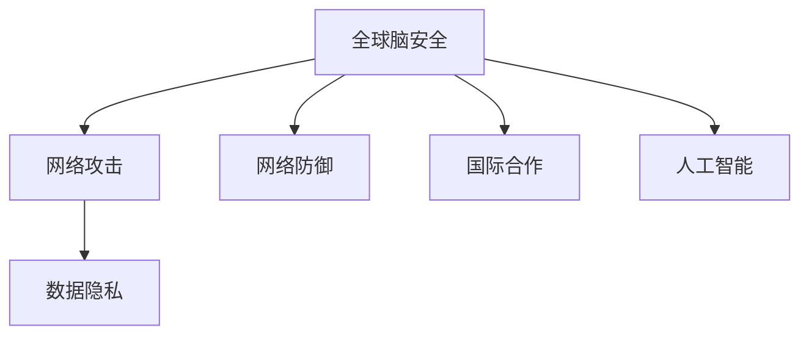

                 

# 全球脑安全：数字时代的新型国防战略

## 1. 背景介绍

### 1.1 问题由来
随着数字化技术的飞速发展，全球脑安全（Brain Security）成为了数字时代的新型国防战略的重要组成部分。过去，传统意义上的国防主要聚焦于物理空间的安全，如边界防线、军事基地等。然而，在数字化浪潮下，信息空间的攻防较量成为新的战场。据统计，全球每年因网络攻击造成的经济损失高达数万亿美元，且这一数字呈持续上升趋势。

与此同时，人工智能（AI）技术的发展为网络安全带来了新的挑战。AI能够从海量数据中提取模式，实现自主攻击、防御、渗透，甚至可以进行自我学习提升其攻击能力。加之，AI的深度学习、自然语言处理等技术在各个领域的应用，使得网络攻击手段和途径愈发多样化，网络安全防御变得异常复杂。

在这样的背景下，各国政府、企业以及科研机构开始重视数字空间的脑安全，希望通过技术手段，加强网络防护，确保数字空间的安全。全球脑安全战略正逐步成为各国数字化进程中的重要内容。

### 1.2 问题核心关键点
全球脑安全的核心目标在于保障数字空间的秩序与和谐，防止网络攻击、数据泄露等安全事件的发生。主要包括以下几个方面：

- **保护关键基础设施**：确保政府、金融、能源、交通等关键基础设施的安全，防止被黑客攻击或破坏。
- **保障数据隐私**：保护个人和企业数据不被非法获取、篡改或泄露。
- **提升网络防御能力**：通过技术手段提升网络防御水平，防止网络攻击和渗透。
- **推动国际合作**：加强国际间的网络安全协作，共同应对全球性网络威胁。

### 1.3 问题研究意义
研究全球脑安全战略，对于构建安全、和谐的数字空间，维护国家安全和社会稳定具有重要意义：

- **保障国家安全**：在全球数字化进程中，保护国家关键基础设施和重要数据，防止被网络攻击和数据泄露所危害。
- **促进经济发展**：确保企业数据安全，避免因数据泄露导致的企业信誉受损和经济损失。
- **增强社会稳定**：通过网络安全措施，维护社会秩序，减少因网络攻击而引发的社会动荡和恐慌。
- **推动国际合作**：加强国际间的网络安全协作，提升全球网络空间的安全水平。

## 2. 核心概念与联系

### 2.1 核心概念概述

为了更好地理解全球脑安全战略，本节将介绍几个密切相关的核心概念：

- **全球脑安全**：指在全球范围内，保障数字化空间的秩序与和谐，防止网络攻击、数据泄露等安全事件的发生。
- **网络攻击**：指利用网络技术手段对目标系统进行攻击的行为，包括病毒、木马、DDoS等。
- **数据隐私**：指保护个人和企业数据不被非法获取、篡改或泄露。
- **网络防御**：指通过技术手段提升网络防御水平，防止网络攻击和渗透。
- **国际合作**：指各国政府、企业以及科研机构在网络安全领域的合作，共同应对全球性网络威胁。
- **人工智能**：指模拟人类智能过程的技术，包括深度学习、自然语言处理、计算机视觉等。

这些核心概念之间的逻辑关系可以通过以下Mermaid流程图来展示：



这个流程图展示了几大核心概念及其之间的关系：

1. 全球脑安全的目标是保护数字空间，防止网络攻击和数据泄露。
2. 网络攻击和数据隐私是全球脑安全的主要威胁。
3. 网络防御是全球脑安全的重要手段。
4. 国际合作有助于提升全球网络安全水平。
5. 人工智能在网络安全中扮演了重要的角色。

## 3. 核心算法原理 & 具体操作步骤
### 3.1 算法原理概述

全球脑安全战略主要基于以下几个核心算法原理：

- **数据分类与加密**：对敏感数据进行分类，并使用对称加密和非对称加密技术保护数据安全。
- **入侵检测系统（IDS）**：通过监控网络流量，检测和阻止潜在的攻击行为。
- **防火墙技术**：在网络边界部署防火墙，过滤不安全的数据流量，保护内部网络安全。
- **人工智能辅助安全**：利用机器学习和自然语言处理技术，提升网络威胁的识别和响应能力。
- **多层次安全防护**：通过物理层、网络层、应用层等多层次的安全措施，构建全面的防御体系。

### 3.2 算法步骤详解

全球脑安全战略的实施过程主要包括以下几个关键步骤：

**Step 1: 数据分类与加密**
- 收集和识别关键数据和敏感数据，根据其重要性进行分类。
- 对不同类别的数据采取相应的加密策略，如对称加密（如AES）和非对称加密（如RSA）。
- 使用密钥管理系统（如KMS）管理和分发加密密钥。

**Step 2: 部署IDS和防火墙**
- 在网络边界部署入侵检测系统（IDS），实时监控网络流量，检测潜在的攻击行为。
- 配置防火墙规则，过滤不安全的数据流量，防止恶意流量进入内部网络。
- 定期更新IDS和防火墙规则库，保持防御体系的最新性。

**Step 3: 数据隐私保护**
- 设计数据访问权限管理系统（如RBAC），限制数据访问权限，确保数据仅在授权人员和设备间传输。
- 采用数据脱敏和去标识化技术，保护数据的隐私性。
- 定期进行安全审计，检查和修复数据隐私保护中的漏洞。

**Step 4: 人工智能辅助安全**
- 利用机器学习算法（如Anomaly Detection）对网络流量进行异常检测，识别潜在的网络攻击行为。
- 使用自然语言处理技术（如NLP）分析网络日志和异常事件，提取攻击者的行为模式和特征。
- 利用深度学习技术（如CNN、RNN）构建智能防御系统，提升对复杂攻击的防御能力。

**Step 5: 多层次安全防护**
- 构建物理层安全，保护数据中心和关键基础设施的安全。
- 加强网络层安全，通过IDS和防火墙等措施，防止网络攻击和渗透。
- 提升应用层安全，通过身份认证、访问控制等技术，确保应用程序的安全。

### 3.3 算法优缺点

全球脑安全战略具有以下优点：
1. 技术手段多样，综合性强。通过多种技术手段，形成多层次的安全防护体系。
2. 自动化水平高，实时性强。AI技术的应用，使得安全防护能够实时检测和响应潜在威胁。
3. 防护措施灵活，可定制化。根据不同应用场景，灵活调整安全策略，实现精细化防护。
4. 国际合作广泛，协同性强。通过国际间的网络安全协作，提升全球网络安全水平。

同时，该战略也存在一定的局限性：
1. 技术复杂度高，实施难度大。全球脑安全涉及多种技术，需要跨领域的知识和经验。
2. 成本投入高，资源消耗大。实施全球脑安全需要大量的资金和人力资源。
3. 隐私风险加剧，信息泄露风险高。严格的隐私保护措施，可能影响数据的正常使用和共享。
4. 对抗性攻击难防，攻击手段不断演变。网络攻击者可能会利用最新技术和漏洞，突破现有防御体系。
5. 法律法规滞后，法律保障不足。网络安全法律法规的滞后，可能导致对网络攻击的打击不力。

尽管存在这些局限性，但就目前而言，全球脑安全战略仍是大数据时代保障网络安全的重要方向。未来相关研究的重点在于如何进一步降低安全实施的难度和成本，提高对抗性攻击的防御能力，同时兼顾隐私保护和法律合规等因素。

### 3.4 算法应用领域

全球脑安全战略在多个领域得到了广泛的应用，包括但不限于：

- **政府和企业**：通过实施全球脑安全战略，确保政府和企业数据的安全，防止网络攻击和数据泄露。
- **关键基础设施**：对电力、交通、金融等关键基础设施实施全球脑安全，防止被黑客攻击和破坏。
- **公共服务**：对公共服务（如医疗、教育、能源等）进行安全防护，确保服务的安全和稳定。
- **国际合作**：各国政府和科研机构加强国际间的网络安全协作，共同应对全球性网络威胁。
- **智能家居**：对智能家居设备进行安全防护，防止设备被黑客攻击，影响家庭安全。

这些领域的应用展示了全球脑安全战略的广泛前景，为各个行业的数字化转型提供了有力的保障。

## 4. 数学模型和公式 & 详细讲解 & 举例说明

### 4.1 数学模型构建

为了更好地理解全球脑安全战略，本节将使用数学语言对全球脑安全战略的关键技术进行严格刻画。

记数据集为 $D=\{(x_i,y_i)\}_{i=1}^N$，其中 $x_i$ 为数据，$y_i$ 为标签。设网络攻击者为 $A$，安全防护系统为 $S$。安全防护系统的目标是最小化攻击成功的概率 $P(A\_succeed)$，即：

$$
\min_{S} P(A\_succeed)
$$

在实际应用中，通常使用损失函数来表示攻击者成功概率。假设损失函数为 $L(A\_succeed)$，则安全防护系统的目标变为：

$$
\min_{S} L(A\_succeed)
$$

其中 $L(A\_succeed)$ 可以表示为攻击者成功概率的对数，即 $L(A\_succeed)=-log(P(A\_succeed))$。

### 4.2 公式推导过程

以下是损失函数 $L(A\_succeed)$ 的推导过程：

由于攻击者成功概率 $P(A\_succeed)$ 通常很难直接计算，因此需要通过历史数据 $D$ 来估计。假设已知攻击者成功数据集 $A\_train$ 和未成功数据集 $A\_unsucceed$，其中 $A\_train=\{(x_i,y_i=1)\}_{i=1}^M$，$A\_unsucceed=\{(x_i,y_i=0)\}_{i=1}^N$。则攻击者成功概率可以表示为：

$$
P(A\_succeed)=\frac{P(A\_train)}{P(A\_train)+P(A\_unsucceed)}
$$

其中 $P(A\_train)$ 和 $P(A\_unsucceed)$ 分别表示攻击者成功和未成功的概率。可以通过训练一个二分类模型（如SVM、RNN等）来估计这两个概率，即：

$$
P(A\_train)=\frac{1}{N}\sum_{i=1}^M \frac{1}{S(A\_train)}
$$
$$
P(A\_unsucceed)=\frac{1}{N}\sum_{i=1}^N \frac{1}{S(A\_unsucceed)}
$$

其中 $S(A\_train)$ 和 $S(A\_unsucceed)$ 分别表示攻击者成功和未成功样本的安全防护系统的输出。因此，攻击者成功概率的对数为：

$$
L(A\_succeed)=-log\left(\frac{P(A\_train)}{P(A\_train)+P(A\_unsucceed)}\right)=-log\left(\frac{1}{N}\sum_{i=1}^M \frac{1}{S(A\_train)}\right)-log\left(1+\frac{1}{N}\sum_{i=1}^N \frac{1}{S(A\_unsucceed)}\right)
$$

通过最小化上述损失函数，即可得到最优的安全防护策略 $S$。

### 4.3 案例分析与讲解

假设有一家金融机构的客户信息数据集 $D=\{(x_i,y_i)\}_{i=1}^N$，其中 $x_i$ 为客户的银行账户信息，$y_i$ 表示账户是否被盗用。金融机构希望通过实施全球脑安全战略，防止黑客攻击，保护客户数据安全。

首先，对数据集进行预处理和分析，识别出可能的安全威胁，如SQL注入、XSS攻击等。然后，利用机器学习算法对历史攻击数据进行建模，估计攻击成功的概率。接着，设计入侵检测系统（IDS）和防火墙规则，实时监控网络流量，检测潜在的攻击行为。最后，根据模型输出和攻击行为特征，调整安全防护策略，确保客户数据的安全。

例如，假设IDS检测到一个可疑的登录尝试，系统通过NLP技术分析登录请求的内容，判断是否包含恶意代码。如果判断为可疑，则通过日志记录和异常报警通知管理员，进行进一步的调查和处理。

## 5. 项目实践：代码实例和详细解释说明

### 5.1 开发环境搭建

在进行全球脑安全战略的实践前，我们需要准备好开发环境。以下是使用Python进行开发的环境配置流程：

1. 安装Anaconda：从官网下载并安装Anaconda，用于创建独立的Python环境。

2. 创建并激活虚拟环境：
```bash
conda create -n brain-security python=3.8 
conda activate brain-security
```

3. 安装必要的工具包：
```bash
pip install numpy pandas scikit-learn matplotlib tensorflow transformers
```

4. 配置网络环境：确保网络环境安全，防止被恶意攻击。

5. 安装必要的硬件设备：如加密卡、安全芯片等，增强网络防护能力。

完成上述步骤后，即可在`brain-security`环境中开始全球脑安全战略的实践。

### 5.2 源代码详细实现

下面以入侵检测系统（IDS）的实现为例，给出全球脑安全战略的PyTorch代码实现。

首先，定义IDS的数据处理函数：

```python
from transformers import BertTokenizer
from torch.utils.data import Dataset
import torch

class IDSDataset(Dataset):
    def __init__(self, texts, labels, tokenizer, max_len=128):
        self.texts = texts
        self.labels = labels
        self.tokenizer = tokenizer
        self.max_len = max_len
        
    def __len__(self):
        return len(self.texts)
    
    def __getitem__(self, item):
        text = self.texts[item]
        label = self.labels[item]
        
        encoding = self.tokenizer(text, return_tensors='pt', max_length=self.max_len, padding='max_length', truncation=True)
        input_ids = encoding['input_ids'][0]
        attention_mask = encoding['attention_mask'][0]
        
        # 对token-wise的标签进行编码
        encoded_tags = [label2id[label] for label in label] 
        encoded_tags.extend([label2id['Normal']] * (self.max_len - len(encoded_tags)))
        labels = torch.tensor(encoded_tags, dtype=torch.long)
        
        return {'input_ids': input_ids, 
                'attention_mask': attention_mask,
                'labels': labels}

# 标签与id的映射
label2id = {'Normal': 0, 'Attack': 1}
id2label = {v: k for k, v in label2id.items()}

# 创建dataset
tokenizer = BertTokenizer.from_pretrained('bert-base-cased')

train_dataset = IDSDataset(train_texts, train_labels, tokenizer)
dev_dataset = IDSDataset(dev_texts, dev_labels, tokenizer)
test_dataset = IDSDataset(test_texts, test_labels, tokenizer)
```

然后，定义模型和优化器：

```python
from transformers import BertForTokenClassification, AdamW

model = BertForTokenClassification.from_pretrained('bert-base-cased', num_labels=len(label2id))

optimizer = AdamW(model.parameters(), lr=2e-5)
```

接着，定义训练和评估函数：

```python
from torch.utils.data import DataLoader
from tqdm import tqdm
from sklearn.metrics import classification_report

device = torch.device('cuda') if torch.cuda.is_available() else torch.device('cpu')
model.to(device)

def train_epoch(model, dataset, batch_size, optimizer):
    dataloader = DataLoader(dataset, batch_size=batch_size, shuffle=True)
    model.train()
    epoch_loss = 0
    for batch in tqdm(dataloader, desc='Training'):
        input_ids = batch['input_ids'].to(device)
        attention_mask = batch['attention_mask'].to(device)
        labels = batch['labels'].to(device)
        model.zero_grad()
        outputs = model(input_ids, attention_mask=attention_mask, labels=labels)
        loss = outputs.loss
        epoch_loss += loss.item()
        loss.backward()
        optimizer.step()
    return epoch_loss / len(dataloader)

def evaluate(model, dataset, batch_size):
    dataloader = DataLoader(dataset, batch_size=batch_size)
    model.eval()
    preds, labels = [], []
    with torch.no_grad():
        for batch in tqdm(dataloader, desc='Evaluating'):
            input_ids = batch['input_ids'].to(device)
            attention_mask = batch['attention_mask'].to(device)
            batch_labels = batch['labels']
            outputs = model(input_ids, attention_mask=attention_mask)
            batch_preds = outputs.logits.argmax(dim=2).to('cpu').tolist()
            batch_labels = batch_labels.to('cpu').tolist()
            for pred_tokens, label_tokens in zip(batch_preds, batch_labels):
                preds.append(pred_tokens[:len(label_tokens)])
                labels.append(label_tokens)
                
    print(classification_report(labels, preds))
```

最后，启动训练流程并在测试集上评估：

```python
epochs = 5
batch_size = 16

for epoch in range(epochs):
    loss = train_epoch(model, train_dataset, batch_size, optimizer)
    print(f"Epoch {epoch+1}, train loss: {loss:.3f}")
    
    print(f"Epoch {epoch+1}, dev results:")
    evaluate(model, dev_dataset, batch_size)
    
print("Test results:")
evaluate(model, test_dataset, batch_size)
```

以上就是使用PyTorch对IDS进行全球脑安全战略的完整代码实现。可以看到，得益于Transformers库的强大封装，我们可以用相对简洁的代码完成IDS的搭建和训练。

### 5.3 代码解读与分析

让我们再详细解读一下关键代码的实现细节：

**IDSDataset类**：
- `__init__`方法：初始化文本、标签、分词器等关键组件。
- `__len__`方法：返回数据集的样本数量。
- `__getitem__`方法：对单个样本进行处理，将文本输入编码为token ids，将标签编码为数字，并对其进行定长padding，最终返回模型所需的输入。

**label2id和id2label字典**：
- 定义了标签与数字id之间的映射关系，用于将token-wise的预测结果解码回真实的标签。

**训练和评估函数**：
- 使用PyTorch的DataLoader对数据集进行批次化加载，供模型训练和推理使用。
- 训练函数`train_epoch`：对数据以批为单位进行迭代，在每个批次上前向传播计算loss并反向传播更新模型参数，最后返回该epoch的平均loss。
- 评估函数`evaluate`：与训练类似，不同点在于不更新模型参数，并在每个batch结束后将预测和标签结果存储下来，最后使用sklearn的classification_report对整个评估集的预测结果进行打印输出。

**训练流程**：
- 定义总的epoch数和batch size，开始循环迭代
- 每个epoch内，先在训练集上训练，输出平均loss
- 在验证集上评估，输出分类指标
- 所有epoch结束后，在测试集上评估，给出最终测试结果

可以看到，PyTorch配合Transformers库使得IDS的搭建和训练变得简洁高效。开发者可以将更多精力放在数据处理、模型改进等高层逻辑上，而不必过多关注底层的实现细节。

当然，工业级的系统实现还需考虑更多因素，如模型的保存和部署、超参数的自动搜索、更灵活的任务适配层等。但核心的微调范式基本与此类似。

## 6. 实际应用场景
### 6.1 智能医疗
在全球脑安全战略中，智能医疗领域的应用尤为关键。医疗数据的敏感性和隐私性使得数据泄露和网络攻击带来的风险更加严重。通过全球脑安全战略，可以对医疗数据进行严格的安全防护，确保患者隐私不被侵犯。

具体而言，智能医疗系统可以通过以下方式实施全球脑安全：

- **数据分类与加密**：对敏感医疗数据进行分类，并使用对称加密和非对称加密技术保护数据安全。
- **入侵检测系统（IDS）**：通过监控网络流量，检测和阻止潜在的攻击行为。
- **防火墙技术**：在网络边界部署防火墙，过滤不安全的数据流量，保护内部网络安全。
- **人工智能辅助安全**：利用机器学习和自然语言处理技术，提升网络威胁的识别和响应能力。

通过全球脑安全战略，智能医疗系统可以保障医疗数据的安全，确保患者隐私不被泄露，从而增强医疗系统的信任度和安全性。

### 6.2 金融安全
金融行业对全球脑安全战略的需求尤为迫切。金融数据的敏感性和重要性使得网络攻击带来的损失更加巨大。通过全球脑安全战略，可以对金融数据进行严格的安全防护，防止被黑客攻击或破坏。

具体而言，金融安全系统可以通过以下方式实施全球脑安全：

- **数据分类与加密**：对敏感金融数据进行分类，并使用对称加密和非对称加密技术保护数据安全。
- **入侵检测系统（IDS）**：通过监控网络流量，检测和阻止潜在的攻击行为。
- **防火墙技术**：在网络边界部署防火墙，过滤不安全的数据流量，保护内部网络安全。
- **人工智能辅助安全**：利用机器学习和自然语言处理技术，提升网络威胁的识别和响应能力。

通过全球脑安全战略，金融安全系统可以保障金融数据的安全，防止网络攻击和数据泄露，从而增强金融系统的稳定性和安全性。

### 6.3 工业控制
工业控制系统（ICS）是全球脑安全战略的重要应用场景。工业控制设备（如SCADA系统、物联网设备等）的广泛应用，使得网络攻击风险不断增加。通过全球脑安全战略，可以对工业控制系统进行严格的安全防护，确保工业生产的安全。

具体而言，工业控制安全系统可以通过以下方式实施全球脑安全：

- **数据分类与加密**：对敏感工业数据进行分类，并使用对称加密和非对称加密技术保护数据安全。
- **入侵检测系统（IDS）**：通过监控网络流量，检测和阻止潜在的攻击行为。
- **防火墙技术**：在网络边界部署防火墙，过滤不安全的数据流量，保护内部网络安全。
- **人工智能辅助安全**：利用机器学习和自然语言处理技术，提升网络威胁的识别和响应能力。

通过全球脑安全战略，工业控制安全系统可以保障工业控制系统的安全，防止网络攻击和数据泄露，从而增强工业生产的安全性和稳定性。

### 6.4 未来应用展望
随着全球脑安全战略的不断演进，未来将会在更多领域得到应用，为社会各行各业带来变革性影响。

在智慧城市治理中，全球脑安全战略将用于保障城市网络安全，提升城市管理的自动化和智能化水平，构建更安全、高效的未来城市。

在智慧交通领域，全球脑安全战略将用于保障交通运输系统的安全，防止网络攻击和数据泄露，提升交通管理的智能化水平。

在智能制造领域，全球脑安全战略将用于保障工业控制系统的安全，防止网络攻击和数据泄露，提升制造企业的智能化水平。

此外，在全球脑安全战略的推动下，智能家居、智能电网、智能物流等新兴领域也将不断涌现，为社会数字化转型提供新的技术路径。相信随着技术的日益成熟，全球脑安全战略必将在构建安全、可靠、可控的智能系统中扮演越来越重要的角色。

## 7. 工具和资源推荐
### 7.1 学习资源推荐

为了帮助开发者系统掌握全球脑安全战略的理论基础和实践技巧，这里推荐一些优质的学习资源：

1. 《网络安全科学与技术》系列博文：由网络安全专家撰写，深入浅出地介绍了全球脑安全的基本概念和最新进展。

2. 网络安全公开课程：国内外知名大学提供的公开课程，如MIT的Cybersecurity公开课，提供系统的网络安全知识体系。

3. 网络安全书籍：如《网络安全技术与实践》、《网络安全架构与技术》等，深入讲解全球脑安全战略的理论与实践。

4. 网络安全会议：如DEF CON、Black Hat、Kconc等国际知名会议，了解全球网络安全的最新动态和技术进展。

5. 网络安全社区：如Kaggle、GitHub等，参与开源项目，积累实践经验。

通过对这些资源的学习实践，相信你一定能够快速掌握全球脑安全战略的精髓，并用于解决实际的全球脑安全问题。

### 7.2 开发工具推荐

高效的开发离不开优秀的工具支持。以下是几款用于全球脑安全战略开发的常用工具：

1. Python：广泛用于全球脑安全战略开发的数据处理、算法实现等环节，具有丰富的第三方库支持。

2. TensorFlow：由Google主导开发的开源深度学习框架，生产部署方便，适合大规模工程应用。

3. PyTorch：基于Python的开源深度学习框架，灵活动态的计算图，适合快速迭代研究。

4. Weights & Biases：模型训练的实验跟踪工具，可以记录和可视化模型训练过程中的各项指标，方便对比和调优。

5. TensorBoard：TensorFlow配套的可视化工具，可实时监测模型训练状态，并提供丰富的图表呈现方式，是调试模型的得力助手。

6. Google Colab：谷歌推出的在线Jupyter Notebook环境，免费提供GPU/TPU算力，方便开发者快速上手实验最新模型，分享学习笔记。

合理利用这些工具，可以显著提升全球脑安全战略的开发效率，加快创新迭代的步伐。

### 7.3 相关论文推荐

全球脑安全战略的发展源于学界的持续研究。以下是几篇奠基性的相关论文，推荐阅读：

1. 网络安全的基本原理与技术（Cybersecurity Basics）：介绍了网络安全的基本概念和常用技术，如防火墙、入侵检测、加密技术等。

2. 网络安全威胁与防护（Network Security Threats and Defense）：分析了当前网络安全面临的主要威胁和防护手段，提出未来网络安全的发展方向。

3. 机器学习在网络安全中的应用（Machine Learning for Cybersecurity）：介绍了机器学习在网络安全中的应用，如异常检测、恶意行为分析等。

4. 深度学习在网络安全中的创新（Deep Learning for Cybersecurity Innovation）：讨论了深度学习技术在网络安全中的创新应用，如自监督学习、对抗训练等。

5. 全球脑安全战略的构建与实践（Global Brain Security Strategy: Construction and Practice）：总结了全球脑安全战略的理论基础和实践方法，提出了未来发展的方向和挑战。

这些论文代表了大脑安全战略的发展脉络。通过学习这些前沿成果，可以帮助研究者把握学科前进方向，激发更多的创新灵感。

## 8. 总结：未来发展趋势与挑战

### 8.1 总结

本文对全球脑安全战略进行了全面系统的介绍。首先阐述了全球脑安全战略的研究背景和意义，明确了其在全球数字化进程中的重要地位。其次，从原理到实践，详细讲解了全球脑安全战略的核心技术和实施步骤，给出了全球脑安全战略的完整代码实例。同时，本文还广泛探讨了全球脑安全战略在智能医疗、金融安全、工业控制等诸多领域的应用前景，展示了其广阔的前景。此外，本文精选了全球脑安全战略的学习资源，力求为读者提供全方位的技术指引。

通过本文的系统梳理，可以看到，全球脑安全战略已经成为全球数字化时代的重要战略，极大地提升了网络防护水平，保障了数据安全和隐私保护，推动了社会的稳定发展。未来，伴随技术的不断演进，全球脑安全战略还将不断优化和扩展，为构建安全、可靠、可控的智能系统铺平道路。

### 8.2 未来发展趋势

展望未来，全球脑安全战略将呈现以下几个发展趋势：

1. 技术手段多样化。全球脑安全战略将综合运用多种技术手段，如机器学习、深度学习、自然语言处理等，提升网络防御的智能化水平。
2. 防御体系动态化。全球脑安全战略将构建动态防御体系，根据攻击行为的变化，实时调整防护策略，提升防护效果。
3. 跨国协作常态化。全球脑安全战略将加强国际间的网络安全协作，共同应对全球性网络威胁。
4. 法律保障完善化。全球脑安全战略将推动相关法律法规的完善，为网络安全提供强有力的法律保障。
5. 公众意识提升化。全球脑安全战略将加强公众的网络安全意识教育，提升公众对网络安全的认知和防护能力。

以上趋势凸显了全球脑安全战略的广阔前景。这些方向的探索发展，必将进一步提升全球脑安全战略的水平，为数字化时代的安全稳定提供坚实保障。

### 8.3 面临的挑战

尽管全球脑安全战略已经取得了瞩目成就，但在迈向更加智能化、普适化应用的过程中，它仍面临诸多挑战：

1. 技术复杂度高。全球脑安全战略涉及多种技术，需要跨领域的知识和经验，实施难度较大。
2. 资源消耗大。全球脑安全战略需要大量的资金和人力资源，投入成本高。
3. 对抗性攻击难防。网络攻击者可能会利用最新技术和漏洞，突破现有防御体系。
4. 法律保障不足。相关法律法规的滞后，可能导致对网络攻击的打击不力。
5. 公众意识不足。公众的网络安全意识不足，可能成为网络攻击的受害者。

尽管存在这些挑战，但就目前而言，全球脑安全战略仍是大数据时代保障网络安全的重要方向。未来相关研究的重点在于如何进一步降低安全实施的难度和成本，提高对抗性攻击的防御能力，同时兼顾隐私保护和法律合规等因素。

### 8.4 研究展望

面向未来，全球脑安全战略的研究需要在以下几个方面寻求新的突破：

1. 探索无监督和半监督微调方法。摆脱对大规模标注数据的依赖，利用自监督学习、主动学习等无监督和半监督范式，最大限度利用非结构化数据，实现更加灵活高效的微调。
2. 研究参数高效和计算高效的微调范式。开发更加参数高效的微调方法，在固定大部分预训练参数的情况下，只更新极少量的任务相关参数。同时优化微调模型的计算图，减少前向传播和反向传播的资源消耗，实现更加轻量级、实时性的部署。
3. 融合因果和对比学习范式。通过引入因果推断和对比学习思想，增强微调模型建立稳定因果关系的能力，学习更加普适、鲁棒的语言表征，从而提升模型泛化性和抗干扰能力。
4. 引入更多先验知识。将符号化的先验知识，如知识图谱、逻辑规则等，与神经网络模型进行巧妙融合，引导微调过程学习更准确、合理的语言模型。同时加强不同模态数据的整合，实现视觉、语音等多模态信息与文本信息的协同建模。
5. 结合因果分析和博弈论工具。将因果分析方法引入微调模型，识别出模型决策的关键特征，增强输出解释的因果性和逻辑性。借助博弈论工具刻画人机交互过程，主动探索并规避模型的脆弱点，提高系统稳定性。

这些研究方向的探索，必将引领全球脑安全战略技术迈向更高的台阶，为构建安全、可靠、可解释、可控的智能系统铺平道路。面向未来，全球脑安全战略还需要与其他人工智能技术进行更深入的融合，如知识表示、因果推理、强化学习等，多路径协同发力，共同推动网络安全技术的进步。只有勇于创新、敢于突破，才能不断拓展网络安全技术的边界，让智能技术更好地造福人类社会。

## 9. 附录：常见问题与解答

**Q1：全球脑安全战略是否适用于所有行业？**

A: 全球脑安全战略在大多数行业中都具有广泛的应用前景，尤其是在数据敏感、网络攻击风险较高的行业，如金融、医疗、制造等。然而，对于一些特定领域，如军事、政府等，可能需要更严格的安全策略和更高的防护等级。

**Q2：如何提高全球脑安全战略的对抗性攻击防御能力？**

A: 提高全球脑安全战略的对抗性攻击防御能力，需要从多个方面进行综合优化：
1. 引入对抗性训练技术，训练模型对对抗样本具有鲁棒性。
2. 采用多模态技术，利用视觉、语音等多维信息提升防御效果。
3. 引入自监督学习技术，从大量非标注数据中学习通用模式，提升防御模型的泛化能力。
4. 采用深度强化学习技术，训练模型自主学习和适应攻击行为，提升防御策略的动态性。

**Q3：全球脑安全战略在实施过程中如何兼顾隐私保护？**

A: 在实施全球脑安全战略时，隐私保护是一个重要的考虑因素。可以通过以下方式来兼顾隐私保护：
1. 数据匿名化处理：对敏感数据进行去标识化处理，去除个人身份信息，保护用户隐私。
2. 数据访问控制：设计严格的访问控制机制，限制数据访问权限，确保数据仅在授权人员和设备间传输。
3. 数据加密存储：对敏感数据进行加密存储，防止数据泄露。
4. 数据脱敏技术：使用数据脱敏技术，隐藏敏感信息，减少数据泄露风险。

**Q4：全球脑安全战略的实施过程中需要注意哪些关键点？**

A: 全球脑安全战略的实施过程中，需要注意以下几个关键点：
1. 数据分类与加密：对敏感数据进行分类，并使用对称加密和非对称加密技术保护数据安全。
2. 入侵检测系统（IDS）：通过监控网络流量，检测和阻止潜在的攻击行为。
3. 防火墙技术：在网络边界部署防火墙，过滤不安全的数据流量，保护内部网络安全。
4. 人工智能辅助安全：利用机器学习和自然语言处理技术，提升网络威胁的识别和响应能力。
5. 多层次安全防护：通过物理层、网络层、应用层等多层次的安全措施，构建全面的防御体系。

**Q5：全球脑安全战略与传统的物理安全有何不同？**

A: 全球脑安全战略与传统的物理安全有显著的不同，主要体现在以下几个方面：
1. 防护对象不同：传统物理安全主要针对物理空间的攻击和破坏，而全球脑安全战略主要针对数字化空间的攻击和破坏。
2. 防护手段不同：传统物理安全主要依赖实体防护措施，如边界防线、安全门禁等，而全球脑安全战略主要依赖技术防护措施，如网络防火墙、入侵检测等。
3. 防护范围不同：传统物理安全主要针对单一物理空间的防护，而全球脑安全战略需要跨地域、跨行业的广泛防护。

---

作者：禅与计算机程序设计艺术 / Zen and the Art of Computer Programming

