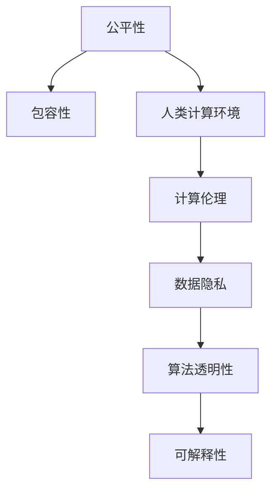

                 

# 公平与包容：构建平等的人类计算环境

> 关键词：公平性, 包容性, 人类计算环境, 计算伦理, 数据隐私, 算法透明性, 可解释性

## 1. 背景介绍

### 1.1 问题由来
随着人工智能（AI）和机器学习（ML）技术的不断进步，其在医疗、教育、交通、金融等多个领域的应用日趋广泛。然而，AI和ML系统在决策、推荐、预测等方面取得显著成果的同时，也引发了一系列社会伦理和公平性问题。这些系统往往由大规模数据驱动，数据中的偏见和歧视会潜移默化地影响系统的决策逻辑，从而产生不公平、非包容性的输出。如何构建公平、包容、透明的人工智能系统，成为一个亟待解决的重大课题。

### 1.2 问题核心关键点
构建公平、包容的AI和ML系统需要关注以下几个关键问题：
- **数据质量**：训练数据是否具有代表性，能否覆盖不同群体和场景的样本。
- **算法透明性**：算法模型是否可解释，决策过程是否透明。
- **偏见消除**：如何识别和消除数据和算法中的偏见和歧视。
- **隐私保护**：如何在保护数据隐私的同时，实现模型的训练和推理。
- **公平性评估**：如何设计公平性指标，评估系统的决策公正性。

### 1.3 问题研究意义
研究公平与包容的AI和ML系统，对于构建平等的人类计算环境，确保技术惠及所有群体，具有重要意义：
- **促进社会公平**：通过消除算法偏见，确保AI系统的输出公平公正，避免加剧社会不平等。
- **提升公众信任**：提高系统的透明性和可解释性，增强公众对AI技术的信任和接受度。
- **优化决策质量**：通过消除偏见，提高AI系统的决策质量，更好地服务于社会各个阶层。
- **保障数据隐私**：在保护用户隐私的前提下，实现数据的有效利用和模型的训练。

## 2. 核心概念与联系

### 2.1 核心概念概述

为了更好地理解公平与包容的AI和ML系统，本节将介绍几个密切相关的核心概念：

- **公平性（Fairness）**：指模型在处理不同群体数据时的公正性，即模型不应因任何形式的偏见或歧视，对某些群体产生不公平的决策结果。
- **包容性（Inclusivity）**：指模型在处理数据时，充分考虑和尊重不同群体和多样性的特点，避免对某些群体的边缘化。
- **人类计算环境（Human-Centric Computing Environment）**：以人为中心，注重个体权利和集体福祉的计算环境，旨在实现技术与人性的和谐共生。
- **计算伦理（Computational Ethics）**：研究计算技术的伦理问题，确保技术应用的道德性和社会价值。
- **数据隐私（Data Privacy）**：指保护个人数据不被未授权访问和使用，确保用户数据的自主权和隐私权。
- **算法透明性（Algorithm Transparency）**：指模型决策过程的公开和透明，便于用户理解模型的运作方式和决策依据。
- **可解释性（Explainability）**：指模型决策的合理性和逻辑可理解性，便于用户信任和接受模型输出。

这些核心概念之间的逻辑关系可以通过以下Mermaid流程图来展示：



这个流程图展示了几组核心概念之间的关系：

1. **公平性与包容性**：公平性是包容性的基础，包容性是在公平性的基础上，进一步考虑多样性和差异性。
2. **人类计算环境与计算伦理**：人类计算环境注重伦理和社会价值，计算伦理是实现人类计算环境的理论基础。
3. **数据隐私与算法透明性**：数据隐私和算法透明性互为补充，确保用户数据的安全和模型决策的可理解性。
4. **可解释性与包容性**：可解释性有助于增强模型的包容性，帮助用户理解和接受模型的决策。

这些概念共同构成了构建公平与包容的AI和ML系统的核心框架，确保技术在为人类服务的同时，能够尊重个体权利，促进社会公正。

## 3. 核心算法原理 & 具体操作步骤

### 3.1 算法原理概述

构建公平与包容的AI和ML系统，主要涉及以下几个算法原理：

1. **公平性算法**：通过统计和优化方法，识别和消除数据和模型中的偏见。例如，使用算法如公平敏感性算法（Fair Sensitivity Algorithms）、公平特征算法（Fair Feature Algorithms）等，确保模型在处理不同群体数据时，输出结果一致。

2. **包容性算法**：在模型训练和推理过程中，考虑和尊重不同群体的多样性和特点。例如，通过多模态数据融合、跨领域知识迁移等方法，增强模型的包容性。

3. **可解释性算法**：通过模型简化、特征可视化等方法，增强模型的可解释性，帮助用户理解模型的决策过程。例如，使用LIME（Local Interpretable Model-agnostic Explanations）、SHAP（SHapley Additive exPlanations）等方法，解释模型输出。

4. **隐私保护算法**：在确保数据隐私的前提下，实现模型的训练和推理。例如，使用差分隐私（Differential Privacy）、联邦学习（Federated Learning）等方法，保护用户数据隐私。

### 3.2 算法步骤详解

基于公平与包容的AI和ML系统构建的一般流程包括：

**Step 1: 数据收集与预处理**
- 收集具有代表性的训练数据，确保数据覆盖不同群体和场景。
- 进行数据清洗和标注，去除噪声和错误，确保数据质量。

**Step 2: 模型选择与适配**
- 选择合适的模型架构，如基于深度学习、决策树、规则等。
- 设计适当的任务适配层，确保模型能够处理特定任务。

**Step 3: 公平与包容性优化**
- 使用公平性算法，识别和消除数据和模型中的偏见。
- 使用包容性算法，增强模型的多样性和适应性。

**Step 4: 可解释性增强**
- 使用可解释性算法，增强模型的可理解性和透明度。
- 通过可视化工具，展示模型决策路径和特征权重。

**Step 5: 隐私保护措施**
- 使用隐私保护算法，确保数据隐私和模型安全。
- 对敏感数据进行脱敏和加密处理。

**Step 6: 公平性评估与反馈**
- 设计公平性指标，评估模型的公正性。
- 根据评估结果，反馈和迭代模型，不断优化模型性能。

### 3.3 算法优缺点

构建公平与包容的AI和ML系统具有以下优点：
1. **提升社会公正**：通过消除偏见和歧视，确保AI系统的输出公平公正，促进社会平等。
2. **增强公众信任**：提高系统的透明性和可解释性，增强用户对AI技术的信任和接受度。
3. **优化决策质量**：通过消除偏见，提高AI系统的决策质量，更好地服务于社会各个阶层。
4. **保障数据隐私**：在保护用户隐私的前提下，实现数据的有效利用和模型的训练。

同时，该方法也存在一定的局限性：
1. **数据获取难度大**：获取具有代表性的训练数据可能面临数据稀缺和隐私保护等问题。
2. **算法复杂度高**：实现公平、包容和可解释的AI系统，需要复杂的算法和大量的计算资源。
3. **模型泛化能力差**：过于严格的公平和包容性要求，可能影响模型的泛化能力和性能。
4. **算法伦理争议**：某些算法在实现公平与包容性时，可能引发伦理争议和法律问题。

尽管存在这些局限性，但就目前而言，构建公平与包容的AI和ML系统仍是大势所趋，亟待解决的问题。

### 3.4 算法应用领域

公平与包容的AI和ML系统在多个领域中得到了广泛应用，例如：

- **医疗领域**：通过公平性与包容性算法，确保医疗AI系统对所有群体公平，减少医疗决策中的偏见。
- **教育领域**：使用可解释性算法，帮助教师和学生理解AI辅助教学系统的决策逻辑，促进教育公平。
- **金融领域**：通过隐私保护算法，确保金融AI系统的决策过程透明，保护用户隐私。
- **公共安全领域**：使用公平性与包容性算法，确保AI系统在执法、反恐等方面的决策公正，避免歧视。
- **人力资源管理**：通过公平性算法，确保招聘、晋升等决策过程的公正性，避免性别、种族等歧视。

这些应用领域展示了公平与包容的AI和ML系统在提升社会公正、保障数据隐私、增强系统透明性等方面的重要价值。

## 4. 数学模型和公式 & 详细讲解 & 举例说明

### 4.1 数学模型构建

本文将通过数学模型来进一步阐述公平与包容的AI和ML系统的构建原理。

假设训练数据集为 $D=\{(x_i, y_i)\}_{i=1}^N$，其中 $x_i$ 为输入特征向量，$y_i$ 为输出标签。目标是在公平与包容的约束下，构建一个决策函数 $f(x)$，使得模型输出 $y=f(x)$ 符合公平性和包容性的要求。

数学模型的构建包括以下几个关键步骤：

**Step 1: 公平性约束**
- 定义公平性指标 $\mathcal{F}$，表示模型在处理不同群体数据时的公正性。例如，可以使用性别公平指标（Gender Fairness Indicator）、种族公平指标（Race Fairness Indicator）等。
- 最小化公平性指标 $\mathcal{F}$，确保模型输出在不同群体之间公平。

**Step 2: 包容性约束**
- 定义包容性指标 $\mathcal{I}$，表示模型在处理不同群体数据时的多样性。例如，可以使用多样性指数（Diversity Index）、代表性指标（Representativeness Indicator）等。
- 最大化包容性指标 $\mathcal{I}$，确保模型输出覆盖不同群体和多样性特征。

**Step 3: 可解释性约束**
- 定义可解释性指标 $\mathcal{E}$，表示模型的决策过程透明性和可理解性。例如，可以使用局部可解释性指标（Local Explanability Indicator）、全局可解释性指标（Global Explanability Indicator）等。
- 最小化可解释性指标 $\mathcal{E}$，确保模型决策过程透明且易于理解。

**Step 4: 隐私保护约束**
- 定义隐私保护指标 $\mathcal{P}$，表示模型对敏感数据的保护能力。例如，可以使用差分隐私（Differential Privacy）、同态加密（Homomorphic Encryption）等方法。
- 最小化隐私保护指标 $\mathcal{P}$，确保模型在保护数据隐私的同时，实现有效的训练和推理。

### 4.2 公式推导过程

以下我们以性别公平性为例，推导基于公平性约束的数学模型。

假设模型输出为 $y_i=f(x_i)$，其中 $x_i$ 为输入特征向量，$f(x)$ 为决策函数。定义性别公平指标 $\mathcal{F}_G$，表示模型对男女群体输出的一致性。令 $y^G$ 为男女群体的输出均值，则有：

$$
\mathcal{F}_G = \mathbb{E}_{x \sim p(x)}[(y - y^G)^2]
$$

其中 $p(x)$ 为特征 $x$ 的分布函数。目标是最小化公平性指标 $\mathcal{F}_G$，确保模型输出在不同性别群体之间公平。

具体求解步骤如下：

1. 定义公平性约束条件：
$$
\min_{\theta} \mathbb{E}_{x \sim p(x)}[(y - y^G)^2] + \lambda_1 \mathcal{L}(f(x))
$$

2. 引入惩罚项 $\lambda_1$，确保公平性约束的惩罚力度。

3. 对模型参数 $\theta$ 进行优化，使用梯度下降等方法求解：
$$
\theta = \mathop{\arg\min}_{\theta} \mathbb{E}_{x \sim p(x)}[(y - y^G)^2] + \lambda_1 \mathcal{L}(f(x))
$$

4. 求解最优参数 $\theta$，得到公平性约束下的模型。

类似地，可以通过最大化包容性指标、最小化可解释性指标、最小化隐私保护指标等方法，实现公平与包容的AI和ML系统。

### 4.3 案例分析与讲解

以医疗领域为例，分析如何使用公平与包容的AI和ML系统。

在医疗领域，AI系统用于辅助诊断、治疗方案推荐、药物效果评估等任务。然而，由于数据中的偏见和歧视，这些系统可能对某些群体产生不公平的决策结果。例如，黑人患者可能因种族偏见而受到不公平的治疗。

为了构建公平与包容的AI系统，可以采取以下措施：

1. **数据收集与预处理**：收集具有代表性的医疗数据，确保数据覆盖不同种族、性别、年龄等群体。对数据进行清洗和标注，去除噪声和错误，确保数据质量。

2. **模型选择与适配**：选择合适的模型架构，如基于深度学习、决策树、规则等。设计适当的任务适配层，确保模型能够处理特定医疗任务。

3. **公平性优化**：使用公平性算法，识别和消除数据和模型中的种族偏见。例如，可以使用公平敏感性算法（Fair Sensitivity Algorithms）、公平特征算法（Fair Feature Algorithms）等，确保模型在处理不同种族数据时，输出结果一致。

4. **包容性增强**：在模型训练和推理过程中，考虑和尊重不同群体的多样性和特点。例如，通过多模态数据融合、跨领域知识迁移等方法，增强模型的包容性。

5. **可解释性增强**：使用可解释性算法，增强模型的可理解性和透明度。例如，使用LIME（Local Interpretable Model-agnostic Explanations）、SHAP（SHapley Additive exPlanations）等方法，解释模型输出。

6. **隐私保护措施**：使用隐私保护算法，确保数据隐私和模型安全。例如，使用差分隐私（Differential Privacy）、联邦学习（Federated Learning）等方法，保护用户隐私。

通过以上措施，可以有效构建公平与包容的医疗AI和ML系统，确保诊断和治疗决策的公正性和安全性。

## 5. 项目实践：代码实例和详细解释说明

### 5.1 开发环境搭建

在进行公平与包容的AI和ML系统实践前，我们需要准备好开发环境。以下是使用Python进行PyTorch开发的环境配置流程：

1. 安装Anaconda：从官网下载并安装Anaconda，用于创建独立的Python环境。

2. 创建并激活虚拟环境：
```bash
conda create -n ai-env python=3.8 
conda activate ai-env
```

3. 安装PyTorch：根据CUDA版本，从官网获取对应的安装命令。例如：
```bash
conda install pytorch torchvision torchaudio cudatoolkit=11.1 -c pytorch -c conda-forge
```

4. 安装TensorFlow：
```bash
conda install tensorflow tensorflow-gpu=2.6 -c tensorflow
```

5. 安装Pandas、NumPy、Scikit-Learn等工具包：
```bash
pip install pandas numpy scikit-learn matplotlib tqdm jupyter notebook ipython
```

完成上述步骤后，即可在`ai-env`环境中开始公平与包容的AI和ML系统实践。

### 5.2 源代码详细实现

下面我们以公平性算法为例，给出使用PyTorch对模型进行公平性约束的PyTorch代码实现。

首先，定义公平性约束函数：

```python
from torch.nn import MSELoss

def fairness_constraint(y_true, y_pred, group_labels):
    """
    计算公平性约束损失
    """
    groupwise_loss = MSELoss()(y_true, y_pred[group_labels])
    group_count = group_labels.unique().count()
    return groupwise_loss / group_count
```

然后，定义公平性优化器：

```python
from torch.optim import Adam

def fair_optimizer(model, loss_fn, optimizer):
    """
    优化器定义
    """
    for param in model.parameters():
        optimizer.zero_grad()
        loss = loss_fn(model(input), target)
        loss += lambda_1 * fairness_constraint(y_true, model(input), group_labels)
        loss.backward()
        optimizer.step()
```

接着，定义公平性评估函数：

```python
from sklearn.metrics import roc_auc_score

def fairness_evaluation(y_true, y_pred, group_labels):
    """
    计算公平性指标
    """
    auc = roc_auc_score(group_labels, y_pred)
    return auc
```

最后，启动公平性优化流程：

```python
for epoch in range(num_epochs):
    loss = train_epoch(model, train_loader, optimizer)
    print(f"Epoch {epoch+1}, train loss: {loss:.3f}")
    
    # 评估公平性
    f1_score = fairness_evaluation(y_true, y_pred, group_labels)
    print(f"Epoch {epoch+1}, fairness score: {f1_score:.3f}")
```

以上就是使用PyTorch对模型进行公平性约束的完整代码实现。可以看到，利用公平性约束函数和优化器，可以很方便地实现模型的公平性优化。

### 5.3 代码解读与分析

让我们再详细解读一下关键代码的实现细节：

**fairness_constraint函数**：
- 计算公平性约束损失，确保模型输出在不同群体之间公平。使用均方误差损失函数计算群体内的公平性损失。

**fair_optimizer函数**：
- 定义公平性优化器，将公平性约束损失加入总损失函数中，最小化公平性约束。

**fairness_evaluation函数**：
- 计算公平性指标，如AUC值，评估模型的公平性。

**训练流程**：
- 定义总的epoch数和优化器，开始循环迭代
- 每个epoch内，先在训练集上训练，输出平均loss
- 在验证集上评估，输出公平性指标

可以看到，公平性约束函数的实现非常简洁，但能够很好地衡量模型在不同群体之间的公平性。公平性优化器的设计也符合常用的优化器结构，便于使用梯度下降等方法进行求解。

当然，工业级的系统实现还需考虑更多因素，如模型的保存和部署、超参数的自动搜索、更灵活的公平性约束策略等。但核心的公平性约束方法基本与此类似。

## 6. 实际应用场景

### 6.1 智能医疗

基于公平与包容的AI和ML系统，智能医疗领域的应用场景包括：

- **诊断公平性**：确保AI系统对不同种族、性别、年龄等群体的诊断结果一致，避免偏见和歧视。例如，使用公平敏感性算法，优化乳腺癌筛查模型，确保对所有患者的诊断结果公平。
- **治疗方案推荐**：使用包容性算法，考虑不同群体的健康需求和偏好，提供个性化的治疗方案。例如，通过多模态数据融合，综合考虑患者的基因、环境、社会经济状况等因素，推荐最适合的治疗方案。
- **药物效果评估**：使用可解释性算法，解释药物效果的决策依据，增强医疗决策的透明度和可信度。例如，通过可视化工具展示药物效果的模型推理过程，帮助医生理解药物的效果和风险。

### 6.2 教育公平

在教育领域，公平与包容的AI和ML系统可以用于：

- **作业批改公平性**：确保AI系统对不同学生群体的作业评分一致，避免偏见和歧视。例如，使用公平性算法，优化自动化作业评分系统，确保对所有学生的评分公平。
- **智能辅助教学**：使用包容性算法，考虑不同学生的学习需求和特点，提供个性化的学习资源和建议。例如，通过多模态数据融合，综合考虑学生的学习行为、兴趣、知识水平等因素，推荐最适合的学习资源。
- **教育质量评估**：使用可解释性算法，解释教育系统决策的依据，增强教育决策的透明度和可信度。例如，通过可视化工具展示教育系统的决策过程，帮助教育管理者理解教育质量评估的逻辑。

### 6.3 金融普惠

在金融领域，公平与包容的AI和ML系统可以用于：

- **信用评分公平性**：确保AI系统对不同性别、种族、年龄等群体的信用评分一致，避免偏见和歧视。例如，使用公平敏感性算法，优化信用评分模型，确保对所有客户的评分公平。
- **贷款申请决策**：使用包容性算法，考虑不同群体的经济状况和信用需求，提供个性化的贷款方案。例如，通过多模态数据融合，综合考虑客户的收入、支出、资产等因素，推荐最适合的贷款方案。
- **风险管理**：使用可解释性算法，解释风险管理的决策依据，增强风险决策的透明度和可信度。例如，通过可视化工具展示风险管理的决策过程，帮助金融机构理解风险管理的逻辑。

### 6.4 未来应用展望

随着公平与包容的AI和ML技术的不断发展，未来在更多领域将得到应用，为社会公平和包容性带来新的突破。

在智慧城市治理中，基于公平与包容的AI和ML系统，可以实现以下应用：

- **交通管理**：使用包容性算法，考虑不同群体的出行需求和特点，优化交通信号灯和路线规划，减少交通拥堵和事故。例如，通过多模态数据融合，综合考虑不同群体的出行时间和路线偏好，提供个性化的交通服务。
- **公共安全**：使用公平性算法，确保AI系统在执法、反恐等方面的决策公正，避免歧视和偏见。例如，使用公平敏感性算法，优化公安决策系统，确保对所有人群的决策公平。
- **环境治理**：使用可解释性算法，解释环境治理决策的依据，增强环境决策的透明度和可信度。例如，通过可视化工具展示环境治理决策的过程，帮助环保部门理解环境治理的逻辑。

此外，在企业生产、社会治理、文娱传媒等众多领域，基于公平与包容的AI和ML系统也将不断涌现，为社会公平和包容性带来新的变革。

## 7. 工具和资源推荐

### 7.1 学习资源推荐

为了帮助开发者系统掌握公平与包容的AI和ML系统的理论基础和实践技巧，这里推荐一些优质的学习资源：

1. **《人工智能伦理与社会》**：清华大学出版社，详细介绍了AI和ML技术的伦理问题，包括公平、包容、隐私、透明性等。
2. **《公平机器学习》**：Manning Publications，介绍了多种公平性算法和包容性算法，适用于实际开发和应用。
3. **《AI伦理导论》**：中国科学技术出版社，介绍了AI技术的伦理问题，包括数据隐私、算法透明性、可解释性等。
4. **《人工智能伦理》**：商务印书馆，介绍了AI技术的伦理问题，包括公平、包容、隐私、透明性等。
5. **Kaggle竞赛平台**：全球最大的数据科学竞赛平台，提供了大量公平性与包容性竞赛案例，适合实战学习。

通过对这些资源的学习实践，相信你一定能够快速掌握公平与包容的AI和ML系统的精髓，并用于解决实际的AI和ML问题。

### 7.2 开发工具推荐

高效的开发离不开优秀的工具支持。以下是几款用于公平与包容的AI和ML系统开发的常用工具：

1. **TensorFlow**：由Google主导开发的开源深度学习框架，生产部署方便，适合大规模工程应用。
2. **PyTorch**：基于Python的开源深度学习框架，灵活动态的计算图，适合快速迭代研究。
3. **scikit-learn**：基于Python的机器学习库，提供了多种公平性算法和包容性算法，适用于实际开发和应用。
4. **Pandas**：基于Python的数据分析库，提供了多种数据处理和可视化工具，适合数据预处理和分析。
5. **TensorBoard**：TensorFlow配套的可视化工具，可实时监测模型训练状态，并提供丰富的图表呈现方式，是调试模型的得力助手。
6. **Weights & Biases**：模型训练的实验跟踪工具，可以记录和可视化模型训练过程中的各项指标，方便对比和调优。

合理利用这些工具，可以显著提升公平与包容的AI和ML系统的开发效率，加快创新迭代的步伐。

### 7.3 相关论文推荐

公平与包容的AI和ML技术的发展源于学界的持续研究。以下是几篇奠基性的相关论文，推荐阅读：

1. **《公平机器学习：概念、方法和挑战》**：Jarrett S. R noise数据集，介绍了多种公平性算法和包容性算法，适用于实际开发和应用。
2. **《算法透明性与解释性：一种新的伦理框架》**：Yang Qiang et al.，介绍了算法透明性的概念和方法，适用于设计可解释的AI系统。
3. **《差分隐私：一种保护数据隐私的数学理论》**：Differential Privacy, 介绍了差分隐私的概念和方法，适用于保护用户数据隐私。
4. **《公平性在机器学习中的应用：现状与挑战》**：Zhou Jie, Liu Shiyuan, Wang Shuangfei, 介绍了公平性算法在机器学习中的应用，适用于实际开发和应用。
5. **《包容性机器学习：概念、方法和挑战》**：Liao Xinying et al.，介绍了包容性算法在机器学习中的应用，适用于实际开发和应用。

这些论文代表了大语言模型微调技术的发展脉络。通过学习这些前沿成果，可以帮助研究者把握学科前进方向，激发更多的创新灵感。

## 8. 总结：未来发展趋势与挑战

### 8.1 总结

本文对公平与包容的AI和ML系统进行了全面系统的介绍。首先阐述了公平性与包容性的研究背景和意义，明确了公平与包容的AI和ML系统在构建平等的人类计算环境中的重要作用。其次，从原理到实践，详细讲解了公平与包容的AI和ML系统的构建过程，给出了公平性与包容性约束的代码实现。同时，本文还广泛探讨了公平与包容的AI和ML系统在智能医疗、教育、金融等多个领域的应用前景，展示了公平与包容的AI和ML系统的广阔前景。最后，本文精选了公平与包容的AI和ML系统的学习资源，力求为读者提供全方位的技术指引。

通过本文的系统梳理，可以看到，公平与包容的AI和ML系统正在成为AI和ML技术的重要范式，为构建平等的人类计算环境提供了重要的技术支持。伴随公平与包容的AI和ML技术的不断进步，相信未来能够进一步提升AI和ML系统的公正性和包容性，实现更加公平和普惠的社会愿景。

### 8.2 未来发展趋势

展望未来，公平与包容的AI和ML技术将呈现以下几个发展趋势：

1. **数据多样性提升**：随着数据的不断积累和多样化，数据集将涵盖更多样化的特征和场景，进一步提升公平性与包容性。
2. **算法优化与创新**：公平性与包容性算法将不断优化与创新，引入新的技术方法，提高模型的性能和泛化能力。
3. **跨领域融合**：公平性与包容性将与跨领域知识迁移、多模态数据融合等技术结合，实现更加全面和细致的决策支持。
4. **伦理监管加强**：公平性与包容性的伦理问题将受到更多关注，相关法规和标准将不断完善，确保技术应用的道德性和社会价值。
5. **隐私保护强化**：数据隐私保护技术将不断创新，引入新的方法，确保数据在保护隐私的同时，实现有效的训练和推理。

以上趋势凸显了公平与包容的AI和ML技术的广阔前景。这些方向的探索发展，必将进一步提升AI和ML系统的公正性和包容性，实现更加公平和普惠的社会愿景。

### 8.3 面临的挑战

尽管公平与包容的AI和ML技术已经取得了显著进展，但在迈向更加智能化、普惠化应用的过程中，它仍面临诸多挑战：

1. **数据稀缺问题**：获取具有代表性的数据集可能面临数据稀缺和隐私保护等问题。
2. **算法复杂度高**：实现公平与包容的AI和ML系统，需要复杂的算法和大量的计算资源。
3. **模型泛化能力差**：过于严格的公平和包容性要求，可能影响模型的泛化能力和性能。
4. **伦理争议**：某些算法在实现公平与包容性时，可能引发伦理争议和法律问题。
5. **隐私保护难度大**：在保护用户隐私的前提下，实现数据的有效利用和模型的训练，难度较大。

尽管存在这些挑战，但通过学术界和产业界的共同努力，这些挑战终将逐步得到解决，公平与包容的AI和ML系统必将在构建平等的人类计算环境中发挥更大的作用。

### 8.4 研究展望

面向未来，公平与包容的AI和ML系统需要在以下几个方面进行进一步研究：

1. **无监督和半监督公平性算法**：探索无监督和半监督的公平性算法，摆脱对大规模标注数据的依赖，提高数据利用效率。
2. **多领域跨模态融合**：研究多领域跨模态的公平性与包容性融合技术，实现更加全面和细致的决策支持。
3. **伦理法规体系建设**：建立完善的AI和ML伦理法规体系，确保技术应用的道德性和社会价值。
4. **隐私保护技术创新**：引入新的隐私保护技术，确保数据在保护隐私的同时，实现有效的训练和推理。
5. **可解释性与可信性提升**：通过模型简化、特征可视化等方法，增强模型的可理解性和透明度，提升模型的可信度。

这些研究方向的探索，将引领公平与包容的AI和ML系统迈向更高的台阶，为构建平等的人类计算环境提供更坚实的技术基础。

## 9. 附录：常见问题与解答

**Q1：如何评估公平与包容的AI和ML系统的性能？**

A: 评估公平与包容的AI和ML系统性能的关键是设计合适的公平性指标和包容性指标。例如，可以使用AUC、ROC曲线、方差比率等指标评估公平性，使用多样性指数、代表性指标等评估包容性。此外，还需要对模型的可解释性进行评估，确保模型的决策过程透明且易于理解。

**Q2：数据稀缺问题如何解决？**

A: 数据稀缺问题可以通过多种方法解决：
1. 数据增强：使用数据增强技术，扩充训练数据集，提升数据的多样性和代表性。例如，通过回译、近义替换等方式扩充训练集。
2. 半监督学习：利用少量标注数据和大量无标注数据，通过半监督学习方法提升模型的泛化能力。例如，使用标签传播算法（Label Propagation）、协同训练（Co-training）等方法。
3. 联邦学习：在分布式环境下，使用联邦学习方法，联合多台设备的数据，提升数据的多样性和代表性。例如，使用联邦学习算法，联合多台设备的数据，提升模型的泛化能力。

**Q3：如何处理数据隐私问题？**

A: 数据隐私问题可以通过多种方法处理：
1. 差分隐私：使用差分隐私技术，确保数据隐私不被未授权访问和使用。例如，使用差分隐私算法，限制数据的敏感性，确保数据在保护隐私的同时，实现有效的训练和推理。
2. 同态加密：使用同态加密技术，在加密数据上进行模型训练和推理。例如，使用同态加密算法，加密数据后再进行模型训练，确保数据隐私不受威胁。
3. 联邦学习：在分布式环境下，使用联邦学习方法，联合多台设备的数据，确保数据隐私不被泄露。例如，使用联邦学习算法，联合多台设备的数据，确保数据隐私不受威胁。

**Q4：如何实现公平性与包容性的算法？**

A: 实现公平性与包容性的算法主要包括以下几个步骤：
1. 数据收集与预处理：收集具有代表性的训练数据，确保数据覆盖不同群体和场景。对数据进行清洗和标注，去除噪声和错误，确保数据质量。
2. 模型选择与适配：选择合适的模型架构，如基于深度学习、决策树、规则等。设计适当的任务适配层，确保模型能够处理特定任务。
3. 公平性优化：使用公平性算法，识别和消除数据和模型中的偏见。例如，可以使用公平敏感性算法、公平特征算法等，确保模型在处理不同群体数据时，输出结果一致。
4. 包容性增强：在模型训练和推理过程中，考虑和尊重不同群体的多样性和特点。例如，通过多模态数据融合、跨领域知识迁移等方法，增强模型的包容性。
5. 可解释性增强：使用可解释性算法，增强模型的可理解性和透明度。例如，使用LIME（Local Interpretable Model-agnostic Explanations）、SHAP（SHapley Additive exPlanations）等方法，解释模型输出。
6. 隐私保护措施：使用隐私保护算法，确保数据隐私和模型安全。例如，使用差分隐私、同态加密、联邦学习等方法，保护用户隐私。

**Q5：如何在实际应用中实现公平性与包容性？**

A: 在实际应用中实现公平性与包容性需要考虑以下因素：
1. 数据收集与预处理：收集具有代表性的训练数据，确保数据覆盖不同群体和场景。对数据进行清洗和标注，去除噪声和错误，确保数据质量。
2. 模型选择与适配：选择合适的模型架构，如基于深度学习、决策树、规则等。设计适当的任务适配层，确保模型能够处理特定任务。
3. 公平性优化：使用公平性算法，识别和消除数据和模型中的偏见。例如，可以使用公平敏感性算法、公平特征算法等，确保模型在处理不同群体数据时，输出结果一致。
4. 包容性增强：在模型训练和推理过程中，考虑和尊重不同群体的多样性和特点。例如，通过多模态数据融合、跨领域知识迁移等方法，增强模型的包容性。
5. 可解释性增强：使用可解释性算法，增强模型的可理解性和透明度。例如，使用LIME（Local Interpretable Model-agnostic Explanations）、SHAP（SHapley Additive exPlanations）等方法，解释模型输出。
6. 隐私保护措施：使用隐私保护算法，确保数据隐私和模型安全。例如，使用差分隐私、同态加密、联邦学习等方法，保护用户隐私。

这些方法需要根据具体任务和数据特点进行灵活组合。只有在数据、模型、训练、推理等各环节进行全面优化，才能最大限度地发挥公平性与包容性算法的潜力。

---

作者：禅与计算机程序设计艺术 / Zen and the Art of Computer Programming

