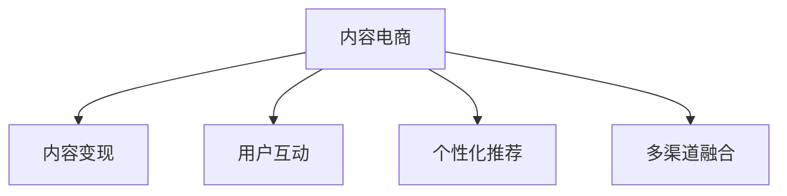

                 

# 内容电商创业：内容变现的新思路

在当今数字化时代，电商市场不断创新和演变。传统的电商模式依赖于销量和流量，而内容电商则侧重于通过优质的内容吸引和转化用户。内容电商不仅能够提升用户体验，还能带来更多的品牌效应和用户忠诚度。本文将从内容电商的兴起、核心概念、算法原理和操作步骤、数学模型及公式、项目实践、实际应用场景、工具和资源推荐、未来发展趋势与挑战以及附录等维度，深入剖析内容电商创业的新思路。

## 1. 背景介绍

### 1.1 问题由来
随着移动互联网的普及和社交媒体的兴起，人们对于信息消费的需求日益增长，对于传统电商模式的依赖也在逐渐减弱。内容电商的兴起正是为了迎合这一趋势，通过优质的内容吸引用户，提供个性化、沉浸式的购物体验。相较于传统的流量驱动方式，内容电商更注重内容价值和用户体验，更加符合现代消费者的购物习惯。

### 1.2 问题核心关键点
内容电商的核心在于内容与电商的结合，通过内容的吸引力和转化力，实现电商销售的目标。其关键点包括：
1. **内容质量**：高质量、有吸引力的内容是内容电商成功的基石。
2. **用户互动**：通过互动和参与，增强用户黏性。
3. **个性化推荐**：根据用户兴趣和行为进行个性化推荐，提升转化率。
4. **多渠道融合**：结合线上线下，覆盖多渠道内容分发。

### 1.3 问题研究意义
内容电商作为一种新兴的电商模式，通过优质内容的输出，能够提升用户满意度和品牌忠诚度，降低营销成本，带来更多的流量和转化。研究内容电商的创业思路，有助于企业把握市场趋势，提升竞争力，实现快速增长。

## 2. 核心概念与联系

### 2.1 核心概念概述

为更好地理解内容电商的创业思路，本节将介绍几个密切相关的核心概念：

- **内容电商**：指利用优质内容吸引用户，提供个性化、沉浸式购物体验的电商模式。
- **内容变现**：通过内容输出获得流量和转化，实现商业价值。
- **用户互动**：指通过评论、点赞、分享等方式，增加用户参与和黏性。
- **个性化推荐**：根据用户行为和兴趣进行内容推荐，提高转化率。
- **多渠道融合**：结合线上线下，覆盖更多用户，提升用户覆盖率。

这些核心概念之间的逻辑关系可以通过以下Mermaid流程图来展示：



这个流程图展示内容电商的核心概念及其之间的关系：

1. 内容电商通过内容输出吸引用户。
2. 内容变现通过用户互动和个性化推荐实现流量和转化。
3. 多渠道融合覆盖更多用户，提升覆盖率。

这些概念共同构成了内容电商的商业模式，使其能够在竞争激烈的电商市场中脱颖而出。

## 3. 核心算法原理 & 具体操作步骤
### 3.1 算法原理概述

内容电商的运营主要依赖于以下几个核心算法：

- **内容推荐算法**：通过用户行为和兴趣进行内容推荐，提升用户体验。
- **个性化定价算法**：根据用户支付意愿进行个性化定价，提升转化率。
- **用户行为分析算法**：通过用户互动数据进行行为分析，优化内容和推荐策略。
- **多渠道营销算法**：结合线上线下渠道进行多渠道营销，提升用户覆盖率。

这些算法通过深度学习等技术实现，能够不断优化内容和电商运营策略，提升用户体验和转化率。

### 3.2 算法步骤详解

内容电商的运营主要包括以下几个关键步骤：

**Step 1: 内容采集与整理**
- 采集优质内容，包括文字、图片、视频等。
- 对内容进行整理、分类，建立内容库。

**Step 2: 用户行为数据采集**
- 通过网站、APP等平台，收集用户行为数据。
- 分析用户行为数据，了解用户兴趣和需求。

**Step 3: 个性化推荐系统开发**
- 根据用户行为数据，建立个性化推荐模型。
- 结合内容特征和用户行为数据，生成个性化推荐结果。

**Step 4: 个性化定价策略制定**
- 通过用户行为分析，了解用户支付意愿。
- 根据支付意愿，制定个性化定价策略。

**Step 5: 多渠道营销策略制定**
- 结合线上线下渠道，制定多渠道营销策略。
- 优化渠道配置，提升覆盖率和用户转化率。

**Step 6: 内容电商运营监测与优化**
- 监测内容电商运营数据，如流量、转化率等。
- 根据监测数据，不断优化内容和运营策略。

### 3.3 算法优缺点

内容电商的算法具有以下优点：

1. **提升用户体验**：通过个性化推荐和互动，提升用户满意度和忠诚度。
2. **提高转化率**：个性化定价和推荐策略，能够提高用户的购买转化率。
3. **数据驱动决策**：通过用户行为分析，优化内容推荐和定价策略。

同时，该算法也存在一定的局限性：

1. **数据隐私问题**：用户行为数据的采集和分析可能涉及隐私问题，需要加强用户数据保护。
2. **推荐算法复杂度**：推荐算法需要处理大量的用户行为数据，计算复杂度较高。
3. **用户行为多样性**：不同用户的行为和偏好差异较大，推荐算法需要适应不同用户群体的需求。

尽管存在这些局限性，但就目前而言，内容电商的算法方法仍是实现内容变现的有效手段。未来相关研究的重点在于如何进一步提高算法的精度和效率，同时兼顾隐私和公平性等因素。

### 3.4 算法应用领域

内容电商的算法在多个领域得到了广泛应用，例如：

- **社交电商**：如抖音、快手等平台，通过视频内容吸引用户，实现电商销售。
- **订阅电商**：如Netflix、Amazon Prime等平台，通过优质内容订阅，提升用户忠诚度。
- **品牌电商**：如LVMH、Gucci等品牌，通过品牌内容营销，提升品牌影响力。
- **专业内容平台**：如Coursera、Udemy等平台，通过专业内容推荐，实现知识变现。

除了上述这些经典应用外，内容电商的算法还广泛应用于在线旅游、健康医疗、教育培训等更多场景中，为各类内容变现提供了新的解决方案。随着算法技术的不断进步，内容电商的应用场景将进一步拓展，为各行各业带来新的商业机会。

## 4. 数学模型和公式 & 详细讲解 & 举例说明

### 4.1 数学模型构建

为了更好地理解内容电商算法的数学模型，本节将介绍几个关键的数学模型和公式：

- **协同过滤推荐算法**：通过用户-物品相似度矩阵进行推荐。
- **基于内容的推荐算法**：根据物品特征进行推荐。
- **深度学习推荐算法**：通过神经网络模型进行推荐。

### 4.2 公式推导过程

以下我们以协同过滤推荐算法为例，推导推荐公式及其梯度计算。

假设用户集为 $U=\{u_1,u_2,\dots,u_n\}$，物品集为 $I=\{i_1,i_2,\dots,i_m\}$，用户 $u_i$ 对物品 $i_j$ 的评分矩阵为 $R \in \mathbb{R}^{n \times m}$。协同过滤推荐算法通过用户 $u_i$ 和物品 $i_j$ 的相似度矩阵 $S \in \mathbb{R}^{n \times m}$ 进行推荐，相似度矩阵 $S$ 的计算公式为：

$$
S_{i,j} = \frac{1}{\sqrt{\sum_{k=1}^n r_{i,k}^2}\sqrt{\sum_{k=1}^m r_{k,j}^2}}\sum_{k=1}^n r_{i,k}r_{k,j}
$$

其中 $r_{i,j}$ 为用户 $u_i$ 对物品 $i_j$ 的评分。

协同过滤推荐算法通过计算用户 $u_i$ 和物品 $i_j$ 的相似度，选取最相似的物品进行推荐。推荐公式为：

$$
\hat{y}_{i,j} = \frac{\sum_{k=1}^m S_{i,k}y_{k,j}}{\sum_{k=1}^m S_{i,k}}
$$

其中 $\hat{y}_{i,j}$ 为物品 $i_j$ 的预测评分，$y_{i,j}$ 为用户 $u_i$ 对物品 $i_j$ 的实际评分。

推荐算法的损失函数为均方误差损失：

$$
\mathcal{L}(\theta) = \frac{1}{2}\sum_{i=1}^n\sum_{j=1}^m(\hat{y}_{i,j}-y_{i,j})^2
$$

其中 $\theta$ 为模型参数，$\hat{y}_{i,j}$ 为模型预测评分。

通过反向传播算法计算损失函数对模型参数的梯度，进行参数更新：

$$
\theta \leftarrow \theta - \eta \nabla_{\theta}\mathcal{L}(\theta)
$$

其中 $\eta$ 为学习率，$\nabla_{\theta}\mathcal{L}(\theta)$ 为损失函数对模型参数的梯度。

### 4.3 案例分析与讲解

下面我们以Netflix的内容推荐算法为例，进行详细讲解。Netflix的内容推荐算法主要基于协同过滤和深度学习两种方法，具体步骤如下：

1. **数据采集**：Netflix通过用户观看历史和评分数据，构建用户-物品评分矩阵。
2. **协同过滤推荐**：利用协同过滤算法，计算用户-物品相似度，推荐用户感兴趣的电影和电视节目。
3. **深度学习推荐**：通过神经网络模型，进一步优化推荐结果，提升推荐精度。
4. **多渠道营销**：结合Netflix官网、移动APP等渠道，进行多渠道营销，提升用户覆盖率和转化率。

Netflix的内容推荐算法能够实现个性化推荐，提升用户满意度和转化率，其背后是强大的数据处理能力和算法技术支持。

## 5. 项目实践：代码实例和详细解释说明
### 5.1 开发环境搭建

在进行内容电商项目实践前，我们需要准备好开发环境。以下是使用Python进行PyTorch开发的环境配置流程：

1. 安装Anaconda：从官网下载并安装Anaconda，用于创建独立的Python环境。

2. 创建并激活虚拟环境：
```bash
conda create -n content-e-commerce python=3.8 
conda activate content-e-commerce
```

3. 安装PyTorch：根据CUDA版本，从官网获取对应的安装命令。例如：
```bash
conda install pytorch torchvision torchaudio cudatoolkit=11.1 -c pytorch -c conda-forge
```

4. 安装TensorBoard：用于可视化模型训练状态和结果。
```bash
pip install tensorboard
```

5. 安装Flask：用于搭建Web服务器，展示推荐结果。
```bash
pip install flask
```

完成上述步骤后，即可在`content-e-commerce`环境中开始内容电商项目实践。

### 5.2 源代码详细实现

下面我们以协同过滤推荐算法为例，给出使用PyTorch进行内容电商推荐系统开发的PyTorch代码实现。

```python
import torch
import torch.nn as nn
import torch.optim as optim
import numpy as np
from sklearn.metrics import mean_squared_error

class协同过滤推荐(nn.Module):
    def __init__(self, n_users, n_items, n_factors=50, n_epochs=100):
        super(协同过滤推荐, self).__init__()
        self.n_users = n_users
        self.n_items = n_items
        self.n_factors = n_factors
        self.factors = nn.Embedding(n_users, n_factors)
        self.item_factors = nn.Embedding(n_items, n_factors)
        self.beta = nn.Parameter(torch.randn(n_factors))
        
    def forward(self, user_idx, item_idx):
        u = self.factors(user_idx)
        v = self.item_factors(item_idx)
        p = torch.matmul(u, v.t()) + self.beta.unsqueeze(0).expand(self.n_users, self.n_factors).t() @ v
        return p
        
    def predict(self, user_idx, item_idx):
        with torch.no_grad():
            p = self(u_idx, item_idx)
            return torch.sigmoid(p)
        
    def loss(self, user_idx, item_idx, rating):
        p = self.predict(user_idx, item_idx)
        loss = nn.BCELoss()(p, rating)
        return loss
        
    def train(self, train_data, test_data, batch_size=100, learning_rate=0.01):
        train_loader = torch.utils.data.DataLoader(train_data, batch_size=batch_size)
        test_loader = torch.utils.data.DataLoader(test_data, batch_size=batch_size)
        optimizer = optim.Adam(self.parameters(), lr=learning_rate)
        for epoch in range(n_epochs):
            for user_idx, item_idx, rating in train_loader:
                optimizer.zero_grad()
                loss = self.loss(user_idx, item_idx, rating)
                loss.backward()
                optimizer.step()
            mse = mean_squared_error(test_data['rating'], self.predict(test_data['user_idx'], test_data['item_idx']))
            print(f'Epoch {epoch+1}, Loss: {loss.item()}, MSE: {mse:.4f}')
```

以上代码实现了基于协同过滤推荐算法的推荐系统，能够根据用户行为数据，预测用户对物品的评分。通过训练优化模型参数，提升推荐精度。

### 5.3 代码解读与分析

让我们再详细解读一下关键代码的实现细节：

**协同过滤推荐类**：
- `__init__`方法：初始化协同过滤模型，包含用户数、物品数、因子数和训练轮数等关键参数。
- `forward`方法：计算用户和物品的相似度，生成推荐评分。
- `predict`方法：根据用户和物品索引，预测评分。
- `loss`方法：计算预测评分与实际评分之间的均方误差损失。
- `train`方法：根据训练数据集，进行模型训练和优化。

**推荐系统实现**：
- 使用PyTorch的`nn.Embedding`实现用户和物品的因子表示。
- 通过矩阵乘法计算用户和物品的相似度，得到预测评分。
- 使用`BCELoss`作为损失函数，进行模型训练。
- 通过均方误差计算预测评分与实际评分之间的误差，输出训练结果。

通过以上代码实现，我们可以构建一个基于协同过滤推荐算法的内容电商推荐系统。在实际应用中，还需要考虑更多因素，如模型评估、用户行为分析、多渠道营销等，进一步优化推荐策略和内容电商运营。

## 6. 实际应用场景
### 6.1 智能推荐系统
内容电商的核心在于推荐系统，智能推荐系统通过个性化推荐，提升用户满意度和转化率。目前，智能推荐系统已经被广泛应用于电商、视频、音乐等各个领域。

在电商领域，智能推荐系统能够根据用户浏览、购买历史和行为数据，推荐符合用户兴趣的商品，提升用户体验和销售额。例如，淘宝、京东等电商平台，通过智能推荐系统，大幅提升了用户购物体验和转化率。

在视频领域，智能推荐系统能够根据用户观影历史和评分数据，推荐符合用户兴趣的视频内容，提升用户黏性和观影时间。例如，Netflix、YouTube等平台，通过智能推荐系统，实现了大规模用户留存和收益增长。

### 6.2 品牌内容营销
品牌内容营销通过优质内容的输出，提升品牌知名度和用户忠诚度。内容电商在这一领域也有广泛应用。

品牌电商通过品牌内容营销，结合产品介绍、品牌故事等，提升用户对品牌的认知和信任。例如，LVMH、Gucci等品牌，通过内容电商平台的品牌内容营销，实现了品牌价值的最大化。

订阅电商通过优质内容订阅，提升用户忠诚度和平台黏性。例如，Netflix、Amazon Prime等平台，通过高质量的视频和文章内容，实现了大规模用户订阅和收入增长。

### 6.3 社交电商
社交电商通过社交平台的内容输出，实现电商销售。内容电商在这一领域也有广泛应用。

社交电商平台通过视频、图片等内容，吸引用户关注和互动，实现电商销售。例如，抖音、快手等平台，通过内容电商模式，实现了大规模用户增长和电商销售。

内容电商通过内容输出，吸引用户关注和互动，实现电商销售。例如，小红书、蘑菇街等平台，通过内容电商模式，实现了大规模用户增长和电商销售。

### 6.4 未来应用展望

随着内容电商的不断发展，未来的应用场景将更加广泛，具体包括：

1. **5G与IoT融合**：随着5G和IoT技术的发展，内容电商将更加注重实时互动和沉浸式体验，实现线上线下的无缝融合。
2. **AI与大数据深度融合**：通过AI与大数据的深度融合，内容电商将能够更好地理解用户需求，实现个性化推荐和定价。
3. **内容电商与区块链结合**：通过区块链技术，内容电商可以实现内容确权和版权保护，提升内容变现的公平性和透明性。
4. **内容电商与增强现实结合**：通过增强现实技术，内容电商可以实现虚拟试穿、试妆等沉浸式体验，提升用户满意度和购买转化率。

## 7. 工具和资源推荐
### 7.1 学习资源推荐

为了帮助开发者系统掌握内容电商的理论基础和实践技巧，这里推荐一些优质的学习资源：

1. 《内容电商：从流量到变现》系列博文：由内容电商专家撰写，深入浅出地介绍了内容电商的原理、方法和应用案例。

2. 《深度学习推荐系统》课程：由斯坦福大学开设的推荐系统课程，系统讲解了推荐算法的原理和实现，适合深度学习初学者。

3. 《内容电商：从用户到变现》书籍：全面介绍了内容电商的运营模式、用户行为分析和推荐算法，适合内容电商从业者。

4. Weights & Biases：模型训练的实验跟踪工具，可以记录和可视化模型训练过程中的各项指标，方便对比和调优。与主流深度学习框架无缝集成。

5. PyTorch官方文档：PyTorch的官方文档，提供了丰富的推荐系统样例和API文档，是实现内容电商推荐系统的必备资料。

通过这些资源的学习实践，相信你一定能够快速掌握内容电商的运营思路，并用于解决实际的推荐系统问题。

### 7.2 开发工具推荐

高效的开发离不开优秀的工具支持。以下是几款用于内容电商推荐系统开发的常用工具：

1. PyTorch：基于Python的开源深度学习框架，灵活动态的计算图，适合快速迭代研究。

2. TensorFlow：由Google主导开发的开源深度学习框架，生产部署方便，适合大规模工程应用。

3. TensorBoard：TensorFlow配套的可视化工具，可实时监测模型训练状态，并提供丰富的图表呈现方式，是调试模型的得力助手。

4. Weights & Biases：模型训练的实验跟踪工具，可以记录和可视化模型训练过程中的各项指标，方便对比和调优。

5. Flask：用于搭建Web服务器，展示推荐结果，适合内容电商推荐系统的可视化展示。

合理利用这些工具，可以显著提升内容电商推荐系统的开发效率，加快创新迭代的步伐。

### 7.3 相关论文推荐

内容电商推荐系统的不断发展，源于学界的持续研究。以下是几篇奠基性的相关论文，推荐阅读：

1. BPR: Bayesian Personalized Ranking from Pairwise Preferences：提出基于贝叶斯方法的协同过滤推荐算法，是协同过滤推荐算法的经典论文。

2. Matrix Factorization Techniques for Recommender Systems：提出基于矩阵分解的推荐算法，是推荐算法的重要研究方向。

3. Deep Matrix Factorization：提出基于深度神经网络的矩阵分解方法，进一步提升了推荐算法的精度和效果。

4. Attention-based Recommender Systems：提出基于注意力机制的推荐算法，能够更好地处理用户多样性和物品多样性。

这些论文代表内容电商推荐系统的研究进展，通过学习这些前沿成果，可以帮助研究者把握学科前进方向，激发更多的创新灵感。

## 8. 总结：未来发展趋势与挑战

### 8.1 总结

本文对内容电商的创业思路进行了全面系统的介绍。首先阐述了内容电商的兴起背景和核心概念，明确了内容电商在提升用户体验、实现电商变现方面的独特价值。其次，从原理到实践，详细讲解了内容电商推荐算法的数学模型和操作步骤，给出了推荐系统开发的完整代码实例。同时，本文还广泛探讨了内容电商在智能推荐、品牌营销、社交电商等多个领域的应用前景，展示了内容电商的广泛应用潜力。此外，本文精选了内容电商推荐系统的学习资源、开发工具和相关论文，力求为读者提供全方位的技术指引。

通过本文的系统梳理，可以看到，内容电商推荐算法通过优质内容输出和个性化推荐，实现了电商销售的提升和用户满意度的增加，具有广阔的市场前景。未来，伴随内容电商技术的不断进步，相信内容电商将在更多领域得到应用，为电商行业带来新的发展机遇。

### 8.2 未来发展趋势

展望未来，内容电商推荐算法将呈现以下几个发展趋势：

1. **数据驱动决策**：通过大数据和深度学习技术，内容电商将能够更好地理解用户需求，实现个性化推荐和定价。
2. **多渠道融合**：结合线上线下渠道，覆盖更多用户，提升用户覆盖率和转化率。
3. **实时化推荐**：通过实时数据采集和处理，实现实时推荐，提升用户体验和转化率。
4. **内容多样化**：通过多模态内容输出，实现图片、视频、音频等多形式内容的推荐，提升用户沉浸式体验。
5. **个性化推荐**：通过深度学习技术，实现更加精准的用户个性化推荐，提升用户满意度和忠诚度。
6. **用户体验优化**：通过优化用户界面和互动方式，提升用户使用体验，实现更好的用户黏性和留存率。

以上趋势凸显了内容电商推荐算法的广阔前景。这些方向的探索发展，必将进一步提升内容电商系统的性能和用户体验，为电商行业带来新的发展机遇。

### 8.3 面临的挑战

尽管内容电商推荐算法已经取得了瞩目成就，但在迈向更加智能化、普适化应用的过程中，它仍面临着诸多挑战：

1. **数据隐私问题**：用户行为数据的采集和分析可能涉及隐私问题，需要加强用户数据保护。
2. **推荐算法复杂度**：推荐算法需要处理大量的用户行为数据，计算复杂度较高。
3. **用户行为多样性**：不同用户的行为和偏好差异较大，推荐算法需要适应不同用户群体的需求。
4. **算法鲁棒性**：推荐算法在面对噪声数据和异常数据时，需要具备一定的鲁棒性，避免误导性推荐。
5. **用户黏性提升**：如何通过内容电商运营策略，提升用户黏性和留存率，仍然是一个重要挑战。

尽管存在这些挑战，但随着内容电商技术的不断进步，推荐算法的精确度和效率将进一步提升，用户行为多样性和隐私保护问题也将得到更好的解决。相信在多方共同努力下，内容电商推荐算法将迎来更加光明的未来。

### 8.4 研究展望

面对内容电商推荐算法所面临的种种挑战，未来的研究需要在以下几个方面寻求新的突破：

1. **隐私保护技术**：开发更加隐私保护的内容电商推荐算法，确保用户数据安全。
2. **推荐算法优化**：进一步优化推荐算法的复杂度和效率，提升推荐精度和速度。
3. **用户行为分析**：深入研究用户行为模式和偏好，实现更加精准的个性化推荐。
4. **跨模态内容推荐**：结合图片、视频、音频等多模态内容，实现多形式内容推荐。
5. **内容电商运营策略**：优化内容电商的运营策略，提升用户黏性和留存率。

这些研究方向和突破，将引领内容电商推荐算法迈向更高的台阶，为电商行业带来新的商业机会和用户体验。面向未来，内容电商推荐算法需要与其他AI技术进行更深入的融合，如知识表示、因果推理、强化学习等，共同推动电商行业的创新发展。

## 9. 附录：常见问题与解答

**Q1：内容电商是否只适用于电商领域？**

A: 内容电商的核心在于内容输出和推荐系统，适用于需要输出优质内容和进行推荐的各种场景。除了电商领域，内容电商还可以应用于社交、教育、视频等多个领域，为各行各业提供新的商业机会和用户体验。

**Q2：内容电商推荐系统是否需要大量的标注数据？**

A: 内容电商推荐系统通常使用用户行为数据进行训练，标注数据的需求相对较少。通过用户点击、浏览、评分等行为数据，推荐系统能够自动学习和优化模型，实现个性化推荐。但对于一些高精准度要求的任务，如广告推荐、金融预测等，可能需要额外的标注数据进行优化。

**Q3：如何提升内容电商推荐系统的鲁棒性？**

A: 提升内容电商推荐系统的鲁棒性，需要从以下几个方面进行优化：
1. 数据清洗和预处理，去除噪声数据和异常数据。
2. 引入正则化和去偏方法，提升模型鲁棒性。
3. 多模型集成，结合多个推荐算法，提升整体鲁棒性。
4. 用户行为分析，识别出模型脆弱点，主动规避风险。

这些措施能够有效提升推荐系统的鲁棒性，降低误导性推荐的风险。

**Q4：内容电商推荐系统是否需要高成本的计算资源？**

A: 内容电商推荐系统需要处理大量的用户行为数据，计算复杂度较高。但通过优化算法和模型，可以实现低成本的推荐系统。例如，使用基于矩阵分解的方法，可以在较低成本下实现高精度的推荐结果。此外，使用GPU和分布式计算，也可以提升推荐系统的效率。

**Q5：如何平衡内容电商推荐系统的个性化和多样性？**

A: 平衡内容电商推荐系统的个性化和多样性，需要从以下几个方面进行优化：
1. 多模型集成，结合多个推荐算法，提升个性化和多样性。
2. 用户行为分析，识别出用户的多样性需求，实现更加精准的推荐。
3. 用户引导和反馈，引导用户多样性选择，提升推荐多样性。

通过这些措施，可以实现内容电商推荐系统的个性化和多样性平衡，提升用户满意度和转化率。

---

作者：禅与计算机程序设计艺术 / Zen and the Art of Computer Programming

