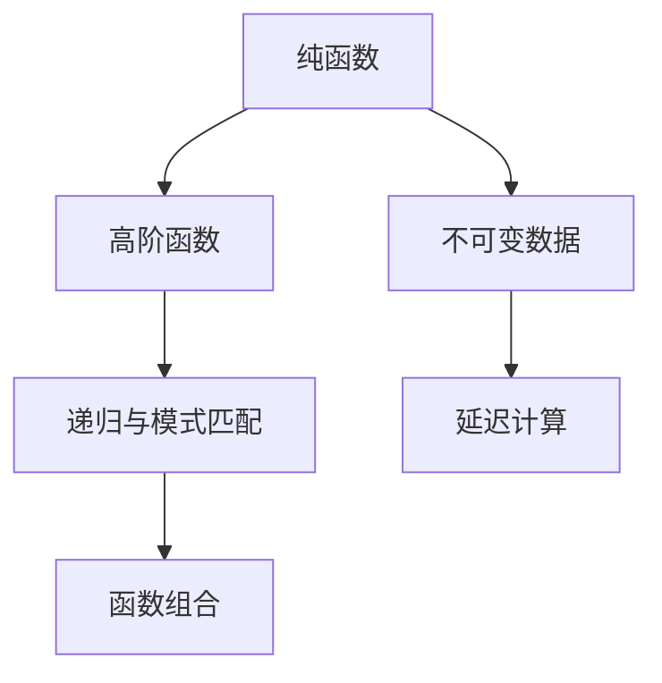

                 

# 函数式编程：Haskell和Scala实践

## 1. 背景介绍

函数式编程（Functional Programming, FP）是一种编程范式，强调使用纯粹的函数来构造软件系统。相较于面向过程的程序设计，函数式编程更注重数据的抽象与操作，减少副作用，提升代码的可读性、可维护性及可重用性。近年来，随着计算机科学的进步，函数式编程逐渐被更多的开发者接受与实践。

本文将从函数式编程的核心原理出发，深入探讨Haskell和Scala这两种功能强大的函数式编程语言，并结合实际项目进行代码实践，总结函数式编程的工程化经验。

## 2. 核心概念与联系

### 2.1 核心概念概述

为了更好地理解函数式编程，本文将先介绍几个核心概念：

- **纯函数**：函数式编程的核心概念，指不受外界影响，只依赖于输入值，不改变任何状态或产生副作用的函数。
- **不可变数据**：在函数式编程中，数据是不可变的，一旦创建即不能修改，这使得程序更容易并行计算，提高性能。
- **高阶函数**：函数式编程中，函数可以接受其他函数作为参数，也可以返回函数作为结果，这是实现抽象和组合的核心工具。
- **递归与模式匹配**：函数式编程中的基本操作，用于解决复杂问题，实现对数据结构的遍历和操作。
- **延迟计算**：函数式编程语言中支持延迟计算（Lazy Evaluation），只有在需要时才计算表达式的值，减少不必要的资源消耗。
- **函数组合**：将多个函数组合成一个函数，实现复杂操作的简化与抽象。

这些概念构成了函数式编程的基石，下面通过一个简单的函数式程序示例来说明其工作原理：

```haskell
factorial :: Integer -> Integer
factorial 0 = 1
factorial n = n * factorial (n - 1)
```

在这个例子中，`factorial`函数使用递归调用来计算阶乘，符合函数式编程的抽象与简洁原则。

### 2.2 核心概念原理和架构的 Mermaid 流程图



这个流程图展示了函数式编程的主要概念以及它们之间的联系。纯函数是基础，不可变数据和高阶函数是实现函数抽象的重要手段，递归与模式匹配用于处理复杂逻辑，延迟计算提高了程序性能，函数组合则使程序更加简洁。

## 3. 核心算法原理 & 具体操作步骤

### 3.1 算法原理概述

函数式编程中，主要的算法原理包括纯函数的定义、不可变数据的操作、高阶函数的构建、递归与模式匹配的应用，以及延迟计算的实现。这些原理构成了函数式编程的基础，使得程序更加易于维护、测试和理解。

### 3.2 算法步骤详解

函数式编程的实现步骤通常分为以下几个阶段：

1. **定义纯函数**：编写不依赖外部状态，只依赖于输入参数的函数。
2. **操作不可变数据**：避免直接修改数据，而是通过函数来处理数据。
3. **构建高阶函数**：编写可以接受函数作为参数或返回函数的函数，实现程序的抽象和复用。
4. **使用递归与模式匹配**：处理复杂数据结构和问题，使得程序逻辑更加清晰。
5. **利用延迟计算**：避免不必要的计算，提高程序效率。
6. **实现函数组合**：将多个函数组合成一个函数，简化程序逻辑。

### 3.3 算法优缺点

函数式编程的优点包括：
- **高可维护性**：纯函数和不可变数据使得程序更容易理解和维护。
- **高可测试性**：纯函数和延迟计算使得程序更易于测试。
- **高并发性能**：不可变数据使得函数式程序更易于并行计算。
- **简洁性**：高阶函数和函数组合使得程序更加简洁。

其缺点包括：
- **性能问题**：递归和延迟计算可能导致性能瓶颈。
- **学习曲线陡峭**：函数式编程的思维方式与面向过程编程不同，初学较难掌握。
- **复杂性**：处理复杂逻辑时可能不如面向过程编程直观。

### 3.4 算法应用领域

函数式编程广泛应用在多个领域，包括：

- **科学计算**：科学计算需要大量的数值计算，函数式编程的延迟计算和高阶函数能提高计算效率。
- **数据分析**：数据科学中的数据处理和分析常需对大数据集进行操作，函数式编程的不可变性和延迟计算能处理大规模数据。
- **分布式计算**：函数式编程的不可变数据和延迟计算能方便地进行分布式计算。
- **前端开发**：函数式编程的简洁性和高可测试性使前端开发更加高效。

## 4. 数学模型和公式 & 详细讲解 & 举例说明

### 4.1 数学模型构建

函数式编程的数学模型主要基于函数和集合理论，强调函数作为基本操作，集合作为数据的抽象表示。以下是一个简单的数学模型示例：

$$
f(x) = \begin{cases}
x + 1, & \text{if } x \text{ is even} \\
x - 1, & \text{if } x \text{ is odd}
\end{cases}
$$

这个模型通过函数 $f$ 将偶数增加1，将奇数减少1，展示了函数式编程的映射和变换能力。

### 4.2 公式推导过程

函数式编程中的公式推导通常涉及递归和模式匹配的组合，以下是一个例子：

$$
factorial(n) = \begin{cases}
1, & \text{if } n = 0 \\
n * factorial(n - 1), & \text{if } n > 0
\end{cases}
$$

这个公式使用递归调用来计算阶乘，展示了函数式编程的抽象与简洁原则。

### 4.3 案例分析与讲解

以Haskell和Scala为例，分析两种函数式编程语言在实际项目中的应用：

#### 案例1: 数据处理

```haskell
import Data.List

doubleElements :: [a] -> [a]
doubleElements [] = []
doubleElements (x:xs) = [x, x] ++ doubleElements xs

main :: IO ()
main = do
  let lst = [1..5]
  putStrLn $ show $ doubleElements lst
```

这个例子展示了Haskell中如何使用列表推导和递归函数来处理数据。函数 `doubleElements` 将列表中的每个元素复制两次，并将结果列表连接起来。

#### 案例2: 并发编程

```scala
import scala.concurrent._
import scala.concurrent.duration._

object Main {
  def main(args: Array[String]): Unit = {
    val actors = Array(1, 2, 3, 4, 5)
    val futureResult = actors.map((x: Int) => Future{x * x}).collect { case elem @ Future(x) => x }

    val result = futureResult.get(2.seconds)
    println(s"Result: $result")
  }
}
```

这个例子展示了Scala中使用Future和map函数实现并发计算，并使用collect函数等待所有Future计算完成后返回结果。

## 5. 项目实践：代码实例和详细解释说明

### 5.1 开发环境搭建

为了进行函数式编程的实践，需要安装相应的编译器和开发环境：

1. **Haskell**：使用GHC编译器，可以通过以下命令安装：
```
brew install ghc
```
2. **Scala**：使用Scala编译器，可以通过以下命令安装：
```
brew install scalac
```
3. **IDE配置**：推荐使用IntelliJ IDEA，并配置Scala插件和Haskell插件。

### 5.2 源代码详细实现

#### Haskell示例：求斐波那契数列

```haskell
fibonacci :: Integer -> Integer
fibonacci 0 = 0
fibonacci 1 = 1
fibonacci n = fibonacci (n - 1) + fibonacci (n - 2)
```

这个例子展示了如何使用递归函数计算斐波那契数列。

#### Scala示例：求阶乘

```scala
object Factorial {
  def apply(n: Int): Int = {
    if (n == 0) 1
    else n * factorial(n - 1)
  }
}
```

这个例子展示了如何使用高阶函数计算阶乘。

### 5.3 代码解读与分析

#### Haskell代码解读

```haskell
factorial :: Integer -> Integer
factorial 0 = 1
factorial n = n * factorial (n - 1)
```

这个例子中，`factorial`函数使用递归调用来计算阶乘。函数定义了两个分支：当输入为0时，返回1；否则返回n乘以n-1的阶乘。

#### Scala代码解读

```scala
object Factorial {
  def apply(n: Int): Int = {
    if (n == 0) 1
    else n * factorial(n - 1)
  }
}
```

这个例子中，`Factorial`对象定义了一个名为`apply`的函数，可以像函数一样调用。在函数内部，使用递归调用来计算阶乘。

### 5.4 运行结果展示

#### Haskell运行结果

```haskell
ghci> factorial 5
120
```

这个例子中，通过GHC编译器将Haskell代码编译并执行，得到结果120，即5的阶乘。

#### Scala运行结果

```scala
scala> val result = Factorial(5)
scala> result
res0: Int = 120
```

这个例子中，通过Scala编译器将Scala代码编译并执行，得到结果120，即5的阶乘。

## 6. 实际应用场景

### 6.1 科学计算

函数式编程在科学计算中有着广泛应用。例如，使用Scala编写的高斯-牛顿法求解方程组：

```scala
object Newton {
  def apply(f: (Double) => Double, df: (Double) => Double, x0: Double, eps: Double): Double = {
    var x = x0
    while (Math.abs(f(x)) > eps) {
      x = x - f(x) / df(x)
    }
    x
  }
}
```

这个例子展示了如何使用高阶函数和高阶算子编写科学计算程序。

### 6.2 数据处理

在数据处理中，函数式编程可以显著提高代码的可读性和可维护性。例如，使用Haskell编写的Map函数：

```haskell
map :: (a -> b) -> [a] -> [b]
map _ [] = []
map f (x:xs) = f x : map f xs
```

这个例子展示了如何使用高阶函数实现列表映射，使得代码更加简洁易懂。

### 6.3 分布式计算

函数式编程的不可变数据和高阶函数使得分布式计算变得更加容易。例如，使用Scala编写的分布式MapReduce算法：

```scala
object MapReduce {
  def map[A, B](input: List[A], f: A => B): List[B] = {
    input.map(f)
  }

  def reduce[A, B](input: List[B], f: (B, B) => B): B = {
    input.reduce((a, b) => f(a, b))
  }
}
```

这个例子展示了如何使用高阶函数实现Map和Reduce操作，使得分布式计算变得更加容易。

## 7. 工具和资源推荐

### 7.1 学习资源推荐

1. **《函数式编程实战》**：Douglas Crockford的经典著作，介绍了函数式编程的基本概念和实践技巧。
2. **《Scala语言基础》**：Martin Odersky的著作，全面介绍了Scala语言的基本特性和编程范式。
3. **《Haskell编程艺术》**：Brent Yorgey的著作，深入浅出地介绍了Haskell语言的基本特性和编程范式。
4. **Coursera的Functional Programming for Software Engineering**：由Utrecht University开设的课程，介绍了函数式编程的基本概念和实践技巧。
5. **Coursera的Functional Programming Principles in Scala**：由INSEAD和Coursera合作的课程，介绍了Scala语言的基本特性和函数式编程的实践技巧。

### 7.2 开发工具推荐

1. **Haskell**：
   - **IDE**：GHCi，交互式解释器，便于调试和测试。
   - **IDE**：VS Code，支持Haskell插件和Scala插件。
   - **版本控制**：Git，使用Haskell的cabal包管理器。

2. **Scala**：
   - **IDE**：IntelliJ IDEA，支持Scala插件。
   - **IDE**：Eclipse，支持Scala插件。
   - **版本控制**：Git，使用Scala的版本控制工具。

### 7.3 相关论文推荐

1. **《函数式编程：概念与实践》**：Douglas Crockford的论文，介绍了函数式编程的基本概念和实践技巧。
2. **《Scala语言设计与实现》**：Martin Odersky的论文，介绍了Scala语言的基本特性和编程范式。
3. **《Haskell型理论》**：Brent Yorgey的论文，介绍了Haskell语言的基本特性和编程范式。

## 8. 总结：未来发展趋势与挑战

### 8.1 总结

本文从函数式编程的核心概念和实践出发，深入探讨了Haskell和Scala这两种函数式编程语言。通过实际项目的代码实践，展示了函数式编程的工程化经验，并总结了函数式编程的优势和挑战。

通过本文的系统梳理，可以看到，函数式编程在多个领域中已经展现出其强大的功能，特别是科学计算、数据处理、分布式计算等领域。在未来，函数式编程将继续拓展其应用范围，提升编程质量和效率，成为计算机科学的重要组成部分。

### 8.2 未来发展趋势

函数式编程的未来发展趋势包括：

1. **更多的编程语言支持**：随着函数式编程思想的普及，更多的编程语言将支持函数式编程特性，如Kotlin、Rust等。
2. **更高的性能**：随着编译器和优化工具的进步，函数式编程的性能将得到提升，更好地适应高性能计算需求。
3. **更多的框架和库**：更多的函数式编程框架和库将出现，支持大规模数据处理和高并发计算。
4. **更广泛的应用领域**：函数式编程将在更多领域得到应用，如金融、医疗、交通等，为各行各业提供新的解决方案。

### 8.3 面临的挑战

函数式编程在普及过程中仍然面临一些挑战：

1. **学习曲线陡峭**：函数式编程的思维方式与传统编程不同，初学较难掌握。
2. **性能瓶颈**：递归和延迟计算可能导致性能瓶颈，需要优化算法和工具。
3. **工具和资源缺乏**：函数式编程的工具和资源相对较少，需要更多的支持和推广。

### 8.4 研究展望

未来的研究应集中在以下几个方向：

1. **优化算法**：优化递归和延迟计算的算法，提升函数式编程的性能。
2. **工具和框架**：开发更多支持函数式编程的工具和框架，提高开发效率。
3. **应用领域**：拓展函数式编程的应用领域，推动其在更多行业中的应用。

## 9. 附录：常见问题与解答

**Q1: 函数式编程的优势和挑战是什么？**

A: 函数式编程的优势包括高可维护性、高可测试性、高并发性能和简洁性。其挑战包括学习曲线陡峭、性能问题和复杂性。

**Q2: 如何提高函数式编程的性能？**

A: 可以通过优化算法、使用高效的数据结构和并发编程技术来提高函数式编程的性能。

**Q3: 函数式编程在实际项目中如何应用？**

A: 函数式编程可以应用于科学计算、数据处理、分布式计算等领域，需要根据具体需求选择适合的函数式编程语言和技术。

**Q4: 函数式编程有哪些推荐的学习资源？**

A: 推荐阅读《函数式编程实战》、《Scala语言基础》、《Haskell编程艺术》等书籍，参加Coursera和Utrecht University等课程。

---

作者：禅与计算机程序设计艺术 / Zen and the Art of Computer Programming

