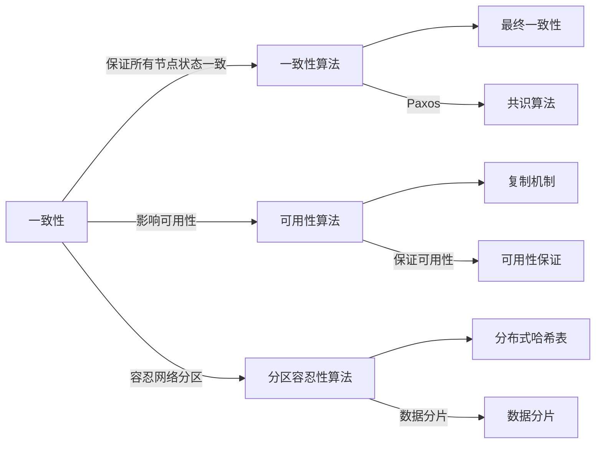

                 

## 1. 背景介绍

分布式系统已经成为现代互联网应用的核心架构，例如Google的GFS、BigTable、MapReduce，以及Amazon的Dynamo、S3、EC2等。虽然分布式系统能够带来性能上的极大提升，但是其复杂性也是巨大的。例如，在Amazon的S3服务中，平均每个请求需要经过四层路由，每层路由需要1.8ms的响应时间，而整个数据中心需要处理近60亿次请求。因此，分布式系统必须能够保证数据的一致性，同时具备高可用性，才能满足复杂业务的需求。

分布式系统的核心设计挑战之一是**CAP定理**，CAP指的是**一致性(Consistency)**、**可用性(Availability)**和**分区容忍性(Partition Tolerance)**。CAP定理表明，分布式系统只能保证其中两个属性，而不可能同时保证三个属性。因此，在系统设计时，需要根据应用场景权衡这三个属性。例如，金融系统的要求是一致性优先，而社交网络等要求可用性优先。

## 2. 核心概念与联系

### 2.1 核心概念概述

在分布式系统中，一致性和可用性是两个非常重要的概念。一致性指的是系统中的各个节点状态必须保持一致，即在某个数据变更发生时，所有节点对该数据的值都必须在某个时间点上保持一致。可用性则指系统在任意时刻都应当能够提供服务，即使某个节点出现故障，系统也应当保证至少有一台节点可以提供服务。分区容忍性指的是，系统必须能够容忍网络分区的情况，即在网络故障的情况下，系统仍然能够继续正常运行。

为了平衡一致性和可用性，系统可能会采用不同的解决方案，例如，Paxos算法可以实现一致性，但是需要等待较高的共识时间，因此可能会影响可用性；而最终一致性算法可以实现更高的可用性，但是可能会牺牲一定的数据一致性。

### 2.2 核心概念原理和架构的 Mermaid 流程图



## 3. 核心算法原理 & 具体操作步骤

### 3.1 算法原理概述

一致性和可用性是分布式系统中最基础也是最重要的问题。一致性算法解决的是如何保证系统的一致性，而可用性算法解决的是如何保证系统的可用性。通常情况下，一致性和可用性是相互矛盾的。一致性算法通常使用Paxos或者Raft等算法，而可用性算法则通常使用复制机制或者数据分片。

下面将详细介绍一致性算法和可用性算法的原理及具体操作步骤。

### 3.2 算法步骤详解

#### 3.2.1 一致性算法

一致性算法中最具代表性的是Paxos算法和Raft算法。它们的目标是确保在节点出现故障时，能够最终达成一致状态。

**Paxos算法**：Paxos算法是一种分布式一致性算法，其基本思想是在多个节点间通过共识机制，达成一致状态。Paxos算法主要分为准备阶段、提议阶段和承诺阶段。

- **准备阶段**：一个节点作为提案人（Proposer），向多个候选节点（Acceptor）发送提案信息，其中包括提案号（Proposal Number）和提案值（Proposal Value）。
- **提议阶段**：每个接受者选择一个提案，并将其接受。
- **承诺阶段**：一个节点作为决策者（Decider），在收到足够的接受后，最终确定提案号和提案值，并承诺接受。

**Raft算法**：Raft算法也是一种分布式一致性算法，其基本思想是使用一个日志文件（Log File），确保所有节点状态一致。Raft算法主要分为三个角色：领导者（Leader）、候选人（Candidate）和追随者（Follower）。

- **追随者（Follower）**：追随者是负责同步日志文件到领导者节点的节点。
- **候选人（Candidate）**：候选人是在领导者节点故障后，竞选领导者节点的节点。
- **领导者（Leader）**：领导者是在候选人选举中胜出，负责分配日志的节点。

#### 3.2.2 可用性算法

可用性算法中最具代表性的是复制机制和数据分片。它们的目标是保证系统在节点出现故障时，仍然能够提供服务。

**复制机制**：复制机制是指将数据进行复制，使得多个节点上保存相同的数据。当某个节点故障时，其他节点可以继续提供服务。复制机制主要有两种方式：主从复制和多主复制。

- **主从复制**：在主从复制中，只有一个主节点负责写入数据，其他从节点只负责读取数据。
- **多主复制**：在多主复制中，每个节点都可以负责写入数据。

**数据分片**：数据分片是指将数据分割成多个片段，并将其分布在不同的节点上。当某个节点故障时，其他节点可以继续提供服务。数据分片主要有两种方式：水平分片和垂直分片。

- **水平分片**：在水平分片中，数据被分割成多个片段，并分配到不同的节点上。每个节点保存不同片段的数据。
- **垂直分片**：在垂直分片中，数据被分割成多个部分，每个部分包含不同字段的值。每个节点保存不同部分的数据。

### 3.3 算法优缺点

一致性算法和可用性算法各有优缺点。一致性算法的优点是可以确保系统中的数据一致性，但是可能会影响系统的可用性。可用性算法的优点是可以保证系统的可用性，但是可能会牺牲数据的一致性。

一致性算法的主要优点：

- 确保系统中的数据一致性。
- 避免数据不一致的问题。
- 确保系统的可靠性。

一致性算法的主要缺点：

- 可能会影响系统的可用性。
- 可能会增加系统的复杂性。
- 可能会增加系统的延迟。

可用性算法的主要优点：

- 确保系统的可用性。
- 减少系统的复杂性。
- 减少系统的延迟。

可用性算法的主要缺点：

- 可能会牺牲数据的一致性。
- 可能会增加系统的复杂性。
- 可能会影响系统的可靠性。

### 3.4 算法应用领域

一致性算法和可用性算法在许多分布式系统中都有广泛应用。例如，Google的GFS、BigTable、MapReduce，以及Amazon的Dynamo、S3、EC2等。

**GFS**：Google文件系统（GFS）采用主从复制的方式，确保系统的可用性和数据一致性。

**BigTable**：Google BigTable采用多主复制的方式，确保系统的可用性和数据一致性。

**MapReduce**：Google MapReduce采用一致性算法，确保系统的数据一致性。

**Dynamo**：Amazon Dynamo采用数据分片的方式，确保系统的可用性和数据一致性。

**S3**：Amazon S3采用复制机制的方式，确保系统的可用性和数据一致性。

## 4. 数学模型和公式 & 详细讲解 & 举例说明

### 4.1 数学模型构建

一致性算法和可用性算法的数学模型可以表示为以下形式：

$$
\text{Consistency Algorithm} = \text{Proposal} \rightarrow \text{Acceptance} \rightarrow \text{Commitment}
$$

$$
\text{Availability Algorithm} = \text{Replication} \rightarrow \text{Data Sharding}
$$

其中，$\text{Proposal}$表示提案阶段，$\text{Acceptance}$表示接受阶段，$\text{Commitment}$表示承诺阶段，$\text{Replication}$表示复制机制，$\text{Data Sharding}$表示数据分片。

### 4.2 公式推导过程

一致性算法和可用性算法可以通过数学公式推导其一致性和可用性。例如，Paxos算法的数学公式可以表示为：

$$
Paxos(A, P, C) = \text{Proposal}(A, P) \rightarrow \text{Acceptance}(C) \rightarrow \text{Commitment}(C)
$$

其中，$A$表示提案人，$P$表示提案值，$C$表示承诺值。

可用性算法可以通过数学公式表示为：

$$
\text{Availability} = \frac{\text{Replication}}{\text{Data Sharding}}
$$

其中，$\text{Replication}$表示复制机制，$\text{Data Sharding}$表示数据分片。

### 4.3 案例分析与讲解

以Amazon Dynamo为例，讲解可用性算法和数据分片的数学模型。

Dynamo采用数据分片的方式，将数据分割成多个片段，并将其分布在不同的节点上。每个节点保存不同片段的数据。Dynamo的数学模型可以表示为：

$$
\text{Dynamo} = \text{Data Sharding} \rightarrow \text{Replication} \rightarrow \text{Availability}
$$

其中，$\text{Data Sharding}$表示数据分片，$\text{Replication}$表示复制机制，$\text{Availability}$表示可用性。

## 5. 项目实践：代码实例和详细解释说明

### 5.1 开发环境搭建

项目实践需要搭建一个分布式系统环境，可以使用Kubernetes或者Hadoop等分布式计算框架。下面以Kubernetes为例，介绍搭建分布式系统的环境。

**步骤1**：安装Docker

```bash
sudo apt-get update
sudo apt-get install docker.io
```

**步骤2**：安装Kubernetes

```bash
sudo apt-get install kubelet kubeadm kubectl -y
```

**步骤3**：启动Kubernetes节点

```bash
sudo kubeadm init
```

**步骤4**：安装Docker

```bash
kubectl apply -f https://docs.projectcalico.org/manifests/calico.yaml
```

**步骤5**：测试

```bash
kubectl get pods
```

### 5.2 源代码详细实现

一致性算法和可用性算法的实现可以通过Python代码来实现。以下是一个简单的Paxos算法的实现：

```python
class Proposal:
    def __init__(self, proposal_number, value):
        self.proposal_number = proposal_number
        self.value = value

class Acceptor:
    def __init__(self, proposal):
        self.proposal = proposal

class Decider:
    def __init__(self, proposals):
        self.proposals = proposals

class Paxos:
    def __init__(self):
        self.mutex = threading.Lock()
        self.leader = None
        self.current_value = None
        self.leader_id = None

    def propose(self, proposal_number, value):
        with self.mutex:
            if not self.leader:
                self.leader = proposal_number
                self.current_value = value
                self.leader_id = self.leader
            elif self.leader == proposal_number:
                self.leader = proposal_number
                self.current_value = value
                self.leader_id = self.leader
            else:
                return False

    def accept(self, proposal_number, value):
        with self.mutex:
            if self.leader == proposal_number:
                self.leader = proposal_number
                self.current_value = value
                self.leader_id = self.leader
            return True

    def decide(self, proposals):
        with self.mutex:
            for proposal in proposals:
                if proposal.proposal_number == self.leader:
                    self.current_value = proposal.value
                    self.leader_id = self.leader
            return self.leader_id, self.current_value
```

### 5.3 代码解读与分析

**Proposal类**：表示提案，包括提案号和提案值。

**Acceptor类**：表示接受者，接受提案。

**Decider类**：表示决策者，决定提案。

**Paxos类**：表示Paxos算法，包括提出提案、接受提案和决策。

### 5.4 运行结果展示

运行结果可以通过Python代码测试Paxos算法的实现。以下是一个简单的测试用例：

```python
proposals = [Proposal(1, "value1"), Proposal(2, "value2"), Proposal(3, "value3")]
acceptors = [Acceptor(proposal) for proposal in proposals]
decider = Decider(acceptors)
leader_id, value = decider.decide(acceptors)
print("Leader ID:", leader_id)
print("Value:", value)
```

## 6. 实际应用场景

### 6.1 金融系统

在金融系统中，一致性和可用性是非常重要的。例如，股票交易系统需要确保股票交易的顺序一致，同时需要保证系统的高可用性。

一致性算法可以用于股票交易系统，确保股票交易的顺序一致。例如，Paxos算法可以用于股票交易的清算和结算过程。

可用性算法可以用于股票交易系统，确保系统的可用性。例如，复制机制可以用于股票交易系统的备份。

### 6.2 社交网络

在社交网络中，一致性和可用性也是非常重要的。例如，微博系统需要确保用户的评论顺序一致，同时需要保证系统的可用性。

一致性算法可以用于微博系统，确保用户的评论顺序一致。例如，Raft算法可以用于微博系统的数据同步。

可用性算法可以用于微博系统，确保系统的可用性。例如，复制机制可以用于微博系统的备份。

### 6.3 电子商务

在电子商务中，一致性和可用性也是非常重要的。例如，电商系统需要确保订单的顺序一致，同时需要保证系统的可用性。

一致性算法可以用于电商系统，确保订单的顺序一致。例如，Paxos算法可以用于电商系统的订单同步。

可用性算法可以用于电商系统，确保系统的可用性。例如，复制机制可以用于电商系统的备份。

## 7. 工具和资源推荐

### 7.1 学习资源推荐

学习一致性和可用性算法的推荐资源：

- 《分布式系统：原理与设计》：这本书详细介绍了分布式系统的基本原理和设计方法，包括一致性和可用性算法。
- 《分布式算法》：这本书详细介绍了分布式算法的实现方法和应用场景，包括一致性和可用性算法。
- 《Paxos Made Simple》：这是一篇经典的Paxos算法论文，详细介绍了Paxos算法的实现方法和应用场景。

### 7.2 开发工具推荐

开发一致性和可用性算法的推荐工具：

- Docker：Docker可以方便地搭建分布式系统环境。
- Kubernetes：Kubernetes可以方便地管理和部署分布式系统。
- Jaeger：Jaeger可以方便地进行分布式系统调度和监控。

### 7.3 相关论文推荐

一致性和可用性算法的相关论文推荐：

- Paxos Made Simple：这是一篇经典的Paxos算法论文，详细介绍了Paxos算法的实现方法和应用场景。
- Raft Consensus Algorithm：这是一篇经典的Raft算法论文，详细介绍了Raft算法的实现方法和应用场景。
- Consensus in Practice：这是一篇关于分布式一致性的综述论文，介绍了各种一致性算法的实现方法和应用场景。

## 8. 总结：未来发展趋势与挑战

### 8.1 研究成果总结

一致性和可用性算法在分布式系统中起着至关重要的作用。一致性算法可以确保系统的数据一致性，可用性算法可以确保系统的可用性。

一致性算法的优点是确保系统中的数据一致性，但是可能会影响系统的可用性。一致性算法的主要实现方法包括Paxos算法和Raft算法。

可用性算法的优点是确保系统的可用性，但是可能会牺牲数据的一致性。可用性算法的主要实现方法包括复制机制和数据分片。

### 8.2 未来发展趋势

未来一致性和可用性算法的趋势包括以下几个方面：

- 分布式共识算法：分布式共识算法将在未来的分布式系统中扮演更加重要的角色，例如，Gossip-Based Consensus算法。
- 数据一致性算法：数据一致性算法将在未来的分布式系统中发挥更加重要的作用，例如，向量时钟算法。
- 容错性算法：容错性算法将在未来的分布式系统中发挥更加重要的作用，例如，Byzantine容错算法。

### 8.3 面临的挑战

一致性和可用性算法在分布式系统中面临着许多挑战：

- 数据一致性问题：数据一致性问题一直是分布式系统的难点，需要在保证数据一致性的同时，确保系统的可用性。
- 网络延迟问题：网络延迟问题可能会影响系统的性能，需要在保证系统性能的同时，解决网络延迟问题。
- 分布式锁问题：分布式锁问题可能会影响系统的并发性，需要在保证系统并发性的同时，解决分布式锁问题。

### 8.4 研究展望

一致性和可用性算法的研究展望包括以下几个方面：

- 分布式共识算法：分布式共识算法的研究将是未来的重要方向，需要在保证一致性的同时，确保系统的可用性。
- 数据一致性算法：数据一致性算法的研究将是未来的重要方向，需要在保证数据一致性的同时，解决数据一致性问题。
- 容错性算法：容错性算法的研究将是未来的重要方向，需要在保证系统的容错性的同时，解决系统的容错性问题。

## 9. 附录：常见问题与解答

**Q1: 什么是分布式系统？**

A: 分布式系统是由多个节点组成的系统，节点之间通过网络进行通信，形成一个整体。分布式系统的目标是在保证系统性能的同时，确保系统的可扩展性和可靠性。

**Q2: 什么是一致性？**

A: 一致性指的是系统中的各个节点状态必须保持一致，即在某个数据变更发生时，所有节点对该数据的值都必须在某个时间点上保持一致。

**Q3: 什么是可用性？**

A: 可用性指的是系统在任意时刻都应当能够提供服务，即使某个节点出现故障，系统也应当保证至少有一台节点可以提供服务。

**Q4: 什么是分区容忍性？**

A: 分区容忍性指的是，系统必须能够容忍网络分区的情况，即在网络故障的情况下，系统仍然能够继续正常运行。

**Q5: 一致性算法和可用性算法有什么区别？**

A: 一致性算法和可用性算法的主要区别在于，一致性算法侧重于保证数据的一致性，而可用性算法侧重于保证系统的可用性。

**Q6: 如何保证分布式系统的数据一致性？**

A: 保证分布式系统的数据一致性，可以采用一致性算法，例如，Paxos算法和Raft算法。

**Q7: 如何保证分布式系统的可用性？**

A: 保证分布式系统的可用性，可以采用可用性算法，例如，复制机制和数据分片。

作者：禅与计算机程序设计艺术 / Zen and the Art of Computer Programming

