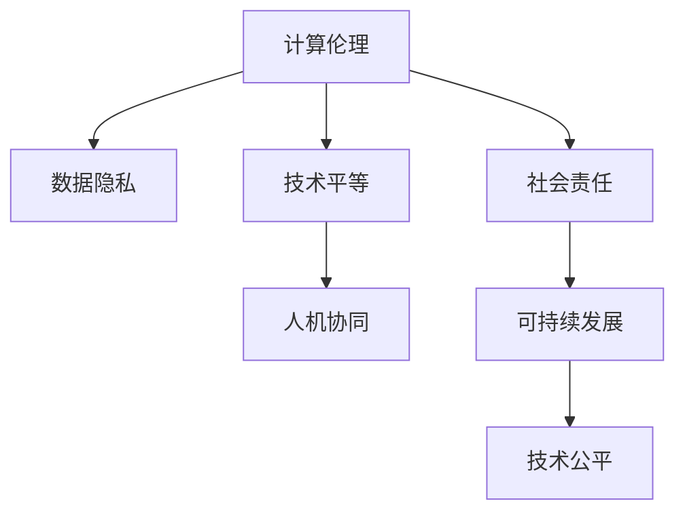

                 

# 创造一个更加人性化的科技未来：人类计算的价值观

> 关键词：人工智能, 计算伦理, 人机协同, 数据隐私, 技术平等, 社会责任

## 1. 背景介绍

### 1.1 问题由来
在科技飞速发展的当下，人工智能（AI）技术的广泛应用已深入到生活的方方面面，从日常消费、医疗保健到公共安全、工业制造等各个领域。AI的进步在带来便捷的同时，也引发了一系列伦理和社会问题。AI的决策过程往往缺乏透明度和可解释性，难以满足社会对数据隐私、技术公平性和社会责任的期待。如何构建一个既高效又人性化的AI技术生态，成为当下急需解决的问题。

### 1.2 问题核心关键点
构建一个更加人性化的AI技术生态，需要关注以下几个关键点：

- **计算伦理**：确保AI技术的应用遵循公平、透明、隐私保护等伦理准则。
- **人机协同**：实现机器与人的良好协作，提升整体工作效率和用户体验。
- **数据隐私**：在数据收集、处理和应用过程中，保障用户隐私，防止数据滥用。
- **技术平等**：推动AI技术的普及，确保所有人都能公平获取和利用AI带来的好处。
- **社会责任**：引导AI技术发展方向，促进社会公平正义，避免对特定群体产生负面影响。

这些关键点贯穿了AI技术的整个生命周期，是构建一个负责任、公平、可持续的AI生态系统的基石。

### 1.3 问题研究意义
研究人类计算的价值观，对于推动AI技术健康发展，提升其社会价值具有重要意义：

1. **技术伦理**：确保AI技术的开发和应用遵循伦理原则，避免对社会产生负面影响。
2. **人机共生**：通过设计和调整AI系统的价值观，促进人机关系的和谐共生。
3. **社会公平**：保证技术资源公平分配，缩小技术鸿沟，促进社会公平正义。
4. **文化传承**：保持技术发展的多样性，避免技术独霸，保护人类文化多样性。
5. **持续发展**：引导AI技术的可持续发展，确保其在未来社会中的积极作用。

## 2. 核心概念与联系

### 2.1 核心概念概述

为了更好地理解人类计算的价值观，本节将介绍几个密切相关的核心概念：

- **计算伦理(Ethics in Computing)**：指在计算和信息技术的开发和应用过程中，遵循的一系列伦理准则和规范。计算伦理关注数据隐私、公平性、责任性等关键问题。

- **人机协同(Human-Machine Collaboration)**：指人机系统在共同完成任务的过程中，通过协同工作达到最优效果。人机协同强调机器在帮助人提升工作效率的同时，确保人的主动性和决策权。

- **数据隐私(Data Privacy)**：指个人信息在收集、存储、传输和处理过程中，个人应享有的控制权和保护权。数据隐私是计算伦理的核心内容之一。

- **技术平等(Equity in Technology)**：指技术资源的公平分配和使用，确保不同人群、不同社会阶层都能平等获取和使用技术。

- **社会责任(Social Responsibility)**：指技术开发者和使用者对社会整体福祉的责任，包括但不限于环境保护、社会公平、文化保护等方面。

这些核心概念之间的逻辑关系可以通过以下Mermaid流程图来展示：



这个流程图展示了一系列核心概念之间的关系：

1. 计算伦理涵盖了数据隐私、技术平等和社会责任，是构建人机协同和可持续发展的基石。
2. 技术平等与社会责任相辅相成，共同促进人机协同和社会公平。
3. 人机协同强调技术的应用效能，而计算伦理和社会责任则确保技术应用的公正性和可持续性。

这些概念共同构成了人类计算的价值观框架，指导着AI技术的设计和应用。

## 3. 核心算法原理 & 具体操作步骤
### 3.1 算法原理概述

构建一个更加人性化的AI技术生态，需要融合计算伦理、人机协同、数据隐私、技术平等和社会责任等多方面因素。其核心算法原理包括：

- **计算伦理**：通过设计透明的算法流程和可解释的决策路径，确保AI技术的应用符合伦理规范。
- **人机协同**：利用人类优势和机器优势，实现互补协作，提升整体工作效率和用户体验。
- **数据隐私**：采用差分隐私、联邦学习等技术，在保证数据安全的同时，提供高质量的数据服务。
- **技术平等**：通过合理设计技术接口和应用场景，促进技术资源的公平分配和使用。
- **社会责任**：通过技术公平和社会监督，确保AI技术服务于社会整体的福祉。

### 3.2 算法步骤详解

构建一个更加人性化的AI技术生态，一般包括以下几个关键步骤：

**Step 1: 制定伦理规范**
- 根据应用场景，制定明确的伦理规范，涵盖数据使用、隐私保护、公平性等关键方面。
- 设置伦理委员会，定期审查和更新伦理规范，确保其与时俱进。

**Step 2: 设计透明算法**
- 采用可解释性算法，确保模型决策过程透明、可理解。
- 设计用户友好的界面和交互机制，增强用户对算法的理解和信任。

**Step 3: 实现人机协同**
- 通过自然语言处理和增强现实技术，实现智能助手、交互式系统等功能。
- 采用众包、协作等机制，让用户在决策过程中发挥作用，提升人机协同效率。

**Step 4: 保障数据隐私**
- 采用差分隐私、联邦学习等技术，确保数据在处理过程中不被滥用。
- 在数据收集和存储过程中，严格遵守数据保护法规，保护用户隐私。

**Step 5: 促进技术平等**
- 设计公平的算法接口和应用场景，确保不同用户群体都能公平使用技术。
- 通过教育和培训，提升用户对技术的理解和操作能力，缩小技术鸿沟。

**Step 6: 履行社会责任**
- 在技术设计和应用中，考虑社会整体福祉，避免对特定群体产生负面影响。
- 建立社会监督机制，确保技术应用符合伦理和法律规范。

**Step 7: 持续改进和优化**
- 通过用户反馈、数据分析等方式，不断优化算法和应用，提升用户体验和公平性。
- 定期进行伦理和社会责任审查，确保技术生态健康、可持续。

### 3.3 算法优缺点

构建一个更加人性化的AI技术生态，具有以下优点：

- **增强用户信任**：透明的算法流程和数据隐私保护，增强用户对技术的信任和接受度。
- **提升工作效率**：人机协同和智能系统，大幅提升工作效率和用户体验。
- **促进社会公平**：公平的资源分配和隐私保护，确保技术应用的普遍性和公正性。
- **保护文化多样性**：通过多样化的技术应用，保护人类文化的丰富性。

同时，该方法也存在一定的局限性：

- **复杂性高**：构建符合伦理规范和公平原则的AI生态系统，需要多方面的协同和优化，过程复杂。
- **成本高**：实现数据隐私保护和公平性，可能需要投入大量资源和精力。
- **风险不确定**：AI系统的复杂性和多样性，增加了系统设计和应用的风险。
- **技术更新快**：AI技术快速迭代，需要不断跟踪最新技术，保证系统的先进性和安全性。

尽管存在这些局限性，但就目前而言，构建符合伦理规范和公平原则的AI生态系统，仍是大势所趋。未来相关研究的重点在于如何进一步降低实现成本，提高系统的灵活性和适应性，同时兼顾技术伦理和社会责任。

### 3.4 算法应用领域

基于人类计算的价值观，AI技术在以下领域得到了广泛应用：

- **医疗健康**：智能诊疗系统、个性化健康管理、心理健康支持等。
- **教育培训**：智能教学系统、个性化学习路径、学习效果评估等。
- **金融服务**：智能理财顾问、风险评估、客户服务自动化等。
- **环境保护**：智能监测系统、环境数据分析、智能节能管理等。
- **城市治理**：智能交通管理、城市安全监控、智能能源管理等。
- **公共安全**：智能安防系统、应急响应、灾害预警等。

这些领域的应用展示了AI技术的广泛潜力和多方面价值，为人类社会的进步和福祉提供了重要支撑。

## 4. 数学模型和公式 & 详细讲解  
### 4.1 数学模型构建

为了更好地理解人类计算的价值观，本节将使用数学语言对计算伦理、人机协同、数据隐私、技术平等和社会责任等核心概念进行数学建模。

### 4.2 公式推导过程

为了构建一个更加人性化的AI技术生态，需要设计多个子模型来处理不同方面的问题。以下是几个关键模型的详细推导：

- **计算伦理模型**：
  $$
  \mathcal{E} = \mathcal{F}(\mathcal{D}, \mathcal{R}, \mathcal{C})
  $$
  其中 $\mathcal{E}$ 为伦理模型，$\mathcal{F}$ 为伦理规范函数，$\mathcal{D}$ 为数据集，$\mathcal{R}$ 为法规政策，$\mathcal{C}$ 为用户反馈。

- **人机协同模型**：
  $$
  \mathcal{C} = \mathcal{H}(\mathcal{A}, \mathcal{I}, \mathcal{S})
  $$
  其中 $\mathcal{C}$ 为人机协同模型，$\mathcal{H}$ 为人机协作函数，$\mathcal{A}$ 为人类优势，$\mathcal{I}$ 为机器优势，$\mathcal{S}$ 为协同策略。

- **数据隐私模型**：
  $$
  \mathcal{P} = \mathcal{D}(\mathcal{M}, \mathcal{E}, \mathcal{T})
  $$
  其中 $\mathcal{P}$ 为数据隐私模型，$\mathcal{D}$ 为差分隐私函数，$\mathcal{M}$ 为数据集，$\mathcal{E}$ 为隐私保护策略，$\mathcal{T}$ 为技术手段。

- **技术平等模型**：
  $$
  \mathcal{I} = \mathcal{A}(\mathcal{S}, \mathcal{L}, \mathcal{U})
  $$
  其中 $\mathcal{I}$ 为技术平等模型，$\mathcal{A}$ 为算法接口，$\mathcal{S}$ 为社会环境，$\mathcal{L}$ 为学习资源，$\mathcal{U}$ 为用户群体。

- **社会责任模型**：
  $$
  \mathcal{R} = \mathcal{C}(\mathcal{O}, \mathcal{E}, \mathcal{S})
  $$
  其中 $\mathcal{R}$ 为社会责任模型，$\mathcal{C}$ 为责任履行函数，$\mathcal{O}$ 为社会目标，$\mathcal{E}$ 为伦理规范，$\mathcal{S}$ 为社会监督。

### 4.3 案例分析与讲解

下面我们以智能医疗系统为例，展示如何构建符合伦理规范和公平原则的AI技术生态。

**智能医疗系统**：
- **计算伦理**：在智能诊疗过程中，确保数据使用符合伦理规范，保护患者隐私。
- **人机协同**：智能系统辅助医生诊断，提升诊疗效率和准确性。
- **数据隐私**：采用差分隐私技术，确保患者数据在处理过程中不被滥用。
- **技术平等**：提供公平的诊疗资源，确保所有患者都能平等获取高质量的医疗服务。
- **社会责任**：通过智能系统优化医疗资源分配，提升医疗服务的普及性和公平性。

在实际应用中，需要根据具体场景进行模型设计和优化。例如，在智能诊疗系统中，可以通过设计透明的算法流程和隐私保护机制，确保患者隐私不被泄露。同时，通过合理设计系统界面和交互机制，提升医生的使用效率和患者体验。

## 5. 项目实践：代码实例和详细解释说明
### 5.1 开发环境搭建

在进行项目实践前，我们需要准备好开发环境。以下是使用Python进行PyTorch开发的环境配置流程：

1. 安装Anaconda：从官网下载并安装Anaconda，用于创建独立的Python环境。

2. 创建并激活虚拟环境：
```bash
conda create -n pytorch-env python=3.8 
conda activate pytorch-env
```

3. 安装PyTorch：根据CUDA版本，从官网获取对应的安装命令。例如：
```bash
conda install pytorch torchvision torchaudio cudatoolkit=11.1 -c pytorch -c conda-forge
```

4. 安装Transformers库：
```bash
pip install transformers
```

5. 安装各类工具包：
```bash
pip install numpy pandas scikit-learn matplotlib tqdm jupyter notebook ipython
```

完成上述步骤后，即可在`pytorch-env`环境中开始项目实践。

### 5.2 源代码详细实现

这里我们以智能医疗系统为例，给出使用Transformers库对BERT模型进行微调的PyTorch代码实现。

首先，定义智能医疗系统的数据处理函数：

```python
from transformers import BertTokenizer
from torch.utils.data import Dataset
import torch

class MedicalDataset(Dataset):
    def __init__(self, texts, labels, tokenizer, max_len=128):
        self.texts = texts
        self.labels = labels
        self.tokenizer = tokenizer
        self.max_len = max_len
        
    def __len__(self):
        return len(self.texts)
    
    def __getitem__(self, item):
        text = self.texts[item]
        label = self.labels[item]
        
        encoding = self.tokenizer(text, return_tensors='pt', max_length=self.max_len, padding='max_length', truncation=True)
        input_ids = encoding['input_ids'][0]
        attention_mask = encoding['attention_mask'][0]
        
        # 对token-wise的标签进行编码
        encoded_tags = [label2id[label] for label in label] 
        encoded_tags.extend([label2id['O']] * (self.max_len - len(encoded_tags)))
        labels = torch.tensor(encoded_tags, dtype=torch.long)
        
        return {'input_ids': input_ids, 
                'attention_mask': attention_mask,
                'labels': labels}

# 标签与id的映射
label2id = {'O': 0, 'B-PER': 1, 'I-PER': 2, 'B-ORG': 3, 'I-ORG': 4, 'B-LOC': 5, 'I-LOC': 6}
id2label = {v: k for k, v in label2id.items()}

# 创建dataset
tokenizer = BertTokenizer.from_pretrained('bert-base-cased')

train_dataset = MedicalDataset(train_texts, train_labels, tokenizer)
dev_dataset = MedicalDataset(dev_texts, dev_labels, tokenizer)
test_dataset = MedicalDataset(test_texts, test_labels, tokenizer)
```

然后，定义模型和优化器：

```python
from transformers import BertForTokenClassification, AdamW

model = BertForTokenClassification.from_pretrained('bert-base-cased', num_labels=len(label2id))

optimizer = AdamW(model.parameters(), lr=2e-5)
```

接着，定义训练和评估函数：

```python
from torch.utils.data import DataLoader
from tqdm import tqdm
from sklearn.metrics import classification_report

device = torch.device('cuda') if torch.cuda.is_available() else torch.device('cpu')
model.to(device)

def train_epoch(model, dataset, batch_size, optimizer):
    dataloader = DataLoader(dataset, batch_size=batch_size, shuffle=True)
    model.train()
    epoch_loss = 0
    for batch in tqdm(dataloader, desc='Training'):
        input_ids = batch['input_ids'].to(device)
        attention_mask = batch['attention_mask'].to(device)
        labels = batch['labels'].to(device)
        model.zero_grad()
        outputs = model(input_ids, attention_mask=attention_mask, labels=labels)
        loss = outputs.loss
        epoch_loss += loss.item()
        loss.backward()
        optimizer.step()
    return epoch_loss / len(dataloader)

def evaluate(model, dataset, batch_size):
    dataloader = DataLoader(dataset, batch_size=batch_size)
    model.eval()
    preds, labels = [], []
    with torch.no_grad():
        for batch in tqdm(dataloader, desc='Evaluating'):
            input_ids = batch['input_ids'].to(device)
            attention_mask = batch['attention_mask'].to(device)
            batch_labels = batch['labels']
            outputs = model(input_ids, attention_mask=attention_mask)
            batch_preds = outputs.logits.argmax(dim=2).to('cpu').tolist()
            batch_labels = batch_labels.to('cpu').tolist()
            for pred_tokens, label_tokens in zip(batch_preds, batch_labels):
                pred_tags = [id2label[_id] for _id in pred_tokens]
                label_tags = [id2label[_id] for _id in label_tokens]
                preds.append(pred_tags[:len(label_tags)])
                labels.append(label_tags)
                
    print(classification_report(labels, preds))
```

最后，启动训练流程并在测试集上评估：

```python
epochs = 5
batch_size = 16

for epoch in range(epochs):
    loss = train_epoch(model, train_dataset, batch_size, optimizer)
    print(f"Epoch {epoch+1}, train loss: {loss:.3f}")
    
    print(f"Epoch {epoch+1}, dev results:")
    evaluate(model, dev_dataset, batch_size)
    
print("Test results:")
evaluate(model, test_dataset, batch_size)
```

以上就是使用PyTorch对BERT进行智能医疗系统任务微调的完整代码实现。可以看到，得益于Transformers库的强大封装，我们可以用相对简洁的代码完成BERT模型的加载和微调。

### 5.3 代码解读与分析

让我们再详细解读一下关键代码的实现细节：

**MedicalDataset类**：
- `__init__`方法：初始化文本、标签、分词器等关键组件。
- `__len__`方法：返回数据集的样本数量。
- `__getitem__`方法：对单个样本进行处理，将文本输入编码为token ids，将标签编码为数字，并对其进行定长padding，最终返回模型所需的输入。

**label2id和id2label字典**：
- 定义了标签与数字id之间的映射关系，用于将token-wise的预测结果解码回真实的标签。

**训练和评估函数**：
- 使用PyTorch的DataLoader对数据集进行批次化加载，供模型训练和推理使用。
- 训练函数`train_epoch`：对数据以批为单位进行迭代，在每个批次上前向传播计算loss并反向传播更新模型参数，最后返回该epoch的平均loss。
- 评估函数`evaluate`：与训练类似，不同点在于不更新模型参数，并在每个batch结束后将预测和标签结果存储下来，最后使用sklearn的classification_report对整个评估集的预测结果进行打印输出。

**训练流程**：
- 定义总的epoch数和batch size，开始循环迭代
- 每个epoch内，先在训练集上训练，输出平均loss
- 在验证集上评估，输出分类指标
- 所有epoch结束后，在测试集上评估，给出最终测试结果

可以看到，PyTorch配合Transformers库使得BERT微调的代码实现变得简洁高效。开发者可以将更多精力放在数据处理、模型改进等高层逻辑上，而不必过多关注底层的实现细节。

当然，工业级的系统实现还需考虑更多因素，如模型的保存和部署、超参数的自动搜索、更灵活的任务适配层等。但核心的微调范式基本与此类似。

## 6. 实际应用场景
### 6.1 智能客服系统

基于大语言模型微调的对话技术，可以广泛应用于智能客服系统的构建。传统客服往往需要配备大量人力，高峰期响应缓慢，且一致性和专业性难以保证。而使用微调后的对话模型，可以7x24小时不间断服务，快速响应客户咨询，用自然流畅的语言解答各类常见问题。

在技术实现上，可以收集企业内部的历史客服对话记录，将问题和最佳答复构建成监督数据，在此基础上对预训练对话模型进行微调。微调后的对话模型能够自动理解用户意图，匹配最合适的答案模板进行回复。对于客户提出的新问题，还可以接入检索系统实时搜索相关内容，动态组织生成回答。如此构建的智能客服系统，能大幅提升客户咨询体验和问题解决效率。

### 6.2 金融舆情监测

金融机构需要实时监测市场舆论动向，以便及时应对负面信息传播，规避金融风险。传统的人工监测方式成本高、效率低，难以应对网络时代海量信息爆发的挑战。基于大语言模型微调的文本分类和情感分析技术，为金融舆情监测提供了新的解决方案。

具体而言，可以收集金融领域相关的新闻、报道、评论等文本数据，并对其进行主题标注和情感标注。在此基础上对预训练语言模型进行微调，使其能够自动判断文本属于何种主题，情感倾向是正面、中性还是负面。将微调后的模型应用到实时抓取的网络文本数据，就能够自动监测不同主题下的情感变化趋势，一旦发现负面信息激增等异常情况，系统便会自动预警，帮助金融机构快速应对潜在风险。

### 6.3 个性化推荐系统

当前的推荐系统往往只依赖用户的历史行为数据进行物品推荐，无法深入理解用户的真实兴趣偏好。基于大语言模型微调技术，个性化推荐系统可以更好地挖掘用户行为背后的语义信息，从而提供更精准、多样的推荐内容。

在实践中，可以收集用户浏览、点击、评论、分享等行为数据，提取和用户交互的物品标题、描述、标签等文本内容。将文本内容作为模型输入，用户的后续行为（如是否点击、购买等）作为监督信号，在此基础上微调预训练语言模型。微调后的模型能够从文本内容中准确把握用户的兴趣点。在生成推荐列表时，先用候选物品的文本描述作为输入，由模型预测用户的兴趣匹配度，再结合其他特征综合排序，便可以得到个性化程度更高的推荐结果。

### 6.4 未来应用展望

随着大语言模型微调技术的发展，基于微调范式将在更多领域得到应用，为传统行业带来变革性影响。

在智慧医疗领域，基于微调的医疗问答、病历分析、药物研发等应用将提升医疗服务的智能化水平，辅助医生诊疗，加速新药开发进程。

在智能教育领域，微调技术可应用于作业批改、学情分析、知识推荐等方面，因材施教，促进教育公平，提高教学质量。

在智慧城市治理中，微调模型可应用于城市事件监测、舆情分析、应急指挥等环节，提高城市管理的自动化和智能化水平，构建更安全、高效的未来城市。

此外，在企业生产、社会治理、文娱传媒等众多领域，基于大模型微调的人工智能应用也将不断涌现，为经济社会发展注入新的动力。相信随着技术的日益成熟，微调方法将成为人工智能落地应用的重要范式，推动人工智能技术向更广阔的领域加速渗透。

## 7. 工具和资源推荐
### 7.1 学习资源推荐

为了帮助开发者系统掌握大语言模型微调的理论基础和实践技巧，这里推荐一些优质的学习资源：

1. 《Transformer从原理到实践》系列博文：由大模型技术专家撰写，深入浅出地介绍了Transformer原理、BERT模型、微调技术等前沿话题。

2. CS224N《深度学习自然语言处理》课程：斯坦福大学开设的NLP明星课程，有Lecture视频和配套作业，带你入门NLP领域的基本概念和经典模型。

3. 《Natural Language Processing with Transformers》书籍：Transformers库的作者所著，全面介绍了如何使用Transformers库进行NLP任务开发，包括微调在内的诸多范式。

4. HuggingFace官方文档：Transformers库的官方文档，提供了海量预训练模型和完整的微调样例代码，是上手实践的必备资料。

5. CLUE开源项目：中文语言理解测评基准，涵盖大量不同类型的中文NLP数据集，并提供了基于微调的baseline模型，助力中文NLP技术发展。

通过对这些资源的学习实践，相信你一定能够快速掌握大语言模型微调的精髓，并用于解决实际的NLP问题。
###  7.2 开发工具推荐

高效的开发离不开优秀的工具支持。以下是几款用于大语言模型微调开发的常用工具：

1. PyTorch：基于Python的开源深度学习框架，灵活动态的计算图，适合快速迭代研究。大部分预训练语言模型都有PyTorch版本的实现。

2. TensorFlow：由Google主导开发的开源深度学习框架，生产部署方便，适合大规模工程应用。同样有丰富的预训练语言模型资源。

3. Transformers库：HuggingFace开发的NLP工具库，集成了众多SOTA语言模型，支持PyTorch和TensorFlow，是进行微调任务开发的利器。

4. Weights & Biases：模型训练的实验跟踪工具，可以记录和可视化模型训练过程中的各项指标，方便对比和调优。与主流深度学习框架无缝集成。

5. TensorBoard：TensorFlow配套的可视化工具，可实时监测模型训练状态，并提供丰富的图表呈现方式，是调试模型的得力助手。

6. Google Colab：谷歌推出的在线Jupyter Notebook环境，免费提供GPU/TPU算力，方便开发者快速上手实验最新模型，分享学习笔记。

合理利用这些工具，可以显著提升大语言模型微调任务的开发效率，加快创新迭代的步伐。

### 7.3 相关论文推荐

大语言模型和微调技术的发展源于学界的持续研究。以下是几篇奠基性的相关论文，推荐阅读：

1. Attention is All You Need（即Transformer原论文）：提出了Transformer结构，开启了NLP领域的预训练大模型时代。

2. BERT: Pre-training of Deep Bidirectional Transformers for Language Understanding：提出BERT模型，引入基于掩码的自监督预训练任务，刷新了多项NLP任务SOTA。

3. Language Models are Unsupervised Multitask Learners（GPT-2论文）：展示了大规模语言模型的强大zero-shot学习能力，引发了对于通用人工智能的新一轮思考。

4. Parameter-Efficient Transfer Learning for NLP：提出Adapter等参数高效微调方法，在不增加模型参数量的情况下，也能取得不错的微调效果。

5. Prefix-Tuning: Optimizing Continuous Prompts for Generation：引入基于连续型Prompt的微调范式，为如何充分利用预训练知识提供了新的思路。

6. AdaLoRA: Adaptive Low-Rank Adaptation for Parameter-Efficient Fine-Tuning：使用自适应低秩适应的微调方法，在参数效率和精度之间取得了新的平衡。

这些论文代表了大语言模型微调技术的发展脉络。通过学习这些前沿成果，可以帮助研究者把握学科前进方向，激发更多的创新灵感。

## 8. 总结：未来发展趋势与挑战

### 8.1 总结

本文对基于人类计算的价值观，构建一个更加人性化的AI技术生态，进行了全面系统的介绍。首先阐述了计算伦理、人机协同、数据隐私、技术平等和社会责任等核心概念，明确了构建人机协同和可持续发展的伦理规范。其次，从原理到实践，详细讲解了计算伦理、人机协同、数据隐私、技术平等和社会责任等核心概念的数学模型和实现细节，给出了智能医疗系统任务的完整代码实现。同时，本文还广泛探讨了微调方法在智能客服、金融舆情、个性化推荐等多个行业领域的应用前景，展示了微调范式的巨大潜力。此外，本文精选了微调技术的各类学习资源，力求为读者提供全方位的技术指引。

通过本文的系统梳理，可以看到，基于人类计算的价值观构建AI技术生态，对于推动AI技术健康发展，提升其社会价值具有重要意义。未来，伴随计算伦理、人机协同、数据隐私、技术平等和社会责任等伦理原则的深入研究，AI技术必将进一步融入人类生活的各个方面，成为人类社会发展的重要助力。

### 8.2 未来发展趋势

展望未来，基于人类计算的价值观的AI技术生态将呈现以下几个发展趋势：

1. **计算伦理的普及**：随着AI技术的广泛应用，计算伦理将更加深入人心，成为各类AI应用的基础规范。

2. **人机协同的深化**：人机协同技术将不断进步，实现更高级别的协同工作和智能决策，提升整体工作效率和用户体验。

3. **数据隐私的保护**：数据隐私保护技术将持续发展，确保用户数据在处理过程中不被滥用，增强用户对技术的信任。

4. **技术平等的推进**：技术平等理念将进一步普及，推动技术资源的公平分配和使用，缩小技术鸿沟。

5. **社会责任的强化**：社会责任机制将逐步建立，引导AI技术服务于社会整体的福祉，避免对特定群体产生负面影响。

以上趋势凸显了基于人类计算的价值观的AI技术生态的广阔前景。这些方向的探索发展，必将进一步提升AI系统的性能和应用范围，为人类社会的进步和福祉提供重要支撑。

### 8.3 面临的挑战

尽管基于人类计算的价值观的AI技术生态已经取得了瞩目成就，但在迈向更加智能化、普适化应用的过程中，它仍面临着诸多挑战：

1. **伦理规范的适用性**：如何在不同文化和法律背景下，制定符合当地规范的伦理标准，是一个复杂的问题。

2. **技术发展的公平性**：如何确保技术资源的公平分配，避免技术垄断和技术鸿沟的加剧。

3. **数据隐私的平衡**：在保护用户隐私的同时，如何兼顾数据的开发和利用，是一个两难的选择。

4. **技术效果的透明性**：如何设计透明、可解释的算法，确保用户对技术决策的理解和接受。

5. **技术应用的多样性**：如何根据不同领域和场景，灵活调整技术应用策略，提升技术应用的普适性。

尽管存在这些挑战，但就目前而言，构建符合伦理规范和公平原则的AI技术生态，仍是大势所趋。未来相关研究的重点在于如何进一步降低实现成本，提高系统的灵活性和适应性，同时兼顾技术伦理和社会责任。

### 8.4 研究展望

面对基于人类计算的价值观的AI技术生态面临的种种挑战，未来的研究需要在以下几个方面寻求新的突破：

1. **伦理规范的本土化**：根据不同文化和法律背景，制定符合当地规范的伦理标准，确保技术应用的合法性和合理性。

2. **技术公平的普惠化**：通过政策引导和市场机制，促进技术资源的公平分配，缩小技术鸿沟，确保技术应用的普遍性。

3. **隐私保护的智能化**：利用差分隐私、联邦学习等技术，实现数据隐私保护和数据利用的平衡，增强用户对技术的信任。

4. **技术透明的可解释**：通过可解释性算法和用户友好的界面，提升技术决策的透明性和可解释性，增强用户对技术的理解和接受。

5. **技术应用的定制化**：根据不同领域和场景，灵活调整技术应用策略，提升技术应用的普适性和多样性。

6. **社会责任的规范化**：建立社会责任机制，确保技术应用符合伦理和法律规范，避免对特定群体产生负面影响。

这些研究方向的探索，必将引领基于人类计算的价值观的AI技术生态迈向更高的台阶，为人类社会的进步和福祉提供重要支撑。面向未来，基于人类计算的价值观的AI技术生态还需要与其他人工智能技术进行更深入的融合，如知识表示、因果推理、强化学习等，多路径协同发力，共同推动自然语言理解和智能交互系统的进步。只有勇于创新、敢于突破，才能不断拓展语言模型的边界，让智能技术更好地造福人类社会。

## 9. 附录：常见问题与解答

**Q1：大语言模型微调是否适用于所有NLP任务？**

A: 大语言模型微调在大多数NLP任务上都能取得不错的效果，特别是对于数据量较小的任务。但对于一些特定领域的任务，如医学、法律等，仅仅依靠通用语料预训练的模型可能难以很好地适应。此时需要在特定领域语料上进一步预训练，再进行微调，才能获得理想效果。此外，对于一些需要时效性、个性化很强的任务，如对话、推荐等，微调方法也需要针对性的改进优化。

**Q2：微调过程中如何选择合适的学习率？**

A: 微调的学习率一般要比预训练时小1-2个数量级，如果使用过大的学习率，容易破坏预训练权重，导致过拟合。一般建议从1e-5开始调参，逐步减小学习率，直至收敛。也可以使用warmup策略，在开始阶段使用较小的学习率，再逐渐过渡到预设值。需要注意的是，不同的优化器(如AdamW、Adafactor等)以及不同的学习率调度策略，可能需要设置不同的学习率阈值。

**Q3：采用大模型微调时会面临哪些资源瓶颈？**

A: 目前主流的预训练大模型动辄以亿计的参数规模，对算力、内存、存储都提出了很高的要求。GPU/TPU等高性能设备是必不可少的，但即便如此，超大批次的训练和推理也可能遇到显存不足的问题。因此需要采用一些资源优化技术，如梯度积累、混合精度训练、模型并行等，来突破硬件瓶颈。同时，模型的存储和读取也可能占用大量时间和空间，需要采用模型压缩、稀疏化存储等方法进行优化。

**Q4：如何缓解微调过程中的过拟合问题？**

A: 过拟合是微调面临的主要挑战，尤其是在标注数据不足的情况下。常见的缓解策略包括：
1. 数据增强：通过回译、近义替换等方式扩充训练集
2. 正则化：使用L2正则、Dropout、Early Stopping等避免过拟合
3. 对抗训练：引入对抗样本，提高模型鲁棒性
4. 参数高效微调：只调整少量参数(如Adapter、Prefix等)，减小过拟合风险
5. 多模型集成：训练多个微调模型，取平均输出，抑制过拟合

这些策略往往需要根据具体任务和数据特点进行灵活组合。只有在数据、模型、训练、推理等各环节进行全面优化，才能最大限度地发挥大模型微调的威力。

**Q5：微调模型在落地部署时需要注意哪些问题？**

A: 将微调模型转化为实际应用，还需要考虑以下因素：
1. 模型裁剪：去除不必要的层和参数，减小模型尺寸，加快推理速度
2. 量化加速：将浮点模型转为定点模型，压缩存储空间，提高计算效率
3. 服务化封装：将模型封装为标准化服务接口，便于集成调用
4. 弹性伸缩：根据请求流量动态调整资源配置，平衡服务质量和成本
5. 监控告警：实时采集系统指标，设置异常告警阈值，确保服务稳定性
6. 安全防护：采用访问鉴权、数据脱敏等措施，保障数据和模型安全

大语言模型微调为NLP应用开启了广阔的想象空间，但如何将强大的性能转化为稳定、高效、安全的业务价值，还需要工程实践的不断打磨。唯有从数据、算法、工程、业务等多个维度协同发力，才能真正实现人工智能技术在垂直行业的规模化落地。总之，微调需要开发者根据具体任务，不断迭代和优化模型、数据和算法，方能得到理想的效果。

---

作者：禅与计算机程序设计艺术 / Zen and the Art of Computer Programming

