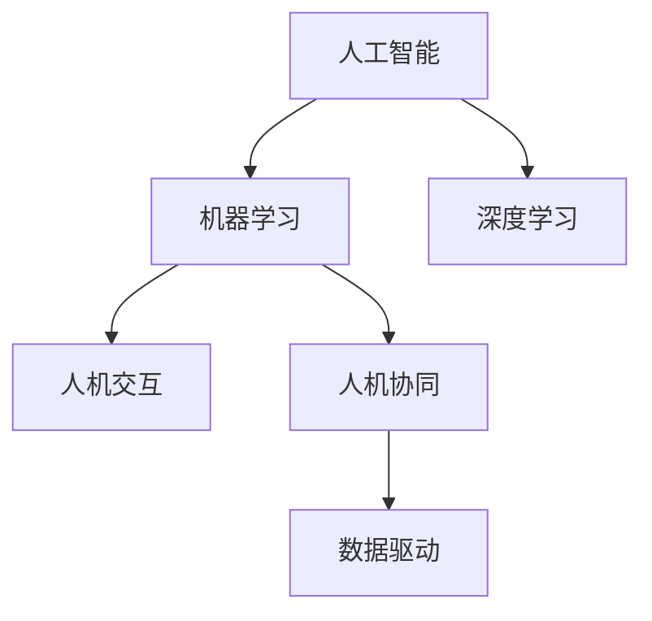

                 

# 创造更美好的明天：人类计算的积极作用

> 关键词：人工智能(AI), 机器学习, 深度学习, 人机交互, 人机协同, 数据驱动

## 1. 背景介绍

### 1.1 问题由来
随着信息技术的高速发展，人类计算（Human Computation）已经从纯粹的物理计算，发展到以数据为中心的智能计算。人工智能（AI）和机器学习（ML）技术的飞速进步，使得人类计算不再局限于机械的运算和程序处理，而是能够通过智能模型理解和应用大规模数据，提升决策效率和效果。

### 1.2 问题核心关键点
人工智能和机器学习技术的核心在于利用数据驱动的方法，通过计算来模拟人类智能。它们能够处理和分析海量数据，从中提取模式和规律，辅助人类进行更高效、更精准的决策。在许多领域，如医疗、金融、交通等，人类计算正在发挥越来越重要的作用，改变着我们的生活和工作方式。

## 2. 核心概念与联系

### 2.1 核心概念概述

为了更好地理解人工智能和机器学习对人类计算的影响，本节将介绍几个密切相关的核心概念：

- 人工智能(Artificial Intelligence, AI)：一种模拟人类智能的计算技术，包括学习、推理、感知、决策等功能。
- 机器学习(Machine Learning, ML)：通过数据驱动的学习算法，使计算机系统能够自我完善，无需明确的编程指令。
- 深度学习(Deep Learning)：一种特殊的机器学习方法，通过多层神经网络模拟人类大脑的神经元连接，能够处理复杂的非线性数据。
- 人机交互(Human-Computer Interaction, HCI)：研究如何让计算机系统更好地理解人类需求，并提供直观、自然、高效的交互方式。
- 人机协同(Human-Computer Collaboration)：通过人类计算和机器智能的结合，实现人机间的互补与协作，提升决策质量和效率。
- 数据驱动(Data-Driven)：以数据为核心的决策和分析方法，通过挖掘数据中的潜在价值，指导实际应用。

这些核心概念之间的逻辑关系可以通过以下Mermaid流程图来展示：



这个流程图展示了几者之间的相互关系：

1. 人工智能是机器学习和深度学习的核心。
2. 人机交互是人机协同的基础，通过自然语言处理、视觉识别等技术，让计算机系统更好地理解人类需求。
3. 数据驱动是人工智能和机器学习的根本，通过挖掘数据中的知识，驱动模型学习和优化。
4. 人机协同是人工智能的最终目标，通过人机互补，实现更高效、更智能的决策和应用。

## 3. 核心算法原理 & 具体操作步骤
### 3.1 算法原理概述

人工智能和机器学习的核心在于通过数据驱动的方法，使计算机系统能够从数据中学习和提取规律，从而辅助人类进行决策和处理。其基本原理包括：

- 数据预处理：对原始数据进行清洗、标注和转换，使其适合模型学习。
- 特征工程：从原始数据中提取有意义的特征，减少噪声和冗余。
- 模型选择：根据问题类型和数据特点，选择合适的机器学习模型，如线性回归、决策树、神经网络等。
- 训练与优化：通过大量数据对模型进行训练，不断调整模型参数，使其能够更准确地预测和处理新数据。
- 评估与部署：对训练好的模型进行评估，确保其在实际应用中的表现，然后将其部署到生产环境中，进行实时处理。

### 3.2 算法步骤详解

以下以深度学习模型为例，详细讲解其操作步骤：

**Step 1: 数据预处理**
- 数据清洗：去除噪声、缺失值和异常值，保证数据质量。
- 数据标注：对数据进行标注，生成训练样本。
- 数据转换：将原始数据转换为模型可接受的格式，如将图像数据转换为矩阵形式。

**Step 2: 特征工程**
- 特征提取：从原始数据中提取有意义的特征，如文本中的关键词、图像中的边缘信息。
- 特征选择：筛选出对模型预测有用的特征，减少维度，提高计算效率。
- 特征转换：对特征进行归一化、标准化等处理，保证数据的一致性。

**Step 3: 模型选择**
- 模型架构：选择合适的神经网络结构，如卷积神经网络（CNN）、循环神经网络（RNN）、Transformer等。
- 模型训练：选择适当的损失函数和优化器，如交叉熵损失、Adam优化器等。

**Step 4: 训练与优化**
- 数据分割：将数据分为训练集、验证集和测试集，确保模型泛化能力。
- 模型训练：通过反向传播算法更新模型参数，使模型能够更好地拟合训练数据。
- 模型优化：使用正则化、Dropout、早停等技术，防止过拟合，提高模型泛化能力。

**Step 5: 评估与部署**
- 模型评估：在测试集上评估模型性能，如准确率、召回率、F1值等。
- 模型部署：将训练好的模型部署到实际应用环境中，进行实时处理。
- 模型监控：实时监控模型表现，根据反馈进行调整和优化。

### 3.3 算法优缺点

人工智能和机器学习算法具有以下优点：

- 数据驱动：通过大量数据训练模型，能够发现数据中的隐含规律和模式。
- 自适应：模型能够根据数据和任务特点进行自适应调整，无需人工干预。
- 高效性：自动化的特征提取和模型优化，提升了数据处理效率。
- 普适性：适用于多种复杂问题和任务类型，如自然语言处理、图像识别、预测分析等。

同时，这些算法也存在一些缺点：

- 数据依赖：模型的性能高度依赖于数据质量，数据偏差可能导致模型偏见。
- 可解释性：部分模型（如深度学习）的黑盒特性，难以解释其内部工作机制。
- 计算资源：模型训练和优化需要大量计算资源，对硬件要求较高。
- 风险控制：模型决策的随机性和不确定性，可能导致风险累积和失控。

尽管存在这些局限性，但人工智能和机器学习在实际应用中已展现出强大的潜力，成为驱动人类计算的重要力量。

### 3.4 算法应用领域

人工智能和机器学习在多个领域中得到了广泛应用，以下是几个典型案例：

- 医疗健康：利用AI进行疾病预测、治疗方案推荐、影像诊断等，提升医疗服务效率和精准度。
- 金融服务：应用机器学习进行风险评估、欺诈检测、投资策略优化，实现智能金融。
- 交通运输：通过AI进行交通流量预测、智能导航、自动驾驶等，提高交通管理水平。
- 零售电商：运用机器学习进行需求预测、商品推荐、价格优化等，提升电商运营效率。
- 智能制造：应用AI进行质量检测、设备维护、生产调度等，推动制造业智能化转型。
- 智慧城市：通过AI进行环境监测、能源管理、公共安全等，构建智慧城市治理体系。

这些应用领域展示了人工智能和机器学习技术的广泛潜力和巨大价值。

## 4. 数学模型和公式 & 详细讲解
### 4.1 数学模型构建

在本节中，我们将使用数学语言对人工智能和机器学习的基本模型进行更加严谨的描述。

假设我们有$n$个样本$x_1, x_2, ..., x_n$，每个样本有$m$个特征，目标变量为$y$，模型的目标是找到一个函数$f(x)$，使得在给定的数据上，$f(x)$的输出尽可能接近目标变量$y$。

### 4.2 公式推导过程

以线性回归模型为例，其基本公式为：

$$y = \beta_0 + \sum_{i=1}^m \beta_i x_i$$

其中$\beta_0$是截距，$\beta_i$是第$i$个特征的权重，$m$是特征数量。线性回归模型的目标是最小化预测值与真实值之间的均方误差（Mean Squared Error, MSE）：

$$\min_{\beta} \frac{1}{n} \sum_{i=1}^n (y_i - f(x_i))^2$$

通过梯度下降等优化算法，不断调整模型参数$\beta$，使误差最小化。

### 4.3 案例分析与讲解

以下是一个简单的线性回归案例，演示如何通过数据驱动的方法，训练一个线性回归模型。

假设我们有以下数据集：

| $x_1$ | $x_2$ | $y$ |
|-------|-------|-----|
| 1     | 2     | 3   |
| 3     | 4     | 5   |
| 5     | 6     | 7   |

首先，我们需要将数据集转换为矩阵形式：

$$X = \begin{bmatrix}
1 & 2 \\
3 & 4 \\
5 & 6
\end{bmatrix}, 
Y = \begin{bmatrix}
3 \\
5 \\
7
\end{bmatrix}$$

然后，使用最小二乘法（Least Squares Method）求解线性回归模型参数$\beta_0$和$\beta_1$：

$$\beta_0 = \frac{Y^TX^T - X^TY}{X^TX}$$
$$\beta_1 = \frac{X^TY - \beta_0X^TX}{X^TX}$$

最后，将得到的参数代入线性回归模型，预测新数据点的$y$值：

$$y = \beta_0 + \beta_1 x_1$$

通过这个简单的案例，可以看到，数据驱动的方法能够使计算机系统从数据中自动学习和优化，无需人工干预，从而实现高效的预测和处理。

## 5. 项目实践：代码实例和详细解释说明
### 5.1 开发环境搭建

在进行人工智能和机器学习项目开发前，我们需要准备好开发环境。以下是使用Python进行Scikit-Learn开发的简单流程：

1. 安装Anaconda：从官网下载并安装Anaconda，用于创建独立的Python环境。
2. 创建并激活虚拟环境：
```bash
conda create -n sklearn-env python=3.8 
conda activate sklearn-env
```

3. 安装Scikit-Learn：
```bash
conda install scikit-learn
```

4. 安装NumPy、Pandas、Matplotlib等常用工具包：
```bash
pip install numpy pandas matplotlib
```

完成上述步骤后，即可在`sklearn-env`环境中开始开发。

### 5.2 源代码详细实现

以下是使用Scikit-Learn进行线性回归模型训练和评估的Python代码：

```python
import numpy as np
from sklearn.linear_model import LinearRegression
from sklearn.metrics import mean_squared_error
from sklearn.model_selection import train_test_split

# 准备数据集
X = np.array([[1, 2], [3, 4], [5, 6]])
Y = np.array([3, 5, 7])

# 数据分割
X_train, X_test, y_train, y_test = train_test_split(X, Y, test_size=0.2)

# 训练模型
model = LinearRegression()
model.fit(X_train, y_train)

# 预测和评估
y_pred = model.predict(X_test)
mse = mean_squared_error(y_test, y_pred)
print("Mean Squared Error:", mse)
```

### 5.3 代码解读与分析

让我们再详细解读一下关键代码的实现细节：

**线性回归模型训练**
- `LinearRegression`类：Scikit-Learn提供的线性回归模型。
- `fit`方法：训练模型，通过最小二乘法求解模型参数。

**预测与评估**
- `predict`方法：使用模型进行预测。
- `mean_squared_error`函数：计算预测值与真实值之间的均方误差。

**数据分割**
- `train_test_split`函数：将数据集分割为训练集和测试集。

**线性回归案例**
- `numpy`库：用于创建和处理数组。
- `train_test_split`函数：将数据集分割为训练集和测试集。

通过这个简单的案例，可以看到，Scikit-Learn能够方便快捷地实现线性回归模型的训练和评估，大大简化了数据处理和模型调优的流程。

## 6. 实际应用场景
### 6.1 医疗健康

人工智能和机器学习在医疗健康领域的应用，可以显著提升医疗服务效率和质量。通过深度学习模型，可以自动分析和诊断医疗影像、病历记录等数据，辅助医生进行精准诊断和治疗方案推荐。

在实际应用中，可以通过医疗影像数据集训练深度学习模型，如卷积神经网络（CNN），识别出癌症、心脏病等疾病，从而提供早期诊断和治疗建议。此外，利用自然语言处理（NLP）技术，可以对病历记录进行分析，提取关键信息，辅助医生进行病案管理和决策支持。

### 6.2 金融服务

金融行业一直以来对数据驱动的方法有着极高的需求。通过机器学习模型，可以实现风险评估、欺诈检测、投资策略优化等功能。

在风险评估中，可以利用历史贷款数据训练模型，预测贷款违约概率，帮助银行制定更精准的风险控制策略。在欺诈检测中，可以训练分类模型，识别异常交易行为，及时防范金融欺诈。在投资策略优化中，可以利用历史交易数据训练模型，预测市场趋势，制定更科学的投资策略。

### 6.3 交通运输

交通运输领域同样离不开数据驱动的方法。通过AI技术，可以实现交通流量预测、智能导航、自动驾驶等功能。

在交通流量预测中，可以利用历史交通数据训练模型，预测未来交通流量，帮助交通管理部门制定更合理的交通规划。在智能导航中，可以利用地图数据和实时交通数据训练模型，提供更准确、实时的导航建议。在自动驾驶中，可以训练深度学习模型，实现车辆自主决策，提高道路安全性和效率。

### 6.4 未来应用展望

未来，人工智能和机器学习的应用将更加广泛和深入，带来更多的创新和变革。以下是几个可能的方向：

- 自动驾驶：通过深度学习模型，实现更安全、更高效的自动驾驶技术，提升出行效率和安全性。
- 智能家居：通过智能算法，实现家庭设备的自动化管理和智能化控制，提升生活质量。
- 个性化推荐：利用机器学习模型，实现更精准、更个性化的商品推荐，提升用户体验。
- 智慧城市：通过AI技术，实现城市管理的智能化，提高城市运行的效率和可控性。

## 7. 工具和资源推荐
### 7.1 学习资源推荐

为了帮助开发者系统掌握人工智能和机器学习的理论基础和实践技巧，这里推荐一些优质的学习资源：

1. 《深度学习》（Goodfellow et al., 2016）：经典教材，详细介绍了深度学习的基本原理和算法。
2. 《Python机器学习》（Geron, 2019）：实用的Python编程指南，涵盖机器学习的各个方面。
3. 《机器学习实战》（Hand, 2009）：基于Scikit-Learn的实战教程，适合入门学习。
4. Coursera机器学习课程：斯坦福大学开设的机器学习课程，由Andrew Ng主讲，具有很高的权威性和实用性。
5. Udacity深度学习纳米学位：包含深度学习、计算机视觉、自然语言处理等多个方向的课程。

通过对这些资源的学习实践，相信你一定能够快速掌握人工智能和机器学习的基本技能，并用于解决实际问题。

### 7.2 开发工具推荐

高效的开发离不开优秀的工具支持。以下是几款用于人工智能和机器学习开发的常用工具：

1. Python：通用编程语言，生态丰富，适合数据驱动的计算。
2. R：统计分析语言，具有强大的数据处理和可视化能力。
3. Scikit-Learn：Python的机器学习库，提供了多种模型和算法。
4. TensorFlow：由Google开发的深度学习框架，具有强大的计算图支持。
5. PyTorch：由Facebook开发的深度学习框架，易于使用，适合快速迭代研究。
6. Jupyter Notebook：交互式编程环境，支持Python、R等多种语言，适合科研和教学。

合理利用这些工具，可以显著提升人工智能和机器学习项目的开发效率，加快创新迭代的步伐。

### 7.3 相关论文推荐

人工智能和机器学习的研究始于学界的持续探索。以下是几篇奠基性的相关论文，推荐阅读：

1. 《深度学习》（Goodfellow et al., 2016）：全面介绍了深度学习的基本原理和应用。
2. 《神经网络与深度学习》（LeCun et al., 2015）：深度学习领域的经典论文，阐述了神经网络的工作机制和算法。
3. 《机器学习》（Tom Mitchell, 1997）：机器学习领域的开创性教材，介绍了机器学习的理论基础和算法。
4. 《自然语言处理综述》（Collobert et al., 2011）：自然语言处理领域的综述论文，介绍了NLP的基本技术和应用。
5. 《大规模视觉识别与分类》（Long et al., 2014）：视觉识别领域的经典论文，介绍了卷积神经网络（CNN）的工作机制和应用。

这些论文代表了大数据和机器学习的发展脉络。通过学习这些前沿成果，可以帮助研究者把握学科前进方向，激发更多的创新灵感。

## 8. 总结：未来发展趋势与挑战
### 8.1 研究成果总结

人工智能和机器学习的发展离不开学界和产业界的共同努力。近年来，在这些领域取得了一系列重要的研究成果，包括但不限于：

- 深度学习的突破：深度神经网络模型在多个领域取得优异表现，如图像识别、语音识别、自然语言处理等。
- 自动驾驶的进展：自动驾驶技术在实际应用中逐步成熟，提升了道路安全性和效率。
- 个性化推荐的普及：利用机器学习算法，实现了更精准、更个性化的推荐服务，提升了用户体验。
- 智慧城市的实现：通过AI技术，提升了城市管理的智能化水平，提高了公共服务的效率。

这些成果展示了人工智能和机器学习技术的强大潜力和广泛应用前景。

### 8.2 未来发展趋势

展望未来，人工智能和机器学习的应用将更加广泛和深入，带来更多的创新和变革。以下是几个可能的方向：

- 自动驾驶：通过深度学习模型，实现更安全、更高效的自动驾驶技术，提升出行效率和安全性。
- 智能家居：通过智能算法，实现家庭设备的自动化管理和智能化控制，提升生活质量。
- 个性化推荐：利用机器学习模型，实现更精准、更个性化的商品推荐，提升用户体验。
- 智慧城市：通过AI技术，实现城市管理的智能化，提高城市运行的效率和可控性。

### 8.3 面临的挑战

尽管人工智能和机器学习在实际应用中已展现出强大的潜力，但在迈向更加智能化、普适化应用的过程中，它们仍面临诸多挑战：

- 数据依赖：模型的性能高度依赖于数据质量，数据偏差可能导致模型偏见。
- 计算资源：模型训练和优化需要大量计算资源，对硬件要求较高。
- 可解释性：部分模型（如深度学习）的黑盒特性，难以解释其内部工作机制。
- 风险控制：模型决策的随机性和不确定性，可能导致风险累积和失控。
- 伦理道德：在医疗、金融等高风险应用中，算法的可解释性和可审计性尤为重要。
- 安全防护：预训练模型可能会学习到有偏见、有害的信息，需要通过数据和算法层面的约束，确保输出的安全性。

正视这些挑战，积极应对并寻求突破，将是大数据和机器学习技术走向成熟的必由之路。

### 8.4 研究展望

未来，人工智能和机器学习的研究将更加注重以下几个方面：

- 数据驱动：开发更多数据高效、低偏差的学习算法，提高模型的可解释性和可信度。
- 可解释性：研究和开发更多可解释的AI模型，增强其决策过程的透明性和可解释性。
- 计算效率：探索更多高效计算方法和模型压缩技术，提升大规模模型训练和推理的效率。
- 跨领域融合：将AI技术与不同领域的专业知识结合，提升模型的跨领域迁移能力。
- 伦理道德：加强算法的伦理约束，确保其决策过程符合人类的价值观和道德标准。

这些研究方向的探索，必将引领大数据和机器学习技术迈向更高的台阶，为构建安全、可靠、可解释、可控的智能系统铺平道路。面向未来，大数据和机器学习技术还需要与其他人工智能技术进行更深入的融合，如知识表示、因果推理、强化学习等，多路径协同发力，共同推动自然语言理解和智能交互系统的进步。只有勇于创新、敢于突破，才能不断拓展人工智能技术的边界，让智能技术更好地造福人类社会。

## 9. 附录：常见问题与解答

**Q1：人工智能和机器学习是否适用于所有领域？**

A: 人工智能和机器学习技术具有广泛的应用前景，但并不是所有领域都适合使用这些技术。在处理数据量较小、规则明确的任务时，传统的统计方法可能更加适用。在处理数据量较大、规则复杂的任务时，人工智能和机器学习能够发挥更大的优势。

**Q2：数据驱动的方法是否一定优于传统方法？**

A: 数据驱动的方法在处理大规模数据时具有显著的优势，但在处理小规模数据或结构化数据时，传统方法可能更加高效和可靠。因此，选择使用哪种学习方法，应根据具体任务和数据特点进行综合考虑。

**Q3：人工智能和机器学习的应用有哪些局限性？**

A: 人工智能和机器学习的应用存在一些局限性，包括：
1. 数据依赖：模型的性能高度依赖于数据质量，数据偏差可能导致模型偏见。
2. 计算资源：模型训练和优化需要大量计算资源，对硬件要求较高。
3. 可解释性：部分模型（如深度学习）的黑盒特性，难以解释其内部工作机制。
4. 风险控制：模型决策的随机性和不确定性，可能导致风险累积和失控。

**Q4：如何选择合适的机器学习模型？**

A: 选择合适的机器学习模型需要考虑以下几个因素：
1. 任务类型：根据任务类型选择合适的模型，如分类任务、回归任务、聚类任务等。
2. 数据特点：根据数据特点选择合适的模型，如线性模型、树模型、神经网络等。
3. 模型复杂度：根据模型复杂度进行权衡，选择合适的模型，避免过拟合或欠拟合。
4. 计算资源：根据计算资源进行优化，选择合适的模型和算法，提高计算效率。

**Q5：如何提高机器学习模型的泛化能力？**

A: 提高机器学习模型的泛化能力需要考虑以下几个因素：
1. 数据扩充：通过数据扩充和增强技术，增加训练集的多样性。
2. 正则化：使用L2正则、Dropout等技术，防止过拟合。
3. 模型集成：通过模型集成技术，结合多个模型的预测结果，提高泛化能力。
4. 迁移学习：利用预训练模型进行迁移学习，提高模型的泛化能力。

这些策略往往需要根据具体任务和数据特点进行灵活组合。只有在数据、模型、训练、推理等各环节进行全面优化，才能最大限度地发挥机器学习模型的潜力。

---

作者：禅与计算机程序设计艺术 / Zen and the Art of Computer Programming

