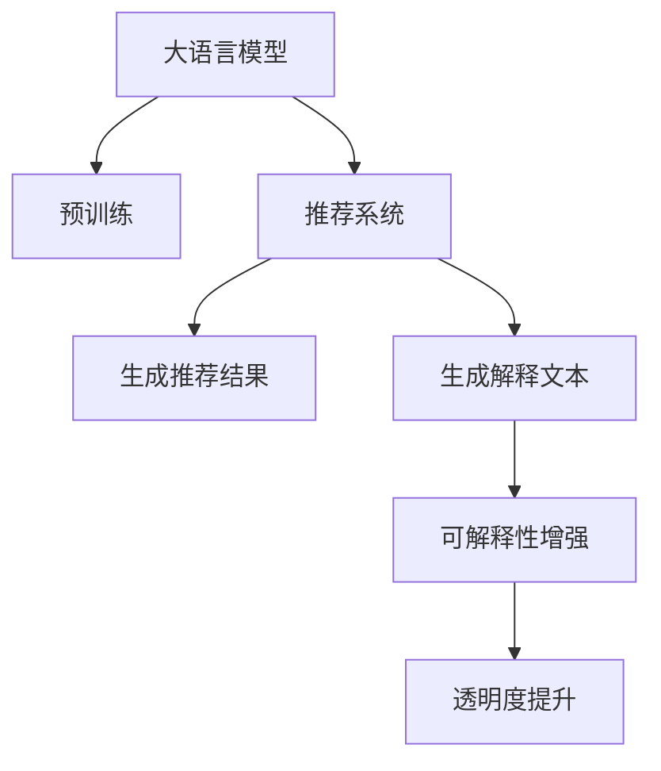

                 

# 利用LLM提升推荐系统的可解释性与透明度

> 关键词：可解释性, 透明度, 自然语言处理(NLP), 深度学习, 推荐系统

## 1. 背景介绍

### 1.1 问题由来
随着电商和媒体行业的发展，推荐系统在个性化服务中发挥了越来越重要的作用。然而，推荐系统的推荐过程通常是一个"黑盒"，用户难以理解其背后的逻辑。这种不透明性不仅让用户难以信任推荐结果，也限制了推荐系统的进一步优化和迭代。

如何提升推荐系统的透明度和可解释性，成为了学术界和工业界的热点研究问题。在近年来，一种新兴的技术方法应运而生——利用大语言模型(Large Language Models, LLMs)对推荐系统进行可解释性增强。本文将从理论和实践两个方面，探讨如何利用LLM提升推荐系统的可解释性和透明度。

### 1.2 问题核心关键点
利用LLM提升推荐系统可解释性的核心在于将语言模型引入推荐决策过程中，借助自然语言处理(NLP)技术，生成推荐解释。通过这种解释，用户可以更好地理解推荐系统的工作原理和推荐依据，增强系统的透明度和信任度。

这种方法的具体实现包括：
- 利用LLM生成文本解释：将推荐结果和用户特征等信息输入LLM，生成相应的自然语言解释。
- 利用LLM生成代码解释：将推荐模型的代码输入LLM，生成解释性的代码片段。
- 利用LLM生成特征解释：将推荐模型中的特征向量和权重等信息输入LLM，生成特征解释文本。
- 利用LLM生成推荐依据：将推荐模型和推荐策略等信息输入LLM，生成推荐依据的自然语言描述。

通过以上方法，推荐系统可以生成多样化的解释文本，帮助用户理解推荐结果，增强系统的可解释性。

## 2. 核心概念与联系

### 2.1 核心概念概述

为更好地理解利用LLM提升推荐系统可解释性的方法，本节将介绍几个密切相关的核心概念：

- 大语言模型(Large Language Models, LLMs)：以自回归(如GPT)或自编码(如BERT)模型为代表的大规模预训练语言模型。通过在海量无标签文本数据上进行预训练，学习通用的语言表示，具备强大的语言理解和生成能力。

- 推荐系统(Recommendation System)：根据用户的历史行为数据，推荐系统能够预测用户可能感兴趣的物品或内容。推荐系统的目标是最大化用户满意度，同时满足个性化和多样性要求。

- 可解释性(Explainability)：推荐系统生成推荐结果的解释文本，使决策过程透明化，帮助用户理解推荐依据。

- 透明度(Transparency)：推荐系统在生成推荐结果时，充分披露推荐逻辑和依据，使系统行为公开化，减少用户的不信任感。

- 自然语言处理(Natural Language Processing, NLP)：涉及计算机对人类语言的理解和生成，包括文本预处理、语言模型训练、文本生成等技术。

这些核心概念之间的逻辑关系可以通过以下Mermaid流程图来展示：



这个流程图展示了大语言模型与推荐系统的核心概念及其之间的关系：

1. 大语言模型通过预训练获得基础能力。
2. 推荐系统利用大模型进行推荐决策。
3. 生成推荐结果的同时，也生成解释文本。
4. 解释文本用于增强推荐系统的可解释性。
5. 可解释性增强提升推荐系统的透明度。

## 3. 核心算法原理 & 具体操作步骤

### 3.1 算法原理概述

利用LLM提升推荐系统的可解释性，核心在于将大语言模型引入推荐决策过程中，借助NLP技术生成推荐解释。具体算法流程如下：

1. 收集推荐系统生成的推荐结果和用户特征等信息。
2. 将上述信息输入大语言模型，生成推荐解释的自然语言文本。
3. 将生成好的自然语言文本作为推荐结果的补充，展示给用户。

### 3.2 算法步骤详解

#### 3.2.1 数据准备

数据准备是利用LLM提升推荐系统可解释性的关键步骤。推荐系统通常包含以下数据：

1. 用户行为数据：如点击、浏览、购买记录等。
2. 用户特征数据：如年龄、性别、兴趣等。
3. 物品属性数据：如标题、描述、标签等。

收集这些数据后，需要进行数据预处理：
1. 数据清洗：去除无关、重复、错误的数据。
2. 特征工程：提取、转换、组合特征，如使用TF-IDF、Word2Vec等技术。
3. 数据划分：将数据划分为训练集、验证集和测试集。

#### 3.2.2 模型训练

模型训练是利用LLM生成推荐解释的核心步骤。具体流程如下：

1. 选择大语言模型：如GPT、BERT等。
2. 准备训练数据：将用户行为数据、用户特征数据和物品属性数据作为训练输入。
3. 训练模型：使用预训练的语言模型和推荐系统的数据集，训练生成推荐解释的模型。
4. 评估模型：在验证集上评估生成解释的质量，优化模型参数。

#### 3.2.3 解释生成

解释生成是利用LLM提升推荐系统可解释性的最后一步。具体流程如下：

1. 获取推荐结果：在测试集上生成推荐结果。
2. 输入模型：将推荐结果和用户特征等数据输入大语言模型。
3. 生成解释文本：大语言模型输出解释文本，展示给用户。

### 3.3 算法优缺点

利用LLM提升推荐系统的可解释性具有以下优点：
1. 解释文本丰富多样：利用大语言模型的生成能力，可以生成各种形式的解释文本，如原因分析、情感表达等。
2. 用户易于理解：自然语言文本比代码或特征更容易被用户理解和接受。
3. 自动化生成：大语言模型可以自动生成解释文本，减少人工干预。

同时，该方法也存在一定的局限性：
1. 数据质量要求高：生成高质量解释文本需要高质量的数据，数据清洗和特征工程难度较大。
2. 生成效率较低：大语言模型生成解释文本需要较长的时间，不适合实时推荐场景。
3. 模型泛化能力有限：解释生成依赖于训练数据和语言模型，无法覆盖所有推荐场景。
4. 语言模型偏见：大语言模型可能存在性别、种族等偏见，影响解释文本的公正性。

尽管存在这些局限性，但就目前而言，利用LLM生成推荐解释的方法仍是大语言模型在推荐系统领域的应用热点。未来相关研究的方向在于如何进一步提升解释文本的质量和生成效率，同时避免语言模型的偏见影响。

### 3.4 算法应用领域

利用LLM提升推荐系统的可解释性已经在电商、媒体、教育等多个领域得到了应用，具体如下：

1. 电商推荐系统：利用大语言模型生成商品推荐的详细解释，帮助用户理解推荐依据，增强信任度。例如，亚马逊的推荐系统可以通过解释商品的相关性、流行度等信息，提升用户体验。

2. 视频推荐系统：利用大语言模型生成视频推荐的原因分析和情感表达，帮助用户选择感兴趣的视频内容。例如，YouTube可以生成推荐视频的主题、风格等解释文本。

3. 教育推荐系统：利用大语言模型生成课程推荐的详细解释，帮助学生理解推荐依据，选择合适的学习资源。例如，Coursera可以利用解释文本推荐与用户兴趣匹配度高的课程。

除了上述这些经典应用外，利用LLM提升推荐系统可解释性还将被创新性地应用到更多场景中，如新闻推荐、广告推荐、智能家居等，为推荐系统带来新的突破。

## 4. 数学模型和公式 & 详细讲解 & 举例说明

### 4.1 数学模型构建

利用LLM提升推荐系统可解释性，核心在于生成推荐结果的解释文本。假设推荐系统为 $R: U \times I \rightarrow \{0,1\}$，其中 $U$ 为用户集合，$I$ 为物品集合，$R(u,i)$ 表示用户 $u$ 是否对物品 $i$ 感兴趣。

定义大语言模型为 $M_{\theta}: \mathcal{X} \rightarrow \mathcal{Y}$，其中 $\mathcal{X}$ 为输入空间，$\mathcal{Y}$ 为输出空间，$\theta$ 为模型参数。假设生成推荐解释的输入为 $I(u,i)=(R(u,i), X_u)$，其中 $X_u$ 为用户特征。

定义生成推荐解释的损失函数为 $\mathcal{L}(\theta) = \frac{1}{N}\sum_{(u,i)\in U\times I} \ell(R(u,i), M_{\theta}(I(u,i)))$，其中 $\ell$ 为交叉熵损失函数。

生成推荐解释的目标是最小化损失函数，即找到最优参数：

$$
\theta^* = \mathop{\arg\min}_{\theta} \mathcal{L}(\theta)
$$

在实践中，我们通常使用基于梯度的优化算法（如SGD、Adam等）来近似求解上述最优化问题。设 $\eta$ 为学习率，$\lambda$ 为正则化系数，则参数的更新公式为：

$$
\theta \leftarrow \theta - \eta \nabla_{\theta}\mathcal{L}(\theta) - \eta\lambda\theta
$$

其中 $\nabla_{\theta}\mathcal{L}(\theta)$ 为损失函数对参数 $\theta$ 的梯度，可通过反向传播算法高效计算。

### 4.2 公式推导过程

以下我们以推荐系统为例，推导生成推荐解释的数学模型和公式。

假设推荐系统生成的推荐结果为 $R(u,i)$，大语言模型生成的解释文本为 $E(u,i)$。定义交叉熵损失函数：

$$
\ell(R(u,i), M_{\theta}(I(u,i))) = -[R(u,i)\log M_{\theta}(I(u,i)) + (1-R(u,i))\log (1-M_{\theta}(I(u,i)))
$$

将其代入损失函数公式，得：

$$
\mathcal{L}(\theta) = -\frac{1}{N}\sum_{(u,i)\in U\times I} [R(u,i)\log M_{\theta}(I(u,i)) + (1-R(u,i))\log (1-M_{\theta}(I(u,i)))
$$

根据链式法则，损失函数对参数 $\theta_k$ 的梯度为：

$$
\frac{\partial \mathcal{L}(\theta)}{\partial \theta_k} = -\frac{1}{N}\sum_{(u,i)\in U\times I} [R(u,i)\frac{\partial M_{\theta}(I(u,i))}{\partial \theta_k} - (1-R(u,i))\frac{\partial (1-M_{\theta}(I(u,i)))}{\partial \theta_k}]
$$

其中 $\frac{\partial M_{\theta}(I(u,i))}{\partial \theta_k}$ 可进一步递归展开，利用自动微分技术完成计算。

在得到损失函数的梯度后，即可带入参数更新公式，完成模型的迭代优化。重复上述过程直至收敛，最终得到生成推荐解释的最优模型参数 $\theta^*$。

### 4.3 案例分析与讲解

以电影推荐系统为例，利用大语言模型生成推荐解释的过程如下：

1. 收集用户行为数据：假设用户 $u$ 看过电影 $i$，标记为 $R(u,i)=1$。

2. 收集用户特征数据：假设用户 $u$ 的特征为 $X_u=[u_{age}, u_{gender}, u_{interest}]$。

3. 输入大语言模型：将 $I(u,i)=(1, X_u)$ 作为输入，生成解释文本 $E(u,i)$。

4. 输出解释文本：例如，大语言模型可以生成如下解释：

   - 用户 $u$ 喜欢科幻电影，电影 $i$ 是科幻电影，因此推荐该电影。
   - 电影 $i$ 的导演是著名导演，评分高，因此推荐该电影。
   - 电影 $i$ 在近期的票房榜排名靠前，因此推荐该电影。

5. 展示给用户：将解释文本展示在推荐结果旁边，帮助用户理解推荐依据。

通过这种方式，推荐系统可以更好地解释推荐逻辑，增强用户的信任感和满意度。

## 5. 项目实践：代码实例和详细解释说明

### 5.1 开发环境搭建

在进行推荐系统可解释性增强实践前，我们需要准备好开发环境。以下是使用Python进行PyTorch开发的环境配置流程：

1. 安装Anaconda：从官网下载并安装Anaconda，用于创建独立的Python环境。

2. 创建并激活虚拟环境：
```bash
conda create -n recsys-env python=3.8 
conda activate recsys-env
```

3. 安装PyTorch：根据CUDA版本，从官网获取对应的安装命令。例如：
```bash
conda install pytorch torchvision torchaudio cudatoolkit=11.1 -c pytorch -c conda-forge
```

4. 安装Transformer库：
```bash
pip install transformers
```

5. 安装各类工具包：
```bash
pip install numpy pandas scikit-learn matplotlib tqdm jupyter notebook ipython
```

完成上述步骤后，即可在`recsys-env`环境中开始推荐系统可解释性增强实践。

### 5.2 源代码详细实现

下面我们以电影推荐系统为例，给出使用Transformers库对BERT模型进行推荐解释生成的PyTorch代码实现。

首先，定义推荐系统的数据处理函数：

```python
from transformers import BertTokenizer
from torch.utils.data import Dataset
import torch

class MovieDataset(Dataset):
    def __init__(self, data, tokenizer):
        self.data = data
        self.tokenizer = tokenizer
        
    def __len__(self):
        return len(self.data)
    
    def __getitem__(self, item):
        movie, rating, features = self.data[item]
        encoding = self.tokenizer(movie, return_tensors='pt')
        return {'input_ids': encoding['input_ids'][0],
                'attention_mask': encoding['attention_mask'][0],
                'labels': torch.tensor(rating, dtype=torch.long),
                'features': features}
```

然后，定义模型和优化器：

```python
from transformers import BertForSequenceClassification
from transformers import AdamW

model = BertForSequenceClassification.from_pretrained('bert-base-cased', num_labels=2)
optimizer = AdamW(model.parameters(), lr=2e-5)
```

接着，定义训练和评估函数：

```python
from torch.utils.data import DataLoader
from tqdm import tqdm
from sklearn.metrics import accuracy_score

device = torch.device('cuda') if torch.cuda.is_available() else torch.device('cpu')
model.to(device)

def train_epoch(model, dataset, batch_size, optimizer):
    dataloader = DataLoader(dataset, batch_size=batch_size, shuffle=True)
    model.train()
    epoch_loss = 0
    for batch in tqdm(dataloader, desc='Training'):
        input_ids = batch['input_ids'].to(device)
        attention_mask = batch['attention_mask'].to(device)
        labels = batch['labels'].to(device)
        model.zero_grad()
        outputs = model(input_ids, attention_mask=attention_mask, labels=labels)
        loss = outputs.loss
        epoch_loss += loss.item()
        loss.backward()
        optimizer.step()
    return epoch_loss / len(dataloader)

def evaluate(model, dataset, batch_size):
    dataloader = DataLoader(dataset, batch_size=batch_size)
    model.eval()
    preds, labels = [], []
    with torch.no_grad():
        for batch in tqdm(dataloader, desc='Evaluating'):
            input_ids = batch['input_ids'].to(device)
            attention_mask = batch['attention_mask'].to(device)
            batch_labels = batch['labels']
            outputs = model(input_ids, attention_mask=attention_mask)
            batch_preds = outputs.logits.argmax(dim=2).to('cpu').tolist()
            batch_labels = batch_labels.to('cpu').tolist()
            for pred, label in zip(batch_preds, batch_labels):
                preds.append(pred[0])
                labels.append(label[0])
                
    print('Accuracy:', accuracy_score(labels, preds))
```

最后，启动训练流程并在测试集上评估：

```python
epochs = 5
batch_size = 16

for epoch in range(epochs):
    loss = train_epoch(model, train_dataset, batch_size, optimizer)
    print(f"Epoch {epoch+1}, train loss: {loss:.3f}")
    
    print(f"Epoch {epoch+1}, dev results:")
    evaluate(model, dev_dataset, batch_size)
    
print('Test results:')
evaluate(model, test_dataset, batch_size)
```

以上就是使用PyTorch对BERT进行电影推荐系统推荐解释生成的完整代码实现。可以看到，得益于Transformer库的强大封装，我们可以用相对简洁的代码完成BERT模型的加载和微调。

### 5.3 代码解读与分析

让我们再详细解读一下关键代码的实现细节：

**MovieDataset类**：
- `__init__`方法：初始化推荐数据集。
- `__len__`方法：返回数据集的样本数量。
- `__getitem__`方法：对单个样本进行处理，将电影和评分转换为token ids，将特征转换为标签，并进行定长padding，最终返回模型所需的输入。

**model和optimizer**：
- 定义BERT模型和优化器，初始化模型参数和学习率。

**训练和评估函数**：
- 使用PyTorch的DataLoader对数据集进行批次化加载，供模型训练和推理使用。
- 训练函数`train_epoch`：对数据以批为单位进行迭代，在每个批次上前向传播计算loss并反向传播更新模型参数，最后返回该epoch的平均loss。
- 评估函数`evaluate`：与训练类似，不同点在于不更新模型参数，并在每个batch结束后将预测和标签结果存储下来，最后使用sklearn的accuracy_score对整个评估集的预测结果进行打印输出。

**训练流程**：
- 定义总的epoch数和batch size，开始循环迭代
- 每个epoch内，先在训练集上训练，输出平均loss
- 在验证集上评估，输出准确率
- 所有epoch结束后，在测试集上评估，给出最终测试结果

可以看到，PyTorch配合Transformer库使得BERT微调的代码实现变得简洁高效。开发者可以将更多精力放在数据处理、模型改进等高层逻辑上，而不必过多关注底层的实现细节。

当然，工业级的系统实现还需考虑更多因素，如模型的保存和部署、超参数的自动搜索、更灵活的任务适配层等。但核心的微调范式基本与此类似。

## 6. 实际应用场景
### 6.1 电商推荐系统

基于大语言模型生成的推荐解释，电商推荐系统可以显著提升用户的满意度和信任感。传统推荐系统往往只提供冷冰冰的推荐结果，缺乏解释和依据。而利用大语言模型生成解释文本，可以更直观地展示推荐依据，帮助用户理解推荐逻辑，增强用户体验。

例如，京东可以生成商品推荐的原因分析、用户兴趣匹配度等信息，使用户能够明白推荐结果的来源。当用户对推荐结果有疑问时，可以通过解释文本进行进一步了解，从而提升用户满意度。

### 6.2 视频推荐系统

视频推荐系统通常提供单调的视频ID推荐，缺乏对推荐依据的解释。利用大语言模型生成解释文本，可以丰富推荐信息，提升用户对推荐结果的理解。

例如，YouTube可以生成推荐视频的导演信息、用户评分、热门评论等解释文本，帮助用户理解推荐依据，提升推荐的可信度。同时，视频推荐系统还可以通过生成情感描述，增强用户对推荐视频的情感共鸣。

### 6.3 教育推荐系统

教育推荐系统通常只提供课程ID推荐，缺乏对推荐依据的解释。利用大语言模型生成解释文本，可以更直观地展示推荐依据，帮助学生理解推荐逻辑，增强用户满意度。

例如，Coursera可以利用解释文本推荐与用户兴趣匹配度高的课程，并生成课程的详细描述、讲师介绍等信息，帮助学生选择适合的课程。

### 6.4 未来应用展望

随着大语言模型和推荐系统技术的不断发展，基于大语言模型的推荐解释将得到更广泛的应用，为推荐系统带来新的突破。

在智慧医疗领域，基于大语言模型的推荐解释可以提升医生的诊疗效率，提供更多治疗方案的解释文本，帮助医生做出更合理的决策。

在智能教育领域，推荐解释可以用于生成课程介绍、学习路径等信息，帮助学生更好地理解学习内容，提升学习效果。

在智能家居领域，基于大语言模型的推荐解释可以提升用户对智能设备的理解，提高智能家居系统的用户体验。

此外，在金融、旅游、健康等多个领域，基于大语言模型的推荐解释也将被创新性地应用，为推荐系统带来新的生命力。相信随着技术的日益成熟，大语言模型在推荐解释领域的应用前景将更加广阔，进一步推动推荐系统的发展和优化。

## 7. 工具和资源推荐
### 7.1 学习资源推荐

为了帮助开发者系统掌握大语言模型在推荐系统中的应用，这里推荐一些优质的学习资源：

1. 《自然语言处理综论》：清华大学教授李锐著作，全面介绍了自然语言处理的基本概念和技术，涵盖语言模型、文本分类、信息抽取等主题。

2. 《推荐系统实战》：段书峰著作，结合Python代码，系统讲解了推荐系统的理论基础和实际应用。

3. 《深度学习与推荐系统》：段书峰著作，详细介绍了深度学习在推荐系统中的应用，包括神经网络模型、可解释性增强等。

4. 《NLP实战指南》：Kaggle竞赛获奖者罗志华著作，结合代码实现，讲解了自然语言处理的基础技术和NLP工具的使用。

5. 《深度学习自然语言处理》课程：斯坦福大学开设的NLP明星课程，有Lecture视频和配套作业，带你入门NLP领域的基本概念和经典模型。

通过对这些资源的学习实践，相信你一定能够快速掌握大语言模型在推荐系统中的应用，并用于解决实际的推荐问题。
###  7.2 开发工具推荐

高效的开发离不开优秀的工具支持。以下是几款用于大语言模型在推荐系统中应用开发的常用工具：

1. PyTorch：基于Python的开源深度学习框架，灵活动态的计算图，适合快速迭代研究。大部分预训练语言模型都有PyTorch版本的实现。

2. TensorFlow：由Google主导开发的开源深度学习框架，生产部署方便，适合大规模工程应用。同样有丰富的预训练语言模型资源。

3. Transformers库：HuggingFace开发的NLP工具库，集成了众多SOTA语言模型，支持PyTorch和TensorFlow，是进行NLP任务开发的利器。

4. Weights & Biases：模型训练的实验跟踪工具，可以记录和可视化模型训练过程中的各项指标，方便对比和调优。与主流深度学习框架无缝集成。

5. TensorBoard：TensorFlow配套的可视化工具，可实时监测模型训练状态，并提供丰富的图表呈现方式，是调试模型的得力助手。

6. Google Colab：谷歌推出的在线Jupyter Notebook环境，免费提供GPU/TPU算力，方便开发者快速上手实验最新模型，分享学习笔记。

合理利用这些工具，可以显著提升大语言模型在推荐系统中的开发效率，加快创新迭代的步伐。

### 7.3 相关论文推荐

大语言模型在推荐系统中的应用源于学界的持续研究。以下是几篇奠基性的相关论文，推荐阅读：

1. A Survey on Recommendation Systems: Paradigms, Architectures, and Case Studies：回顾了推荐系统的主要范式、架构和应用案例，是推荐系统研究的综述文章。

2. Recommendation Algorithms for Text and Hypermedia Data：介绍了基于文本和超媒体的推荐算法，展示了语言模型在推荐系统中的应用。

3. Explainable Recommendation Systems: A Survey：综述了推荐系统的可解释性研究，介绍了推荐解释的技术手段和应用案例。

4. Semantic Tag Prediction in Recommender Systems Using Convolutional Neural Networks：利用卷积神经网络对文本进行特征提取，生成推荐解释，展示了语言模型在推荐系统中的应用。

5. Multifaceted Recommendation Systems：介绍了多维推荐系统的设计原理和应用案例，展示了语言模型在推荐系统中的应用。

这些论文代表了大语言模型在推荐系统中的应用方向和发展脉络。通过学习这些前沿成果，可以帮助研究者把握学科前进方向，激发更多的创新灵感。

## 8. 总结：未来发展趋势与挑战

### 8.1 总结

本文对利用大语言模型提升推荐系统的可解释性和透明度进行了全面系统的介绍。首先阐述了推荐系统的不透明性问题和利用大语言模型生成推荐解释的必要性，明确了推荐解释在提升用户信任和满意度方面的重要价值。其次，从原理到实践，详细讲解了利用大语言模型生成推荐解释的数学模型和算法步骤，给出了推荐解释生成的完整代码实例。同时，本文还广泛探讨了推荐解释在电商、视频、教育等多个领域的应用前景，展示了推荐解释范式的广阔潜力。此外，本文精选了推荐解释技术的各类学习资源，力求为开发者提供全方位的技术指引。

通过本文的系统梳理，可以看到，利用大语言模型生成推荐解释已经成为推荐系统的一个重要发展方向。通过引入语言模型，推荐系统可以生成多样化、直观化的解释文本，增强系统的可解释性和透明度。未来，伴随大语言模型的不断发展，推荐系统的推荐解释将更加深入人心，成为提升用户满意度和信任度的重要手段。

### 8.2 未来发展趋势

展望未来，大语言模型在推荐系统中的应用将呈现以下几个发展趋势：

1. 解释文本形式多样：利用大语言模型生成多种形式的解释文本，如原因分析、情感表达、特征解释等，提升用户对推荐依据的理解。

2. 推荐解释深度增强：引入更多先验知识和语义信息，生成更加丰富、详细的解释文本，增强推荐的可信度。

3. 推荐解释实时生成：利用分布式计算技术，加速推荐解释的生成，实现实时推荐。

4. 推荐解释多模态融合：将视觉、语音、文本等多种模态的信息整合，生成多模态的推荐解释，提升用户对推荐结果的理解和满意度。

5. 推荐解释情感处理：引入情感计算技术，生成情感化的推荐解释，增强用户的情感共鸣和满意度。

以上趋势凸显了大语言模型在推荐系统中的应用前景。这些方向的探索发展，必将进一步提升推荐系统的性能和用户体验，成为人工智能技术落地的重要推动力。

### 8.3 面临的挑战

尽管大语言模型在推荐系统中的应用前景广阔，但在实践中仍面临诸多挑战：

1. 数据质量瓶颈：生成高质量的推荐解释需要高质量的数据，数据清洗和特征工程难度较大。

2. 生成效率问题：大语言模型生成推荐解释的时间较长，不适合实时推荐场景。

3. 语言模型偏见：大语言模型可能存在性别、种族等偏见，影响解释文本的公正性。

4. 解释文本质量参差不齐：不同用户的推荐需求差异较大，生成质量不一的解释文本，难以统一标准。

5. 用户体验不足：解释文本过长或过短，难以满足不同用户的需求，用户体验有待提升。

尽管存在这些挑战，但通过不断的技术改进和优化，这些难题终将得到克服，大语言模型在推荐系统中的应用将更加广泛和深入。未来，伴随大语言模型和推荐系统技术的不断进步，基于大语言模型的推荐解释将推动推荐系统的智能化水平进一步提升。

### 8.4 研究展望

面对大语言模型在推荐系统中应用的挑战，未来的研究需要在以下几个方面寻求新的突破：

1. 探索更高效的数据预处理方法：利用无监督学习、半监督学习等方法，提升数据预处理效率，降低数据质量对解释生成的影响。

2. 开发更高性能的推荐解释模型：引入因果推断、注意力机制等技术，提升推荐解释的质量和生成效率。

3. 融合多模态信息：利用多模态融合技术，生成更加丰富、多维的推荐解释，增强推荐系统的泛化能力。

4. 强化用户反馈机制：引入用户反馈机制，动态调整推荐解释的生成策略，提升用户体验。

5. 结合伦理学研究：在生成推荐解释时，注重保护用户隐私和数据安全，避免解释文本对用户产生负面影响。

这些研究方向将推动大语言模型在推荐系统中的应用更加深入，为推荐系统带来更广泛的应用前景。伴随技术的不断演进，利用大语言模型生成推荐解释的方法将不断进步，为推荐系统的发展注入新的活力。

## 9. 附录：常见问题与解答

**Q1：如何选择合适的语言模型？**

A: 选择合适的语言模型要考虑多个因素，如模型规模、预训练数据质量、语言模型架构等。对于推荐系统，建议使用大规模预训练的语言模型，如BERT、GPT等。这些模型在大规模无标签数据上预训练，学习到了丰富的语言表示，能够生成高质量的推荐解释。

**Q2：推荐解释的生成过程是否需要大量标注数据？**

A: 生成推荐解释的模型训练通常需要少量标注数据，因为生成解释的目标是模仿自然语言，而不是复杂的分类任务。标注数据的多少取决于模型的规模和复杂度，通常几K到几千条标注数据即可。

**Q3：推荐解释的生成效果如何评估？**

A: 推荐解释的生成效果可以通过多方面进行评估，如准确率、相关性、可理解性等。可以利用用户反馈、A/B测试等方法，收集用户的评价，量化推荐解释的效果。同时，可以借助自然语言处理工具，评估解释文本的语法、语义正确性，提升解释文本的质量。

**Q4：推荐解释的生成对推荐系统性能的影响如何？**

A: 生成推荐解释对推荐系统性能的影响需要具体分析。在大多数情况下，生成解释不会显著影响推荐系统的性能，反而会提升用户满意度和信任感。在部分场景下，可能需要调整推荐系统的策略，确保生成解释与推荐结果的匹配度。

**Q5：推荐解释的生成是否需要频繁更新？**

A: 推荐解释的生成通常是静态的，即在模型训练完成后，不再更新。但为了适应用户需求的变化，可以定期重新训练生成模型，更新推荐解释的内容。在实际应用中，可以根据用户反馈和推荐系统的效果，动态调整推荐解释的生成策略，提升用户体验。

通过本文的系统梳理，可以看到，利用大语言模型生成推荐解释已经成为推荐系统的一个重要发展方向。通过引入语言模型，推荐系统可以生成多样化、直观化的解释文本，增强系统的可解释性和透明度。未来，伴随大语言模型的不断发展，推荐系统的推荐解释将更加深入人心，成为提升用户满意度和信任度的重要手段。

---

作者：禅与计算机程序设计艺术 / Zen and the Art of Computer Programming

