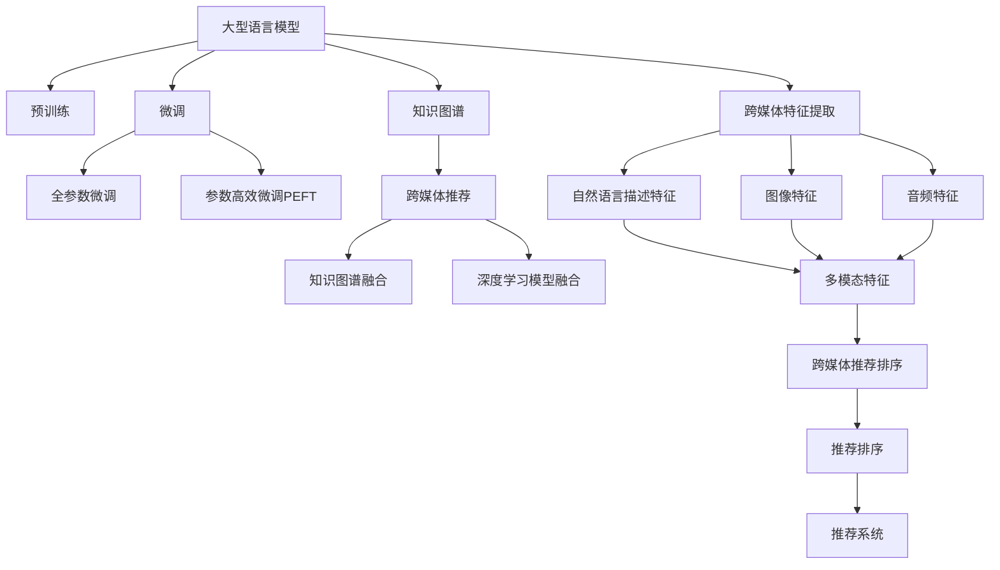

                 

# 利用LLM提升推荐系统的跨媒体推荐能力

## 1. 背景介绍

### 1.1 问题由来

推荐系统是现代互联网应用中的重要组成部分，旨在为用户推荐符合其兴趣的个性化内容，如新闻、商品、视频等。传统推荐系统主要基于用户历史行为数据，采用协同过滤、内容推荐等技术，但存在数据稀疏、冷启动等问题。随着技术的发展，基于深度学习的推荐系统逐渐成为主流。这些系统通过用户特征和商品特征的交叉相似性计算，预测用户对物品的评分，再根据评分进行推荐排序。

然而，现有推荐系统主要聚焦于单模态推荐，如文本推荐、图片推荐等。跨媒体推荐能够整合多模态数据，如文本、图片、音频等，更好地刻画用户兴趣和商品属性，进一步提升推荐效果。为此，近年来出现了跨媒体推荐技术，如图像-文本推荐、视频-文本推荐等。但跨媒体推荐需要构建多模态特征表示，如将文本映射为词向量，将图像映射为图像特征向量，再通过复杂的深度模型融合不同模态特征，实现跨模态推荐。这些步骤不仅增加了模型复杂度，也增加了计算和存储成本。

近年来，大型语言模型(Large Language Models, LLMs)的兴起，如GPT-3、BERT等，在自然语言处理(Natural Language Processing, NLP)领域取得了巨大成功。LLMs具有强大的语言理解能力和生成能力，可以通过大规模预训练和微调，学习到丰富的语言知识，具有跨媒体推荐的能力。本文章旨在利用LLMs的跨媒体推荐能力，提升推荐系统的性能和应用范围。

### 1.2 问题核心关键点

本问题的核心关键点在于：如何利用预训练的LLM进行跨媒体推荐？

首先，LLM具有强大的语言处理能力，可以通过自然语言描述获取物品特征。如用户描述电影“一部紧张刺激的科幻电影”，LLM可以自动生成电影特征向量，表示其紧张、刺激、科幻等特点。其次，LLM可以进行多模态特征融合，将图像、文本等特征自然地整合在一起。如将电影图片特征与电影描述特征进行拼接，LLM可以生成融合后的高维特征，用于推荐排序。最后，LLM可以进行高质量的推荐预测和排名，在跨媒体推荐中能够提供满意的推荐结果。

为了实现以上目标，需要解决两个核心问题：

1. 如何利用预训练的LLM进行高效的跨媒体特征提取？
2. 如何构建基于LLM的跨媒体推荐模型，并进行高性能训练和推理？

## 2. 核心概念与联系

### 2.1 核心概念概述

为了更好地理解利用LLM提升推荐系统的跨媒体推荐能力，本节将介绍几个密切相关的核心概念：

- 大型语言模型(Large Language Models, LLMs)：以自回归(如GPT)或自编码(如BERT)模型为代表的大规模预训练语言模型。通过在大规模无标签文本数据上进行预训练，学习到丰富的语言知识，具备强大的语言理解和生成能力。

- 预训练(Pre-training)：指在大规模无标签文本语料上，通过自监督学习任务训练通用语言模型的过程。常见的预训练任务包括言语建模、遮挡语言模型等。预训练使得模型学习到语言的通用表示。

- 微调(Fine-tuning)：指在预训练模型的基础上，使用下游任务的少量标注数据，通过有监督学习优化模型在特定任务上的性能。通常只需要调整顶层分类器或解码器，并以较小的学习率更新全部或部分的模型参数。

- 迁移学习(Transfer Learning)：指将一个领域学习到的知识，迁移应用到另一个不同但相关的领域的学习范式。大模型的预训练-微调过程即是一种典型的迁移学习方式。

- 跨媒体推荐(Cross-media Recommendation)：将多种模态的数据，如文本、图像、音频等，整合在一起，进行推荐。跨媒体推荐能够更好地刻画用户兴趣和商品属性，提升推荐效果。

- 知识图谱(Knowledge Graph)：一种结构化的语义知识库，用于描述实体、属性和关系。知识图谱在推荐系统中广泛应用，用于关联用户与商品，以及进行推荐排序。

这些核心概念之间的逻辑关系可以通过以下Mermaid流程图来展示：



这个流程图展示了大语言模型的核心概念及其之间的关系：

1. 大语言模型通过预训练获得基础能力。
2. 微调是对预训练模型进行任务特定的优化，可以分为全参数微调和参数高效微调（PEFT）。
3. 知识图谱用于刻画实体和关系，是跨媒体推荐的重要基础。
4. 跨媒体推荐整合多种模态数据，提高推荐精度。
5. 跨媒体特征提取将多种模态数据映射为共同表示。
6. 深度学习模型融合将多模态特征自然整合，提高推荐效果。

这些概念共同构成了跨媒体推荐的技术框架，使得大语言模型能够应用于跨媒体推荐任务中，提升推荐系统的性能。

## 3. 核心算法原理 & 具体操作步骤

### 3.1 算法原理概述

基于预训练的LLM进行跨媒体推荐的核心思想是：将多模态数据转换为统一的特征表示，再将这些特征送入LLM进行跨媒体推荐。

具体步骤如下：

1. 收集用户的多模态数据，包括文本、图像、音频等。
2. 对每一种模态的数据进行特征提取和表示，如将文本转化为词向量，图像转化为图像特征向量。
3. 将提取的多模态特征拼接为一个高维特征向量。
4. 将高维特征向量送入预训练的LLM进行跨媒体推荐。
5. 使用LLM的跨媒体推荐能力，对用户进行推荐排序，生成推荐列表。

### 3.2 算法步骤详解

基于预训练的LLM进行跨媒体推荐的具体操作步骤如下：

**Step 1: 准备预训练模型和数据集**

1. 选择合适的预训练语言模型，如GPT-3、BERT等。
2. 准备跨媒体推荐任务的数据集，划分为训练集、验证集和测试集。一般要求数据集包含多种模态的数据，如文本、图像、音频等。

**Step 2: 构建跨媒体特征表示**

1. 对用户的多模态数据进行特征提取。如文本使用BERT进行编码，图像使用ResNet进行特征提取，音频使用MFCC进行特征提取。
2. 将不同模态的特征向量拼接为一个高维特征向量。拼接方式有多种，如使用连接、堆叠等。
3. 将高维特征向量送入预训练的LLM进行跨媒体推荐。

**Step 3: 设置微调超参数**

1. 选择合适的优化算法及其参数，如AdamW、SGD等，设置学习率、批大小、迭代轮数等。
2. 设置正则化技术及强度，包括权重衰减、Dropout、Early Stopping等。
3. 确定冻结预训练参数的策略，如仅微调顶层，或全部参数都参与微调。

**Step 4: 执行梯度训练**

1. 将训练集数据分批次输入模型，前向传播计算损失函数。
2. 反向传播计算参数梯度，根据设定的优化算法和学习率更新模型参数。
3. 周期性在验证集上评估模型性能，根据性能指标决定是否触发 Early Stopping。
4. 重复上述步骤直到满足预设的迭代轮数或 Early Stopping 条件。

**Step 5: 测试和部署**

1. 在测试集上评估微调后模型 $M_{\hat{\theta}}$ 的性能，对比微调前后的精度提升。
2. 使用微调后的模型对新样本进行推理预测，集成到实际的应用系统中。
3. 持续收集新的数据，定期重新微调模型，以适应数据分布的变化。

以上是基于预训练的LLM进行跨媒体推荐的一般流程。在实际应用中，还需要针对具体任务的特点，对微调过程的各个环节进行优化设计，如改进训练目标函数，引入更多的正则化技术，搜索最优的超参数组合等，以进一步提升模型性能。

### 3.3 算法优缺点

基于预训练的LLM进行跨媒体推荐具有以下优点：

1. 通用适用。该方法可以适用于多种模态数据，如文本、图像、音频等，不局限于特定模态。
2. 学习能力强。大语言模型可以学习到丰富的语言知识，具有较强的迁移能力，能够在不同任务上表现良好。
3. 适应性强。LLM能够适应不同任务和不同领域，具有很强的泛化能力。
4. 集成方便。LLM已经在大规模预训练中学习到了丰富的特征表示，可以快速集成到推荐系统中，无需额外的特征工程。

但该方法也存在以下局限性：

1. 计算量大。预训练的LLM参数量通常非常大，需要较高的计算资源和存储空间。
2. 推理慢。LLM的推理速度较慢，特别是在长文本处理时，需要优化模型结构以提升推理速度。
3. 数据依赖。LLM的性能高度依赖于预训练数据的质量，高质量预训练数据是取得优异效果的前提。
4. 可解释性差。LLM是一个"黑盒"模型，难以解释其内部工作机制和决策逻辑。
5. 风险大。LLM可能学习到有害信息或偏见，需要进行严格的训练和监督。

尽管存在这些局限性，但基于预训练的LLM进行跨媒体推荐依然是大数据推荐系统的重要发展方向。未来相关研究的重点在于如何进一步降低计算资源需求，提高推理效率，优化数据质量，增强模型可解释性，避免模型风险等。

### 3.4 算法应用领域

基于预训练的LLM进行跨媒体推荐已经在多个领域得到了应用，具体如下：

- 电商推荐：将用户评论、商品图片、商品属性等数据输入LLM，进行跨媒体推荐排序。
- 新闻推荐：将用户阅读历史、新闻标题、新闻图片等数据输入LLM，进行跨媒体推荐排序。
- 视频推荐：将用户观看历史、视频描述、视频图片等数据输入LLM，进行跨媒体推荐排序。
- 音乐推荐：将用户听歌历史、歌曲歌词、歌曲图片等数据输入LLM，进行跨媒体推荐排序。
- 游戏推荐：将用户游戏记录、游戏截图、游戏描述等数据输入LLM，进行跨媒体推荐排序。

此外，跨媒体推荐技术还广泛应用于社交媒体、广告推荐、个性化推荐等多个领域，为大数据推荐系统带来了新的突破。随着LLM的进一步优化和应用场景的拓展，相信跨媒体推荐技术将在更多领域得到广泛应用。

## 4. 数学模型和公式 & 详细讲解  
### 4.1 数学模型构建

本节将使用数学语言对基于预训练的LLM进行跨媒体推荐的过程进行更加严格的刻画。

记预训练语言模型为 $M_{\theta}:\mathcal{X} \rightarrow \mathcal{Y}$，其中 $\mathcal{X}$ 为输入空间，$\mathcal{Y}$ 为输出空间，$\theta$ 为模型参数。假设跨媒体推荐任务训练集为 $D=\{(\mathbf{x}_i, y_i)\}_{i=1}^N$，其中 $\mathbf{x}_i$ 为用户的多模态数据表示，$y_i$ 为推荐排序。

定义模型 $M_{\theta}$ 在输入 $\mathbf{x}$ 上的输出为 $\hat{y}=M_{\theta}(\mathbf{x}) \in [0,1]$，表示用户对物品的评分。在训练集上，经验风险函数 $\mathcal{L}(\theta)$ 定义为：

$$
\mathcal{L}(\theta) = \frac{1}{N} \sum_{i=1}^N [y_i\log \hat{y}_i + (1-y_i)\log (1-\hat{y}_i)]
$$

其中 $y_i$ 为推荐排序，$\hat{y}_i$ 为模型预测的评分。在微调过程中，损失函数 $\mathcal{L}(\theta)$ 需要最小化，以得到最优的模型参数 $\theta^*$。

### 4.2 公式推导过程

以下我们以电商推荐为例，推导基于预训练的LLM进行跨媒体推荐的数学公式。

假设用户的多模态数据表示为 $\mathbf{x}_i=[\mathbf{t}_i; \mathbf{g}_i; \mathbf{a}_i]$，其中 $\mathbf{t}_i$ 为文本表示，$\mathbf{g}_i$ 为图像表示，$\mathbf{a}_i$ 为音频表示。分别使用BERT、ResNet、MFCC等预训练模型对文本、图像、音频进行编码，得到文本特征向量 $\mathbf{t}_i \in \mathbb{R}^d$、图像特征向量 $\mathbf{g}_i \in \mathbb{R}^d$、音频特征向量 $\mathbf{a}_i \in \mathbb{R}^d$。

将这些特征拼接为一个高维特征向量 $\mathbf{z}_i \in \mathbb{R}^3d$，然后将其送入预训练的LLM进行推荐评分预测。假设LLM的输出为 $\hat{y}_i=M_{\theta}(\mathbf{z}_i)$，则基于预训练的LLM进行跨媒体推荐的损失函数为：

$$
\mathcal{L}(\theta) = \frac{1}{N} \sum_{i=1}^N [y_i\log \hat{y}_i + (1-y_i)\log (1-\hat{y}_i)]
$$

根据链式法则，损失函数对参数 $\theta_k$ 的梯度为：

$$
\frac{\partial \mathcal{L}(\theta)}{\partial \theta_k} = -\frac{1}{N}\sum_{i=1}^N (\frac{y_i}{\hat{y}_i}-\frac{1-y_i}{1-\hat{y}_i}) \frac{\partial M_{\theta}(\mathbf{z}_i)}{\partial \theta_k}
$$

其中 $\frac{\partial M_{\theta}(\mathbf{z}_i)}{\partial \theta_k}$ 可进一步递归展开，利用自动微分技术完成计算。

在得到损失函数的梯度后，即可带入参数更新公式，完成模型的迭代优化。重复上述过程直至收敛，最终得到适应跨媒体推荐任务的最优模型参数 $\theta^*$。

## 5. 项目实践：代码实例和详细解释说明
### 5.1 开发环境搭建

在进行跨媒体推荐实践前，我们需要准备好开发环境。以下是使用Python进行PyTorch开发的环境配置流程：

1. 安装Anaconda：从官网下载并安装Anaconda，用于创建独立的Python环境。

2. 创建并激活虚拟环境：
```bash
conda create -n pytorch-env python=3.8 
conda activate pytorch-env
```

3. 安装PyTorch：根据CUDA版本，从官网获取对应的安装命令。例如：
```bash
conda install pytorch torchvision torchaudio cudatoolkit=11.1 -c pytorch -c conda-forge
```

4. 安装Transformer库：
```bash
pip install transformers
```

5. 安装各类工具包：
```bash
pip install numpy pandas scikit-learn matplotlib tqdm jupyter notebook ipython
```

完成上述步骤后，即可在`pytorch-env`环境中开始跨媒体推荐实践。

### 5.2 源代码详细实现

这里我们以电商推荐为例，给出使用Transformers库对预训练语言模型进行跨媒体推荐的PyTorch代码实现。

首先，定义跨媒体推荐的数据处理函数：

```python
from transformers import BertTokenizer
from torch.utils.data import Dataset
import torch

class RecommendationDataset(Dataset):
    def __init__(self, texts, images, audio, tags, tokenizer, max_len=128):
        self.texts = texts
        self.images = images
        self.audio = audio
        self.tags = tags
        self.tokenizer = tokenizer
        self.max_len = max_len
        
    def __len__(self):
        return len(self.texts)
    
    def __getitem__(self, item):
        text = self.texts[item]
        image = self.images[item]
        audio = self.audio[item]
        
        encoding = self.tokenizer(text, return_tensors='pt', max_length=self.max_len, padding='max_length', truncation=True)
        input_ids = encoding['input_ids'][0]
        attention_mask = encoding['attention_mask'][0]
        
        # 对图像和音频进行特征提取
        image = image_to_feature(image)
        audio = audio_to_feature(audio)
        
        # 将多模态特征拼接为一个高维特征向量
        multimodal_features = torch.cat([input_ids, image, audio], dim=1)
        
        # 对标签进行编码
        encoded_tags = [tag2id[tag] for tag in self.tags[item]] 
        encoded_tags.extend([tag2id['O']] * (self.max_len - len(encoded_tags)))
        labels = torch.tensor(encoded_tags, dtype=torch.long)
        
        return {'input_ids': input_ids, 
                'attention_mask': attention_mask,
                'multimodal_features': multimodal_features,
                'labels': labels}

# 标签与id的映射
tag2id = {'O': 0, 'Buy': 1, 'Not Buy': 2}
id2tag = {v: k for k, v in tag2id.items()}

# 创建dataset
tokenizer = BertTokenizer.from_pretrained('bert-base-cased')

train_dataset = RecommendationDataset(train_texts, train_images, train_audio, train_tags, tokenizer)
dev_dataset = RecommendationDataset(dev_texts, dev_images, dev_audio, dev_tags, tokenizer)
test_dataset = RecommendationDataset(test_texts, test_images, test_audio, test_tags, tokenizer)
```

然后，定义模型和优化器：

```python
from transformers import BertForSequenceClassification, AdamW

model = BertForSequenceClassification.from_pretrained('bert-base-cased', num_labels=len(tag2id))

optimizer = AdamW(model.parameters(), lr=2e-5)
```

接着，定义训练和评估函数：

```python
from torch.utils.data import DataLoader
from tqdm import tqdm
from sklearn.metrics import classification_report

device = torch.device('cuda') if torch.cuda.is_available() else torch.device('cpu')
model.to(device)

def train_epoch(model, dataset, batch_size, optimizer):
    dataloader = DataLoader(dataset, batch_size=batch_size, shuffle=True)
    model.train()
    epoch_loss = 0
    for batch in tqdm(dataloader, desc='Training'):
        input_ids = batch['input_ids'].to(device)
        attention_mask = batch['attention_mask'].to(device)
        multimodal_features = batch['multimodal_features'].to(device)
        labels = batch['labels'].to(device)
        model.zero_grad()
        outputs = model(input_ids, attention_mask=attention_mask, multimodal_features=multimodal_features)
        loss = outputs.loss
        epoch_loss += loss.item()
        loss.backward()
        optimizer.step()
    return epoch_loss / len(dataloader)

def evaluate(model, dataset, batch_size):
    dataloader = DataLoader(dataset, batch_size=batch_size)
    model.eval()
    preds, labels = [], []
    with torch.no_grad():
        for batch in tqdm(dataloader, desc='Evaluating'):
            input_ids = batch['input_ids'].to(device)
            attention_mask = batch['attention_mask'].to(device)
            multimodal_features = batch['multimodal_features'].to(device)
            batch_labels = batch['labels']
            outputs = model(input_ids, attention_mask=attention_mask, multimodal_features=multimodal_features)
            batch_preds = outputs.logits.argmax(dim=2).to('cpu').tolist()
            batch_labels = batch_labels.to('cpu').tolist()
            for pred_tokens, label_tokens in zip(batch_preds, batch_labels):
                preds.append(pred_tokens[:len(label_tokens)])
                labels.append(label_tokens)
                
    print(classification_report(labels, preds))
```

最后，启动训练流程并在测试集上评估：

```python
epochs = 5
batch_size = 16

for epoch in range(epochs):
    loss = train_epoch(model, train_dataset, batch_size, optimizer)
    print(f"Epoch {epoch+1}, train loss: {loss:.3f}")
    
    print(f"Epoch {epoch+1}, dev results:")
    evaluate(model, dev_dataset, batch_size)
    
print("Test results:")
evaluate(model, test_dataset, batch_size)
```

以上就是使用PyTorch对预训练语言模型进行跨媒体推荐开发的完整代码实现。可以看到，得益于Transformers库的强大封装，我们可以用相对简洁的代码完成跨媒体推荐任务的微调。

### 5.3 代码解读与分析

让我们再详细解读一下关键代码的实现细节：

**RecommendationDataset类**：
- `__init__`方法：初始化文本、图像、音频、标签等关键组件。
- `__len__`方法：返回数据集的样本数量。
- `__getitem__`方法：对单个样本进行处理，将文本输入编码为token ids，将图像和音频转换为特征向量，再拼接为高维特征向量，最后将标签进行编码。

**tag2id和id2tag字典**：
- 定义了标签与数字id之间的映射关系，用于将token-wise的预测结果解码回真实的标签。

**训练和评估函数**：
- 使用PyTorch的DataLoader对数据集进行批次化加载，供模型训练和推理使用。
- 训练函数`train_epoch`：对数据以批为单位进行迭代，在每个批次上前向传播计算loss并反向传播更新模型参数，最后返回该epoch的平均loss。
- 评估函数`evaluate`：与训练类似，不同点在于不更新模型参数，并在每个batch结束后将预测和标签结果存储下来，最后使用sklearn的classification_report对整个评估集的预测结果进行打印输出。

**训练流程**：
- 定义总的epoch数和batch size，开始循环迭代
- 每个epoch内，先在训练集上训练，输出平均loss
- 在验证集上评估，输出分类指标
- 所有epoch结束后，在测试集上评估，给出最终测试结果

可以看到，PyTorch配合Transformers库使得跨媒体推荐任务的微调代码实现变得简洁高效。开发者可以将更多精力放在数据处理、模型改进等高层逻辑上，而不必过多关注底层的实现细节。

当然，工业级的系统实现还需考虑更多因素，如模型的保存和部署、超参数的自动搜索、更灵活的任务适配层等。但核心的微调范式基本与此类似。

## 6. 实际应用场景

### 6.1 电商推荐

跨媒体推荐在电商推荐系统中的应用非常广泛。电商推荐系统需要推荐用户感兴趣的商品，提高用户购买转化率和满意度。现有推荐系统主要基于用户的浏览、点击、购买等行为数据，进行协同过滤、内容推荐等。但这些方法在冷启动问题、数据稀疏性、用户行为多样性等方面存在不足。

基于预训练的LLM进行跨媒体推荐，可以将用户评论、商品图片、商品属性等数据整合在一起，进行跨媒体推荐排序。例如，当用户对某一商品进行评价时，LLM可以自动提取商品特征，并将用户评论转换为向量表示。然后，将用户评论、商品图片、商品属性等数据进行拼接，送入LLM进行推荐评分预测。最终，根据评分排序，生成推荐列表，并推荐给用户。

### 6.2 新闻推荐

新闻推荐系统需要为用户推荐感兴趣的新闻文章，提升用户阅读体验。现有推荐系统主要基于用户的阅读历史，进行协同过滤、内容推荐等。但这些方法在用户行为多样性、新闻推荐准确性等方面存在不足。

基于预训练的LLM进行跨媒体推荐，可以将用户阅读历史、新闻标题、新闻图片等数据整合在一起，进行跨媒体推荐排序。例如，当用户阅读了某篇文章时，LLM可以自动提取新闻标题、新闻图片等特征。然后，将用户阅读历史、新闻标题、新闻图片等数据进行拼接，送入LLM进行推荐评分预测。最终，根据评分排序，生成推荐列表，并推荐给用户。

### 6.3 视频推荐

视频推荐系统需要推荐用户感兴趣的视频内容，提高用户观看体验。现有推荐系统主要基于用户的观看历史，进行协同过滤、内容推荐等。但这些方法在用户行为多样性、视频推荐准确性等方面存在不足。

基于预训练的LLM进行跨媒体推荐，可以将用户观看历史、视频标题、视频图片等数据整合在一起，进行跨媒体推荐排序。例如，当用户观看某部电影时，LLM可以自动提取视频标题、视频图片等特征。然后，将用户观看历史、视频标题、视频图片等数据进行拼接，送入LLM进行推荐评分预测。最终，根据评分排序，生成推荐列表，并推荐给用户。

### 6.4 音乐推荐

音乐推荐系统需要为用户推荐感兴趣的歌曲，提升用户听歌体验。现有推荐系统主要基于用户的听歌历史，进行协同过滤、内容推荐等。但这些方法在用户行为多样性、音乐推荐准确性等方面存在不足。

基于预训练的LLM进行跨媒体推荐，可以将用户听歌历史、歌曲歌词、歌曲图片等数据整合在一起，进行跨媒体推荐排序。例如，当用户收听某首歌曲时，LLM可以自动提取歌曲歌词、歌曲图片等特征。然后，将用户听歌历史、歌曲歌词、歌曲图片等数据进行拼接，送入LLM进行推荐评分预测。最终，根据评分排序，生成推荐列表，并推荐给用户。

## 7. 工具和资源推荐

### 7.1 学习资源推荐

为了帮助开发者系统掌握跨媒体推荐的理论基础和实践技巧，这里推荐一些优质的学习资源：

1. 《Recommender Systems》书籍：由Katharina Eisner等编写，全面介绍了推荐系统的基本概念、评价指标、算法等。

2. 《Knowledge Graphs and Semantic Web: The Future Internet》书籍：由Johannes Spura等编写，介绍了知识图谱的构建与应用。

3. 《Deep Learning for Recommender Systems》书籍：由C.V. Jawahar等编写，介绍了深度学习在推荐系统中的应用。

4. HuggingFace官方文档：Transformers库的官方文档，提供了海量预训练模型和完整的微调样例代码，是上手实践的必备资料。

5. CS229《Machine Learning》课程：斯坦福大学开设的机器学习课程，有Lecture视频和配套作业，带你入门机器学习和深度学习的基本概念和算法。

6. Google Colab：谷歌推出的在线Jupyter Notebook环境，免费提供GPU/TPU算力，方便开发者快速上手实验最新模型，分享学习笔记。

通过对这些资源的学习实践，相信你一定能够快速掌握跨媒体推荐的精髓，并用于解决实际的推荐问题。

### 7.2 开发工具推荐

高效的开发离不开优秀的工具支持。以下是几款用于跨媒体推荐开发的常用工具：

1. PyTorch：基于Python的开源深度学习框架，灵活动态的计算图，适合快速迭代研究。大部分预训练语言模型都有PyTorch版本的实现。

2. TensorFlow：由Google主导开发的开源深度学习框架，生产部署方便，适合大规模工程应用。同样有丰富的预训练语言模型资源。

3. Transformers库：HuggingFace开发的NLP工具库，集成了众多SOTA语言模型，支持PyTorch和TensorFlow，是进行跨媒体推荐开发的利器。

4. Weights & Biases：模型训练的实验跟踪工具，可以记录和可视化模型训练过程中的各项指标，方便对比和调优。与主流深度学习框架无缝集成。

5. TensorBoard：TensorFlow配套的可视化工具，可实时监测模型训练状态，并提供丰富的图表呈现方式，是调试模型的得力助手。

6. Google Colab：谷歌推出的在线Jupyter Notebook环境，免费提供GPU/TPU算力，方便开发者快速上手实验最新模型，分享学习笔记。

合理利用这些工具，可以显著提升跨媒体推荐任务的开发效率，加快创新迭代的步伐。

### 7.3 相关论文推荐

跨媒体推荐技术的发展源于学界的持续研究。以下是几篇奠基性的相关论文，推荐阅读：

1. Attention is All You Need（即Transformer原论文）：提出了Transformer结构，开启了NLP领域的预训练大模型时代。

2. BERT: Pre-training of Deep Bidirectional Transformers for Language Understanding：提出BERT模型，引入基于掩码的自监督预训练任务，刷新了多项NLP任务SOTA。

3. Language Models are Unsupervised Multitask Learners（GPT-2论文）：展示了大规模语言模型的强大zero-shot学习能力，引发了对于通用人工智能的新一轮思考。

4. Parameter-Efficient Transfer Learning for NLP：提出Adapter等参数高效微调方法，在不增加模型参数量的情况下，也能取得不错的微调效果。

5. Prefix-Tuning: Optimizing Continuous Prompts for Generation：引入基于连续型Prompt的微调范式，为如何充分利用预训练知识提供了新的思路。

6. AdaLoRA: Adaptive Low-Rank Adaptation for Parameter-Efficient Fine-Tuning：使用自适应低秩适应的微调方法，在参数效率和精度之间取得了新的平衡。

这些论文代表了大语言模型跨媒体推荐的发展脉络。通过学习这些前沿成果，可以帮助研究者把握学科前进方向，激发更多的创新灵感。

## 8. 总结：未来发展趋势与挑战

### 8.1 总结

本文对基于预训练的LLM进行跨媒体推荐的过程进行了全面系统的介绍。首先阐述了跨媒体推荐的应用背景和研究意义，明确了预训练LLM在跨媒体推荐中的重要地位。其次，从原理到实践，详细讲解了跨媒体推荐的过程，给出了跨媒体推荐任务开发的完整代码实例。同时，本文还广泛探讨了跨媒体推荐在电商、新闻、视频、音乐等多个领域的应用前景，展示了跨媒体推荐范式的巨大潜力。此外，本文精选了跨媒体推荐技术的各类学习资源，力求为读者提供全方位的技术指引。

通过本文的系统梳理，可以看到，基于预训练的LLM进行跨媒体推荐技术正在成为推荐系统的重要发展方向，极大地拓展了推荐系统的应用边界，提升了推荐效果。利用预训练的LLM进行跨媒体推荐，可以整合多种模态数据，更好地刻画用户兴趣和商品属性，提升推荐系统的效果。

### 8.2 未来发展趋势

展望未来，跨媒体推荐技术将呈现以下几个发展趋势：

1. 模型规模持续增大。随着算力成本的下降和数据规模的扩张，预训练语言模型的参数量还将持续增长。超大规模语言模型蕴含的丰富语言知识，有望支撑更加复杂多变的跨媒体推荐。

2. 微调方法日趋多样。除了传统的全参数微调外，未来会涌现更多参数高效的微调方法，如Prefix-Tuning、LoRA等，在节省计算资源的同时也能保证跨媒体推荐精度。

3. 持续学习成为常态。随着数据分布的不断变化，微调模型也需要持续学习新知识以保持性能。如何在不遗忘原有知识的同时，高效吸收新样本信息，将成为重要的研究课题。

4. 标注样本需求降低。受启发于提示学习(Prompt-based Learning)的思路，未来的跨媒体推荐方法将更好地利用大模型的语言理解能力，通过更加巧妙的任务描述，在更少的标注样本上也能实现理想的跨媒体推荐效果。

5. 多模态融合更加高效。当前的跨媒体推荐主要聚焦于静态多模态特征的融合，未来会进一步引入动态融合技术，如多模态联合训练、多模态对抗学习等，提升跨媒体推荐的性能。

6. 跨媒体推荐更加通用。未来的跨媒体推荐技术将能够处理多种模态数据，如文本、图像、音频等，不局限于特定模态。

以上趋势凸显了跨媒体推荐技术的广阔前景。这些方向的探索发展，必将进一步提升跨媒体推荐系统的性能和应用范围，为推荐系统的进一步发展注入新的动力。

### 8.3 面临的挑战

尽管跨媒体推荐技术已经取得了瞩目成就，但在迈向更加智能化、普适化应用的过程中，它仍面临诸多挑战：

1. 计算量大。预训练的LLM参数量通常非常大，需要较高的计算资源和存储空间。

2. 推理慢。LLM的推理速度较慢，特别是在长文本处理时，需要优化模型结构以提升推理速度。

3. 数据依赖。LLM的性能高度依赖于预训练数据的质量，高质量预训练数据是取得优异效果的前提。

4. 可解释性差。LLM是一个"黑盒"模型，难以解释其内部工作机制和决策逻辑。

5. 风险大。LLM可能学习到有害信息或偏见，需要进行严格的训练和监督。

尽管存在这些局限性，但基于预训练的LLM进行跨媒体推荐依然是大数据推荐系统的重要发展方向。未来相关研究的重点在于如何进一步降低计算资源需求，提高推理效率，优化数据质量，增强模型可解释性，避免模型风险等。

### 8.4 研究展望

面对跨媒体推荐所面临的种种挑战，未来的研究需要在以下几个方面寻求新的突破：

1. 探索无监督和半监督跨媒体推荐方法。摆脱对大规模标注数据的依赖，利用自监督学习、主动学习等无监督和半监督范式，最大限度利用非结构化数据，实现更加灵活高效的跨媒体推荐。

2. 研究参数高效和计算高效的跨媒体推荐范式。开发更加参数高效的跨媒体推荐方法，在固定大部分预训练参数的同时，只更新极少量的任务相关参数。同时优化跨媒体推荐模型的计算图，减少前向传播和反向传播的资源消耗，实现更加轻量级、实时性的部署。

3. 融合因果和对比学习范式。通过引入因果推断和对比学习思想，增强跨媒体推荐模型建立稳定因果关系的能力，学习更加普适、鲁棒的多模态特征表示。

4. 引入更多先验知识。将符号化的先验知识，如知识图谱、逻辑规则等，与神经网络模型进行巧妙融合，引导跨媒体推荐过程学习更准确、合理的特征表示。

5. 结合因果分析和博弈论工具。将因果分析方法引入跨媒体推荐模型，识别出模型决策的关键特征，增强推荐输出的因果性和逻辑性。借助博弈论工具刻画人机交互过程，主动探索并规避模型的脆弱点，提高系统稳定性。

6. 纳入伦理道德约束。在跨媒体推荐模型训练目标中引入伦理导向的评估指标，过滤和惩罚有偏见、有害的输出倾向。同时加强人工干预和审核，建立模型行为的监管机制，确保输出符合人类价值观和伦理道德。

这些研究方向的探索，必将引领跨媒体推荐技术迈向更高的台阶，为构建安全、可靠、可解释、可控的推荐系统铺平道路。面向未来，跨媒体推荐技术还需要与其他人工智能技术进行更深入的融合，如知识表示、因果推理、强化学习等，多路径协同发力，共同推动推荐系统的进步。只有勇于创新、敢于突破，才能不断拓展跨媒体推荐系统的边界，让推荐系统更好地服务于人类社会的数字化转型。

## 9. 附录：常见问题与解答

**Q1：预训练的LLM是否可以用于跨媒体推荐？**

A: 预训练的LLM可以用于跨媒体推荐。预训练的LLM具有强大的语言理解能力和生成能力，可以通过自然语言描述获取物品特征。在跨媒体推荐任务中，可以将用户的多模态数据（如文本、图像、音频等）转化为统一的特征表示，再将这些特征送入预训练的LLM进行推荐。

**Q2：跨媒体推荐需要预训练的LLM吗？**

A: 跨媒体推荐可以基于预训练的LLM，也可以基于无预训练的深度学习模型。但预训练的LLM具有更好的语言理解能力和迁移学习能力，能够在多种模态数据上取得更好的效果。

**Q3：预训练的LLM如何进行跨媒体推荐？**

A: 预训练的LLM可以通过以下步骤进行跨媒体推荐：

1. 收集用户的多模态数据，包括文本、图像、音频等。
2. 对每一种模态的数据进行特征提取和表示，如将文本转化为词向量，图像转化为图像特征向量。
3. 将不同模态的特征向量拼接为一个高维特征向量。
4. 将高维特征向量送入预训练的LLM进行推荐评分预测。
5. 使用LLM的跨媒体推荐能力，对用户进行推荐排序，生成推荐列表。

**Q4：预训练的LLM如何进行参数高效的跨媒体推荐？**

A: 预训练的LLM可以通过以下方式进行参数高效的跨媒体推荐：

1. 只更新顶层分类器或解码器，固定大部分预训练参数。
2. 使用Adapter等参数高效微调方法，在不增加模型参数量的情况下，也能取得不错的微调效果。
3. 引入基于连续型Prompt的微调范式，通过精心设计输入文本的格式，引导模型按期望方式输出，减少微调参数。

这些方法可以显著降低微调对计算资源的需求，提升跨媒体推荐的效率和性能。

**Q5：预训练的LLM如何进行跨媒体推荐模型的训练和推理？**

A: 预训练的LLM可以通过以下方式进行跨媒体推荐模型的训练和推理：

1. 使用PyTorch、TensorFlow等深度学习框架进行模型训练和推理。
2. 将多模态数据转化为统一的特征表示，送入预训练的LLM进行推荐评分预测。
3. 使用AdamW、SGD等优化算法进行模型训练，设定合适的超参数进行微调。
4. 使用GPU/TPU等高性能设备进行模型训练和推理，优化模型结构以提升推理速度。

通过合理设计模型结构和训练流程，可以有效提高跨媒体推荐模型的性能和推理效率。

**Q6：预训练的LLM如何进行跨媒体推荐系统的部署？**

A: 预训练的LLM可以通过以下方式进行跨媒体推荐系统的部署：

1. 将跨媒体推荐模型保存为模型文件，方便部署和使用。
2. 将模型文件上传到服务器，部署为Web服务或API接口。
3. 使用Nginx、Kubernetes等工具进行模型部署和管理，确保系统稳定性和高可用性。
4. 对模型进行监控和调优，实时采集系统指标，设置异常告警阈值，确保服务稳定性。

通过合理设计部署流程和工具，可以有效提高跨媒体推荐系统的可靠性和可维护性。

