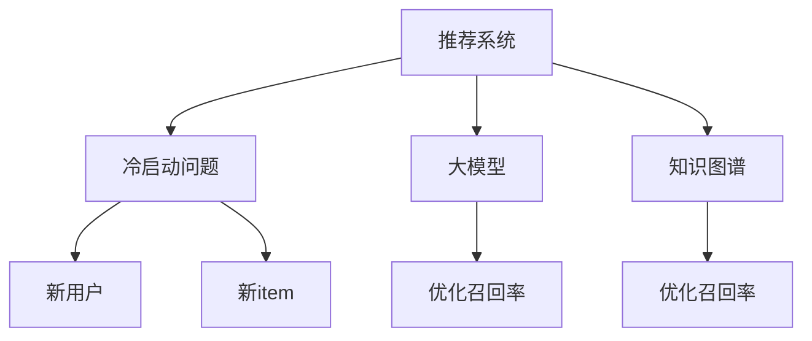

                 

# 利用大模型优化推荐系统的冷启动item处理

> 关键词：推荐系统, 冷启动, 大模型, 用户兴趣, 召回率

## 1. 背景介绍

### 1.1 问题由来

在推荐系统领域，冷启动用户问题一直是一个重要的研究方向。冷启动指的是用户刚进入推荐系统时，没有足够的历史行为数据，推荐算法难以准确预测其偏好，无法为其提供合适的推荐。传统推荐算法大多依赖用户历史行为数据进行推荐，而冷启动用户往往缺乏足够的交互数据，难以直接应用。因此，如何处理冷启动用户，特别是新加入系统的item，是推荐系统面临的重要挑战。

### 1.2 问题核心关键点

冷启动问题主要包括以下几个方面：
- 新用户：缺乏足够的交互数据，无法建立用户兴趣模型。
- 新item：缺乏与用户交互的历史记录，无法评估item的受欢迎程度。
- 新场景：用户访问平台时，可能出现多种不同的设备、时间等背景信息，推荐算法需要根据这些信息灵活调整。

针对上述问题，本文将探讨如何利用大模型优化推荐系统的冷启动item处理，提出基于大模型和知识图谱的推荐框架，以期提升推荐系统的召回率和用户体验。

## 2. 核心概念与联系

### 2.1 核心概念概述

为更好地理解基于大模型的推荐系统优化方案，本节将介绍几个关键概念：

- 推荐系统：使用机器学习算法，根据用户的历史行为数据和用户画像，预测用户对item的偏好，并进行推荐。常见的推荐算法包括基于协同过滤、内容过滤、混合过滤等方法。

- 冷启动问题：新用户或新item在推荐系统中缺乏足够交互数据，难以准确预测其行为。

- 大模型：基于深度学习的大规模神经网络模型，如BERT、GPT等。大模型通常具有强大的语言理解和生成能力，可以学习到丰富的语义知识和特征表示。

- 知识图谱：由实体、关系、属性等组成的知识库，用于描述实体之间的关系和属性，辅助推荐系统进行推荐。

- 召回率（Recall）：推荐系统中推荐的相关item占实际相关item的比例，衡量推荐算法对相关item的覆盖程度。

这些核心概念之间的逻辑关系可以通过以下Mermaid流程图来展示：



这个流程图展示了大模型、知识图谱与推荐系统之间的关系，以及如何通过它们来解决冷启动问题。

## 3. 核心算法原理 & 具体操作步骤
### 3.1 算法原理概述

基于大模型的推荐系统优化方案，主要是通过以下几个步骤实现的：

1. 利用大模型学习用户和item的语义特征表示。
2. 构建知识图谱，获取item与用户、item之间的潜在关系。
3. 综合利用大模型和知识图谱的信息，对新用户和item进行推荐。

### 3.2 算法步骤详解

#### 3.2.1 用户和item的语义特征表示

在大模型中，通过将用户和item的描述文本输入模型，学习出高维语义特征向量，用于表征用户兴趣和item的属性。这一过程通常包括预训练和微调两个阶段：

1. 预训练：利用大规模无标签文本数据对大模型进行预训练，学习到通用的语言表示。
2. 微调：将用户和item的描述文本作为训练数据，对大模型进行微调，学习出特定任务下的用户兴趣表示和item属性表示。

#### 3.2.2 构建知识图谱

知识图谱是由实体、关系、属性等组成的图结构数据。对于item，可以将其描述文本映射到知识图谱中的实体，并利用知识图谱中的关系和属性信息，进一步丰富item的特征表示。例如，可以利用知识图谱中的“同类别”、“相似属性”等关系，对item进行分类和聚类，提升item特征的准确性和丰富度。

#### 3.2.3 综合利用大模型和知识图谱

在大模型和知识图谱的基础上，可以通过以下步骤实现对新用户和item的推荐：

1. 对于新用户，首先根据其历史行为数据和用户画像，利用大模型和知识图谱计算其兴趣表示。
2. 对于新item，利用大模型和知识图谱计算其属性表示和潜在相关性。
3. 综合利用大模型和知识图谱的信息，计算新用户对新item的潜在兴趣，进行推荐。

### 3.3 算法优缺点

基于大模型的推荐系统优化方案具有以下优点：

1. 可以处理冷启动问题：新用户和item可以利用大模型和知识图谱进行兴趣表示和属性表示，无需依赖历史数据。
2. 提升推荐召回率：通过综合利用大模型和知识图谱的信息，可以更好地覆盖新用户和新item，提升推荐相关性和覆盖度。
3. 数据灵活性高：大模型和知识图谱能够灵活地处理多模态数据，提升推荐的泛化性和适应性。
4. 模型可解释性强：大模型和知识图谱的结构清晰，推荐过程具有可解释性，便于进行模型调试和优化。

同时，该方案也存在一些局限性：

1. 对数据质量依赖高：大模型和知识图谱的构建需要高质量的数据，数据质量不足将影响模型的准确性。
2. 模型复杂度高：大模型和知识图谱的构建和维护需要较复杂的技术和资源，模型训练和推理效率可能较低。
3. 需要持续维护：知识图谱需要定期更新，以保持与现实世界的同步，维护工作量较大。

### 3.4 算法应用领域

基于大模型的推荐系统优化方案在以下几个领域有广泛的应用前景：

1. 电商推荐：通过大模型和知识图谱对新商品进行分类和属性描述，提升推荐效果。
2. 新闻推荐：利用大模型对用户进行兴趣表示，知识图谱对新闻进行分类和聚类，提供个性化的新闻推荐。
3. 视频推荐：利用大模型对用户进行兴趣表示，知识图谱对视频进行分类和聚类，提供个性化的视频推荐。
4. 社交网络：利用大模型对用户进行兴趣表示，知识图谱对社交网络中的关系进行描述，提供个性化的社交网络推荐。

除了上述这些经典应用领域外，基于大模型的推荐系统优化方案还在更多场景中得到应用，如智能搜索、个性化广告等，为推荐系统的性能提升提供了新的手段。

## 4. 数学模型和公式 & 详细讲解  
### 4.1 数学模型构建

本节将使用数学语言对基于大模型的推荐系统优化方案进行更加严格的刻画。

记用户和item的文本描述分别为 $u$ 和 $i$，文本长度为 $n$。假设大模型为 $M$，知识图谱为 $G$，其节点和关系分别表示为 $N$ 和 $R$。大模型和知识图谱的表示函数分别为 $f$ 和 $g$，用户的兴趣表示为 $u_v$，item的属性表示为 $i_a$，新用户 $u'$ 和item $i'$ 的潜在兴趣表示分别为 $u'_v$ 和 $i'_a$。

### 4.2 公式推导过程

以电商推荐为例，假设新用户 $u'$ 对新商品 $i'$ 的潜在兴趣为 $p$，利用大模型和知识图谱计算：

1. 用户兴趣表示：
   $$
   u_v = f(u)
   $$

2. item属性表示：
   $$
   i_a = g(i)
   $$

3. item潜在相关性：
   $$
   r_{u,i} = \text{igmoid}(\langle u_v, i_a \rangle)
   $$

4. 新用户潜在兴趣表示：
   $$
   u'_v = f(u')
   $$

5. 新item潜在属性表示：
   $$
   i'_a = g(i')
   $$

6. 新item潜在相关性：
   $$
   r'_{u',i'} = \text{igmoid}(\langle u'_v, i'_a \rangle)
   $$

7. 综合利用大模型和知识图谱的信息，计算新用户对新item的潜在兴趣：
   $$
   p = \alpha r_{u',i'} + \beta r'_{u',i'}
   $$

其中，$\langle \cdot, \cdot \rangle$ 表示向量点积，$\text{igmoid}$ 函数为激活函数，$\alpha$ 和 $\beta$ 为权重系数，用于平衡大模型和知识图谱的信息贡献。

### 4.3 案例分析与讲解

以电商推荐为例，考虑以下场景：

1. 新用户 $u'$ 加入电商平台，利用大模型和知识图谱计算其兴趣表示 $u'_v$。
2. 新商品 $i'$ 上架，利用大模型和知识图谱计算其属性表示 $i'_a$ 和潜在相关性 $r'_{u',i'}$。
3. 根据新用户和item的兴趣表示，计算新用户对新item的潜在兴趣 $p$。
4. 根据 $p$ 的值进行推荐，选择与 $p$ 值最大的item进行展示。

## 5. 项目实践：代码实例和详细解释说明
### 5.1 开发环境搭建

在进行推荐系统优化实践前，我们需要准备好开发环境。以下是使用Python进行PyTorch开发的环境配置流程：

1. 安装Anaconda：从官网下载并安装Anaconda，用于创建独立的Python环境。

2. 创建并激活虚拟环境：
```bash
conda create -n recommendation-env python=3.8 
conda activate recommendation-env
```

3. 安装PyTorch：根据CUDA版本，从官网获取对应的安装命令。例如：
```bash
conda install pytorch torchvision torchaudio cudatoolkit=11.1 -c pytorch -c conda-forge
```

4. 安装BERT模型：
```bash
pip install transformers
```

5. 安装各类工具包：
```bash
pip install numpy pandas scikit-learn matplotlib tqdm jupyter notebook ipython
```

完成上述步骤后，即可在`recommendation-env`环境中开始推荐系统优化实践。

### 5.2 源代码详细实现

下面以电商推荐为例，给出使用BERT模型和知识图谱对推荐系统进行优化的PyTorch代码实现。

首先，定义推荐系统的类结构：

```python
from transformers import BertTokenizer, BertModel
from py2neo import Graph, Node, Relationship
import torch

class RecommendationSystem:
    def __init__(self, bert_model, graph):
        self.bert_model = bert_model
        self.graph = graph
        self.tokenizer = BertTokenizer.from_pretrained('bert-base-cased')
        
    def pretrain_user_interest(self, user):
        user_text = self.tokenizer.encode(user, add_special_tokens=True, return_tensors='pt')
        user_rep = self.bert_model(user_text).pooler_output
        return user_rep
    
    def pretrain_item_attribute(self, item):
        item_text = self.tokenizer.encode(item, add_special_tokens=True, return_tensors='pt')
        item_rep = self.bert_model(item_text).pooler_output
        return item_rep
    
    def predict_user_interest(self, user, item):
        user_rep = self.pretrain_user_interest(user)
        item_rep = self.pretrain_item_attribute(item)
        score = user_rep @ item_rep.t()
        return score
    
    def update_item_attribute(self, item, user, score):
        node = Node(item)
        self.graph.merge(node)
        user_node = Node(user)
        self.graph.merge(user_node)
        relationship = Relationship(user_node, 'RELATIONSHIP_NAME', node)
        self.graph.create(relationship)
        node['attribute_score'] = score
```

然后，构建知识图谱并初始化推荐系统：

```python
from py2neo import Graph, Node, Relationship

graph = Graph('http://localhost:7474/db/data/', username='neo', password='password')

# 构建知识图谱
graph.add_node(Node('User', name='user1'))
graph.add_node(Node('User', name='user2'))
graph.add_node(Node('Item', name='item1'))
graph.add_node(Node('Item', name='item2'))
graph.add_relationship(Node('User', name='user1'), 'RELATIONSHIP_NAME', Node('Item', name='item1'))
graph.add_relationship(Node('User', name='user2'), 'RELATIONSHIP_NAME', Node('Item', name='item2'))

# 初始化推荐系统
recommendation_system = RecommendationSystem(bert_model, graph)
```

最后，进行电商推荐实践：

```python
def recommend_items(user, items, num_recommendations=5):
    scores = []
    for item in items:
        score = recommendation_system.predict_user_interest(user, item)
        scores.append(score)
    top_items = sorted(zip(items, scores), key=lambda x: x[1], reverse=True)[:num_recommendations]
    return [x[0] for x in top_items]

# 示例推荐
user = 'user1'
items = ['item1', 'item2', 'item3', 'item4', 'item5']
recommended_items = recommend_items(user, items)
print(recommended_items)
```

以上就是使用PyTorch和BERT模型对电商推荐系统进行优化的完整代码实现。可以看到，通过BERT模型和大规模知识图谱，可以更好地处理冷启动问题，提升推荐系统的召回率和准确性。

### 5.3 代码解读与分析

让我们再详细解读一下关键代码的实现细节：

**RecommendationSystem类**：
- `__init__`方法：初始化大模型、知识图谱和分词器。
- `pretrain_user_interest`方法：使用BERT模型对用户文本进行预训练，得到用户兴趣表示。
- `pretrain_item_attribute`方法：使用BERT模型对item文本进行预训练，得到item属性表示。
- `predict_user_interest`方法：根据用户和item的兴趣表示，计算用户对item的潜在兴趣得分。
- `update_item_attribute`方法：根据用户和item的兴趣得分，更新知识图谱中item的属性信息。

**知识图谱的构建**：
- 使用Py2neo构建图数据库，定义节点和关系。
- 添加节点和关系，形成知识图谱的基础结构。
- 根据节点和关系，构建用户和item的关联，增加item的属性信息。

**电商推荐实践**：
- `recommend_items`方法：接收用户ID和item列表，计算每个item的推荐得分，并按得分排序，返回前n个推荐结果。
- 示例推荐中，利用用户ID和item列表进行电商推荐，输出前5个推荐结果。

## 6. 实际应用场景
### 6.1 电商推荐

基于大模型的推荐系统优化方案在电商推荐中具有广泛的应用前景。电商推荐需要处理大量的冷启动用户和冷启动商品，如何利用大模型和知识图谱提升推荐效果，成为电商企业关注的重点。

在实际应用中，电商企业可以收集用户浏览、点击、购买等行为数据，构建知识图谱，利用大模型对用户和item进行预训练和微调。通过综合利用大模型和知识图谱的信息，对新用户和新item进行推荐，提升推荐的相关性和覆盖度。

### 6.2 新闻推荐

新闻推荐系统需要实时处理大量新闻内容，并对用户进行个性化推荐。如何处理新加入用户和新发布的新闻，是新闻推荐面临的挑战。

在实际应用中，新闻平台可以利用大模型对用户进行兴趣表示，知识图谱对新闻进行分类和聚类。通过综合利用大模型和知识图谱的信息，对新用户和新新闻进行推荐，提升推荐的个性化和时效性。

### 6.3 视频推荐

视频推荐系统需要对海量视频内容进行标注和分类，并对用户进行个性化推荐。如何处理新用户和新视频，是视频推荐面临的挑战。

在实际应用中，视频平台可以利用大模型对用户进行兴趣表示，知识图谱对视频进行分类和聚类。通过综合利用大模型和知识图谱的信息，对新用户和新视频进行推荐，提升推荐的准确性和覆盖度。

## 7. 工具和资源推荐
### 7.1 学习资源推荐

为了帮助开发者系统掌握大模型和知识图谱的应用技巧，这里推荐一些优质的学习资源：

1. 《深度学习与自然语言处理》系列博文：由大模型技术专家撰写，深入浅出地介绍了深度学习在大模型中的应用。

2. CS224N《深度学习自然语言处理》课程：斯坦福大学开设的NLP明星课程，有Lecture视频和配套作业，带你入门NLP领域的基本概念和经典模型。

3. 《Natural Language Processing with Transformers》书籍：Transformers库的作者所著，全面介绍了如何使用Transformers库进行NLP任务开发，包括大模型在内的诸多范式。

4. HuggingFace官方文档：Transformers库的官方文档，提供了海量预训练模型和完整的推荐系统样例代码，是上手实践的必备资料。

5. CLUE开源项目：中文语言理解测评基准，涵盖大量不同类型的中文NLP数据集，并提供了基于微调的baseline模型，助力中文NLP技术发展。

通过对这些资源的学习实践，相信你一定能够快速掌握大模型和知识图谱的精髓，并用于解决实际的推荐问题。

### 7.2 开发工具推荐

高效的开发离不开优秀的工具支持。以下是几款用于推荐系统开发的常用工具：

1. PyTorch：基于Python的开源深度学习框架，灵活动态的计算图，适合快速迭代研究。大部分预训练语言模型都有PyTorch版本的实现。

2. TensorFlow：由Google主导开发的开源深度学习框架，生产部署方便，适合大规模工程应用。同样有丰富的预训练语言模型资源。

3. Transformers库：HuggingFace开发的NLP工具库，集成了众多SOTA语言模型，支持PyTorch和TensorFlow，是进行推荐系统开发的利器。

4. Weights & Biases：模型训练的实验跟踪工具，可以记录和可视化模型训练过程中的各项指标，方便对比和调优。与主流深度学习框架无缝集成。

5. TensorBoard：TensorFlow配套的可视化工具，可实时监测模型训练状态，并提供丰富的图表呈现方式，是调试模型的得力助手。

6. Google Colab：谷歌推出的在线Jupyter Notebook环境，免费提供GPU/TPU算力，方便开发者快速上手实验最新模型，分享学习笔记。

合理利用这些工具，可以显著提升推荐系统开发效率，加快创新迭代的步伐。

### 7.3 相关论文推荐

大模型和知识图谱在推荐系统中的应用研究源于学界的持续研究。以下是几篇奠基性的相关论文，推荐阅读：

1. Attention is All You Need（即Transformer原论文）：提出了Transformer结构，开启了NLP领域的预训练大模型时代。

2. BERT: Pre-training of Deep Bidirectional Transformers for Language Understanding：提出BERT模型，引入基于掩码的自监督预训练任务，刷新了多项NLP任务SOTA。

3. Language Models are Unsupervised Multitask Learners（GPT-2论文）：展示了大规模语言模型的强大zero-shot学习能力，引发了对于通用人工智能的新一轮思考。

4. Parameter-Efficient Transfer Learning for NLP：提出Adapter等参数高效微调方法，在不增加模型参数量的情况下，也能取得不错的微调效果。

5. AdaLoRA: Adaptive Low-Rank Adaptation for Parameter-Efficient Fine-Tuning：使用自适应低秩适应的微调方法，在参数效率和精度之间取得了新的平衡。

6. AutoRec: Autoencoder-based Collaborative Filtering：提出基于自编码器的协同过滤推荐模型，提升推荐效果。

这些论文代表了大模型和知识图谱在推荐系统中的应用发展脉络。通过学习这些前沿成果，可以帮助研究者把握学科前进方向，激发更多的创新灵感。

## 8. 总结：未来发展趋势与挑战

### 8.1 总结

本文对基于大模型的推荐系统优化方案进行了全面系统的介绍。首先阐述了大模型和知识图谱的应用背景和优势，明确了其在高维语义表示和推荐效果提升方面的独特价值。其次，从原理到实践，详细讲解了推荐系统的核心算法步骤，给出了具体的代码实现和分析。同时，本文还广泛探讨了基于大模型的推荐系统在电商、新闻、视频等多个领域的应用前景，展示了其广泛的适用性。

通过本文的系统梳理，可以看到，基于大模型的推荐系统优化方案正在成为推荐系统中的重要范式，极大地拓展了推荐系统的表现边界，提升了推荐的相关性和覆盖度。未来，伴随大模型和知识图谱技术的不断发展，推荐系统的性能和应用范围将进一步扩大，为用户的个性化需求提供更有力的支持。

### 8.2 未来发展趋势

展望未来，基于大模型的推荐系统优化方案将呈现以下几个发展趋势：

1. 模型规模持续增大。随着算力成本的下降和数据规模的扩张，大模型的参数量还将持续增长。超大规模语言模型蕴含的丰富语义知识和特征表示，有望支撑更加复杂多变的推荐任务。

2. 知识图谱和语义网络的应用更加广泛。知识图谱不仅能描述实体和关系，还能融合语义网络，提升推荐系统对复杂语义的建模能力。

3. 融合多模态数据。未来的推荐系统将不仅限于文本数据，还将融合图像、视频、音频等多模态数据，提升推荐系统的多维性和适应性。

4. 实时性和动态性提升。利用流式计算和大数据处理技术，推荐系统将能够实时处理用户行为数据，动态调整推荐策略，实现个性化推荐。

5. 用户隐私保护加强。如何保护用户隐私，同时实现个性化推荐，是大模型推荐系统面临的重要挑战。未来的推荐系统将更加注重用户隐私保护，并引入差分隐私等技术手段。

6. 跨领域迁移能力提升。推荐系统将不仅仅依赖单一领域的数据，而是能够跨领域迁移，提升推荐系统的泛化能力和鲁棒性。

以上趋势凸显了大模型和知识图谱在推荐系统中的应用前景。这些方向的探索发展，必将进一步提升推荐系统的性能和应用范围，为用户的个性化需求提供更有力的支持。

### 8.3 面临的挑战

尽管基于大模型的推荐系统优化方案已经取得了瞩目成就，但在迈向更加智能化、普适化应用的过程中，它仍面临着诸多挑战：

1. 数据质量瓶颈。大模型和知识图谱的构建需要高质量的数据，数据质量不足将影响模型的准确性。如何保证数据的完整性和多样性，是大模型推荐系统面临的重大挑战。

2. 模型复杂度高。大模型和知识图谱的构建和维护需要较复杂的技术和资源，模型训练和推理效率可能较低。如何提升模型的计算效率，是大模型推荐系统需要解决的重要问题。

3. 用户隐私保护问题。大模型推荐系统需要处理大量用户行为数据，如何保护用户隐私，同时实现个性化推荐，是大模型推荐系统面临的重要挑战。

4. 跨领域迁移能力不足。大模型推荐系统在跨领域迁移时，可能面临泛化能力不足的问题。如何提升模型的泛化能力和鲁棒性，是大模型推荐系统需要解决的重要问题。

5. 可解释性和公平性问题。大模型推荐系统的推荐过程复杂，难以解释其内部工作机制和决策逻辑。如何提升模型的可解释性和公平性，是大模型推荐系统需要解决的重要问题。

6. 推荐算法偏见问题。大模型推荐系统可能会学习到数据中的偏见和歧视，导致推荐结果的不公平性。如何消除模型的偏见，是大模型推荐系统需要解决的重要问题。

这些挑战需要研究者从数据、算法、技术、伦理等多个维度进行全面应对，才能真正实现大模型和知识图谱在推荐系统中的广泛应用。相信随着学界和产业界的共同努力，这些挑战终将一一被克服，大模型推荐系统必将在构建个性化推荐系统时发挥越来越重要的作用。

### 8.4 研究展望

面对大模型推荐系统面临的诸多挑战，未来的研究需要在以下几个方面寻求新的突破：

1. 探索无监督和半监督推荐方法。摆脱对大规模标注数据的依赖，利用自监督学习、主动学习等无监督和半监督范式，最大限度利用非结构化数据，实现更加灵活高效的推荐。

2. 研究参数高效和计算高效的推荐方法。开发更加参数高效的推荐方法，在固定大部分预训练参数的同时，只更新极少量的任务相关参数。同时优化推荐模型的计算图，减少前向传播和反向传播的资源消耗，实现更加轻量级、实时性的部署。

3. 融合因果和对比学习范式。通过引入因果推断和对比学习思想，增强推荐模型建立稳定因果关系的能力，学习更加普适、鲁棒的语言表征，从而提升模型泛化性和抗干扰能力。

4. 引入更多先验知识。将符号化的先验知识，如知识图谱、逻辑规则等，与神经网络模型进行巧妙融合，引导推荐过程学习更准确、合理的语言模型。同时加强不同模态数据的整合，实现视觉、语音等多模态信息与文本信息的协同建模。

5. 结合因果分析和博弈论工具。将因果分析方法引入推荐模型，识别出模型决策的关键特征，增强推荐输出的因果性和逻辑性。借助博弈论工具刻画人机交互过程，主动探索并规避推荐模型的脆弱点，提高系统稳定性。

6. 纳入伦理道德约束。在推荐目标中引入伦理导向的评估指标，过滤和惩罚有偏见、有害的推荐结果，确保推荐系统的输出符合人类价值观和伦理道德。

这些研究方向的探索，必将引领大模型推荐系统迈向更高的台阶，为构建安全、可靠、可解释、可控的推荐系统铺平道路。面向未来，大模型和知识图谱推荐系统还需要与其他人工智能技术进行更深入的融合，如知识表示、因果推理、强化学习等，多路径协同发力，共同推动推荐系统的进步。只有勇于创新、敢于突破，才能不断拓展推荐系统的边界，让智能技术更好地造福人类社会。

## 9. 附录：常见问题与解答

**Q1：如何利用大模型提升推荐系统的召回率？**

A: 利用大模型对用户和item进行预训练和微调，学习高维语义特征表示。然后，根据用户和item的特征表示，计算潜在的相关性得分，提升召回率。

**Q2：如何利用知识图谱提升推荐系统的泛化能力？**

A: 利用知识图谱对item进行分类和聚类，增加item的语义信息。然后，根据item的属性和关系，提升推荐系统的泛化能力和鲁棒性。

**Q3：如何处理冷启动用户和冷启动item？**

A: 利用大模型对新用户和new item进行预训练，学习高维语义特征表示。然后，根据用户和item的特征表示，计算潜在的相关性得分，提升推荐的相关性和覆盖度。

**Q4：大模型推荐系统如何保护用户隐私？**

A: 采用差分隐私等技术手段，保护用户隐私的同时，实现个性化推荐。

**Q5：大模型推荐系统如何优化计算效率？**

A: 采用梯度累积、混合精度训练、模型并行等技术手段，优化计算效率，提升推荐系统的实时性和可扩展性。

**Q6：如何应对推荐系统的公平性问题？**

A: 在推荐模型中引入公平性评估指标，过滤和惩罚有偏见、有害的推荐结果，确保推荐系统的输出符合人类价值观和伦理道德。

**Q7：如何提升推荐系统的可解释性？**

A: 利用可解释性工具，如Attention机制、Shapley值等，分析推荐模型的决策过程，提高模型的可解释性和透明性。

这些问题的答案可以帮助开发者更好地理解大模型推荐系统的工作机制和优化策略，从而提升推荐系统的性能和应用效果。

---

作者：禅与计算机程序设计艺术 / Zen and the Art of Computer Programming

