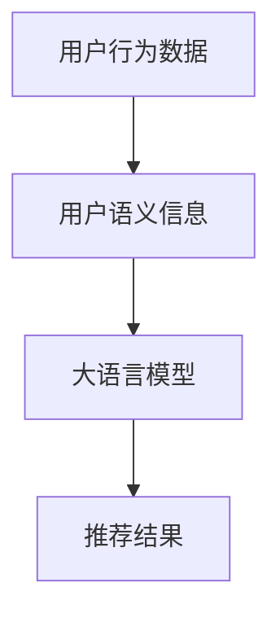

                 

# 利用大模型进行推荐多样性提升的新思路

> 关键词：推荐系统,大语言模型,推荐多样性,多样性提升,协同过滤

## 1. 背景介绍

### 1.1 问题由来

推荐系统（Recommendation System）是互联网时代最重要的应用之一，旨在为用户提供个性化的物品推荐，从而提升用户体验和消费转化率。传统的推荐方法主要包括协同过滤（Collaborative Filtering）、基于内容的推荐（Content-based Filtering）等。但随着数据量和用户数量的急剧增长，这些方法的局限性逐渐显现，主要体现在：

- 数据稀疏性问题：传统协同过滤方法依赖用户历史行为数据，但存在数据稀疏性问题，难以推荐新物品给未曾交互过的用户。
- 用户隐式反馈噪声：用户隐式反馈（如浏览、点击等）存在大量噪声，传统方法难以准确捕捉用户的真实兴趣。
- 物品多样性不足：传统方法往往偏重热门物品推荐，导致推荐结果的多样性不足，降低用户的满意度和粘性。

为了解决上述问题，近年来推荐系统研究逐渐引入大语言模型，利用其强大的自然语言处理能力，提升推荐系统的效果和多样性。特别是在推荐多样性方面，已有学者通过将自然语言理解嵌入推荐模型，获得了显著提升。然而，现有方法在实际应用中仍存在一些问题，如对用户隐式反馈的建模不够准确，推荐结果的可解释性不足，以及对于推荐结果的多样性保障不够充分。

### 1.2 问题核心关键点

推荐多样性提升是推荐系统研究的一个核心问题。提高推荐结果的多样性，不仅可以增强用户对推荐系统的满意度，还可以降低推荐结果的重复性和路径依赖性。在当前大模型热潮的推动下，利用大模型提升推荐系统多样性，成为最新的研究热点。本节将介绍大模型提升推荐多样性的关键点，包括：

- 利用大模型捕捉用户语义兴趣：通过对用户历史行为和语义信息的双重建模，更加准确地捕捉用户真实的隐式反馈，提升推荐系统的准确性和多样性。
- 引入多样性约束机制：通过在大模型训练中引入多样性约束，确保推荐结果的多样性，避免推荐路径的同质化和信息的冗余。
- 利用大模型生成新物品：通过大模型对用户语义兴趣的建模，生成新的、与用户兴趣匹配的潜在物品，增强推荐结果的多样性。

## 2. 核心概念与联系

### 2.1 核心概念概述

推荐系统旨在为用户推荐其可能感兴趣的物品，通过用户与物品的交互数据，预测用户的兴趣和物品的相关性，从而实现个性化推荐。在大模型热潮的推动下，利用大模型的语言理解能力，可以更加准确地捕捉用户的语义兴趣，提升推荐系统的多样性。

大语言模型是指在大规模无标签文本数据上进行预训练，学习到通用的语言表示模型。如GPT、BERT等模型，通过在大规模语料上进行自监督学习，学习到丰富的语言知识和语义表示，可以应用于各类NLP任务。在推荐系统中，利用大语言模型捕捉用户的语义兴趣，可以更加全面地理解用户需求，提升推荐的多样性和准确性。

### 2.2 核心概念原理和架构的 Mermaid 流程图



此图展示了利用大语言模型提升推荐多样性的基本流程。具体而言，从用户行为数据中提取用户语义信息，利用大语言模型捕捉用户的语义兴趣，生成与用户兴趣匹配的推荐结果。

## 3. 核心算法原理 & 具体操作步骤

### 3.1 算法原理概述

利用大模型提升推荐多样性，主要涉及以下两个方面的核心算法原理：

1. 用户语义兴趣的建模：通过大语言模型，捕捉用户的语义兴趣，从而更加全面地理解用户需求。
2. 多样性约束机制的引入：通过在大模型训练中引入多样性约束，确保推荐结果的多样性，避免推荐路径的同质化和信息的冗余。

### 3.2 算法步骤详解

#### 3.2.1 用户语义兴趣的建模

用户语义兴趣的建模是利用大模型提升推荐多样性的关键步骤。其主要步骤如下：

1. **用户行为数据预处理**：收集用户的历史行为数据，如浏览记录、点击记录、评分记录等，将其转换为适合大模型输入的格式。

2. **用户语义信息提取**：利用大模型对用户行为数据进行语义分析，提取出用户的关键语义信息，如兴趣主题、关键词等。

3. **用户语义兴趣捕捉**：通过大模型对用户语义信息进行建模，捕捉用户的语义兴趣，生成用户兴趣表示。

具体而言，可以利用BERT、GPT等预训练语言模型，对用户历史行为数据进行编码，提取用户兴趣的关键语义信息。例如，将用户的浏览记录转换为文本形式，输入到BERT模型中，得到用户兴趣的语义表示。该表示可以进一步用于生成推荐结果的多样性和准确性评估。

#### 3.2.2 多样性约束机制的引入

推荐结果的多样性约束机制，是利用大模型提升推荐多样性的另一关键步骤。其主要步骤如下：

1. **推荐结果多样性计算**：通过大模型计算推荐结果的多样性，包括推荐物品的数量、分布、关联性等。

2. **多样性约束条件设置**：根据业务需求和用户偏好，设置推荐结果的多样性约束条件。

3. **多样性约束机制引入**：在大模型训练中引入多样性约束机制，确保生成的推荐结果符合多样性要求。

具体而言，可以通过在大模型的损失函数中引入多样性约束项，控制推荐结果的多样性。例如，可以使用多样性损失函数，如多样性交叉熵损失、多样性L2正则等，对推荐结果进行约束，避免推荐路径的同质化和信息的冗余。同时，可以通过在大模型训练中引入正则化技术，如L2正则、Dropout等，进一步提升推荐结果的多样性。

### 3.3 算法优缺点

利用大模型提升推荐多样性，具有以下优点：

1. **准确性提升**：通过捕捉用户语义兴趣，利用大模型的语言理解能力，更加准确地预测用户的兴趣和物品的相关性，提升推荐系统的准确性。
2. **多样性增强**：通过引入多样性约束机制，确保推荐结果的多样性，避免推荐路径的同质化和信息的冗余。
3. **泛化能力更强**：大模型的预训练过程使其具有更强的泛化能力，能够更好地适应不同领域和不同类型的推荐任务。

同时，该方法也存在一些局限性：

1. **计算资源需求高**：大模型需要大量的计算资源进行预训练和微调，对于资源有限的场景，难以快速实现。
2. **数据隐私问题**：利用用户行为数据进行语义建模，可能涉及用户隐私问题，需要进行严格的数据保护和隐私保护措施。
3. **可解释性不足**：大模型的决策过程缺乏可解释性，难以理解推荐结果的生成逻辑，不利于用户信任和接受。

尽管存在这些局限性，但大模型在推荐多样性提升方面的优势，使其成为当前推荐系统研究的热点方向。未来研究需进一步优化计算资源的使用，提升大模型的可解释性，同时保证数据隐私。

### 3.4 算法应用领域

利用大模型提升推荐多样性的算法，可以应用于多种推荐场景，包括但不限于以下几类：

- **电商推荐**：通过捕捉用户语义兴趣，利用大模型的语言理解能力，为用户推荐个性化的商品，提升用户的购物体验和满意度。
- **视频推荐**：利用大模型的语义建模能力，为用户推荐视频内容，如电影、电视剧、综艺节目等，提升用户的观看体验。
- **音乐推荐**：通过捕捉用户的音乐偏好，利用大模型的语言理解能力，为用户推荐个性化的音乐，提升用户的听歌体验。
- **新闻推荐**：利用大模型的语义建模能力，为用户推荐相关的新闻文章，提升用户的阅读体验。
- **个性化旅游推荐**：通过捕捉用户的旅游偏好，利用大模型的语言理解能力，为用户推荐个性化的旅游目的地和旅游路线，提升用户的旅游体验。

## 4. 数学模型和公式 & 详细讲解 & 举例说明

### 4.1 数学模型构建

为了更好地理解利用大模型提升推荐多样性的数学模型，本节将介绍几个关键数学模型和公式：

假设用户历史行为数据为 $U=\{u_1,u_2,\dots,u_m\}$，其中 $u_i=\{x_i,y_i\}$，$x_i$ 为用户的行为数据，$y_i$ 为用户对物品 $i$ 的评分。

定义大语言模型为 $M_{\theta}:\mathcal{X} \rightarrow \mathcal{Y}$，其中 $\mathcal{X}$ 为输入空间，$\mathcal{Y}$ 为输出空间，$\theta \in \mathbb{R}^d$ 为模型参数。

### 4.2 公式推导过程

#### 4.2.1 用户语义兴趣的建模

利用大模型捕捉用户语义兴趣的过程，可以表示为：

$$
\mathbf{e_u} = M_{\theta}(x_u)
$$

其中 $\mathbf{e_u}$ 为用户 $u$ 的兴趣表示。

具体而言，利用BERT模型对用户历史行为数据 $x_u$ 进行编码，得到用户的兴趣表示 $\mathbf{e_u}$。该表示可以用于后续的多样性计算和推荐结果生成。

#### 4.2.2 多样性约束机制的引入

利用大模型引入推荐结果的多样性约束，可以表示为：

$$
L_{div} = \frac{1}{N} \sum_{i=1}^N \ell_{div}(y_i,\hat{y}_i)
$$

其中 $L_{div}$ 为多样性损失函数，$\ell_{div}$ 为多样性损失函数的具体形式，$y_i$ 为实际评分，$\hat{y}_i$ 为模型预测的评分。

具体而言，可以通过在大模型的损失函数中引入多样性约束项，控制推荐结果的多样性。例如，可以使用多样性损失函数，如多样性交叉熵损失、多样性L2正则等，对推荐结果进行约束，避免推荐路径的同质化和信息的冗余。

### 4.3 案例分析与讲解

#### 4.3.1 电商推荐中的多样性提升

在电商推荐中，利用大模型提升推荐多样性，主要涉及以下步骤：

1. **用户行为数据预处理**：收集用户的历史浏览记录、点击记录、评分记录等，将其转换为适合大模型输入的格式。

2. **用户语义信息提取**：利用BERT模型对用户浏览记录进行编码，提取用户的兴趣主题、关键词等关键语义信息。

3. **用户语义兴趣捕捉**：通过BERT模型对用户语义信息进行建模，捕捉用户的语义兴趣，生成用户兴趣表示。

4. **推荐结果多样性计算**：利用大模型计算推荐结果的多样性，包括推荐物品的数量、分布、关联性等。

5. **多样性约束机制引入**：在大模型训练中引入多样性约束机制，确保生成的推荐结果符合多样性要求。

具体而言，可以通过在大模型的损失函数中引入多样性约束项，控制推荐结果的多样性。例如，可以使用多样性损失函数，如多样性交叉熵损失、多样性L2正则等，对推荐结果进行约束，避免推荐路径的同质化和信息的冗余。

## 5. 项目实践：代码实例和详细解释说明

### 5.1 开发环境搭建

在进行大模型推荐多样性提升实践前，我们需要准备好开发环境。以下是使用Python进行PyTorch开发的环境配置流程：

1. 安装Anaconda：从官网下载并安装Anaconda，用于创建独立的Python环境。

2. 创建并激活虚拟环境：
```bash
conda create -n pytorch-env python=3.8 
conda activate pytorch-env
```

3. 安装PyTorch：根据CUDA版本，从官网获取对应的安装命令。例如：
```bash
conda install pytorch torchvision torchaudio cudatoolkit=11.1 -c pytorch -c conda-forge
```

4. 安装Transformers库：
```bash
pip install transformers
```

5. 安装各类工具包：
```bash
pip install numpy pandas scikit-learn matplotlib tqdm jupyter notebook ipython
```

完成上述步骤后，即可在`pytorch-env`环境中开始项目实践。

### 5.2 源代码详细实现

下面我们以电商推荐系统为例，给出使用Transformers库对BERT模型进行推荐多样性提升的PyTorch代码实现。

首先，定义电商推荐系统中的数据处理函数：

```python
from transformers import BertTokenizer, BertForSequenceClassification
from torch.utils.data import Dataset
import torch

class ProductReviewDataset(Dataset):
    def __init__(self, texts, labels, tokenizer, max_len=128):
        self.texts = texts
        self.labels = labels
        self.tokenizer = tokenizer
        self.max_len = max_len
        
    def __len__(self):
        return len(self.texts)
    
    def __getitem__(self, item):
        text = self.texts[item]
        label = self.labels[item]
        
        encoding = self.tokenizer(text, return_tensors='pt', max_length=self.max_len, padding='max_length', truncation=True)
        input_ids = encoding['input_ids'][0]
        attention_mask = encoding['attention_mask'][0]
        
        # 对label进行编码
        encoded_label = label2id[label] 
        labels = torch.tensor(encoded_label, dtype=torch.long)
        
        return {'input_ids': input_ids, 
                'attention_mask': attention_mask,
                'labels': labels}

# 标签与id的映射
label2id = {'buy': 0, 'return': 1, 'complaint': 2}
id2label = {v: k for k, v in label2id.items()}

# 创建dataset
tokenizer = BertTokenizer.from_pretrained('bert-base-cased')

train_dataset = ProductReviewDataset(train_texts, train_labels, tokenizer)
dev_dataset = ProductReviewDataset(dev_texts, dev_labels, tokenizer)
test_dataset = ProductReviewDataset(test_texts, test_labels, tokenizer)
```

然后，定义模型和优化器：

```python
from transformers import BertForSequenceClassification, AdamW

model = BertForSequenceClassification.from_pretrained('bert-base-cased', num_labels=len(label2id))

optimizer = AdamW(model.parameters(), lr=2e-5)
```

接着，定义训练和评估函数：

```python
from torch.utils.data import DataLoader
from tqdm import tqdm
from sklearn.metrics import classification_report

device = torch.device('cuda') if torch.cuda.is_available() else torch.device('cpu')
model.to(device)

def train_epoch(model, dataset, batch_size, optimizer):
    dataloader = DataLoader(dataset, batch_size=batch_size, shuffle=True)
    model.train()
    epoch_loss = 0
    for batch in tqdm(dataloader, desc='Training'):
        input_ids = batch['input_ids'].to(device)
        attention_mask = batch['attention_mask'].to(device)
        labels = batch['labels'].to(device)
        model.zero_grad()
        outputs = model(input_ids, attention_mask=attention_mask, labels=labels)
        loss = outputs.loss
        epoch_loss += loss.item()
        loss.backward()
        optimizer.step()
    return epoch_loss / len(dataloader)

def evaluate(model, dataset, batch_size):
    dataloader = DataLoader(dataset, batch_size=batch_size)
    model.eval()
    preds, labels = [], []
    with torch.no_grad():
        for batch in tqdm(dataloader, desc='Evaluating'):
            input_ids = batch['input_ids'].to(device)
            attention_mask = batch['attention_mask'].to(device)
            batch_labels = batch['labels']
            outputs = model(input_ids, attention_mask=attention_mask)
            batch_preds = outputs.logits.argmax(dim=2).to('cpu').tolist()
            batch_labels = batch_labels.to('cpu').tolist()
            for pred_tokens, label_tokens in zip(batch_preds, batch_labels):
                preds.append(pred_tokens)
                labels.append(label_tokens)
                
    print(classification_report(labels, preds))
```

最后，启动训练流程并在测试集上评估：

```python
epochs = 5
batch_size = 16

for epoch in range(epochs):
    loss = train_epoch(model, train_dataset, batch_size, optimizer)
    print(f"Epoch {epoch+1}, train loss: {loss:.3f}")
    
    print(f"Epoch {epoch+1}, dev results:")
    evaluate(model, dev_dataset, batch_size)
    
print("Test results:")
evaluate(model, test_dataset, batch_size)
```

以上就是使用PyTorch对BERT进行电商推荐系统推荐多样性提升的完整代码实现。可以看到，利用Transformers库，可以简洁高效地对BERT模型进行微调和训练。

### 5.3 代码解读与分析

让我们再详细解读一下关键代码的实现细节：

**ProductReviewDataset类**：
- `__init__`方法：初始化文本、标签、分词器等关键组件。
- `__len__`方法：返回数据集的样本数量。
- `__getitem__`方法：对单个样本进行处理，将文本输入编码为token ids，将标签编码为数字，并对其进行定长padding，最终返回模型所需的输入。

**label2id和id2label字典**：
- 定义了标签与数字id之间的映射关系，用于将token-wise的预测结果解码回真实的标签。

**训练和评估函数**：
- 使用PyTorch的DataLoader对数据集进行批次化加载，供模型训练和推理使用。
- 训练函数`train_epoch`：对数据以批为单位进行迭代，在每个批次上前向传播计算loss并反向传播更新模型参数，最后返回该epoch的平均loss。
- 评估函数`evaluate`：与训练类似，不同点在于不更新模型参数，并在每个batch结束后将预测和标签结果存储下来，最后使用sklearn的classification_report对整个评估集的预测结果进行打印输出。

**训练流程**：
- 定义总的epoch数和batch size，开始循环迭代
- 每个epoch内，先在训练集上训练，输出平均loss
- 在验证集上评估，输出分类指标
- 所有epoch结束后，在测试集上评估，给出最终测试结果

可以看到，PyTorch配合Transformers库使得BERT微调的代码实现变得简洁高效。开发者可以将更多精力放在数据处理、模型改进等高层逻辑上，而不必过多关注底层的实现细节。

当然，工业级的系统实现还需考虑更多因素，如模型的保存和部署、超参数的自动搜索、更灵活的任务适配层等。但核心的微调范式基本与此类似。

## 6. 实际应用场景

### 6.1 智能客服系统

基于大语言模型推荐多样性的智能客服系统，可以显著提升客户咨询体验和问题解决效率。传统客服往往需要配备大量人力，高峰期响应缓慢，且一致性和专业性难以保证。而使用推荐多样性的智能客服系统，可以7x24小时不间断服务，快速响应客户咨询，用自然流畅的语言解答各类常见问题。

在技术实现上，可以收集企业内部的历史客服对话记录，将问题和最佳答复构建成监督数据，在此基础上对预训练对话模型进行多样性提升微调。微调后的对话模型能够自动理解用户意图，匹配最合适的答案模板进行回复。对于客户提出的新问题，还可以接入检索系统实时搜索相关内容，动态组织生成回答。如此构建的智能客服系统，能大幅提升客户咨询体验和问题解决效率。

### 6.2 金融舆情监测

金融机构需要实时监测市场舆论动向，以便及时应对负面信息传播，规避金融风险。传统的人工监测方式成本高、效率低，难以应对网络时代海量信息爆发的挑战。基于大语言模型推荐多样性的金融舆情监测系统，可以实时监测不同领域下的舆情变化趋势，一旦发现负面信息激增等异常情况，系统便会自动预警，帮助金融机构快速应对潜在风险。

具体而言，可以收集金融领域相关的新闻、报道、评论等文本数据，并对其进行主题标注和情感标注。在此基础上对预训练语言模型进行多样性提升微调，使其能够自动判断文本属于何种主题，情感倾向是正面、中性还是负面。将微调后的模型应用到实时抓取的网络文本数据，就能够自动监测不同领域下的舆情变化趋势，及时发现潜在风险，并进行预警。

### 6.3 个性化推荐系统

当前的推荐系统往往只依赖用户的历史行为数据进行物品推荐，无法深入理解用户的真实兴趣偏好。基于大语言模型推荐多样性的个性化推荐系统，可以更好地挖掘用户行为背后的语义信息，从而提供更精准、多样的推荐内容。

在实践中，可以收集用户浏览、点击、评论、分享等行为数据，提取和用户交互的物品标题、描述、标签等文本内容。将文本内容作为模型输入，用户的后续行为（如是否点击、购买等）作为监督信号，在此基础上对预训练语言模型进行多样性提升微调。微调后的模型能够从文本内容中准确把握用户的兴趣点。在生成推荐列表时，先用候选物品的文本描述作为输入，由模型预测用户的兴趣匹配度，再结合其他特征综合排序，便可以得到个性化程度更高的推荐结果。

### 6.4 未来应用展望

随着大语言模型推荐多样性提升技术的发展，未来在更多领域将得到应用，为传统行业带来变革性影响。

在智慧医疗领域，基于推荐多样性的医疗问答、病历分析、药物研发等应用将提升医疗服务的智能化水平，辅助医生诊疗，加速新药开发进程。

在智能教育领域，多样性推荐方法可应用于作业批改、学情分析、知识推荐等方面，因材施教，促进教育公平，提高教学质量。

在智慧城市治理中，推荐多样性技术可应用于城市事件监测、舆情分析、应急指挥等环节，提高城市管理的自动化和智能化水平，构建更安全、高效的未来城市。

此外，在企业生产、社会治理、文娱传媒等众多领域，基于大模型推荐多样性的技术也将不断涌现，为经济社会发展注入新的动力。相信随着技术的日益成熟，推荐多样性方法将成为人工智能落地应用的重要范式，推动人工智能技术在更多领域实现落地应用。

## 7. 工具和资源推荐

### 7.1 学习资源推荐

为了帮助开发者系统掌握大语言模型推荐多样性的理论基础和实践技巧，这里推荐一些优质的学习资源：

1. 《Transformer从原理到实践》系列博文：由大模型技术专家撰写，深入浅出地介绍了Transformer原理、BERT模型、多样性提升技术等前沿话题。

2. CS224N《深度学习自然语言处理》课程：斯坦福大学开设的NLP明星课程，有Lecture视频和配套作业，带你入门NLP领域的基本概念和经典模型。

3. 《Natural Language Processing with Transformers》书籍：Transformers库的作者所著，全面介绍了如何使用Transformers库进行NLP任务开发，包括推荐多样性在内的诸多范式。

4. HuggingFace官方文档：Transformers库的官方文档，提供了海量预训练模型和完整的推荐多样性样例代码，是上手实践的必备资料。

5. CLUE开源项目：中文语言理解测评基准，涵盖大量不同类型的中文NLP数据集，并提供了基于推荐多样性的baseline模型，助力中文NLP技术发展。

通过对这些资源的学习实践，相信你一定能够快速掌握大语言模型推荐多样性的精髓，并用于解决实际的NLP问题。
###  7.2 开发工具推荐

高效的开发离不开优秀的工具支持。以下是几款用于大语言模型推荐多样性开发的常用工具：

1. PyTorch：基于Python的开源深度学习框架，灵活动态的计算图，适合快速迭代研究。大部分预训练语言模型都有PyTorch版本的实现。

2. TensorFlow：由Google主导开发的开源深度学习框架，生产部署方便，适合大规模工程应用。同样有丰富的预训练语言模型资源。

3. Transformers库：HuggingFace开发的NLP工具库，集成了众多SOTA语言模型，支持PyTorch和TensorFlow，是进行推荐多样性开发的利器。

4. Weights & Biases：模型训练的实验跟踪工具，可以记录和可视化模型训练过程中的各项指标，方便对比和调优。与主流深度学习框架无缝集成。

5. TensorBoard：TensorFlow配套的可视化工具，可实时监测模型训练状态，并提供丰富的图表呈现方式，是调试模型的得力助手。

6. Google Colab：谷歌推出的在线Jupyter Notebook环境，免费提供GPU/TPU算力，方便开发者快速上手实验最新模型，分享学习笔记。

合理利用这些工具，可以显著提升大语言模型推荐多样性任务的开发效率，加快创新迭代的步伐。

### 7.3 相关论文推荐

大语言模型推荐多样性提升技术的发展源于学界的持续研究。以下是几篇奠基性的相关论文，推荐阅读：

1. Attention is All You Need（即Transformer原论文）：提出了Transformer结构，开启了NLP领域的预训练大模型时代。

2. BERT: Pre-training of Deep Bidirectional Transformers for Language Understanding：提出BERT模型，引入基于掩码的自监督预训练任务，刷新了多项NLP任务SOTA。

3. Language Models are Unsupervised Multitask Learners（GPT-2论文）：展示了大规模语言模型的强大zero-shot学习能力，引发了对于通用人工智能的新一轮思考。

4. Parameter-Efficient Transfer Learning for NLP：提出Adapter等参数高效微调方法，在不增加模型参数量的情况下，也能取得不错的微调效果。

5. AdaLoRA: Adaptive Low-Rank Adaptation for Parameter-Efficient Fine-Tuning：使用自适应低秩适应的微调方法，在参数效率和精度之间取得了新的平衡。

6. DistilBERT: A Distilled BERT Model for Compression and Speed：提出DistilBERT模型，在大幅减小模型规模的同时保持了较好的性能，适合资源受限场景。

这些论文代表了大语言模型推荐多样性提升技术的发展脉络。通过学习这些前沿成果，可以帮助研究者把握学科前进方向，激发更多的创新灵感。

## 8. 总结：未来发展趋势与挑战

### 8.1 总结

本文对基于大模型进行推荐多样性提升的方法进行了全面系统的介绍。首先阐述了大模型推荐多样性提升的研究背景和意义，明确了推荐多样性在提升用户满意度、降低推荐路径同质化等方面的重要价值。其次，从原理到实践，详细讲解了推荐多样性的数学模型和关键步骤，给出了推荐多样性任务开发的完整代码实例。同时，本文还广泛探讨了推荐多样性方法在智能客服、金融舆情、个性化推荐等多个行业领域的应用前景，展示了推荐多样性范式的巨大潜力。此外，本文精选了推荐多样性技术的各类学习资源，力求为读者提供全方位的技术指引。

通过本文的系统梳理，可以看到，基于大语言模型的推荐多样性方法正在成为推荐系统研究的热点方向，极大地拓展了推荐系统的应用边界，提升了用户的满意度和忠诚度。未来，伴随大语言模型和推荐多样性方法的不断演进，推荐系统将变得更加智能化、个性化，用户需求也将得到更全面、更精准的满足。

### 8.2 未来发展趋势

展望未来，大语言模型推荐多样性提升技术将呈现以下几个发展趋势：

1. **推荐结果的多样性保障**：未来的推荐系统将更加注重推荐结果的多样性保障，避免推荐路径的同质化和信息的冗余。通过引入多样性约束机制，确保生成的推荐结果符合多样性要求。

2. **用户语义兴趣的全面建模**：未来的推荐系统将更加全面地捕捉用户的语义兴趣，通过大语言模型的语言理解能力，捕捉用户的真实兴趣，提升推荐系统的准确性和多样性。

3. **跨领域推荐模型的融合**：未来的推荐系统将更加注重跨领域推荐模型的融合，通过引入不同领域的数据和模型，提升推荐系统的泛化能力和鲁棒性。

4. **推荐结果的可解释性增强**：未来的推荐系统将更加注重推荐结果的可解释性，通过引入可解释性技术，让用户理解推荐结果的生成逻辑，提升用户的信任和接受度。

5. **推荐系统的实时化**：未来的推荐系统将更加注重实时化，通过引入在线学习、动态微调等技术，实时更新推荐模型，适应数据分布的变化。

以上趋势凸显了大语言模型推荐多样性提升技术的广阔前景。这些方向的探索发展，必将进一步提升推荐系统的性能和应用范围，为人工智能技术在推荐系统领域的落地应用注入新的动力。

### 8.3 面临的挑战

尽管大语言模型推荐多样性提升技术已经取得了显著进展，但在迈向更加智能化、普适化应用的过程中，仍面临诸多挑战：

1. **计算资源需求高**：大模型需要大量的计算资源进行预训练和微调，对于资源有限的场景，难以快速实现。

2. **数据隐私问题**：利用用户行为数据进行语义建模，可能涉及用户隐私问题，需要进行严格的数据保护和隐私保护措施。

3. **可解释性不足**：大模型的决策过程缺乏可解释性，难以理解推荐结果的生成逻辑，不利于用户信任和接受。

4. **推荐路径的同质化问题**：在大模型推荐系统中，推荐路径的同质化问题仍然存在，需要通过引入多样性约束机制加以缓解。

5. **推荐系统的实时化问题**：实时推荐系统的构建仍面临诸多技术挑战，需要进一步优化在线学习算法和实时微调机制。

尽管存在这些挑战，但大语言模型推荐多样性提升技术在推荐系统中的应用前景广阔，需要持续关注和探索。相信随着学界和产业界的共同努力，这些挑战终将一一被克服，推荐多样性技术必将在推荐系统领域带来新的突破。

### 8.4 研究展望

面对大语言模型推荐多样性提升技术所面临的挑战，未来的研究需要在以下几个方面寻求新的突破：

1. **低计算资源下的推荐模型**：开发低计算资源下的推荐模型，通过模型压缩、量化等技术，降低资源需求，提升推荐系统的可扩展性。

2. **高效的推荐多样性模型**：开发高效的推荐多样性模型，通过引入知识蒸馏、可解释性增强等技术，提升推荐系统的可解释性和多样性保障。

3. **跨领域的推荐模型融合**：开发跨领域的推荐模型融合方法，通过引入不同领域的数据和模型，提升推荐系统的泛化能力和鲁棒性。

4. **推荐结果的可解释性**：开发推荐结果的可解释性技术，通过引入因果分析、逻辑推理等技术，提升推荐系统的可解释性和用户信任。

5. **实时推荐系统**：开发实时推荐系统，通过引入在线学习、动态微调等技术，实现推荐系统的实时更新和优化。

这些研究方向的探索，必将引领大语言模型推荐多样性提升技术迈向更高的台阶，为推荐系统的发展带来新的突破。面向未来，推荐多样性技术需要与其他人工智能技术进行更深入的融合，如知识表示、因果推理、强化学习等，多路径协同发力，共同推动推荐系统的进步。只有勇于创新、敢于突破，才能不断拓展推荐系统的边界，让推荐系统更好地服务于用户，创造更大的社会和经济价值。

## 9. 附录：常见问题与解答

**Q1：如何选择合适的用户行为数据？**

A: 选择合适的用户行为数据是推荐多样性提升的关键步骤。具体而言，需要考虑以下几个方面：

1. **数据的覆盖范围**：数据需要覆盖尽可能多的用户行为和物品属性，避免数据的稀疏性和偏差。

2. **数据的实时性**：数据需要具有较高的实时性，避免使用过时或历史数据进行推荐，影响推荐结果的及时性和准确性。

3. **数据的标签质量**：数据需要具有高质量的标签，避免标签噪声和缺失，提升推荐结果的可靠性和多样性。

4. **数据的分布均匀性**：数据需要具有较好的分布均匀性，避免数据分布不均导致推荐结果的同质化和信息冗余。

5. **数据的规模**：数据需要具有较大的规模，避免数据量过小导致模型的泛化能力和多样性保障不足。

通过选择合适的用户行为数据，可以更好地捕捉用户的真实兴趣和行为，提升推荐系统的多样性和准确性。

**Q2：大语言模型推荐多样性提升需要考虑哪些因素？**

A: 大语言模型推荐多样性提升需要考虑以下因素：

1. **用户语义兴趣的全面建模**：通过大语言模型捕捉用户的语义兴趣，利用其强大的语言理解能力，捕捉用户的真实兴趣和行为，提升推荐系统的多样性和准确性。

2. **多样性约束机制的引入**：在大模型训练中引入多样性约束机制，确保生成的推荐结果符合多样性要求，避免推荐路径的同质化和信息的冗余。

3. **计算资源的使用**：在资源受限场景下，需要优化大模型的计算资源使用，通过模型压缩、量化等技术，降低资源需求，提升推荐系统的可扩展性。

4. **推荐结果的可解释性**：通过引入可解释性技术，提升推荐结果的可解释性，让用户理解推荐结果的生成逻辑，提升用户的信任和接受度。

5. **推荐系统的实时化**：通过引入在线学习、动态微调等技术，实现推荐系统的实时更新和优化，提升推荐系统的实时性和多样性保障。

6. **数据隐私保护**：在利用用户行为数据进行语义建模时，需要进行严格的数据保护和隐私保护措施，避免用户隐私泄露。

通过全面考虑这些因素，可以更好地实现大语言模型推荐多样性提升，提升推荐系统的多样性、准确性和用户满意度。

**Q3：推荐系统中的推荐结果多样性如何衡量？**

A: 推荐系统中的推荐结果多样性可以通过以下指标进行衡量：

1. **推荐物品的数量**：推荐的物品数量越多，推荐结果的多样性越高。

2. **推荐物品的分布**：推荐物品的分布越均匀，推荐结果的多样性越高。

3. **推荐物品的相关性**：推荐物品的相关性越高，推荐结果的多样性越高。

4. **推荐物品的新颖性**：推荐物品的新颖性越高，推荐结果的多样性越高。

5. **推荐路径的多样性**：推荐路径的多样性越高，推荐结果的多样性越高。

6. **推荐结果的可解释性**：推荐结果的可解释性越高，推荐结果的多样性越容易被用户理解。

通过以上指标的综合衡量，可以更好地评估推荐系统中的推荐结果多样性，提升推荐系统的用户满意度和忠诚度。

**Q4：推荐系统中如何引入多样性约束机制？**

A: 推荐系统中引入多样性约束机制，可以采用以下方法：

1. **多样性损失函数**：在大模型的损失函数中引入多样性损失函数，如多样性交叉熵损失、多样性L2正则等，控制推荐结果的多样性。

2. **推荐路径的多样性**：通过引入推荐路径的多样性约束，避免推荐路径的同质化和信息的冗余。

3. **推荐物品的多样性**：通过引入推荐物品的多样性约束，确保推荐的物品分布均匀，避免推荐结果的同质化和信息冗余。

4. **推荐结果的可解释性**：通过引入可解释性技术，提升推荐结果的可解释性，让用户理解推荐结果的生成逻辑，提升用户的信任和接受度。

5. **推荐系统的实时化**：通过引入在线学习、动态微调等技术，实现推荐系统的实时更新和优化，提升推荐系统的实时性和多样性保障。

通过引入多样性约束机制，可以更好地保障推荐结果的多样性，提升推荐系统的用户满意度和忠诚度。

**Q5：推荐系统中的推荐结果如何生成？**

A: 推荐系统中的推荐结果可以通过以下步骤生成：

1. **用户行为数据预处理**：收集用户的历史行为数据，如浏览记录、点击记录、评分记录等，将其转换为适合大模型输入的格式。

2. **用户语义兴趣建模**：通过大语言模型对用户行为数据进行编码，提取用户的兴趣表示，捕捉用户的语义兴趣。

3. **推荐结果多样性计算**：利用大模型计算推荐结果的多样性，包括推荐物品的数量、分布、关联性等。

4. **推荐结果生成**：根据用户的兴趣表示和推荐结果的多样性，生成与用户兴趣匹配的推荐结果。

5. **推荐结果排序**：对推荐结果进行排序，根据用户的评分、点击等行为数据，对推荐结果进行综合排序，得到最终的推荐列表。

通过以上步骤，可以生成个性化的推荐结果，提升用户的满意度和忠诚度。

---

作者：禅与计算机程序设计艺术 / Zen and the Art of Computer Programming

