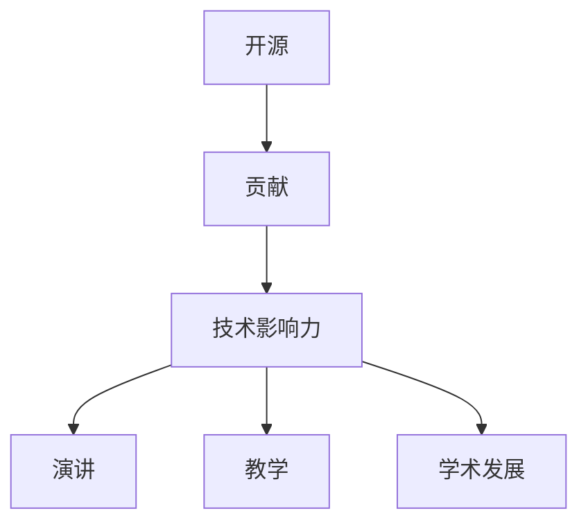

                 

# 利用开源贡献获得演讲和教学机会

> 关键词：开源, 贡献, 演讲, 教学, 学术发展, 技术影响力

## 1. 背景介绍

### 1.1 问题由来
在科技日新月异、技术不断进步的今天，开源社区已经成为全球创新和发展的重要引擎。它不仅提供了丰富的技术资源和协作平台，也为技术爱好者提供了展示才华和成就的机会。在众多开源项目中，开源贡献者往往能够通过技术贡献获得更多的曝光、合作和职业发展机会，甚至参与到各类演讲和教学活动中。

### 1.2 问题核心关键点
开源贡献者的职业发展路径包括多个阶段，从贡献代码、参与讨论，到进行技术演讲和教育培训，每个阶段都需要不同的技巧和策略。利用开源贡献，如何有效提升技术影响力，并转化为演讲和教学机会，是本文探讨的核心。

### 1.3 问题研究意义
本文旨在为开源贡献者提供一套系统的方法论和具体操作指南，帮助他们在开源社区中建立技术影响力和个人品牌，从而获得更多的演讲和教学机会。这对于促进开源技术的传播与推广，提升开源社区的技术生态和人才培养，具有重要意义。

## 2. 核心概念与联系

### 2.1 核心概念概述

在讨论如何利用开源贡献获得演讲和教学机会前，需要理解几个核心概念：

- **开源 (Open Source)**：指公开源代码、允许用户自由修改和分发的软件开发模式。开源项目常以GitHub、GitLab等平台为核心，广泛吸纳社区成员的贡献。

- **贡献 (Contribution)**：开源社区中，贡献通常指的是代码提交、文档完善、设计讨论等形式的积极参与。

- **技术影响力 (Technical Influence)**：指个人在技术社区中的知名度、权威性及其对技术发展的贡献。

- **演讲 (Presentation)**：指在各类技术会议、研讨会等场合进行的公开分享，通常以幻灯片、视频等形式呈现。

- **教学 (Education)**：指通过编写书籍、撰写教程、举办工作坊等形式，传授知识、推广技术。

- **学术发展 (Academic Development)**：指通过发表论文、参与学术会议、申请专利等形式，积累学术成果和影响力。

这些概念之间的逻辑关系可以通过以下Mermaid流程图来展示：



该流程图展示了从开源贡献到演讲和教学机会的技术影响力传递路径。开源贡献是起点，通过贡献积累技术影响力，进而获得演讲、教学和学术发展的机会。

## 3. 核心算法原理 & 具体操作步骤
### 3.1 算法原理概述

技术影响力的提升是一个循序渐进的过程，主要包括以下步骤：

1. **识别并深入参与**：选择感兴趣的开源项目，主动识别其技术痛点和需求，提供解决方案。
2. **高质量贡献**：贡献高质量代码、文档和设计，积累技术权威性。
3. **社区互动**：积极参与社区讨论，建立良好的人际关系网。
4. **技术展示**：通过博客、GitHub仓库等方式展示技术成果，提升个人品牌。
5. **获取演讲邀请**：通过社区活动、技术交流等方式获取演讲机会。
6. **教学机会**：通过撰写教程、举办培训等方式，参与教学活动。

### 3.2 算法步骤详解

以下将详细介绍如何利用开源贡献获得演讲和教学机会的具体步骤：

**Step 1: 选择并加入感兴趣的开源项目**

- **项目选择**：选择与你技术栈和兴趣相符的开源项目，可以从GitHub的“Hot”或“Trending”列表开始，逐步了解不同项目的现状和贡献需求。
- **贡献入门**：通过阅读项目文档和社区讨论，了解项目结构和贡献规范，为加入项目做好准备。
- **注册账号**：在GitHub等平台上创建账号，成为项目贡献者。

**Step 2: 提供高质量贡献**

- **代码贡献**：选择感兴趣的问题或功能，编写代码提交到项目。关注代码风格、单元测试等质量标准。
- **文档完善**：编写或完善项目文档，如README、API文档、用户手册等，提升项目的可读性和使用友好度。
- **设计讨论**：参与项目的设计讨论，提供改进建议和代码优化方案。

**Step 3: 积极参与社区互动**

- **讨论参与**：在项目issue、pull request中进行积极的讨论，解答其他贡献者的问题，提升影响力。
- **建立联系**：在社区论坛、Slack、Discord等平台与项目维护者和同侪建立联系，参加线上线下的技术交流活动。
- **项目维护**：根据项目维护者需求，主动维护项目的稳定性，修复已知问题。

**Step 4: 技术展示与积累个人品牌**

- **博客撰写**：在个人博客或Medium等平台上撰写技术文章，分享项目经验和技术心得。
- **GitHub仓库**：维护个人GitHub仓库，展示个人项目和技术积累，吸引关注和讨论。
- **开源贡献**：定期对已提交的代码进行整理和改进，形成独立项目或开源组件。

**Step 5: 获取演讲机会**

- **社区活动**：关注并参与开源社区举办的技术会议、研讨会和黑客松等活动，结识更多同行。
- **技术演讲**：在社区活动中展示自己的技术成果，吸引演讲邀请。
- **请求邀请**：主动联系社区组织者和项目维护者，表达演讲意愿，获得演讲机会。

**Step 6: 参与教学活动**

- **技术教程**：编写详细的技术教程，如GitHub仓库中的README文件，或Medium博客文章。
- **培训工作坊**：组织或参与技术工作坊，传授项目知识和实践经验。
- **线上教学**：在视频平台如YouTube、Bilibili上录制教学视频，或通过在线教育平台进行教学。

### 3.3 算法优缺点

利用开源贡献提升技术影响力，主要有以下优点：

1. **资源丰富**：开源社区资源丰富，技术积累和知识共享便利。
2. **技术认可**：高质量贡献和积极互动能获得技术社区的认可和信任。
3. **社区支持**：开源社区成员之间的互助合作，能提高技术展示和教学的效率。
4. **展示平台**：开源社区提供了多种展示平台，如GitHub、Slack、Meetup等，便于技术影响力的扩散。

然而，该方法也存在一些局限性：

1. **时间投入**：开源贡献和技术展示需要大量时间和精力的投入。
2. **社区竞争**：开源社区竞争激烈，高水平贡献者众多，难以脱颖而出。
3. **技术风险**：开源贡献涉及复杂的技术问题，风险和挑战不可忽视。
4. **认知偏差**：个人技术展示和教学的影响力，往往受限于展示平台的用户基础和认知度。

### 3.4 算法应用领域

基于开源贡献获得演讲和教学机会的算法，在科技行业中的应用非常广泛，具体领域包括但不限于：

1. **软件开发**：如GitHub上的开源项目，通过代码贡献和社区互动，提升技术影响力，获取演讲和教学机会。
2. **数据科学**：如Kaggle上的数据科学竞赛，通过数据分析和机器学习贡献，展示技术成果。
3. **人工智能**：如GitHub上的AI项目，通过算法实现和应用研究，进行技术展示和教学。
4. **网络安全**：如OWASP社区的安全项目，通过漏洞分析和防护方案贡献，提升技术影响力。
5. **教育培训**：如Khan Academy等教育平台，通过在线教学和课程开发，分享教育资源。

## 4. 数学模型和公式 & 详细讲解 & 举例说明

### 4.1 数学模型构建

在技术影响力的评估中，可以使用多种数学模型进行建模。这里我们以Google PageRank算法为例，构建技术影响力的评分模型：

设$I_i$为第$i$个开源贡献者的技术影响力评分，$M_i$为第$i$个贡献者在开源社区中的贡献度评分，$L_i$为第$i$个贡献者在技术演讲和教学中的影响力评分，则技术影响力的评分模型为：

$$
I_i = \alpha M_i + \beta L_i
$$

其中，$\alpha$和$\beta$为模型参数，控制两个评分的重要性权重。

### 4.2 公式推导过程

1. **贡献度评分$M_i$**：贡献度包括代码质量、文档完整性、设计讨论等方面，可用以下指标进行计算：
   - **代码贡献度$C_i$**：贡献的代码行数、代码质量评分（如行数、注释比例等）。
   - **文档贡献度$D_i$**：编写或完善的项目文档数量、文档质量评分（如清晰度、完整性等）。
   - **设计讨论度$D_i$**：参与的设计讨论次数、提出的设计建议质量等。
   - **代码贡献度$C_i$**：贡献的代码行数、代码质量评分（如行数、注释比例等）。

   贡献度评分$M_i$为：

   $$
   M_i = \sum_{j} w_j (C_j + D_j + D_i)
   $$

   其中$w_j$为各指标的权重系数。

2. **技术影响力评分$L_i$**：技术影响力包括演讲次数、教学课程数量、学术成果等，可用以下指标进行计算：
   - **演讲次数$P_i$**：参加的技术演讲次数、演讲质量评分。
   - **教学课程数量$C_i$**：参与的教学课程数量、课程质量评分。
   - **学术成果$A_i$**：发表的论文数量、专利申请数量、参与的学术会议次数等。

   技术影响力评分$L_i$为：

   $$
   L_i = \sum_{k} w_k (P_k + C_k + A_k)
   $$

   其中$w_k$为各指标的权重系数。

### 4.3 案例分析与讲解

以GitHub上的TensorFlow项目为例，分析其社区成员技术影响力的提升路径：

1. **选择项目**：贡献者关注GitHub上的TensorFlow项目，并通过GitHub界面了解项目贡献规范。
2. **代码贡献**：贡献者编写TensorFlow代码，关注代码质量，积极提交代码并完善文档。
3. **社区互动**：贡献者积极参与TensorFlow的社区讨论，解答其他贡献者的问题，建立良好的人际关系网。
4. **技术展示**：贡献者通过博客和GitHub仓库展示TensorFlow的贡献和研究，积累技术权威性。
5. **获取演讲机会**：贡献者参加TensorFlow社区组织的技术会议，获取演讲机会，展示TensorFlow的最新研究。
6. **参与教学活动**：贡献者编写TensorFlow教程，举办培训课程，分享TensorFlow的技术和实践经验。

通过以上步骤，贡献者能够显著提升在TensorFlow社区中的技术影响力，获得更多的演讲和教学机会，促进技术传播和人才培养。

## 5. 项目实践：代码实例和详细解释说明

### 5.1 开发环境搭建

要利用开源贡献获得演讲和教学机会，首先需要搭建一个基本的开发环境。以下是搭建开发环境的步骤：

1. **创建GitHub账号**：访问GitHub官网，注册账号并完成邮箱验证。
2. **安装Git客户端**：从Git官网下载并安装Git客户端，如GitHub Desktop或命令行Git。
3. **克隆开源项目**：选择一个感兴趣的开源项目，使用Git命令克隆该项目到本地。
4. **配置Git环境**：配置Git的用户名和邮箱，进行初次提交前的设置。

### 5.2 源代码详细实现

以下是一个简化的代码贡献示例，假设我们要为一个开源项目贡献代码：

```python
# 克隆项目到本地
!git clone https://github.com/example/project.git

# 进入项目目录
cd project

# 创建分支
!git checkout -b my-contribution

# 提交代码
!git add .
!git commit -m "Add feature X"

# 推送到GitHub
!git push origin my-contribution
```

在代码提交过程中，需要注意以下几点：

- **代码质量**：确保代码风格一致，注释详细，单元测试覆盖率达标。
- **问题跟踪**：提交代码时，关联到项目中的具体issue，确保代码与问题关联性。
- **文档更新**：在提交代码时，更新相关文档，确保文档与代码同步。

### 5.3 代码解读与分析

代码贡献是开源社区中最基本的互动形式，通过高质量的代码贡献，能够积累技术权威性和社区认可度。代码贡献的关键在于：

- **关联问题**：确保代码提交关联到具体的issue，以便社区成员对贡献者工作进行评估和反馈。
- **代码质量**：代码质量和注释的详细程度直接影响到社区成员对贡献者的认可和信任。
- **持续改进**：提交代码后，根据社区反馈进行持续改进，提高代码的稳定性和可维护性。

## 6. 实际应用场景

### 6.1 开源社区

开源社区是利用开源贡献获得演讲和教学机会的主要平台。在开源社区中，贡献者通过高质量的代码和积极参与社区互动，逐步积累技术影响力和社区认可度。例如，TensorFlow社区中的贡献者可以通过代码贡献、设计讨论和教学课程，获取更多的演讲和教学机会，推动TensorFlow技术的传播和应用。

### 6.2 技术会议

技术会议是展示技术成果和获取演讲机会的重要场所。在技术会议上，贡献者可以分享自己的技术成果，获取同行的认可和评价，从而获得更多的演讲邀请。例如，Google I/O、NeurIPS等技术会议，是展示最新技术研究和获取演讲机会的良好平台。

### 6.3 在线教育平台

在线教育平台为贡献者提供了展示技术、传授知识的平台。通过在线教学和编写教程，贡献者可以将技术知识传播到更广泛的用户群体中。例如，Udacity、Coursera等在线教育平台，是展示技术和教学能力的良好场所。

### 6.4 未来应用展望

未来，开源贡献在技术影响力和职业发展中的应用将更加广泛。随着开源技术的不断发展和普及，开源贡献者将获得更多的展示机会和职业发展途径。例如：

1. **企业招聘**：开源社区中的高水平贡献者将获得更多企业招聘的机会，成为技术驱动企业的核心力量。
2. **技术合作**：开源贡献者将有机会与企业、研究机构等进行技术合作，推动技术创新和应用。
3. **学术发展**：开源贡献者可以通过技术展示和教学活动，积累学术成果和影响力，提升学术地位。
4. **职业发展**：开源贡献者将获得更多的演讲和教学机会，推动技术传播和人才培养。

## 7. 工具和资源推荐

### 7.1 学习资源推荐

为了帮助开源贡献者系统掌握技术影响力的提升方法，以下是一些优质的学习资源：

1. **开源社区指南**：GitHub官方提供的开源社区指南，涵盖了开源贡献的详细流程和最佳实践。
2. **技术演讲技巧**：TED Talks等视频资源，展示优秀的技术演讲技巧和方法。
3. **在线教育平台**：Udemy、Coursera等在线教育平台，提供丰富的技术课程和教学资源。
4. **学术会议和期刊**：ArXiv、IEEE Xplore等学术资源，提供最新的技术研究和论文成果。
5. **开源贡献工具**：GitHub、GitLab等平台提供的工具和插件，帮助提升代码贡献效率。

通过这些资源的学习和实践，开源贡献者可以更好地掌握技术影响力的提升方法，实现职业发展的目标。

### 7.2 开发工具推荐

开源贡献的技术展示和教学活动，需要多种工具和平台的支持。以下是一些推荐的开发工具：

1. **GitHub**：开源社区的主要平台，提供代码管理和社区互动功能。
2. **GitHub Desktop**：GitHub提供的桌面客户端，方便本地代码管理和提交。
3. **Markdown编辑器**：如GitHub Pages、GitHub Wiki等，方便撰写和展示技术文章和文档。
4. **视频录制工具**：如OBS Studio、Zoom等，方便录制和分享技术演讲和教学视频。
5. **在线教育平台**：如Udemy、Coursera等，方便开展在线教学和课程开发。

合理利用这些工具，可以显著提升开源贡献的技术展示和教学效率，促进技术传播和人才培养。

### 7.3 相关论文推荐

以下是一些关于开源贡献和职业发展的经典论文，推荐阅读：

1. **"Contributing to Open Source: A Study of Over 5,000 Contributions from First-time to Senior Contributors"**：探讨了开源社区中不同级别贡献者的工作模式和技术影响。
2. **"The Power of Open Source: How Communities Drive Technological Innovation"**：分析了开源社区对技术创新和应用的影响。
3. **"How to Contribute to Open Source and Get Involved"**：提供了开源贡献和社区参与的详细指南和最佳实践。
4. **"Technology Transfer through Open Source: A Case Study of Machine Learning"**：探讨了开源技术在技术转移中的作用和效果。
5. **"The Role of Open Source in Academic Research and Development"**：分析了开源技术在学术研究和发展中的应用。

这些论文代表了大规模开源社区的研究进展和技术发展，能够帮助开源贡献者更好地理解技术影响力提升的方法和途径。

## 8. 总结：未来发展趋势与挑战

### 8.1 研究成果总结

本文系统介绍了利用开源贡献获得演讲和教学机会的方法和策略，提供了详细的步骤和实际案例分析。开源社区为贡献者提供了丰富的资源和平台，通过高质量的代码贡献和积极参与社区互动，贡献者能够显著提升技术影响力和社区认可度，获取更多的演讲和教学机会。

### 8.2 未来发展趋势

未来，开源贡献在技术影响力和职业发展中的应用将更加广泛。开源社区将进一步发展和壮大，为贡献者提供更多的展示和合作机会。例如：

1. **技术生态丰富**：开源社区将涵盖更多领域和技术方向，贡献者将获得更多的展示机会。
2. **合作机会增加**：开源社区将与更多企业和研究机构进行合作，推动技术创新和应用。
3. **职业发展多样化**：开源贡献者将获得更多的演讲和教学机会，推动技术传播和人才培养。
4. **技术成果加速转化**：开源贡献将加速技术的商业化和应用落地，推动技术生态的快速成长。

### 8.3 面临的挑战

尽管开源贡献在技术影响力和职业发展中具有显著优势，但仍然面临一些挑战：

1. **时间成本高**：开源贡献和技术展示需要大量时间和精力的投入。
2. **社区竞争激烈**：开源社区中高水平贡献者众多，难以脱颖而出。
3. **技术风险**：开源贡献涉及复杂的技术问题，风险和挑战不可忽视。
4. **认知偏差**：技术展示和教学的影响力，往往受限于展示平台的用户基础和认知度。

### 8.4 研究展望

为了克服开源贡献中的挑战，未来的研究可以从以下几个方向进行探索：

1. **自动化工具**：开发自动化开源贡献工具，提升贡献效率和质量。
2. **社区支持**：建立社区互助机制，帮助贡献者快速融入社区，提升贡献质量。
3. **技术展示平台**：构建多样化的技术展示平台，提升技术展示的覆盖面和影响力。
4. **技术培训**：提供系统的技术培训课程，帮助贡献者提升技术展示和教学能力。
5. **认知扩散**：通过多种渠道，扩大技术展示和教学的影响力，提升贡献者的认知度。

通过这些研究方向的探索，开源贡献者能够更好地实现技术影响力的提升，获得更多的演讲和教学机会，为开源社区的发展和技术传播做出更大的贡献。

## 9. 附录：常见问题与解答

**Q1: 开源贡献和技术影响力的关系是什么？**

A: 开源贡献是技术影响力提升的基础。通过高质量的代码贡献和积极参与社区互动，贡献者能够积累技术权威性和社区认可度，进而提升技术影响力。

**Q2: 如何进行开源贡献的文档完善？**

A: 文档完善是开源贡献的重要组成部分。通过编写和完善项目文档，贡献者能够提升项目的可读性和使用友好度。具体的文档完善步骤包括：

1. 阅读项目文档，了解文档结构和规范。
2. 撰写README文件，介绍项目背景和使用方法。
3. 编写API文档，详细说明项目接口和功能。
4. 更新用户手册，提供详细的使用示例和操作指南。

**Q3: 如何获取技术演讲的机会？**

A: 获取技术演讲的机会需要积极参与社区活动和技术交流。具体的步骤包括：

1. 关注开源社区和技术会议的公告，参与各类技术活动。
2. 在社区活动和技术会议中，展示自己的技术成果，获取演讲邀请。
3. 主动联系社区组织者和项目维护者，表达演讲意愿，获得演讲机会。

**Q4: 开源贡献在实际应用场景中有什么作用？**

A: 开源贡献在实际应用场景中具有多种作用：

1. 提升技术影响力：高质量的代码贡献和积极参与社区互动，积累技术权威性和社区认可度。
2. 获取演讲机会：通过技术展示和技术演讲，获取更多的演讲机会，推动技术传播和应用。
3. 参与教学活动：通过编写技术教程和举办工作坊，传授知识，推广技术。
4. 加速技术发展：开源贡献能够加速技术创新和应用落地，推动技术生态的快速成长。

总之，开源贡献是开源社区中技术传播和人才培养的重要手段，能够显著提升贡献者的技术影响力和职业发展机会。

---

作者：禅与计算机程序设计艺术 / Zen and the Art of Computer Programming

