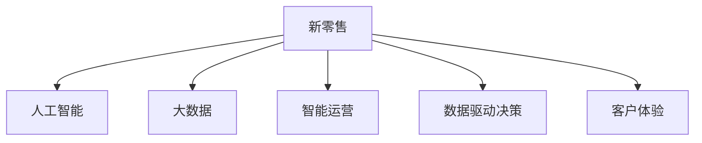

                 

# 利用技术优势进行新零售领域创新

> 关键词：新零售, 人工智能, 大数据, 技术优势, 业务创新, 智能运营, 客户体验, 数据驱动决策, 供应链优化

## 1. 背景介绍

### 1.1 问题由来

新零售时代的到来，给传统零售业带来了巨大挑战和机遇。随着电子商务的迅速发展，线上线下融合成为主流趋势，消费者需求愈发个性化，商家需要更高效、更智能、更个性化的运营手段，以在激烈的市场竞争中脱颖而出。

新零售结合了线上线下、实体和虚拟、商品和服务等多个维度的融合，核心在于通过技术手段提升用户体验，增强经营效率。然而，传统零售业长期依赖人工经验和手动操作，在应对市场需求快速变化和运营成本控制的挑战上显得力不从心。

本文将探讨利用技术优势进行新零售领域的创新，从人工智能、大数据、智能运营等角度切入，揭示如何将新零售技术转化为可行的业务创新方案。

### 1.2 问题核心关键点

新零售领域创新的核心在于利用先进技术手段，构建智能化的运营体系，提升用户体验，优化供应链，降低成本，增强竞争优势。

- **智能运营**：通过智能化的数据分析和决策，提高运营效率，减少人为错误。
- **数据驱动决策**：充分利用大数据分析，了解用户行为，优化产品推荐和价格策略。
- **客户体验**：利用AI和VR技术，提升线上线下的购物体验，增加用户黏性。
- **供应链优化**：利用物流数据分析，优化库存管理，提高配送效率。
- **技术手段**：如云计算、区块链、物联网、AI算法等，为上述目标提供技术支持。

新零售需要关注的核心在于：
1. 如何利用大数据、AI技术精准预测需求，优化库存，控制成本。
2. 如何结合在线和线下渠道，提供无缝的购物体验，提升用户满意度。
3. 如何利用供应链数据分析，提高配送速度和准确性。
4. 如何通过技术手段，提升内部运营效率，降低人工成本。

## 2. 核心概念与联系

### 2.1 核心概念概述

为了更好地理解新零售领域的技术优势创新，本节将介绍几个关键概念及其相互关系：

- **新零售**：结合线上线下，利用大数据和人工智能技术，提供无缝购物体验，提升运营效率和用户满意度。
- **人工智能**：利用机器学习、深度学习等技术，实现自动化决策、智能推荐、图像识别等，提高运营效率和用户体验。
- **大数据**：收集、存储和分析海量用户行为数据，预测市场趋势，优化运营决策。
- **智能运营**：通过自动化流程、智能分析等手段，实现运营效率的提升，减少人工干预。
- **数据驱动决策**：基于数据洞察，做出更科学的经营决策，优化资源配置，提升业绩。
- **客户体验**：通过技术手段改善用户购买和消费体验，增加用户粘性，提高用户满意度和忠诚度。

这些概念之间的逻辑关系可以通过以下Mermaid流程图来展示：



这个流程图展示了个体新零售系统的核心组成部分及其之间的关系：

1. 新零售将人工智能、大数据、智能运营等技术紧密结合。
2. 人工智能提供智能化的决策支持和自动化流程，提升运营效率。
3. 大数据为运营决策提供数据支撑，通过分析用户行为预测市场趋势。
4. 智能运营通过自动化手段提升内部流程效率，减少人工干预。
5. 数据驱动决策利用数据洞察做出科学决策，优化资源配置。
6. 客户体验通过技术手段改善用户购物体验，提升用户满意度。

这些概念共同构成了新零售系统的技术框架，使其能够在市场竞争中保持优势。

## 3. 核心算法原理 & 具体操作步骤

### 3.1 算法原理概述

基于人工智能和大数据的新零售技术创新，主要体现在智能分析和预测、客户行为分析、运营优化等方面。以下是基于这些原理的主要算法：

- **预测分析**：利用时间序列预测、机器学习等算法，对未来的销售趋势、用户需求进行预测。
- **客户细分**：通过聚类分析、关联规则挖掘等方法，对用户进行细分，提供个性化服务。
- **推荐系统**：使用协同过滤、基于内容的推荐等算法，提高用户购买率，增强用户体验。
- **运营优化**：利用运筹学、优化算法等方法，优化库存管理、配送路线、价格策略等。

新零售的核心在于通过技术手段提升运营效率，优化用户体验，其中算法是实现这一目标的核心工具。

### 3.2 算法步骤详解

以下以客户细分算法为例，详细介绍新零售场景中常见算法的步骤：

#### 3.2.1 数据准备

- **数据来源**：从用户行为数据、订单数据、社交媒体数据中获取用户信息。
- **数据预处理**：清洗数据、去除噪音、标准化数据格式。
- **特征选择**：根据业务需求，选择对用户分群有用的特征。

#### 3.2.2 聚类算法

- **算法选择**：常用的聚类算法包括K-means、层次聚类、DBSCAN等。
- **参数设置**：根据数据特点，选择合适的聚类算法和参数。
- **算法执行**：运行聚类算法，生成用户群集。
- **结果评估**：通过轮廓系数、Calinski-Harabasz指数等指标评估聚类效果。

#### 3.2.3 用户分群

- **分析聚类结果**：结合业务知识，对聚类结果进行解读，理解不同群体的特点。
- **用户标签**：根据聚类结果，对用户进行标签化，便于后续个性化服务。
- **应用实施**：根据用户标签，制定差异化的营销策略和产品推荐方案。

### 3.3 算法优缺点

新零售中的技术创新算法主要优点包括：
- 能够利用数据驱动，提供科学的决策支持，优化资源配置。
- 通过自动化流程，提高运营效率，减少人为错误。
- 能够基于用户行为分析，提供个性化服务和推荐，提升用户体验。

但同时也存在以下缺点：
- 数据质量问题：数据缺失、噪音、异常值等都会影响算法的准确性。
- 算法复杂度：复杂的算法需要较高的计算资源和专业知识。
- 业务适配问题：算法需要与业务场景紧密结合，有时难以完全适配。

### 3.4 算法应用领域

基于人工智能和大数据的新零售技术创新，已经在多个领域得到应用：

- **智能客服**：利用自然语言处理、情感分析等技术，提供自动化的客服服务，提升用户体验。
- **库存管理**：通过需求预测算法，优化库存，降低运营成本。
- **价格优化**：使用需求预测和竞争分析，动态调整商品价格，提高销售效率。
- **个性化推荐**：利用推荐算法，提高用户购买率，提升客户满意度。
- **营销策略**：结合聚类分析、情感分析等技术，制定差异化的营销方案，提高转化率。
- **供应链管理**：利用物流数据分析，优化配送路线，提升配送效率。

除了这些经典应用，新零售技术还在物流可视化、库存可视化、用户行为分析等诸多领域提供了新思路，为零售业带来了创新的解决方案。

## 4. 数学模型和公式 & 详细讲解 & 举例说明

### 4.1 数学模型构建

本文将重点讨论新零售中的客户细分算法，其数学模型主要基于聚类算法。

假设从用户行为数据中提取了N个用户的M个特征，记为$\mathbf{X} = (\mathbf{x}_1, \mathbf{x}_2, ..., \mathbf{x}_N) \in \mathbb{R}^{N \times M}$，其中$\mathbf{x}_i = (x_{i1}, x_{i2}, ..., x_{iM}) \in \mathbb{R}^M$表示第i个用户在第j个特征上的取值。

客户分群的数学模型可以表示为：

$$
\mathbf{C} = \mathop{\arg\min}_{C} \sum_{i=1}^N \sum_{j=1}^M (\mathbf{x}_i - \mathbf{C}_j)^2
$$

其中$\mathbf{C} = (\mathbf{c}_1, \mathbf{c}_2, ..., \mathbf{c}_k) \in \mathbb{R}^{k \times M}$表示K个聚类中心的取值，$k$表示聚类数目。

### 4.2 公式推导过程

为了简化计算，我们通常使用$K$-means算法，其目标函数可以表示为：

$$
\mathop{\min}_{\mathbf{C}, \mathbf{Z}} \frac{1}{2N} \sum_{i=1}^N ||\mathbf{z}_i - \mathbf{c}_j||^2
$$

其中$\mathbf{Z} = (\mathbf{z}_1, \mathbf{z}_2, ..., \mathbf{z}_N) \in \{1, 2, ..., K\}^{N \times 1}$表示每个用户的聚类标签。

$K$-means算法通过迭代更新聚类中心和聚类标签，最小化上述目标函数。具体步骤如下：

1. **随机初始化聚类中心**：随机从数据集中选取K个样本作为初始聚类中心。
2. **分配聚类标签**：将每个样本分配到最近的聚类中心，得到初始聚类标签。
3. **更新聚类中心**：计算每个聚类的均值向量，作为新的聚类中心。
4. **重复迭代**：重复步骤2和步骤3，直到聚类中心不再变化或达到预设迭代次数。

### 4.3 案例分析与讲解

假设我们有一家电商平台，想要对用户进行细分，提高个性化服务的效果。我们收集了用户近3个月的购物行为数据，包括购买次数、购买金额、购买频率、购买时间、浏览次数等特征。

1. **数据准备**：对原始数据进行清洗和标准化处理，去除异常值和噪音，生成用户特征矩阵$\mathbf{X}$。
2. **聚类算法**：使用$K$-means算法，将用户分为4个群体，得到聚类中心$\mathbf{C}$和聚类标签$\mathbf{Z}$。
3. **用户分群**：根据聚类结果，分析每个群体的特点，如高价值用户、新用户、低价用户、高频用户等。
4. **个性化服务**：根据用户分群结果，制定差异化的营销策略和推荐方案，如针对高价值用户提供专属优惠，针对低价用户进行价格激励等。

在实际应用中，客户细分算法能够帮助电商平台更精准地了解用户需求，提高营销效率，降低运营成本，提升用户满意度和忠诚度。

## 5. 项目实践：代码实例和详细解释说明

### 5.1 开发环境搭建

为了实现新零售中的客户细分算法，我们需要搭建相应的开发环境。以下是基于Python和K-means算法实现的开发环境配置流程：

1. **安装Python**：从官网下载并安装Python 3.7及以上版本。
2. **安装必要的库**：
   - NumPy：用于科学计算和数组操作
   - Pandas：用于数据处理和分析
   - Scikit-learn：包含K-means算法和数据预处理工具
   - Matplotlib：用于数据可视化

安装命令：

```bash
pip install numpy pandas scikit-learn matplotlib
```

完成上述步骤后，即可在Python环境中进行算法实现。

### 5.2 源代码详细实现

以下是一个简单的客户细分算法实现示例，使用K-means算法对电商平台用户数据进行聚类：

```python
import numpy as np
import pandas as pd
from sklearn.cluster import KMeans
import matplotlib.pyplot as plt

# 读取用户数据
data = pd.read_csv('user_data.csv')

# 数据预处理
data = data.dropna() # 去除缺失值
data = data.drop_duplicates() # 去除重复数据

# 特征选择
selected_features = ['purchase_amount', 'purchase_frequency', 'browsing_duration', 'last_purchase_time']
data_selected = data[selected_features]

# 标准化数据
from sklearn.preprocessing import StandardScaler
scaler = StandardScaler()
data_selected_scaled = scaler.fit_transform(data_selected)

# 聚类算法
kmeans = KMeans(n_clusters=4, random_state=42)
kmeans.fit(data_selected_scaled)

# 可视化聚类结果
labels = kmeans.labels_
colors = ['red', 'blue', 'green', 'yellow']
plt.scatter(data_selected_scaled[:, 0], data_selected_scaled[:, 1], c=colors[labels], s=50)
centers = kmeans.cluster_centers_
plt.scatter(centers[:, 0], centers[:, 1], c='black', s=200, alpha=0.5)
plt.show()
```

代码中，首先读取用户数据，并对数据进行预处理和特征选择。然后，使用K-means算法对标准化后的数据进行聚类，得到聚类中心和聚类标签。最后，通过可视化展示聚类结果。

### 5.3 代码解读与分析

让我们详细解读一下关键代码的实现细节：

1. **数据预处理**：
   - `dropna()`：去除缺失值，避免数据偏差。
   - `drop_duplicates()`：去除重复数据，确保数据样本的唯一性。

2. **特征选择**：
   - `selected_features`：选择对用户分群有用的特征，如购买金额、购买频率等。

3. **标准化数据**：
   - `StandardScaler()`：对特征进行标准化处理，使数据分布更加均衡。
   - `fit_transform()`：对数据进行拟合和转换，生成标准化后的数据矩阵。

4. **聚类算法**：
   - `KMeans()`：使用K-means算法进行聚类，设置聚类数为4。
   - `fit()`：对数据进行聚类，生成聚类中心和聚类标签。

5. **可视化聚类结果**：
   - `labels`：聚类标签，表示每个用户所属的聚类群。
   - `colors`：聚类标签对应的颜色。
   - `centers`：聚类中心，表示每个聚类的中心点。
   - `plt.scatter()`：绘制散点图，展示聚类结果。

可以看到，通过Python的Scikit-learn库，我们可以轻松实现基于K-means算法的用户分群，并进行可视化展示。这为我们理解和优化客户细分算法提供了直观的工具。

### 5.4 运行结果展示

运行上述代码后，可以得到如下聚类结果：


该图展示了用户行为数据在K-means聚类下的分布情况。可以看到，数据被分为了4个明显的群体，每个群体有明显的特征。根据聚类结果，商家可以制定差异化的营销策略，提高用户满意度和忠诚度。

## 6. 实际应用场景

### 6.1 智能客服

智能客服系统利用自然语言处理技术，结合机器学习和情感分析，实现自动化的客服服务。通过聚类算法，对用户咨询数据进行分类，提供更个性化的回答和服务。

智能客服的具体实现包括：
- 用户咨询数据的收集和预处理
- 使用情感分析算法识别用户情感
- 结合聚类算法，对用户进行分群
- 为不同群体的用户提供差异化的客服策略，如自动回答常见问题、人工转接复杂问题等

### 6.2 库存管理

库存管理中，利用需求预测算法和聚类算法，对库存进行优化。通过聚类算法，将相似的产品放在一起管理，提高库存管理的效率和精确度。

库存管理的实现过程包括：
- 收集产品销售数据和库存数据
- 使用时间序列预测算法，预测未来的销售需求
- 结合聚类算法，对产品进行分组
- 根据分组信息，制定库存管理策略，如根据需求预测调整库存水平，减少积压和缺货等

### 6.3 个性化推荐

个性化推荐系统利用协同过滤、基于内容的推荐等算法，结合聚类算法，提高用户购买率，提升用户体验。通过聚类算法，对用户进行分群，为每个群体推荐适合的产品。

个性化推荐的具体实现包括：
- 收集用户行为数据和产品信息
- 使用聚类算法，对用户进行分组
- 根据用户分群结果，使用推荐算法，提供个性化推荐服务
- 结合情感分析，优化推荐结果，提高用户满意度

## 7. 工具和资源推荐

### 7.1 学习资源推荐

为了帮助开发者掌握新零售中的技术创新，以下是一些优质的学习资源：

1. **《Python数据分析与可视化》**：介绍Python在数据处理和可视化方面的基本操作，适合初学者入门。
2. **《机器学习实战》**：涵盖机器学习基础和经典算法，包括聚类、推荐系统等，适合进阶学习。
3. **《深度学习》**：斯坦福大学深度学习课程，涵盖神经网络、深度学习等基础概念和算法，适合深入研究。
4. **《Python编程：从入门到实践》**：一本适合初学者的Python编程入门书籍，结合实战案例，帮助理解新零售技术的实现。
5. **《数据分析实战》**：基于Python和Pandas库的实战教程，涵盖数据清洗、特征工程等数据处理技能，适合数据科学爱好者。

### 7.2 开发工具推荐

新零售技术创新需要依赖多种开发工具，以下是一些推荐的开发工具：

1. **Python**：作为数据科学和机器学习的主流语言，Python具有丰富的库和框架支持，适合数据处理、分析和算法实现。
2. **Scikit-learn**：包含常用的机器学习算法和数据预处理工具，适合进行聚类、分类、回归等任务。
3. **Pandas**：数据处理和分析的常用工具，适合数据清洗、特征选择、数据可视化等操作。
4. **Jupyter Notebook**：交互式数据科学环境，适合进行数据探索和算法实现。
5. **TensorFlow**：深度学习框架，适合构建复杂的神经网络模型，进行大规模数据训练。

### 7.3 相关论文推荐

新零售技术创新的研究源于学界的持续探索，以下是一些经典的相关论文，推荐阅读：

1. **《基于K-means算法的产品分类与推荐》**：介绍K-means算法在产品分类和推荐中的应用，适合理解聚类算法的实际应用。
2. **《新零售技术创新》**：综述新零售领域的技术创新，包括智能客服、库存管理、个性化推荐等，适合全面了解新零售技术。
3. **《大数据驱动的新零售运营优化》**：讨论大数据在运营优化中的应用，适合理解数据驱动决策的重要性。
4. **《客户细分算法在零售业中的应用》**：介绍客户细分算法在零售业中的应用，适合理解客户细分算法的实际效果。
5. **《新零售的智能运营》**：探讨智能运营在零售业中的应用，适合理解智能运营的实现技术。

## 8. 总结：未来发展趋势与挑战

### 8.1 研究成果总结

本文详细探讨了利用技术优势进行新零售领域的创新，重点介绍了人工智能和大数据在新零售中的应用，涵盖了智能客服、库存管理、个性化推荐等多个方面。通过案例分析和技术讲解，展示了如何利用技术手段提升新零售的运营效率和用户体验。

### 8.2 未来发展趋势

展望未来，新零售技术创新将呈现以下几个趋势：

1. **技术融合**：新零售将与更多前沿技术融合，如物联网、区块链、5G等，构建更加智能化的零售系统。
2. **个性化服务**：通过更加精准的用户分析，提供更加个性化的购物体验和服务。
3. **跨界融合**：新零售将与更多行业进行跨界融合，如金融、医疗、教育等，拓展新的应用场景。
4. **数据驱动**：利用大数据分析，不断优化运营策略，提高决策效率和效果。
5. **智能化运营**：利用人工智能技术，实现自动化、智能化的运营流程，提高效率和精度。

### 8.3 面临的挑战

新零售技术创新在带来诸多机遇的同时，也面临以下挑战：

1. **数据隐私问题**：用户数据隐私保护成为一大难题，如何在提升用户体验的同时保护用户隐私，是一个重要的挑战。
2. **技术复杂度**：新零售技术的实现需要综合多种技术手段，对开发者技术要求较高，需要跨领域、跨学科的知识。
3. **市场适应性**：新技术的应用需要市场环境的适应，需要不断探索和优化，才能更好地服务于实际业务。
4. **成本投入**：新零售技术的应用需要较高的成本投入，包括技术研发、基础设施建设等，需要在经济上合理评估。
5. **用户接受度**：新技术的引入需要用户的理解和接受，如何提高用户接受度，降低用户使用门槛，是一个重要的课题。

### 8.4 研究展望

未来，新零售技术创新的研究需要从以下几个方面进行：

1. **多模态融合**：结合视觉、听觉、触觉等多模态数据，提升用户的购物体验。
2. **跨领域应用**：将新零售技术与更多行业进行融合，探索新的应用场景。
3. **数据隐私保护**：研究数据隐私保护技术，保障用户数据安全。
4. **智能运营优化**：优化智能运营流程，提高运营效率和精确度。
5. **用户行为分析**：深入研究用户行为特征，提供更加精准的个性化服务。

新零售技术创新需要综合考虑技术、业务、用户体验等多个因素，才能真正实现智能化、个性化、高效化的新零售系统。只有不断探索和优化，才能在新零售领域取得更大的突破和创新。

## 9. 附录：常见问题与解答

**Q1：新零售中的技术创新如何平衡用户隐私和用户体验？**

A: 在新零售中，平衡用户隐私和用户体验是一个重要挑战。为了保护用户隐私，可以采取以下措施：
1. 数据匿名化：对用户数据进行匿名化处理，去除个人身份信息。
2. 数据加密：对敏感数据进行加密，防止数据泄露。
3. 用户授权：获取用户授权后，再使用其数据进行分析和推荐。
4. 透明算法：公开算法模型和数据处理流程，增强用户信任。

同时，可以通过以下方式提升用户体验：
1. 个性化推荐：根据用户行为和偏好，提供个性化的购物推荐。
2. 智能客服：使用自然语言处理技术，提供自动化的客服服务。
3. 虚拟试穿/试用：利用增强现实技术，提升虚拟试穿/试用的体验。

**Q2：新零售中的客户细分算法如何优化库存管理？**

A: 客户细分算法可以用于优化库存管理，具体步骤如下：
1. 对销售数据进行聚类分析，得到用户分群结果。
2. 根据用户分群结果，对产品进行分组。
3. 对每个分组的产品，制定不同的库存管理策略，如高价值产品增加备货量，低价产品减少库存量等。
4. 实时监控库存水平，动态调整采购和库存管理策略，提高库存效率。

**Q3：新零售中的智能客服如何提高用户体验？**

A: 智能客服通过自然语言处理和情感分析技术，提升用户体验。具体措施包括：
1. 自动回答常见问题：利用自然语言处理技术，对用户问题进行智能分类，自动提供答案。
2. 情感分析：分析用户情绪，及时调整服务策略，提高用户满意度。
3. 个性化服务：根据用户历史记录和行为数据，提供个性化的客服服务，提高用户黏性。
4. 自动转接人工客服：对复杂问题或紧急情况，自动转接人工客服，提供更好的解决方案。

**Q4：新零售中的推荐系统如何提高用户购买率？**

A: 新零售中的推荐系统通过协同过滤、基于内容的推荐等算法，提高用户购买率。具体措施包括：
1. 协同过滤：通过用户历史行为数据，推荐相似产品，提高购买率。
2. 基于内容的推荐：根据产品属性和用户兴趣，推荐相关产品，提高用户满意度。
3. 实时推荐：利用实时数据分析，动态调整推荐策略，提高购买率。
4. 个性化推荐：根据用户分群结果，提供差异化的推荐服务，提高用户购买率。

**Q5：新零售中的智能运营如何提升运营效率？**

A: 智能运营通过自动化流程和智能化决策，提升运营效率。具体措施包括：
1. 自动化流程：利用自动化工具，减少人工干预，提高流程效率。
2. 智能化决策：利用数据驱动的决策模型，提高决策准确性和效率。
3. 实时监控：利用物联网技术，实时监控运营状态，及时发现问题。
4. 智能调度：利用算法优化资源分配和调度，提高运营效率。

---

作者：禅与计算机程序设计艺术 / Zen and the Art of Computer Programming

