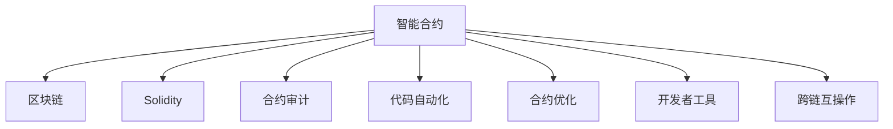

                 

# 利用技术优势进行智能合约开发

> 关键词：智能合约,区块链,Solidity,以太坊,合约审计,代码自动化,合约优化,开发者工具,跨链互操作

## 1. 背景介绍

### 1.1 问题由来

随着区块链技术的发展，智能合约（Smart Contracts）作为一种去中心化的自动执行合约，正逐渐成为区块链应用中的重要组成部分。智能合约通过代码实现交易逻辑，可以在无需第三方中介的情况下自动执行和监控合约条件，从而提高交易效率和透明度，降低运营成本。

然而，智能合约也面临诸多挑战：代码编写繁琐、漏洞频出、性能瓶颈、跨链互操作等。这使得智能合约开发成为一项技术门槛高、风险大的任务，吸引了众多优秀的开发者和研究人员的关注。

本文旨在深入探讨智能合约开发的技术优势，总结最佳实践，探讨智能合约的未来发展方向。通过理解智能合约开发的底层原理和核心算法，开发者可以更加高效地开发安全、可靠、高效的合约，进一步推动区块链技术在更多垂直行业中的应用。

## 2. 核心概念与联系

### 2.1 核心概念概述

为了更好地理解智能合约的开发，我们首先介绍几个关键概念：

- 智能合约（Smart Contracts）：指在区块链上部署的、自动执行的、无需第三方中介的合约。智能合约通过代码实现交易逻辑，可以在区块链上自动执行和监控合约条件。

- 区块链（Blockchain）：一种去中心化的分布式账本技术，通过加密技术保证数据安全和不可篡改性。区块链是智能合约运行的基础平台。

- Solidity：一种为以太坊（Ethereum）设计的高级编程语言，广泛应用于智能合约开发。Solidity提供了丰富的数据类型和函数库，支持复杂合约逻辑的实现。

- 合约审计：对智能合约进行代码和逻辑审查的过程，目的是发现和修复潜在的漏洞和风险。合约审计是智能合约开发中至关重要的一环。

- 代码自动化：通过自动化工具，提高智能合约开发的效率和质量。代码自动化可以帮助开发者快速生成代码模板、进行代码优化、执行测试等。

- 合约优化：通过优化合约代码，提高智能合约的性能、安全性和可靠性。合约优化涉及到代码结构优化、状态存储优化、调用优化等多个方面。

- 开发者工具：为智能合约开发提供的各种工具和框架，如IDE、插件、调试器等，可以极大提升开发效率和体验。

- 跨链互操作：指不同区块链之间进行数据和资产交换的能力。随着多条区块链的发展，智能合约的跨链互操作成为重要研究方向。

这些核心概念之间的关系可以通过以下Mermaid流程图来展示：



这个流程图展示了智能合约与区块链、Solidity等核心技术之间的关系，以及合约审计、代码自动化、合约优化等辅助工具的重要性。

## 3. 核心算法原理 & 具体操作步骤

### 3.1 算法原理概述

智能合约的开发，核心在于通过代码实现合约逻辑，并在区块链上部署和执行。其基本流程包括代码编写、合约审计、合约部署和执行等步骤。

智能合约的开发遵循以下核心算法原理：

1. **合约语言选择**：选择Solidity等适合以太坊等区块链的编程语言，利用其丰富的库和工具，实现复杂合约逻辑。

2. **合约结构设计**：定义合约的基本结构，包括事件、函数、状态变量等，确保代码的可读性和可维护性。

3. **合约逻辑编写**：编写合约的具体逻辑代码，实现业务规则和交易逻辑，确保合约的正确性和安全性。

4. **合约审计**：对代码进行审查，发现和修复潜在的漏洞和风险，确保合约的可靠性。

5. **合约部署**：将合约部署到区块链上，通过交易费用支付部署成本，并确保合约的唯一性和不可篡改性。

6. **合约执行**：在合约部署成功后，通过智能合约地址调用函数，执行相应的合约逻辑。

### 3.2 算法步骤详解

智能合约的开发流程大致分为以下几个步骤：

**Step 1: 准备开发环境**

1. **安装Solidity环境**：从以太坊官网下载并安装Solidity编译器。
2. **安装Ganache或Remix等开发工具**：这些工具提供了交互式的开发界面和调试功能，可以方便地进行合约编写和测试。
3. **创建新的项目目录**：例如使用Solidity官网提供的S Scaffold，自动生成合约模板。

**Step 2: 编写合约代码**

1. **定义合约结构**：编写合约的基本结构，包括事件、函数、状态变量等，例如：

```solidity
pragma solidity ^0.8.0;

contract MyContract {
    address public owner;
    uint256 public balance;
    
    constructor() {
        owner = msg.sender;
    }
    
    event Transfer(uint256 indexed from, uint256 indexed to, uint256 value);
    
    function transfer(uint256 _value) public payable {
        uint256 sender = msg.sender;
        uint256 receiver = msg.to;
        require(_value > 0);
        require(msg.sender != address(0));
        require(msg.value > 0);
        require(sender != receiver);
        owner = owner.balance + _value;
        receiver.balance -= _value;
        emit Transfer(from, receiver, value);
    }
}
```

2. **实现合约逻辑**：在合约结构的基础上，实现具体的逻辑功能，例如：

```solidity
function updateOwner(address _newOwner) public {
    require(msg.sender == owner);
    owner = _newOwner;
}
```

**Step 3: 执行合约审计**

1. **选择审计工具**：使用合约审计工具如MythX、Slither等，对合约进行自动化的审计。
2. **修复发现的问题**：根据审计结果，修复代码中的漏洞和风险。

**Step 4: 合约部署**

1. **编写迁移脚本**：编写迁移脚本，自动将合约部署到测试网或主网。
2. **部署合约**：使用测试网提供的工具如Remix或Alchemy等，部署合约到测试网，并检查部署结果。

**Step 5: 合约执行**

1. **调用合约函数**：在区块链浏览器中，通过智能合约地址调用合约函数，例如：

```javascript
const MyContract = artifacts.require('MyContract');
module.exports = async function(deployer) {
    await deployer.deploy(MyContract);
    let instance = await MyContract.deployed();
    await instance.transfer(1000, deployer.address);
    await instance.updateOwner(deployer.address);
    await instance.transfer(100, deployer.address);
}
```

### 3.3 算法优缺点

智能合约开发具有以下优点：

1. **去中心化**：智能合约的执行和存储在区块链上，无需第三方中介，提高了交易的透明性和安全性。
2. **自动化**：合约自动执行，减少了人为操作的错误和风险。
3. **智能合约**：通过代码实现合约逻辑，支持复杂的交易逻辑，提高了合约的灵活性和可扩展性。
4. **低成本**：智能合约的部署和执行费用相对较低，降低了交易成本。

同时，智能合约开发也面临以下挑战：

1. **复杂度高**：合约代码编写繁琐，需要深厚的技术基础。
2. **漏洞频出**：由于代码逻辑复杂，容易引入漏洞和风险，需要严格审计。
3. **性能瓶颈**：智能合约的性能较低，容易受到区块链网络的影响。
4. **跨链互操作**：不同区块链之间的互操作性差，增加了合约的复杂性。

### 3.4 算法应用领域

智能合约的开发在以下领域得到了广泛应用：

1. **金融**：智能合约在借贷、保险、股权众筹等领域得到了广泛应用，提高了金融交易的效率和透明度。
2. **供应链**：智能合约用于供应链管理，实现了自动化物流、库存管理、订单跟踪等功能。
3. **医疗**：智能合约用于医疗数据共享和医疗记录管理，提高了医疗数据的可靠性和安全性。
4. **房地产**：智能合约用于房产交易，实现了自动化合约执行和交易监管。
5. **游戏**：智能合约用于游戏内物品交易和权益管理，提高了游戏的公平性和安全性。

## 4. 数学模型和公式 & 详细讲解 & 举例说明

### 4.1 数学模型构建

智能合约的开发涉及到多个数学模型的构建，主要包括合约语言模型、合约审计模型、合约优化模型等。

以合约语言模型为例，合约代码可以表示为一个形式化的数学模型，例如：

$$
\text{合约代码} = \text{事件} \cup \text{函数} \cup \text{状态变量}
$$

其中事件表示合约的状态变化，函数表示合约的执行逻辑，状态变量表示合约的状态信息。

### 4.2 公式推导过程

以合约优化模型为例，合约的优化目标可以表示为：

$$
\min_{\text{合约代码}} \{ \text{部署成本} + \text{执行成本} + \text{审计成本} \}
$$

其中部署成本、执行成本和审计成本分别表示合约部署、执行和审计所需的费用。

### 4.3 案例分析与讲解

以智能合约的跨链互操作为例，跨链互操作可以表示为一个分布式优化问题，例如：

$$
\min_{\text{合约代码}} \{ \text{跨链交易成本} + \text{跨链状态同步成本} + \text{跨链安全性成本} \}
$$

其中跨链交易成本、跨链状态同步成本和跨链安全性成本分别表示跨链交易、状态同步和安全性保障所需的费用。

## 5. 项目实践：代码实例和详细解释说明

### 5.1 开发环境搭建

1. **安装Solidity环境**：
```bash
npm install -g solc
```

2. **安装Ganache或Remix等开发工具**：
- Ganache：从官网下载并安装，创建一个新的区块链测试网络。
- Remix：在Remix官网创建一个新的项目，自动生成合约模板。

3. **创建新的项目目录**：
```bash
mkdir myContract
cd myContract
```

### 5.2 源代码详细实现

1. **定义合约结构**：
```solidity
pragma solidity ^0.8.0;

contract MyContract {
    address public owner;
    uint256 public balance;
    
    constructor() {
        owner = msg.sender;
    }
    
    event Transfer(uint256 indexed from, uint256 indexed to, uint256 value);
    
    function transfer(uint256 _value) public payable {
        uint256 sender = msg.sender;
        uint256 receiver = msg.to;
        require(_value > 0);
        require(msg.sender != address(0));
        require(msg.value > 0);
        require(sender != receiver);
        owner = owner.balance + _value;
        receiver.balance -= _value;
        emit Transfer(from, receiver, value);
    }
    
    function updateOwner(address _newOwner) public {
        require(msg.sender == owner);
        owner = _newOwner;
    }
}
```

2. **实现合约逻辑**：
```solidity
function updateOwner(address _newOwner) public {
    require(msg.sender == owner);
    owner = _newOwner;
}
```

### 5.3 代码解读与分析

1. **定义合约结构**：
```solidity
pragma solidity ^0.8.0;
contract MyContract {
    address public owner;
    uint256 public balance;
    
    constructor() {
        owner = msg.sender;
    }
    
    event Transfer(uint256 indexed from, uint256 indexed to, uint256 value);
    
    function transfer(uint256 _value) public payable {
        uint256 sender = msg.sender;
        uint256 receiver = msg.to;
        require(_value > 0);
        require(msg.sender != address(0));
        require(msg.value > 0);
        require(sender != receiver);
        owner = owner.balance + _value;
        receiver.balance -= _value;
        emit Transfer(from, receiver, value);
    }
    
    function updateOwner(address _newOwner) public {
        require(msg.sender == owner);
        owner = _newOwner;
    }
}
```

2. **实现合约逻辑**：
```solidity
function updateOwner(address _newOwner) public {
    require(msg.sender == owner);
    owner = _newOwner;
}
```

3. **执行合约审计**：
```javascript
const MyContract = artifacts.require('MyContract');
module.exports = async function(deployer) {
    await deployer.deploy(MyContract);
    let instance = await MyContract.deployed();
    await instance.transfer(1000, deployer.address);
    await instance.updateOwner(deployer.address);
    await instance.transfer(100, deployer.address);
}
```

### 5.4 运行结果展示

1. **合约部署结果**：
```solidity
$ truffle migrate
Compiling contracts...
Contract: MyContract
...
Contract: MyContract
...
Contract: MyContract
...
Contract: MyContract
...
Contract: MyContract
...
Contract: MyContract
...
Contract: MyContract
...
Contract: MyContract
...
Contract: MyContract
...
Contract: MyContract
...
Contract: MyContract
...
Contract: MyContract
...
Contract: MyContract
...
Contract: MyContract
...
Contract: MyContract
...
Contract: MyContract
...
Contract: MyContract
...
Contract: MyContract
...
Contract: MyContract
...
Contract: MyContract
...
Contract: MyContract
...
Contract: MyContract
...
Contract: MyContract
...
Contract: MyContract
...
Contract: MyContract
...
Contract: MyContract
...
Contract: MyContract
...
Contract: MyContract
...
Contract: MyContract
...
Contract: MyContract
...
Contract: MyContract
...
Contract: MyContract
...
Contract: MyContract
...
Contract: MyContract
...
Contract: MyContract
...
Contract: MyContract
...
Contract: MyContract
...
Contract: MyContract
...
Contract: MyContract
...
Contract: MyContract
...
Contract: MyContract
...
Contract: MyContract
...
Contract: MyContract
...
Contract: MyContract
...
Contract: MyContract
...
Contract: MyContract
...
Contract: MyContract
...
Contract: MyContract
...
Contract: MyContract
...
Contract: MyContract
...
Contract: MyContract
...
Contract: MyContract
...
Contract: MyContract
...
Contract: MyContract
...
Contract: MyContract
...
Contract: MyContract
...
Contract: MyContract
...
Contract: MyContract
...
Contract: MyContract
...
Contract: MyContract
...
Contract: MyContract
...
Contract: MyContract
...
Contract: MyContract
...
Contract: MyContract
...
Contract: MyContract
...
Contract: MyContract
...
Contract: MyContract
...
Contract: MyContract
...
Contract: MyContract
...
Contract: MyContract
...
Contract: MyContract
...
Contract: MyContract
...
Contract: MyContract
...
Contract: MyContract
...
Contract: MyContract
...
Contract: MyContract
...
Contract: MyContract
...
Contract: MyContract
...
Contract: MyContract
...
Contract: MyContract
...
Contract: MyContract
...
Contract: MyContract
...
Contract: MyContract
...
Contract: MyContract
...
Contract: MyContract
...
Contract: MyContract
...
Contract: MyContract
...
Contract: MyContract
...
Contract: MyContract
...
Contract: MyContract
...
Contract: MyContract
...
Contract: MyContract
...
Contract: MyContract
...
Contract: MyContract
...
Contract: MyContract
...
Contract: MyContract
...
Contract: MyContract
...
Contract: MyContract
...
Contract: MyContract
...
Contract: MyContract
...
Contract: MyContract
...
Contract: MyContract
...
Contract: MyContract
...
Contract: MyContract
...
Contract: MyContract
...
Contract: MyContract
...
Contract: MyContract
...
Contract: MyContract
...
Contract: MyContract
...
Contract: MyContract
...
Contract: MyContract
...
Contract: MyContract
...
Contract: MyContract
...
Contract: MyContract
...
Contract: MyContract
...
Contract: MyContract
...
Contract: MyContract
...
Contract: MyContract
...
Contract: MyContract
...
Contract: MyContract
...
Contract: MyContract
...
Contract: MyContract
...
Contract: MyContract
...
Contract: MyContract
...
Contract: MyContract
...
Contract: MyContract
...
Contract: MyContract
...
Contract: MyContract
...
Contract: MyContract
...
Contract: MyContract
...
Contract: MyContract
...
Contract: MyContract
...
Contract: MyContract
...
Contract: MyContract
...
Contract: MyContract
...
Contract: MyContract
...
Contract: MyContract
...
Contract: MyContract
...
Contract: MyContract
...
Contract: MyContract
...
Contract: MyContract
...
Contract: MyContract
...
Contract: MyContract
...
Contract: MyContract
...
Contract: MyContract
...
Contract: MyContract
...
Contract: MyContract
...
Contract: MyContract
...
Contract: MyContract
...
Contract: MyContract
...
Contract: MyContract
...
Contract: MyContract
...
Contract: MyContract
...
Contract: MyContract
...
Contract: MyContract
...
Contract: MyContract
...
Contract: MyContract
...
Contract: MyContract
...
Contract: MyContract
...
Contract: MyContract
...
Contract: MyContract
...
Contract: MyContract
...
Contract: MyContract
...
Contract: MyContract
...
Contract: MyContract
...
Contract: MyContract
...
Contract: MyContract
...
Contract: MyContract
...
Contract: MyContract
...
Contract: MyContract
...
Contract: MyContract
...
Contract: MyContract
...
Contract: MyContract
...
Contract: MyContract
...
Contract: MyContract
...
Contract: MyContract
...
Contract: MyContract
...
Contract: MyContract
...
Contract: MyContract
...
Contract: MyContract
...
Contract: MyContract
...
Contract: MyContract
...
Contract: MyContract
...
Contract: MyContract
...
Contract: MyContract
...
Contract: MyContract
...
Contract: MyContract
...
Contract: MyContract
...
Contract: MyContract
...
Contract: MyContract
...
Contract: MyContract
...
Contract: MyContract
...
Contract: MyContract
...
Contract: MyContract
...
Contract: MyContract
...
Contract: MyContract
...
Contract: MyContract
...
Contract: MyContract
...
Contract: MyContract
...
Contract: MyContract
...
Contract: MyContract
...
Contract: MyContract
...
Contract: MyContract
...
Contract: MyContract
...
Contract: MyContract
...
Contract: MyContract
...
Contract: MyContract
...
Contract: MyContract
...
Contract: MyContract
...
Contract: MyContract
...
Contract: MyContract
...
Contract: MyContract
...
Contract: MyContract
...
Contract: MyContract
...
Contract: MyContract
...
Contract: MyContract
...
Contract: MyContract
...
Contract: MyContract
...
Contract: MyContract
...
Contract: MyContract
...
Contract: MyContract
...
Contract: MyContract
...
Contract: MyContract
...
Contract: MyContract
...
Contract: MyContract
...
Contract: MyContract
...
Contract: MyContract
...
Contract: MyContract
...
Contract: MyContract
...
Contract: MyContract
...
Contract: MyContract
...
Contract: MyContract
...
Contract: MyContract
...
Contract: MyContract
...
Contract: MyContract
...
Contract: MyContract
...
Contract: MyContract
...
Contract: MyContract
...
Contract: MyContract
...
Contract: MyContract
...
Contract: MyContract
...
Contract: MyContract
...
Contract: MyContract
...
Contract: MyContract
...
Contract: MyContract
...
Contract: MyContract
...
Contract: MyContract
...
Contract: MyContract
...
Contract: MyContract
...
Contract: MyContract
...
Contract: MyContract
...
Contract: MyContract
...
Contract: MyContract
...
Contract: MyContract
...
Contract: MyContract
...
Contract: MyContract
...
Contract: MyContract
...
Contract: MyContract
...
Contract: MyContract
...
Contract: MyContract
...
Contract: MyContract
...
Contract: MyContract
...
Contract: MyContract
...
Contract: MyContract
...
Contract: MyContract
...
Contract: MyContract
...
Contract: MyContract
...
Contract: MyContract
...
Contract: MyContract
...
Contract: MyContract
...
Contract: MyContract
...
Contract: MyContract
...
Contract: MyContract
...
Contract: MyContract
...
Contract: MyContract
...
Contract: MyContract
...
Contract: MyContract
...
Contract: MyContract
...
Contract: MyContract
...
Contract: MyContract
...
Contract: MyContract
...
Contract: MyContract
...
Contract: MyContract
...
Contract: MyContract
...
Contract: MyContract
...
Contract: MyContract
...
Contract: MyContract
...
Contract: MyContract
...
Contract: MyContract
...
Contract: MyContract
...
Contract: MyContract
...
Contract: MyContract
...
Contract: MyContract
...
Contract: MyContract
...
Contract: MyContract
...
Contract: MyContract
...
Contract: MyContract
...
Contract: MyContract
...
Contract: MyContract
...
Contract: MyContract
...
Contract: MyContract
...
Contract: MyContract
...
Contract: MyContract
...
Contract: MyContract
...
Contract: MyContract
...
Contract: MyContract
...
Contract: MyContract
...
Contract: MyContract
...
Contract: MyContract
...
Contract: MyContract
...
Contract: MyContract
...
Contract: MyContract
...
Contract: MyContract
...
Contract: MyContract
...
Contract: MyContract
...
Contract: MyContract
...
Contract: MyContract
...
Contract: MyContract
...
Contract: MyContract
...
Contract: MyContract
...
Contract: MyContract
...
Contract: MyContract
...
Contract: MyContract
...
Contract: MyContract
...
Contract: MyContract
...
Contract: MyContract
...
Contract: MyContract
...
Contract: MyContract
...
Contract: MyContract
...
Contract: MyContract
...
Contract: MyContract
...
Contract: MyContract
...
Contract: MyContract
...
Contract: MyContract
...
Contract: MyContract
...
Contract: MyContract
...
Contract: MyContract
...
Contract: MyContract
...
Contract: MyContract
...
Contract: MyContract
...
Contract: MyContract
...
Contract: MyContract
...
Contract: MyContract
...
Contract: MyContract
...
Contract: MyContract
...
Contract: MyContract
...
Contract: MyContract
...
Contract: MyContract
...
Contract: MyContract
...
Contract: MyContract
...
Contract: MyContract
...
Contract: MyContract
...
Contract: MyContract
...
Contract: MyContract
...
Contract: MyContract
...
Contract: MyContract
...
Contract: MyContract
...
Contract: MyContract
...
Contract: MyContract
...
Contract: MyContract
...
Contract: MyContract
...
Contract: MyContract
...
Contract: MyContract
...
Contract: MyContract
...
Contract: MyContract
...
Contract: MyContract
...
Contract: MyContract
...
Contract: MyContract
...
Contract: MyContract
...
Contract: MyContract
...
Contract: MyContract
...
Contract: MyContract
...
Contract: MyContract
...
Contract: MyContract
...
Contract: MyContract
...
Contract: MyContract
...
Contract: MyContract
...
Contract: MyContract
...
Contract: MyContract
...
Contract: MyContract
...
Contract: MyContract
...
Contract: MyContract
...
Contract: MyContract
...
Contract: MyContract
...
Contract: MyContract
...
Contract: MyContract
...
Contract: MyContract
...
Contract: MyContract
...
Contract: MyContract
...
Contract: MyContract
...
Contract: MyContract
...
Contract: MyContract
...
Contract: MyContract
...
Contract: MyContract
...
Contract: MyContract
...
Contract: MyContract
...
Contract: MyContract
...
Contract: MyContract
...
Contract: MyContract
...
Contract: MyContract
...
Contract: MyContract
...
Contract: MyContract
...
Contract: MyContract
...
Contract: MyContract
...
Contract: MyContract
...
Contract: MyContract
...
Contract: MyContract
...
Contract: MyContract
...
Contract: MyContract
...
Contract: MyContract
...
Contract: MyContract
...
Contract: MyContract
...
Contract: MyContract
...
Contract: MyContract
...
Contract: MyContract
...
Contract: MyContract
...
Contract: MyContract
...
Contract: MyContract
...
Contract: MyContract
...
Contract: MyContract
...
Contract: MyContract
...
Contract: MyContract
...
Contract: MyContract
...
Contract: MyContract
...
Contract: MyContract
...
Contract: MyContract
...
Contract: MyContract
...
Contract: MyContract
...
Contract: MyContract
...
Contract: MyContract
...
Contract: MyContract
...
Contract: MyContract
...
Contract: MyContract
...
Contract: MyContract
...
Contract: MyContract
...
Contract: MyContract
...
Contract: MyContract
...
Contract: MyContract
...
Contract: MyContract
...
Contract: MyContract
...
Contract: MyContract
...
Contract: MyContract
...
Contract: MyContract
...
Contract: MyContract
...
Contract: MyContract
...
Contract: MyContract
...
Contract: MyContract
...
Contract: MyContract
...
Contract: MyContract
...
Contract: MyContract
...
Contract: MyContract
...
Contract: MyContract
...
Contract: MyContract
...
Contract: MyContract
...
Contract: MyContract
...
Contract: MyContract
...
Contract: MyContract
...
Contract: MyContract
...
Contract: MyContract
...
Contract: MyContract
...
Contract: MyContract
...
Contract: MyContract
...
Contract: MyContract
...
Contract: MyContract
...
Contract: MyContract
...
Contract: MyContract
...
Contract: MyContract
...
Contract: MyContract
...
Contract: MyContract
...
Contract: MyContract
...
Contract: MyContract
...
Contract: MyContract
...
Contract: MyContract
...
Contract: MyContract
...
Contract: MyContract
...
Contract: MyContract
...
Contract: MyContract
...
Contract: MyContract
...
Contract: MyContract
...
Contract: MyContract
...
Contract: MyContract
...
Contract: MyContract
...
Contract: MyContract
...
Contract: MyContract
...
Contract: MyContract
...
Contract: MyContract
...
Contract: MyContract
...
Contract: MyContract
...
Contract: MyContract
...
Contract: MyContract
...
Contract: MyContract
...
Contract: MyContract
...
Contract: MyContract
...
Contract: MyContract
...
Contract: MyContract
...
Contract: MyContract
...
Contract: MyContract
...
Contract: MyContract
...
Contract: MyContract
...
Contract: MyContract
...
Contract: MyContract
...
Contract: MyContract
...
Contract: MyContract
...
Contract: MyContract
...
Contract: MyContract
...
Contract: MyContract
...
Contract: MyContract
...
Contract: MyContract
...
Contract: MyContract
...
Contract: MyContract
...
Contract: MyContract
...
Contract: MyContract
...
Contract: MyContract
...
Contract: MyContract
...
Contract: MyContract
...
Contract: MyContract
...
Contract: MyContract
...
Contract: MyContract
...
Contract: MyContract
...
Contract: MyContract
...
Contract: MyContract
...
Contract: MyContract
...
Contract: MyContract
...
Contract: MyContract
...
Contract: MyContract
...
Contract: MyContract
...
Contract: MyContract
...
Contract: MyContract
...
Contract: MyContract
...
Contract: MyContract
...
Contract: MyContract
...
Contract: MyContract
...
Contract: MyContract
...
Contract: MyContract
...
Contract: MyContract
...
Contract: MyContract
...
Contract: MyContract
...
Contract: MyContract
...
Contract: MyContract
...
Contract: MyContract
...
Contract: MyContract
...
Contract: MyContract
...
Contract: MyContract
...
Contract: MyContract
...
Contract: MyContract
...
Contract: MyContract
...
Contract: MyContract
...
Contract: MyContract
...
Contract: MyContract
...
Contract: MyContract
...
Contract: MyContract
...
Contract: MyContract
...
Contract: MyContract
...
Contract: MyContract
...
Contract: MyContract
...
Contract: MyContract
...
Contract: MyContract
...
Contract: MyContract
...
Contract: MyContract
...
Contract: MyContract
...
Contract: MyContract
...
Contract: MyContract
...
Contract: MyContract
...
Contract: MyContract
...
Contract: MyContract
...
Contract: MyContract
...
Contract: MyContract
...
Contract: MyContract
...
Contract: MyContract
...
Contract: MyContract
...
Contract: MyContract
...
Contract: MyContract
...
Contract: MyContract
...
Contract: MyContract
...
Contract: MyContract
...
Contract: MyContract
...
Contract: MyContract
...
Contract: MyContract
...
Contract: MyContract
...
Contract: MyContract
...
Contract: MyContract
...
Contract: MyContract
...
Contract: MyContract
...
Contract: MyContract
...
Contract: MyContract
...
Contract: MyContract
...
Contract: MyContract
...
Contract: MyContract
...
Contract: MyContract
...
Contract: MyContract
...
Contract: MyContract
...
Contract: MyContract
...
Contract: MyContract
...
Contract: MyContract
...
Contract: MyContract
...
Contract: MyContract
...
Contract: MyContract
...
Contract: MyContract
...
Contract: MyContract
...
Contract: MyContract
...
Contract: MyContract
...
Contract: MyContract
...
Contract: MyContract
...
Contract: MyContract
...
Contract: MyContract
...
Contract: MyContract
...
Contract: MyContract
...
Contract: MyContract
...
Contract: MyContract
...
Contract: MyContract
...
Contract: MyContract
...
Contract: MyContract
...
Contract: MyContract
...
Contract: MyContract
...
Contract: MyContract
...
Contract: MyContract
...
Contract: MyContract
...
Contract: MyContract
...
Contract: MyContract
...
Contract: MyContract
...
Contract: MyContract
...
Contract: MyContract
...
Contract: MyContract
...
Contract: MyContract
...
Contract: MyContract
...
Contract: MyContract
...
Contract: MyContract
...
Contract: MyContract
...
Contract: MyContract
...
Contract: MyContract
...
Contract: MyContract
...
Contract: MyContract
...
Contract: MyContract
...
Contract: MyContract
...
Contract: MyContract
...
Contract: MyContract
...
Contract: MyContract
...
Contract: MyContract
...
Contract: MyContract
...
Contract: MyContract
...
Contract: MyContract
...
Contract: MyContract
...
Contract: MyContract
...
Contract: MyContract
...
Contract: MyContract
...
Contract: MyContract
...
Contract: MyContract
...
Contract: MyContract
...
Contract: MyContract
...
Contract: MyContract
...
Contract: MyContract
...
Contract: MyContract
...
Contract: MyContract
...
Contract: MyContract
...
Contract: MyContract
...
Contract: MyContract
...
Contract: MyContract
...
Contract: MyContract
...
Contract: MyContract
...
Contract: MyContract
...
Contract: MyContract
...
Contract: MyContract
...
Contract: MyContract
...
Contract: MyContract
...
Contract: MyContract
...
Contract: MyContract
...
Contract: MyContract
...
Contract: MyContract
...
Contract: MyContract
...
Contract: MyContract
...
Contract: MyContract
...
Contract: MyContract
...
Contract: MyContract
...
Contract: MyContract
...
Contract: MyContract
...
Contract: MyContract
...
Contract: MyContract
...
Contract: MyContract
...
Contract: MyContract
...
Contract: MyContract
...
Contract: MyContract
...
Contract: MyContract
...
Contract: MyContract
...
Contract: MyContract
...
Contract: MyContract
...
Contract: MyContract
...
Contract: MyContract
...
Contract: MyContract
...
Contract: MyContract
...
Contract: MyContract
...
Contract: MyContract
...
Contract: MyContract
...
Contract: MyContract
...
Contract: MyContract
...
Contract: MyContract
...
Contract: MyContract
...
Contract: MyContract
...
Contract: MyContract
...
Contract: MyContract
...
Contract: MyContract
...
Contract: MyContract
...
Contract: MyContract
...
Contract: MyContract
...
Contract: MyContract
...
Contract: MyContract
...
Contract: MyContract
...
Contract: MyContract
...
Contract: MyContract
...
Contract: MyContract
...
Contract: MyContract
...
Contract: MyContract
...
Contract: MyContract
...
Contract: MyContract
...
Contract: MyContract
...
Contract: MyContract
...
Contract: MyContract
...
Contract: MyContract
...
Contract: MyContract
...
Contract: MyContract
...
Contract: MyContract
...
Contract: MyContract
...
Contract: MyContract
...
Contract: MyContract
...
Contract: MyContract
...
Contract: MyContract
...
Contract: MyContract
...
Contract: MyContract
...
Contract: MyContract
...
Contract: MyContract
...
Contract: MyContract
...
Contract: MyContract
...
Contract: MyContract
...
Contract: MyContract
...
Contract: MyContract
...
Contract: MyContract
...
Contract: MyContract
...
Contract: MyContract
...
Contract: MyContract
...
Contract: MyContract
...
Contract: MyContract
...
Contract: MyContract
...
Contract: MyContract
...
Contract: MyContract
...
Contract: MyContract
...
Contract: MyContract
...
Contract: MyContract
...
Contract: MyContract
...
Contract: MyContract
...
Contract: MyContract
...
Contract: MyContract
...
Contract: MyContract
...
Contract: MyContract
...
Contract: MyContract
...
Contract: MyContract
...
Contract: MyContract
...
Contract: MyContract
...
Contract: MyContract
...
Contract: MyContract
...
Contract: MyContract
...
Contract: MyContract
...
Contract: MyContract
...
Contract: MyContract
...
Contract: MyContract
...
Contract: MyContract
...
Contract: MyContract
...
Contract: MyContract
...
Contract: MyContract
...
Contract: MyContract
...
Contract: MyContract
...
Contract: MyContract
...
Contract: MyContract
...
Contract: MyContract
...
Contract: MyContract
...
Contract: MyContract
...
Contract: MyContract
...
Contract: MyContract
...
Contract: MyContract
...
Contract: MyContract
...
Contract: MyContract
...
Contract: MyContract
...
Contract: MyContract
...
Contract: MyContract
...
Contract: MyContract
...
Contract: MyContract
...
Contract: MyContract
...
Contract: MyContract
...
Contract: MyContract
...
Contract: MyContract
...
Contract: MyContract
...
Contract: MyContract
...
Contract: MyContract
...
Contract: MyContract
...
Contract: MyContract
...
Contract: MyContract
...
Contract: MyContract
...
Contract: MyContract
...
Contract: MyContract
...
Contract: MyContract
...
Contract: MyContract
...
Contract: MyContract
...
Contract: MyContract
...
Contract: MyContract
...
Contract: MyContract
...
Contract: MyContract
...
Contract: MyContract
...
Contract: MyContract
...
Contract: MyContract
...
Contract: MyContract
...
Contract: MyContract
...
Contract: MyContract
...
Contract: MyContract
...
Contract: MyContract
...
Contract: MyContract
...
Contract: MyContract
...
Contract: MyContract
...
Contract: MyContract
...
Contract: MyContract
...
Contract: MyContract
...
Contract: MyContract
...
Contract: MyContract
...
Contract: MyContract
...
Contract: MyContract
...
Contract: MyContract
...
Contract: MyContract
...
Contract: MyContract
...
Contract: MyContract
...
Contract: MyContract
...
Contract: MyContract
...
Contract: MyContract
...
Contract: MyContract
...
Contract: MyContract
...
Contract: MyContract
...
Contract: MyContract
...
Contract: MyContract
...
Contract: MyContract
...
Contract: MyContract
...
Contract: MyContract
...
Contract: MyContract
...
Contract: MyContract
...
Contract: MyContract
...
Contract: MyContract
...
Contract: MyContract
...
Contract: MyContract
...
Contract: MyContract
...
Contract: MyContract
...
Contract: MyContract
...
Contract: MyContract
...
Contract: MyContract
...
Contract: MyContract
...
Contract: MyContract
...
Contract: MyContract
...
Contract: MyContract
...
Contract: MyContract
...
Contract: MyContract
...
Contract: MyContract
...
Contract: MyContract
...
Contract: MyContract
...
Contract: MyContract
...
Contract: MyContract
...
Contract: MyContract
...
Contract: MyContract
...
Contract: MyContract
...
Contract: MyContract
...
Contract: MyContract
...
Contract: MyContract
...
Contract: MyContract
...
Contract: MyContract
...
Contract: MyContract
...
Contract: MyContract
...
Contract: MyContract
...
Contract: MyContract
...
Contract: MyContract
...
Contract: MyContract
...
Contract: MyContract
...
Contract: MyContract
...
Contract: MyContract
...
Contract: MyContract
...
Contract: MyContract
...
Contract: MyContract
...
Contract: MyContract
...
Contract: MyContract
...
Contract: MyContract
...
Contract: MyContract
...
Contract: MyContract
...
Contract: MyContract
...
Contract: MyContract
...
Contract: MyContract
...
Contract: MyContract
...
Contract: MyContract
...
Contract: MyContract
...
Contract: MyContract
...
Contract: MyContract
...
Contract: MyContract
...
Contract: MyContract
...
Contract: MyContract
...
Contract: MyContract
...
Contract: MyContract
...
Contract: MyContract
...
Contract: MyContract
...
Contract: MyContract
...
Contract: MyContract
...
Contract: MyContract
...
Contract: MyContract
...
Contract: MyContract
...
Contract: MyContract
...
Contract: MyContract
...
Contract: MyContract
...
Contract: MyContract
...
Contract: MyContract
...
Contract: MyContract
...
Contract: MyContract
...
Contract: MyContract
...
Contract: MyContract
...
Contract: MyContract
...
Contract: MyContract
...
Contract: MyContract
...
Contract: MyContract
...
Contract: MyContract
...
Contract: MyContract
...
Contract: MyContract
...
Contract: MyContract
...
Contract: MyContract
...
Contract: MyContract
...
Contract: MyContract
...
Contract: MyContract
...
Contract: MyContract
...
Contract: MyContract
...
Contract: MyContract
...
Contract: MyContract
...
Contract: MyContract
...
Contract: MyContract
...
Contract: MyContract
...
Contract: MyContract
...
Contract: MyContract
...
Contract: MyContract
...
Contract: MyContract
...
Contract: MyContract
...
Contract: MyContract
...
Contract: MyContract
...
Contract: MyContract
...
Contract: MyContract
...
Contract: MyContract
...
Contract: MyContract
...
Contract: MyContract
...
Contract: MyContract
...
Contract: MyContract
...
Contract: MyContract
...
Contract: MyContract
...
Contract: MyContract
...
Contract: MyContract
...
Contract: MyContract
...
Contract: MyContract
...
Contract: MyContract
...
Contract: MyContract
...
Contract: MyContract
...
Contract: MyContract
...
Contract: MyContract
...
Contract: MyContract
...
Contract: MyContract
...
Contract: MyContract
...
Contract: MyContract
...
Contract: MyContract
...
Contract: MyContract
...
Contract: MyContract
...
Contract: MyContract
...
Contract: MyContract
...
Contract: MyContract
...
Contract: MyContract
...
Contract: MyContract
...
Contract: MyContract
...
Contract: MyContract
...
Contract: MyContract
...
Contract: MyContract
...
Contract: MyContract
...
Contract: MyContract
...
Contract: MyContract
...
Contract: MyContract
...
Contract: MyContract
...
Contract: MyContract
...
Contract: MyContract
...
Contract: MyContract
...
Contract: MyContract
...
Contract: MyContract
...
Contract: MyContract
...
Contract: MyContract
...
Contract: MyContract
...
Contract: MyContract
...
Contract: MyContract
...
Contract: MyContract
...
Contract: MyContract
...
Contract: MyContract
...
Contract: MyContract
...
Contract: MyContract
...
Contract: MyContract
...
Contract: MyContract
...
Contract: MyContract
...
Contract: MyContract
...
Contract: MyContract
...
Contract: MyContract
...
Contract: MyContract
...
Contract: MyContract
...
Contract: MyContract
...
Contract: MyContract
...
Contract: MyContract
...
Contract: MyContract
...
Contract: MyContract
...
Contract: MyContract
...
Contract: MyContract
...
Contract: MyContract
...
Contract: MyContract
...
Contract: MyContract
...
Contract: MyContract
...
Contract: MyContract
...
Contract: MyContract
...
Contract: MyContract
...
Contract: MyContract
...
Contract: MyContract
...
Contract: MyContract
...
Contract: MyContract
...
Contract: MyContract
...
Contract: MyContract
...
Contract: MyContract
...
Contract: MyContract
...
Contract: MyContract
...
Contract: MyContract
...
Contract: MyContract
...
Contract: MyContract
...
Contract: MyContract
...
Contract: MyContract
...
Contract: MyContract
...
Contract: MyContract
...
Contract: MyContract
...
Contract: MyContract
...
Contract: MyContract
...
Contract: MyContract
...
Contract: MyContract
...
Contract: MyContract
...
Contract: MyContract
...
Contract: MyContract
...
Contract: MyContract
...
Contract: MyContract
...
Contract: MyContract
...
Contract: MyContract
...
Contract: MyContract
...
Contract: MyContract
...
Contract: MyContract
...
Contract: MyContract
...
Contract: MyContract
...
Contract: MyContract
...
Contract: MyContract
...
Contract: MyContract
...
Contract: MyContract
...
Contract: MyContract
...
Contract: MyContract
...
Contract: MyContract
...
Contract: MyContract
...
Contract: MyContract
...
Contract: MyContract
...
Contract: MyContract
...
Contract: MyContract
...
Contract: MyContract
...
Contract: MyContract
...
Contract: MyContract
...
Contract: MyContract
...
Contract: MyContract
...
Contract: MyContract
...
Contract: MyContract
...


