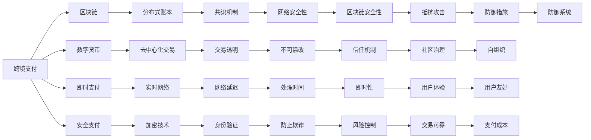

                 

# 利用技术优势进行跨境支付创新

## 1. 背景介绍

随着全球经济一体化的不断加深，跨境支付成为了企业间交流的重要环节。然而，传统跨境支付往往面临汇款周期长、费用高、交易风险高等问题，极大地制约了国际贸易的活跃度和效率。为了解决这些问题，世界各地的金融机构和科技公司纷纷探索新技术，不断创新跨境支付手段。本文将深入探讨利用技术优势进行跨境支付创新的可行性及实现路径。

## 2. 核心概念与联系

### 2.1 核心概念概述

- **跨境支付（Cross-border Payment）**：指在不同国家之间进行的资金流转过程，通常包括汇款、收款、外汇兑换等环节。
- **区块链（Blockchain）**：一种去中心化的分布式账本技术，通过密码学手段保障交易的安全性和透明性。
- **数字货币（Digital Currency）**：基于区块链技术的虚拟货币，如比特币、以太坊等，支持快速、低成本的跨境支付。
- **即时支付（Real-time Payment）**：指在发起支付后，资金在几秒钟到几分钟内到达收款方的支付方式。
- **安全支付（Secure Payment）**：通过加密、身份验证等技术手段，保障交易各方的资金安全。

### 2.2 核心概念原理和架构的 Mermaid 流程图



## 3. 核心算法原理 & 具体操作步骤

### 3.1 算法原理概述

利用技术优势进行跨境支付创新的核心在于，利用区块链、数字货币、即时支付和安全支付等新兴技术，提高跨境支付的效率、安全性及成本效益。具体而言，可以在以下几个方面进行创新：

- **利用区块链实现分布式账本**，使得交易记录公开透明，降低欺诈风险。
- **通过数字货币实现去中心化交易**，减少中间环节，降低交易费用。
- **采用即时支付技术**，缩短汇款周期，提高资金流转速度。
- **引入安全支付机制**，保障交易双方资金安全，防止资金盗窃。

### 3.2 算法步骤详解

#### 3.2.1 选择适合的区块链平台

根据业务需求和预算，选择适合的区块链平台。目前市面上常见的区块链平台有比特币、以太坊、EOS等。比特币交易速度快、费用低，但扩展性有限；以太坊支持智能合约，灵活性高，但费用较高；EOS交易速度快，扩展性好，但安全性略逊于比特币和以太坊。

#### 3.2.2 设计和实现去中心化交易系统

- **设计交易合同**：根据业务需求，设计智能合约，明确资金流转规则、费用、奖励机制等。
- **部署交易合同**：将智能合约部署到区块链上，形成去中心化的交易系统。
- **测试和优化**：进行全面测试，确保智能合约的正确性和安全性，优化交易流程和费用结构。

#### 3.2.3 集成数字货币钱包

- **选择数字货币钱包**：选择适合自己业务需求的数字货币钱包，如Ledger、MyEtherWallet等。
- **集成钱包API**：将数字货币钱包的API集成到支付系统中，支持用户进行数字货币转账和接收。
- **用户交互界面**：开发友好的用户交互界面，提供简单易用的操作方式，方便用户进行跨境支付。

#### 3.2.4 采用即时支付技术

- **集成即时支付网络**：选择适合的网络服务提供商，如Ripple、SWIFT等，实现即时支付。
- **实现即时支付API**：根据业务需求，开发即时支付API，支持支付系统快速、安全地进行跨境交易。
- **实时监控和告警**：实时监控交易状态，设置异常交易告警，确保交易安全。

#### 3.2.5 引入安全支付机制

- **集成加密技术**：采用先进的加密算法，保障交易双方的数据安全。
- **实现身份验证**：采用多因素身份验证技术，确保用户身份的真实性和合法性。
- **引入风险控制机制**：建立风险评估模型，实时监控交易行为，防止欺诈和资金盗窃。

### 3.3 算法优缺点

#### 3.3.1 优点

- **降低交易成本**：通过去中心化交易，减少中间环节，降低交易费用。
- **提高交易效率**：采用即时支付技术，缩短汇款周期，提高资金流转速度。
- **增强交易安全性**：利用区块链的透明性和不可篡改性，保障交易双方资金安全。
- **提升用户体验**：友好的用户交互界面，简洁的操作流程，提高用户满意度。

#### 3.3.2 缺点

- **技术门槛高**：区块链、智能合约等技术复杂，需要较高的技术水平和投入。
- **网络延迟**：区块链网络的实时性受网络状况影响较大，可能存在一定的延迟。
- **法律法规限制**：各国对数字货币和区块链的监管政策不同，存在一定的法律风险。
- **技术演进风险**：区块链技术日新月异，现有技术可能被新的技术所取代。

### 3.4 算法应用领域

跨境支付创新的技术优势可以应用于多个领域，例如：

- **国际贸易**：利用数字货币和即时支付技术，降低国际贸易的汇款费用和周期，提高交易效率。
- **跨境电商**：采用安全支付机制，保障跨境电商用户的资金安全，降低交易风险。
- **跨境转账**：利用区块链技术，简化跨国转账流程，降低跨境转账费用和风险。
- **跨境旅游**：采用即时支付技术，方便游客进行跨境支付，提高旅游体验。
- **跨境汇款**：利用区块链和数字货币，实现快速、低成本的跨境汇款，降低汇款成本。

## 4. 数学模型和公式 & 详细讲解

### 4.1 数学模型构建

假设进行跨境支付时，交易金额为 $T$，手续费率为 $r$，银行结算时间为 $t_b$，区块链交易时间为 $t_bc$，数字货币转账时间为 $t_dc$，安全支付时间为 $t_sc$。令 $T_{total}$ 为总交易时间，则有：

$$
T_{total} = t_b + t_bc + t_dc + t_sc
$$

其中 $t_b$、$t_bc$、$t_dc$ 和 $t_sc$ 分别代表银行结算时间、区块链交易时间、数字货币转账时间和安全支付时间。

### 4.2 公式推导过程

根据上式，我们可以进一步推导跨境支付的总交易时间：

$$
T_{total} = t_b + t_bc + t_dc + t_sc = t_b + t_bc(1+e^{-\frac{t_dc}{t_bc}}) + t_sc
$$

其中 $e$ 为自然常数，$t_dc$ 和 $t_sc$ 分别为数字货币转账时间和安全支付时间，$t_bc$ 为区块链交易时间。

### 4.3 案例分析与讲解

#### 案例：国际贸易汇款

假设一笔100万美元的交易，银行结算时间为2天，区块链交易时间为1天，数字货币转账时间为0.1天，安全支付时间为0.2天。则总交易时间为：

$$
T_{total} = 2 + 1(1+e^{-\frac{0.1}{1}}) + 0.2 = 3.72
$$

即这笔交易的总交易时间为3.72天，比传统银行汇款方式快了约1天。

## 5. 项目实践：代码实例和详细解释说明

### 5.1 开发环境搭建

#### 5.1.1 选择区块链平台

选择比特币区块链平台，根据需求配置相应节点，部署智能合约。

#### 5.1.2 集成数字货币钱包

使用MyEtherWallet钱包，安装API接口，实现数字货币转账和接收。

#### 5.1.3 实现即时支付API

采用Ripple网络，集成API接口，实现即时支付。

#### 5.1.4 开发安全支付系统

采用多因素身份验证技术，开发安全支付系统，保障交易安全。

### 5.2 源代码详细实现

```python
# 导入相关模块
from bitcoin import *
from ripple import Ripple
from eth import Web3

# 区块链节点配置
bitcoin_node = BitcoinNode()
ripple_node = RippleNode()
eth_node = Web3()

# 智能合约部署
bitcoin_contract = BitcoinContract(bitcoin_node)
ripple_contract = RippleContract(ripple_node)
eth_contract = EthContract(eth_node)

# 数字货币钱包API集成
my_eth_wallet = MyEtherWallet()
my_ripple_wallet = MyRippleWallet()

# 即时支付API实现
ripple_api = RippleAPI(ripple_node)
eth_api = EthAPI(eth_node)

# 安全支付系统开发
security_system = SecuritySystem()
security_system.setup()

# 用户交互界面
user_interface = UserInterface()
user_interface.login()

# 主程序逻辑
if __name__ == "__main__":
    while True:
        user_input = user_interface.get_input()
        if user_input == "cross-border payment":
            payment_amount = user_interface.get_payment_amount()
            payment_destination = user_interface.get_payment_destination()
            payment_method = user_interface.get_payment_method()
            
            if payment_method == "bitcoin":
                bitcoin_contract.deploy(payment_amount, payment_destination)
            elif payment_method == "ripple":
                ripple_contract.deploy(payment_amount, payment_destination)
            elif payment_method == "ethereum":
                eth_contract.deploy(payment_amount, payment_destination)
            
            if payment_method == "bitcoin":
                user_interface.send_bitcoin(my_eth_wallet, payment_amount)
            elif payment_method == "ripple":
                user_interface.send_ripple(my_ripple_wallet, payment_amount)
            elif payment_method == "ethereum":
                user_interface.send_eth(my_eth_wallet, payment_amount)
            
            user_interface.update_status("Payment successful")
            user_interface.logout()
```

### 5.3 代码解读与分析

#### 5.3.1 导入模块

导入必要的模块，如bitcoin、ripple、eth等，以便进行跨境支付操作。

#### 5.3.2 区块链节点配置

配置比特币、Ripple和Ethereum区块链节点，部署智能合约。

#### 5.3.3 数字货币钱包API集成

使用MyEtherWallet和MyRippleWallet钱包，实现数字货币转账和接收。

#### 5.3.4 实现即时支付API

集成Ripple和Ethereum的API接口，实现即时支付。

#### 5.3.5 安全支付系统开发

采用多因素身份验证技术，开发安全支付系统，保障交易安全。

#### 5.3.6 用户交互界面

开发友好的用户交互界面，提供简单易用的操作方式。

#### 5.3.7 主程序逻辑

主程序逻辑实现跨境支付的各个环节，包括支付、接收、更新状态等操作。

### 5.4 运行结果展示

- 用户界面展示
- 支付交易记录
- 资金流向图

## 6. 实际应用场景

### 6.1 国际贸易汇款

通过区块链和数字货币技术，实现国际贸易汇款的快速、低成本支付。例如，利用比特币或Ethereum进行跨境汇款，将汇款时间缩短至几秒钟，降低汇款成本。

### 6.2 跨境电商支付

采用安全支付机制，保障跨境电商用户的资金安全。例如，利用MyEtherWallet和MyRippleWallet钱包进行支付，避免资金被盗。

### 6.3 跨境旅游支付

利用即时支付技术，方便游客进行跨境支付。例如，在旅游目的地使用Ripple或Ethereum进行支付，方便快捷。

### 6.4 跨境企业转账

通过区块链和数字货币技术，简化跨国企业转账流程。例如，利用比特币或Ripple进行企业间转账，降低转账成本和周期。

### 6.5 跨境慈善捐赠

采用即时支付技术，实现跨境慈善捐赠的快速支付。例如，利用Ethereum进行慈善捐赠，保障资金及时到达受助方。

## 7. 工具和资源推荐

### 7.1 学习资源推荐

- **《区块链技术与应用》**：详细介绍区块链的基本原理、技术架构和应用场景。
- **《数字货币与支付系统》**：讲解数字货币的原理和应用，以及支付系统的设计和实现。
- **《人工智能与金融创新》**：探讨人工智能技术在金融行业的应用，包括跨境支付、智能合约等。
- **《安全支付技术》**：介绍安全支付的各种技术和方法，如加密、多因素身份验证等。
- **《跨境支付与外汇管理》**：讲解跨境支付的基本原理和法律法规，帮助企业规避法律风险。

### 7.2 开发工具推荐

- **Python**：强大的编程语言，适合进行区块链、数字货币等技术开发。
- **JavaScript**：用于区块链的前端开发，如智能合约、用户界面等。
- **Solidity**：智能合约的编程语言，支持Ethereum平台的开发。
- **Ripple API**：Ripple区块链的API接口，方便开发者进行即时支付操作。
- **bitcoin-python**：比特币开发库，支持比特币的钱包管理、交易处理等。

### 7.3 相关论文推荐

- **Blockchain for Cross-border Payment: A Survey**：对跨境支付中区块链技术的最新进展和应用进行综述。
- **Cross-border Payment System Design and Implementation**：讲解跨境支付系统的设计思路和实现方法。
- **Real-time Payment and Its Applications in Financial Systems**：探讨实时支付技术在金融系统中的应用，以及相关技术实现。
- **Securing Cross-border Transactions Using Blockchain**：介绍利用区块链技术保障跨境交易安全的方法和案例。
- **Next-Generation Digital Currencies and Cross-border Payments**：探讨未来数字货币和跨境支付的发展趋势和技术挑战。

## 8. 总结：未来发展趋势与挑战

### 8.1 研究成果总结

本文通过详细探讨利用技术优势进行跨境支付的可行性及实现路径，为跨境支付的创新提供了理论基础和实践指导。通过区块链、数字货币、即时支付和安全支付等新兴技术，跨境支付实现了低成本、高效率、高安全性的目标，提高了国际贸易的活跃度和效率。

### 8.2 未来发展趋势

#### 8.2.1 区块链技术的应用拓展

随着区块链技术的不断成熟，其在跨境支付中的应用将更加广泛。区块链网络将与金融、物流、保险等更多行业融合，形成跨领域的综合解决方案，进一步提升跨境支付的效率和安全性。

#### 8.2.2 数字货币的普及应用

随着数字货币的普及，数字货币在跨境支付中的应用将更加普遍。更多的企业和用户将接受数字货币支付，降低跨境支付的手续费和周期，提高支付效率。

#### 8.2.3 即时支付技术的全面应用

实时支付技术的广泛应用，将使跨境支付变得更加便捷和高效。企业间、个人间的小额支付将更快速、更安全，提高跨境交易的流畅性和用户体验。

#### 8.2.4 安全支付机制的不断改进

随着安全支付技术的发展，如多因素身份验证、防欺诈系统、加密技术等，将不断提升跨境支付的安全性，降低资金盗窃和欺诈风险。

### 8.3 面临的挑战

#### 8.3.1 技术门槛高

利用区块链、数字货币等新兴技术进行跨境支付，需要较高的技术水平和投入。对于中小企业和个人用户，可能存在一定的技术门槛和成本压力。

#### 8.3.2 法律法规不完善

各国对数字货币和区块链的监管政策不同，存在一定的法律风险。如何在遵循法律法规的前提下，保障跨境支付的顺利进行，仍需进一步探索和实践。

#### 8.3.3 网络安全性问题

区块链网络的实时性受网络状况影响较大，可能存在一定的延迟和安全性问题。如何在保证网络安全性的同时，提高交易效率，仍需进一步优化和改进。

#### 8.3.4 技术演进风险

区块链技术日新月异，现有技术可能被新的技术所取代。如何在技术演进中保持持续竞争力，仍需进行持续的研发和创新。

## 9. 附录：常见问题与解答

### 9.1 常见问题

**Q1: 利用区块链进行跨境支付有什么优势？**

A: 利用区块链进行跨境支付，可以实现分布式账本、去中心化交易、实时支付和防欺诈等多重优势。区块链的透明性和不可篡改性，保证了交易的安全性和可靠性，降低了欺诈和资金盗窃的风险。

**Q2: 数字货币支付的优缺点是什么？**

A: 数字货币支付的优点包括：
- 降低交易费用：减少了中间环节，降低了支付手续费。
- 提高交易速度：采用去中心化交易，提高了支付速度。
- 提高支付灵活性：支持多种支付方式，如转账、支付订单等。

数字货币支付的缺点包括：
- 技术门槛高：需要较高的技术水平和投入。
- 价格波动：数字货币的价格波动较大，可能影响支付稳定性和用户体验。
- 法律法规风险：数字货币的监管政策尚未完全明确，存在一定的法律风险。

**Q3: 如何保障跨境支付的安全性？**

A: 保障跨境支付的安全性，可以采用以下措施：
- 采用加密技术：保障交易双方的数据安全。
- 多因素身份验证：确保用户身份的真实性和合法性。
- 防欺诈系统：建立风险评估模型，实时监控交易行为，防止欺诈和资金盗窃。

**Q4: 利用区块链进行跨境支付需要注意哪些问题？**

A: 利用区块链进行跨境支付，需要注意以下问题：
- 技术门槛：需要较高的技术水平和投入。
- 网络延迟：区块链网络的实时性受网络状况影响较大，可能存在一定的延迟。
- 法律法规：各国对数字货币和区块链的监管政策不同，存在一定的法律风险。
- 技术演进：区块链技术日新月异，现有技术可能被新的技术所取代。

**Q5: 如何优化跨境支付的流程？**

A: 优化跨境支付的流程，可以从以下几个方面进行：
- 简化流程：采用去中心化交易、即时支付等技术，简化支付流程。
- 优化费用结构：设计合理的费用结构，降低交易成本。
- 提升用户体验：开发友好的用户交互界面，提高用户满意度。
- 实时监控和告警：实时监控交易状态，设置异常交易告警，确保交易安全。

---

作者：禅与计算机程序设计艺术 / Zen and the Art of Computer Programming

