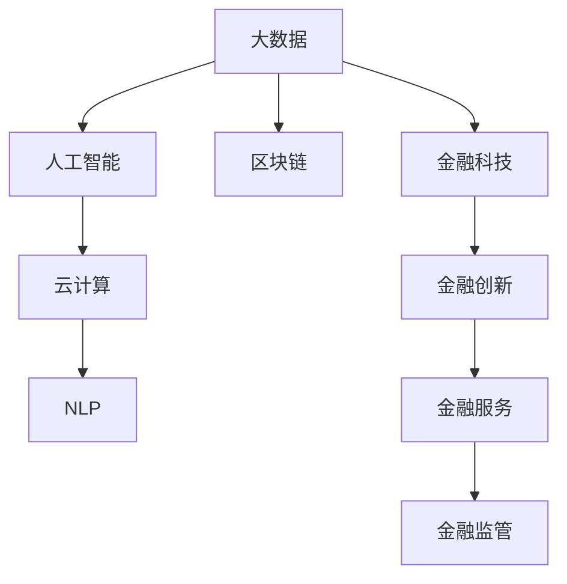

                 

## 1. 背景介绍

### 1.1 问题由来
随着金融科技的快速发展，金融机构面临着前所未有的机遇和挑战。传统金融机构在产品设计、风险控制、客户服务等方面依赖于大量人工，效率低下，难以满足现代金融市场的需求。而金融科技（FinTech）的兴起，为金融领域带来了基于大数据、人工智能等技术的新型解决方案，极大地提升了金融服务的效率和水平。

### 1.2 问题核心关键点
金融科技的核心在于将先进技术应用于金融领域，创新金融产品和服务，提高金融服务的智能化和自动化水平。在大数据、云计算、人工智能等技术的驱动下，金融科技正逐步改变传统的金融模式，提升金融业的运行效率，推动金融业转型升级。

然而，金融科技也面临着数据隐私保护、算法透明度、系统安全等诸多挑战。因此，如何通过技术优势进行金融创新，同时兼顾安全性和合规性，成为金融科技研究的关键问题。

### 1.3 问题研究意义
金融科技的创新应用，不仅能够提升金融服务的效率和质量，还能推动金融普惠，为传统金融服务难以覆盖的人群提供便利。通过金融科技的助力，金融机构可以更好地实现风险控制和客户管理，提升市场竞争力。

此外，金融科技还为金融监管提供了新的工具和方法，通过实时监测和数据分析，提高监管效率和精准度，防范金融风险。

## 2. 核心概念与联系

### 2.1 核心概念概述

为更好地理解金融科技技术在金融创新中的应用，本节将介绍几个密切相关的核心概念：

- 金融科技（FinTech）：利用大数据、人工智能、区块链、云计算等技术，创新金融产品和服务，提升金融服务的效率和质量。
- 大数据（Big Data）：指海量、多源、异构的数据，利用数据挖掘、机器学习等技术，提取有价值的信息，辅助金融决策。
- 人工智能（AI）：通过机器学习、深度学习等技术，构建智能金融系统，实现自动化交易、智能风控等应用。
- 区块链（Blockchain）：一种分布式账本技术，具有去中心化、不可篡改等特点，可以用于金融资产的透明交易和管理。
- 云计算（Cloud Computing）：通过公有云、私有云、混合云等形式，提供计算、存储、网络等资源，实现金融服务的弹性扩展和高效管理。
- 自然语言处理（NLP）：通过机器翻译、情感分析、实体识别等技术，提升金融信息的处理和分析能力。

这些核心概念之间的逻辑关系可以通过以下Mermaid流程图来展示：



这个流程图展示了大数据、人工智能、区块链、云计算、NLP等技术之间的逻辑关系：

1. 大数据为人工智能提供了数据支撑，帮助构建智能金融系统。
2. 人工智能提升了大数据处理和分析的效率和准确性，增强了金融决策的智能化。
3. 区块链提供了透明、不可篡改的交易记录，提高了金融交易的安全性和可靠性。
4. 云计算提供了计算和存储资源，支持金融服务的弹性扩展和高效管理。
5. NLP技术增强了金融信息的处理和分析能力，提升了金融服务的智能化水平。
6. 金融科技通过集成这些技术，实现金融服务的创新，提升金融服务的效率和质量。
7. 金融创新直接促进了金融服务的发展，提高了金融服务的普惠性。
8. 金融监管利用金融科技工具，提高监管效率和精准度，防范金融风险。

## 3. 核心算法原理 & 具体操作步骤

### 3.1 算法原理概述

基于技术优势的金融科技创新，主要依赖于大数据、人工智能等技术，通过算法模型优化和智能系统构建，实现金融服务的智能化和自动化。金融科技的核心算法包括：

1. 机器学习：利用历史数据构建预测模型，实现风险评估、信用评分等金融应用。
2. 深度学习：通过神经网络构建复杂的金融模型，实现自动化交易、智能风控等应用。
3. 自然语言处理：通过文本分析技术，实现金融信息的处理和分析，辅助金融决策。
4. 区块链：通过分布式账本技术，实现金融资产的透明交易和管理。
5. 云计算：通过弹性计算资源，支持金融服务的弹性扩展和高效管理。

### 3.2 算法步骤详解

基于技术优势的金融科技创新，主要包括以下几个关键步骤：

**Step 1: 数据准备**
- 收集和整理金融数据，包括历史交易数据、市场数据、客户信息等。
- 清洗和标注数据，去除噪音和异常值，构建有意义的特征。

**Step 2: 模型构建**
- 选择合适的算法模型，如线性回归、决策树、随机森林、深度神经网络等。
- 使用机器学习框架，如TensorFlow、PyTorch等，构建预测模型。
- 利用历史数据进行模型训练和验证，选择最优模型。

**Step 3: 模型评估与优化**
- 在测试集上评估模型的性能指标，如准确率、召回率、F1值等。
- 根据评估结果，调整模型参数，优化模型性能。
- 进行模型调优，防止过拟合和欠拟合。

**Step 4: 应用部署**
- 将训练好的模型部署到生产环境中，集成到金融系统的各个环节。
- 监控模型性能，实时收集反馈数据。
- 根据反馈数据，持续改进模型和系统。

**Step 5: 安全合规**
- 确保模型符合监管要求，遵守相关法律法规。
- 对数据隐私和安全进行保护，防止数据泄露和滥用。
- 对系统进行安全加固，防止网络攻击和恶意行为。

### 3.3 算法优缺点

基于技术优势的金融科技创新，具有以下优点：
1. 提升效率和质量：通过智能化和自动化技术，大幅提升金融服务的效率和质量。
2. 降低成本：自动化流程减少了人工操作和错误，降低了运营成本。
3. 提高精准度：通过大数据和机器学习，实现精准的风险评估和信用评分。
4. 增强普惠性：通过金融科技创新，为传统金融服务难以覆盖的人群提供便利。

同时，这些算法也存在一定的局限性：
1. 数据质量要求高：模型性能依赖于高质量的数据，数据质量不佳会影响模型效果。
2. 模型复杂度高：深度学习和复杂算法模型，需要较强的计算资源和技术支持。
3. 风险难以完全消除：金融科技带来的自动化和智能化，无法完全消除金融风险，仍需人工监管。
4. 技术依赖性强：对技术的掌握和应用要求高，技术障碍可能影响应用效果。
5. 隐私保护难度大：金融数据的敏感性要求，对隐私保护提出了更高的要求。

尽管存在这些局限性，但金融科技作为创新金融服务的重要手段，其优势和潜力仍然不可忽视。未来相关研究将更多关注于如何降低技术应用的门槛，提高数据质量，加强隐私保护，提升模型的鲁棒性等方向。

### 3.4 算法应用领域

基于技术优势的金融科技创新，已在多个金融场景中得到广泛应用，例如：

- **信用评分**：通过历史交易数据和客户信息，构建信用评分模型，辅助金融机构进行贷款审批和信用评估。
- **风险评估**：利用大数据和机器学习模型，实时监测和评估金融市场风险，帮助投资者做出决策。
- **智能投顾**：通过智能算法和自然语言处理技术，构建自动化投资顾问系统，提供个性化的投资建议。
- **智能风控**：利用深度学习和区块链技术，构建智能风控系统，防范金融欺诈和洗钱行为。
- **智能客服**：通过自然语言处理和智能对话技术，构建智能客服系统，提供24/7的金融服务。
- **支付结算**：通过区块链和分布式账本技术，构建去中心化的支付结算系统，提高支付的透明度和安全性。
- **金融市场分析**：利用大数据和深度学习技术，分析市场走势，提供投资策略和市场预测。

除了上述这些经典应用外，金融科技还在资产管理、保险、理财、保险等领域不断创新，为金融服务带来更多可能。

## 4. 数学模型和公式 & 详细讲解

### 4.1 数学模型构建

在金融科技创新过程中，常见的数学模型和公式包括：

- **线性回归模型**：用于预测连续型变量的模型，公式为：$y = \beta_0 + \beta_1 x_1 + \beta_2 x_2 + ... + \beta_n x_n + \epsilon$，其中 $y$ 为预测变量，$x_i$ 为特征变量，$\beta_i$ 为系数，$\epsilon$ 为误差项。

- **逻辑回归模型**：用于分类预测的模型，公式为：$P(y=1) = \frac{1}{1+e^{-\hat{y}}}$，其中 $\hat{y}$ 为预测变量，$y$ 为真实标签。

- **决策树模型**：用于分类和回归预测的树形结构模型，公式为：$T = \{(x, y, B_t, T_l, T_r)\}$，其中 $x$ 为样本，$y$ 为标签，$B_t$ 为决策树节点，$T_l$ 和 $T_r$ 为左右子树。

- **随机森林模型**：通过集成多棵决策树，提高模型的泛化能力和鲁棒性，公式为：$y = \frac{1}{m}\sum_{i=1}^m f_i(x)$，其中 $m$ 为决策树数量，$f_i(x)$ 为第 $i$ 棵树的预测结果。

- **深度神经网络模型**：通过多层神经元组成的非线性模型，公式为：$y = \sigma(Wx + b)$，其中 $x$ 为输入向量，$W$ 为权重矩阵，$b$ 为偏置项，$\sigma$ 为激活函数。

### 4.2 公式推导过程

以下是几个关键模型的公式推导过程：

**线性回归模型推导**：
假设 $y$ 为连续型变量，$x_i$ 为 $n$ 个特征变量，$\beta_i$ 为特征系数，$\epsilon$ 为误差项，则线性回归模型的公式为：

$$
y = \beta_0 + \beta_1 x_1 + \beta_2 x_2 + ... + \beta_n x_n + \epsilon
$$

其中，$\beta_i$ 的估计值为：

$$
\hat{\beta_i} = \frac{\sum_{j=1}^N (x_{ij}y_j - \bar{x}_i\bar{y})}{\sum_{j=1}^N (x_{ij}^2 - \bar{x_i}^2)}
$$

其中，$\bar{x_i}$ 和 $\bar{y}$ 分别为特征变量和标签的均值。

**逻辑回归模型推导**：
假设 $y$ 为二分类变量，$x$ 为输入特征，$P(y=1)$ 为 $y=1$ 的概率，则逻辑回归模型的公式为：

$$
P(y=1) = \frac{1}{1+e^{-\hat{y}}}
$$

其中，$\hat{y}$ 为线性模型的预测结果，即：

$$
\hat{y} = \beta_0 + \beta_1 x_1 + \beta_2 x_2 + ... + \beta_n x_n
$$

**决策树模型推导**：
决策树模型通过递归地对数据集进行划分，构建一棵树形结构，公式为：

$$
T = \{(x, y, B_t, T_l, T_r)\}
$$

其中，$x$ 为样本，$y$ 为标签，$B_t$ 为决策树节点，$T_l$ 和 $T_r$ 为左右子树。

**随机森林模型推导**：
随机森林模型通过集成多棵决策树，提高模型的泛化能力和鲁棒性，公式为：

$$
y = \frac{1}{m}\sum_{i=1}^m f_i(x)
$$

其中，$m$ 为决策树数量，$f_i(x)$ 为第 $i$ 棵树的预测结果。

**深度神经网络模型推导**：
深度神经网络模型通过多层神经元组成的非线性模型，公式为：

$$
y = \sigma(Wx + b)
$$

其中，$x$ 为输入向量，$W$ 为权重矩阵，$b$ 为偏置项，$\sigma$ 为激活函数。

### 4.3 案例分析与讲解

**案例分析：信用评分模型**

以信用评分模型为例，分析其构建和应用过程：

**1. 数据准备**
- 收集客户的个人信息、历史交易记录、信用记录等数据。
- 清洗和标注数据，去除噪音和异常值，构建有意义的特征。

**2. 模型构建**
- 选择逻辑回归模型作为基础模型。
- 使用机器学习框架，如TensorFlow、PyTorch等，构建预测模型。
- 使用历史数据进行模型训练和验证，选择最优模型。

**3. 模型评估与优化**
- 在测试集上评估模型的性能指标，如准确率、召回率、F1值等。
- 根据评估结果，调整模型参数，优化模型性能。
- 进行模型调优，防止过拟合和欠拟合。

**4. 应用部署**
- 将训练好的模型部署到生产环境中，集成到金融系统的贷款审批流程。
- 监控模型性能，实时收集反馈数据。
- 根据反馈数据，持续改进模型和系统。

**5. 安全合规**
- 确保模型符合监管要求，遵守相关法律法规。
- 对数据隐私和安全进行保护，防止数据泄露和滥用。
- 对系统进行安全加固，防止网络攻击和恶意行为。

通过信用评分模型的构建和应用，金融机构能够实现自动化贷款审批和风险控制，提升贷款审批效率和决策准确性。同时，通过持续优化和监控，保证模型的稳定性和可靠性。

## 5. 项目实践：代码实例和详细解释说明

### 5.1 开发环境搭建

在进行金融科技创新项目开发前，需要准备好开发环境。以下是使用Python进行TensorFlow开发的环境配置流程：

1. 安装Anaconda：从官网下载并安装Anaconda，用于创建独立的Python环境。

2. 创建并激活虚拟环境：
```bash
conda create -n tf-env python=3.8 
conda activate tf-env
```

3. 安装TensorFlow：根据CUDA版本，从官网获取对应的安装命令。例如：
```bash
conda install tensorflow -c conda-forge
```

4. 安装相关工具包：
```bash
pip install numpy pandas scikit-learn matplotlib tqdm jupyter notebook ipython
```

完成上述步骤后，即可在`tf-env`环境中开始项目开发。

### 5.2 源代码详细实现

下面以信用评分模型为例，给出使用TensorFlow对模型进行训练和部署的PyTorch代码实现。

首先，定义信用评分模型的数据处理函数：

```python
import tensorflow as tf
from tensorflow.keras import layers

class CreditScoreModel(tf.keras.Model):
    def __init__(self, input_dim, output_dim):
        super(CreditScoreModel, self).__init__()
        self.fc1 = layers.Dense(32, activation='relu')
        self.fc2 = layers.Dense(16, activation='relu')
        self.fc3 = layers.Dense(output_dim, activation='sigmoid')
    
    def call(self, x):
        x = self.fc1(x)
        x = self.fc2(x)
        x = self.fc3(x)
        return x
```

然后，定义数据集和模型：

```python
from sklearn.model_selection import train_test_split
from sklearn.preprocessing import StandardScaler

# 加载数据集
X_train, X_test, y_train, y_test = train_test_split(X, y, test_size=0.2, random_state=42)
scaler = StandardScaler()
X_train = scaler.fit_transform(X_train)
X_test = scaler.transform(X_test)

# 定义模型
model = CreditScoreModel(input_dim=X_train.shape[1], output_dim=1)
model.compile(optimizer=tf.keras.optimizers.Adam(0.001), loss='binary_crossentropy', metrics=['accuracy'])

# 训练模型
history = model.fit(X_train, y_train, epochs=10, batch_size=32, validation_data=(X_test, y_test))
```

最后，在测试集上评估模型：

```python
from sklearn.metrics import classification_report

# 评估模型
y_pred = model.predict(X_test)
y_pred = (y_pred > 0.5).astype(int)
print(classification_report(y_test, y_pred))
```

以上就是使用TensorFlow对信用评分模型进行训练和部署的完整代码实现。可以看到，TensorFlow提供了丰富的机器学习框架，可以方便地进行模型构建和训练。

### 5.3 代码解读与分析

让我们再详细解读一下关键代码的实现细节：

**CreditScoreModel类**：
- `__init__`方法：初始化模型的层结构。
- `call`方法：定义模型的前向传播过程，通过多层全连接层进行特征提取和输出预测。

**数据处理函数**：
- 使用`train_test_split`函数将数据集划分为训练集和测试集。
- 使用`StandardScaler`对特征进行标准化处理，提高模型训练的稳定性和收敛速度。

**模型训练**：
- 使用`model.fit`函数进行模型训练，设定训练轮数和批次大小。
- 在训练过程中，每轮训练后计算验证集上的损失和准确率。

**模型评估**：
- 使用`model.predict`函数对测试集进行预测，使用`classification_report`函数计算模型评估指标。

通过信用评分模型的构建和应用，可以看到金融科技创新项目中代码实现的流程和细节。开发者可以通过该代码实现，进一步优化模型结构，提高模型性能，实现更精准的信用评分。

## 6. 实际应用场景

### 6.1 智能投顾

智能投顾（Robo-Advisors）是金融科技创新的一个重要方向，通过智能算法和自然语言处理技术，构建自动化投资顾问系统，提供个性化的投资建议。

**1. 数据准备**
- 收集和整理投资市场数据、客户个人信息、历史交易记录等数据。
- 清洗和标注数据，去除噪音和异常值，构建有意义的特征。

**2. 模型构建**
- 选择深度神经网络模型作为基础模型。
- 使用机器学习框架，如TensorFlow、PyTorch等，构建预测模型。
- 使用历史数据进行模型训练和验证，选择最优模型。

**3. 模型评估与优化**
- 在测试集上评估模型的性能指标，如准确率、召回率、F1值等。
- 根据评估结果，调整模型参数，优化模型性能。
- 进行模型调优，防止过拟合和欠拟合。

**4. 应用部署**
- 将训练好的模型部署到生产环境中，集成到金融系统的投资顾问系统。
- 监控模型性能，实时收集反馈数据。
- 根据反馈数据，持续改进模型和系统。

**5. 安全合规**
- 确保模型符合监管要求，遵守相关法律法规。
- 对数据隐私和安全进行保护，防止数据泄露和滥用。
- 对系统进行安全加固，防止网络攻击和恶意行为。

通过智能投顾系统的构建和应用，客户可以享受到个性化的投资建议，提高投资收益。同时，通过持续优化和监控，保证系统的稳定性和可靠性。

### 6.2 智能风控

智能风控（Fraud Detection）是金融科技创新的另一个重要方向，通过深度学习和区块链技术，构建智能风控系统，防范金融欺诈和洗钱行为。

**1. 数据准备**
- 收集和整理金融交易数据、客户行为数据等数据。
- 清洗和标注数据，去除噪音和异常值，构建有意义的特征。

**2. 模型构建**
- 选择深度神经网络模型作为基础模型。
- 使用机器学习框架，如TensorFlow、PyTorch等，构建预测模型。
- 使用历史数据进行模型训练和验证，选择最优模型。

**3. 模型评估与优化**
- 在测试集上评估模型的性能指标，如准确率、召回率、F1值等。
- 根据评估结果，调整模型参数，优化模型性能。
- 进行模型调优，防止过拟合和欠拟合。

**4. 应用部署**
- 将训练好的模型部署到生产环境中，集成到金融系统的风控系统。
- 监控模型性能，实时收集反馈数据。
- 根据反馈数据，持续改进模型和系统。

**5. 安全合规**
- 确保模型符合监管要求，遵守相关法律法规。
- 对数据隐私和安全进行保护，防止数据泄露和滥用。
- 对系统进行安全加固，防止网络攻击和恶意行为。

通过智能风控系统的构建和应用，金融机构可以实时监测和防范金融欺诈和洗钱行为，提升金融交易的安全性和可靠性。同时，通过持续优化和监控，保证系统的稳定性和可靠性。

## 7. 工具和资源推荐

### 7.1 学习资源推荐

为了帮助开发者系统掌握金融科技技术，这里推荐一些优质的学习资源：

1. **《深度学习与金融科技》**：一本详细介绍深度学习在金融领域应用的书籍，涵盖信用评分、风险评估、智能投顾等多个方向。

2. **CS229《机器学习》课程**：斯坦福大学开设的机器学习明星课程，有Lecture视频和配套作业，提供机器学习的理论基础和实践技巧。

3. **《Python for Finance》**：一本介绍Python在金融领域应用的书籍，涵盖金融数据处理、量化交易、金融模型等多个方向。

4. **Kaggle金融竞赛**：Kaggle平台上的金融竞赛项目，提供丰富的金融数据集和挑战，提升金融数据处理和建模能力。

5. **Coursera《金融科技》课程**：Coursera平台上开设的金融科技课程，提供金融科技的基础知识和前沿技术。

通过学习这些资源，相信你一定能够系统掌握金融科技技术的理论基础和实践技巧，实现金融科技创新。

### 7.2 开发工具推荐

高效的开发离不开优秀的工具支持。以下是几款用于金融科技创新开发的常用工具：

1. **Jupyter Notebook**：一个交互式的数据分析和编程工具，支持多种编程语言，方便进行数据探索和模型调试。

2. **TensorBoard**：一个可视化工具，实时监测模型训练状态，并提供丰富的图表呈现方式，方便调试模型和优化训练。

3. **PyTorch Lightning**：一个基于PyTorch的深度学习框架，支持快速迭代模型训练，并提供了丰富的工具和插件，方便模型部署和监控。

4. **Grafana**：一个数据可视化工具，可以实时展示系统的各种指标和趋势，帮助监控系统性能和优化。

5. **HuggingFace Transformers**：一个自然语言处理库，集成了多种预训练语言模型，支持模型的微调和应用，方便进行NLP相关项目开发。

通过合理利用这些工具，可以显著提升金融科技创新项目的开发效率，加快技术迭代和应用部署的步伐。

### 7.3 相关论文推荐

金融科技的研究离不开学界的持续支持。以下是几篇奠基性的相关论文，推荐阅读：

1. **《TensorFlow: A System for Large-Scale Machine Learning》**：Google开发的一个开源机器学习框架，支持大规模深度学习模型的训练和部署。

2. **《金融数据挖掘与机器学习》**：一本详细介绍金融数据挖掘和机器学习应用的书籍，涵盖信用评分、风险评估、智能投顾等多个方向。

3. **《深度学习在金融市场中的角色》**：一篇综述性论文，总结了深度学习在金融市场中的各类应用，包括量化交易、金融风险评估等。

4. **《机器学习在金融风险管理中的应用》**：一篇研究性论文，探讨了机器学习在金融风险管理中的各类应用，包括信用评分、风险评估、智能投顾等。

5. **《区块链技术在金融领域的应用》**：一篇研究性论文，探讨了区块链技术在金融领域的应用，包括去中心化支付、智能合约等。

通过阅读这些前沿成果，可以帮助研究者把握金融科技的发展方向，激发更多的创新灵感。

## 8. 总结：未来发展趋势与挑战

### 8.1 总结

本文对基于技术优势的金融科技创新进行了全面系统的介绍。首先阐述了金融科技在金融服务中的应用背景和意义，明确了金融科技对提升金融服务效率和质量的重要价值。其次，从原理到实践，详细讲解了金融科技的核心算法和操作步骤，给出了金融科技创新项目开发的完整代码实例。同时，本文还广泛探讨了金融科技创新在智能投顾、智能风控等多个金融场景中的应用，展示了金融科技技术的广泛应用前景。此外，本文精选了金融科技技术的各类学习资源，力求为读者提供全方位的技术指引。

通过本文的系统梳理，可以看到，基于技术优势的金融科技创新在金融服务中具有巨大的应用潜力，可以显著提升金融服务的效率和质量，推动金融普惠和市场竞争力的提升。未来，随着技术的不断演进和应用的深入，金融科技技术将会在更多领域得到广泛应用，为金融业的发展注入新的活力。

### 8.2 未来发展趋势

展望未来，基于技术优势的金融科技创新将呈现以下几个发展趋势：

1. **人工智能与金融深度融合**：人工智能技术在金融领域的应用将更加广泛和深入，通过深度学习、自然语言处理等技术，构建智能金融系统，提升金融服务的智能化和自动化水平。

2. **区块链技术的广泛应用**：区块链技术在金融领域的应用将不断扩展，涵盖去中心化支付、智能合约、供应链金融等多个方向，提升金融交易的安全性和透明度。

3. **大数据的深度挖掘**：大数据技术在金融领域的应用将更加深入，通过数据挖掘和分析，提供更精准的金融决策支持，提升金融服务的精准度和个性化水平。

4. **金融科技的国际合作**：随着金融科技的国际化进程加快，国际合作将更加紧密，跨国金融科技项目和跨国金融服务也将得到更多应用。

5. **金融科技的伦理与合规**：金融科技技术的广泛应用，也将带来更多的伦理和合规问题，如何在技术应用中平衡隐私保护、公平性、安全性等将是重要的研究课题。

6. **金融科技的可持续发展**：金融科技技术的广泛应用，也将带来环境和社会问题，如何在技术应用中实现可持续发展将是重要的研究方向。

以上趋势凸显了金融科技技术的广阔前景。这些方向的探索发展，必将进一步提升金融科技技术的应用效果，推动金融业向更高效、更普惠、更安全的方向发展。

### 8.3 面临的挑战

尽管金融科技创新技术具备诸多优势，但在其发展过程中，也面临着诸多挑战：

1. **技术复杂度高**：金融科技涉及的数据量庞大、问题复杂，技术门槛较高，需要较高的技术储备和经验积累。

2. **数据隐私和安全问题**：金融数据的敏感性要求，对隐私保护提出了更高的要求，需要加强数据安全防护。

3. **合规和监管问题**：金融科技的应用涉及多个法规和监管要求，需要严格遵守相关法律法规，防止合规风险。

4. **人才缺乏问题**：金融科技领域的人才需求量大，但相关人才供给不足，需要加强人才培养和引进。

5. **系统安全问题**：金融科技系统面临网络攻击和恶意行为的风险，需要加强系统安全加固和监控。

6. **数据质量问题**：金融科技的应用依赖于高质量的数据，数据质量不佳会影响模型效果。

尽管存在这些挑战，但金融科技创新技术的优势和潜力不可忽视。未来研究需要在技术复杂度、数据隐私、合规监管、人才培养、系统安全、数据质量等多个方面进行综合优化，以推动金融科技创新技术的健康发展。

### 8.4 研究展望

面向未来，金融科技创新技术的研究需要在以下几个方向进行深入探索：

1. **提升技术易用性**：降低技术应用的门槛，使更多金融机构能够便捷地应用金融科技创新技术。

2. **优化数据隐私保护**：加强数据隐私和安全保护，确保数据使用符合法律法规。

3. **强化合规监管**：加强金融科技创新技术的合规监管，防止合规风险。

4. **加强人才培养**：加强金融科技人才的培养和引进，提升金融科技应用的广度和深度。

5. **提高系统安全**：加强金融科技创新系统的安全加固和监控，防止网络攻击和恶意行为。

6. **优化数据质量**：加强数据质量控制和治理，提升金融科技创新技术的应用效果。

这些研究方向将推动金融科技创新技术的健康发展，为金融业的转型升级和可持续发展提供坚实的技术支撑。

## 9. 附录：常见问题与解答

**Q1：金融科技创新技术的优势和潜力是什么？**

A: 金融科技创新技术具有以下优势和潜力：
1. 提升效率和质量：通过智能化和自动化技术，大幅提升金融服务的效率和质量。
2. 降低成本：自动化流程减少了人工操作和错误，降低了运营成本。
3. 提高精准度：通过大数据和机器学习，实现精准的风险评估和信用评分。
4. 增强普惠性：通过金融科技创新，为传统金融服务难以覆盖的人群提供便利。

**Q2：金融科技创新技术在实际应用中需要注意哪些问题？**

A: 金融科技创新技术在实际应用中需要注意以下问题：
1. 技术复杂度高：金融科技涉及的数据量庞大、问题复杂，技术门槛较高，需要较高的技术储备和经验积累。
2. 数据隐私和安全问题：金融数据的敏感性要求，对隐私保护提出了更高的要求，需要加强数据安全防护。
3. 合规和监管问题：金融科技的应用涉及多个法规和监管要求，需要严格遵守相关法律法规。
4. 人才缺乏问题：金融科技领域的人才需求量大，但相关人才供给不足，需要加强人才培养和引进。
5. 系统安全问题：金融科技系统面临网络攻击和恶意行为的风险，需要加强系统安全加固和监控。
6. 数据质量问题：金融科技的应用依赖于高质量的数据，数据质量不佳会影响模型效果。

**Q3：如何确保金融科技创新技术的稳定性和可靠性？**

A: 确保金融科技创新技术的稳定性和可靠性，需要从以下几个方面进行优化：
1. 持续优化和监控：通过持续优化和监控，保证模型的稳定性和可靠性。
2. 数据质量控制：加强数据质量控制和治理，提升金融科技创新技术的应用效果。
3. 安全加固和监控：加强金融科技创新系统的安全加固和监控，防止网络攻击和恶意行为。
4. 合规监管：加强金融科技创新技术的合规监管，防止合规风险。

**Q4：如何提升金融科技创新技术的易用性？**

A: 提升金融科技创新技术的易用性，需要从以下几个方面进行优化：
1. 降低技术门槛：通过简化技术应用流程和提供工具支持，降低技术应用的门槛。
2. 提供培训和支持：提供培训和支持，帮助用户快速上手金融科技创新技术。
3. 优化用户体验：通过优化用户界面和功能设计，提升用户体验。

**Q5：如何提升金融科技创新技术的数据质量？**

A: 提升金融科技创新技术的数据质量，需要从以下几个方面进行优化：
1. 数据清洗和预处理：通过数据清洗和预处理，去除噪音和异常值，构建有意义的特征。
2. 数据标注和标准化：通过数据标注和标准化，提升数据质量。
3. 数据融合和集成：通过数据融合和集成，提升数据的时效性和完整性。

通过优化数据质量，可以提升金融科技创新技术的应用效果，确保技术应用的可靠性和稳定性。

---

作者：禅与计算机程序设计艺术 / Zen and the Art of Computer Programming

